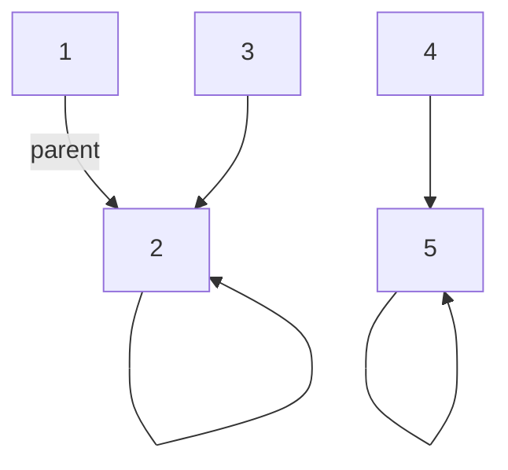

# Union-Find (Disjoint Set)

Union-Find (DSU) elementlərin hansı qruplara (set-lərə) aid olduğunu izləmək və iki elementi birləşdirmək üçün istifadə olunur.
Əsas əməliyyatlar:
- find(x): x elementinin nümayəndəsini (root) qaytarır
- union(x, y): x və y set-lərini birləşdirir

Optimallaşdırmalar:
- Path Compression: find zamanı parent-ları birbaşa root-a bağlayır
- Union by Rank/Size: kiçik ağacı böyük ağacın altına birləşdirir



## Java İmplementasiya

<details>
<summary>Koda bax</summary>

```java
import java.util.*;

public class UnionFind {
    private int[] parent;
    private int[] rank; // və ya size

    public UnionFind(int n) {
        parent = new int[n];
        rank = new int[n];
        for (int i = 0; i < n; i++) {
            parent[i] = i;
            rank[i] = 0;
        }
    }

    public int find(int x) {
        if (parent[x] != x) {
            parent[x] = find(parent[x]); // path compression
        }
        return parent[x];
    }

    public boolean union(int a, int b) {
        int ra = find(a), rb = find(b);
        if (ra == rb) return false;
        if (rank[ra] < rank[rb]) {
            parent[ra] = rb;
        } else if (rank[ra] > rank[rb]) {
            parent[rb] = ra;
        } else {
            parent[rb] = ra;
            rank[ra]++;
        }
        return true;
    }
}
```

</details>

İstifadə nümunəsi: komponentlərin sayını tapmaq, cycle detection (Kruskal), əlaqəli qruplar (friends, islands).