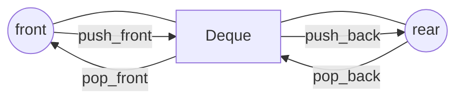

# Deque (Double-Ended Queue)

Deque həm ön (front), həm də arxa (rear) tərəfdən element əlavə/silmə əməliyyatlarını O(1) amortizə olunmuş vaxtda dəstəkləyir.

İstifadə halları:
- Sliding window problemləri
- Monotonic queue
- BFS-də 0-1 weight qraf (0-1 BFS)



## Java-da İstifadə (ArrayDeque)

<details>
<summary>Koda bax</summary>

```java
import java.util.*;

public class DequeUsage {
    public static void main(String[] args) {
        Deque<Integer> dq = new ArrayDeque<>();
        dq.addFirst(1); // push_front
        dq.addLast(2);  // push_back
        System.out.println(dq.removeFirst()); // pop_front -> 1
        System.out.println(dq.removeLast());  // pop_back  -> 2
    }
}
```

</details>

## Qısa Custom İmplementasiya (Düyməli Siyahı)

<details>
<summary>Koda bax</summary>

```java
public class IntDeque {
    private static class Node { int v; Node prev, next; Node(int v){this.v=v;} }
    private Node head, tail; int size;

    public void addFirst(int v){
        Node n = new Node(v);
        if (head == null) head = tail = n;
        else { n.next = head; head.prev = n; head = n; }
        size++;
    }
    public void addLast(int v){
        Node n = new Node(v);
        if (tail == null) head = tail = n;
        else { tail.next = n; n.prev = tail; tail = n; }
        size++;
    }
    public int removeFirst(){
        if (head == null) throw new NoSuchElementException();
        int v = head.v; head = head.next; if (head!=null) head.prev=null; else tail=null; size--; return v;
    }
    public int removeLast(){
        if (tail == null) throw new NoSuchElementException();
        int v = tail.v; tail = tail.prev; if (tail!=null) tail.next=null; else head=null; size--; return v;
    }
    public int size(){ return size; }
}
```

</details>

Qeyd: Praktikada Java-da ArrayDeque performans və sadəlik baxımından əksər hallarda kifayətdir.