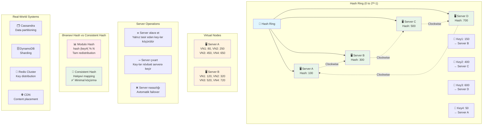

# Consistent Hashing
Consistent Hashing paylanmış sistemlərdə serverlərin əlavə edilməsi və ya çıxarılması zamanı minimal data yenidən paylaşdırma təmin edən hash üsuludur. Bu üsul həlqəvi struktur istifadə edərək scale etmə problemlərini həll edir.

### Nə üçün lazımdır?
- **Minimal data köçürmə:** Server dəyişikliklərində az məlumat yenidən paylaşdırılır
- **Scale etmə asanlığı:** Yeni serverlər əlavə etmək və çıxarmaq sadədir
- **Fault tolerance:** Server nasazlığında sistem işləməyə davam edir
- **Load balancing:** Məlumatları serverlər arasında bərabər paylaşdırır
- **Cache efficiency:** Cache miss-lərini minimuma endirir

### Ənənəvi Hash Problemləri
- **Tam redistribution:** Server sayı dəyişəndə bütün data köçürülməli olur
- **Cache miss storm:** Bütün cache-lər invalid olur və DB-yə yük düşür
- **Scale çətinliyi:** Yeni server əlavə etmək böyük əməliyyat tələb edir
- **Hotspot yaranması:** Bəzi serverlərə çox yük düşür

### Hash Ring İş Prinsipi
- **Həlqəvi struktur:** 0-dan 2³²-1-ə qədər həlqəvi fəza
- **Server yerləşdirmə:** Hər server həlqədə təsadüfi nöqtədə yerləşir
- **Key mapping:** Açar həlqədə yerləşir və saat əqrəbi istiqamətində ilk serverə yönəlir
- **Clockwise axtarış:** Key-dən başlayaraq saat əqrəbi istiqamətində ilk server tapılır

### Virtual Nodes (VNodes)
- **Çox nöqtə:** Hər server həlqədə çoxlu nöqtədə təmsil olunur
- **Bərabər paylaşma:** Load daha bərabər paylaşdırılır
- **Elastiklik:** Server əlavə/çıxarılanda yük bərabər paylanır
- **Hash variations:** DB1-vn1, DB1-vn2 kimi müxtəlif hash-lər

### Həyata Keçirmə Addımları
- **Hash funksiya seçmək:** MD5, SHA-1, SHA-256
- **Hash ring təyin etmək:** 2³² ölçüsündə həlqə
- **Serverləri yerləşdirmək:** Hash(server_id) ilə mövqe təyin etmək
- **Key mapping:** Hash(key) ilə server tapmaq
- **Server əlavə/çıxarma:** Yalnız təsir edən key-ləri yenidən mapping

### Real World İstifadə
- **Apache Cassandra:** Data distribution üçün
- **Amazon DynamoDB:** Sharding üçün
- **Redis Cluster:** Key partitioning üçün
- **CDN-lər:** Content distribution üçün
- **Load Balancers:** Session persistence üçün

### Üstünlüklər və Mənfi Cəhətləri
**Üstünlüklər:**
- Minimal key remapping
- Horizontal scalability
- Fault tolerance
- Load balancing

**Mənfi cəhətlər:**
- Key ordering itir
- Hash function mürəkkəbliyi
- Virtual node konfiqurasiya
- Memory overhead

### Əsas Problemlər
- **Hash function quality:** Pis hash hotspot yaradır → Yaxşı hash (SHA-256) istifadə et
- **Virtual node sayı:** Az vnode load imbalance yaradır → Hər server üçün 100-200 vnode
- **Server failure:** Məlumat itkisi → Replication factor artır (RF=3)
- **Network partitions:** Ring inconsistency → Gossip protocol işlət  
- **Key hotspots:** Bəzi key-lər çox istifadə olunur → Application-level caching əlavə et

