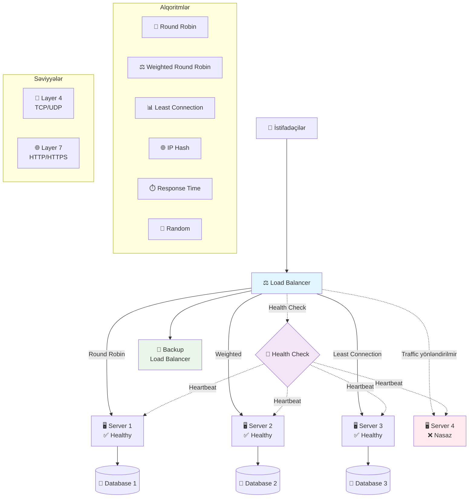

# Load Balancer
Load Balancer gələn sorğuları serverlər arasında paylaşdırır. Bu sistem tətbiqlərin yaxşı performance və availability təmin etməsi üçün lazımdır.

### Nə üçün lazımdır?
- **Yük paylaşdırması:** Serverlərdə yükü bərabər paylaşdırır
- **SPOF riskini azaldır:** Heartbeat və health check istifadə edir
- **Performance artırır:** Cavab vaxtını azaldır
- **Yüksək availability:** Nasaz serverdən trafiği digərlərinə yönləndirir
- **Scale edə bilir:** Yeni serverlər əlavə etmək asandır

### Health Check
- **Heartbeat Check:** Serverlərin işləyib işləmədiyini yoxlayır
- **Health Check:** Serverlərin vəziyyətini daimi yoxlayır

### Növlər
- **Global:** Fərqli data mərkəzlərdə serverləri idarə edir
- **Local:** Yerli şəbəkədə işləyir
- **Stateful:** Sessiyaları yadda saxlayır
- **Stateless:** Hər sorğunu ayrıca idarə edir

### Yerləşdirmə
- Database əvvəlində
- Application əvvəlində
- TLS termination üçün
- Service discovery üçün
- Təhlükəsizlik üçün

### Load Balancing Alqoritmləri
- **Round Robin**: Sorğuları serverlərə növbə ilə göndərir. Sadədir, bərabər paylaşdırır. Server fərqlərini nəzərə almır
- **Weighted Round Robin**: Server gücünə görə çəki verir və ona uyğun paylaşdırır. Server fərqlərini nəzərə alır. Çəkiləri əl ilə təyin etmək lazımdır
- **Least Connection**: Ən az bağlantısı olan serverə göndərir. Yük fərqinə uyğunlaşır. Bağlantıları izləmək mürəkkəbdir
- **IP Hash**: IP ünvanına görə server seçir. Sessiya davamlılığı verir. Az istifadəçi olarsa balans problemi
- **Least Response Time**: Ən tez cavab verən serverə göndərir. İstifadəçi təcrübəsini yaxşılaşdırır. Vaxtları izləmək çətindir.
- **Random**: Təsadüfi server seçir. Çox sadədir. Sessiya problemi yaradır

### Texnologiyalar
- **Hardware Load Balancer**: Xüsusi cihazlar. Yüksək performance verir. Sürətli, təhlükəsiz. Bahalı, çətin konfiqurasiya
- **Software Load Balancer**: Adi serverlərdə proqram kimi işləyir. Ucuz, çevik. Hardware qədər sürətli deyil
- **Cloud Load Balancer**: Bulud xidməti kimi təklif edilir. Yüksək scale, sadə idarə. Provayderə bağlı

### Şəbəkə Səviyyələri
- **Layer 4 (TCP/UDP)**: Transport səviyyəsində işləyir. Sürətli. Az məlumat bilir
- **Layer 7 (HTTP)**: Tətbiq səviyyəsində işləyir. Daha ağıllı. Yavaş, çox resurs istəyir

### Əsas Problemlər
- **SPOF riski:** Load balancer özü nasaz ola bilər → Rezerv instance-lar istifadə et
- **Konfiqurasiya:** Yanlış tənzim performance problemləri yaradır → Avtomatik alətlər işlət
- **Scale məhdudluğu:** Çox traffic bottleneck yaradır → Horizontal/vertikal scale et
- **Latency:** Əlavə addım gecikmə yaradır → Coğrafi paylama et
- **Xərc:** Əlavə xərc → Açıq mənbə həllər işlət

