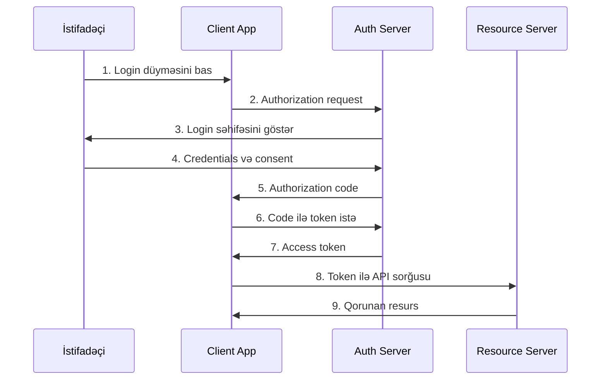

# OAuth 2.0

- **Authorization Framework:** OAuth 2.0 istifadəçilərin üçüncü tərəf tətbiqetmələrə məhdud giriş vermələrinə imkan verən authorization framework-dur.
- **Delegated Authorization:** İstifadəçi öz şifrəsini paylaşmadan digər tətbiqetmələrə resurslarına giriş icazəsi verir.
- **Token-based:** Parol əvəzinə access token-lərdən istifadə edir.
- **Scope-based Access:** Müəyyən resurs və əməliyyatlar üçün məhdudlaşdırılmış giriş.
- **Grant Types:** Müxtəlif ssenarилər üçün müxtəlif authorization flow-ları.

## OAuth 2.0 Rollari

### 1. Resource Owner (İstifadəçi)
- Qorunan resursa sahib olan entity (adətən istifadəçi)
- Üçüncü tərəf tətbiqetmələrə giriş icazəsi verir

### 2. Client (Tətbiqetmə)
- Resource Owner adından qorunan resursa giriş istəyən tətbiqetmə
- Web app, mobile app, SPA və s.

### 3. Resource Server (API Server)
- Qorunan resursları saxlayan server
- Access token-ləri qəbul edir və yoxlayır

### 4. Authorization Server
- İstifadəçini authenticate edir və access token verir
- Client-ləri register edir və idarə edir

## OAuth 2.0 Grant Types

### 1. Authorization Code Grant

**En təhlükəsiz və populyar flow:**



**Implementation:**

```java
// Spring Security OAuth2
@Configuration
@EnableWebSecurity
public class OAuth2Config {

    @Bean
    public SecurityFilterChain filterChain(HttpSecurity http) throws Exception {
        http
            .oauth2Login(oauth2 -> oauth2
                .loginPage("/login")
                .defaultSuccessUrl("/dashboard")
                .authorizationEndpoint(auth -> auth
                    .baseUri("/oauth2/authorization")
                )
                .redirectionEndpoint(redirect -> redirect
                    .baseUri("/oauth2/callback/*")
                )
            );
        return http.build();
    }
    
    @Bean
    public ClientRegistrationRepository clientRegistrationRepository() {
        return new InMemoryClientRegistrationRepository(
            googleClientRegistration(),
            githubClientRegistration()
        );
    }
    
    private ClientRegistration googleClientRegistration() {
        return ClientRegistration.withRegistrationId("google")
            .clientId("your-google-client-id")
            .clientSecret("your-google-client-secret")
            .clientAuthenticationMethod(ClientAuthenticationMethod.CLIENT_SECRET_BASIC)
            .authorizationGrantType(AuthorizationGrantType.AUTHORIZATION_CODE)
            .redirectUri("http://localhost:8080/oauth2/callback/google")
            .scope("openid", "profile", "email")
            .authorizationUri("https://accounts.google.com/o/oauth2/v2/auth")
            .tokenUri("https://www.googleapis.com/oauth2/v4/token")
            .userInfoUri("https://www.googleapis.com/oauth2/v3/userinfo")
            .userNameAttributeName(IdTokenClaimNames.SUB)
            .jwkSetUri("https://www.googleapis.com/oauth2/v3/certs")
            .clientName("Google")
            .build();
    }
}
```

### 2. Client Credentials Grant

**Server-to-server kommunikasiya üçün:**

```java
@Service
public class ApiClientService {
    
    @Value("${oauth2.client-id}")
    private String clientId;
    
    @Value("${oauth2.client-secret}")
    private String clientSecret;
    
    public String getAccessToken() {
        RestTemplate restTemplate = new RestTemplate();
        
        HttpHeaders headers = new HttpHeaders();
        headers.setContentType(MediaType.APPLICATION_FORM_URLENCODED);
        headers.setBasicAuth(clientId, clientSecret);
        
        MultiValueMap<String, String> body = new LinkedMultiValueMap<>();
        body.add("grant_type", "client_credentials");
        body.add("scope", "read:users write:users");
        
        HttpEntity<MultiValueMap<String, String>> request = 
            new HttpEntity<>(body, headers);
        
        TokenResponse response = restTemplate.postForObject(
            "https://auth.example.com/oauth/token", 
            request, 
            TokenResponse.class
        );
        
        return response.getAccessToken();
    }
    
    public ApiResponse callProtectedApi(String endpoint) {
        String token = getAccessToken();
        
        HttpHeaders headers = new HttpHeaders();
        headers.setBearerAuth(token);
        
        HttpEntity<String> request = new HttpEntity<>(headers);
        
        return restTemplate.exchange(
            endpoint, 
            HttpMethod.GET, 
            request, 
            ApiResponse.class
        ).getBody();
    }
}
```

### 3. Resource Owner Password Credentials (ROPC)

**Yalnız trusted tətbiqetmələr üçün:**

```java
@Service
public class ROPCAuthService {
    
    public TokenResponse authenticateUser(String username, String password) {
        RestTemplate restTemplate = new RestTemplate();
        
        HttpHeaders headers = new HttpHeaders();
        headers.setContentType(MediaType.APPLICATION_FORM_URLENCODED);
        headers.setBasicAuth(clientId, clientSecret);
        
        MultiValueMap<String, String> body = new LinkedMultiValueMap<>();
        body.add("grant_type", "password");
        body.add("username", username);
        body.add("password", password);
        body.add("scope", "read write");
        
        HttpEntity<MultiValueMap<String, String>> request = 
            new HttpEntity<>(body, headers);
        
        return restTemplate.postForObject(
            "https://auth.example.com/oauth/token", 
            request, 
            TokenResponse.class
        );
    }
}
```

### 4. Implicit Grant (Deprecated)

**Güvənsiz sayılır, Authorization Code + PKCE istifadə edin:**

```javascript
// Təvsiyə olunmur - yalnız nümunə üçün
function implicitFlow() {
    const authUrl = `https://auth.example.com/oauth/authorize?` +
        `response_type=token&` +
        `client_id=your-client-id&` +
        `redirect_uri=http://localhost:3000/callback&` +
        `scope=read write&` +
        `state=${generateRandomState()}`;
    
    window.location.href = authUrl;
}

// Callback handling
function handleCallback() {
    const hash = window.location.hash.substring(1);
    const params = new URLSearchParams(hash);
    const accessToken = params.get('access_token');
    const state = params.get('state');
    
    if (validateState(state)) {
        localStorage.setItem('access_token', accessToken);
        // Redirect to app
    }
}
```

## PKCE (Proof Key for Code Exchange)

**SPA və mobile app-lər üçün təhlükəsizlik artırımı:**

```javascript
// PKCE implementation
class PKCEHelper {
    static generateCodeVerifier() {
        const array = new Uint8Array(32);
        crypto.getRandomValues(array);
        return btoa(String.fromCharCode.apply(null, array))
            .replace(/\+/g, '-')
            .replace(/\//g, '_')
            .replace(/=/g, '');
    }
    
    static async generateCodeChallenge(verifier) {
        const encoder = new TextEncoder();
        const data = encoder.encode(verifier);
        const digest = await crypto.subtle.digest('SHA-256', data);
        return btoa(String.fromCharCode(...new Uint8Array(digest)))
            .replace(/\+/g, '-')
            .replace(/\//g, '_')
            .replace(/=/g, '');
    }
}

// OAuth flow with PKCE
async function startOAuthFlow() {
    const codeVerifier = PKCEHelper.generateCodeVerifier();
    const codeChallenge = await PKCEHelper.generateCodeChallenge(codeVerifier);
    const state = generateRandomString();
    
    // Store verifier və state
    sessionStorage.setItem('code_verifier', codeVerifier);
    sessionStorage.setItem('oauth_state', state);
    
    const authUrl = `https://auth.example.com/oauth/authorize?` +
        `response_type=code&` +
        `client_id=your-client-id&` +
        `redirect_uri=${encodeURIComponent(redirectUri)}&` +
        `scope=read write&` +
        `state=${state}&` +
        `code_challenge=${codeChallenge}&` +
        `code_challenge_method=S256`;
    
    window.location.href = authUrl;
}

async function handleCallback(code, state) {
    const storedState = sessionStorage.getItem('oauth_state');
    const codeVerifier = sessionStorage.getItem('code_verifier');
    
    if (state !== storedState) {
        throw new Error('Invalid state parameter');
    }
    
    const tokenResponse = await fetch('https://auth.example.com/oauth/token', {
        method: 'POST',
        headers: {
            'Content-Type': 'application/x-www-form-urlencoded'
        },
        body: new URLSearchParams({
            grant_type: 'authorization_code',
            client_id: 'your-client-id',
            code: code,
            redirect_uri: redirectUri,
            code_verifier: codeVerifier
        })
    });
    
    const tokens = await tokenResponse.json();
    return tokens;
}
```

## Scope və Permissions

### Scope Design

```java
public enum OAuth2Scope {
    READ("read", "Read access to resources"),
    WRITE("write", "Write access to resources"),
    DELETE("delete", "Delete access to resources"),
    ADMIN("admin", "Administrative access"),
    
    // Fine-grained scopes
    READ_PROFILE("read:profile", "Read user profile"),
    WRITE_PROFILE("write:profile", "Update user profile"),
    READ_POSTS("read:posts", "Read user posts"),
    WRITE_POSTS("write:posts", "Create/update posts");
    
    private final String value;
    private final String description;
    
    OAuth2Scope(String value, String description) {
        this.value = value;
        this.description = description;
    }
    
    // getters
}
```

### Scope Validation

```java
@RestController
public class ApiController {
    
    @GetMapping("/profile")
    @PreAuthorize("#oauth2.hasScope('read:profile')")
    public UserProfile getUserProfile() {
        return userService.getCurrentUserProfile();
    }
    
    @PostMapping("/posts")
    @PreAuthorize("#oauth2.hasScope('write:posts')")
    public Post createPost(@RequestBody CreatePostRequest request) {
        return postService.createPost(request);
    }
}

// Custom scope checker
@Service
public class ScopeService {
    
    public boolean hasRequiredScope(Authentication auth, String requiredScope) {
        if (auth instanceof OAuth2Authentication) {
            OAuth2Authentication oauth2Auth = (OAuth2Authentication) auth;
            Set<String> scopes = oauth2Auth.getOAuth2Request().getScope();
            return scopes.contains(requiredScope);
        }
        return false;
    }
}
```

## JWT Access Tokens

### JWT Token Structure

```java
@Service
public class JWTTokenService {
    
    @Value("${jwt.secret}")
    private String secret;
    
    public String generateAccessToken(String userId, Set<String> scopes) {
        return Jwts.builder()
            .setSubject(userId)
            .setIssuer("https://auth.example.com")
            .setAudience("api.example.com")
            .setIssuedAt(new Date())
            .setExpiration(Date.from(Instant.now().plusSeconds(3600))) // 1 hour
            .claim("scope", String.join(" ", scopes))
            .claim("client_id", "your-client-id")
            .signWith(SignatureAlgorithm.HS256, secret)
            .compact();
    }
    
    public Claims validateToken(String token) {
        try {
            return Jwts.parser()
                .setSigningKey(secret)
                .parseClaimsJws(token)
                .getBody();
        } catch (JwtException e) {
            throw new InvalidTokenException("Invalid JWT token", e);
        }
    }
}
```

### JWT Validation Filter

```java
@Component
public class JWTAuthenticationFilter extends OncePerRequestFilter {
    
    private final JWTTokenService tokenService;
    
    @Override
    protected void doFilterInternal(HttpServletRequest request, 
                                   HttpServletResponse response, 
                                   FilterChain filterChain) throws ServletException, IOException {
        
        String token = extractToken(request);
        
        if (token != null) {
            try {
                Claims claims = tokenService.validateToken(token);
                
                String userId = claims.getSubject();
                String scopeString = claims.get("scope", String.class);
                Set<String> scopes = Set.of(scopeString.split(" "));
                
                // Create authentication object
                OAuth2Authentication auth = createAuthentication(userId, scopes);
                SecurityContextHolder.getContext().setAuthentication(auth);
                
            } catch (Exception e) {
                response.setStatus(HttpServletResponse.SC_UNAUTHORIZED);
                return;
            }
        }
        
        filterChain.doFilter(request, response);
    }
    
    private String extractToken(HttpServletRequest request) {
        String bearerToken = request.getHeader("Authorization");
        if (bearerToken != null && bearerToken.startsWith("Bearer ")) {
            return bearerToken.substring(7);
        }
        return null;
    }
}
```

## Refresh Tokens

### Token Refresh Implementation

```java
@Service
public class TokenService {
    
    public TokenResponse refreshToken(String refreshToken) {
        RefreshToken storedToken = refreshTokenRepository.findByToken(refreshToken)
            .orElseThrow(() -> new InvalidTokenException("Invalid refresh token"));
        
        if (storedToken.isExpired()) {
            refreshTokenRepository.delete(storedToken);
            throw new ExpiredTokenException("Refresh token expired");
        }
        
        // Generate new access token
        String newAccessToken = generateAccessToken(
            storedToken.getUserId(), 
            storedToken.getScopes()
        );
        
        // Optionally rotate refresh token
        String newRefreshToken = generateRefreshToken(storedToken.getUserId());
        refreshTokenRepository.delete(storedToken);
        refreshTokenRepository.save(new RefreshToken(newRefreshToken, storedToken.getUserId()));
        
        return TokenResponse.builder()
            .accessToken(newAccessToken)
            .refreshToken(newRefreshToken)
            .expiresIn(3600)
            .tokenType("Bearer")
            .build();
    }
}
```

### Frontend Token Management

```javascript
class TokenManager {
    constructor() {
        this.accessToken = localStorage.getItem('access_token');
        this.refreshToken = localStorage.getItem('refresh_token');
    }
    
    async makeAuthenticatedRequest(url, options = {}) {
        let token = this.accessToken;
        
        // Check if token is expired
        if (this.isTokenExpired(token)) {
            token = await this.refreshAccessToken();
        }
        
        return fetch(url, {
            ...options,
            headers: {
                ...options.headers,
                'Authorization': `Bearer ${token}`
            }
        });
    }
    
    async refreshAccessToken() {
        try {
            const response = await fetch('/oauth/token', {
                method: 'POST',
                headers: {
                    'Content-Type': 'application/x-www-form-urlencoded'
                },
                body: new URLSearchParams({
                    grant_type: 'refresh_token',
                    refresh_token: this.refreshToken,
                    client_id: 'your-client-id'
                })
            });
            
            if (!response.ok) {
                throw new Error('Token refresh failed');
            }
            
            const tokens = await response.json();
            this.accessToken = tokens.access_token;
            this.refreshToken = tokens.refresh_token;
            
            localStorage.setItem('access_token', this.accessToken);
            localStorage.setItem('refresh_token', this.refreshToken);
            
            return this.accessToken;
        } catch (error) {
            // Redirect to login
            this.logout();
            throw error;
        }
    }
    
    isTokenExpired(token) {
        if (!token) return true;
        
        const payload = JSON.parse(atob(token.split('.')[1]));
        return payload.exp * 1000 < Date.now();
    }
    
    logout() {
        localStorage.removeItem('access_token');
        localStorage.removeItem('refresh_token');
        window.location.href = '/login';
    }
}
```

## OpenID Connect

### OpenID Connect Extension

```java
@Configuration
public class OpenIDConnectConfig {
    
    @Bean
    public JwtDecoder jwtDecoder() {
        return JwtDecoders.fromIssuerLocation("https://accounts.google.com");
    }
    
    @Bean
    public SecurityFilterChain filterChain(HttpSecurity http) throws Exception {
        http
            .oauth2ResourceServer(oauth2 -> oauth2
                .jwt(jwt -> jwt
                    .decoder(jwtDecoder())
                    .jwtAuthenticationConverter(jwtAuthenticationConverter())
                )
            );
        return http.build();
    }
    
    @Bean
    public Converter<Jwt, AbstractAuthenticationToken> jwtAuthenticationConverter() {
        JwtAuthenticationConverter converter = new JwtAuthenticationConverter();
        converter.setJwtGrantedAuthoritiesConverter(jwt -> {
            // Extract authorities from JWT claims
            Collection<String> scopes = jwt.getClaimAsStringList("scope");
            return scopes.stream()
                .map(scope -> new SimpleGrantedAuthority("SCOPE_" + scope))
                .collect(Collectors.toList());
        });
        return converter;
    }
}
```

OAuth 2.0 müasir veb və mobile tətbiqetmələrdə authorization üçün standart həll yoldur və düzgün tətbiq edilməsi vacibdir.
