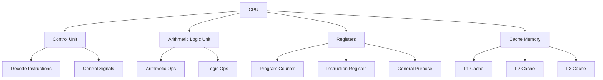
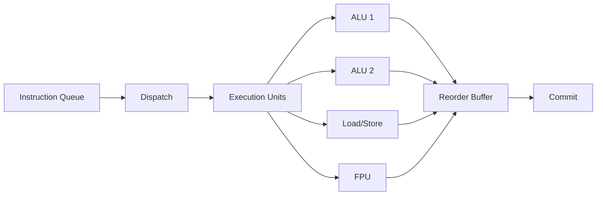
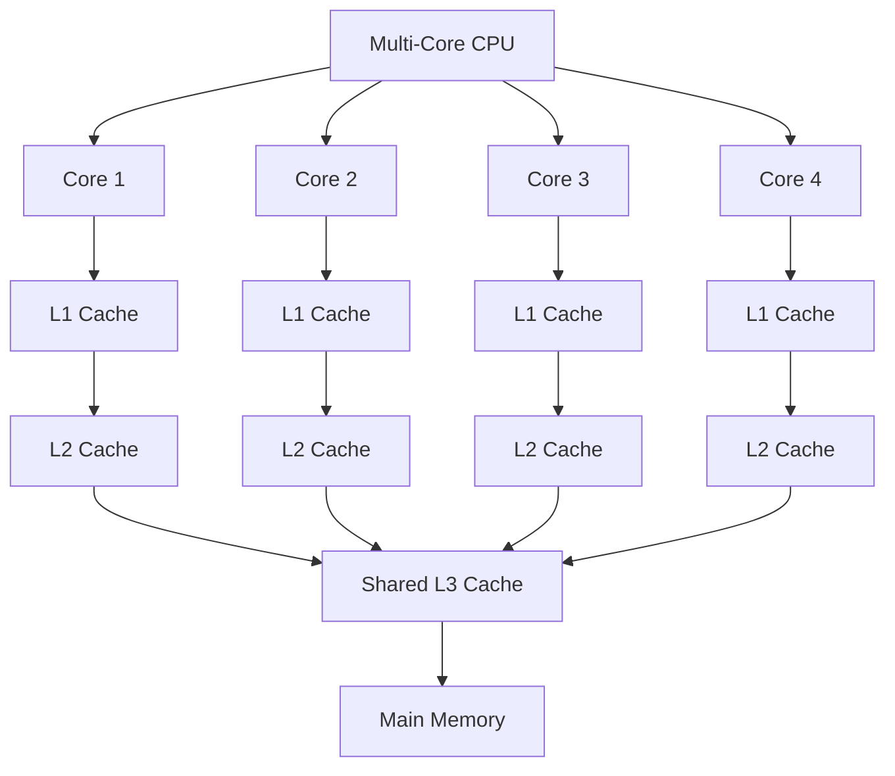

# CPU Arxitekturası

## CPU Nədir?

**CPU (Central Processing Unit)** - kompüterin beyni, bütün hesablama əməliyyatlarını və proqram təlimatlarını icra edən əsas komponentdir.

## CPU Komponentləri

### Əsas Komponentlər

**1. Control Unit (İdarəetmə Bloku)**
- Təlimatları decode edir
- CPU komponentlərinə control signal göndərir
- Execution flow-u idarə edir

**2. ALU (Arithmetic Logic Unit)**
- Riyazi əməliyyatlar (toplama, çıxma, vurma, bölmə)
- Məntiqi əməliyyatlar (AND, OR, NOT, XOR)
- Müqayisə əməliyyatları

**3. Registers (Qeydlər)**
- Ən sürətli yaddaş növü
- CPU daxilində kiçik data saxlayır
- Növləri: Program Counter, Instruction Register, General Purpose

**4. Cache Memory**
- CPU və RAM arasında sürətli buffer
- L1, L2, L3 səviyyələri

## Instruction Cycle

CPU-nun təlimat icra etmə tsikli:

### 1. Fetch
- Təlimatı yaddaşdan oxuyur
- Program Counter-dən ünvanı alır
- Instruction Register-ə yerləşdirir

### 2. Decode
- Təlimatı şərh edir
- Hansı əməliyyatın icra olunacağını müəyyənləşdirir
- Lazım olan operandları tapır

### 3. Execute
- ALU əməliyyatı icra edir
- Nəticəni hesablayır

### 4. Memory Access
- Əgər lazımdırsa, memory-dən oxuyur və ya yazır

### 5. Write Back
- Nəticəni register-ə yazır

## Pipelining

Pipelining - müxtəlif təlimatların müxtəlif mərhələlərini paralel icra etmək texnikası.

```mermaid
gantt
    title CPU Pipeline
    dateFormat X
    axisFormat %s
    
    section Instruction 1
    Fetch     :0, 1
    Decode    :1, 2
    Execute   :2, 3
    Memory    :3, 4
    WriteBack :4, 5
    
    section Instruction 2
    Fetch     :1, 2
    Decode    :2, 3
    Execute   :3, 4
    Memory    :4, 5
    WriteBack :5, 6
    
    section Instruction 3
    Fetch     :2, 3
    Decode    :3, 4
    Execute   :4, 5
    Memory    :5, 6
    WriteBack :6, 7
```

### Pipeline Hazards

**1. Structural Hazards**
- Hardware resurslarının çatışmazlığı
- Həll: Resource duplication

**2. Data Hazards**
- Təlimatlar arasında data asılılığı
- Növləri: RAW, WAR, WAW
- Həll: Forwarding, Stalling

**3. Control Hazards**
- Branch təlimatları pipeline-ı pozur
- Həll: Branch prediction

## Superscalar və Out-of-Order Execution

### Superscalar
- Bir cycle-da bir neçə təlimat icra edir
- Multiple execution units
- Daha yüksək throughput

### Out-of-Order Execution
- Təlimatları sıra ilə deyil, hazır olduqca icra edir
- Data asılılığını minimize edir
- Performansı artırır

## CISC vs RISC

### CISC (Complex Instruction Set Computer)

**Xüsusiyyətlər:**
- Çoxlu və mürəkkəb təlimatlar
- Variable-length instructions
- Memory-to-memory operations
- Az sayda general purpose registers
- Microcode istifadə edir

**Nümunələr:** x86, x86-64

**Üstünlükləri:**
- Code density yüksək
- Compiler-ə sadəlik

**Çatışmazlıqları:**
- Pipeline çətinliyi
- Decode kompleksliyi

### RISC (Reduced Instruction Set Computer)

**Xüsusiyyətlər:**
- Sadə və az sayda təlimat
- Fixed-length instructions
- Load/Store arxitekturası
- Çoxlu general purpose registers
- Hardware execution (microcode yox)

**Nümunələr:** ARM, RISC-V, PowerPC, MIPS

**Üstünlükləri:**
- Pipelining asandır
- Yüksək clock frequency
- Enerji səmərəliliyi

**Çatışmazlıqları:**
- Daha çox təlimat lazımdır
- Code size böyükdür

### Müqayisə

| Xüsusiyyət | CISC | RISC |
|------------|------|------|
| Instruction sayı | Çox | Az |
| Instruction uzunluğu | Variable | Fixed |
| Addressing modes | Çox | Az |
| Pipeline | Çətin | Asan |
| Registers | Az | Çox |
| Execution | Microcode | Hardware |
| Nümunə | x86 | ARM, RISC-V |

## Multi-Core Architecture

Multi-core CPU - bir chip-də bir neçə independent processor core.

### Üstünlükləri

- **Parallelizm:** Bir neçə thread eyni vaxtda işləyir
- **Enerji səmərəliliyi:** Aşağı frequency-də yüksək performans
- **Throughput:** Daha çox iş görülür

### Çətinliklər

- **Cache coherence:** Cache-lər arasında sinxronizasiya
- **Load balancing:** İşin core-lar arasında bölüşdürülməsi
- **Synchronization overhead:** Thread-lər arası əlaqə

## Performans Göstəriciləri

**Clock Speed (Frequency)**
- Hz ilə ölçülür (GHz)
- Daha yüksək = daha sürətli (eyni arxitekturada)

**IPC (Instructions Per Cycle)**
- Bir cycle-da icra olunan orta təlimat sayı
- Arxitektura keyfiyyətini göstərir

**TDP (Thermal Design Power)**
- CPU-nun istehlak etdiyi enerji
- Cooling tələbini müəyyənləşdirir

## Həqiqi Dünya Nümunələri

**Intel Core i7:**
- CISC (x86-64)
- Superscalar, Out-of-order
- 4-8 cores
- Hyper-threading

**Apple M1:**
- RISC (ARM)
- High-performance + Efficiency cores
- 8 cores
- Unified memory architecture

**AMD Ryzen:**
- CISC (x86-64)
- Chiplet architecture
- 6-16 cores
- SMT (Simultaneous Multi-Threading)

## Əlaqəli Mövzular

- **Memory Hierarchy:** Cache və memory strukturu
- **Pipelining Hazards:** Pipeline problemləri
- **Branch Prediction:** Branch təlimatların proqnozlaşdırılması
- **Parallelism:** Paralel icra növləri
