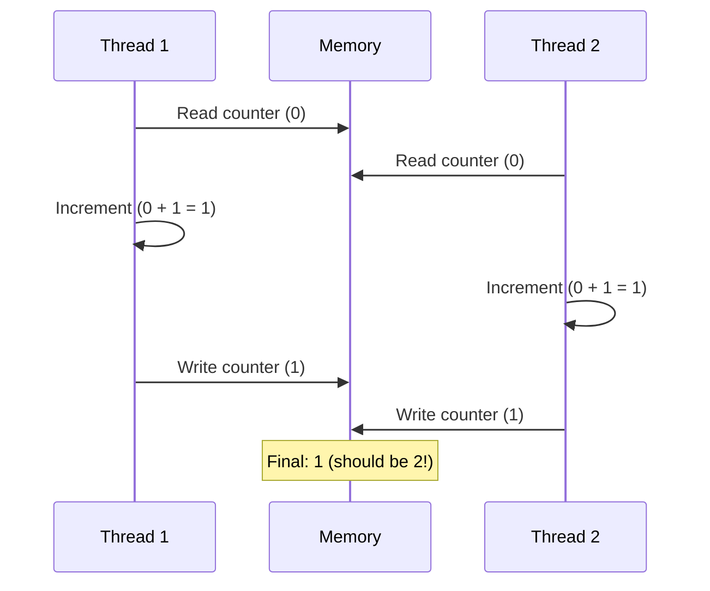
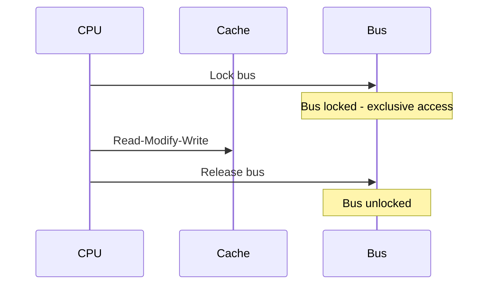
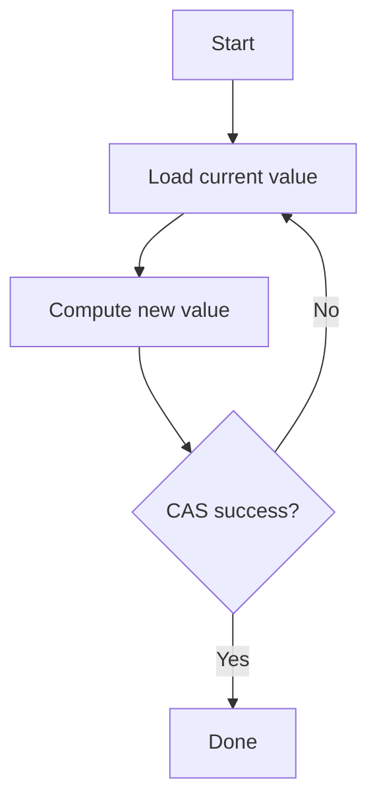
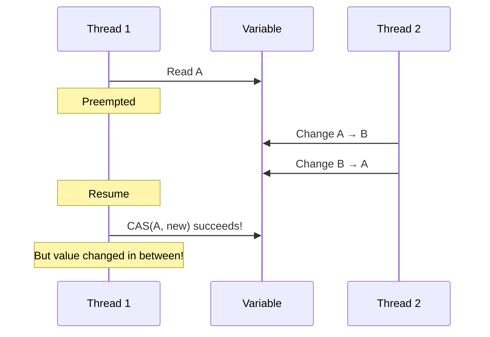
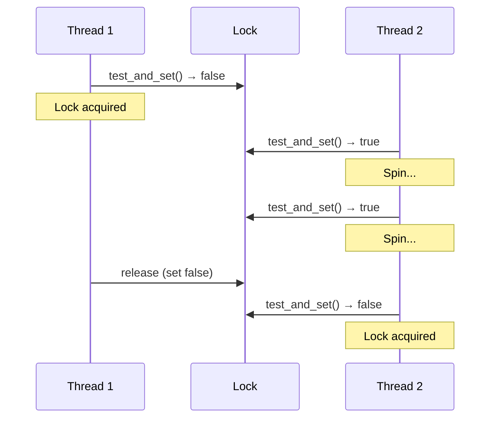
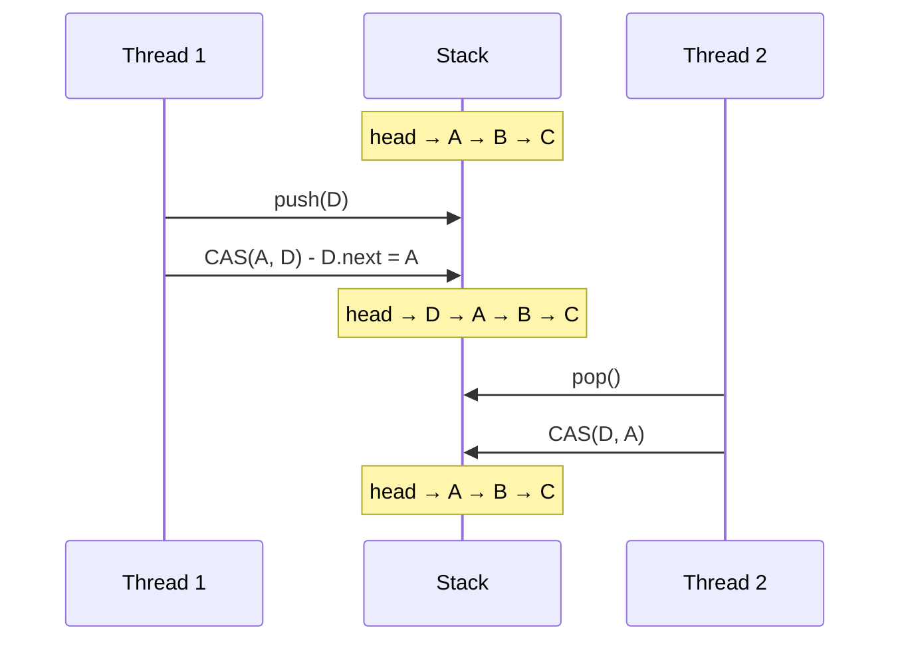
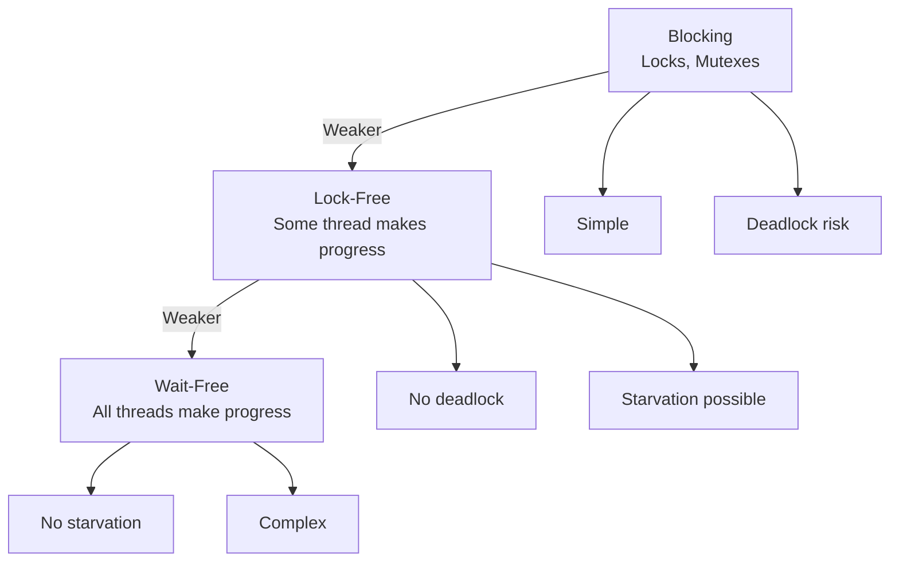

# Hardware Synchronization

## Synchronization Nədir?

**Synchronization** - multi-threaded sistemdə shared data-ya thread-safe çıxış təmin etməkdir.

## Niyə Hardware Dəstəyi Lazımdır?

Software-only həllər **kifayət deyil**!

```c
// BROKEN! Race condition
int counter = 0;

// Thread 1 və Thread 2
counter++;  // Read-Modify-Write - NOT atomic!
```



## Atomic Operations

**Atomic** - bölünməz, all-or-nothing əməliyyat.

### 1. Atomic Read/Write

```c
// x86
mov rax, [address]    ; Aligned read - atomic
mov [address], rax    ; Aligned write - atomic
```

**Alignment vacibdir:**
- Aligned: Atomic
- Unaligned: NOT atomic (span multiple cache lines)

### 2. Atomic Increment/Decrement

```c
// x86 - LOCK prefix
lock inc [address]     ; Atomic increment
lock dec [address]     ; Atomic decrement
lock add [address], 5  ; Atomic add
```



### 3. Atomic Exchange

```asm
; x86
xchg rax, [address]   ; Swap rax <-> memory (atomic)
```

```c
// C11/C++11
int old = atomic_exchange(&var, new_value);
```

## Compare-And-Swap (CAS)

**CAS** - ən güclü atomic primitive.

### Pseudo-code

```c
bool CAS(int* address, int expected, int new_value) {
    atomic {
        if (*address == expected) {
            *address = new_value;
            return true;
        } else {
            return false;
        }
    }
}
```

### x86 Implementation

```asm
; CMPXCHG instruction
mov eax, expected
mov ebx, new_value
lock cmpxchg [address], ebx
; If *address == eax: *address = ebx, ZF=1
; Else: eax = *address, ZF=0
```

### C11/C++11

```cpp
std::atomic<int> var(10);
int expected = 10;
int desired = 20;

// Compare expected with var, if equal set to desired
bool success = var.compare_exchange_strong(expected, desired);

if (success) {
    // var is now 20
} else {
    // var was not 10, expected now contains actual value
}
```

### CAS Loop Pattern

```cpp
void atomic_increment(std::atomic<int>& var) {
    int old_val = var.load();
    int new_val;
    
    do {
        new_val = old_val + 1;
    } while (!var.compare_exchange_weak(old_val, new_val));
}
```



### ABA Problem



**Həll:** Version counter və ya pointer tag

## Test-And-Set

Spin lock implementasiyası üçün.

```c
bool test_and_set(bool* lock) {
    atomic {
        bool old = *lock;
        *lock = true;
        return old;
    }
}
```

### x86 Implementation

```asm
; Using XCHG
mov al, 1
xchg al, [lock]
; al now contains old value
```

### Spin Lock

```c
volatile bool lock = false;

void acquire_lock() {
    while (test_and_set(&lock)) {
        // Spin (busy wait)
    }
}

void release_lock() {
    lock = false;
}
```



### Spin Lock Optimization

```c
// Better: Test-and-test-and-set
void acquire_lock(volatile bool* lock) {
    while (true) {
        // First test (no bus lock)
        while (*lock);
        
        // Then test-and-set (bus lock)
        if (!test_and_set(lock))
            break;
    }
}
```

**Üstünlük:** Az bus traffic

## Load-Link / Store-Conditional (LL/SC)

ARM, PowerPC, RISC-V-də CAS əvəzinə.

### ARM64 Example

```asm
; Load-Exclusive / Store-Exclusive
retry:
    ldxr w1, [x0]        ; Load-exclusive from address x0
    add w1, w1, #1       ; Increment
    stxr w2, w1, [x0]    ; Store-exclusive (w2=0 if success)
    cbnz w2, retry       ; If failed, retry
```

### Semantics

```c
int load_link(int* address) {
    // Mark address as "linked"
    return *address;
}

bool store_conditional(int* address, int value) {
    if (link_still_valid()) {
        *address = value;
        return true;
    }
    return false;
}
```

**Link breaks if:**
- Başqa CPU həmin cache line-ı dəyişdirsə
- Context switch olarsa
- Exception olarsa

### LL/SC vs CAS

| Xüsusiyyət | LL/SC | CAS |
|------------|-------|-----|
| ABA problem | Yoxdur | Var |
| Implementation | Sadə | Kompleks |
| Flexibility | Yüksək | Aşağı |
| Architecture | ARM, PowerPC, RISC-V | x86 |

## Fetch-And-Add (FAA)

Atomic add və return old value.

```asm
; x86
mov eax, 5
lock xadd [address], eax
; [address] += eax, eax = old value
```

```cpp
// C11/C++11
int old = atomic_fetch_add(&counter, 5);
```

### Lock-Free Counter

```cpp
std::atomic<int> counter(0);

void increment() {
    counter.fetch_add(1, std::memory_order_relaxed);
}
```

## Memory Barriers

Synchronization üçün memory ordering təmin etmək.

### Types

**1. Full Barrier**
```cpp
std::atomic_thread_fence(std::memory_order_seq_cst);
```

**2. Acquire Barrier**
```cpp
std::atomic_thread_fence(std::memory_order_acquire);
```

**3. Release Barrier**
```cpp
std::atomic_thread_fence(std::memory_order_release);
```

### Producer-Consumer with Barriers

```cpp
// Producer
data = compute();
std::atomic_thread_fence(std::memory_order_release);
ready.store(true, std::memory_order_relaxed);

// Consumer
while (!ready.load(std::memory_order_relaxed));
std::atomic_thread_fence(std::memory_order_acquire);
process(data);
```

## Lock-Free Data Structures

### Lock-Free Stack

```cpp
template<typename T>
class LockFreeStack {
    struct Node {
        T data;
        Node* next;
    };
    
    std::atomic<Node*> head;
    
public:
    void push(T value) {
        Node* new_node = new Node{value, nullptr};
        new_node->next = head.load();
        
        while (!head.compare_exchange_weak(new_node->next, new_node));
    }
    
    bool pop(T& result) {
        Node* old_head = head.load();
        
        while (old_head && 
               !head.compare_exchange_weak(old_head, old_head->next));
        
        if (old_head) {
            result = old_head->data;
            delete old_head;  // ABA problem!
            return true;
        }
        return false;
    }
};
```



### Lock-Free Queue

Michael-Scott Queue (MS-Queue):

```cpp
template<typename T>
class LockFreeQueue {
    struct Node {
        T data;
        std::atomic<Node*> next;
    };
    
    std::atomic<Node*> head;
    std::atomic<Node*> tail;
    
public:
    LockFreeQueue() {
        Node* dummy = new Node{};
        head.store(dummy);
        tail.store(dummy);
    }
    
    void enqueue(T value) {
        Node* new_node = new Node{value, nullptr};
        
        while (true) {
            Node* last = tail.load();
            Node* next = last->next.load();
            
            if (last == tail.load()) {
                if (next == nullptr) {
                    if (last->next.compare_exchange_weak(next, new_node)) {
                        tail.compare_exchange_weak(last, new_node);
                        return;
                    }
                } else {
                    tail.compare_exchange_weak(last, next);
                }
            }
        }
    }
    
    bool dequeue(T& result) {
        while (true) {
            Node* first = head.load();
            Node* last = tail.load();
            Node* next = first->next.load();
            
            if (first == head.load()) {
                if (first == last) {
                    if (next == nullptr) return false;
                    tail.compare_exchange_weak(last, next);
                } else {
                    result = next->data;
                    if (head.compare_exchange_weak(first, next)) {
                        delete first;
                        return true;
                    }
                }
            }
        }
    }
};
```

## Hardware Transactional Memory (HTM)

**HTM** - hardware atomic transactions.

### Intel TSX (Transactional Synchronization Extensions)

```c
// Hardware Lock Elision (HLE)
while (__atomic_test_and_set(&lock, __ATOMIC_ACQUIRE)) {
    _mm_pause();
}
// Critical section
__atomic_clear(&lock, __ATOMIC_RELEASE);

// Restricted Transactional Memory (RTM)
unsigned status = _xbegin();
if (status == _XBEGIN_STARTED) {
    // Transaction
    if (abort_condition) {
        _xabort(1);
    }
    _xend();
} else {
    // Fallback to lock
    pthread_mutex_lock(&mutex);
    // Critical section
    pthread_mutex_unlock(&mutex);
}
```

**Üstünlüklər:**
- Optimistic concurrency
- Daha yüksək throughput

**Çatışmazlıqlar:**
- Transaction size limit
- Unpredictable abort
- Fallback lazımdır

## Wait-Free vs Lock-Free



## Praktik Nümunələr

### 1. Atomic Flag (Spin Lock)

```cpp
std::atomic_flag lock = ATOMIC_FLAG_INIT;

void acquire() {
    while (lock.test_and_set(std::memory_order_acquire));
}

void release() {
    lock.clear(std::memory_order_release);
}
```

### 2. Reference Counting

```cpp
class RefCounted {
    std::atomic<int> ref_count{1};
    
public:
    void addRef() {
        ref_count.fetch_add(1, std::memory_order_relaxed);
    }
    
    void release() {
        if (ref_count.fetch_sub(1, std::memory_order_acq_rel) == 1) {
            delete this;
        }
    }
};
```

### 3. Seqlock (Linux Kernel)

```c
struct seqlock {
    atomic_t sequence;
    spinlock_t lock;
};

// Writer
void write_seqlock(seqlock_t* sl) {
    spin_lock(&sl->lock);
    sl->sequence++;  // Odd = write in progress
    smp_wmb();
}

void write_sequnlock(seqlock_t* sl) {
    smp_wmb();
    sl->sequence++;  // Even = write complete
    spin_unlock(&sl->lock);
}

// Reader (lock-free!)
do {
    seq = sl->sequence;
    smp_rmb();
    // Read data
    smp_rmb();
} while (seq & 1 || seq != sl->sequence);
```

## Performance Considerations

### 1. Cache Line Contention

```c
// BAD: False sharing
struct {
    atomic<int> counter1;
    atomic<int> counter2;
} counters;  // Same cache line!

// GOOD: Padding
struct alignas(64) {
    atomic<int> counter;
} counter1, counter2;
```

### 2. Memory Order Selection

```cpp
// Relaxed: Fastest, no synchronization
counter.fetch_add(1, memory_order_relaxed);

// Acquire/Release: Moderate
flag.store(true, memory_order_release);
while (!flag.load(memory_order_acquire));

// Seq_cst: Slowest, full synchronization
counter.fetch_add(1, memory_order_seq_cst);
```

### 3. Exponential Backoff

```cpp
void spin_with_backoff(atomic_flag& lock) {
    int backoff = 1;
    while (lock.test_and_set(memory_order_acquire)) {
        for (int i = 0; i < backoff; i++) {
            _mm_pause();  // x86 pause instruction
        }
        backoff = min(backoff * 2, MAX_BACKOFF);
    }
}
```

## Debugging Synchronization

### ThreadSanitizer (TSan)

```bash
# Compile with TSan
g++ -fsanitize=thread -g program.cpp

# Run
./a.out

# Reports data races
```

### Helgrind (Valgrind)

```bash
valgrind --tool=helgrind ./program
```

### Common Bugs

1. **Data race:** Unsynchronized access
2. **Deadlock:** Circular wait
3. **Livelock:** Threads yield to each other
4. **ABA problem:** CAS false positive
5. **Memory ordering bugs:** Missing barriers

## Best Practices

1. **Use standard library**
   ```cpp
   std::mutex, std::atomic, std::lock_guard
   ```

2. **Minimize critical sections**
   ```cpp
   // Do work outside lock
   auto result = compute();
   {
       std::lock_guard<std::mutex> lock(mutex);
       shared_data = result;
   }
   ```

3. **Prefer lock-free for simple cases**
   ```cpp
   atomic<int> counter;  // Instead of mutex + int
   ```

4. **Document memory order**
   ```cpp
   // Release-acquire pair for producer-consumer
   flag.store(true, memory_order_release);
   ```

5. **Test thoroughly**
   - Stress testing
   - Thread sanitizers
   - Multiple architectures

## Əlaqəli Mövzular

- **Memory Ordering:** Memory consistency models
- **Cache Memory:** Cache coherence
- **Multiprocessor Systems:** Shared memory
- **Parallelism:** Lock-free parallelism
- **Performance:** Synchronization overhead
