# I/O Sistemləri

## I/O Systems Nədir?

**I/O (Input/Output) sistemləri** - CPU və xarici cihazlar (disk, klaviatura, network card) arasında məlumat mübadiləsini təmin edir.

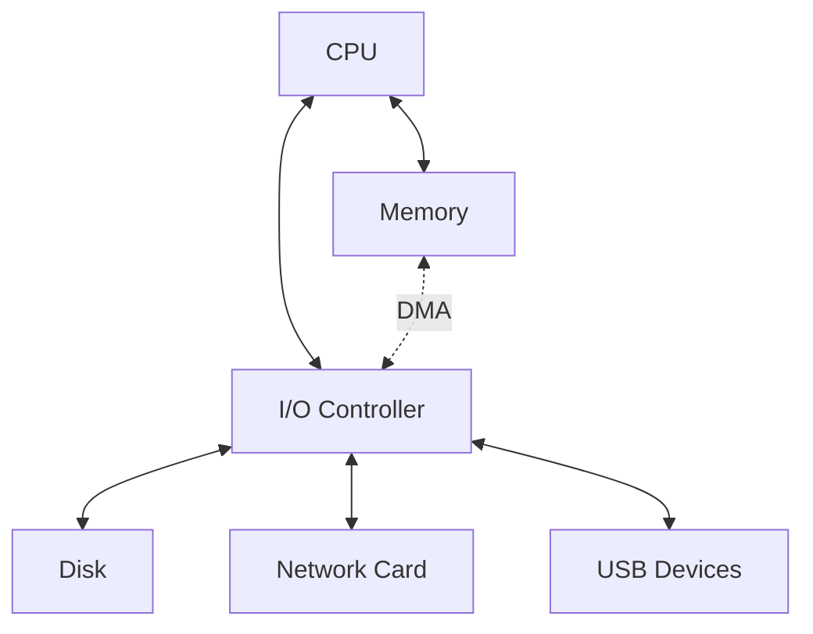

## I/O Device Types

### 1. Block Devices

Bloklar (məsələn, 512 bytes, 4KB) şəklində məlumat ötürür.

**Xüsusiyyətlər:**
- Random access
- Bufferable
- Addressable

**Nümunələr:**
- Hard disk (HDD)
- Solid State Drive (SSD)
- USB flash drive

### 2. Character Devices

Byte stream şəklində məlumat ötürür.

**Xüsusiyyətlər:**
- Sequential access
- No random access
- Not addressable

**Nümunələr:**
- Keyboard
- Mouse
- Serial port
- Network card

### 3. Network Devices

Paketlər (packets) şəklində məlumat ötürür.

**Nümunələr:**
- Ethernet card
- Wi-Fi adapter

## I/O Methods

### 1. Programmed I/O (Polling)

CPU aktiv şəkildə cihazın statusunu yoxlayır.

```c
// Polling example
void read_data() {
    while (!(io_status_register & READY_BIT)) {
        // Busy wait (waste CPU cycles!)
    }
    data = io_data_register;
}
```

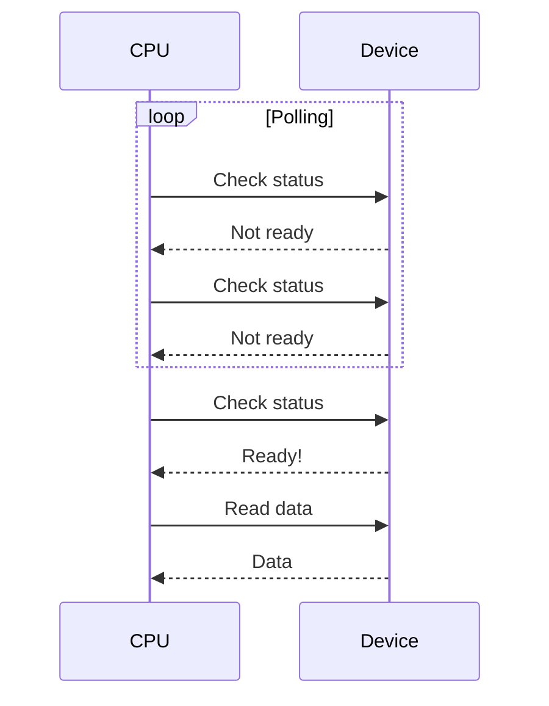

**Üstünlüklər:**
- Sadə implementasiya
- Aşağı latency (əgər cihaz tez cavab verirsə)

**Çatışmazlıqlar:**
- CPU cycles waste
- Inefficient (xüsusilə slow devices üçün)
- Başqa işlər görə bilmir

### 2. Interrupt-Driven I/O

Cihaz hazır olduqda CPU-ya interrupt göndərir.

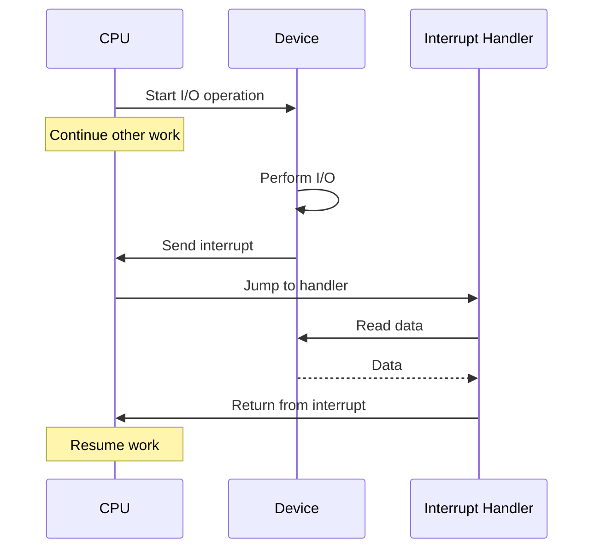

**Interrupt Handling Steps:**

1. **Save context** - Registers, program counter
2. **Identify interrupt** - Which device?
3. **Run ISR** (Interrupt Service Routine)
4. **Restore context** - Continue execution

**x86 Interrupt Example:**

```asm
; Interrupt Descriptor Table (IDT)
idt_entry:
    dw isr_address_low
    dw code_segment
    db 0
    db flags
    dw isr_address_high

; Interrupt Service Routine
isr_keyboard:
    push rax
    push rbx
    ; ... save registers
    
    in al, 0x60        ; Read from keyboard port
    ; Process keystroke
    
    mov al, 0x20       ; EOI (End Of Interrupt)
    out 0x20, al       ; Send to PIC
    
    ; ... restore registers
    pop rbx
    pop rax
    iret               ; Return from interrupt
```

**Üstünlüklər:**
- CPU multitasking edə bilir
- Efficient
- Low CPU overhead

**Çatışmazlıqlar:**
- Context switch overhead
- Interrupt storm (çox interrupt)
- Latency (interrupt handling time)

### 3. Direct Memory Access (DMA)

Cihaz birbaşa memory-yə yazır, CPU-nun müdaxiləsi olmadan.

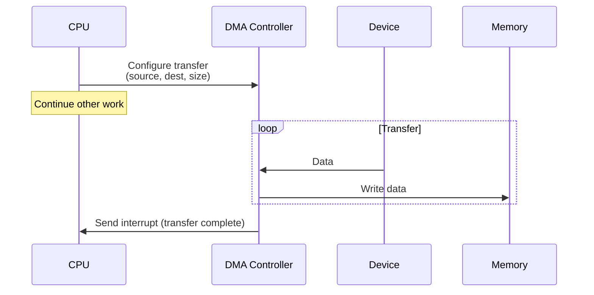

**DMA Configuration:**

```c
struct dma_descriptor {
    uint64_t source_address;
    uint64_t dest_address;
    uint32_t byte_count;
    uint32_t control;
};

void setup_dma_transfer() {
    dma_descriptor desc;
    desc.source_address = disk_buffer_address;
    desc.dest_address = memory_address;
    desc.byte_count = 4096;  // 4KB
    desc.control = DMA_READ | DMA_INTERRUPT_ON_COMPLETE;
    
    // Start DMA
    dma_controller->start(&desc);
}
```

**DMA Transfer Modes:**

1. **Burst mode** - Bütün transfer bir dəfəyə
2. **Cycle stealing** - Hər cycle bir byte
3. **Transparent mode** - CPU idle olduqda

**Üstünlüklər:**
- CPU-nu azad edir
- High throughput
- Low CPU overhead

**Çatışmazlıqlar:**
- Bus contention (CPU və DMA bus-da rəqabət)
- Cache coherency issues
- Kompleks hardware

## Memory-Mapped I/O

I/O registers memory address space-də görünür.

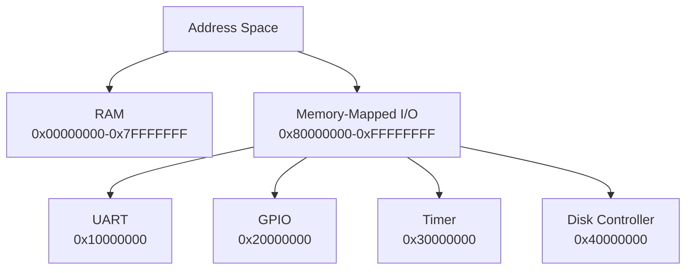

### Example: UART Communication

```c
// Memory-mapped UART registers
#define UART_BASE 0x10000000
#define UART_DATA   (*(volatile uint32_t*)(UART_BASE + 0x00))
#define UART_STATUS (*(volatile uint32_t*)(UART_BASE + 0x04))
#define UART_CONTROL (*(volatile uint32_t*)(UART_BASE + 0x08))

#define UART_TX_READY (1 << 0)
#define UART_RX_READY (1 << 1)

void uart_send_char(char c) {
    // Wait until transmitter ready
    while (!(UART_STATUS & UART_TX_READY));
    
    // Write character
    UART_DATA = c;
}

char uart_recv_char() {
    // Wait until data available
    while (!(UART_STATUS & UART_RX_READY));
    
    // Read character
    return UART_DATA;
}
```

**Üstünlüklər:**
- Unified address space
- Standard load/store instructions
- Cache-able (if appropriate)

**Çatışmazlıqlar:**
- Address space consumption
- Cache issues (need volatile)

### Port-Mapped I/O (x86)

Ayrı I/O address space.

```asm
; x86 IN/OUT instructions
in al, 0x60       ; Read from port 0x60 (keyboard)
out 0x64, al      ; Write to port 0x64 (keyboard controller)

in eax, dx        ; Read from port in DX register
out dx, eax       ; Write to port in DX register
```

**Comparison:**

| Xüsusiyyət | Memory-Mapped | Port-Mapped |
|------------|---------------|-------------|
| Address space | Shared with RAM | Separate |
| Instructions | Load/Store | IN/OUT (x86) |
| Cache | Possible issue | Not cached |
| Examples | ARM, RISC-V | x86 (legacy) |

## Interrupt Handling

### Interrupt Types

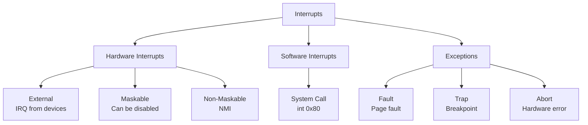

### Interrupt Controller

**8259 PIC (Programmable Interrupt Controller)** - Legacy

```c
#define PIC1_COMMAND 0x20
#define PIC1_DATA    0x21
#define PIC2_COMMAND 0xA0
#define PIC2_DATA    0xA1

void pic_end_of_interrupt(uint8_t irq) {
    if (irq >= 8) {
        // Send EOI to slave
        outb(PIC2_COMMAND, 0x20);
    }
    // Send EOI to master
    outb(PIC1_COMMAND, 0x20);
}
```

**APIC (Advanced Programmable Interrupt Controller)** - Modern

```c
#define APIC_BASE 0xFEE00000
#define APIC_EOI  (APIC_BASE + 0xB0)

void apic_eoi() {
    *(volatile uint32_t*)APIC_EOI = 0;
}
```

### Interrupt Priority

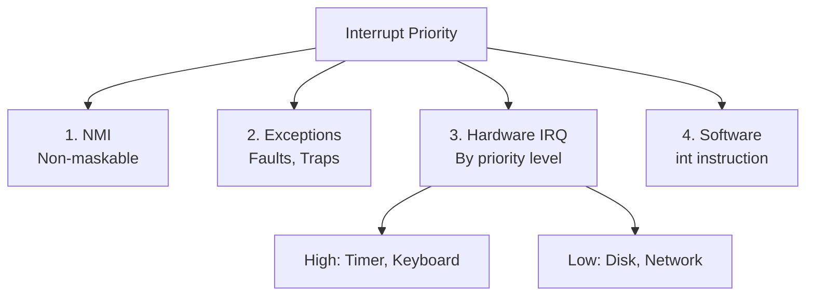

### Nested Interrupts

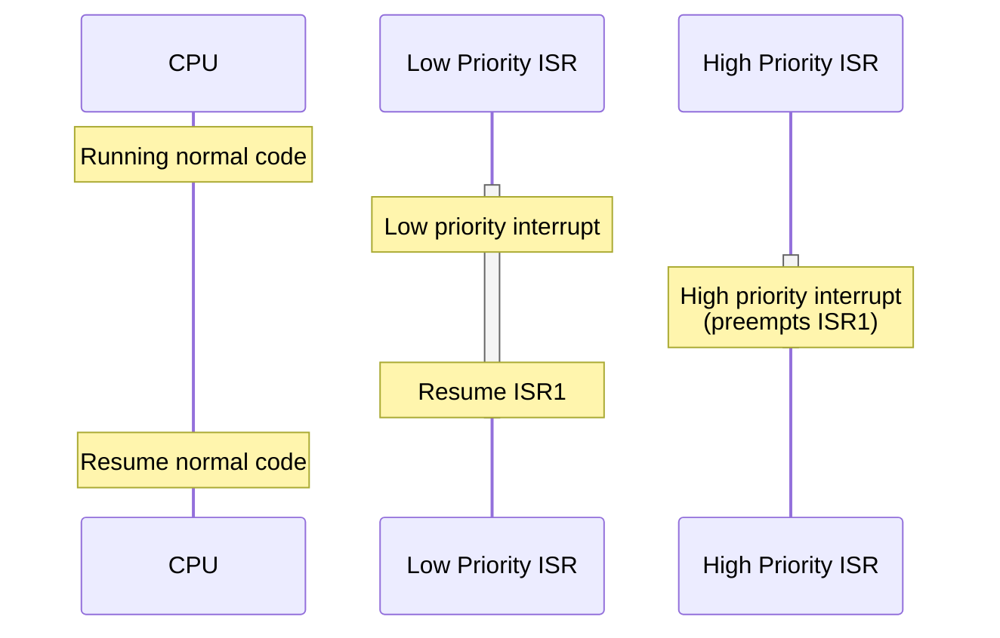

**Enabling nested interrupts:**

```c
void isr_handler() {
    // Save context
    save_registers();
    
    // Re-enable interrupts (allow nesting)
    enable_interrupts();
    
    // Handle interrupt
    handle_device();
    
    // Disable interrupts
    disable_interrupts();
    
    // Send EOI
    apic_eoi();
    
    // Restore context
    restore_registers();
}
```

## Bus Architecture

### Bus Types

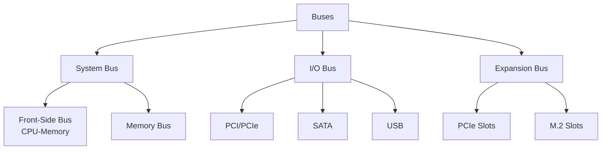

### Bus Signals

**3 növ signal:**

1. **Data lines** - Məlumat
2. **Address lines** - Address
3. **Control lines** - Read/Write, Clock, etc.

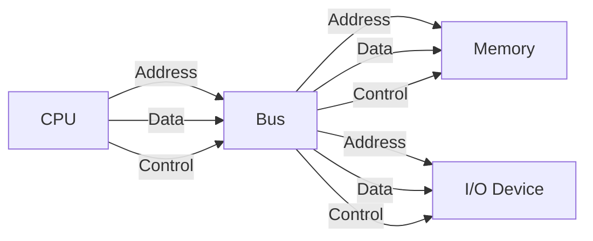

### Bus Arbitration

Bir neçə cihaz bus-dan istifadə etmək istəyərsə:

**1. Daisy Chain**

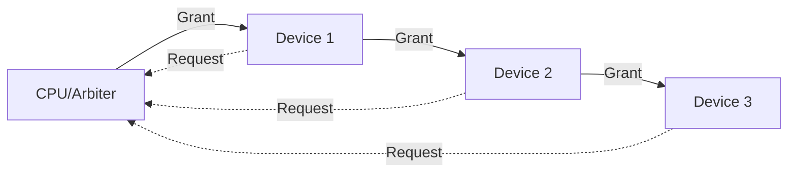

**2. Centralized Arbitration**

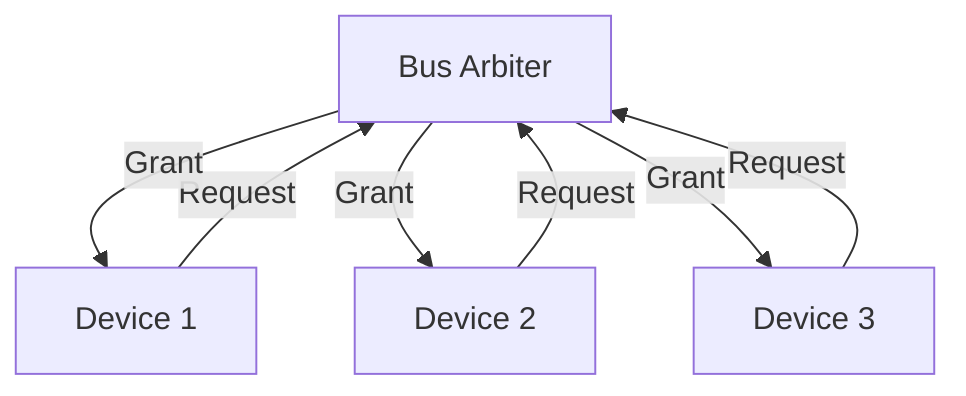

**3. Distributed Arbitration**

Hər cihaz özü arbitration edir (məsələn, Ethernet CSMA/CD).

## PCIe (PCI Express)

Modern high-speed serial bus.

### PCIe Topology

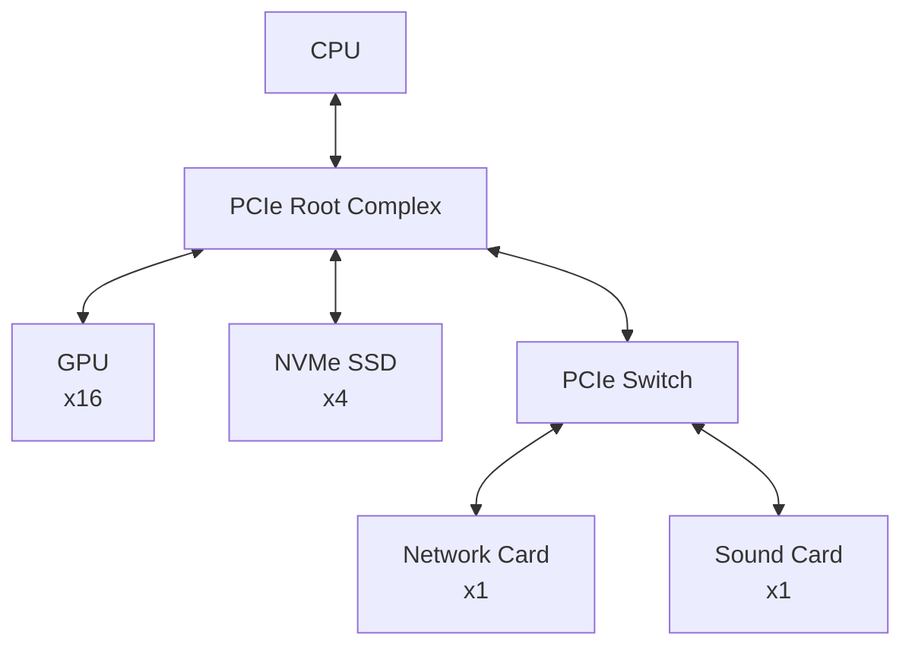

### PCIe Lanes

| Configuration | Lanes | Bandwidth (PCIe 3.0) | Bandwidth (PCIe 4.0) |
|---------------|-------|----------------------|----------------------|
| x1 | 1 | ~1 GB/s | ~2 GB/s |
| x4 | 4 | ~4 GB/s | ~8 GB/s |
| x8 | 8 | ~8 GB/s | ~16 GB/s |
| x16 | 16 | ~16 GB/s | ~32 GB/s |

**PCIe Generations:**

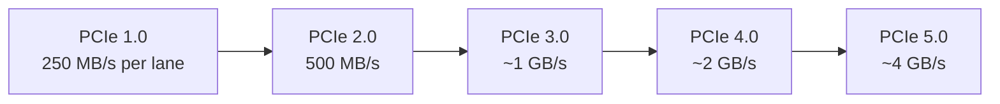

### PCIe Configuration Space

```c
// PCIe Configuration Space Access
uint32_t pcie_read_config(uint8_t bus, uint8_t device, 
                          uint8_t function, uint8_t offset) {
    uint32_t address = (1 << 31) | (bus << 16) | 
                       (device << 11) | (function << 8) | 
                       (offset & 0xFC);
    outl(0xCF8, address);
    return inl(0xCFC);
}
```

**Configuration registers:**
- Vendor ID, Device ID
- Command, Status
- Base Address Registers (BAR) - Memory-mapped I/O addresses
- Interrupt Line

## I/O Performance

### Latency vs Throughput

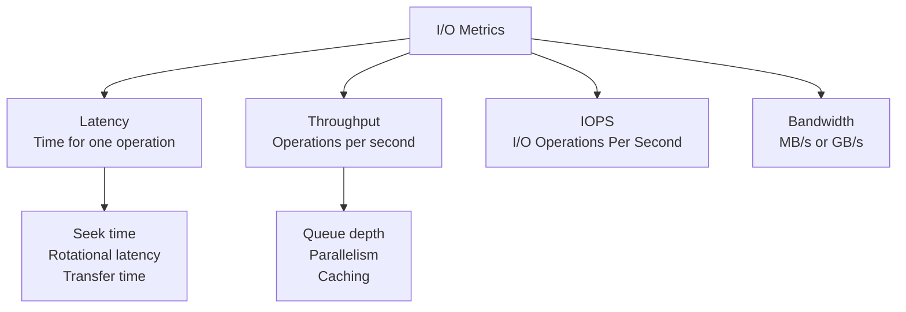

### I/O Bottlenecks

**1. CPU overhead**
```c
// High CPU usage
while (data_available()) {
    process(read_data());  // Polling
}
```

**2. Bus saturation**
```
PCIe x1 bandwidth: ~1 GB/s
Multiple devices competing → bottleneck
```

**3. Device speed**
```
HDD: ~100 MB/s, 100 IOPS
SSD: ~3000 MB/s, 500k IOPS
NVMe: ~7000 MB/s, 1M IOPS
```

### Optimizations

**1. Batching**

```c
// Instead of:
for (int i = 0; i < 1000; i++) {
    write_one_byte(data[i]);  // 1000 I/O operations
}

// Do:
write_buffer(data, 1000);  // 1 I/O operation
```

**2. Async I/O**

```c
// Linux io_uring
struct io_uring ring;
io_uring_queue_init(128, &ring, 0);

// Submit multiple requests
for (int i = 0; i < 10; i++) {
    struct io_uring_sqe *sqe = io_uring_get_sqe(&ring);
    io_uring_prep_read(sqe, fd, buffers[i], size, offset);
}
io_uring_submit(&ring);

// Wait for completions
struct io_uring_cqe *cqe;
io_uring_wait_cqe(&ring, &cqe);
```

**3. Zero-Copy**

```c
// sendfile() - kernel-to-kernel transfer
ssize_t sendfile(int out_fd, int in_fd, off_t *offset, size_t count);

// splice() - pipe-based zero-copy
ssize_t splice(int fd_in, loff_t *off_in, int fd_out, 
               loff_t *off_out, size_t len, unsigned int flags);
```

## Real-World Examples

### 1. Network Card (NIC)

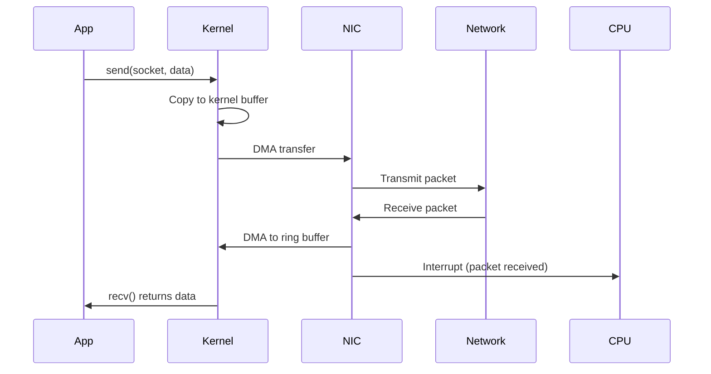

**Ring buffer:**

```c
struct rx_descriptor {
    uint64_t buffer_address;
    uint16_t length;
    uint16_t checksum;
    uint8_t status;
};

struct rx_ring {
    struct rx_descriptor descriptors[256];
    uint16_t head;
    uint16_t tail;
};
```

### 2. Disk I/O (NVMe)

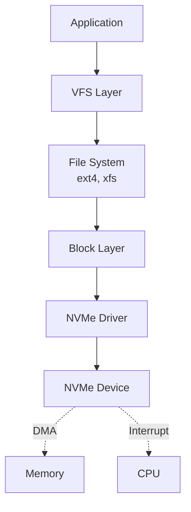

**NVMe submission queue:**

```c
struct nvme_command {
    uint8_t opcode;
    uint8_t flags;
    uint16_t command_id;
    uint32_t nsid;  // Namespace ID
    uint64_t metadata;
    uint64_t prp1;  // Physical Region Page
    uint64_t prp2;
    // Command-specific fields
};

void submit_nvme_read(uint64_t lba, uint32_t block_count) {
    struct nvme_command cmd = {0};
    cmd.opcode = NVME_CMD_READ;
    cmd.nsid = 1;
    cmd.prp1 = buffer_physical_address;
    // ... set LBA and block count
    
    // Write to submission queue
    submission_queue[tail] = cmd;
    tail = (tail + 1) % queue_size;
    
    // Ring doorbell
    writel(tail, nvme_doorbell_register);
}
```

## Best Practices

1. **Use DMA for large transfers**
   ```c
   if (size > 4096) {
       dma_transfer(src, dst, size);
   } else {
       memcpy(dst, src, size);
   }
   ```

2. **Minimize interrupts**
   - Interrupt coalescing
   - Polling mode for high-speed devices

3. **Async I/O**
   - Overlap computation with I/O
   - Use `io_uring`, `epoll`, `select`

4. **Cache I/O requests**
   - Page cache (Linux)
   - Write-back caching

5. **NUMA awareness**
   ```c
   // Allocate memory close to device
   numa_alloc_onnode(size, device_numa_node);
   ```

## Əlaqəli Mövzular

- **Memory Hierarchy:** DMA və cache coherency
- **Cache Memory:** I/O buffer caching
- **Storage Systems:** Disk controllers
- **Virtualization:** I/O virtualization (SR-IOV)
- **Performance:** I/O bottlenecks
