# Storage Arxitekturası

## Storage Hierarchy

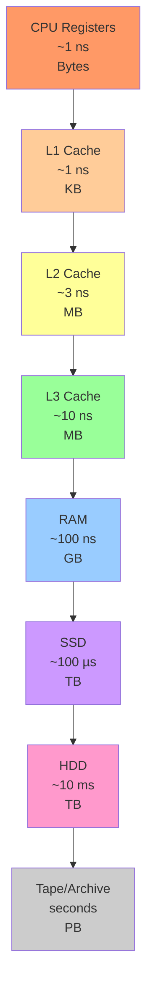

**Trade-off:** Speed ↔ Capacity ↔ Cost

## Hard Disk Drive (HDD)

### HDD Strukturu

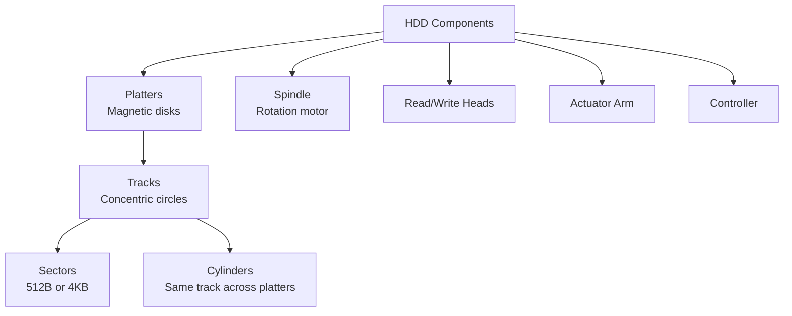

**Əsas parametrlər:**
- **RPM** (Rotations Per Minute): 5400, 7200, 10000, 15000
- **Capacity**: 1TB - 20TB
- **Interface**: SATA, SAS
- **Cache**: 64MB - 256MB

### HDD Performance

**Access time = Seek time + Rotational latency + Transfer time**

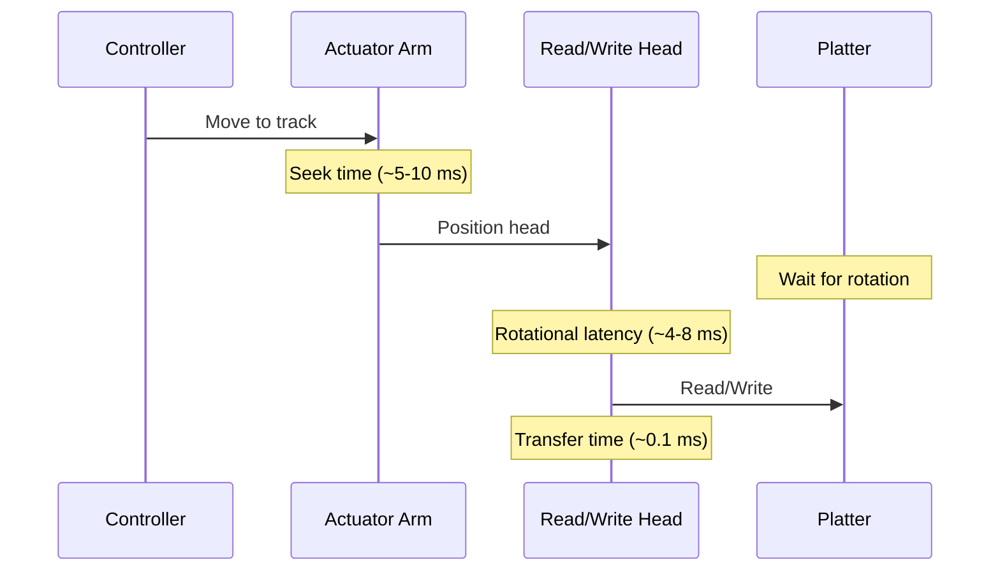

**Nümunə hesablama:**

```
Seek time:           8 ms (average)
Rotational latency:  4.17 ms (7200 RPM → 60000/7200/2)
Transfer time:       0.1 ms (512KB at 100 MB/s)
-----------------
Total:              ~12.3 ms per random access

Random IOPS: 1000 / 12.3 ≈ 80 IOPS
Sequential: ~150-200 MB/s
```

### Disk Scheduling Algorithms

**1. FCFS (First-Come, First-Served)**

```
Request queue: 98, 183, 37, 122, 14, 124, 65, 67
Head position: 53

Order: 53 → 98 → 183 → 37 → 122 → 14 → 124 → 65 → 67
Total movement: 45+85+146+85+108+110+59+2 = 640 cylinders
```

**2. SSTF (Shortest Seek Time First)**

```
Head: 53
Order: 53 → 65 → 67 → 37 → 14 → 98 → 122 → 124 → 183
Total movement: 12+2+30+23+84+24+2+59 = 236 cylinders
```

**Problem:** Starvation (far requests may never be served)

**3. SCAN (Elevator Algorithm)**

```
Head: 53, Direction: Right
Order: 53 → 65 → 67 → 98 → 122 → 124 → 183 → [end] → 37 → 14
Total movement: 183-53 + 183-14 = 130 + 169 = 299 cylinders
```

**4. C-SCAN (Circular SCAN)**

```
Head: 53, Direction: Right
Order: 53 → 65 → 67 → 98 → 122 → 124 → 183 → [jump to 0] → 14 → 37
Total movement: 130 + 183 + 37 = 350 cylinders
```

**5. LOOK / C-LOOK**

SCAN kimi, amma end-ə deyil, ən son request-ə qədər.

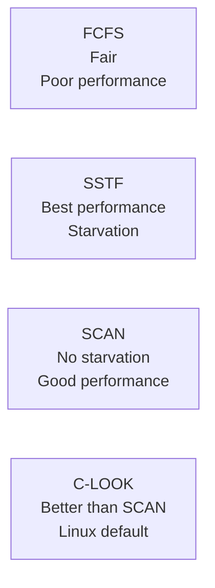

## Solid State Drive (SSD)

### SSD Strukturu

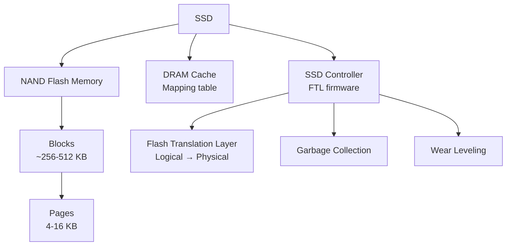

**NAND Flash növləri:**

| Tip | Bits/Cell | Speed | Endurance | Cost | Use Case |
|-----|-----------|-------|-----------|------|----------|
| SLC | 1 | Fastest | ~100k P/E | Highest | Enterprise |
| MLC | 2 | Fast | ~10k P/E | High | Consumer high-end |
| TLC | 3 | Medium | ~3k P/E | Medium | Consumer |
| QLC | 4 | Slow | ~1k P/E | Low | Archive |

**P/E Cycles** = Program/Erase cycles

### Flash Translation Layer (FTL)

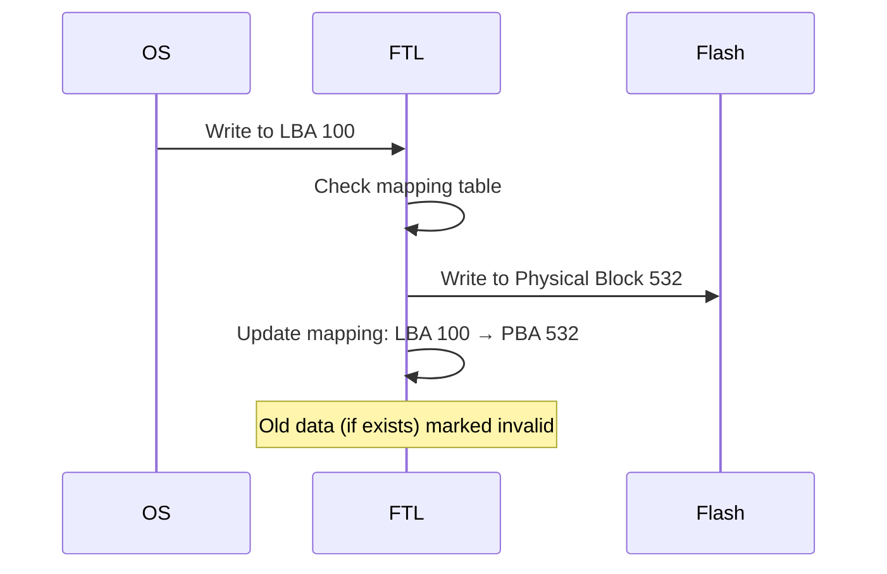

**FTL vəzifələri:**
- Logical-to-Physical mapping
- Wear leveling
- Garbage collection
- Bad block management

### Wear Leveling

NAND flash-ın hər block-u məhdud sayda yazıla bilər.

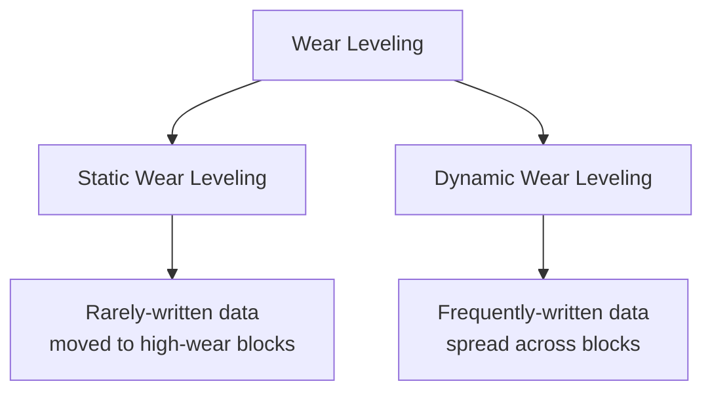

**Nümunə:**

```
Block 0: 5000 P/E cycles
Block 1: 2000 P/E cycles
Block 2: 100 P/E cycles

FTL action: Write new data to Block 2 (lowest wear)
If Block 2 has static data → move to Block 0, use Block 2 for new writes
```

### Garbage Collection

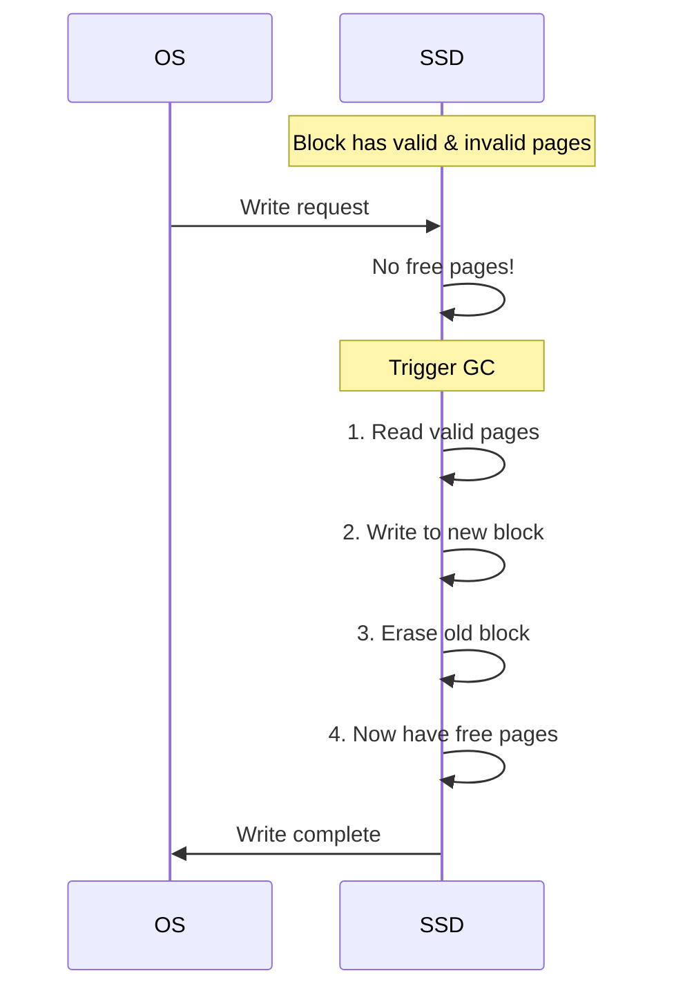

**Write Amplification:**

```
Write Amplification Factor (WAF) = Data written to flash / Data written by host

Example:
Host writes 1 GB
SSD writes 1 GB (new) + 500 MB (GC moves valid data)
WAF = 1.5 GB / 1 GB = 1.5
```

**WAF minimize etmək:**
- Over-provisioning (extra capacity for GC)
- TRIM command (OS tells SSD which blocks are free)
- Write less frequently

### TRIM Command

```bash
# Linux - manual TRIM
fstrim -v /

# Enable periodic TRIM
systemctl enable fstrim.timer

# Check if SSD supports TRIM
lsblk -D
```

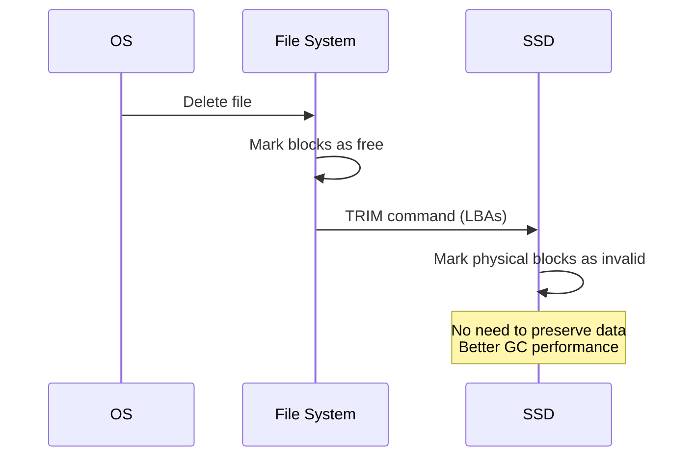

## HDD vs SSD Comparison

| Xüsusiyyət | HDD | SSD |
|------------|-----|-----|
| **Speed** | | |
| Sequential Read | 100-200 MB/s | 500-7000 MB/s |
| Sequential Write | 100-200 MB/s | 500-7000 MB/s |
| Random IOPS | 80-160 | 10k-1M |
| Latency | 5-10 ms | 0.1 ms |
| **Physical** | | |
| Shock resistant | No (moving parts) | Yes |
| Noise | Yes | No |
| Power | 6-10W | 2-5W |
| Heat | More | Less |
| **Cost & Capacity** | | |
| $/GB | ~$0.02 | ~$0.10 |
| Max capacity | 20 TB | 8 TB (consumer) |
| Lifespan | 3-5 years | 5-10 years |
| **Use Case** | | |
| Large storage | ✓ | |
| Boot drive | | ✓ |
| Databases | | ✓ |
| Archive | ✓ | |

## NVMe (Non-Volatile Memory Express)

### NVMe vs SATA

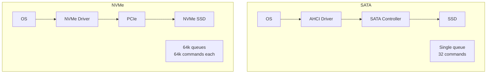

| Xüsusiyyət | SATA | NVMe |
|------------|------|------|
| Interface | SATA (6 Gbps) | PCIe 3.0 x4 (32 Gbps) |
| Max speed | ~550 MB/s | ~3500 MB/s (PCIe 3.0) |
|  |  | ~7000 MB/s (PCIe 4.0) |
| Queue depth | 32 | 64k |
| Queues | 1 | 64k |
| Latency | Higher | Lower (less protocol overhead) |
| CPU overhead | Higher | Lower (direct PCIe) |

### NVMe Architecture

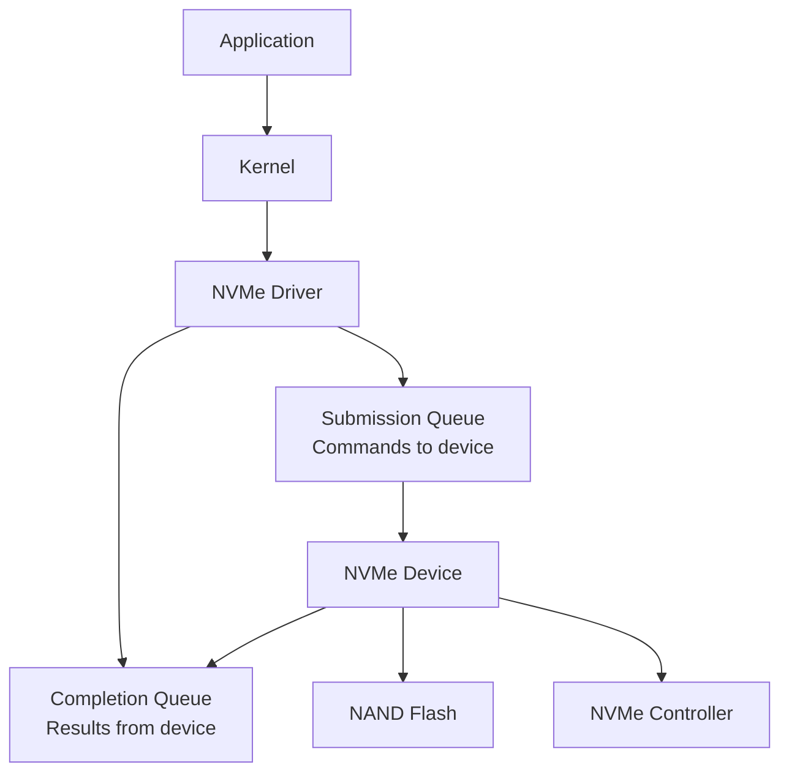

**Command flow:**

1. Driver writes command to Submission Queue
2. Driver rings doorbell register (notify device)
3. Device fetches command via DMA
4. Device processes command
5. Device writes completion entry to Completion Queue
6. Device sends interrupt (or driver polls)
7. Driver reads Completion Queue

### NVMe Command Example

```c
struct nvme_rw_command {
    uint8_t  opcode;      // READ or WRITE
    uint8_t  flags;
    uint16_t command_id;
    uint32_t nsid;        // Namespace ID
    uint64_t slba;        // Starting LBA
    uint16_t length;      // Number of blocks
    // ... more fields
    uint64_t prp1;        // Physical Region Page 1
    uint64_t prp2;        // Physical Region Page 2
};

// Submit read command
void nvme_read(uint64_t lba, uint16_t blocks, void* buffer) {
    struct nvme_rw_command cmd = {0};
    cmd.opcode = NVME_CMD_READ;
    cmd.nsid = 1;
    cmd.slba = lba;
    cmd.length = blocks - 1;  // 0-based
    cmd.prp1 = virt_to_phys(buffer);
    
    // Write to submission queue
    submit_queue[sq_tail] = cmd;
    sq_tail = (sq_tail + 1) % queue_size;
    
    // Ring doorbell
    writel(sq_tail, doorbell_register);
}
```

### NVMe Performance

```
PCIe 3.0 x4: ~4 GB/s theoretical, ~3.5 GB/s real
PCIe 4.0 x4: ~8 GB/s theoretical, ~7 GB/s real
PCIe 5.0 x4: ~16 GB/s theoretical, ~14 GB/s real

Random 4K IOPS: 500k - 1M
Latency: 10-20 µs
```

## RAID (Redundant Array of Independent Disks)

### RAID Levels

**RAID 0 - Striping**

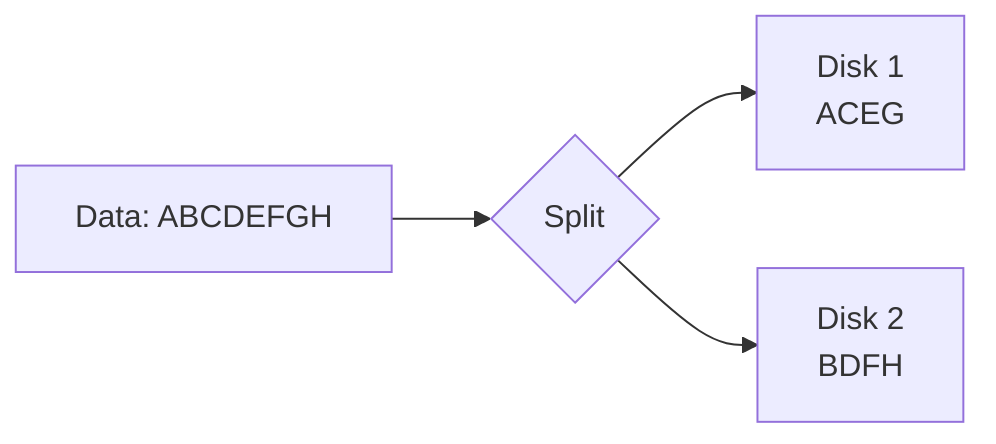

- **Capacity:** N × disk_size
- **Performance:** N × speed
- **Redundancy:** None (any disk fails → data lost)
- **Use case:** Performance, temporary data

**RAID 1 - Mirroring**

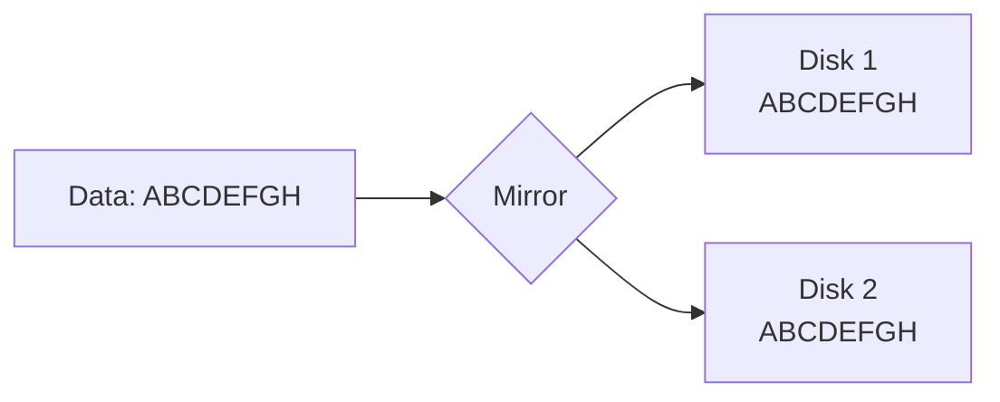

- **Capacity:** disk_size
- **Performance:** Read: 2×, Write: 1×
- **Redundancy:** 1 disk failure tolerated
- **Use case:** Critical data

**RAID 5 - Striping with Parity**

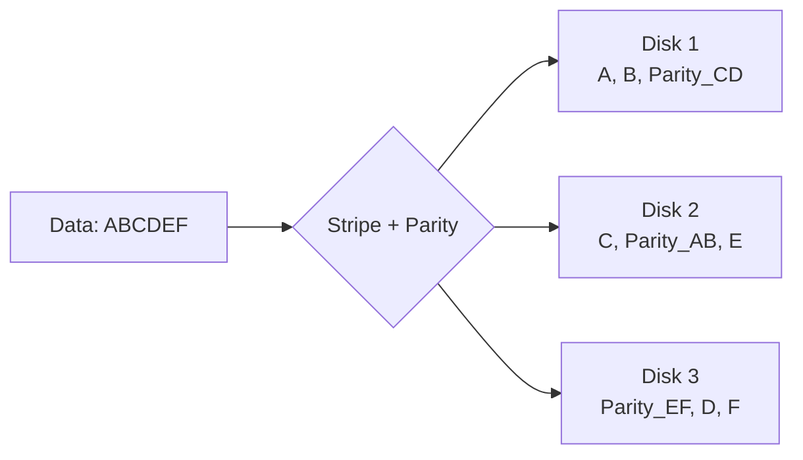

- **Capacity:** (N-1) × disk_size
- **Performance:** Read: fast, Write: slower (parity calc)
- **Redundancy:** 1 disk failure
- **Use case:** General purpose

**Parity calculation:**

```
A = 10110101
B = 11001010
Parity = A XOR B = 01111111

If A is lost:
A = B XOR Parity = 11001010 XOR 01111111 = 10110101
```

**RAID 6 - Double Parity**

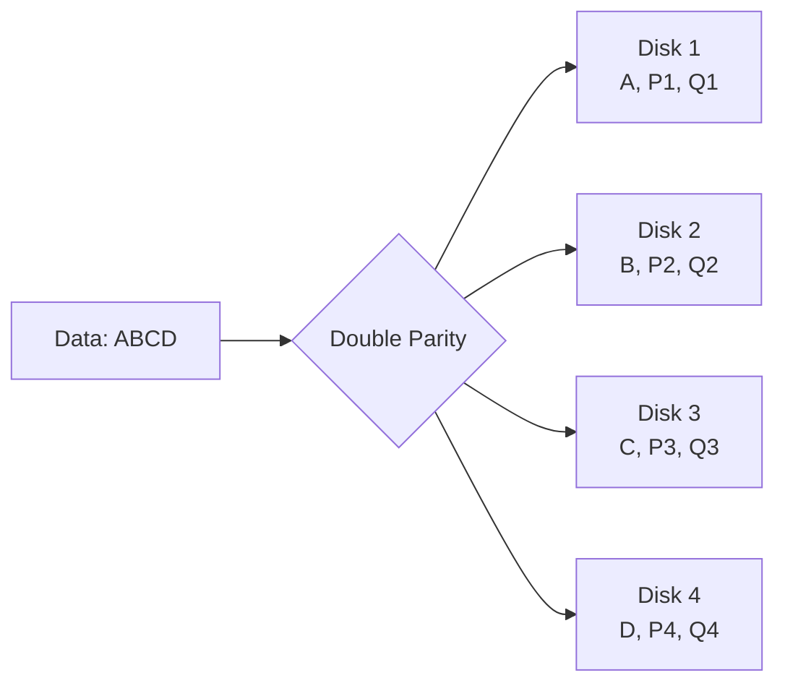

- **Capacity:** (N-2) × disk_size
- **Redundancy:** 2 disk failures
- **Use case:** High reliability

**RAID 10 (1+0) - Mirrored Stripes**

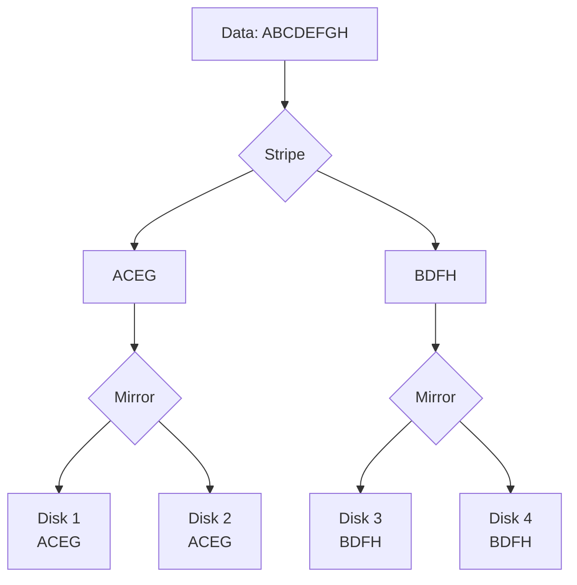

- **Capacity:** N/2 × disk_size
- **Performance:** Excellent
- **Redundancy:** 1 disk per mirror
- **Use case:** High performance + reliability

### RAID Comparison

| RAID | Capacity | Performance | Redundancy | Min Disks |
|------|----------|-------------|------------|-----------|
| 0 | 100% | Excellent | None | 2 |
| 1 | 50% | Good read | 1 disk | 2 |
| 5 | (N-1)/N | Good | 1 disk | 3 |
| 6 | (N-2)/N | Good | 2 disks | 4 |
| 10 | 50% | Excellent | 1 per mirror | 4 |

## Storage Interfaces

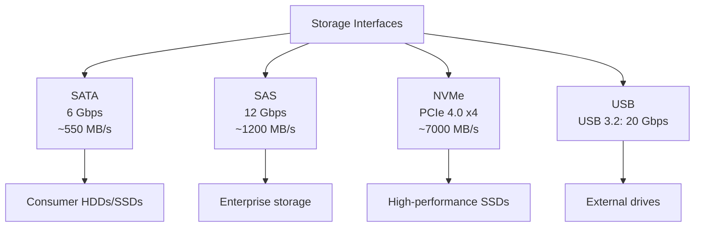

## Storage Performance Optimization

### 1. Alignment

```bash
# Check partition alignment
sudo parted /dev/sda align-check optimal 1

# Align to 1MB boundary (optimal for SSDs)
sudo parted /dev/sda mkpart primary 1MiB 100%
```

**Misalignment nəticəsi:**

```
Partition starts at 512B
SSD page size: 4KB

Write 4KB → spans 2 pages → 2 operations instead of 1
```

### 2. File System Selection

| FS | Best for | Features |
|----|----------|----------|
| ext4 | General Linux | Mature, journaling |
| XFS | Large files | Good performance |
| Btrfs | Snapshots | CoW, compression |
| F2FS | SSD | Flash-friendly |
| NTFS | Windows | Journaling |
| APFS | macOS | SSD-optimized |

### 3. I/O Scheduler

```bash
# Check current scheduler
cat /sys/block/sda/queue/scheduler

# Set scheduler
echo mq-deadline > /sys/block/sda/queue/scheduler

# Schedulers:
# - none: No scheduling (for NVMe)
# - mq-deadline: Good for SSD
# - bfq: Fair queuing (desktop)
# - kyber: Low latency
```

### 4. Read-Ahead

```bash
# Check read-ahead
sudo blockdev --getra /dev/sda

# Set read-ahead (in 512-byte sectors)
sudo blockdev --setra 256 /dev/sda  # 128 KB
```

### 5. Queue Depth

```bash
# Check queue depth
cat /sys/block/nvme0n1/queue/nr_requests

# Increase for high-IOPS workloads
echo 1024 > /sys/block/nvme0n1/queue/nr_requests
```

## Advanced Topics

### 1. Over-Provisioning

```
User-visible capacity: 240 GB
Physical capacity: 256 GB
Over-provisioning: 16 GB (6.25%)

Purpose:
- Reserve space for wear leveling
- Better GC performance
- Maintain performance over time
```

### 2. DRAM Cache

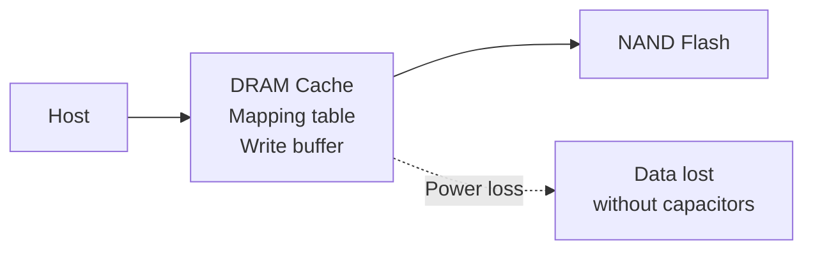

**DRAM-less SSDs:**
- Cheaper
- Slower (mapping in HMB - Host Memory Buffer)
- Less reliable

### 3. SLC Cache

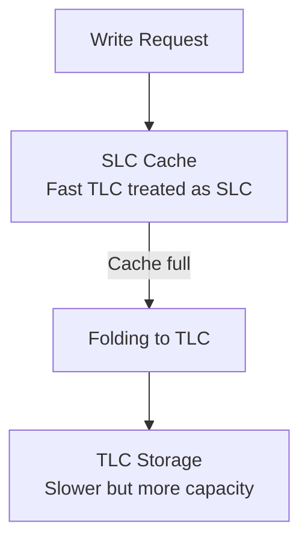

**Performance pattern:**

```
Fast writes (SLC cache): 500 MB/s
Cache full, folding: 100 MB/s (slow!)
```

### 4. Write Coalescing

```c
// Instead of:
write(fd, buffer, 4096);   // 4K write
write(fd, buffer, 4096);   // 4K write
write(fd, buffer, 4096);   // 4K write
write(fd, buffer, 4096);   // 4K write

// Coalesce:
write(fd, large_buffer, 16384);  // 16K write (1 flash page)
```

## Best Practices

1. **SSD:**
   - Enable TRIM
   - Don't defragment
   - Disable hibernation/swap on consumer SSDs
   - Keep 10-20% free space

2. **HDD:**
   - Regular defragmentation (Windows)
   - Avoid excessive head movement
   - Use for cold storage

3. **RAID:**
   - Monitor disk health (SMART)
   - Replace failed disks immediately
   - Use hot spares

4. **Performance:**
   - Align partitions
   - Choose right file system
   - Use appropriate I/O scheduler
   - Monitor with `iostat`, `iotop`

5. **Reliability:**
   - Regular backups (3-2-1 rule)
   - Monitor disk temperature
   - Check SMART attributes

## Monitoring Tools

```bash
# Disk usage
df -h
lsblk

# I/O statistics
iostat -x 1

# Disk activity
iotop

# SMART status
smartctl -a /dev/sda

# NVMe info
nvme list
nvme smart-log /dev/nvme0n1

# Benchmark
fio --name=test --rw=randread --bs=4k --size=1G
```

## Əlaqəli Mövzular

- **I/O Systems:** DMA, interrupts
- **Memory Hierarchy:** Caching strategies
- **File Systems:** Storage management
- **Performance:** I/O optimization
- **Reliability:** RAID, backups
