# Modern CPU Arxitekturaları

## Architecture Overview

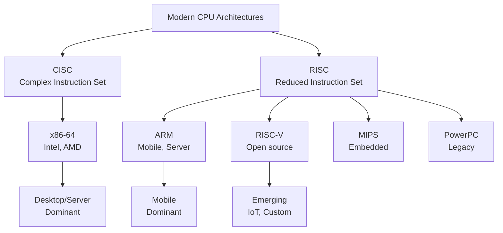

## x86-64 Architecture

### History

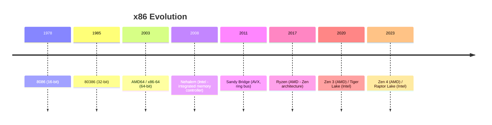

### x86-64 Xüsusiyyətləri

**CISC fəlsəfəsi:**
- Variable-length instructions (1-15 bytes)
- Complex addressing modes
- Microcode (CISC → RISC micro-ops)
- Backward compatibility (1978-dən)

**Registers:**

```
General Purpose (64-bit):
RAX, RBX, RCX, RDX, RSI, RDI, RBP, RSP
R8, R9, R10, R11, R12, R13, R14, R15

SIMD (Vector):
XMM0-XMM15 (128-bit) - SSE
YMM0-YMM15 (256-bit) - AVX
ZMM0-ZMM31 (512-bit) - AVX-512

Segment Registers:
CS, DS, SS, ES, FS, GS (mostly legacy)

Special:
RIP (Instruction Pointer)
RFLAGS (Status flags)
```

**Memory Model:**

```
Canonical addresses (48-bit actually used):
User space:   0x0000000000000000 - 0x00007FFFFFFFFFFF
Kernel space: 0xFFFF800000000000 - 0xFFFFFFFFFFFFFFFF

4-level page table (5-level on new CPUs)
```

### Intel vs AMD

**Intel Microarchitecture (2023):**

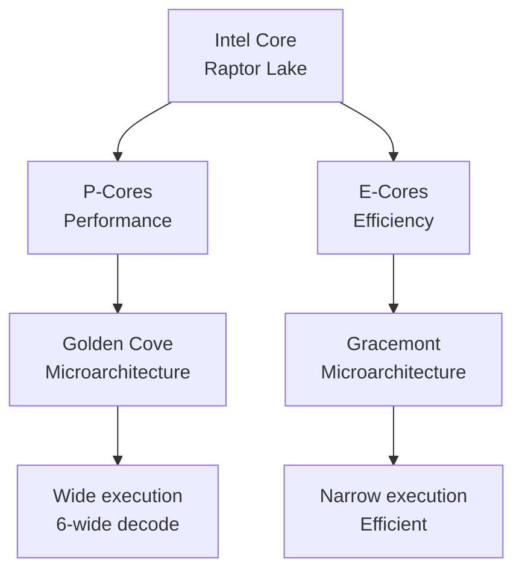

**AMD Microarchitecture (2023):**

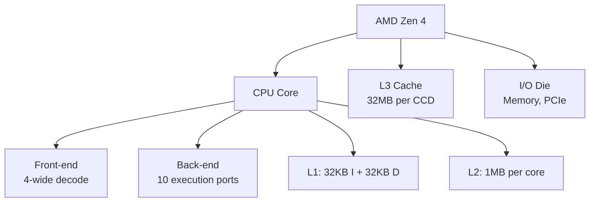

### Performance Comparison (2023)

| Xüsusiyyət | Intel Core i9-13900K | AMD Ryzen 9 7950X |
|------------|---------------------|-------------------|
| Architecture | Raptor Lake | Zen 4 |
| Cores | 24 (8P + 16E) | 16 (all equal) |
| Threads | 32 | 32 |
| Base Clock | 3.0 GHz (P) / 2.2 GHz (E) | 4.5 GHz |
| Boost Clock | 5.8 GHz | 5.7 GHz |
| L3 Cache | 36 MB | 64 MB |
| TDP | 125W (PL1) / 253W (PL2) | 170W |
| Process | Intel 7 (10nm) | TSMC 5nm |
| PCIe | Gen 5.0 (16 lanes) | Gen 5.0 (24 lanes) |
| DDR Support | DDR4/DDR5 | DDR5 only |

**Use case:**
- **Intel:** Better single-thread, gaming
- **AMD:** Better multi-thread, productivity

## ARM Architecture

### ARM Xüsusiyyətləri

**RISC fəlsəfəsi:**
- Fixed-length instructions (32-bit)
- Load/Store architecture
- Simple addressing modes
- Energy efficient

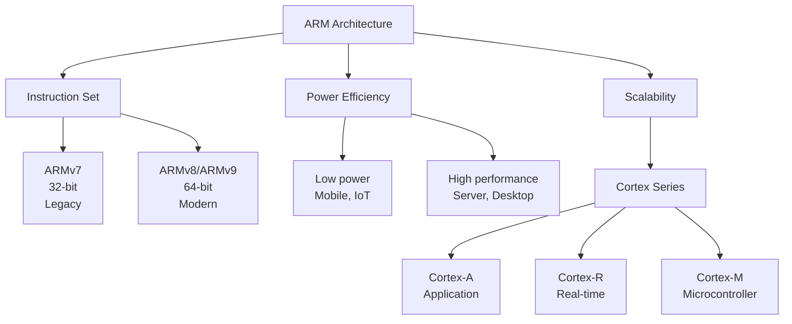

### ARMv8/ARMv9 Registers

```
General Purpose (64-bit):
X0-X30 (64-bit) or W0-W30 (32-bit lower half)
X30 = Link Register (LR)
XZR = Zero Register

Special:
SP  = Stack Pointer
PC  = Program Counter

SIMD/FP:
V0-V31 (128-bit) - NEON
Can be accessed as:
- Q0-Q31 (128-bit)
- D0-D31 (64-bit)
- S0-S31 (32-bit)
- H0-H31 (16-bit)
- B0-B31 (8-bit)
```

### ARM Instruction Example

```asm
// ARM64 assembly
add x0, x1, x2        // x0 = x1 + x2
ldr x0, [x1, #8]      // Load from memory: x0 = *(x1 + 8)
str x0, [x1, #8]      // Store to memory: *(x1 + 8) = x0
cmp x0, x1            // Compare x0 and x1
b.eq label            // Branch if equal
ret                   // Return (jump to LR)
```

**Load/Store architecture:**

```c
// Cannot do: add x0, [memory], x1
// Must do:
ldr x2, [memory]      // Load
add x0, x2, x1        // Compute
str x0, [result]      // Store
```

### ARM Ecosystem

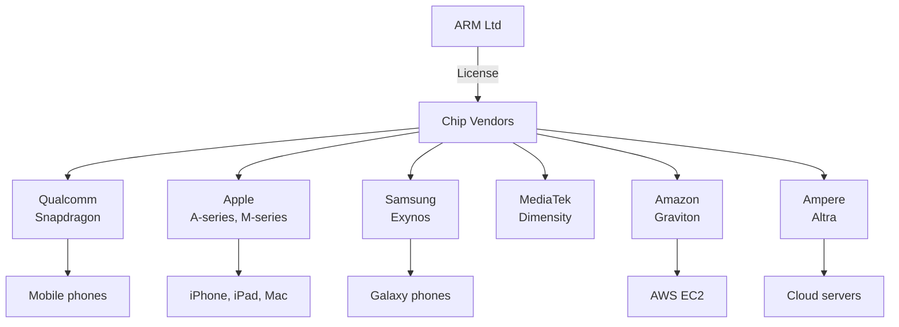

### ARM Server CPUs (2023)

| CPU | Vendor | Cores | Clock | TDP | Use Case |
|-----|--------|-------|-------|-----|----------|
| Graviton3 | Amazon | 64 | 2.6 GHz | ~300W | AWS cloud |
| Altra Max | Ampere | 128 | 3.0 GHz | 250W | Cloud/HPC |
| Neoverse V2 | ARM (ref) | Scalable | - | - | Reference design |

## Apple Silicon

### M1/M2/M3 Architecture

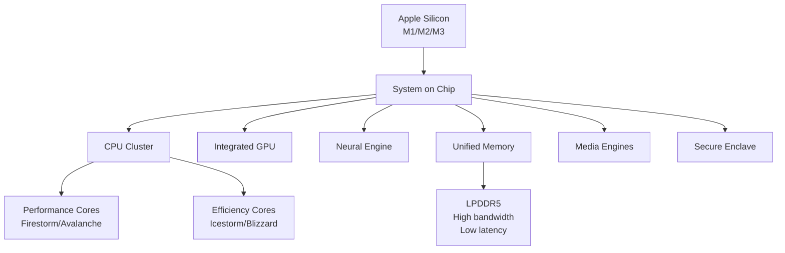

### Apple M-series Comparison

| Model | M1 | M2 | M3 | M1 Ultra |
|-------|-------|-------|-------|----------|
| **Launch** | 2020 | 2022 | 2023 | 2022 |
| **Process** | TSMC 5nm | TSMC 5nm | TSMC 3nm | 2×M1 Max |
| **P-Cores** | 4 | 4 | 4 | 16 |
| **E-Cores** | 4 | 4 | 4 | 16 |
| **GPU Cores** | 7-8 | 8-10 | 10 | 48-64 |
| **Neural Engine** | 16-core | 16-core | 16-core | 32-core |
| **Memory** | 8-16 GB | 8-24 GB | 8-24 GB | 64-128 GB |
| **Bandwidth** | 68 GB/s | 100 GB/s | 100 GB/s | 800 GB/s |
| **TDP** | ~15W | ~20W | ~20W | ~60W |

### Unified Memory Architecture

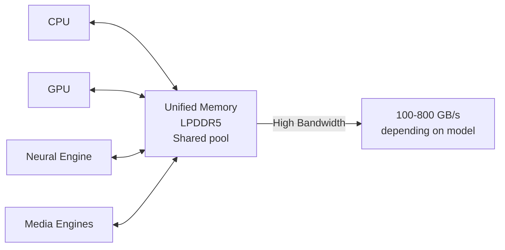

**Üstünlüklər:**
- Zero-copy between CPU/GPU
- Lower latency
- Better power efficiency
- Simpler programming model

**Çatışmazlıqlar:**
- Not upgradeable
- Shared bandwidth

### M1 Performance

**Single-thread:**
- Comparable to Intel Core i9 / AMD Ryzen 9
- Much lower power (~5W vs 125W+)

**Efficiency:**
- ~2-3× performance per watt vs x86

**GPU:**
- Integrated GPU competitive with mid-range discrete GPUs
- Excellent for content creation (video encoding/decoding)

## RISC-V

### RISC-V Xüsusiyyətləri

**Open-source ISA:**
- Free to use, no licensing fees
- Modular design
- Extensible
- Simple and elegant

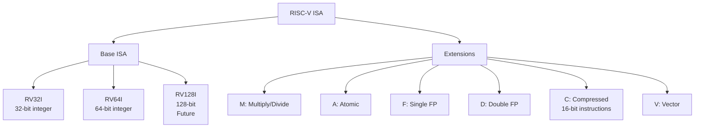

### RISC-V Registers

```
Integer Registers:
x0 (zero) - Hardwired to 0
x1 (ra)   - Return address
x2 (sp)   - Stack pointer
x3 (gp)   - Global pointer
x4 (tp)   - Thread pointer
x5-x7, x28-x31 (t0-t6) - Temporaries
x8-x9, x18-x27 (s0-s11) - Saved registers
x10-x17 (a0-a7) - Function arguments/return values

Floating-Point Registers:
f0-f31

Vector Registers (V extension):
v0-v31
```

### RISC-V Instruction Format

```
R-type (Register):
[funct7 | rs2 | rs1 | funct3 | rd | opcode]
 7 bits   5     5      3       5     7

Example: add x1, x2, x3  // x1 = x2 + x3

I-type (Immediate):
[immediate | rs1 | funct3 | rd | opcode]
  12 bits    5      3       5     7

Example: addi x1, x2, 100  // x1 = x2 + 100

Load: lw x1, 8(x2)  // x1 = *(x2 + 8)
```

### RISC-V Ecosystem

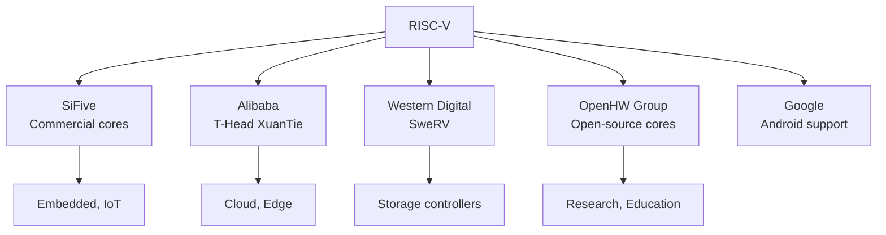

**Use cases:**
- Embedded systems
- IoT devices
- Custom accelerators
- Research and education
- Future: Desktop/Server (emerging)

## GPU Architecture Basics

### GPU vs CPU

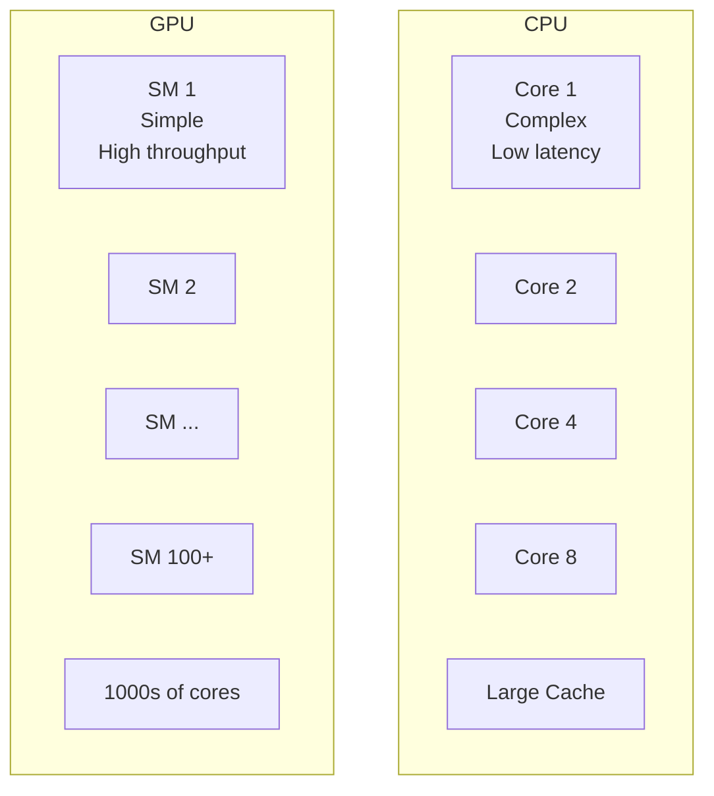

| Aspect | CPU | GPU |
|--------|-----|-----|
| **Design** | Few complex cores | Many simple cores |
| **Threads** | 10s-100s | 1000s-10000s |
| **Latency** | Optimized for low latency | High latency tolerated |
| **Cache** | Large (MB) | Small (KB per core) |
| **Control Flow** | Good branch prediction | SIMT (threads diverge = slow) |
| **Use Case** | General purpose | Parallel workloads |

### CUDA Architecture (NVIDIA)

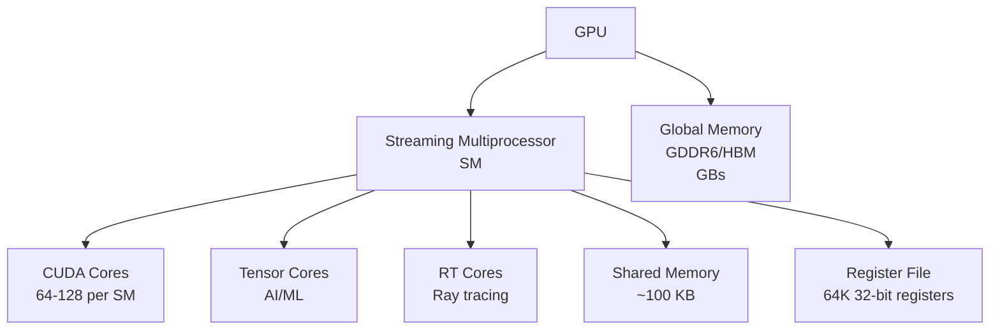

**Execution Model:**

```
Grid (entire GPU kernel)
├── Block 1 (executed on 1 SM)
│   ├── Warp 1 (32 threads, lockstep)
│   ├── Warp 2
│   └── ...
├── Block 2
└── ...
```

**Warp:**
- 32 threads execute together (SIMT)
- Same instruction, different data
- Branch divergence → serialize

### GPU Programming Example

```cuda
// CUDA kernel
__global__ void vectorAdd(float* a, float* b, float* c, int n) {
    int i = blockIdx.x * blockDim.x + threadIdx.x;
    if (i < n) {
        c[i] = a[i] + b[i];
    }
}

// Host code
int n = 1000000;
int blockSize = 256;
int numBlocks = (n + blockSize - 1) / blockSize;

vectorAdd<<<numBlocks, blockSize>>>(d_a, d_b, d_c, n);
```

**Memory Hierarchy:**

```
Registers:        ~1 cycle   (per-thread)
Shared Memory:    ~5 cycles  (per-block)
L1 Cache:         ~10 cycles
L2 Cache:         ~100 cycles
Global Memory:    ~200-400 cycles
```

### Modern GPU Comparison (2023)

| GPU | Vendor | Architecture | Cores | Memory | Bandwidth | TDP | Use Case |
|-----|--------|--------------|-------|--------|-----------|-----|----------|
| RTX 4090 | NVIDIA | Ada Lovelace | 16384 CUDA | 24GB GDDR6X | 1008 GB/s | 450W | Gaming, AI |
| RX 7900 XTX | AMD | RDNA 3 | 12288 Stream | 24GB GDDR6 | 960 GB/s | 355W | Gaming |
| H100 | NVIDIA | Hopper | 16896 CUDA | 80GB HBM3 | 3350 GB/s | 700W | Data center AI |
| A100 | NVIDIA | Ampere | 6912 CUDA | 40-80GB HBM2e | 1555-2039 GB/s | 400W | Data center |

## Architecture Comparison

### Instruction Set

| ISA | Type | Complexity | Compatibility | Power | Performance |
|-----|------|------------|---------------|-------|-------------|
| x86-64 | CISC | High | Excellent (40+ years) | Moderate | Excellent |
| ARM | RISC | Low-Medium | Good | Excellent | Good-Excellent |
| RISC-V | RISC | Low | Emerging | Excellent | Good |

### Market Share (2023)


### Performance per Watt

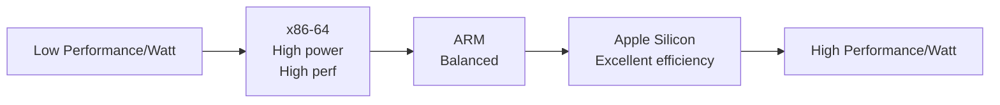

## Heterogeneous Computing

### big.LITTLE (ARM)

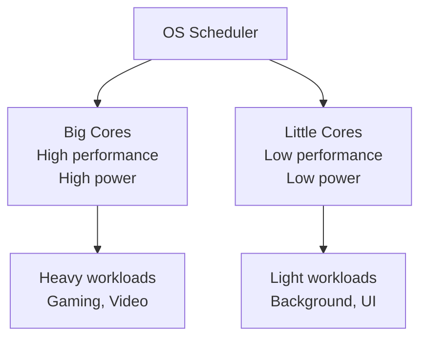

**DynamIQ:**
- More flexible than big.LITTLE
- Mix different core types in same cluster
- Better migration

### Intel Hybrid (P/E Cores)

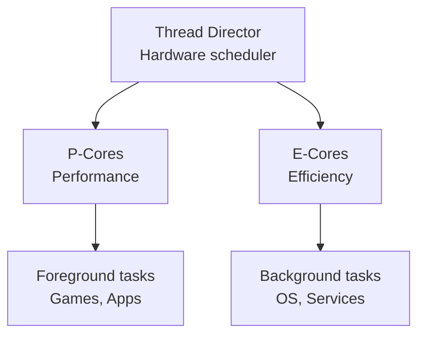

**Alder Lake onwards (2021+):**
- P-cores: High performance, out-of-order, SMT
- E-cores: High efficiency, simpler, no SMT
- Thread Director: Hardware hints to OS

## Future Trends

### 1. Chiplet Design

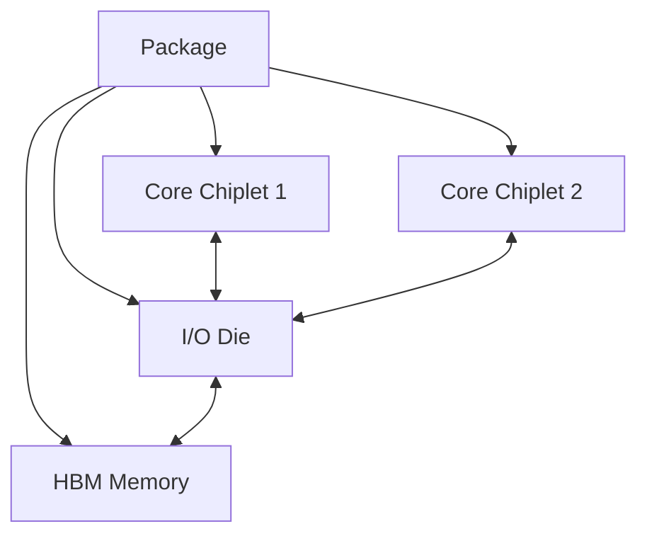

**Benefits:**
- Better yields (small dies)
- Mix-and-match components
- Scalability

**Examples:**
- AMD Ryzen/EPYC (Zen 2+)
- Intel Sapphire Rapids

### 2. 3D Stacking

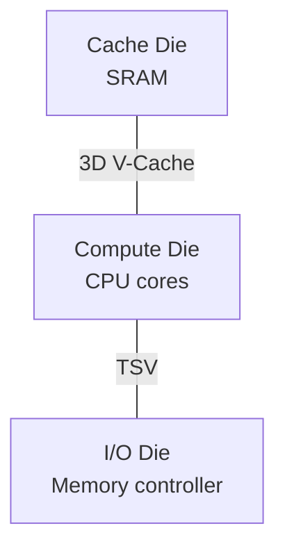

**AMD 3D V-Cache:**
- Stack L3 cache on top of cores
- 96MB L3 (Ryzen 7 5800X3D)
- 20-30% gaming performance boost

### 3. Custom Silicon

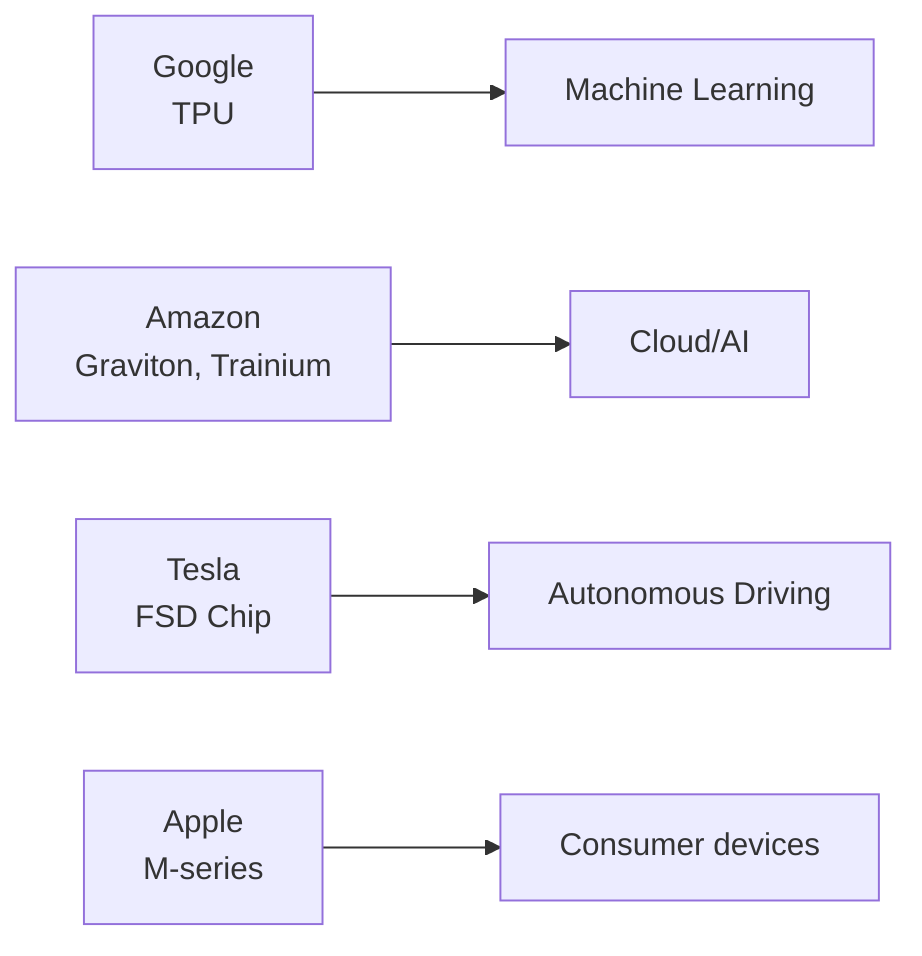

### 4. Open Source Hardware

- RISC-V adoption growing
- OpenPOWER
- Open-source GPU initiatives (e.g., Nyuzi)

### 5. Quantum Computing

```
Classical bit: 0 or 1
Qubit: Superposition of 0 and 1

Not replacement for classical, but for specific problems:
- Cryptography
- Optimization
- Simulation
```

## Best Practices

### 1. Architecture Selection

**x86-64 if:**
- Need maximum single-thread performance
- Software compatibility critical
- Desktop/gaming

**ARM if:**
- Power efficiency important
- Mobile/embedded
- Modern software stack

**RISC-V if:**
- Custom hardware
- No licensing costs
- Embedded/IoT

### 2. Cross-Platform Development

```c
// Portable code
#ifdef __x86_64__
    #include <immintrin.h>  // x86 intrinsics
#elif __aarch64__
    #include <arm_neon.h>   // ARM NEON
#endif

// Abstract SIMD operations
typedef __m128 vec4f;  // x86
typedef float32x4_t vec4f;  // ARM
```

### 3. Performance Tuning

```c
// x86-64: Focus on cache, branch prediction
// ARM: Focus on power, data access patterns
// GPU: Focus on parallelism, memory coalescing
```

### 4. Profiling Tools

```bash
# x86
perf stat ./program
Intel VTune

# ARM
perf (Linux)
Instruments (Apple)
Streamline (ARM)

# GPU
nvprof (NVIDIA)
Nsight (NVIDIA)
```

## Əlaqəli Mövzular

- **CPU Architecture:** Core components
- **ISA:** Instruction sets
- **Performance:** Optimization techniques
- **Parallelism:** Multi-core, SIMD
- **Power Management:** Efficiency cores
- **Memory Hierarchy:** Different architectures
