# Virtualizasiya Hardware Dəstəyi

## Virtualizasiya Nədir?

**Virtualizasiya** - fiziki hardware resurslarını bir neçə virtual environment arasında bölüşdürmək.

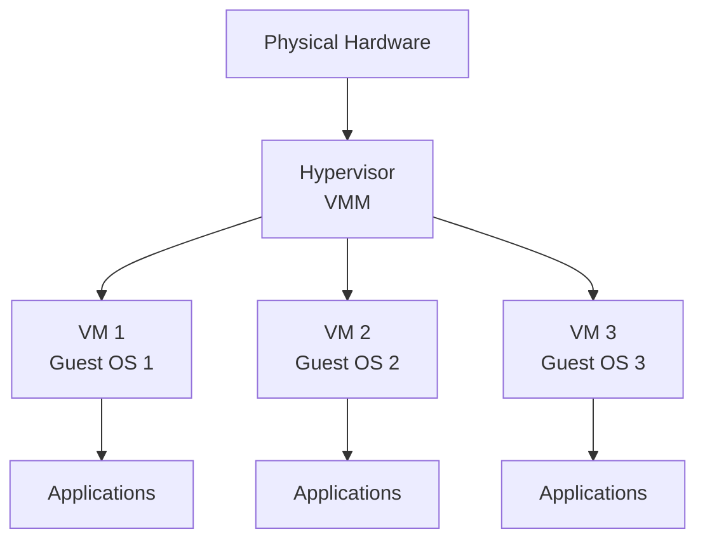

**Faydaları:**
- **Resource utilization** - Hardware-ı tam istifadə et
- **Isolation** - VM-lər bir-birindən təcrid olunub
- **Flexibility** - Asanlıqla VM yaradıb silmək
- **Cost savings** - Az fiziki serverlə çox iş
- **Disaster recovery** - Snapshot, backup, migration

## Virtualizasiya Növləri

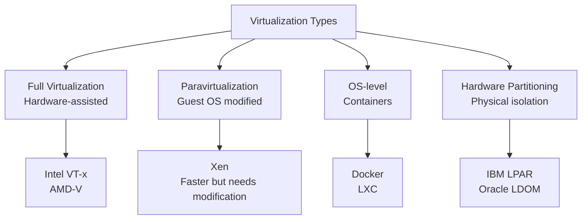

## CPU Virtualization

### Problem: Privilege Levels

x86 ring model:

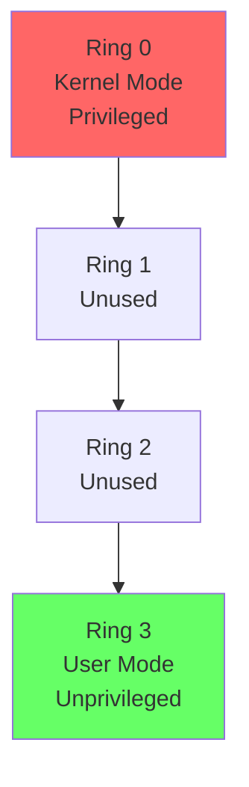

**Problem:**
```
Guest OS Ring 0-da çalışmalı (privileged instructions)
Amma hypervisor var Ring 0-da!

Solution: Hardware virtualization
```

### Intel VT-x (VMX)

**Intel Virtualization Technology for x86**

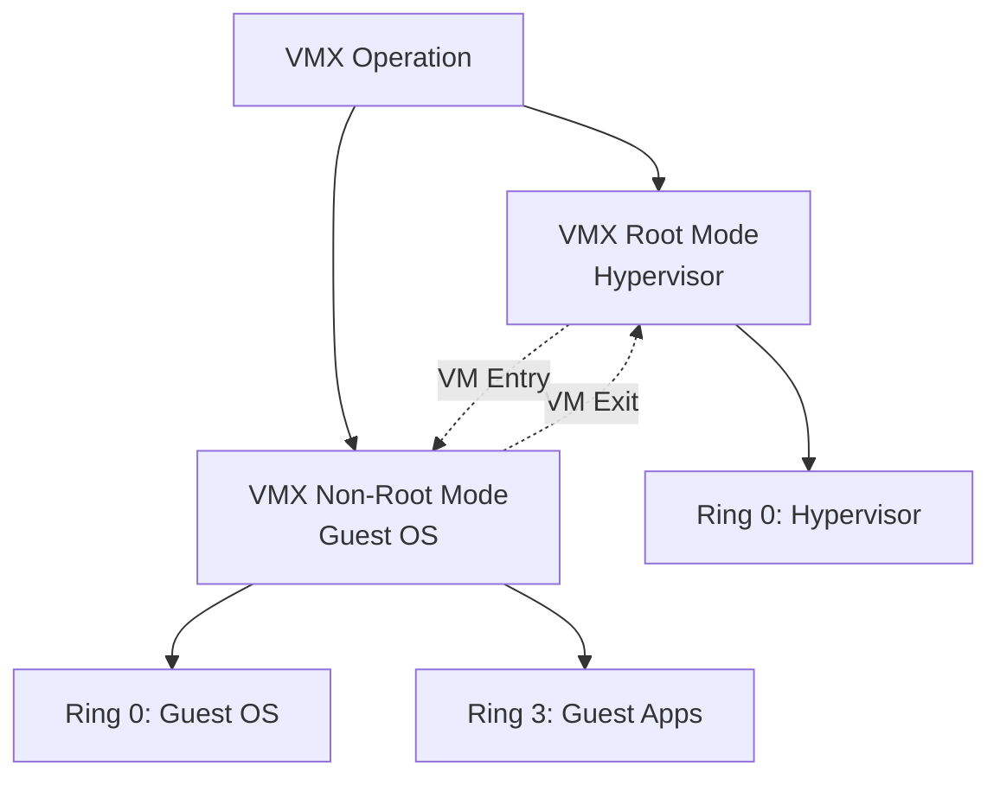

**VMCS (Virtual Machine Control Structure):**

```c
struct vmcs {
    // Guest state
    uint64_t guest_rip;
    uint64_t guest_rsp;
    uint64_t guest_cr3;
    // ... all registers
    
    // Host state (hypervisor)
    uint64_t host_rip;
    uint64_t host_rsp;
    uint64_t host_cr3;
    
    // VM execution controls
    uint32_t pin_based_controls;
    uint32_t proc_based_controls;
    uint32_t exit_controls;
    uint32_t entry_controls;
    
    // Exit information
    uint32_t exit_reason;
    uint64_t exit_qualification;
};
```

**VM Exit Reasons:**

```
- Privileged instruction (e.g., CPUID, HLT)
- I/O instruction (IN, OUT)
- Access to control registers (MOV to CR3)
- Interrupt/Exception
- EPT violation (memory access)
- VMCALL (hypercall)
```

**VT-x Instructions:**

```asm
; Enter VMX operation
vmxon [vmxon_region]

; Load VMCS
vmptrld [vmcs_address]

; Launch VM
vmlaunch

; Resume VM (after VM exit)
vmresume

; Exit VMX operation
vmxoff

; Hypercall from guest
vmcall
```

### AMD-V (SVM)

**AMD Secure Virtual Machine**

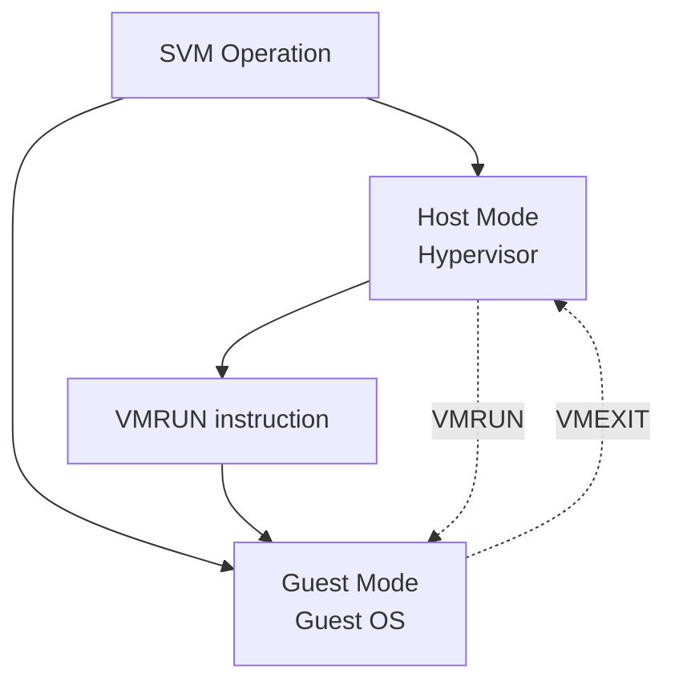

**VMCB (Virtual Machine Control Block):**

```c
struct vmcb {
    // Control area
    struct {
        uint32_t intercept_cr_reads;
        uint32_t intercept_cr_writes;
        uint32_t intercept_exceptions;
        uint64_t intercept_instruction0;
        uint64_t intercept_instruction1;
        // ...
        uint64_t exitcode;
        uint64_t exitinfo1;
        uint64_t exitinfo2;
    } control;
    
    // Save state area
    struct {
        uint64_t rip;
        uint64_t rsp;
        uint64_t rflags;
        uint64_t cr0, cr2, cr3, cr4;
        // ... all registers
    } save_state;
};
```

**AMD-V Instructions:**

```asm
; Load VMCB
vmsave [vmcb_address]

; Run guest
vmrun [vmcb_address]

; Load VMCB after exit
vmload [vmcb_address]

; Hypercall
vmmcall
```

### Intel VT-x vs AMD-V

| Xüsusiyyət | Intel VT-x | AMD-V |
|------------|------------|-------|
| Control structure | VMCS (in memory) | VMCB (in memory) |
| Enter guest | VMLAUNCH/VMRESUME | VMRUN |
| Exit guest | Automatic (VM Exit) | Automatic (VMEXIT) |
| Hypercall | VMCALL | VMMCALL |
| Tagged TLB | VPID | ASID |
| Nested paging | EPT | NPT (RVI) |
| Performance | Similar | Similar |

## Memory Virtualization

### Problem: Address Translation

```
Guest Virtual Address (GVA)
    ↓ (Guest page table)
Guest Physical Address (GPA)
    ↓ (Need another translation!)
Host Physical Address (HPA)
```

### Shadow Page Tables (Software)

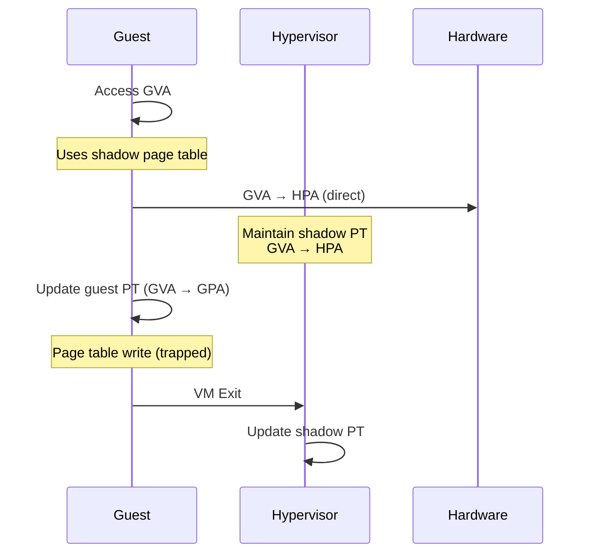

**Çatışmazlıqlar:**
- High overhead (VM exits)
- Memory overhead (shadow page tables)
- Complex

### EPT / NPT (Hardware)

**EPT** - Extended Page Tables (Intel)  
**NPT** - Nested Page Tables (AMD, also called RVI - Rapid Virtualization Indexing)

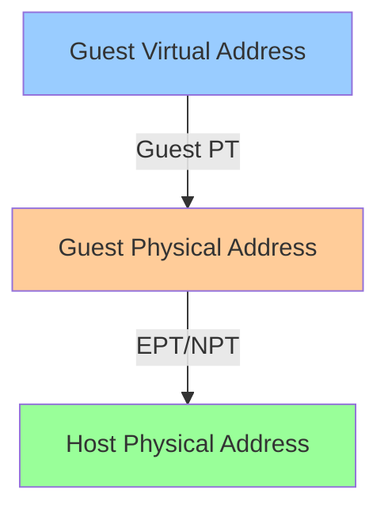

**2D Page Walk:**

```
1. Guest page walk (GVA → GPA)
   - Each step may trigger EPT walk (GPA → HPA)
   
2. EPT page walk (GPA → HPA)

Example:
GVA: 0x00007fff12345678
│
├─ Guest PT level 4: GVA[47:39] → GPA_1
│   └─ EPT walk: GPA_1 → HPA_1 (read entry)
│
├─ Guest PT level 3: GPA_1[entry] + GVA[38:30] → GPA_2
│   └─ EPT walk: GPA_2 → HPA_2
│
├─ Guest PT level 2: GPA_2[entry] + GVA[29:21] → GPA_3
│   └─ EPT walk: GPA_3 → HPA_3
│
└─ Guest PT level 1: GPA_3[entry] + GVA[20:12] → GPA (page)
    └─ EPT walk: GPA → HPA (final)
    
HPA: 0x00000001abcde678
```

**Worst case:** 4 (guest levels) × 5 (EPT levels each) = 20 memory accesses!

**TLB optimization:** Cache GVA → HPA directly (VPID/ASID)

### VPID / ASID

**VPID** (Virtual Processor ID) - Intel  
**ASID** (Address Space ID) - AMD

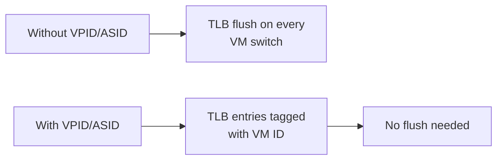

**TLB entry with VPID:**

```
[VPID: 1] GVA 0x1000 → HPA 0xabcd1000  (VM 1)
[VPID: 2] GVA 0x1000 → HPA 0xef012000  (VM 2)
```

## I/O Virtualization

### Emulation (Software)

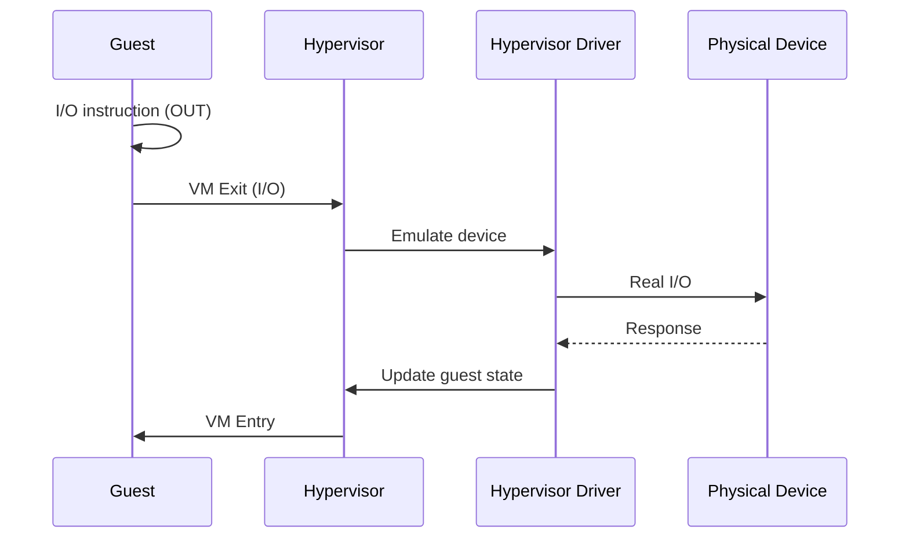

**Çatışmazlıqlar:**
- Slow (VM exits)
- High CPU overhead

### Paravirtualization

Guest OS bilir ki, virtualizasiya olunub → special drivers istifadə edir.

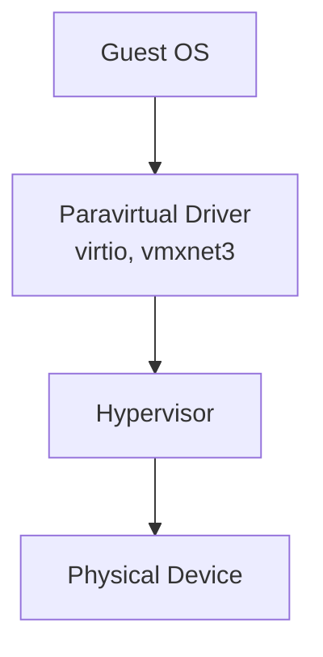

**virtio (Linux):**

```c
// Guest driver
struct virtio_device {
    struct virtqueue *vq;
    // ...
};

// Add buffer to queue
virtqueue_add_buf(vq, sg, out, in, data);

// Kick hypervisor
virtqueue_kick(vq);

// Hypervisor processes queue
```

**Üstünlüklər:**
- Faster than emulation
- Lower overhead

**Çatışmazlıqlar:**
- Guest OS must be modified
- Paravirtual drivers needed

### SR-IOV (Single Root I/O Virtualization)

Hardware-level I/O virtualization.

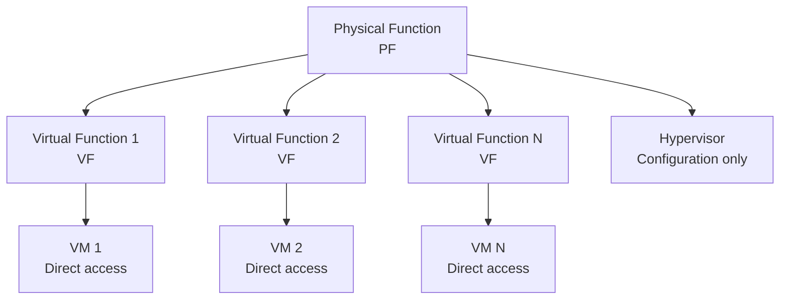

**Xüsusiyyətlər:**
- Direct device access from VM
- Near-native performance
- Hardware isolation
- No hypervisor overhead (after setup)

**Example: Network card (NIC)**

```bash
# Enable SR-IOV on physical device
echo 4 > /sys/class/net/eth0/device/sriov_numvfs

# Assign VF to VM
virsh attach-interface vm1 hostdev 0000:03:10.0
```

**Comparison:**

| Method | Performance | Overhead | Guest Support | Hardware |
|--------|-------------|----------|---------------|----------|
| Emulation | Slow | High | Any OS | Any |
| Paravirtualization | Medium | Medium | Modified OS | Any |
| SR-IOV | Fast | Low | Native driver | SR-IOV capable |

## Hypervisor Types

### Type 1: Bare-Metal Hypervisor

Runs directly on hardware.

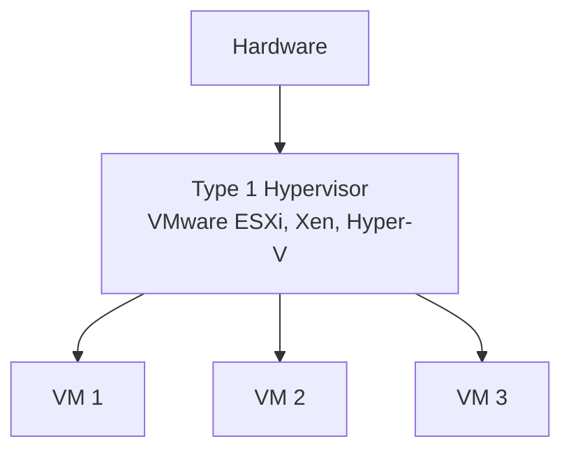

**Xüsusiyyətlər:**
- Direct hardware access
- Better performance
- Enterprise/datacenter

**Examples:**
- VMware ESXi
- Microsoft Hyper-V
- Xen
- KVM (with Linux as host)

### Type 2: Hosted Hypervisor

Runs on top of an OS.

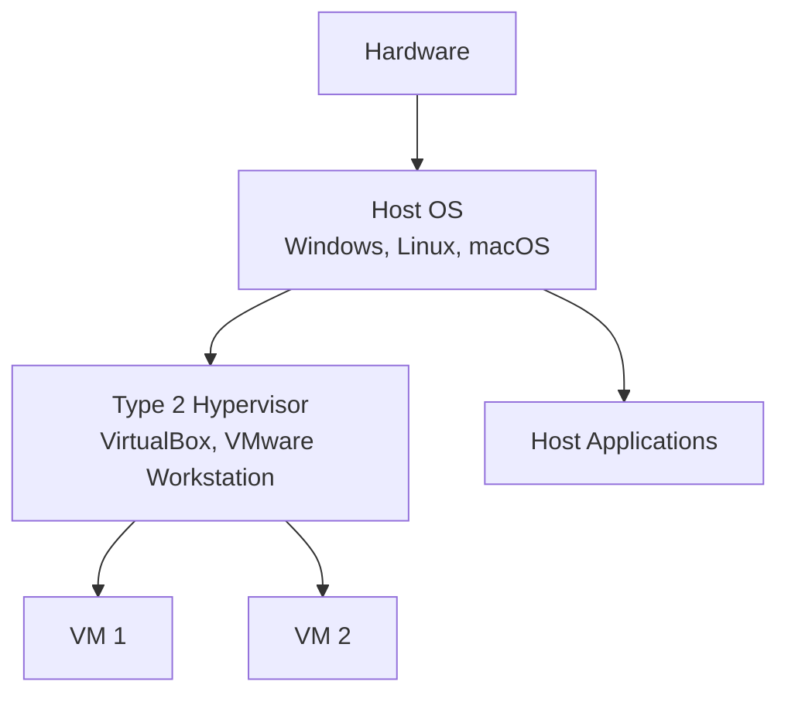

**Xüsusiyyətlər:**
- Easier to use
- Desktop/development
- Lower performance

**Examples:**
- Oracle VirtualBox
- VMware Workstation / Fusion
- Parallels Desktop

### KVM (Kernel-based Virtual Machine)

Linux kernel-də hypervisor.

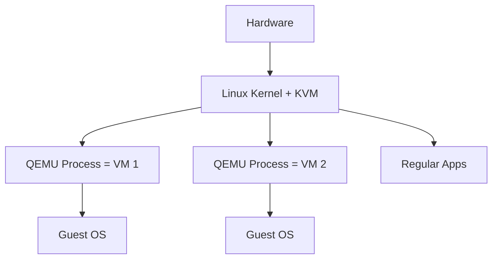

**Xüsusiyyətlər:**
- Type 1 performance
- Linux kernel integration
- Open source
- Wide adoption (OpenStack, etc.)

```bash
# Check KVM support
lsmod | grep kvm

# Create VM with KVM
qemu-system-x86_64 -enable-kvm -m 2048 -hda disk.img
```

## Containers vs VMs

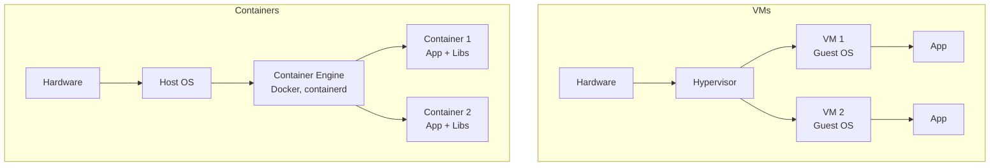

### Comparison

| Aspect | Virtual Machines | Containers |
|--------|------------------|------------|
| **Isolation** | Strong (separate OS) | Weaker (shared kernel) |
| **Startup** | Minutes | Seconds |
| **Size** | GBs (full OS) | MBs (app + libs) |
| **Performance** | Near-native | Native |
| **Resource usage** | High | Low |
| **Portability** | Good | Excellent |
| **Use case** | Different OSes, isolation | Microservices, scale |

### Container Technologies

**Linux Namespaces:**

```c
// Isolate resources
clone(CLONE_NEWPID);   // PID namespace (separate process tree)
clone(CLONE_NEWNET);   // Network namespace
clone(CLONE_NEWNS);    // Mount namespace (filesystem)
clone(CLONE_NEWUTS);   // Hostname
clone(CLONE_NEWIPC);   // IPC
clone(CLONE_NEWUSER);  // User/Group IDs
```

**cgroups (Control Groups):**

```bash
# Limit CPU
echo 50000 > /sys/fs/cgroup/cpu/container1/cpu.cfs_quota_us

# Limit memory
echo 512M > /sys/fs/cgroup/memory/container1/memory.limit_in_bytes
```

**Union filesystems (OverlayFS):**

```
Lower layer: Base image (read-only)
Upper layer: Container changes (read-write)
Merged view: Combined filesystem
```

### When to use VMs vs Containers

**Use VMs when:**
- Need different OS kernels (e.g., Linux + Windows)
- Strong isolation required (security, multi-tenancy)
- Legacy applications
- Long-running services

**Use Containers when:**
- Same OS kernel
- Fast startup needed
- Microservices architecture
- CI/CD pipelines
- Scaling (kubernetes)

**Hybrid:** VMs with containers inside (common in cloud)

## Nested Virtualization

VM içində VM çalışdırmaq.

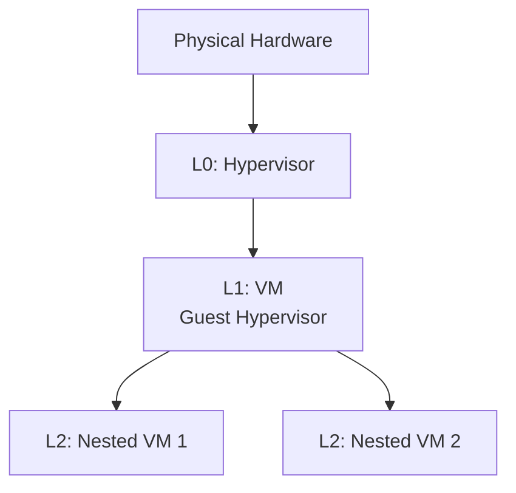

**Use cases:**
- Development/testing of hypervisors
- Cloud providers (customer runs VMs inside rented VM)
- Training

**Performance:** Worse than regular VMs (double overhead)

**Support:**
- Intel: VT-x supports nested (VMCS shadowing)
- AMD: AMD-V supports nested

```bash
# Enable nested virtualization (Intel)
modprobe -r kvm_intel
modprobe kvm_intel nested=1

# Check
cat /sys/module/kvm_intel/parameters/nested
```

## Live Migration

VM-i bir host-dan digərinə köçürmək (downtime olmadan).

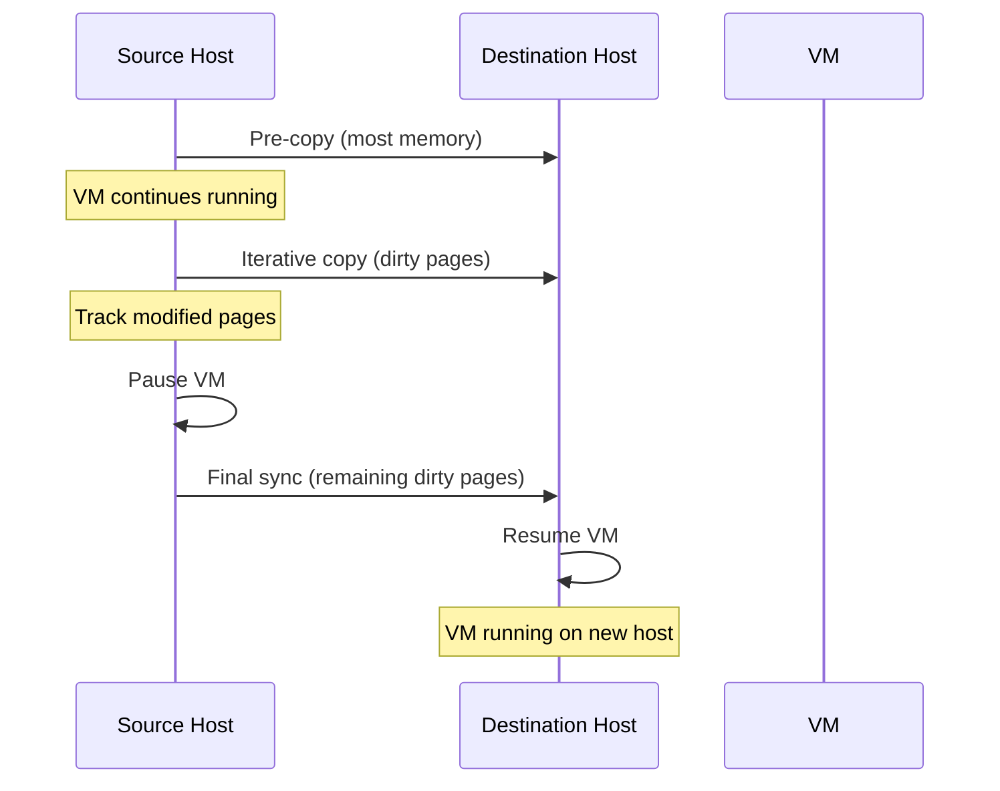

**Phases:**

1. **Pre-copy:** Copy memory while VM runs
2. **Iterative:** Copy dirty pages (modified during copy)
3. **Stop-and-copy:** Pause VM, copy final state
4. **Resume:** Start VM on destination

**Downtime:** ~100ms - 1s (depends on memory size, network)

**Requirements:**
- Shared storage (or storage migration)
- Same CPU architecture
- Network connectivity

```bash
# KVM/QEMU live migration
virsh migrate --live vm1 qemu+ssh://dest-host/system
```

## Performance Considerations

### 1. CPU Overhead

```
VM exit/entry: ~1000-2000 cycles
Frequent exits → performance degradation
```

**Optimization:**
- Use paravirtual drivers
- Enable VT-x/AMD-V features (VPID, EPT)
- Pin vCPUs to physical cores (CPU affinity)

### 2. Memory Overhead

```
Shadow page tables: 2-10% memory overhead
EPT/NPT: Minimal overhead, but 2D page walk
```

**Optimization:**
- Use EPT/NPT (always)
- Large pages (2MB, 1GB)
- Memory ballooning (reclaim unused memory)

### 3. I/O Performance

```
Emulation: 10-50% of native
Paravirtual: 80-90% of native
SR-IOV: 95-99% of native
```

**Optimization:**
- Use virtio drivers
- Use SR-IOV if available
- NVMe for storage

### 4. Network Performance

```bash
# Enable virtio
<interface type='network'>
  <model type='virtio'/>
</interface>

# Use SR-IOV for high performance
<interface type='hostdev'>
  <source>
    <address type='pci' domain='0x0000' bus='0x03' slot='0x10'/>
  </source>
</interface>
```

## Security Considerations

### VM Escape

VM-dən host-a çıxmaq (worst-case scenario).

**Attack vectors:**
- Hypervisor bugs
- Shared resources (cache, speculative execution)
- Device emulation vulnerabilities

**Mitigations:**
- Keep hypervisor updated
- Minimize attack surface
- Use hardware virtualization features
- Security patches (Spectre, Meltdown)

### Side-Channel Attacks

```
VM 1 (attacker) → Shared cache → VM 2 (victim)
Measure cache timing → leak information
```

**Examples:**
- Spectre, Meltdown
- Cache timing attacks

**Mitigations:**
- Core scheduling (same VM on both hyperthreads)
- Flush caches on context switch
- Disable hyperthreading

### Isolation Best Practices

1. **Separate sensitive workloads**
2. **Use different physical hosts**
3. **Security updates**
4. **Monitoring and auditing**
5. **Network segmentation**

## Praktik Tools

```bash
# Check virtualization support
lscpu | grep Virtualization

# Intel
grep vmx /proc/cpuinfo

# AMD
grep svm /proc/cpuinfo

# KVM
lsmod | grep kvm
virsh list --all

# Docker
docker ps
docker run -it ubuntu bash

# Performance monitoring
virsh domstats vm1
perf kvm stat record -a
perf kvm stat report
```

## Best Practices

1. **Enable hardware virtualization**
   - VT-x/AMD-V in BIOS
   - EPT/NPT support

2. **Right-size VMs**
   - Don't over-provision resources
   - Monitor actual usage

3. **Use paravirtual drivers**
   - virtio for Linux
   - VMware Tools / Hyper-V Integration Services

4. **CPU pinning** (for latency-sensitive workloads)
   ```xml
   <vcpu placement='static' cpuset='0-3'>4</vcpu>
   ```

5. **NUMA awareness**
   ```bash
   # Pin VM to NUMA node
   numactl --cpunodebind=0 --membind=0 qemu-system-x86_64 ...
   ```

6. **Monitoring**
   - CPU usage (steal time)
   - Memory (ballooning, swapping)
   - I/O performance

## Əlaqəli Mövzular

- **CPU Architecture:** Privilege levels, rings
- **Memory Hierarchy:** Page tables, TLB
- **I/O Systems:** Device access
- **Security:** Isolation, side-channels
- **Performance:** Overhead, optimization
