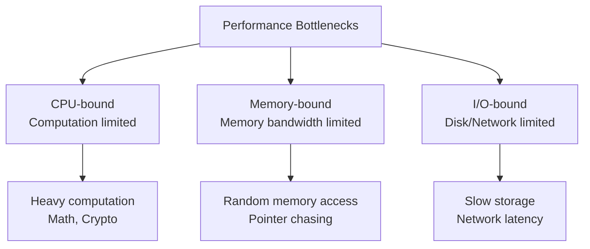
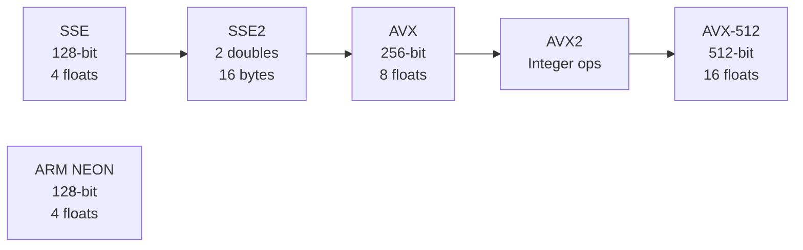

# Performans Optimizasiyası

## Performance Bottlenecks



## CPU-bound vs Memory-bound

### CPU-bound Workload

Çox hesablama, az memory access.

```c
// CPU-bound: Heavy computation
double complex_math(double x) {
    double result = x;
    for (int i = 0; i < 1000; i++) {
        result = sin(result) * cos(result) + sqrt(result);
    }
    return result;
}
```

**Xarakteristika:**
- High CPU utilization (90-100%)
- Low cache miss rate
- Bottleneck: CPU speed, instruction throughput

**Optimizasiya:**
- Algoritmik təkmilləşdirmə
- SIMD instructions
- Multi-threading
- Better CPU (higher frequency, more cores)

### Memory-bound Workload

Az hesablama, çox memory access.

```c
// Memory-bound: Lots of memory access
long sum_array(int* arr, int n) {
    long sum = 0;
    for (int i = 0; i < n; i++) {
        sum += arr[i];  // Memory access each iteration
    }
    return sum;
}

// Worse: Random access (pointer chasing)
long sum_linked_list(Node* head) {
    long sum = 0;
    while (head) {
        sum += head->value;  // Cache miss likely!
        head = head->next;   // Random memory access
    }
    return sum;
}
```

**Xarakteristika:**
- Low CPU utilization (waiting on memory)
- High cache miss rate
- Bottleneck: Memory bandwidth, latency

**Optimizasiya:**
- Cache-friendly data structures
- Prefetching
- Memory layout optimization
- Reduce memory access

### Identifying Bottleneck

```bash
# CPU performance counters
perf stat -e cycles,instructions,cache-misses,cache-references ./program

# Output example:
# Performance counter stats for './program':
#
#   1,234,567,890  cycles
#   2,000,000,000  instructions       # 1.62 insns per cycle
#      10,000,000  cache-misses       # 5% of all cache refs
#     200,000,000  cache-references
```

**Metrics:**

```
IPC (Instructions Per Cycle):
- IPC > 2: CPU-bound (good utilization)
- IPC < 1: Memory-bound (waiting on memory)

Cache miss rate:
- < 1%: Good locality
- > 10%: Poor locality, memory-bound
```

## Cache-Friendly Code

### 1. Spatial Locality

Access data sequentially (cache line friendly).

```c
// BAD: Column-major access (cache unfriendly)
for (int j = 0; j < N; j++) {
    for (int i = 0; i < N; i++) {
        sum += matrix[i][j];  // Jump by row size each time
    }
}

// GOOD: Row-major access (cache friendly)
for (int i = 0; i < N; i++) {
    for (int j = 0; j < N; j++) {
        sum += matrix[i][j];  // Sequential access
    }
}
```

**Performance difference:**

```
N = 1024
Cache line size = 64 bytes = 16 ints

Row-major:
- 1 cache miss per 16 elements
- Cache miss rate: 6.25%

Column-major:
- 1 cache miss per element
- Cache miss rate: 100%

Speedup: 10-50× faster!
```

### 2. Temporal Locality

Reuse data while it's still in cache.

```c
// BAD: Poor temporal locality
for (int i = 0; i < N; i++) {
    for (int j = 0; j < N; j++) {
        C[i][j] = A[i][j] + B[i][j];
    }
}
// Later...
for (int i = 0; i < N; i++) {
    for (int j = 0; j < N; j++) {
        D[i][j] = C[i][j] * 2;  // C may not be in cache anymore
    }
}

// GOOD: Fusion - process immediately
for (int i = 0; i < N; i++) {
    for (int j = 0; j < N; j++) {
        C[i][j] = A[i][j] + B[i][j];
        D[i][j] = C[i][j] * 2;  // C is still in cache!
    }
}
```

### 3. Loop Tiling (Blocking)

Divide data into cache-sized chunks.

```c
// BAD: Matrix multiplication (cache unfriendly for large N)
for (int i = 0; i < N; i++) {
    for (int j = 0; j < N; j++) {
        for (int k = 0; k < N; k++) {
            C[i][j] += A[i][k] * B[k][j];
        }
    }
}

// GOOD: Tiled matrix multiplication
#define TILE 32  // Fit in L1 cache
for (int ii = 0; ii < N; ii += TILE) {
    for (int jj = 0; jj < N; jj += TILE) {
        for (int kk = 0; kk < N; kk += TILE) {
            // Process TILE×TILE block
            for (int i = ii; i < ii + TILE; i++) {
                for (int j = jj; j < jj + TILE; j++) {
                    for (int k = kk; k < kk + TILE; k++) {
                        C[i][j] += A[i][k] * B[k][j];
                    }
                }
            }
        }
    }
}
```

**Performance:**

```
N = 1024, no tiling:     10 seconds
N = 1024, tiling:        2 seconds   (5× faster!)
```

## Data Structure Alignment

### Cache Line Alignment

```c
// BAD: Struct spans multiple cache lines
struct Data {
    int a;
    int b;
    char c;
    // Padding...
    double d;  // May be in different cache line
};

// GOOD: Explicit alignment
struct __attribute__((aligned(64))) Data {
    int a;
    int b;
    char c;
    char padding[64 - sizeof(int)*2 - sizeof(char) - sizeof(double)];
    double d;
};
```

### False Sharing

Multiple threads accessing different variables in same cache line.

```c
// BAD: False sharing
struct Counter {
    int counter1;  // Used by thread 1
    int counter2;  // Used by thread 2
} counters;  // Both in same cache line!

void thread1() {
    counters.counter1++;  // Invalidates cache line for thread 2
}

void thread2() {
    counters.counter2++;  // Invalidates cache line for thread 1
}
```

**Result:** Constant cache line bouncing between cores → slow!

```c
// GOOD: Pad to separate cache lines
struct Counter {
    int counter1;
    char padding1[60];  // Fill rest of cache line
    int counter2;
    char padding2[60];
} __attribute__((aligned(64)));

// Or use C11/C++11
alignas(64) int counter1;
alignas(64) int counter2;
```

**Performance:**

```
With false sharing:    100 million ops/sec
Without false sharing: 1000 million ops/sec  (10× faster!)
```

### Array of Structures vs Structure of Arrays

```c
// AoS (Array of Structures)
struct Particle {
    float x, y, z;     // Position
    float vx, vy, vz;  // Velocity
};
Particle particles[1000];

// Access position
for (int i = 0; i < 1000; i++) {
    process_position(particles[i].x, particles[i].y, particles[i].z);
    // Load entire struct (24 bytes) even though we only need 12 bytes
}

// SoA (Structure of Arrays)
struct Particles {
    float x[1000], y[1000], z[1000];
    float vx[1000], vy[1000], vz[1000];
} particles;

// Access position
for (int i = 0; i < 1000; i++) {
    process_position(particles.x[i], particles.y[i], particles.z[i]);
    // Sequential access, better cache usage, SIMD-friendly
}
```

**SoA advantages:**
- Better cache utilization
- SIMD-friendly (process 4-8 elements at once)
- Less memory bandwidth

## Prefetching

### Software Prefetch

```c
#include <xmmintrin.h>  // SSE intrinsics

void process_array(int* arr, int n) {
    for (int i = 0; i < n; i++) {
        // Prefetch future data
        _mm_prefetch(&arr[i + 64], _MM_HINT_T0);  // T0 = L1 cache
        
        // Process current data
        process(arr[i]);
    }
}
```

**Prefetch hints:**

```c
_MM_HINT_T0  // Prefetch to all cache levels (L1, L2, L3)
_MM_HINT_T1  // Prefetch to L2 and L3
_MM_HINT_T2  // Prefetch to L3 only
_MM_HINT_NTA // Non-temporal (bypass cache)
```

### Hardware Prefetch

Modern CPUs automatically detect sequential access patterns.

```c
// Hardware prefetcher detects this pattern
for (int i = 0; i < n; i++) {
    sum += arr[i];  // Sequential → automatic prefetch
}

// Hardware prefetcher can't detect this
for (int i = 0; i < n; i++) {
    sum += arr[random[i]];  // Random → no prefetch
}
```

## SIMD Instructions

### Scalar vs SIMD

```c
// Scalar: Process one element at a time
void add_scalar(float* a, float* b, float* c, int n) {
    for (int i = 0; i < n; i++) {
        c[i] = a[i] + b[i];  // 1 operation
    }
}

// SIMD: Process multiple elements at once
#include <immintrin.h>  // AVX

void add_simd(float* a, float* b, float* c, int n) {
    for (int i = 0; i < n; i += 8) {
        __m256 va = _mm256_load_ps(&a[i]);  // Load 8 floats
        __m256 vb = _mm256_load_ps(&b[i]);
        __m256 vc = _mm256_add_ps(va, vb);  // Add 8 floats at once
        _mm256_store_ps(&c[i], vc);         // Store 8 floats
    }
}
```

**Performance:**

```
Scalar:  1 billion elements in 2.0 seconds
SIMD:    1 billion elements in 0.3 seconds  (6-7× faster)
```

### SIMD Instruction Sets



### Auto-Vectorization

Modern compilers can auto-vectorize simple loops.

```c
void add(float* a, float* b, float* c, int n) {
    for (int i = 0; i < n; i++) {
        c[i] = a[i] + b[i];
    }
}
```

```bash
# GCC with auto-vectorization
gcc -O3 -march=native -ftree-vectorize -fopt-info-vec program.c

# Output: "loop vectorized"
```

**Requirements for auto-vectorization:**
- Simple loop structure
- No dependencies between iterations
- Aligned data
- Known loop bounds

### SIMD Example: Dot Product

```c
// Scalar
float dot_product_scalar(float* a, float* b, int n) {
    float sum = 0.0f;
    for (int i = 0; i < n; i++) {
        sum += a[i] * b[i];
    }
    return sum;
}

// AVX
#include <immintrin.h>

float dot_product_avx(float* a, float* b, int n) {
    __m256 sum_vec = _mm256_setzero_ps();  // 8 zeros
    
    for (int i = 0; i < n; i += 8) {
        __m256 va = _mm256_load_ps(&a[i]);
        __m256 vb = _mm256_load_ps(&b[i]);
        __m256 prod = _mm256_mul_ps(va, vb);
        sum_vec = _mm256_add_ps(sum_vec, prod);
    }
    
    // Horizontal sum
    float result[8];
    _mm256_store_ps(result, sum_vec);
    float sum = 0.0f;
    for (int i = 0; i < 8; i++) {
        sum += result[i];
    }
    return sum;
}
```

## Branch Prediction Optimization

### 1. Reduce Branches

```c
// BAD: Branch in loop
for (int i = 0; i < n; i++) {
    if (arr[i] > threshold) {
        result[i] = arr[i] * 2;
    } else {
        result[i] = arr[i];
    }
}

// GOOD: Branchless (for unpredictable data)
for (int i = 0; i < n; i++) {
    int cond = arr[i] > threshold;
    result[i] = arr[i] * (1 + cond);  // Conditional move
}
```

### 2. Likely/Unlikely Hints

```c
// GCC/Clang
if (__builtin_expect(error != 0, 0)) {  // Error is unlikely
    handle_error(error);
}

// C++20
if (error != 0) [[unlikely]] {
    handle_error(error);
}
```

### 3. Sort Data for Predictability

```c
// BAD: Random order (unpredictable branches)
for (int i = 0; i < n; i++) {
    if (arr[i] > threshold) {
        sum1 += arr[i];
    } else {
        sum2 += arr[i];
    }
}

// GOOD: Sort first (predictable branches)
std::sort(arr, arr + n);
// Now: First half < threshold, second half > threshold
// Branch predictor happy!
```

## Function Inlining

```c
// BAD: Function call overhead
int add(int a, int b) {
    return a + b;
}

for (int i = 0; i < 1000000; i++) {
    result += add(x, y);  // Function call each iteration
}

// GOOD: Inline
inline int add(int a, int b) {
    return a + b;
}

// Or use macro (old style)
#define ADD(a, b) ((a) + (b))

// Compiler usually inlines automatically with -O2/-O3
```

## Loop Optimizations

### 1. Loop Unrolling

```c
// Original
for (int i = 0; i < n; i++) {
    sum += arr[i];
}

// Unrolled (4×)
int i;
for (i = 0; i < n - 3; i += 4) {
    sum += arr[i];
    sum += arr[i+1];
    sum += arr[i+2];
    sum += arr[i+3];
}
// Handle remaining elements
for (; i < n; i++) {
    sum += arr[i];
}
```

**Benefits:**
- Fewer loop overhead instructions
- More ILP (instruction-level parallelism)
- Better for branch prediction

### 2. Loop Invariant Code Motion

```c
// BAD: Compute inside loop
for (int i = 0; i < n; i++) {
    result[i] = arr[i] * sqrt(x) + y;  // sqrt(x) doesn't change!
}

// GOOD: Hoist out of loop
double sqrt_x = sqrt(x);
for (int i = 0; i < n; i++) {
    result[i] = arr[i] * sqrt_x + y;
}
```

### 3. Strength Reduction

```c
// BAD: Expensive operation
for (int i = 0; i < n; i++) {
    result[i] = arr[i] * i;  // Multiplication
}

// GOOD: Replace with addition
int product = 0;
for (int i = 0; i < n; i++) {
    result[i] = arr[i] * product;
    product += 1;  // Addition instead of multiplication
}
```

## Memory Allocation

### 1. Stack vs Heap

```c
// Stack: Fast, automatic cleanup
void function() {
    int arr[1000];  // Stack allocation (~1 cycle)
    // ...
}  // Automatic deallocation

// Heap: Slow, manual cleanup
void function() {
    int* arr = malloc(1000 * sizeof(int));  // Heap (~100+ cycles)
    // ...
    free(arr);  // Manual deallocation
}
```

### 2. Memory Pools

```c
// BAD: Frequent malloc/free
for (int i = 0; i < 1000; i++) {
    Node* node = malloc(sizeof(Node));
    // Use node
    free(node);
}

// GOOD: Pre-allocate pool
Node pool[1000];
for (int i = 0; i < 1000; i++) {
    Node* node = &pool[i];  // Just pointer arithmetic
    // Use node
    // No free needed
}
```

### 3. Huge Pages

```c
// Regular pages: 4 KB
// Huge pages: 2 MB or 1 GB

// Allocate huge page (Linux)
void* ptr = mmap(NULL, size, PROT_READ | PROT_WRITE,
                 MAP_PRIVATE | MAP_ANONYMOUS | MAP_HUGETLB, -1, 0);

// Benefit: Fewer TLB misses
```

**TLB entries:**

```
4 KB pages:  512 entries cover 2 MB
2 MB pages:  512 entries cover 1 GB  (500× more coverage!)
```

## Profiling and Measurement

### 1. Time Measurement

```c
#include <time.h>

clock_t start = clock();
// Code to measure
clock_t end = clock();
double elapsed = (double)(end - start) / CLOCKS_PER_SEC;
printf("Time: %.3f seconds\n", elapsed);
```

### 2. perf (Linux)

```bash
# Basic profiling
perf record ./program
perf report

# CPU events
perf stat -e cycles,instructions,cache-misses,branch-misses ./program

# Sample on-CPU functions
perf record -F 99 -g ./program
perf report --stdio

# Flamegraph
perf record -F 99 -g ./program
perf script | stackcollapse-perf.pl | flamegraph.pl > flame.svg
```

### 3. Intel VTune

```bash
# Hotspot analysis
vtune -collect hotspots ./program

# Memory access analysis
vtune -collect memory-access ./program

# Report
vtune -report hotspots
```

### 4. Profiler Example

```c
// Insert in critical sections
#include <time.h>

#define PROFILE_START(name) \
    clock_t __start_##name = clock();

#define PROFILE_END(name) \
    clock_t __end_##name = clock(); \
    printf("%s: %.3f ms\n", #name, \
           (double)(__end_##name - __start_##name) / CLOCKS_PER_SEC * 1000);

// Usage
void my_function() {
    PROFILE_START(computation)
    // ... code ...
    PROFILE_END(computation)
}
```

## Compiler Optimizations

### Optimization Levels

```bash
# GCC/Clang
-O0  # No optimization (debugging)
-O1  # Basic optimization
-O2  # Recommended (balanced)
-O3  # Aggressive (may increase code size)
-Ofast  # -O3 + fast math (non-standard compliant)
-Os  # Optimize for size
```

### Important Flags

```bash
# Architecture-specific optimizations
-march=native  # Use all CPU features

# Link-Time Optimization
-flto

# Profile-Guided Optimization (PGO)
# Step 1: Compile with instrumentation
gcc -fprofile-generate program.c -o program
# Step 2: Run with typical workload
./program < typical_input.txt
# Step 3: Recompile with profile data
gcc -fprofile-use program.c -o program
```

## Best Practices Checklist

### Code Level

- [ ] Use cache-friendly data structures (arrays > linked lists)
- [ ] Access memory sequentially (spatial locality)
- [ ] Reuse data (temporal locality)
- [ ] Align data to cache lines
- [ ] Avoid false sharing in multi-threaded code
- [ ] Use SIMD when possible
- [ ] Reduce branches in hot loops
- [ ] Inline small functions
- [ ] Unroll loops (or let compiler do it)
- [ ] Allocate on stack when possible

### Compilation

- [ ] Use `-O2` or `-O3` optimization level
- [ ] Enable `-march=native` for CPU-specific optimizations
- [ ] Consider LTO (`-flto`)
- [ ] Try PGO for critical applications
- [ ] Profile and analyze assembly output

### Profiling

- [ ] Measure before optimizing (don't guess!)
- [ ] Find hotspots (80/20 rule)
- [ ] Use profiling tools (perf, VTune, gprof)
- [ ] Check cache miss rates
- [ ] Monitor IPC (instructions per cycle)
- [ ] Verify optimizations actually help

### Hardware

- [ ] Use newer CPUs (better branch prediction, larger caches)
- [ ] Ensure adequate RAM (avoid swapping)
- [ ] Use SSDs for I/O-bound workloads
- [ ] Consider NUMA topology for multi-socket systems

## Common Pitfalls

1. **Premature optimization**
   ```
   "Premature optimization is the root of all evil" - Donald Knuth
   First: Make it work
   Then: Make it fast (if needed)
   ```

2. **Optimizing wrong part**
   ```
   Profile first! Optimize the 5% that matters, not the 95% that doesn't.
   ```

3. **Micro-optimizations that don't matter**
   ```c
   // Wasting time on:
   i++ vs ++i  // Compiler optimizes this away
   
   // Should focus on:
   Algorithmic complexity (O(n²) → O(n log n))
   ```

4. **Breaking correctness**
   ```c
   // Don't sacrifice correctness for speed
   // Test after every optimization!
   ```

5. **Ignoring compiler warnings**
   ```bash
   # Always compile with warnings
   gcc -Wall -Wextra -Werror program.c
   ```

## Əlaqəli Mövzular

- **CPU Architecture:** Pipeline, ILP
- **Cache Memory:** Cache optimization
- **Memory Hierarchy:** Locality principles
- **Branch Prediction:** Reducing mispredictions
- **Parallelism:** Multi-threading, SIMD
- **Profiling Tools:** perf, VTune
