# Enerji İdarəetməsi

## Enerji Problemi

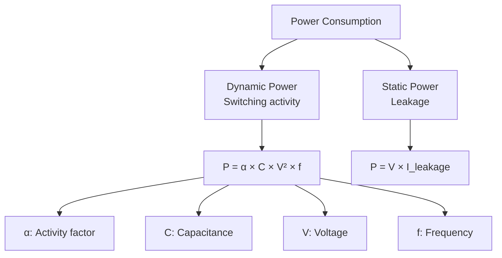

**Dynamic Power:**

```
P_dynamic = α × C × V² × f

α: Activity factor (0-1, işləyən transistorlar)
C: Capacitance (load)
V: Voltage
f: Frequency

V² → Voltage-ın kvadratik təsiri!
```

**Static Power (Leakage):**

```
P_static = V × I_leakage

Modern CPUs: Static power ~30-50% of total
Reason: Smaller transistors → more leakage
```

**Total Power:**

```
P_total = P_dynamic + P_static

Reducing voltage → Reduces both!
```

## Dynamic Voltage and Frequency Scaling (DVFS)

### DVFS Əsasları

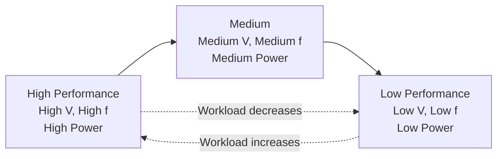

**Əsas prinsipler:**

```
Frequency ↓ → Performance ↓ (linear)
Voltage ↓ → Power ↓ (quadratic!)

Example:
Freq: 3 GHz → 1.5 GHz (50% performance)
Voltage: 1.2V → 0.9V
Power: 1.2² → 0.9² = 1.44 → 0.81 (44% power savings!)
```

### Voltage-Frequency Relationship

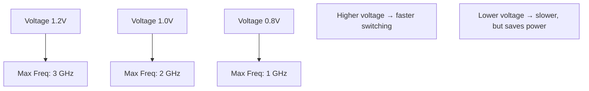

**Critical path delay:**

```
Delay ∝ V / (V - V_threshold)²

Lower voltage → longer delay → lower max frequency
```

## P-states (Performance States)

**P-states** - CPU frequency və voltage levels (işləyərkən).

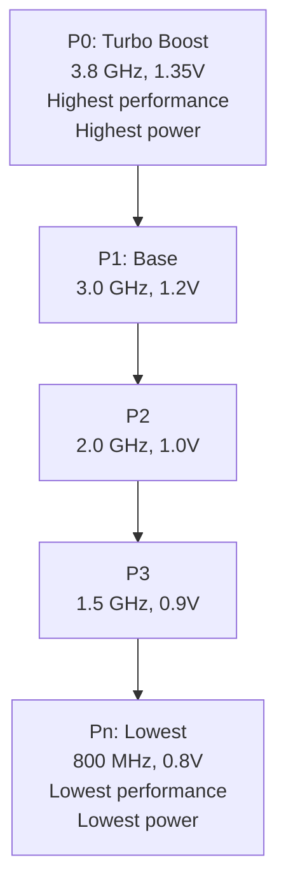

### P-state Məlumatları

```bash
# Linux - P-state info
cat /sys/devices/system/cpu/cpu0/cpufreq/scaling_available_frequencies
# Output: 3800000 3000000 2000000 1500000 800000 (kHz)

cat /sys/devices/system/cpu/cpu0/cpufreq/scaling_cur_freq
# Current frequency

cat /sys/devices/system/cpu/cpu0/cpufreq/scaling_governor
# powersave, performance, ondemand, conservative, schedutil
```

### P-state Governors (Linux)

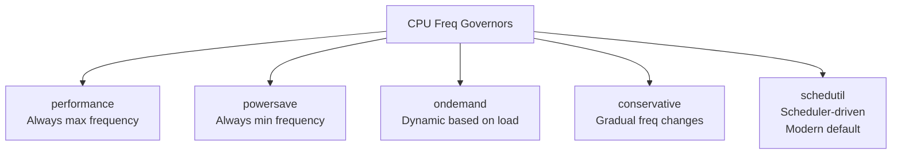

**ondemand:**

```c
// Pseudo-code
if (cpu_load > 80%) {
    set_frequency(max_frequency);
} else {
    scale_frequency_proportionally(cpu_load);
}
```

**schedutil:**

```c
// Integrated with scheduler
frequency = f(utilization, deadline, priorities);
// More responsive than ondemand
```

### Intel P-state Driver

```bash
# Check driver
cat /sys/devices/system/cpu/cpu0/cpufreq/scaling_driver
# intel_pstate or acpi-cpufreq

# Intel P-state modes
cat /sys/devices/system/cpu/intel_pstate/status
# active, passive, off

# Turbo enable/disable
cat /sys/devices/system/cpu/intel_pstate/no_turbo
# 0 = turbo enabled, 1 = disabled

# Min/Max performance percentage
echo 50 > /sys/devices/system/cpu/intel_pstate/min_perf_pct
echo 100 > /sys/devices/system/cpu/intel_pstate/max_perf_pct
```

### AMD P-state Driver

```bash
# AMD P-state (newer CPUs)
cat /sys/devices/system/cpu/cpu0/cpufreq/scaling_driver
# amd-pstate or acpi-cpufreq

# Similar interface to Intel
```

## C-states (Idle States)

**C-states** - CPU idle (işləməyərkən) enerji qənaəti.

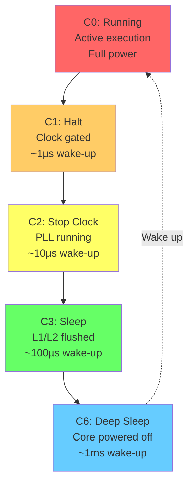

### C-state Levels

| State | Name | Power | Wake latency | What's off/on |
|-------|------|-------|--------------|---------------|
| C0 | Operating | 100% | 0 | Everything on |
| C1 | Halt | ~90% | ~1 µs | Clock gated, instant wake |
| C2 | Stop-Clock | ~70% | ~10 µs | PLL on, caches on |
| C3 | Sleep | ~40% | ~100 µs | L1/L2 flushed to L3 |
| C6 | Deep Sleep | ~10% | ~1 ms | Core power off, L3 on |
| C7 | Deeper Sleep | ~5% | ~2 ms | LLC (L3) flushed |
| C8/C10 | Package C-states | ~1-2% | ~5 ms | Entire package sleep |

### C-state Məlumatları

```bash
# List available C-states
ls /sys/devices/system/cpu/cpu0/cpuidle/
# state0  state1  state2  state3 ...

# C-state info
cat /sys/devices/system/cpu/cpu0/cpuidle/state3/name
# C6

cat /sys/devices/system/cpu/cpu0/cpuidle/state3/latency
# 200 (microseconds)

cat /sys/devices/system/cpu/cpu0/cpuidle/state3/power
# 0 (relative power consumption)

# Usage statistics
cat /sys/devices/system/cpu/cpu0/cpuidle/state3/time
# Total time spent in this state (microseconds)

cat /sys/devices/system/cpu/cpu0/cpuidle/state3/usage
# Number of times entered
```

### Disable C-states (for latency-sensitive apps)

```bash
# Disable C-states deeper than C1
for state in /sys/devices/system/cpu/cpu*/cpuidle/state*/disable; do
    if [[ $(basename $(dirname $state)) != "state0" ]] && \
       [[ $(basename $(dirname $state)) != "state1" ]]; then
        echo 1 > $state
    fi
done

# Or via kernel parameter
# Add to GRUB: intel_idle.max_cstate=1
```

### C-state Governor

```bash
# cpuidle governor
cat /sys/devices/system/cpu/cpuidle/current_governor
# menu, ladder, teo

# menu: Default, heuristic-based
# ladder: Simple, step-by-step
# teo: Timer events oriented (modern)
```

## Turbo Boost / Turbo Core

Temporarily exceed base frequency.

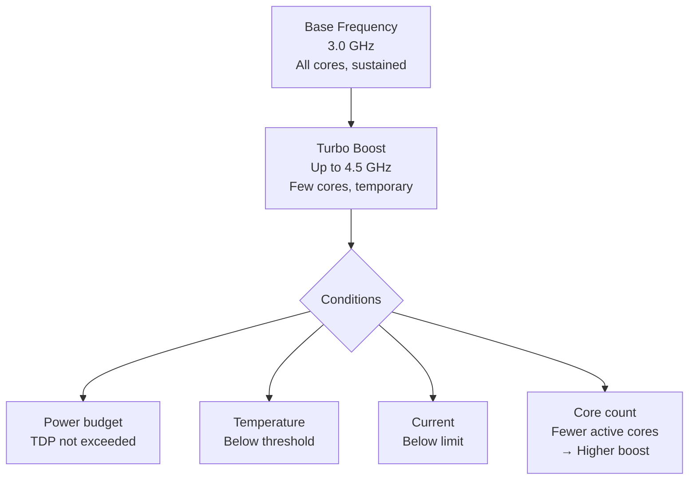

### Intel Turbo Boost

```
Intel Core i7-12700K:
- Base: 3.6 GHz (P-cores)
- Turbo: Up to 5.0 GHz (single core)
- All-core turbo: ~4.7 GHz

Depends on:
- Power (TDP: 125W base, 190W turbo)
- Thermal (< 100°C)
- Number of active cores
```

### AMD Precision Boost

```
AMD Ryzen 9 7950X:
- Base: 4.5 GHz
- Boost: Up to 5.7 GHz

Precision Boost 2: More fine-grained control
Precision Boost Overdrive (PBO): User-configurable limits
```

## Thermal Management

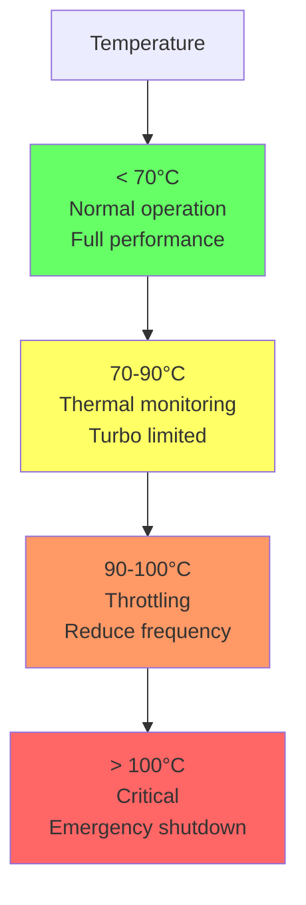

### Thermal Throttling

```
T_junction (max): 100°C (typical for modern CPUs)

If temp > threshold:
1. Reduce frequency (P-state down)
2. Reduce voltage
3. Insert idle cycles (clock modulation)
4. Last resort: Shutdown (prevent damage)
```

### Thermal Sensors

```bash
# Linux sensors
sensors
# Output:
# coretemp-isa-0000
# Core 0:       +45.0°C  (high = +80.0°C, crit = +100.0°C)
# Core 1:       +47.0°C

# Per-core temperature
cat /sys/class/hwmon/hwmon*/temp*_input
# Temperature in millidegrees (45000 = 45°C)
```

### CPU Cooling Solutions

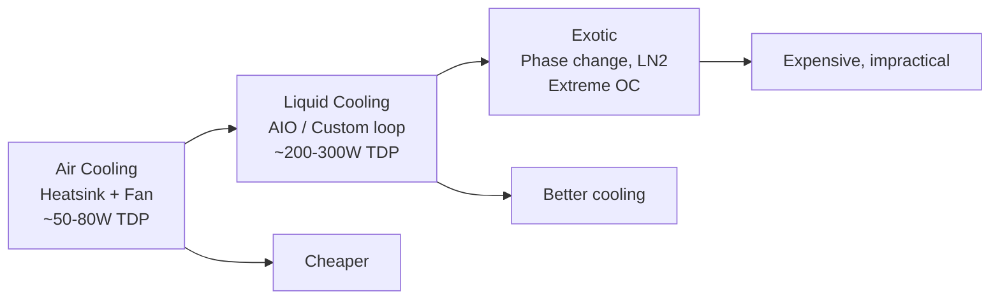

## Race-to-Idle

**Philosophy:** Finish work quickly, then sleep deeply.

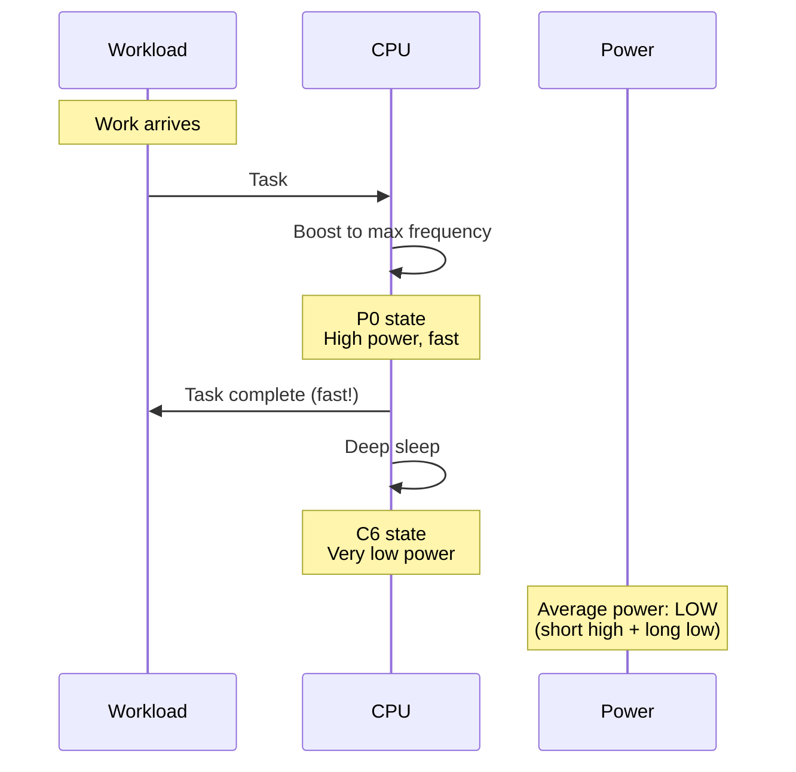

### Race-to-Idle vs Constant Low

```
Scenario: Process 1 second of work

Option 1: Constant low frequency (1 GHz)
- Duration: 1 second @ 10W = 10 Joules
- Total: 10 Joules

Option 2: Race-to-idle (3 GHz → C6)
- Duration: 0.33 sec @ 30W + 0.67 sec @ 1W = 10 + 0.67 = 10.67 Joules
- Total: 10.67 Joules

BUT: Option 2 allows deeper sleep states longer
+ Lower latency (finishes faster)
+ Better for bursty workloads
```

### Benefits

1. **Lower latency** - Work completes faster
2. **Better sleep** - More time in deep C-states
3. **Power efficiency** - Deep sleep saves more power
4. **Responsiveness** - UI feels snappier

### When NOT to use Race-to-Idle

```
Sustained workloads (rendering, compilation):
- No idle time to sleep
- Constant high power
→ Better to use moderate frequency
```

## Package C-states (PC-states)

Entire CPU package (all cores) idle.

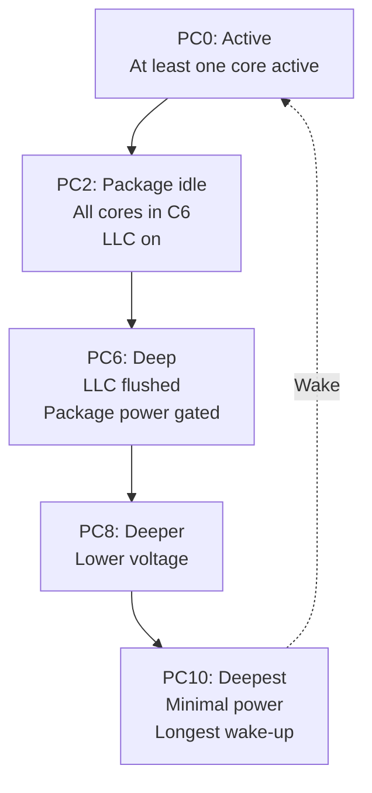

**Requirements for PC6:**
- All cores in C6
- GPU idle (integrated graphics)
- I/O idle

```bash
# Check package C-state
cat /sys/kernel/debug/pmc_core/package_cstate_show
# PC2: 10%
# PC6: 80%
# PC10: 5%
```

## RAPL (Running Average Power Limit)

Intel enerji monitoring və limiting.

```mermaid
graph TB
    RAPL[RAPL Domains] --> PKG[Package<br/>Entire CPU]
    RAPL --> PP0[Power Plane 0<br/>CPU cores]
    RAPL --> PP1[Power Plane 1<br/>GPU (integrated)]
    RAPL --> DRAM[DRAM<br/>Memory]
    
    PKG --> Limit[Power Limit<br/>TDP constraint]
```

### RAPL Monitoring

```bash
# Install powercap utils
# Read package power
cat /sys/class/powercap/intel-rapl/intel-rapl:0/energy_uj
# Energy in microjoules

# Power limit
cat /sys/class/powercap/intel-rapl/intel-rapl:0/constraint_0_power_limit_uw
# Power limit in microwatts

# Set power limit (requires root)
echo 50000000 > /sys/class/powercap/intel-rapl/intel-rapl:0/constraint_0_power_limit_uw
# 50W limit
```

### RAPL with perf

```bash
# Measure power consumption
perf stat -e power/energy-pkg/,power/energy-cores/,power/energy-ram/ ./program

# Output:
#   24.50 Joules power/energy-pkg/
#   20.10 Joules power/energy-cores/
#    4.20 Joules power/energy-ram/
```

## Mobile Power Management

### ARM big.LITTLE / DynamIQ

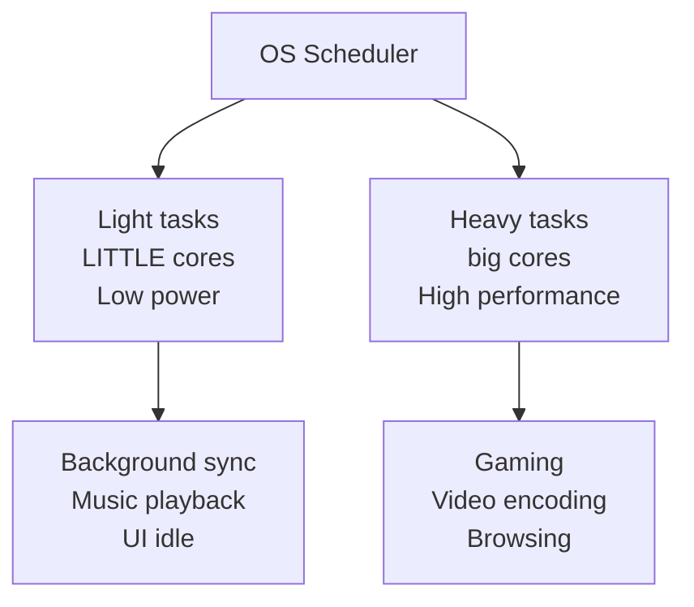

**Energy efficiency:**

```
big core (A78): 1.0x performance, 1.0x power
LITTLE core (A55): 0.3x performance, 0.1x power

For light tasks: 3x more energy efficient!
```

### Intel Hybrid (Alder Lake+)

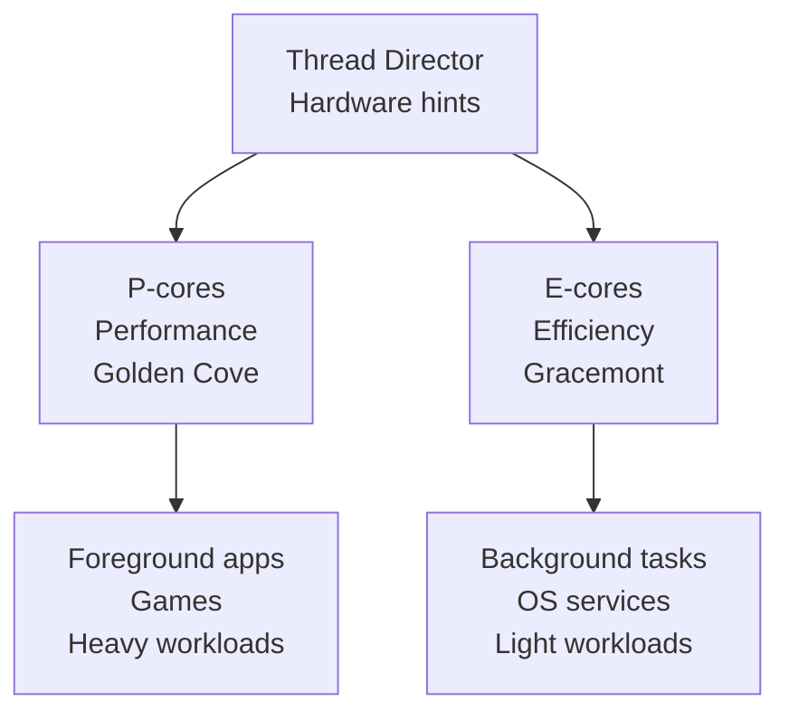

## Power Profiling

### powertop (Linux)

```bash
sudo powertop

# Tabs:
# - Overview: Power consumption estimate
# - Idle stats: C-state residency
# - Frequency stats: P-state usage
# - Device stats: Per-device power
# - Tunables: Optimization suggestions

# Generate HTML report
sudo powertop --html=report.html

# Auto-tune (enable all power savings)
sudo powertop --auto-tune
```

### Intel Power Gadget

```bash
# macOS/Windows tool
# Shows:
# - Package power (W)
# - Frequency (GHz)
# - Temperature (°C)
# - Utilization (%)
```

### Battery Life Optimization

```bash
# Check wakeups (frequent wakeups prevent deep sleep)
sudo powertop
# Look for processes with high wakeup count

# Reduce wakeups
# - Timer coalescing
# - Batch network I/O
# - Reduce polling

# Laptop mode (Linux)
echo 5 > /proc/sys/vm/laptop_mode
# Reduce disk writes, batch I/O
```

## Performance vs Power Trade-offs

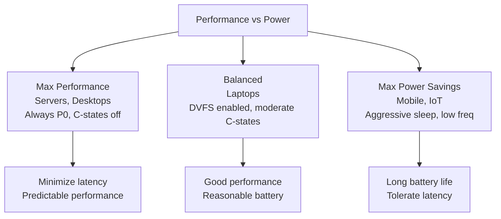

### Configuration Examples

**Max Performance (Latency-sensitive):**

```bash
# Disable C-states > C1
intel_idle.max_cstate=1

# Performance governor
cpupower frequency-set -g performance

# Disable turbo (for consistency)
echo 1 > /sys/devices/system/cpu/intel_pstate/no_turbo
```

**Balanced (Default):**

```bash
# Default C-states
# schedutil governor (default)

# Turbo enabled
echo 0 > /sys/devices/system/cpu/intel_pstate/no_turbo
```

**Max Power Savings (Battery):**

```bash
# Enable all C-states

# Powersave governor
cpupower frequency-set -g powersave

# Reduce max frequency
echo 50 > /sys/devices/system/cpu/intel_pstate/max_perf_pct

# Enable powertop recommendations
powertop --auto-tune
```

## Future Trends

### 1. Finer-grained Power Control

```
Modern: Per-core DVFS
Future: Per-cluster, per-instruction domain
```

### 2. AI-based Power Management

```
Machine learning predicts workload
→ Proactive frequency/C-state selection
→ Better than reactive governors
```

### 3. Heterogeneous Integration

```
CPU + GPU + NPU + DSP on same package
→ Route tasks to most efficient processor
```

### 4. Better Race-to-Idle

```
Faster wake-up from deep sleep
→ More aggressive deep sleep
→ Better average power
```

## Best Practices

### Development

1. **Profile power consumption**
   ```bash
   perf stat -e power/energy-pkg/ ./app
   ```

2. **Reduce wakeups**
   ```c
   // BAD: Frequent polling
   while (true) {
       check_status();
       usleep(10000);  // Wake every 10ms
   }
   
   // GOOD: Event-driven
   poll(fds, nfds, -1);  // Sleep until event
   ```

3. **Batch operations**
   ```c
   // Process multiple items per wake-up
   // Allows longer sleep periods
   ```

4. **Use hardware acceleration**
   ```c
   // Hardware decoders use less power than software
   ```

### System Administration

1. **Choose right governor**
   - Desktop: `schedutil` or `ondemand`
   - Server: `performance` (if latency critical)
   - Laptop: `powersave` or `schedutil`

2. **Monitor thermals**
   ```bash
   watch -n 1 sensors
   ```

3. **Check power limits**
   ```bash
   cat /sys/class/powercap/intel-rapl/intel-rapl:0/constraint_0_power_limit_uw
   ```

4. **Verify C-state residency**
   ```bash
   # Should spend most idle time in deep C-states
   sudo powertop
   ```

5. **Tune for workload**
   - Batch jobs: Max performance
   - Interactive: Balanced
   - Idle servers: Power savings

## Əlaqəli Mövzular

- **CPU Architecture:** Frequency, voltage domains
- **Modern Architectures:** big.LITTLE, hybrid P/E cores
- **Performance:** Power-performance trade-offs
- **Thermal Design:** Cooling solutions
- **Mobile Computing:** Battery life optimization
