# Hardware Security

## Security Threat Model

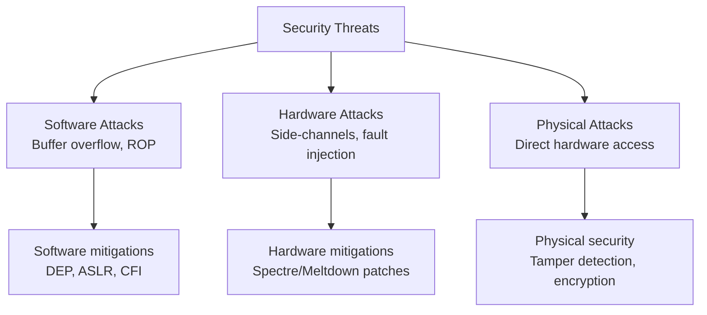

## Speculative Execution Vulnerabilities

### Spectre

**Spectre** - speculative execution vasitəsilə məlumat sızması.

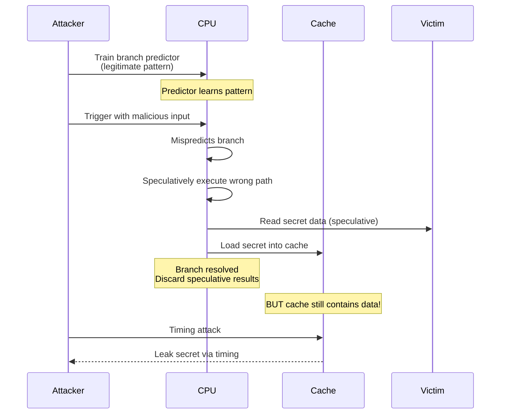

**Spectre Variants:**

```
Variant 1 (Bounds Check Bypass):
if (x < array_size) {  // Trained to be true
    y = array[x];       // x can be malicious!
    // Speculative load based on y
}

Variant 2 (Branch Target Injection):
Poison indirect branch predictor
→ Speculative jump to attacker-controlled code
```

### Spectre Example

```c
// Victim code
uint8_t victim_array[256 * 4096];
uint8_t public_array[256];

if (x < public_array_size) {  // Boundary check
    uint8_t value = public_array[x];
    uint8_t dummy = victim_array[value * 4096];
}

// Attacker code
// 1. Train branch predictor: x always < size
for (int i = 0; i < 100; i++) {
    victim_function(i);  // x is valid
}

// 2. Attack: x is secret_address (out of bounds)
victim_function(secret_address);  // Mispredicts, executes speculatively
// Speculatively loads: victim_array[secret * 4096]
// secret is now in cache!

// 3. Timing attack to recover secret
for (int i = 0; i < 256; i++) {
    time1 = rdtsc();
    dummy = victim_array[i * 4096];
    time2 = rdtsc();
    if (time2 - time1 < threshold) {
        // Cache hit! i == secret
    }
}
```

### Meltdown

**Meltdown** - kernel memory-yə user-space-dən çıxış.

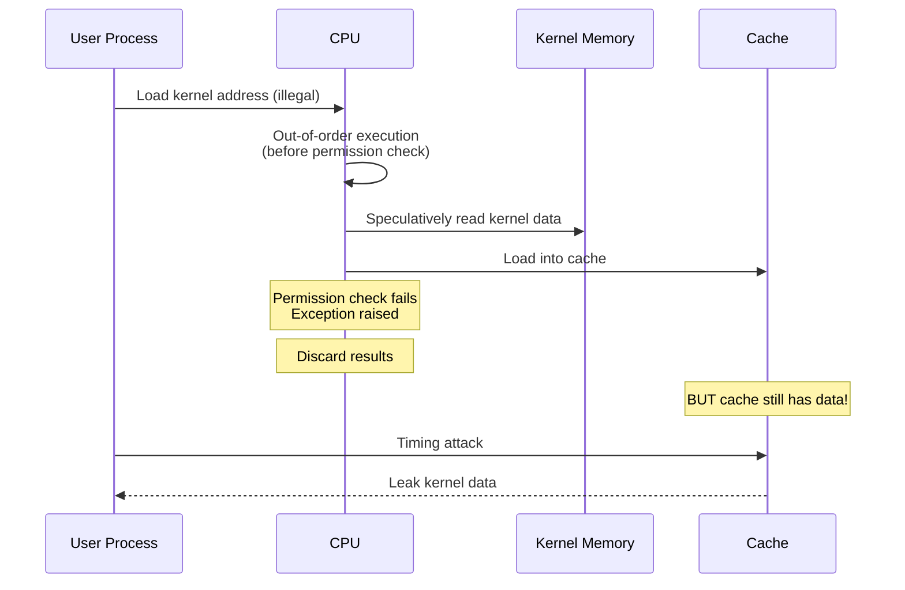

**Meltdown Example:**

```c
// Attacker code
char data;
try {
    // This will fault, but executes speculatively first
    data = *(char*)kernel_address;
    
    // Speculatively executed (before exception)
    dummy = probe_array[data * 4096];
    
} catch (exception) {
    // Exception caught, but cache already poisoned
}

// Timing attack to recover 'data'
for (int i = 0; i < 256; i++) {
    if (is_cached(probe_array + i * 4096)) {
        // i == kernel data!
    }
}
```

### Mitigations

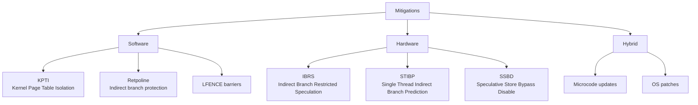

**KPTI (Kernel Page Table Isolation):**

```
Without KPTI:
User page tables map both user and kernel memory
→ Kernel memory accessible (but protected by permissions)
→ Meltdown can leak it

With KPTI:
Separate page tables for user and kernel
→ Kernel memory not mapped in user page tables
→ Meltdown blocked

Cost: 5-30% performance overhead (context switch)
```

**Retpoline:**

```asm
; Original indirect jump (vulnerable)
jmp *%rax

; Retpoline (safe)
call set_up_target
capture_spec:
  pause
  lfence
  jmp capture_spec
set_up_target:
  mov %rax, (%rsp)
  ret
```

**Check mitigations (Linux):**

```bash
# Vulnerability status
grep . /sys/devices/system/cpu/vulnerabilities/*

# Output:
# meltdown: Mitigation: PTI
# spectre_v1: Mitigation: usercopy/swapgs barriers
# spectre_v2: Mitigation: Full generic retpoline, IBPB, IBRS_FW
```

## Return-Oriented Programming (ROP)

**ROP** - code reuse attack.

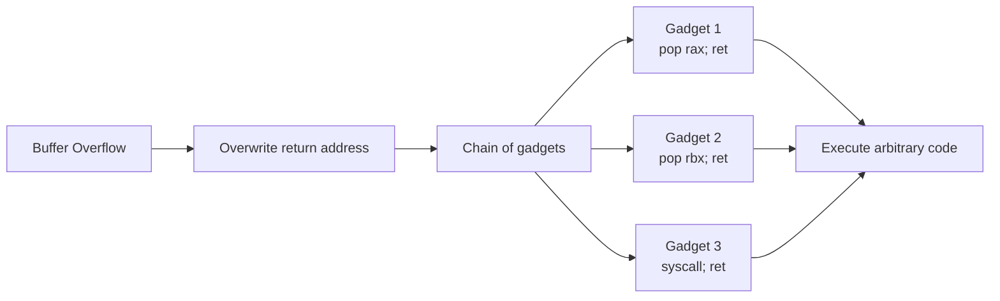

**ROP Gadget:**

```asm
; Gadget 1 (exists in legitimate code)
pop rax
ret

; Gadget 2
pop rdi
pop rsi
ret

; Gadget 3
syscall
ret
```

**ROP Chain:**

```
Stack layout:
[address of gadget 1]
[value for rax]
[address of gadget 2]
[value for rdi]
[value for rsi]
[address of gadget 3]  // execve syscall
```

### Mitigations

**1. DEP (Data Execution Prevention) / NX bit:**

```
Mark stack/heap as non-executable
→ Can't execute shellcode directly
BUT: ROP reuses existing code (still executable)
```

**2. ASLR (Address Space Layout Randomization):**

```
Randomize addresses of:
- Stack
- Heap
- Libraries
- Executable

→ Attacker can't predict gadget addresses
```

**3. Control Flow Integrity (CFI):**

```
Enforce valid control flow
- Check indirect jumps/calls
- Maintain shadow stack
- Validate return addresses

→ Prevent arbitrary ROP chains
```

**4. Intel CET (Control-flow Enforcement Technology):**

```
Hardware-enforced CFI

Shadow Stack:
- Parallel stack for return addresses
- Write-protected
- Compared on ret instruction

Indirect Branch Tracking:
- ENDBRANCH instruction marks valid targets
- Indirect jumps must land on ENDBRANCH
```

```asm
; CET enabled code
function:
    endbranch64        ; Valid indirect branch target
    push rbp
    ; ... function body ...
    pop rbp
    ret                ; Checked against shadow stack
```

## Hardware Security Modules (HSM)

**HSM** - dedicated crypto hardware.

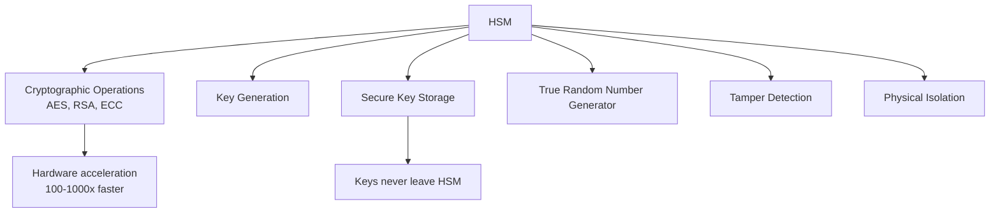

**Use cases:**
- Certificate Authorities (CA)
- Payment systems
- Banking
- TLS/SSL termination
- Database encryption

**Examples:**
- Thales nShield
- Utimaco SecurityServer
- AWS CloudHSM
- YubiHSM

## Trusted Platform Module (TPM)

**TPM** - secure crypto processor on motherboard.

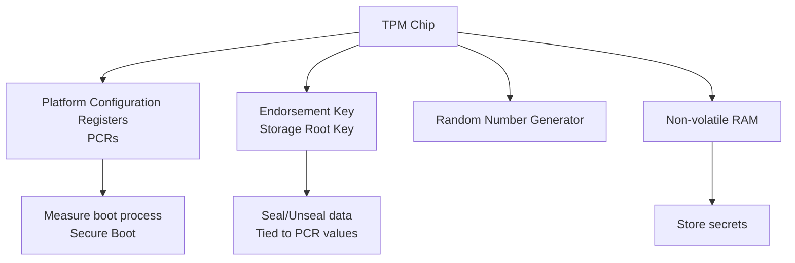

### TPM PCRs (Platform Configuration Registers)

```
PCR 0: BIOS/UEFI firmware
PCR 1: BIOS/UEFI configuration
PCR 2: Option ROM code
PCR 3: Option ROM config
PCR 4: MBR/GPT
PCR 5: MBR/GPT config
PCR 6: State transitions
PCR 7: Secure Boot state
PCR 8-15: OS specific

PCRs are "extend-only":
PCR_new = Hash(PCR_old || measurement)
```

### Measured Boot

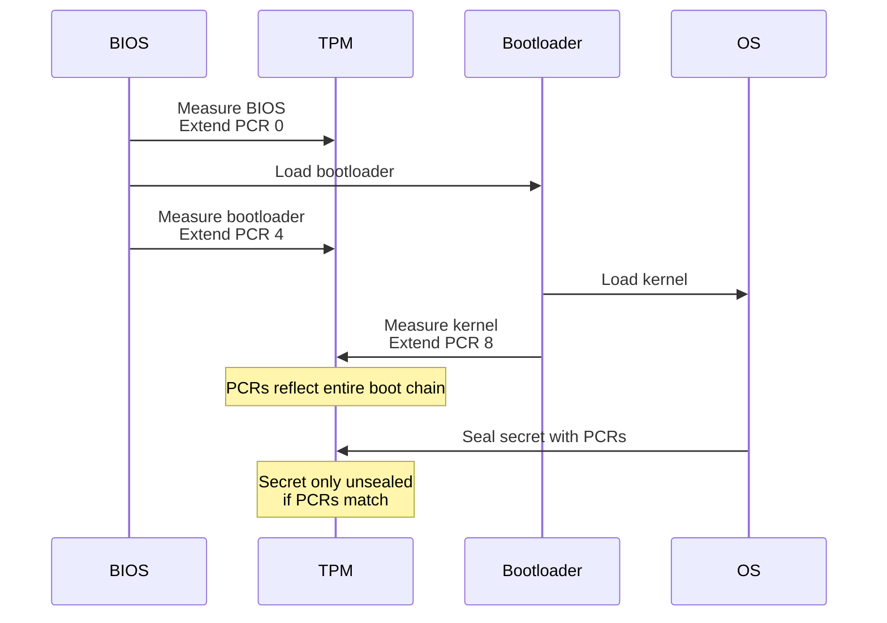

### TPM Sealed Storage

```c
// Seal data (can only unseal if PCR values match)
tpm_seal(data, pcr_selection, password, &sealed_blob);

// Later: Unseal (verifies PCR values)
if (tpm_unseal(sealed_blob, password, &data) == SUCCESS) {
    // PCRs match - boot chain unmodified
    use(data);
} else {
    // PCRs don't match - system compromised!
}
```

**Use cases:**
- Disk encryption (BitLocker, LUKS)
- Secure Boot
- Attestation (prove system state to remote party)
- Key storage

```bash
# Check TPM (Linux)
cat /sys/class/tpm/tpm0/device/description
# TPM 2.0 Device

# Read PCRs
tpm2_pcrread sha256:0,1,2,3,4,5,6,7
```

## Intel SGX (Software Guard Extensions)

**SGX** - secure enclaves in user-space.

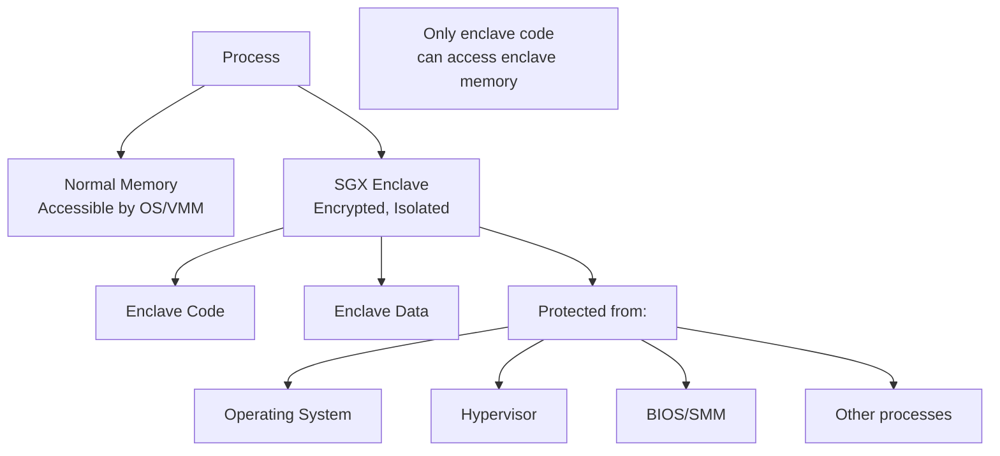

### SGX Architecture

```
EPC (Enclave Page Cache):
- Reserved physical memory
- Encrypted with random key (per power-cycle)
- 128 MB (typical)

PRM (Processor Reserved Memory):
- Contains EPC
- Not accessible to OS/VMM
- Hardware-enforced

EPCM (Enclave Page Cache Map):
- Metadata for EPC pages
- Ownership, permissions
```

### SGX Workflow

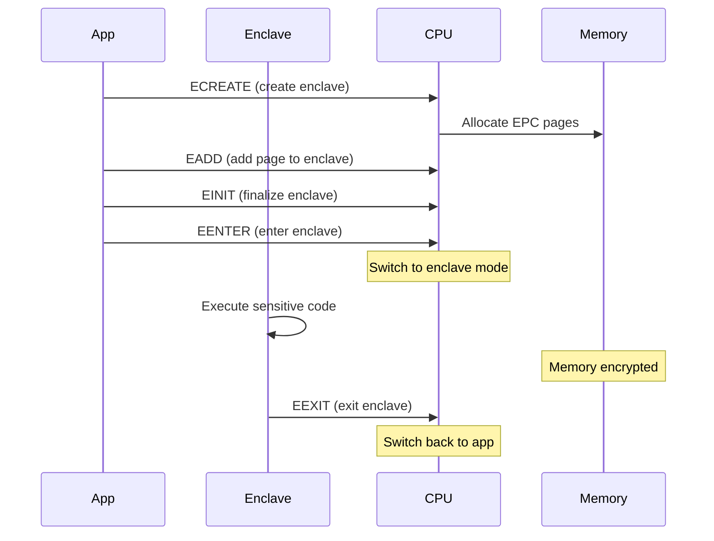

### SGX Example

```c
// Enclave code (trusted)
int enclave_function(int* sealed_data) {
    // Decrypt sealed data
    int secret = unseal(sealed_data);
    
    // Process secret
    int result = process(secret);
    
    // Return result (secret never leaves enclave)
    return result;
}

// Application code (untrusted)
int main() {
    sgx_enclave_id_t eid;
    
    // Create enclave
    sgx_create_enclave("enclave.signed.so", &eid);
    
    // Call enclave function (ECALL)
    int result;
    enclave_function(eid, &result, sealed_data);
    
    // Destroy enclave
    sgx_destroy_enclave(eid);
}
```

### SGX Attestation

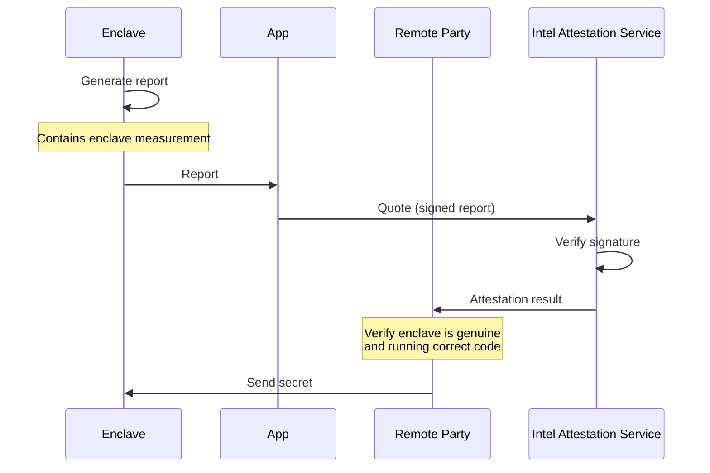

**Limitations:**
- Small enclave size (128 MB)
- Performance overhead (context switches)
- Side-channel attacks (speculative execution)
- Intel controls attestation

## ARM TrustZone

**TrustZone** - hardware isolation for secure world.

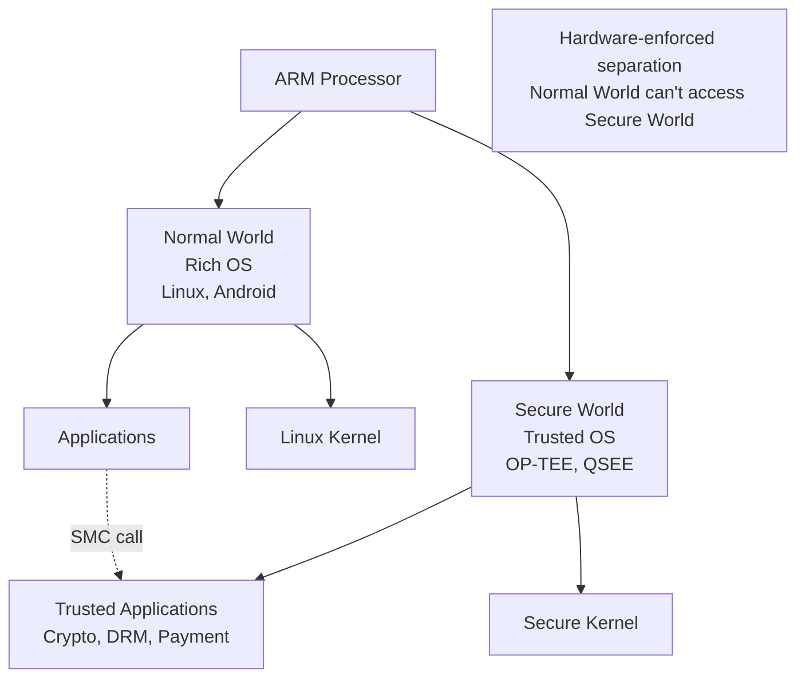

### TrustZone Architecture

```
Two virtual processors:
- Normal World (NS bit = 1)
- Secure World (NS bit = 0)

NS bit controls:
- Memory access (separate address spaces)
- Peripheral access
- Interrupts (FIQ → Secure, IRQ → Normal)

SMC (Secure Monitor Call):
- Switch between worlds
- Handled by Secure Monitor
```

### TrustZone Example

```c
// Normal World (Linux)
int normal_world_app() {
    // Call secure world
    int result = trustzone_call(CMD_DECRYPT, encrypted_data);
    return result;
}

// Secure World (OP-TEE)
int secure_world_handler(int cmd, void* data) {
    switch (cmd) {
        case CMD_DECRYPT:
            // Access secure keys (not accessible from Normal World)
            return aes_decrypt(secure_key, data);
        case CMD_SIGN:
            return rsa_sign(secure_key, data);
    }
}
```

### SGX vs TrustZone

| Feature | Intel SGX | ARM TrustZone |
|---------|-----------|---------------|
| Isolation | Enclaves (per-process) | Secure World (system-wide) |
| Trust | Don't trust OS | Trust Secure OS |
| Size | Small (128 MB) | Large (GB) |
| Performance | Overhead (context switch) | Fast (hardware switch) |
| Use case | Cloud, untrusted env | Mobile, embedded |
| Attestation | Remote attestation | Local attestation |

## Side-Channel Attacks

### Cache Timing Attacks

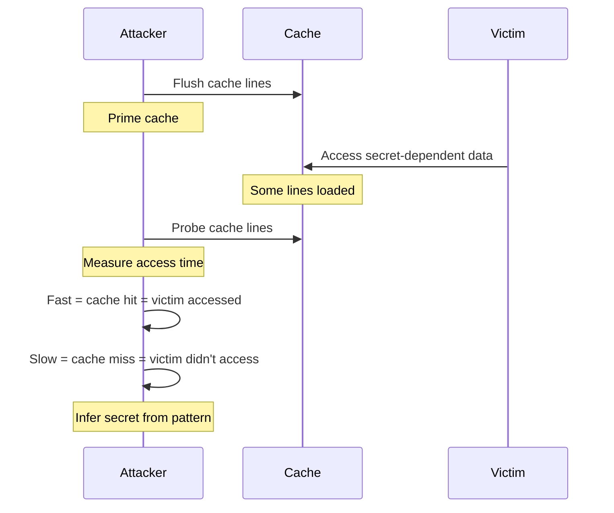

**Flush+Reload:**

```c
// 1. Flush
clflush(shared_memory);

// 2. Wait for victim
sleep_a_bit();

// 3. Reload and measure
time1 = rdtsc();
access(shared_memory);
time2 = rdtsc();

if (time2 - time1 < threshold) {
    // Victim accessed this address
}
```

### Mitigations

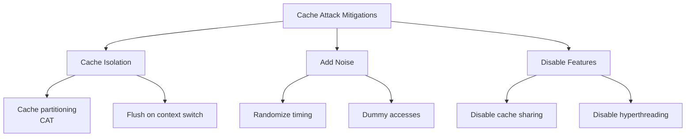

**Intel CAT (Cache Allocation Technology):**

```bash
# Partition L3 cache
# Give VM1 ways 0-7, VM2 ways 8-15
pqos -e "llc:0=0xff;llc:1=0xff00"
```

## Row Hammer

**Row Hammer** - DRAM bit flips via repeated access.

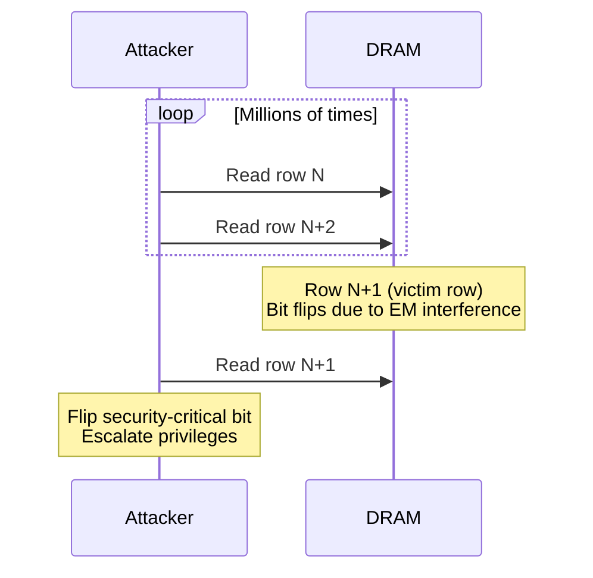

**Mitigation:**

```
ECC memory: Detect/correct bit flips
TRR (Target Row Refresh): Refresh neighboring rows
```

## Secure Boot

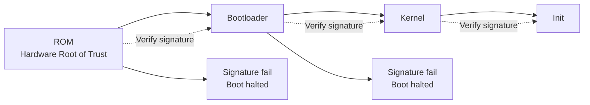

**UEFI Secure Boot:**

```
Platform Key (PK): Top-level key
Key Exchange Keys (KEK): Authorize signature databases
Signature Database (db): Allowed signatures
Forbidden Database (dbx): Revoked signatures

Boot flow:
1. UEFI firmware verifies bootloader signature against db
2. Bootloader verifies kernel signature
3. Kernel verifies module signatures
```

```bash
# Check Secure Boot status (Linux)
mokutil --sb-state
# SecureBoot enabled

# List enrolled keys
mokutil --list-enrolled
```

## Hardware Random Number Generators

```c
// Intel RDRAND instruction
uint64_t random;
if (_rdrand64_step(&random)) {
    // random now contains true random number
}

// Intel RDSEED (even more random, slower)
uint64_t seed;
if (_rdseed64_step(&seed)) {
    // seed from hardware entropy source
}
```

**Why hardware RNG?**
- True randomness (thermal noise, quantum effects)
- Faster than software PRNGs
- Critical for cryptography

## Memory Encryption

### AMD SME/SEV

**SME (Secure Memory Encryption):**
- Encrypt all DRAM
- Transparent to OS

**SEV (Secure Encrypted Virtualization):**
- Encrypt VM memory
- Each VM has unique key
- Hypervisor can't read VM memory

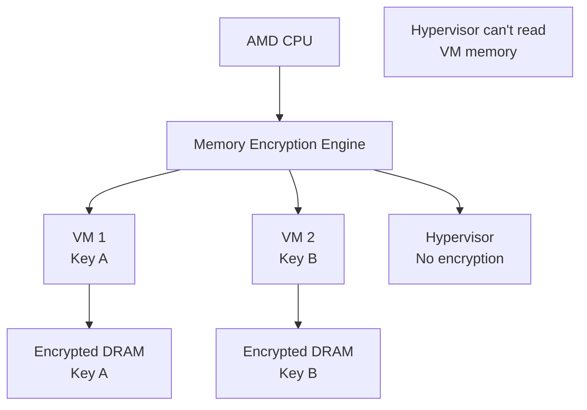

### Intel TME/MKTME

**TME (Total Memory Encryption):**
- Similar to AMD SME

**MKTME (Multi-Key TME):**
- Similar to AMD SEV
- Multiple encryption keys

## Best Practices

### Development

1. **Use constant-time algorithms**
   ```c
   // BAD: Timing leak
   if (password == correct_password) { ... }
   
   // GOOD: Constant time
   int equals = constant_time_compare(password, correct_password);
   ```

2. **Validate input**
   ```c
   // Prevent buffer overflows
   if (len > MAX_LEN) return ERROR;
   ```

3. **Use hardware security features**
   ```c
   // Use TPM for key storage
   // Use SGX/TrustZone for sensitive operations
   ```

4. **Enable mitigations**
   ```bash
   # Compile with security flags
   gcc -fstack-protector-strong -D_FORTIFY_SOURCE=2 \
       -fPIE -pie -Wl,-z,relro,-z,now
   ```

### System Administration

1. **Keep systems updated**
   ```bash
   # Microcode updates
   apt install intel-microcode  # or amd64-microcode
   ```

2. **Enable security features**
   ```bash
   # Check Spectre/Meltdown mitigations
   grep . /sys/devices/system/cpu/vulnerabilities/*
   
   # Enable Secure Boot in BIOS
   # Enable TPM in BIOS
   ```

3. **Monitor for attacks**
   ```bash
   # Check for suspicious activity
   # Audit logs
   # IDS/IPS
   ```

4. **Disable unnecessary features**
   ```bash
   # Disable SMT (hyperthreading) for high-security environments
   echo off > /sys/devices/system/cpu/smt/control
   ```

## Əlaqəli Mövzular

- **CPU Architecture:** Speculative execution, branch prediction
- **Cache Memory:** Side-channel attacks
- **Memory Hierarchy:** Memory encryption
- **Virtualization:** VM isolation, SGX
- **Modern Architectures:** Security features in new CPUs
