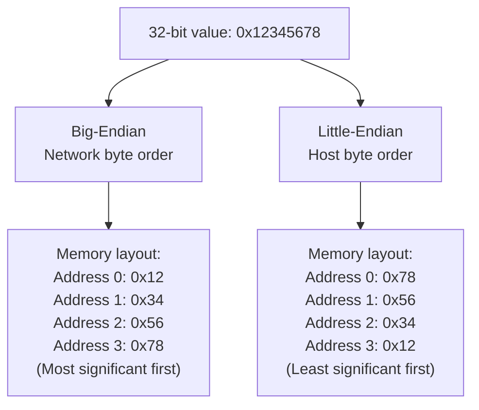
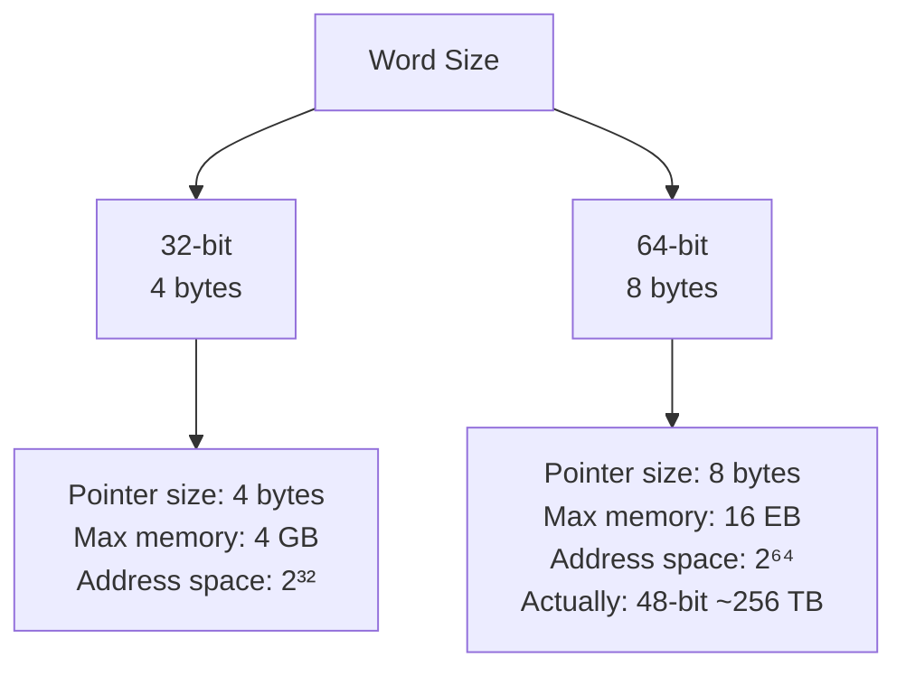
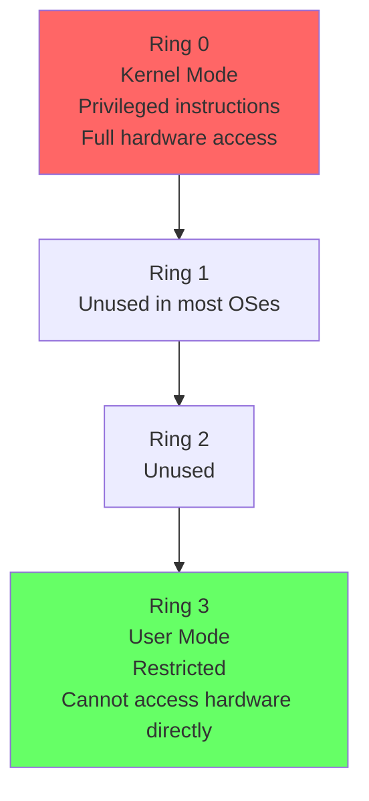
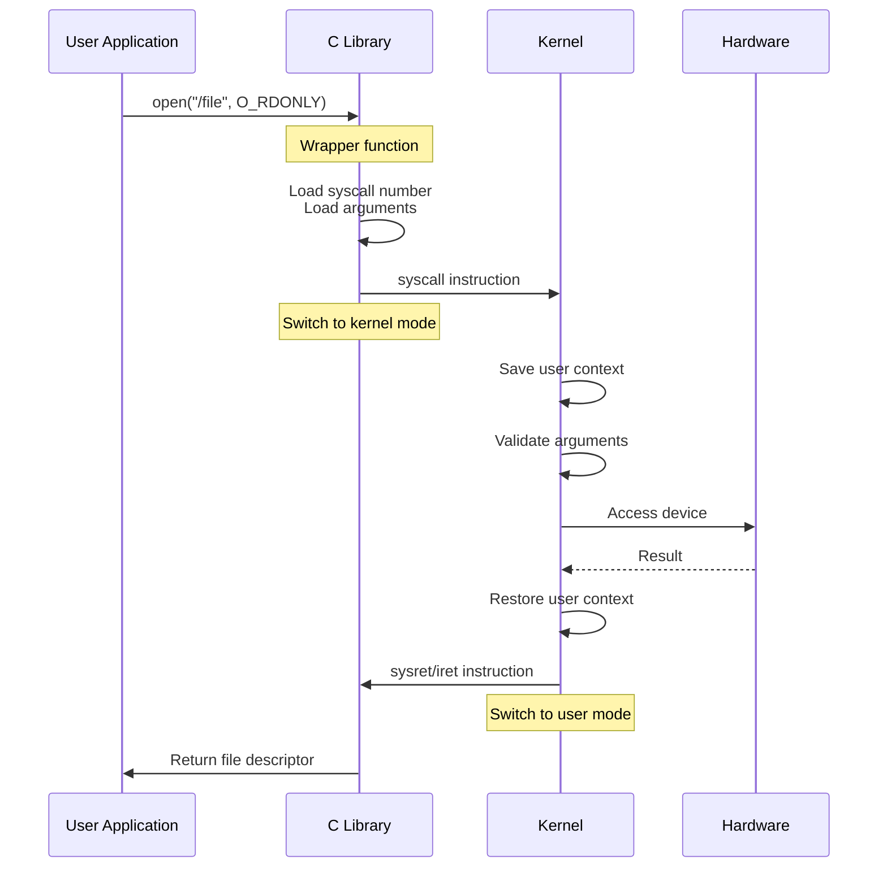
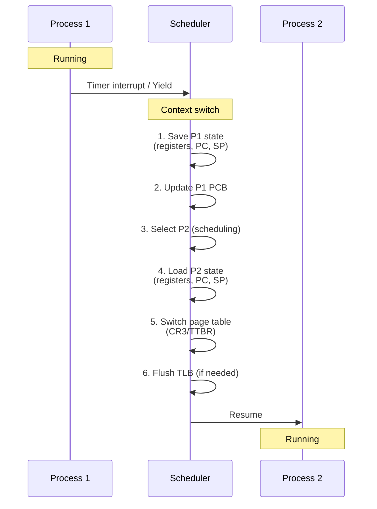
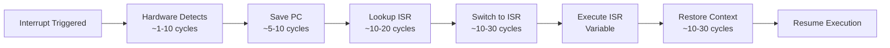
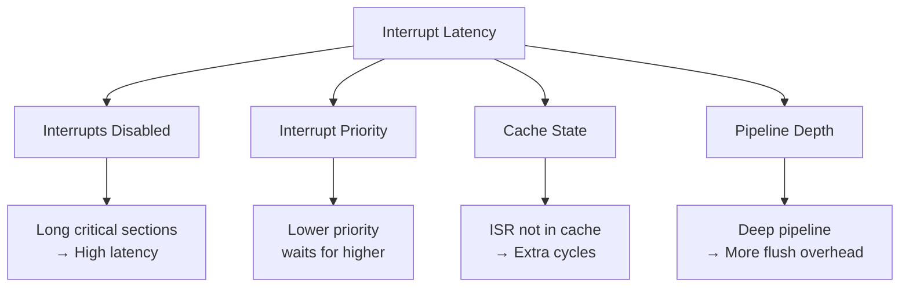
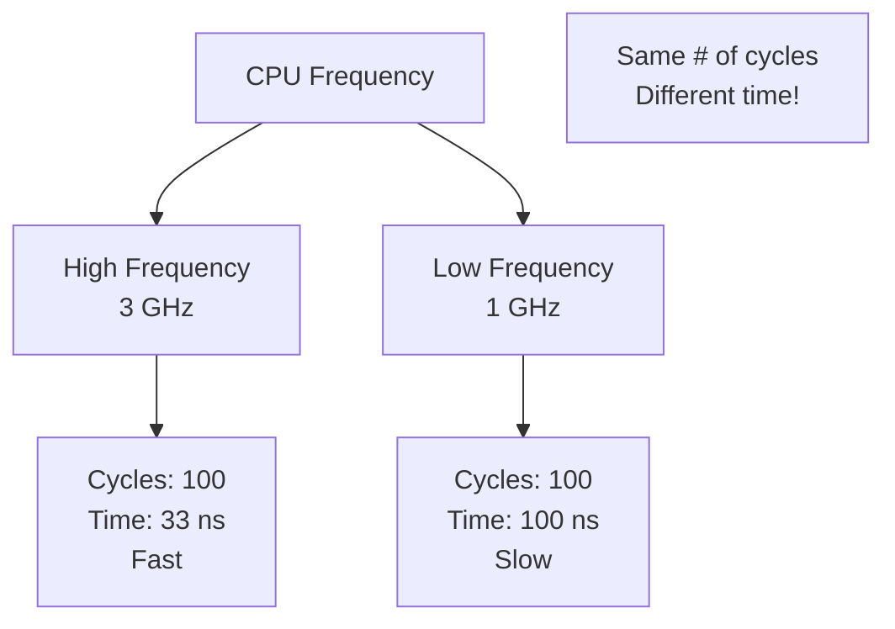
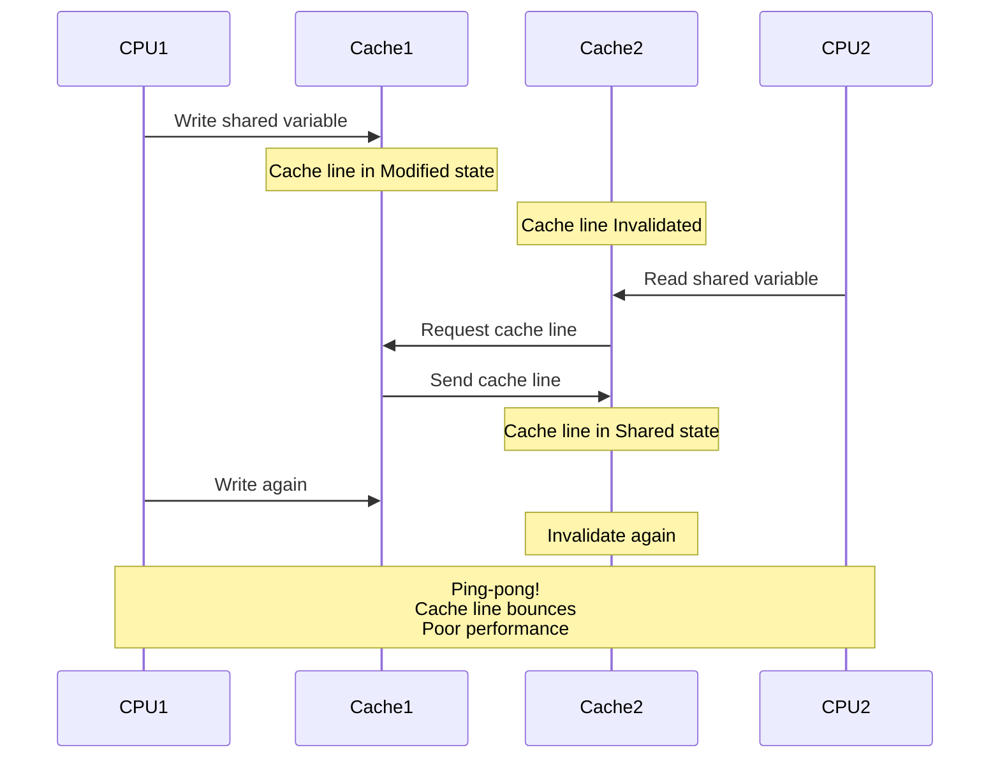

# Digər Mövzular

## Endianness

**Endianness** - byte-ların yaddaşda necə yerləşdirilməsi.



### Big-Endian

Most significant byte ən kiçik address-də.

```c
// Value: 0x12345678
// Memory (address increasing →):
// 0x1000: 12  (most significant byte)
// 0x1001: 34
// 0x1002: 56
// 0x1003: 78  (least significant byte)

// "Natural" reading order
// Network protocols (TCP/IP) use big-endian
```

**Architectures:**
- Motorola 68000
- IBM mainframes
- Network protocols (network byte order)
- Java Virtual Machine

### Little-Endian

Least significant byte ən kiçik address-də.

```c
// Value: 0x12345678
// Memory (address increasing →):
// 0x1000: 78  (least significant byte)
// 0x1001: 56
// 0x1002: 34
// 0x1003: 12  (most significant byte)

// Efficient for arithmetic (start with least significant)
```

**Architectures:**
- x86/x86-64 (Intel, AMD)
- ARM (default, but bi-endian)
- RISC-V (default, but can be configured)

### Bi-Endian

Hər iki mode-u dəstəkləyir.

**Examples:**
- ARM (can switch)
- PowerPC
- MIPS

```c
// ARM example
// CPSR.E bit controls endianness
```

### Conversion

```c
#include <arpa/inet.h>

// Host to Network (big-endian)
uint32_t network_value = htonl(host_value);  // 32-bit
uint16_t network_value = htons(host_value);  // 16-bit

// Network to Host
uint32_t host_value = ntohl(network_value);  // 32-bit
uint16_t host_value = ntohs(network_value);  // 16-bit

// Example
uint32_t ip = 0x7F000001;  // 127.0.0.1 in host byte order
uint32_t network_ip = htonl(ip);  // Convert for network transmission
```

### Detecting Endianness

```c
int is_little_endian() {
    uint32_t value = 0x12345678;
    uint8_t* byte = (uint8_t*)&value;
    
    if (byte[0] == 0x78) {
        return 1;  // Little-endian
    } else if (byte[0] == 0x12) {
        return 0;  // Big-endian
    }
}

// Or using union
int is_little_endian_union() {
    union {
        uint32_t i;
        uint8_t c[4];
    } test = {0x01020304};
    
    return test.c[0] == 4;  // Little-endian if true
}
```

### Endianness Problems

```c
// BAD: Writing binary data
FILE* f = fopen("data.bin", "wb");
uint32_t value = 0x12345678;
fwrite(&value, sizeof(value), 1, f);  // Endianness-dependent!

// Reading on different endian system:
// Little-endian wrote: 78 56 34 12
// Big-endian reads:    0x78563412 (wrong!)

// GOOD: Explicit byte order
uint32_t network_value = htonl(value);
fwrite(&network_value, sizeof(network_value), 1, f);

// Or write byte by byte
uint8_t bytes[4] = {
    (value >> 24) & 0xFF,
    (value >> 16) & 0xFF,
    (value >> 8) & 0xFF,
    value & 0xFF
};
fwrite(bytes, 4, 1, f);
```

## Word Size

### 32-bit vs 64-bit



### Memory Limits

**32-bit:**

```
Pointer size: 4 bytes (32 bits)
Address space: 2^32 = 4,294,967,296 bytes = 4 GB

User space: ~3 GB (Linux/Windows)
Kernel space: ~1 GB

Limitation: Can't use more than 4 GB RAM!
```

**64-bit:**

```
Pointer size: 8 bytes (64 bits)
Address space: 2^64 = 16 exabytes (theoretical)

Actually used (x86-64):
- User space: 0x0000000000000000 - 0x00007FFFFFFFFFFF (128 TB)
- Kernel space: 0xFFFF800000000000 - 0xFFFFFFFFFFFFFFFF (128 TB)
- Total: 256 TB (48-bit addressing)

Future: 5-level paging → 57-bit → 128 PB
```

### Data Type Sizes

```c
// LP64 model (Linux, macOS, Unix)
// ILP32 model (32-bit Windows)

// 32-bit (ILP32)        // 64-bit (LP64)
char:    1 byte          // char:    1 byte
short:   2 bytes         // short:   2 bytes
int:     4 bytes         // int:     4 bytes
long:    4 bytes         // long:    8 bytes
pointer: 4 bytes         // pointer: 8 bytes
size_t:  4 bytes         // size_t:  8 bytes

// Windows 64-bit (LLP64)
long:    4 bytes (different!)
long long: 8 bytes
```

### Portability Issues

```c
// BAD: Assume pointer size
int ptr = (int)some_pointer;  // Breaks on 64-bit!

// GOOD: Use appropriate types
uintptr_t ptr = (uintptr_t)some_pointer;

// BAD: Assume long is 8 bytes
long value = 0x123456789ABCDEF0;  // Truncated on 32-bit Windows!

// GOOD: Use fixed-size types
int64_t value = 0x123456789ABCDEF0LL;

// BAD: Serialize pointer
fwrite(&ptr, sizeof(ptr), 1, file);  // Size differs!

// GOOD: Serialize offset or ID
uint64_t offset = ptr - base_address;
fwrite(&offset, sizeof(offset), 1, file);
```

### Performance: 32-bit vs 64-bit

**64-bit advantages:**

```
+ More registers (x86-64: 16 GPRs vs x86: 8)
+ Larger address space
+ Better performance for 64-bit arithmetic
+ More efficient calling convention

- Larger pointers (memory overhead)
- Larger cache footprint
```

**Memory overhead:**

```c
// 32-bit
struct Node {
    int data;        // 4 bytes
    struct Node* next;  // 4 bytes
};  // Total: 8 bytes

// 64-bit
struct Node {
    int data;        // 4 bytes
    char padding[4]; // Alignment
    struct Node* next;  // 8 bytes
};  // Total: 16 bytes (2× larger!)
```

### Migration Path

```
32-bit only → 32-bit app on 64-bit OS → 64-bit app

x86 → x86-64 (backward compatible)
ARM32 → ARM64 (AArch64, not fully compatible)
```

## System Calls və Mode Switching

### Privilege Levels



### System Call Mechanism



### System Call Implementation

**x86-64:**

```asm
; User space
mov rax, 2          ; syscall number (open)
mov rdi, filename   ; arg 1
mov rsi, O_RDONLY   ; arg 2
mov rdx, 0          ; arg 3
syscall             ; Enter kernel mode

; Kernel space
; rax contains syscall number
; rdi, rsi, rdx, r10, r8, r9 contain arguments

; Jump to syscall handler
call sys_call_table[rax]

; Return to user space
sysretq
```

**x86 (32-bit, legacy):**

```asm
; User space
mov eax, 5          ; syscall number (open)
mov ebx, filename   ; arg 1
mov ecx, O_RDONLY   ; arg 2
mov edx, 0          ; arg 3
int 0x80            ; Software interrupt (slow!)

; Kernel handles interrupt
; Returns via iret
```

**ARM64:**

```asm
; User space
mov x8, #56         ; syscall number (openat)
mov x0, filename    ; arg 1
mov x1, O_RDONLY    ; arg 2
svc #0              ; Supervisor call

; Kernel handles SVC exception
; Returns via eret
```

### System Call Overhead

```
Direct function call: ~1-5 cycles
System call: ~100-300 cycles

Overhead includes:
- Mode switch (ring 3 → ring 0)
- Context save/restore
- Argument validation
- TLB flush (with KPTI)
- Return mode switch (ring 0 → ring 3)

With KPTI (Meltdown mitigation): +30-50% overhead
```

### vDSO (Virtual Dynamic Shared Object)

Kernel code mapped into user space (read-only).

```c
// Instead of syscall:
time_t t = time(NULL);  // Normally a syscall

// With vDSO:
// time() reads from kernel-maintained shared memory
// No mode switch needed!
// Much faster for frequently-called syscalls

// Other vDSO functions:
// - gettimeofday()
// - clock_gettime()
// - getcpu()
```

```bash
# Check vDSO
cat /proc/self/maps | grep vdso
# 7fff12345000-7fff12346000 r-xp 00000000 00:00 0 [vdso]

# List vDSO functions
ldd /bin/ls | grep vdso
```

## Context Switching

**Context switch** - bir process/thread-dən digərinə keçid.



### Context Switch Cost

```c
// What needs to be saved/restored:

struct task_struct {
    // CPU state
    struct pt_regs regs;  // General purpose registers
    unsigned long rsp;    // Stack pointer
    unsigned long rip;    // Instruction pointer
    
    // FPU/SIMD state
    struct fpu fpu_state;
    
    // Memory management
    struct mm_struct* mm;  // Page table pointer
    
    // Scheduler info
    int priority;
    unsigned long runtime;
    
    // Many more fields...
};
```

**Context switch overhead:**

```
Direct cost: 5-10 microseconds
- Save/restore registers: ~1 µs
- Switch page table: ~1 µs
- TLB flush: ~2-3 µs
- Scheduler overhead: ~1-2 µs

Indirect cost:
- Cache pollution (cold cache)
- TLB misses
- Branch predictor state lost

Total effective cost: 20-100 µs
```

### Reducing Context Switch Overhead

**1. Voluntary context switches:**

```c
// Cooperative (thread yields)
sched_yield();  // Give up CPU voluntarily

// Less overhead than involuntary (timer interrupt)
```

**2. Process affinity:**

```c
// Pin process to specific CPU
cpu_set_t cpuset;
CPU_ZERO(&cpuset);
CPU_SET(0, &cpuset);  // CPU 0
sched_setaffinity(getpid(), sizeof(cpuset), &cpuset);

// Benefits:
// - Warmer cache (less cache misses)
// - No TLB flush (same CPU)
```

**3. Fewer threads:**

```c
// BAD: Too many threads
for (int i = 0; i < 1000; i++) {
    pthread_create(&threads[i], NULL, worker, NULL);
}
// Excessive context switching!

// GOOD: Thread pool (# of CPUs)
int n_threads = sysconf(_SC_NPROCESSORS_ONLN);
for (int i = 0; i < n_threads; i++) {
    pthread_create(&threads[i], NULL, worker, NULL);
}
```

**4. User-space threading (fibers, coroutines):**

```c
// No kernel involvement
// No mode switch
// No TLB flush
// But: Can't utilize multiple CPUs
```

### Measuring Context Switches

```bash
# Number of context switches
cat /proc/$PID/status | grep ctxt
# voluntary_ctxt_switches:   123456
# nonvoluntary_ctxt_switches: 7890

# System-wide
vmstat 1
# cs column = context switches per second

# Trace context switches
perf record -e context-switches ./program
perf report
```

## Interrupt Latency

**Interrupt latency** - interrupt baş verəndən işlənənə qədər olan vaxt.



### Interrupt Latency Components

```
1. Interrupt recognition: 1-10 cycles
   - Hardware detects interrupt signal
   
2. Current instruction completion: 0-100 cycles
   - Finish currently executing instruction
   
3. Context save: 10-50 cycles
   - Push PC, flags, registers
   
4. ISR lookup: 10-20 cycles
   - Index into interrupt vector table
   
5. ISR execution: Variable (10-10000+ cycles)
   - Actual interrupt handler code
   
6. Context restore: 10-50 cycles
   - Pop registers, flags, PC
   
7. Return: 5-10 cycles
   - iret/eret instruction

Total: ~100-200 cycles (typical)
      + ISR execution time
```

### Factors Affecting Latency



### Measuring Interrupt Latency

```bash
# Use cyclictest (real-time Linux)
sudo cyclictest -p 99 -t 1 -n -i 1000 -l 100000

# Output:
# Min: 5 µs
# Avg: 12 µs
# Max: 847 µs  (worst case - important for real-time!)

# Trace interrupts
sudo trace-cmd record -e irq ./program
trace-cmd report
```

### Reducing Interrupt Latency

**1. Shorter critical sections:**

```c
// BAD: Long interrupts-disabled section
local_irq_disable();
// ... 1000 lines of code ...
local_irq_enable();

// GOOD: Minimal critical section
local_irq_disable();
// Only essential code
local_irq_enable();
```

**2. Nested interrupts:**

```c
void interrupt_handler() {
    save_context();
    
    // Re-enable interrupts (allow higher priority)
    enable_interrupts();
    
    // Handle interrupt
    process_interrupt();
    
    disable_interrupts();
    restore_context();
}
```

**3. Deferred work:**

```c
// Top half (fast, in ISR)
void irq_handler() {
    // Minimal work
    read_status();
    schedule_work(&workqueue);
    ack_interrupt();
}

// Bottom half (slower, in process context)
void workqueue_handler() {
    // Heavy processing
    process_data();
}
```

**4. Real-time priority:**

```c
// Set real-time priority (Linux)
struct sched_param param;
param.sched_priority = 99;  // Max priority
sched_setscheduler(0, SCHED_FIFO, &param);

// Reduce scheduling latency
```

**5. Disable unnecessary interrupts:**

```c
// IRQ affinity (bind IRQ to specific CPU)
echo 1 > /proc/irq/IRQ_NUMBER/smp_affinity
// CPU 0 only

// Isolate CPUs for real-time tasks
// Boot parameter: isolcpus=1,2,3
```

## CPU Frequency Scaling Impact



**Impact on timing:**

```c
// Measuring execution time
clock_t start = clock();  // Wall-clock time
// ... code ...
clock_t end = clock();

// Problem: CPU frequency changes during execution!
// Solution: Use RDTSC (cycle counter) or disable frequency scaling
```

## Cache Line Ping-Pong



**Solution:** Avoid false sharing (see Performance Optimization).

## Best Practices Summary

### Endianness

```c
// Always use explicit byte order for network/file I/O
uint32_t network_value = htonl(host_value);

// Use fixed-size types
#include <stdint.h>
uint32_t value;  // Not "unsigned int"
```

### Portability

```c
// Use appropriate types for pointers
uintptr_t ptr_as_int = (uintptr_t)pointer;

// Use size_t for sizes
size_t size = sizeof(data);

// Don't assume type sizes
static_assert(sizeof(long) == 8, "Expected 64-bit long");
```

### Performance

```c
// Minimize system calls
// Use buffered I/O
// Batch operations

// Reduce context switches
// Use thread pools
// Set CPU affinity

// Reduce interrupt latency
// Short critical sections
// Use deferred work
```

### Debugging

```bash
# Check system info
lscpu
uname -m

# Monitor performance
perf stat ./program
vmstat 1
iostat 1

# Trace system calls
strace ./program

# Trace interrupts
trace-cmd record -e irq ./program
```

## Əlaqəli Mövzular

- **CPU Architecture:** Privilege levels, instruction sets
- **Memory Hierarchy:** Address spaces, paging
- **Performance:** Context switch overhead, interrupt latency
- **I/O Systems:** System calls, interrupt handling
- **Security:** Mode switching, privilege separation
