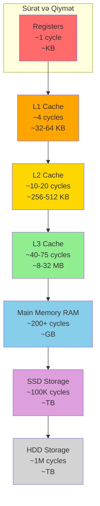
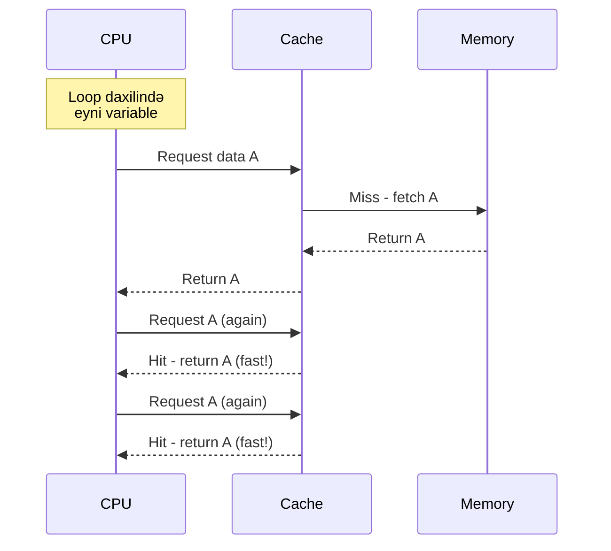
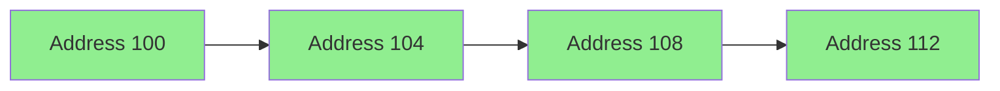
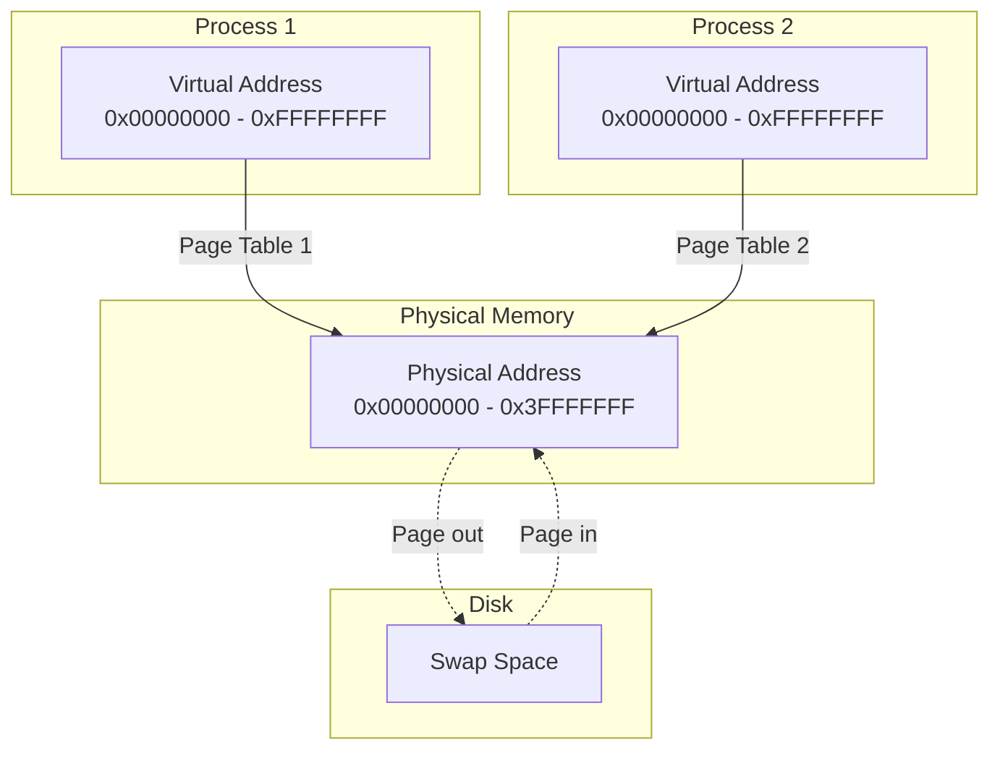
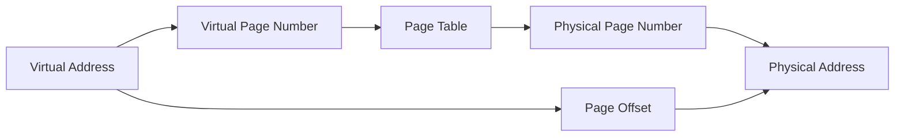
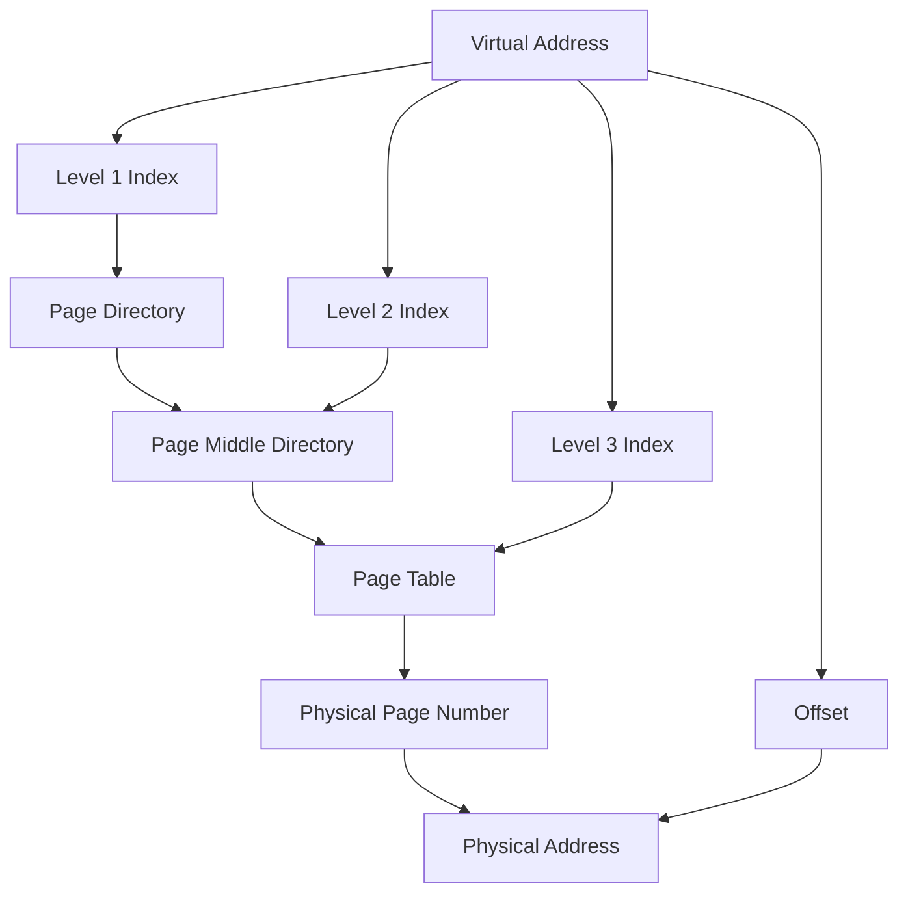
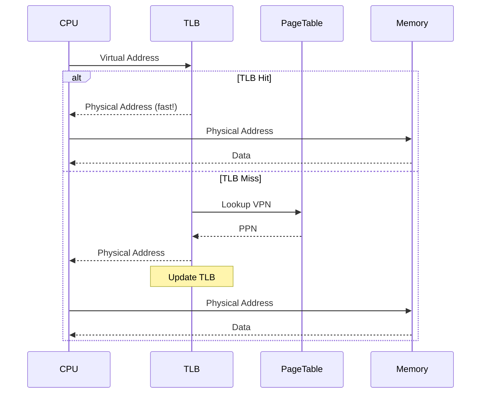
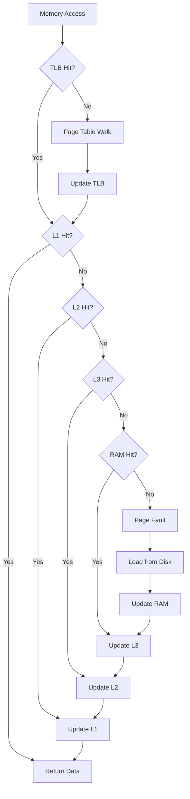

# Yaddaş İerarxiyası

## Memory Hierarchy Nədir?

**Memory Hierarchy** - müxtəlif sürət və tutum xarakteristikalarına malik yaddaş səviyyələrinin təşkilidir. Məqsəd sürətli və ucuz yaddaşın balansını təmin etməkdir.

## Yaddaş Piramidası



## Əsas Səviyyələr

### 1. Registers
- **Yer:** CPU daxilində
- **Sürət:** 1 cycle (~0.25 ns)
- **Ölçü:** 32-256 bytes
- **Xüsusiyyət:** Ən sürətli, ən kiçik

### 2. Cache Memory

**L1 Cache (Level 1)**
- CPU core-a aid
- Split: Instruction cache (I-cache) və Data cache (D-cache)
- Ölçü: 32-64 KB per core
- Latency: 4-5 cycles

**L2 Cache (Level 2)**
- Core-a aid və ya shared
- Unified cache (instruction + data)
- Ölçü: 256-512 KB per core
- Latency: 12-20 cycles

**L3 Cache (Level 3)**
- Bütün core-lar arasında shared
- Ölçü: 8-32 MB
- Latency: 40-75 cycles

### 3. Main Memory (RAM)
- **Ölçü:** 8-128 GB (tipik sistemlərdə)
- **Latency:** 200-300 cycles (~50-100 ns)
- **Volatile:** Elektrik kəsilməsi ilə məlumat itirilir

### 4. Storage (SSD/HDD)
- **SSD:** 100,000+ cycles (~100 μs)
- **HDD:** 10,000,000+ cycles (~10 ms)
- **Non-volatile:** Məlumat qalır

## Yaddaş İerarxiyası Cədvəli

| Səviyyə | Sürət | Ölçü | Qiymət/GB | Latency |
|---------|-------|------|-----------|---------|
| Registers | Ən sürətli | ~KB | N/A | ~1 cycle |
| L1 Cache | Çox sürətli | ~64 KB | N/A | ~4 cycles |
| L2 Cache | Sürətli | ~512 KB | N/A | ~12 cycles |
| L3 Cache | Orta sürətli | ~16 MB | N/A | ~40 cycles |
| RAM | Orta | ~16 GB | Orta | ~200 cycles |
| SSD | Yavaş | ~1 TB | Aşağı | ~100 μs |
| HDD | Çox yavaş | ~4 TB | Ən aşağı | ~10 ms |

## Locality Principles

### Temporal Locality (Zaman Lokalliği)

Yaxın keçmişdə istifadə olunan məlumatlara yenidən müraciət olma ehtimalı yüksəkdir.



**Nümunə:**
```c
for (int i = 0; i < 1000; i++) {
    sum += array[0];  // array[0] - temporal locality
}
```

### Spatial Locality (Məkan Lokalliği)

Yaxın ünvanların da tezliklə istifadə olunma ehtimalı yüksəkdir.



**Nümunə:**
```c
for (int i = 0; i < 1000; i++) {
    sum += array[i];  // Sequential access - spatial locality
}
```

## Memory Access Patterns

### Sequential Access (Optimal)
```c
// GOOD: Cache-friendly
for (int i = 0; i < N; i++) {
    process(array[i]);
}
```

### Strided Access
```c
// DECENT: Hər k-cı element
for (int i = 0; i < N; i += k) {
    process(array[i]);
}
```

### Random Access (Worst)
```c
// BAD: Cache-unfriendly
for (int i = 0; i < N; i++) {
    int index = random();
    process(array[index]);
}
```

### Matrix Access Pattern

```c
// GOOD: Row-major order (C/C++)
for (int i = 0; i < N; i++) {
    for (int j = 0; j < M; j++) {
        sum += matrix[i][j];  // Sequential in memory
    }
}

// BAD: Column-major access (C/C++)
for (int j = 0; j < M; j++) {
    for (int i = 0; i < N; i++) {
        sum += matrix[i][j];  // Strided access
    }
}
```

## Virtual Memory

Virtual Memory - hər prosesə öz ayrı yaddaş məkanı illüziyasını yaradır.



### Virtual Memory Üstünlükləri

- **İzolyasiya:** Proseslər bir-birinin yaddaşına girmə bilməz
- **Abstraction:** Hər proses öz yaddaşı var kimi görünür
- **Paging:** Physical memory-dən çox virtual memory istifadəsi
- **Sharing:** Kod səhifələri shared ola bilər

### Virtual Memory Çatışmazlıqları

- **Overhead:** Address translation vaxt alır
- **Page faults:** Disk-ə müraciət çox yavaşdır
- **TLB miss:** Translation overhead

## Page Tables

Page Table - virtual address-i physical address-ə çevirən cədvəldir.



### Address Translation

**Virtual Address Structure:**
- Virtual Page Number (VPN): Yuxarı bitlər
- Page Offset: Aşağı bitlər

**Physical Address Structure:**
- Physical Page Number (PPN): Page Table-dan
- Page Offset: Dəyişmir

### Multi-Level Page Tables



**Üstünlükləri:**
- Yaddaşda az yer tutur
- Sparse address space üçün yaxşı

## TLB (Translation Lookaside Buffer)

TLB - page table entry-lərinin cache-idir, address translation-u sürətləndirir.



### TLB Xüsusiyyətləri

- **Sürət:** 1-2 cycles
- **Ölçü:** 64-1024 entries
- **Hit rate:** ~95-99%
- **Structure:** Fully-associative və ya set-associative

### TLB Miss Növləri

**Minor (Soft) TLB Miss:**
- Page Table-də entry var
- Sadəcə TLB-də yox idi
- Hardware və ya OS tərəfindən həll olunur

**Major (Hard) TLB Miss:**
- Page Table-də entry yox
- Page disk-də (swap)
- Page fault - disk-dən yükləmə lazımdır

## Memory Access Flow



## Performans Optimizasiyası

### 1. Data Structure Alignment
```c
// BAD: Padding waste
struct Bad {
    char a;      // 1 byte
    int b;       // 4 bytes (3 bytes padding)
    char c;      // 1 byte (3 bytes padding)
};  // Total: 12 bytes

// GOOD: Optimized layout
struct Good {
    int b;       // 4 bytes
    char a;      // 1 byte
    char c;      // 1 byte (2 bytes padding)
};  // Total: 8 bytes
```

### 2. Cache Line Awareness
```c
#define CACHE_LINE_SIZE 64

// Align to cache line
struct alignas(CACHE_LINE_SIZE) CacheAligned {
    int data;
    // ...
};
```

### 3. Sequential Access
```c
// Prefer sequential over random access
// Utilize spatial locality
for (int i = 0; i < N; i++) {
    array[i] = compute(i);  // Sequential write
}
```

## Əlaqəli Mövzular

- **Cache Memory:** Cache strukturu və protokolları
- **Virtual Memory:** Paging və memory management
- **CPU Performance:** Memory bandwidth təsiri
- **False Sharing:** Multi-threading cache problemləri
