# Cache Yaddaş

## Cache Nədir?

**Cache** - CPU və main memory arasında yerləşən kiçik, sürətli yaddaş. Tez-tez istifadə olunan məlumatları saxlayır və memory access latency-ni azaldır.

## Cache Əsasları

### Cache Line (Block)

Cache-də məlumat **cache line** və ya **block** şəklində saxlanılır.

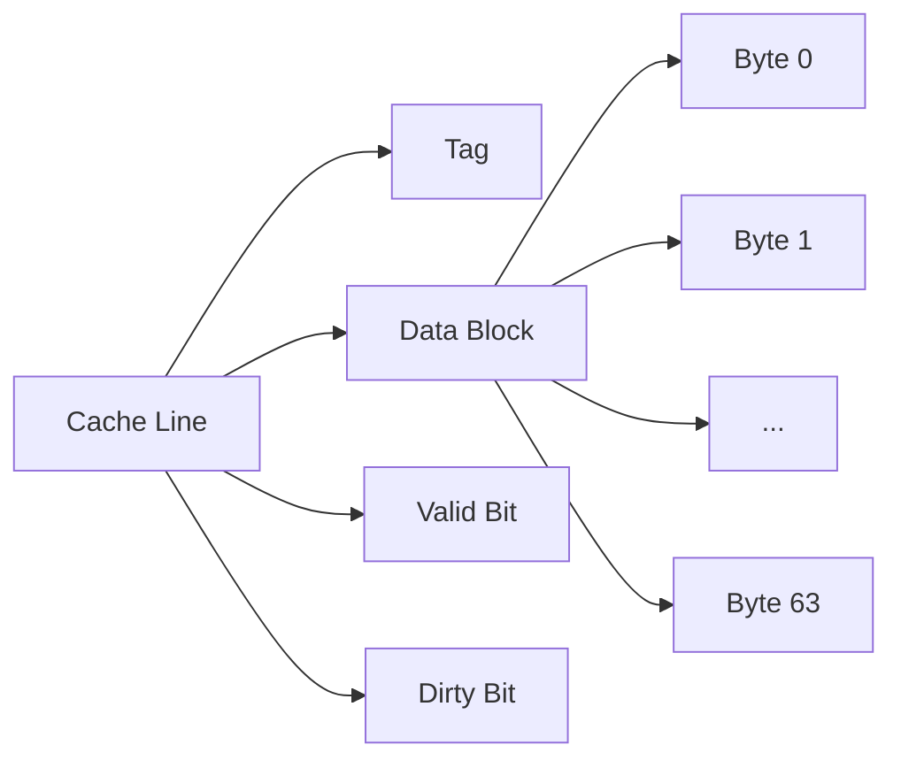

**Tipik cache line size:** 64 bytes

### Address Breakdown

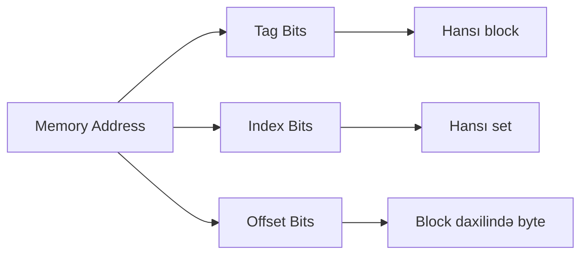

## Cache Structure Növləri

### 1. Direct-Mapped Cache

Hər memory block yalnız **bir** cache line-a map olunur.

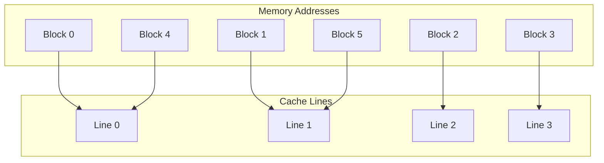

**Mapping:** `Cache Line = (Memory Block) % (Number of Cache Lines)`

**Üstünlükləri:**
- Sadə implementasiya
- Sürətli lookup (bir müqayisə)
- Az hardware

**Çatışmazlıqları:**
- Conflict miss çoxdur
- Poor cache utilization

### 2. Fully-Associative Cache

Hər memory block **istənilən** cache line-a map oluna bilər.

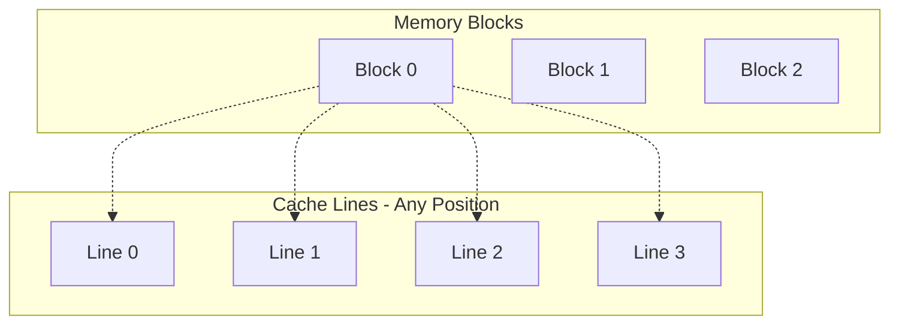

**Üstünlükləri:**
- Minimum conflict miss
- Optimal cache utilization
- Flexibility

**Çatışmazlıqları:**
- Çox bahalı (paralel comparators)
- Yavaş lookup (bütün line-ları yoxlamaq)
- Kompleks hardware

### 3. Set-Associative Cache

**Hybrid approach** - cache set-lərə bölünür, hər set-də N line var.

**N-way set-associative:** Hər set-də N line

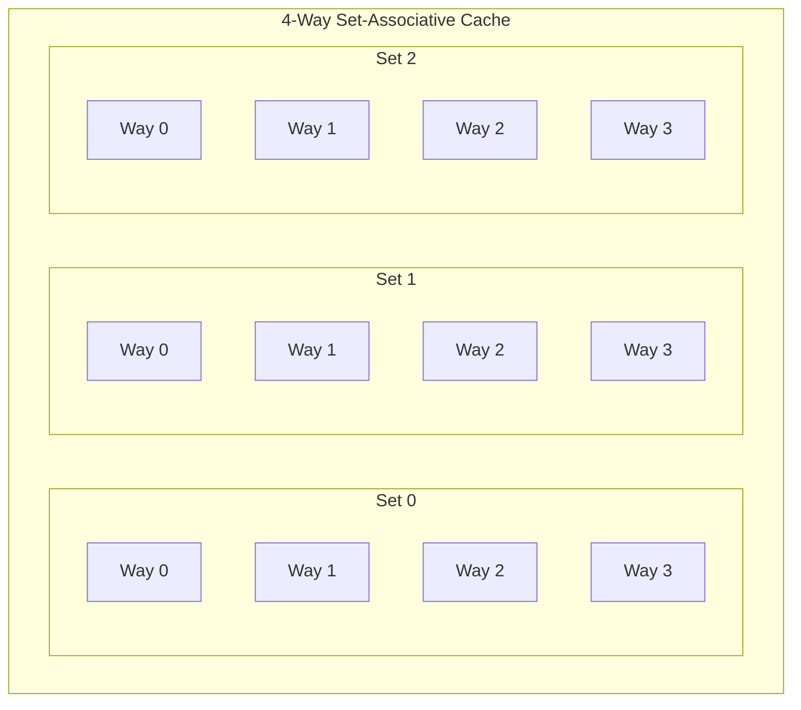

**Mapping:** 
- `Set Number = (Memory Block) % (Number of Sets)`
- Block istənilən way-ə yerləşə bilər

**Üstünlükləri:**
- Balance between direct-mapped və fully-associative
- Reasonable performance və cost
- Ən çox istifadə olunan (L1: 8-way, L2/L3: 16-way)

### Müqayisə

| Növ | Hit Time | Miss Rate | Hardware Cost | Flexibility |
|-----|----------|-----------|---------------|-------------|
| Direct-Mapped | Ən sürətli | Yüksək | Aşağı | Aşağı |
| Set-Associative | Orta | Orta | Orta | Orta |
| Fully-Associative | Yavaş | Ən aşağı | Yüksək | Maksimum |

## Replacement Policies

Cache dolu olanda, hansı line-ı replace etmək?

### 1. LRU (Least Recently Used)
- Ən az istifadə olunan line-ı çıxarır
- Yaxşı performans
- Kompleks hardware (timestamp və ya counter)

### 2. Random
- Random line seçir
- Sadə implementasiya
- LRU-ya yaxın performans

### 3. FIFO (First-In-First-Out)
- Ən köhnə line-ı çıxarır
- Sadə
- LRU-dan pis

### 4. LFU (Least Frequently Used)
- Ən az frequency-li line
- Counter lazımdır
- Praktikada az istifadə olunur

## Write Policies

### Write-Hit Policies

**1. Write-Through**
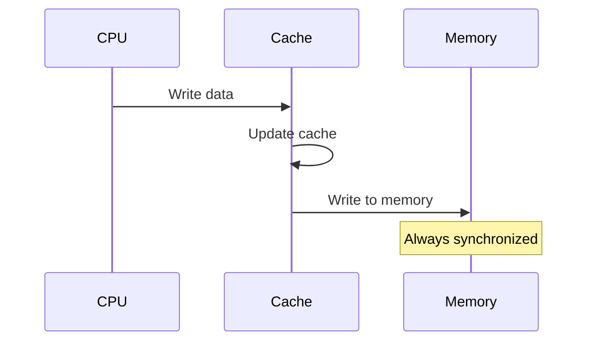

**Xüsusiyyətlər:**
- Cache və memory həmişə sync
- Hər yazma memory-ə gedír
- Yavaş (memory latency)
- Write buffer istifadə olunur

**2. Write-Back**
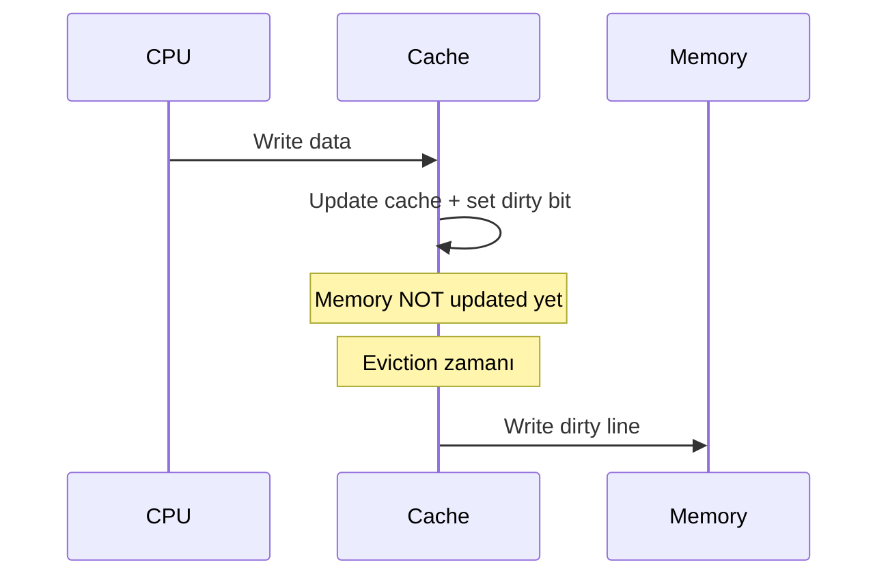

**Xüsusiyyətlər:**
- Yalnız cache-ə yazır
- Memory eviction zamanı update olunur
- Sürətli
- Dirty bit lazımdır
- Cache coherence çətinliyi

### Write-Miss Policies

**1. Write-Allocate**
- Line-ı cache-ə yüklə
- Sonra write et
- Write-back ilə istifadə olunur

**2. No-Write-Allocate**
- Birbaşa memory-ə yaz
- Cache-ə yüklə-mə
- Write-through ilə istifadə olunur

## Cache Miss Növləri

### 1. Compulsory (Cold) Miss
- İlk dəfə access
- Qarşısı alına bilməz
- Cache warming ilə minimize olunur

### 2. Capacity Miss
- Cache kiçik olduğu üçün
- Working set cache-ə sığmır
- Həll: Daha böyük cache

### 3. Conflict Miss
- Direct-mapped və set-associative-də
- Eyni set-ə map olan block-lar
- Həll: Daha yüksək associativity

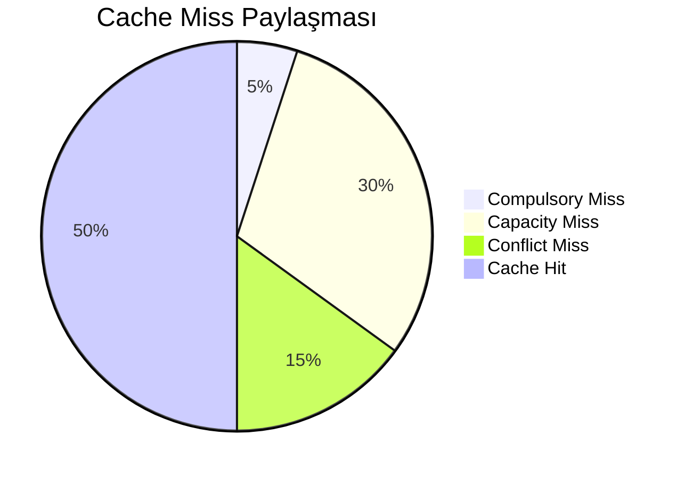

## Cache Coherence

Multi-core sistemlərdə hər core-un öz cache-i var. **Cache coherence** - bütün cache-lərdə eyni məlumatın consistency-ni təmin edir.

### Problem Nümunəsi

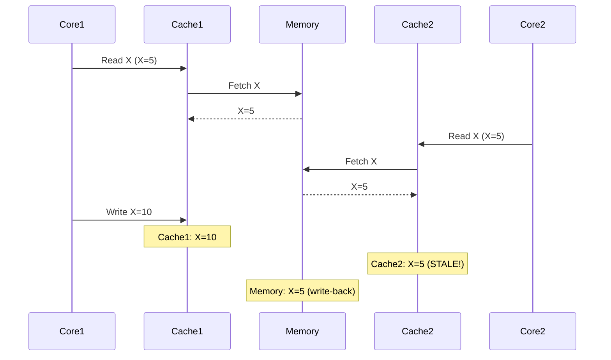

## MESI Protocol

**MESI** - ən populyar cache coherence protokolu.

**States:**
- **M (Modified):** Yalnız bu cache-də var, dəyişdirilib, dirty
- **E (Exclusive):** Yalnız bu cache-də var, təmiz, memory ilə sync
- **S (Shared):** Bir neçə cache-də var, read-only
- **I (Invalid):** Keçərsiz, istifadə olunmur

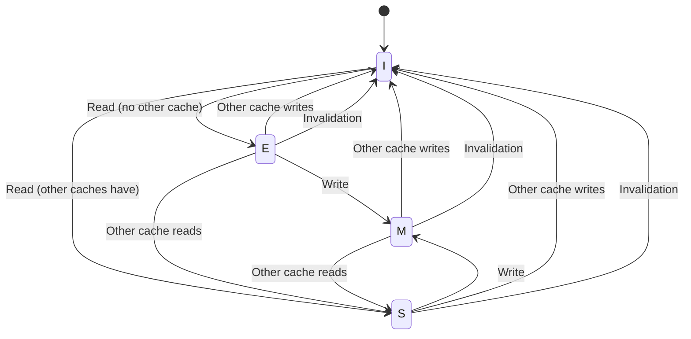

### MESI State Transitions

| Olay | I | E | S | M |
|------|---|---|---|---|
| Local Read | E/S | - | - | - |
| Local Write | M | M | M | - |
| Remote Read | - | S | - | S |
| Remote Write | - | I | I | I |

## MOESI Protocol

**MOESI = MESI + O (Owned)**

**O (Owned):**
- Cache dirty data var
- Başqa cache-lər də oxuya bilər
- Bu cache memory-ə write etmək məsuliyyətini daşıyır

**Üstünlük:** Cache-to-cache transfer, memory-ə write gecikdirilir

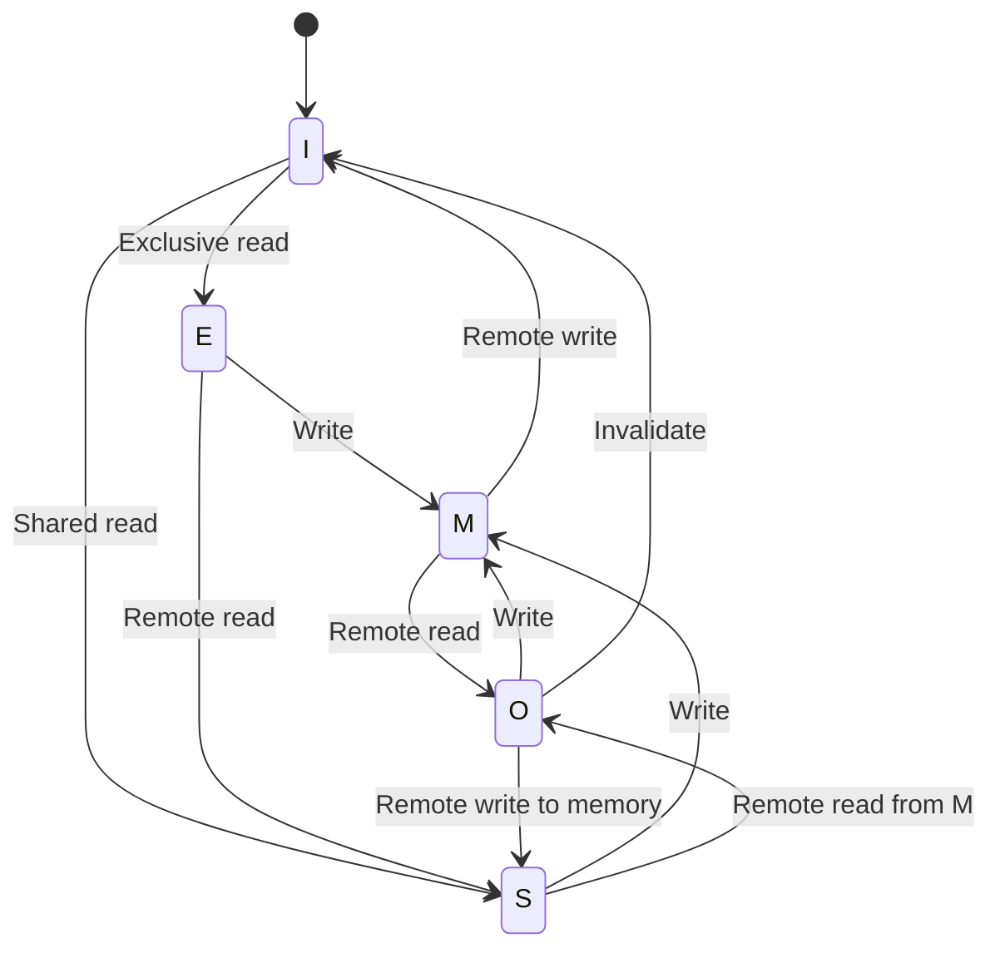

## False Sharing

**False Sharing** - müxtəlif thread-lər eyni cache line-dakı müxtəlif variable-lara yazır.

### Problem

```c
struct Counter {
    int count1;  // Thread 1 istifadə edir
    int count2;  // Thread 2 istifadə edir
} counter;  // Eyni cache line-da!
```

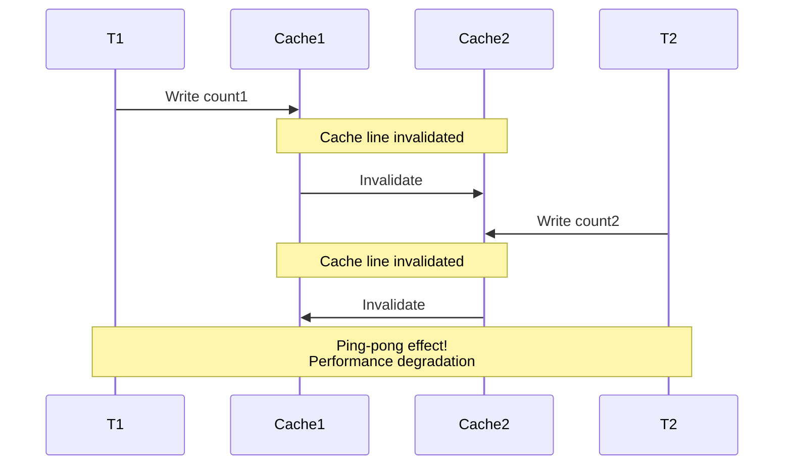

### Həll: Cache Line Padding

```c
#define CACHE_LINE_SIZE 64

struct Counter {
    int count1;
    char padding1[CACHE_LINE_SIZE - sizeof(int)];
    int count2;
    char padding2[CACHE_LINE_SIZE - sizeof(int)];
} counter;

// və ya C++17
struct alignas(CACHE_LINE_SIZE) AlignedCounter {
    int count;
};
```

### Modern Dillər

**Java:**
```java
// @Contended annotation (JDK 8+)
@sun.misc.Contended
public class PaddedCounter {
    private volatile long count;
}
```

**C++17:**
```cpp
struct alignas(std::hardware_destructive_interference_size) Counter {
    std::atomic<int> count;
};
```

## Cache Optimizasiya Texnikaları

### 1. Blocking (Tiling)

```c
// BAD: Poor cache locality
for (int i = 0; i < N; i++)
    for (int j = 0; j < N; j++)
        for (int k = 0; k < N; k++)
            C[i][j] += A[i][k] * B[k][j];

// GOOD: Cache blocking
#define BLOCK_SIZE 64
for (int i0 = 0; i0 < N; i0 += BLOCK_SIZE)
    for (int j0 = 0; j0 < N; j0 += BLOCK_SIZE)
        for (int k0 = 0; k0 < N; k0 += BLOCK_SIZE)
            for (int i = i0; i < min(i0+BLOCK_SIZE, N); i++)
                for (int j = j0; j < min(j0+BLOCK_SIZE, N); j++)
                    for (int k = k0; k < min(k0+BLOCK_SIZE, N); k++)
                        C[i][j] += A[i][k] * B[k][j];
```

### 2. Loop Fusion

```c
// BAD: İki separate loop
for (int i = 0; i < N; i++)
    a[i] = b[i] + c[i];

for (int i = 0; i < N; i++)
    d[i] = a[i] * 2;

// GOOD: Fused loop - better cache reuse
for (int i = 0; i < N; i++) {
    a[i] = b[i] + c[i];
    d[i] = a[i] * 2;
}
```

### 3. Prefetching

```c
// Software prefetching
for (int i = 0; i < N; i++) {
    __builtin_prefetch(&array[i + 8]);  // GCC
    process(array[i]);
}
```

## Cache Performance Metrics

### Average Memory Access Time (AMAT)

```
AMAT = Hit Time + (Miss Rate × Miss Penalty)
```

**Nümunə:**
- Hit Time = 1 cycle
- Miss Rate = 5%
- Miss Penalty = 100 cycles

```
AMAT = 1 + (0.05 × 100) = 6 cycles
```

### Cache Hit Rate

```
Hit Rate = (Cache Hits) / (Total Accesses)
Miss Rate = 1 - Hit Rate
```

## Hardware Prefetching

Modern CPU-lar avtomatik prefetch edirlər:

**1. Sequential Prefetcher**
- Ardıcıl access pattern aşkarlayır
- Növbəti cache line-ları fetch edir

**2. Stride Prefetcher**
- Fixed stride pattern (hər N-ci element)
- Array access-də effektiv

**3. Stream Prefetcher**
- Multiple parallel stream-lər
- Complex pattern-lər

## Praktiki Məsləhətlər

1. **Data structure layout-a fikir ver**
   - Hot data birlikdə saxla
   - Cache line-a align et

2. **Sequential access prefer et**
   - Array traverse: row-major order
   - Linked list-dən array üstünlük ver

3. **False sharing-dən qaç**
   - Thread-specific data ayrı cache line-da
   - Padding istifadə et

4. **Working set kiçik saxla**
   - Cache-ə sığan qədər data
   - Blocking/tiling texnikaları

5. **Profiling et**
   - `perf stat` - cache miss statistics
   - `valgrind --tool=cachegrind`

## Əlaqəli Mövzular

- **Memory Hierarchy:** Cache-in yaddaş sistemindəki yeri
- **Multiprocessor Systems:** Cache coherence multi-core-da
- **Performance Optimization:** Cache-friendly code
- **False Sharing:** Multi-threading cache problemi
