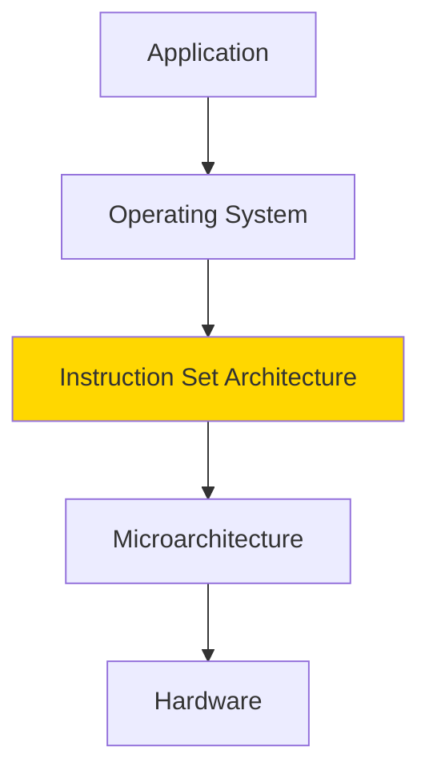
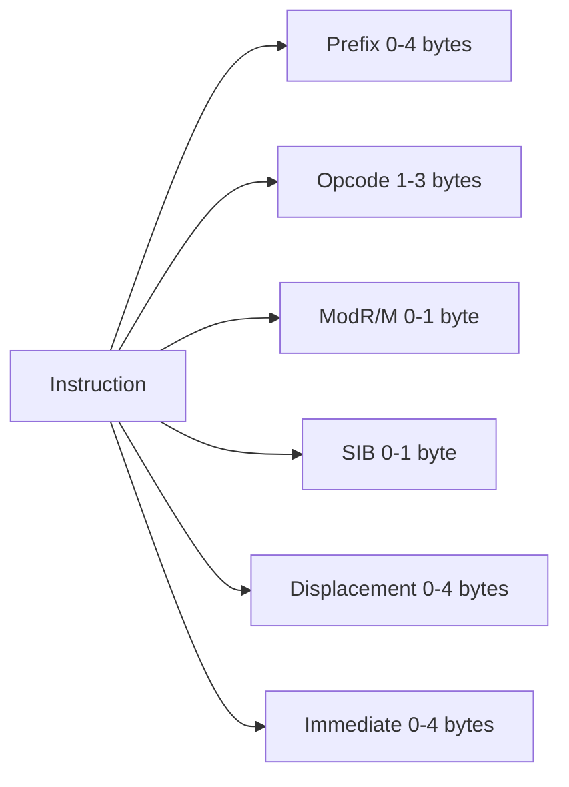
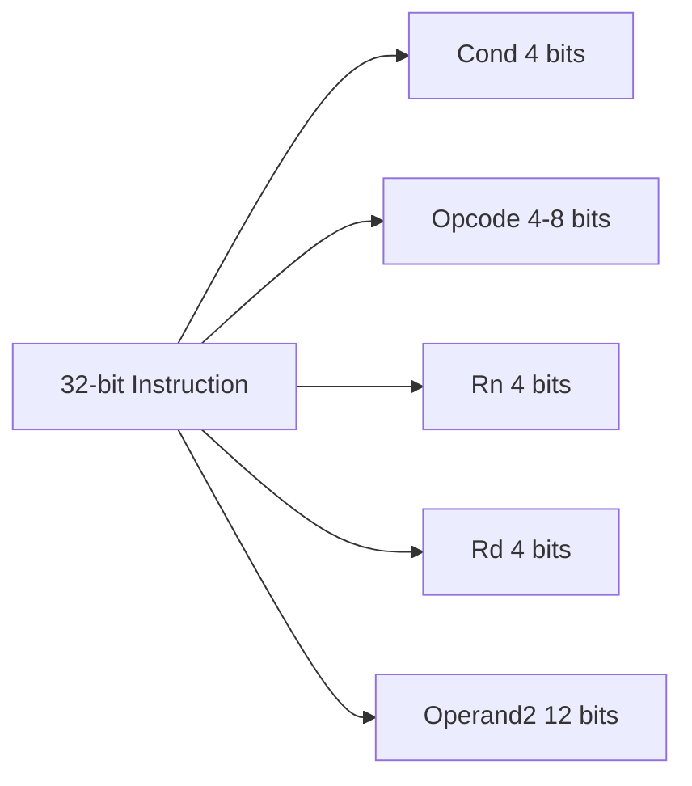
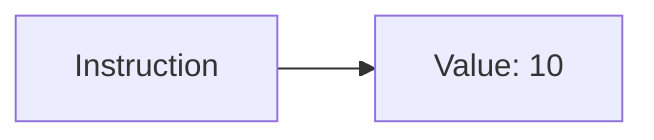
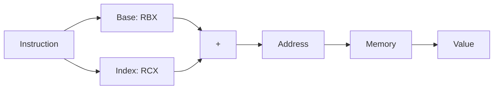
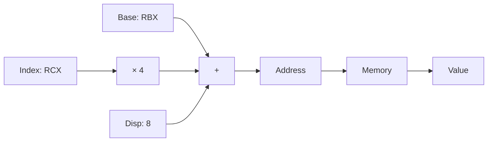
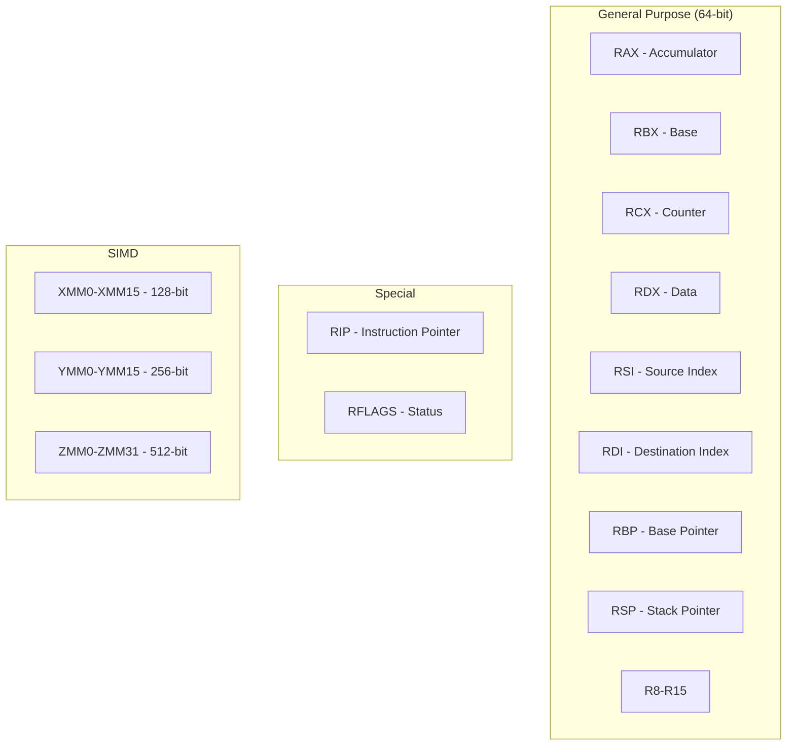
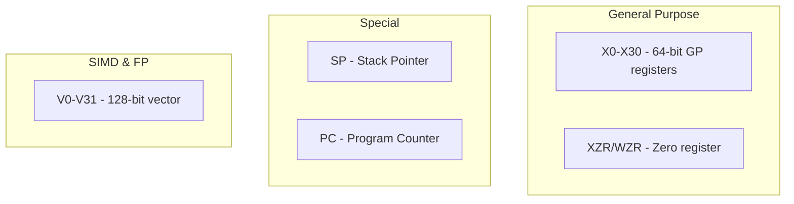
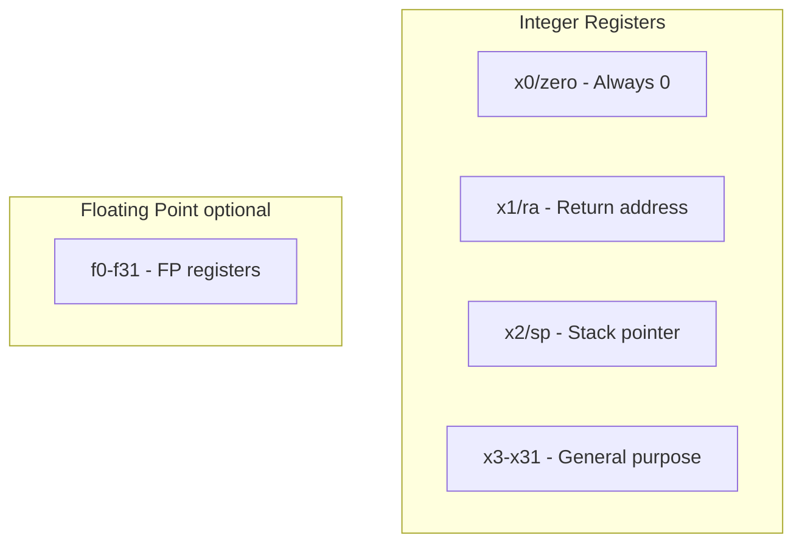
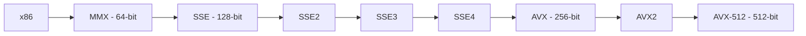

# Instruction Set Architecture (ISA)

## ISA Nədir?

**ISA (Instruction Set Architecture)** - hardware və software arasındaki interface. CPU-nun başa düşdüyü təlimatlar toplusudur.



## ISA Komponentləri

- **Instructions:** Əməliyyat kodları (opcodes)
- **Data types:** Integer, float, vector
- **Registers:** Ümumi məqsədli və xüsusi
- **Addressing modes:** Operandlara müraciət
- **Memory model:** Byte ordering, alignment
- **Exception handling:** Interrupt və exception

## Əsas ISA Növləri

### 1. x86 / x86-64

**Xüsusiyyətlər:**
- CISC arxitekturası
- Variable-length instructions (1-15 bytes)
- Complex addressing modes
- Backward compatibility (1978-dən)
- Dominant desktop/server market

**Register Set (x86-64):**
- 16 general-purpose registers (RAX, RBX, RCX, ...)
- 64-bit registers
- XMM/YMM/ZMM (SIMD)

**Nümunə:**
```asm
mov rax, 10        ; rax = 10
add rax, rbx       ; rax = rax + rbx
push rax           ; Stack-ə push
```

### 2. ARM

**Xüsusiyyətlər:**
- RISC arxitekturası
- Fixed-length instructions (32-bit və ya 16-bit Thumb)
- Load/Store architecture
- Enerji səmərəli
- Mobile və embedded sistemlər

**Register Set (ARM64/AArch64):**
- 31 general-purpose registers (X0-X30)
- 64-bit registers
- SIMD və floating-point registers

**Nümunə:**
```asm
mov x0, #10        ; x0 = 10
add x0, x0, x1     ; x0 = x0 + x1
str x0, [sp]       ; Memory-ə write
```

### 3. RISC-V

**Xüsusiyyətlər:**
- Açıq, pulsuz ISA
- Modular və extensible
- Clean, simple design
- 32-bit, 64-bit, 128-bit versiyaları
- Akademik və kommersiya istifadəsi

**Register Set:**
- 32 integer registers (x0-x31)
- x0 həmişə 0
- Optional floating-point registers

**Nümunə:**
```asm
li x5, 10          ; x5 = 10
add x5, x5, x6     ; x5 = x5 + x6
sw x5, 0(sp)       ; Memory-ə write
```

### ISA Müqayisəsi

| Xüsusiyyət | x86-64 | ARM | RISC-V |
|------------|---------|-----|--------|
| Tip | CISC | RISC | RISC |
| Instruction length | Variable | Fixed/Variable | Fixed |
| Registers (GP) | 16 | 31 | 32 |
| Open-source | ❌ | ❌ | ✅ |
| Energy efficiency | Orta | Yüksək | Yüksək |
| Market share | Desktop/Server | Mobile | Yeni |
| Komplekslik | Yüksək | Orta | Aşağı |

## Instruction Format

### x86-64 Instruction Format (Variable)



**Nümunə:**
```
add rax, rbx  →  48 01 D8 (3 bytes)
add rax, [rbx+8]  →  48 03 43 08 (4 bytes)
```

### ARM Instruction Format (Fixed 32-bit)



**Nümunə:**
```
ADD R0, R1, R2
31 28 27  25 24  20 19  16 15  12 11       0
Cond  00   ADD    R1     R0     R2
```

### RISC-V Instruction Formats

```mermaid
graph TB
    subgraph "R-type - Register"
        R[funct7 | rs2 | rs1 | funct3 | rd | opcode]
    end
    
    subgraph "I-type - Immediate"
        I[imm12 | rs1 | funct3 | rd | opcode]
    end
    
    subgraph "S-type - Store"
        S[imm7 | rs2 | rs1 | funct3 | imm5 | opcode]
    end
```

## Addressing Modes

Operandlara necə müraciət edilir?

### 1. Immediate Addressing

Operand instruction-un özündədir.

```asm
mov rax, 10        ; rax = 10
```



### 2. Register Addressing

Operand register-dədir.

```asm
mov rax, rbx       ; rax = rbx
```


### 3. Direct (Absolute) Addressing

Operand memory address-dədir.

```asm
mov rax, [0x1000]  ; rax = memory[0x1000]
```


### 4. Indirect Addressing

Register memory address-i saxlayır.

```asm
mov rax, [rbx]     ; rax = memory[rbx]
```


### 5. Indexed Addressing

Base + Index.

```asm
mov rax, [rbx + rcx]   ; rax = memory[rbx + rcx]
```



### 6. Base + Displacement

Base register + offset.

```asm
mov rax, [rbx + 8]     ; rax = memory[rbx + 8]
```

### 7. Scaled Index

Base + (Index × Scale) + Displacement.

```asm
mov rax, [rbx + rcx*4 + 8]   ; Array access
```



## Register Architecture

### x86-64 Registers



**Register Sizes:**
```
64-bit: RAX, RBX, RCX, ...
32-bit: EAX, EBX, ECX, ... (lower 32 bits)
16-bit: AX, BX, CX, ...     (lower 16 bits)
8-bit:  AL, BL, CL, ...     (lower 8 bits)
```

### ARM64 Registers



### RISC-V Registers



## Instruction Növləri

### 1. Data Movement

```asm
; x86-64
mov rax, rbx       ; Register to register
mov rax, [rbx]     ; Memory to register
mov [rax], rbx     ; Register to memory
push rax           ; Stack push
pop rbx            ; Stack pop
```

### 2. Arithmetic

```asm
; x86-64
add rax, rbx       ; Addition
sub rax, rbx       ; Subtraction
imul rax, rbx      ; Multiplication
idiv rcx           ; Division
inc rax            ; Increment
dec rax            ; Decrement
```

### 3. Logical

```asm
; x86-64
and rax, rbx       ; Bitwise AND
or rax, rbx        ; Bitwise OR
xor rax, rbx       ; Bitwise XOR
not rax            ; Bitwise NOT
shl rax, 2         ; Shift left
shr rax, 2         ; Shift right
```

### 4. Control Flow

```asm
; x86-64
jmp label          ; Unconditional jump
je label           ; Jump if equal
jne label          ; Jump if not equal
call function      ; Function call
ret                ; Return
```

### 5. Comparison

```asm
; x86-64
cmp rax, rbx       ; Compare (rax - rbx)
test rax, rax      ; Test (rax & rax)
```

## Assembly Nümunələri

### Simple Function (x86-64)

```asm
; int add(int a, int b) { return a + b; }
add:
    push rbp           ; Save base pointer
    mov rbp, rsp       ; Set up stack frame
    
    mov eax, edi       ; a (first argument)
    add eax, esi       ; a + b (second argument)
    
    pop rbp            ; Restore base pointer
    ret                ; Return
```

### Loop Example (x86-64)

```asm
; int sum_array(int* arr, int n)
sum_array:
    xor eax, eax       ; sum = 0
    xor ecx, ecx       ; i = 0
    
loop_start:
    cmp ecx, esi       ; i < n?
    jge loop_end       ; if not, exit
    
    add eax, [rdi + rcx*4]  ; sum += arr[i]
    inc ecx            ; i++
    jmp loop_start
    
loop_end:
    ret
```

### ARM64 Example

```asm
; int add(int a, int b) { return a + b; }
add:
    add w0, w0, w1     ; w0 = w0 + w1
    ret                ; Return
```

### RISC-V Example

```asm
; int add(int a, int b) { return a + b; }
add:
    add a0, a0, a1     ; a0 = a0 + a1
    ret                ; Return
```

## Calling Conventions

### x86-64 System V ABI (Linux/Unix)

**Arguments:**
1. RDI
2. RSI
3. RDX
4. RCX
5. R8
6. R9
7+ Stack

**Return:** RAX

**Caller-saved:** RAX, RCX, RDX, RSI, RDI, R8-R11
**Callee-saved:** RBX, RBP, R12-R15

### ARM64 AAPCS

**Arguments:**
1. X0/W0
2. X1/W1
3. X2/W2
4. X3/W3
5. X4/W4
6. X5/W5
7. X6/W6
8. X7/W7

**Return:** X0

## ISA Extensions

### x86 SIMD Extensions



**SIMD Example:**
```asm
; Add 4 floats in parallel
movaps xmm0, [array1]      ; Load 4 floats
movaps xmm1, [array2]      ; Load 4 floats
addps xmm0, xmm1           ; Add 4 floats in one instruction
movaps [result], xmm0      ; Store result
```

### ARM NEON

```asm
; Vector addition (ARM NEON)
vld1.32 {q0}, [r0]!        ; Load 4 × 32-bit
vld1.32 {q1}, [r1]!        ; Load 4 × 32-bit
vadd.i32 q0, q0, q1        ; Vector add
vst1.32 {q0}, [r2]!        ; Store result
```

## ISA Design Choices

### RISC vs CISC Trade-offs

**RISC Üstünlükləri:**
- Simple, regular instruction format
- Easier pipelining
- Smaller, faster hardware
- Lower power consumption

**CISC Üstünlükləri:**
- Richer instruction set
- Smaller code size
- Fewer instructions needed
- Backward compatibility

## Modern ISA Trendləri

1. **Vector Extensions:** SIMD, SVE (ARM), AVX-512
2. **Security:** ARM TrustZone, Intel SGX
3. **Virtualization:** Hardware-assisted virtualization
4. **Atomic operations:** Lock-free programming
5. **Custom extensions:** Domain-specific accelerators

## Praktiki Nümunə: High-Level to Assembly

**C Code:**
```c
int factorial(int n) {
    if (n <= 1) return 1;
    return n * factorial(n - 1);
}
```

**x86-64 Assembly:**
```asm
factorial:
    cmp edi, 1         ; n <= 1?
    jg .recurse        ; if not, recurse
    mov eax, 1         ; return 1
    ret
    
.recurse:
    push rdi           ; Save n
    dec edi            ; n - 1
    call factorial     ; factorial(n-1)
    pop rdi            ; Restore n
    imul eax, edi      ; n * factorial(n-1)
    ret
```

## Əlaqəli Mövzular

- **CPU Architecture:** ISA-nın hardware-də implementasiyası
- **Compiler Design:** High-level code-dan ISA-ya tərcümə
- **Performance:** ISA seçiminin performansa təsiri
- **Cross-platform Development:** Müxtəlif ISA-lar üçün kod yazma
