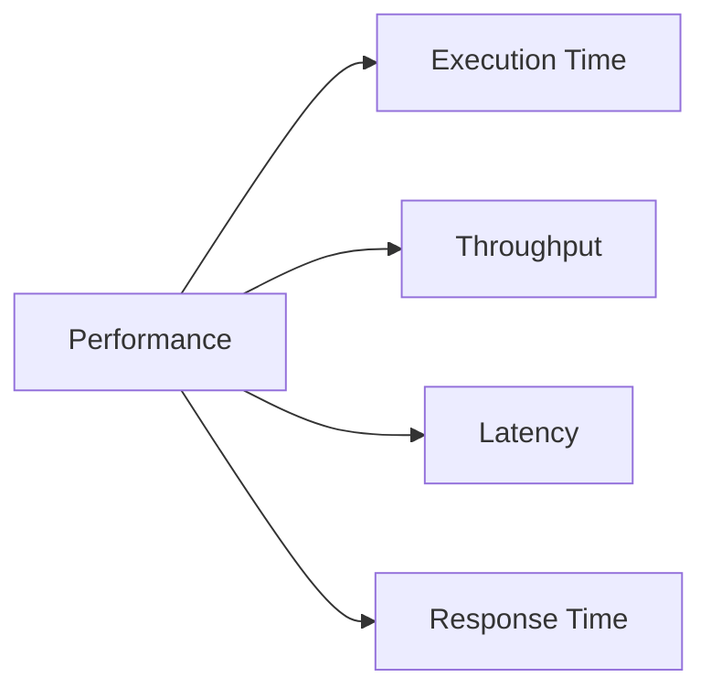
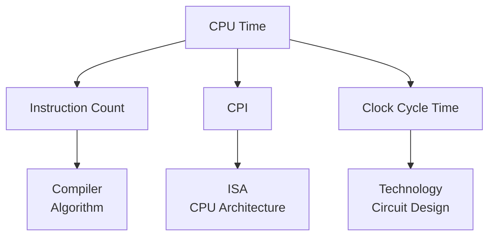
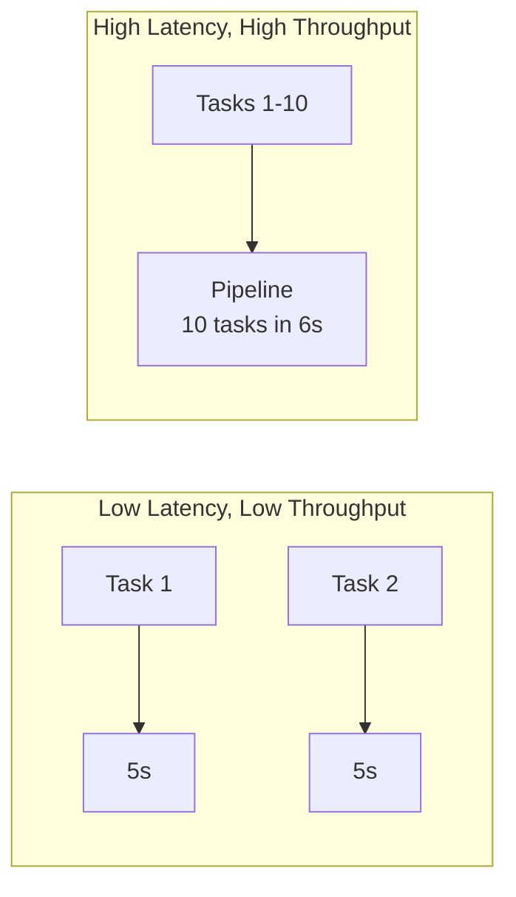
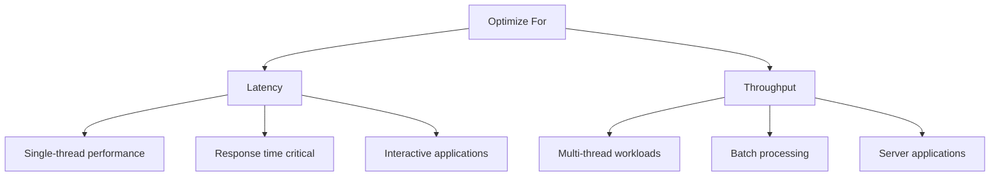
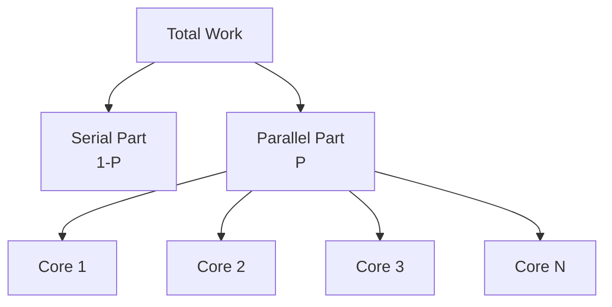
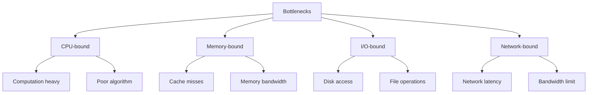
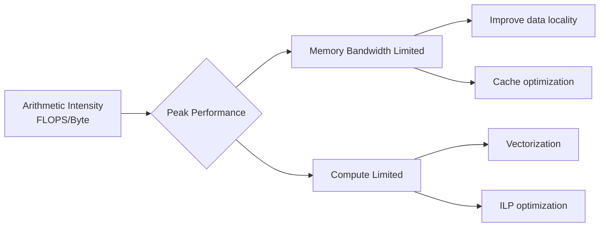
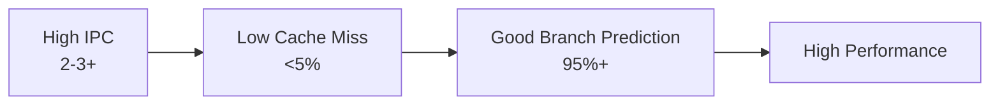
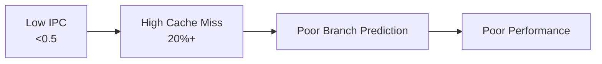

# CPU Performansı

## Performans Nədir?

**Performans** - sistemin işi nə qədər sürətli və effektiv yerinə yetirməsinin ölçüsüdür.



## Əsas Performans Metrikləri

### 1. Execution Time

Bir proqramın icra vaxtı.

```
Performance = 1 / Execution Time
```

**Faster is better:**
- Execution time aşağı → Performance yüksək
- Execution time yüksək → Performance aşağı

### 2. Clock Cycle və Frequency

**Clock Cycle:** CPU-nun əsas vaxt vahidi

```
Clock Frequency = 1 / Clock Cycle Time
```

**Nümunə:**
- Clock Cycle Time = 0.25 ns
- Frequency = 1 / 0.25 ns = 4 GHz

```mermaid
gantt
    title Clock Cycles
    dateFormat X
    axisFormat %s
    
    section Clock
    Cycle 1 :0, 1
    Cycle 2 :1, 2
    Cycle 3 :2, 3
    Cycle 4 :3, 4
    Cycle 5 :4, 5
```



### 3. CPI (Cycles Per Instruction)

Bir təlimatın orta olaraq neçə cycle-da icra olunması.

```
CPI = CPU Cycles / Instruction Count
```

**Nümunə:**
- Total Cycles: 1,000,000
- Instructions: 500,000
- CPI = 1,000,000 / 500,000 = 2.0

### 4. IPC (Instructions Per Cycle)

Bir cycle-da neçə təlimat icra olunur.

```
IPC = Instruction Count / CPU Cycles
IPC = 1 / CPI
```

**Nümunə:**
- CPI = 2.0
- IPC = 1 / 2.0 = 0.5

### Performans Müqayisəsi

| CPU | Frequency | CPI | IPC | Performans |
|-----|-----------|-----|-----|------------|
| A | 3.0 GHz | 2.0 | 0.5 | Orta |
| B | 4.0 GHz | 3.0 | 0.33 | Orta |
| C | 3.5 GHz | 1.0 | 1.0 | Yüksək |

**Nəticə:** Frequency tək başına kifayət deyil, CPI/IPC də vacibdir!

## CPU Time Formula

```
CPU Time = Instruction Count × CPI × Clock Cycle Time

və ya

CPU Time = (Instruction Count × CPI) / Clock Frequency
```



### Performans Optimizasiyası

**3 yolla CPU Time azaldıla bilər:**

1. **Instruction Count azalt**
   - Effektiv alqoritmlər
   - Compiler optimizasiyası

2. **CPI azalt**
   - Pipeline efficiency
   - Superscalar execution
   - Branch prediction

3. **Clock Cycle Time azalt**
   - Daha sürətli transistorlar
   - Better circuit design
   - Process technology (7nm, 5nm, 3nm)

## Throughput vs Latency

### Latency (Gecikmə)

Bir əməliyyatın başdan-sona vaxtı.

**Nümunə:**
- Memory access latency: 100 ns
- Disk read latency: 10 ms

### Throughput (Buraxılış)

Vahid zamanda neçə əməliyyat.

**Nümunə:**
- Network throughput: 1 Gbps
- CPU throughput: 4 instructions/cycle



### Trade-off



**Praktik Nümunə:**

Pipeline sistemi:
- **Latency:** Bir təlimat 5 cycle (daha yüksək)
- **Throughput:** Hər cycle-da 1 təlimat (daha yüksək)

## Amdahl's Law

**Sistemin bir hissəsini yaxşılaşdırmaq bütün sistemə necə təsir edir?**

```
Speedup = 1 / ((1 - P) + P/S)
```

Burada:
- **P** = Parallelləşdirilə bilən hissə (0-1 arası)
- **S** = Həmin hissənin speedup-u
- **(1 - P)** = Serial hissə



### Nümunə 1: 50% Parallelizable

```
P = 0.5 (50% parallelizable)
S = 4 (4x speedup on parallel part)

Speedup = 1 / ((1 - 0.5) + 0.5/4)
        = 1 / (0.5 + 0.125)
        = 1 / 0.625
        = 1.6x
```

### Nümunə 2: 90% Parallelizable

```
P = 0.9 (90% parallelizable)
S = infinite cores

Max Speedup = 1 / (1 - 0.9) = 10x
```

**Əhəmiyyət:** Serial hissə performans limitini müəyyənləşdirir!

```mermaid
line
    title Amdahl's Law: Speedup vs Core Count
    x-axis Cores [1, 2, 4, 8, 16, 32]
    y-axis Speedup [0, 10, 20]
    "50% Parallel": [1, 1.3, 1.6, 1.9, 2.0, 2.0]
    "75% Parallel": [1, 1.6, 2.3, 2.9, 3.4, 3.8]
    "90% Parallel": [1, 1.8, 3.1, 4.7, 6.4, 8.2]
    "95% Parallel": [1, 1.9, 3.5, 5.9, 9.1, 13.3]
```

## Benchmark Metrikləri

### 1. SPEC CPU

Standard Performance Evaluation Corporation benchmarks.

**SPEC CPU2017:**
- **SPECint:** Integer performans
- **SPECfp:** Floating-point performans

### 2. MIPS (Million Instructions Per Second)

```
MIPS = Instruction Count / (Execution Time × 10^6)
     = Clock Frequency / (CPI × 10^6)
```

**Problem:** ISA-dan asılıdır, müqayisə çətindir.

### 3. MFLOPS (Million Floating-Point Operations Per Second)

```
MFLOPS = FP Operations / (Execution Time × 10^6)
```

**GFLOPS** = Billion FLOPS
**TFLOPS** = Trillion FLOPS

### 4. GeekBench

Real-world application testləri:
- Single-core performance
- Multi-core performance
- Compute (GPU) performance

## Performans Bottleneck-ləri



### CPU-Bound

```c
// CPU-intensive: Mathematical computation
for (int i = 0; i < 1000000; i++) {
    result += sqrt(i) * sin(i) * cos(i);
}
```

### Memory-Bound

```c
// Memory-intensive: Random access
for (int i = 0; i < N; i++) {
    int index = random();
    sum += large_array[index];  // Cache miss
}
```

### I/O-Bound

```c
// I/O-intensive: File operations
for (int i = 0; i < 1000; i++) {
    FILE* f = fopen("file.txt", "r");
    fread(buffer, size, 1, f);
    fclose(f);
}
```

## Roofline Model

Performansın həqiqi limitlərini göstərir.



**Formula:**
```
Performance = min(Peak Compute, Bandwidth × Arithmetic Intensity)
```

## Performans Profiling

### Linux `perf` Tool

```bash
# Event sayını ölç
perf stat ./program

# Hotspots tap
perf record ./program
perf report

# Cache statistics
perf stat -e cache-references,cache-misses ./program
```

**Nümunə Output:**
```
Performance counter stats:
  1,234,567,890  cycles
    456,789,012  instructions    # 0.37 IPC
     12,345,678  cache-misses    # 5.2% of all cache refs
```

### Intel VTune

- Microarchitecture analysis
- Hotspot identification
- Memory access patterns
- Threading analysis

### AMD μProf

- CPU profiling
- Cache analysis
- Power profiling

## Performans Optimizasiya Texnikaları

### 1. Instruction-Level Parallelism

```c
// BAD: Dependencies
int sum = 0;
for (int i = 0; i < N; i++) {
    sum += array[i];  // Dependency chain
}

// GOOD: Multiple accumulators
int sum1 = 0, sum2 = 0, sum3 = 0, sum4 = 0;
for (int i = 0; i < N; i += 4) {
    sum1 += array[i];
    sum2 += array[i+1];
    sum3 += array[i+2];
    sum4 += array[i+3];
}
int sum = sum1 + sum2 + sum3 + sum4;
```

### 2. Loop Unrolling

```c
// Original
for (int i = 0; i < N; i++) {
    a[i] = b[i] + c[i];
}

// Unrolled
for (int i = 0; i < N; i += 4) {
    a[i]   = b[i]   + c[i];
    a[i+1] = b[i+1] + c[i+1];
    a[i+2] = b[i+2] + c[i+2];
    a[i+3] = b[i+3] + c[i+3];
}
```

### 3. Branch Elimination

```c
// BAD: Unpredictable branch
for (int i = 0; i < N; i++) {
    if (array[i] > threshold) {
        result++;
    }
}

// GOOD: Branchless
for (int i = 0; i < N; i++) {
    result += (array[i] > threshold);  // Boolean to int
}
```

### 4. SIMD Vectorization

```c
// Scalar: 1 operation per cycle
for (int i = 0; i < N; i++) {
    c[i] = a[i] + b[i];
}

// SIMD: 4-8 operations per cycle (AVX)
__m256 va, vb, vc;
for (int i = 0; i < N; i += 8) {
    va = _mm256_load_ps(&a[i]);
    vb = _mm256_load_ps(&b[i]);
    vc = _mm256_add_ps(va, vb);
    _mm256_store_ps(&c[i], vc);
}
```

## Performans Patterns

### Good Performance Pattern



### Poor Performance Pattern



## Real-World Performance Comparison

### Modern CPU Performance (2024)

| CPU | Cores | Frequency | IPC | Single-Thread | Multi-Thread |
|-----|-------|-----------|-----|---------------|--------------|
| Intel Core i9-14900K | 24 | 6.0 GHz | ~2.0 | Çox yüksək | Çox yüksək |
| AMD Ryzen 9 7950X | 16 | 5.7 GHz | ~2.2 | Çox yüksək | Yüksək |
| Apple M3 Max | 16 | 4.0 GHz | ~2.5 | Yüksək | Yüksək |
| ARM Cortex-A78 | 8 | 3.0 GHz | ~1.8 | Orta | Orta |

## Performans Ölçmə Best Practices

1. **Multiple runs:** Variance-ı azalt
2. **Warm-up:** Cache və branch predictor warm-up
3. **Isolated environment:** Background process-ləri bağla
4. **Representative workload:** Real-world scenarios
5. **Profile first, optimize later:** Bottleneck-ləri tap

### Micro-benchmark Template

```c
#include <time.h>

double measure_performance(void (*func)()) {
    clock_t start = clock();
    
    // Warm-up
    func();
    
    // Actual measurement
    start = clock();
    for (int i = 0; i < 1000; i++) {
        func();
    }
    clock_t end = clock();
    
    return (double)(end - start) / CLOCKS_PER_SEC;
}
```

## Əlaqəli Mövzular

- **CPU Architecture:** IPC və performansın hardware əsasları
- **Pipelining:** Throughput artırma
- **Branch Prediction:** Control hazard-ların minimizasiyası
- **Cache Memory:** Memory access performansı
- **Parallelism:** Multi-core performans
