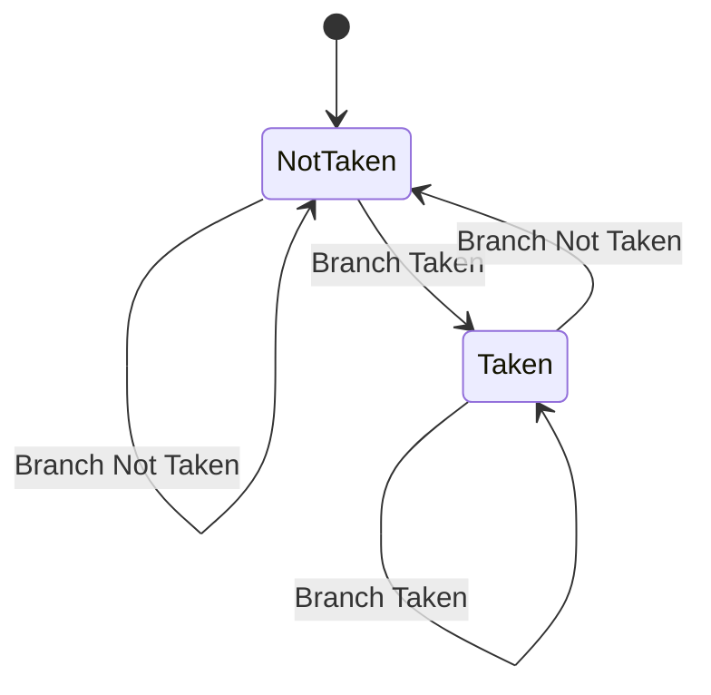
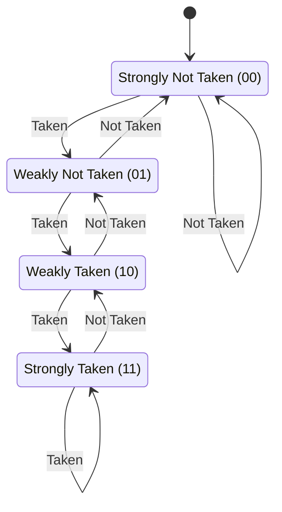
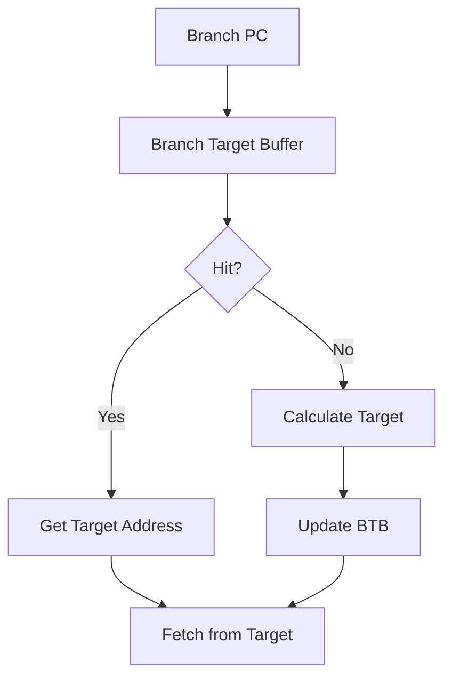
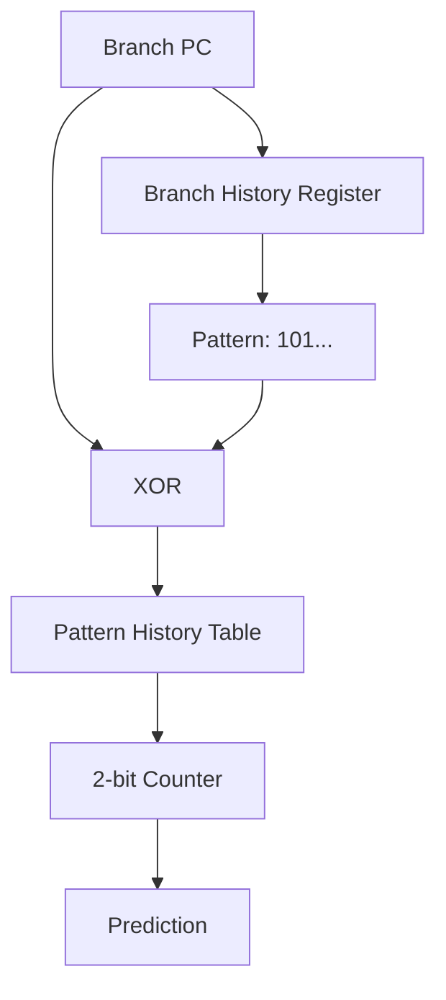
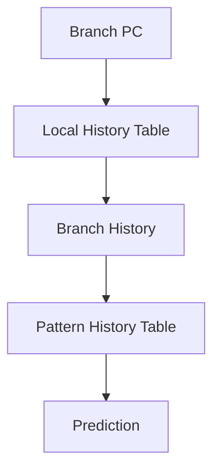
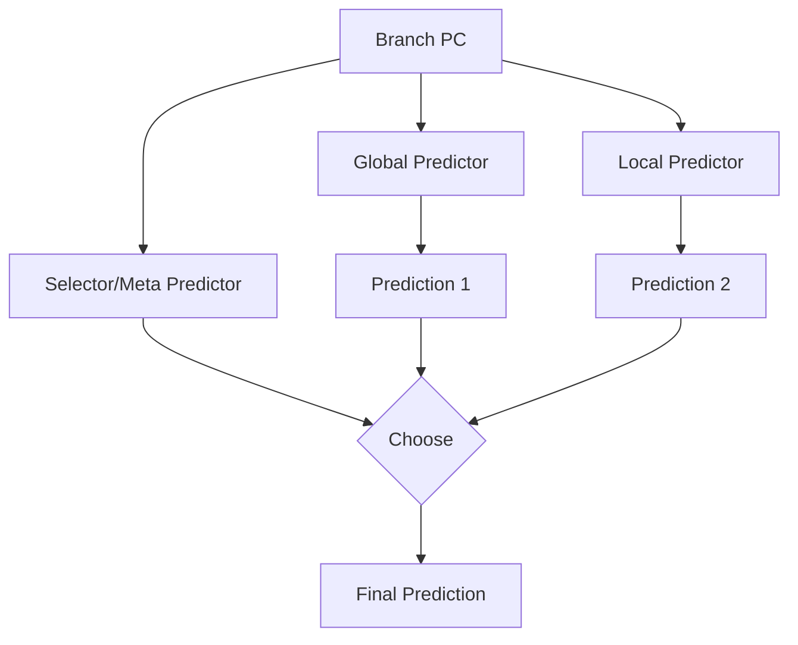
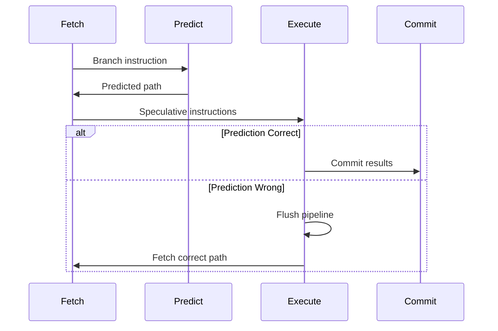
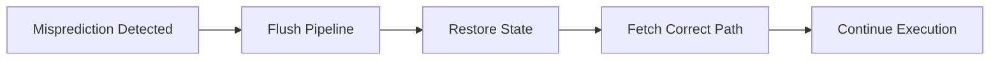
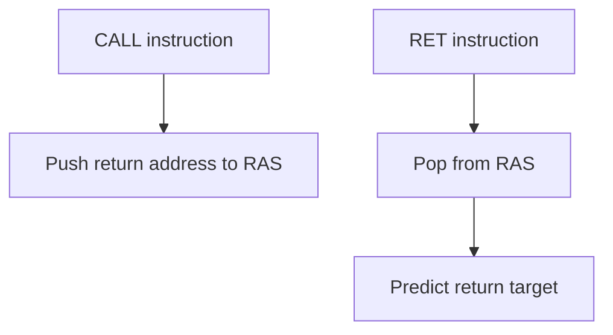

# Branch Prediction

## Branch Prediction Nədir?

**Branch Prediction** - CPU-nun branch təlimatının hansı yolla gedəcəyini əvvəlcədən proqnozlaşdırmasıdır. Pipeline-da control hazard-ları minimizə etmək üçün istifadə olunur.

## Problem: Control Hazards

```c
if (x > 0) {
    // Path A
    y = x + 5;
} else {
    // Path B
    y = x - 5;
}
```

CPU-ya **branch qərarı verilənədək** gözləmək lazımdır, bu da pipeline-ı dayanmağa məcbur edir.

```mermaid
gantt
    title Pipeline Without Branch Prediction
    dateFormat X
    axisFormat %s
    
    section Branch Instruction
    Fetch   :0, 1
    Decode  :1, 2
    Execute :2, 3
    
    section Next (if taken)
    Stall   :3, 4
    Stall   :4, 5
    Fetch   :5, 6
```



### Branch Misprediction Penalty

Modern CPU-da 15-20 cycle itki!

```
Cost = Pipeline Depth × Misprediction Rate
```

**Nümunə:**
- Pipeline depth: 20 stages
- Misprediction rate: 5%
- Branch hər 5 təlimatdan bir

```
Penalty = 20 × 0.05 × (1/5) = 0.2 cycles per instruction
IPC reduction: ~20%
```

## Branch Növləri

### 1. Conditional Branches

```c
if (condition) { ... }
while (condition) { ... }
for (...) { ... }
```

```asm
cmp rax, 0
je label          ; Jump if equal
jne label         ; Jump if not equal
jg label          ; Jump if greater
```

### 2. Unconditional Branches

```c
goto label;
break;
continue;
```

```asm
jmp label         ; Always jump
```

### 3. Function Calls/Returns

```c
function();
return value;
```

```asm
call function     ; Call function
ret               ; Return
```

## Static Branch Prediction

Compiler və ya hardware tərəfindən sabit qərar.

### 1. Predict Not Taken

Hər zaman **branch alınmaz** fərz edilir.


**Üstünlük:** Sadə implementasiya
**Çatışmazlıq:** Loop-lar üçün pis (çox taken)

### 2. Predict Taken

Hər zaman **branch alınır** fərz edilir.

**Üstünlük:** Loop-lar üçün yaxşı
**Çatışmazlıq:** Sequential kod üçün pis

### 3. Backward Taken, Forward Not Taken (BTFNT)

```c
// Backward branch (loop) - predict taken
for (int i = 0; i < 100; i++) {
    // Loop body
}  // Branch back - usually taken

// Forward branch - predict not taken
if (unlikely_condition) {
    // Rare case
}
// Continue - usually not taken
```

**Accuracy:** ~60-70%

## Dynamic Branch Prediction

Runtime-da branch behavior-a əsasən proqnoz.

### 1-Bit Predictor

Ən sadə dynamic predictor.



**Problem:** Loop-da 2 dəfə səhv edir!

```c
// Loop iterations: TTTTTTTTN (7 taken, 1 not taken)
for (int i = 0; i < 8; i++) {
    // Body
}
```

**Mispredictions:**
- Son iterasiyada: T → N (səhv)
- Növbəti loop-da ilk dəfə: N → T (səhv)

### 2-Bit Saturating Counter

Daha stabil - iki dəfə səhv olmalıdır ki, dəyişsin.



**States:**
- **00:** Strongly Not Taken - predict not taken
- **01:** Weakly Not Taken - predict not taken
- **10:** Weakly Taken - predict taken
- **11:** Strongly Taken - predict taken

**Loop nümunəsi:**
```
Iterations: TTTTTTTTN
Predictor:  11→11→11→11→11→11→11→10→01 (yalnız 1 səhv!)
```

### Pattern History Table (PHT)

Branch address-ə görə predictor.


**Ölçü:** 4K-64K entries (tipik)

**Əks tərəfi:** Aliasing - müxtəlif branch-lər eyni entry-ə map ola bilər

## Branch Target Buffer (BTB)

Branch-in **target address-ini** cache edir.



**BTB Entry:**
- Branch PC
- Target Address
- Branch Type
- Prediction bits

### BTB Structure

| Branch PC | Target Address | Prediction | Valid |
|-----------|----------------|------------|-------|
| 0x1000 | 0x2000 | Taken | 1 |
| 0x1100 | 0x1200 | Not Taken | 1 |
| 0x1500 | 0x3000 | Taken | 1 |

## Two-Level Adaptive Predictor

Branch **history pattern** istifadə edir.



### Global History

Bütün branch-lərin ümumi tarixi.

**Branch History Register (BHR):**
```
Last 8 branches: 10110101
```

**Correlation nümunəsi:**
```c
if (a > 0) {      // Branch 1
    x = 1;
}
if (a > 0) {      // Branch 2 - same as Branch 1!
    y = 1;
}
```

Branch 2-nin davranışı Branch 1-dən asılıdır!

### Local History

Hər branch-in öz tarixi.



**Üstünlük:** Müxtəlif branch-lərin tarixi qarışmır

## Tournament Predictor

Bir neçə predictor-dan **ən yaxşısını** seçir.



**Selector:** Hansı predictor daha yaxşı işləyir?

**Intel Core və AMD Ryzen istifadə edir.**

## Speculative Execution

Branch proqnozuna əsasən **əvvəlcədən** təlimatları icra edir.



### Speculative Execution States

**1. Fetch:** Predicted path-dən təlimatlar gətir
**2. Execute:** Speculatively icra et
**3. Verify:** Həqiqi branch qərarını yoxla
**4. Commit/Flush:** Düzgündürsə commit, yoxsa flush

### Misprediction Recovery



**Cost:** 15-20 cycles modern CPU-da

## Return Address Stack (RAS)

Function **return** address-lərini predict edir.



**Stack structure:**
```
Top  → 0x2000  (most recent call)
       0x1500
       0x1000
Bottom → 0x500   (oldest call)
```

**Accuracy:** ~95-99% (çox yüksək)

## Branch Prediction Accuracy

### Modern CPU Performance

| Predictor | Accuracy | Hardware Cost |
|-----------|----------|---------------|
| Static (BTFNT) | 60-70% | Çox aşağı |
| 1-bit | 70-80% | Aşağı |
| 2-bit | 85-90% | Aşağı |
| Two-level | 92-95% | Orta |
| Tournament | 95-98% | Yüksək |
| Neural | 97-99% | Çox yüksək |

## Kod Optimizasiyası

### 1. Predictable Branches

```c
// BAD: Unpredictable (random)
if (rand() % 2 == 0) {
    // 50% chance
}

// GOOD: Predictable (loop)
for (int i = 0; i < N; i++) {
    // Taken N-1 times, not taken once
}
```

### 2. Likely/Unlikely Hints

```c
// GCC/Clang
if (__builtin_expect(rare_condition, 0)) {
    // Unlikely path
}

// C++20
if (unlikely(rare_condition)) {
    // Unlikely path
}
```

### 3. Branchless Code

```c
// BAD: Branch
int max(int a, int b) {
    if (a > b) return a;
    else return b;
}

// GOOD: Branchless (using conditional move)
int max(int a, int b) {
    return a > b ? a : b;  // Compiler uses CMOV
}

// GOOD: Branchless (arithmetic)
int abs(int x) {
    int mask = x >> 31;       // -1 if negative, 0 if positive
    return (x + mask) ^ mask;
}
```

### 4. Loop Unswitching

```c
// BAD: Branch inside loop
for (int i = 0; i < N; i++) {
    if (flag) {
        a[i] = b[i] + c[i];
    } else {
        a[i] = b[i] - c[i];
    }
}

// GOOD: Move branch outside
if (flag) {
    for (int i = 0; i < N; i++) {
        a[i] = b[i] + c[i];
    }
} else {
    for (int i = 0; i < N; i++) {
        a[i] = b[i] - c[i];
    }
}
```

### 5. Data-Driven Instead of Control-Driven

```c
// BAD: Multiple branches
if (type == TYPE_A) process_a();
else if (type == TYPE_B) process_b();
else if (type == TYPE_C) process_c();

// GOOD: Function pointer table
void (*handlers[])(void) = {process_a, process_b, process_c};
handlers[type]();
```

## Profiling Branch Behavior

### Linux `perf`

```bash
# Branch statistics
perf stat -e branches,branch-misses ./program

# Branch prediction rate
perf stat -e cpu/event=0xc4,umask=0x00/ ./program
```

**Output nümunəsi:**
```
1,234,567,890  branches
   61,234,567  branch-misses  # 4.96% of all branches
```

### Intel VTune

- Branch misprediction analysis
- Hot branch identification
- Speculation impact

## Real-World Impact

### Performance Loss from Mispredictions

```
Program A: 95% prediction accuracy
- 5% misprediction × 20 cycle penalty = 1 cycle average loss per branch
- Branches every 5 instructions
- IPC loss: ~20%

Program B: 99% prediction accuracy  
- 1% misprediction × 20 cycle penalty = 0.2 cycle average loss
- IPC loss: ~4%
```

## Modern Branch Predictors

### Intel

- **Pentium:** 2-bit bimodal
- **Pentium Pro:** Two-level
- **Core:** Tournament
- **Skylake+:** Neural-inspired (TAGE)

### AMD

- **K8:** Hybrid bimodal/two-level
- **Zen:** Perceptron-based
- **Zen 3+:** Advanced neural predictor

### ARM

- **Cortex-A:** Two-level adaptive
- **Cortex-X:** Tournament + indirect predictor

## Branch Prediction və Security

### Spectre Attack

Speculative execution istifadə edərək **gizli məlumat** oxumaq.

```c
// Victim code
if (index < array_size) {
    value = array[index];  // Speculative load
    temp = array2[value * 256];  // Side channel
}
```

**Mitigations:**
- Speculation barriers
- Bounds check masking
- Microcode updates

## Best Practices

1. **Predictable patterns prefer et**
   - Loop-lar yaxşı predict olunur
   - Random behavior pis

2. **Branch-free kod yaz (mümkünsə)**
   - Conditional moves
   - Arithmetic tricks

3. **Profiling et**
   - Hansı branch-lər problematik?
   - Optimization targets

4. **Likely/unlikely annotations**
   - Compiler-ə kömək et
   - Rare case-lər işarələ

5. **Code layout optimize et**
   - Hot path sequential
   - Cold path ayrı

## Əlaqəli Mövzular

- **Pipelining:** Branch prediction pipeline efficiency üçün
- **Speculative Execution:** Branch prediction əsasında
- **CPU Performance:** Misprediction impact
- **Security:** Spectre və Meltdown
