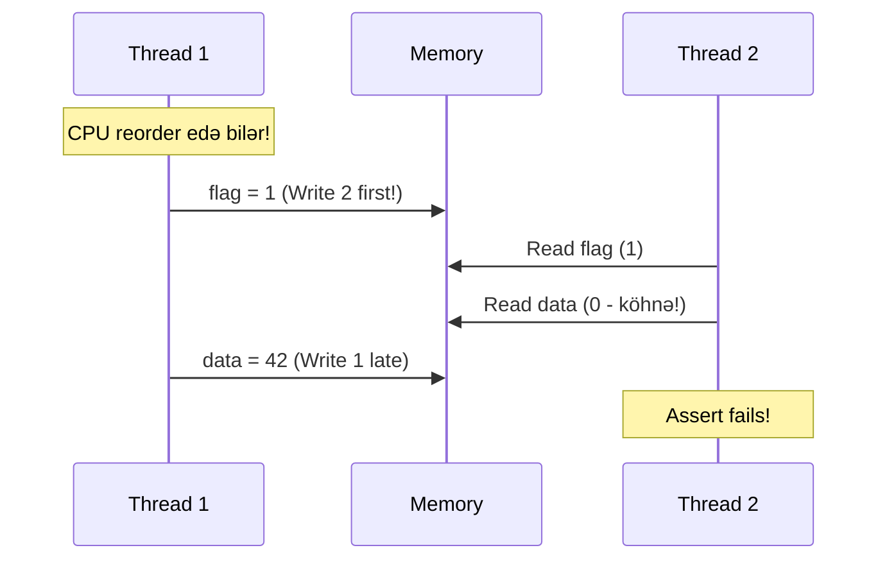
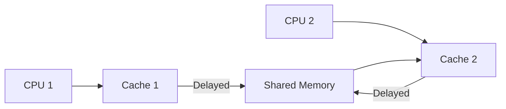
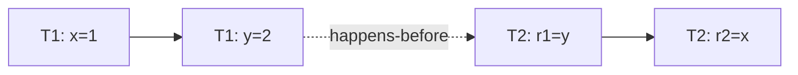
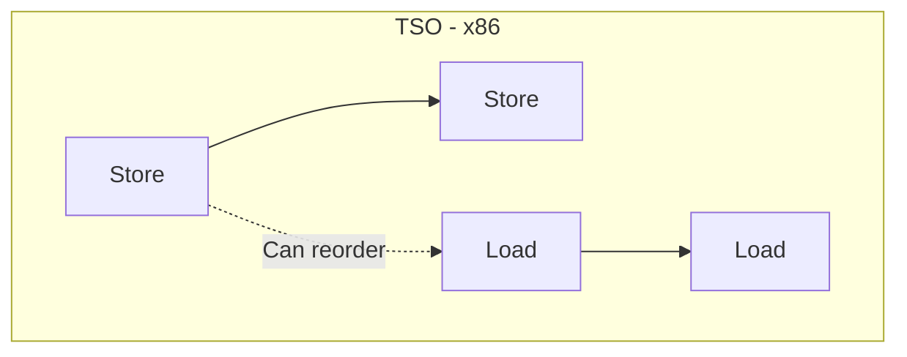
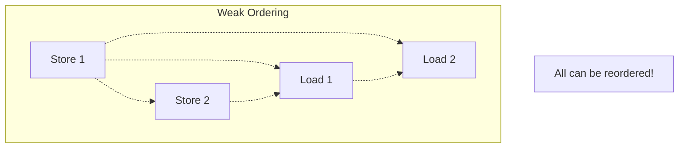
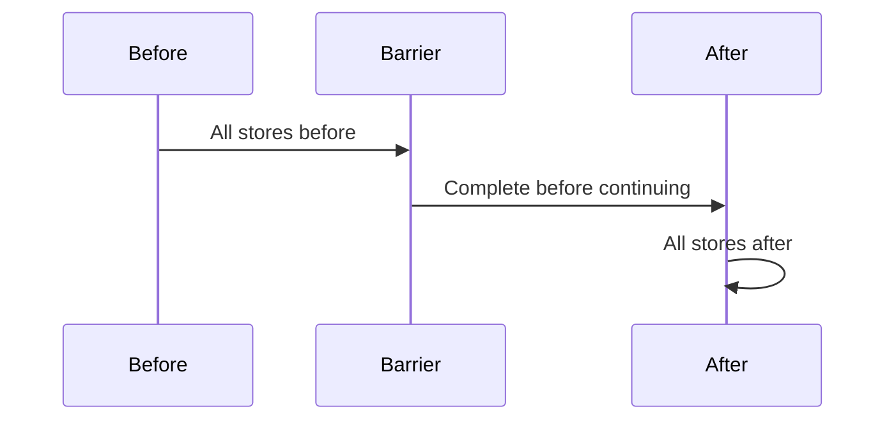
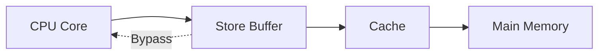
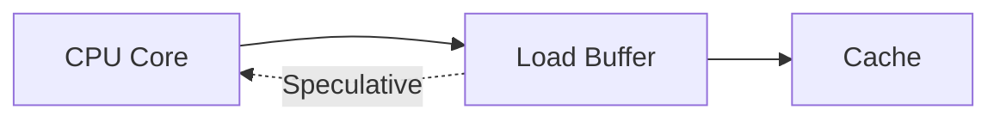
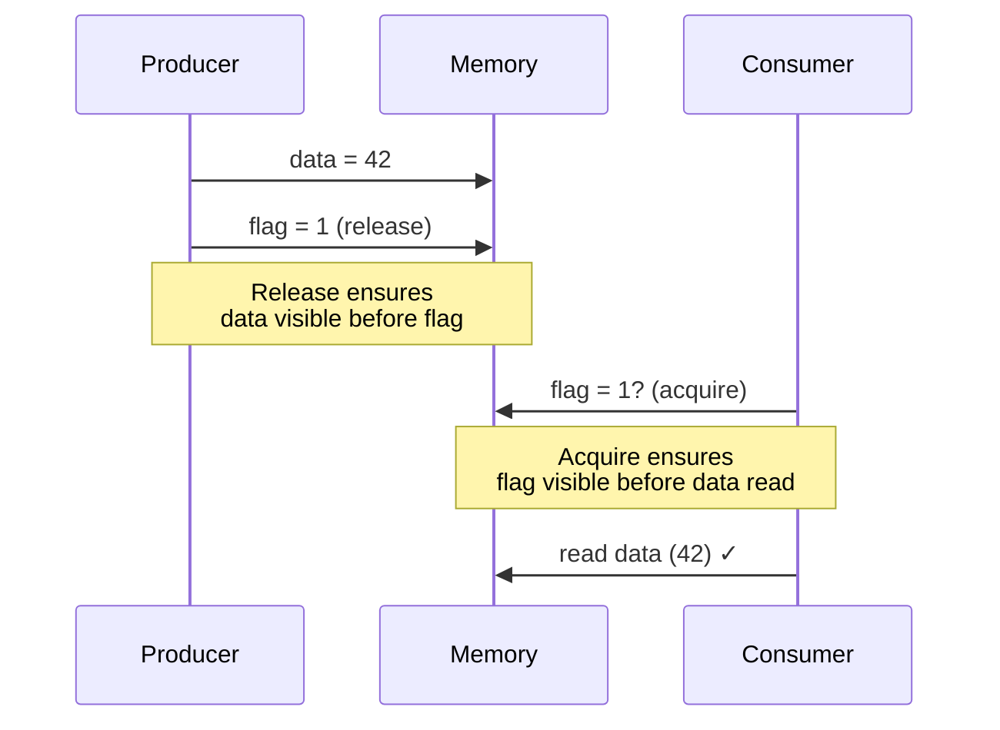
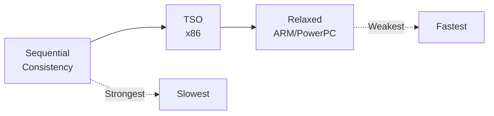

# Memory Ordering və Consistency

## Memory Ordering Nədir?

**Memory Ordering** - müxtəlif thread-lərin memory əməliyyatlarının hansı sıra ilə görünməsini müəyyənləşdirir.

## Problem: Reordering

Modern CPU-lar və compiler-lər performans üçün təlimatları **yenidən sıralaya** bilər.

```c
// Source code
int data = 0;
int flag = 0;

// Thread 1
data = 42;        // Write 1
flag = 1;         // Write 2

// Thread 2
if (flag == 1) {  // Read 2
    assert(data == 42);  // Read 1 - Təmin edərmi?
}
```



## Memory Reordering Növləri

### 1. Compiler Reordering

Compiler optimization zamanı.

```c
// Original
x = 1;
y = 2;

// Compiler reorder edə bilər
y = 2;
x = 1;
```

### 2. CPU Reordering

Hardware səviyyəsində.

**Store Buffer:**
- CPU write-ı buffer-ə yazır
- Sonra memory-ə flush edir
- Digər CPU-lar gecikmə ilə görür

**Load/Store Reordering:**
- Load-lar store-dan qabaq icra oluna bilər
- Independent store-lar reorder oluna bilər

### 3. Cache Coherence Delays

Multi-core sistemdə cache sync gecikirdi.



## Memory Consistency Models

### Sequential Consistency (SC)

**Ən güclü model** - bütün əməliyyatlar proqram sırasında görünür.



**Qaydalar:**
1. Hər thread-in əməliyyatları proqram sırasında
2. Global total order var
3. Load dərhal ən son write-ı görür

**Çatışmazlıq:** Yavaşdır (az optimization)

### Total Store Ordering (TSO)

**x86/x86-64 modeli**

**İcazə verilir:**
- Store → Load reordering
- Load → Load reordering (eyni address-dən başqa)
- Load → Store reordering

**İcazə verilmir:**
- Store → Store reordering (eyni address-ə)
- Load → Load reordering (eyni address-ə)



### Weak Ordering / Relaxed Consistency

**ARM, PowerPC, RISC-V**

**Demək olar ki, hər şey reorder ola bilər!**



**Üstünlük:** Maksimum performans
**Çatışmazlıq:** Programmer-ə çətin, explicit barrier lazımdır

## Memory Barriers (Fences)

Memory barrier - CPU-ya təlimatları reorder etməməsini bildirir.

### Barrier Növləri

#### 1. Full Memory Barrier (mfence)

Bütün memory əməliyyatlarını sinxronlaşdırır.

```c
// x86
store(x, 1);
mfence();        // Full barrier
store(y, 1);
```



#### 2. Store Barrier (sfence)

Yalnız store əməliyyatları.

```c
// x86
store(x, 1);
store(y, 2);
sfence();        // Store barrier
store(z, 3);
```

**Təmin edir:** x və y, z-dən əvvəl görünür.

#### 3. Load Barrier (lfence)

Yalnız load əməliyyatları.

```c
// x86
load(a);
load(b);
lfence();        // Load barrier
load(c);
```

#### 4. Acquire Barrier

Load-dan sonrakı əməliyyatları bloklar.

```c
// Load with acquire
int value = atomic_load_acquire(&flag);
// Sonrakı loads/stores reorder olmaz
```

```mermaid
graph LR
    Load[Load Acquire] --> Barrier[|||]
    Barrier --> After[Later Operations]
    
    Note[Cannot move after<br/>operations before barrier]
```

#### 5. Release Barrier

Store-dan əvvəlki əməliyyatları bloklar.

```c
// Store with release
atomic_store_release(&flag, 1);
```

```mermaid
graph LR
    Before[Earlier Operations] --> Barrier[|||]
    Barrier --> Store[Store Release]
    
    Note[Cannot move before<br/>operations after barrier]
```

## Store Buffer və Load Buffer

### Store Buffer

CPU store-ları buffer-ə yazır, sonra memory-ə flush edir.



**Store Forwarding:** CPU öz store buffer-indən oxuya bilir.

**Nümunə:**
```c
// Thread 1
x = 1;           // Store buffer-ə gedir
r1 = x;          // Store forwarding - 1 oxuyur
```

### Load Buffer

Speculative load-lar üçün.



## C/C++ Memory Order

C11 və C++11 atomic operations.

### memory_order_relaxed

Heç bir sinxronizasiya yoxdur.

```cpp
atomic<int> x(0);
x.store(1, memory_order_relaxed);  // Reorder oluna bilər
```

### memory_order_acquire / memory_order_release

Acquire-release semantics.

```cpp
// Producer (Thread 1)
data = 42;
flag.store(1, memory_order_release);  // Release barrier

// Consumer (Thread 2)
if (flag.load(memory_order_acquire) == 1) {  // Acquire barrier
    assert(data == 42);  // OK!
}
```



### memory_order_seq_cst

Sequential consistency (default).

```cpp
atomic<int> x(0);
x.store(1);  // memory_order_seq_cst (default)
```

**Ən güclü, amma ən yavaş.**

### memory_order_consume

Deprecated, acquire kimi.

### memory_order_acq_rel

Load-acquire və store-release.

```cpp
x.fetch_add(1, memory_order_acq_rel);
```

## Architecture-Specific Barriers

### x86/x86-64

```asm
mfence    ; Full memory barrier
sfence    ; Store fence
lfence    ; Load fence
lock      ; Prefix for atomic operations
```

**x86 TSO model-i strong-dur, az barrier lazımdır.**

### ARM

```asm
dmb    ; Data Memory Barrier
dsb    ; Data Synchronization Barrier
isb    ; Instruction Synchronization Barrier

; Variants
dmb sy    ; Full system barrier
dmb ish   ; Inner shareable
dmb st    ; Store only
```

### ARM64

```asm
; Load-acquire / Store-release instructions
ldar x0, [x1]      ; Load-acquire
stlr x0, [x1]      ; Store-release
```

### RISC-V

```asm
fence       ; Memory fence
fence.i     ; Instruction fence

; Fine-grained
fence w,r   ; Write → Read fence
fence r,w   ; Read → Write fence
```

## Volatile Keyword

### C/C++ volatile

```cpp
volatile int flag = 0;

// Compiler reordering qarşısını almır
// Hardware reordering qarşısını almır
// Yalnız optimization qarşısını alır
```

**Nə edir:**
- Compiler cache-də saxlamır
- Hər dəfə memory-dən oxuyur
- Optimization qarşısını alır

**Nə etmir:**
- Memory ordering təmin etmir
- Atomicity təmin etmir
- Multi-threading üçün kifayət deyil

### Java volatile

Java-da daha güclüdür!

```java
volatile int flag = 0;

// Acquire-release semantics
// Happens-before relationship
// Visibility guarantee
```

**Java volatile = C++ atomic with seq_cst**

## Praktik Nümunələr

### Double-Checked Locking (Broken without barriers)

```cpp
// BROKEN!
Singleton* Singleton::getInstance() {
    if (instance == nullptr) {         // Read 1
        lock();
        if (instance == nullptr) {     // Read 2
            instance = new Singleton(); // Write
        }
        unlock();
    }
    return instance;
}
```

**Problem:** `new` üç addım:
1. Memory allocate
2. Constructor call
3. Pointer assign

CPU reorder edə bilər: 1 → 3 → 2

**Həll:**
```cpp
// C++11
std::atomic<Singleton*> instance;

Singleton* Singleton::getInstance() {
    Singleton* tmp = instance.load(memory_order_acquire);
    if (tmp == nullptr) {
        lock();
        tmp = instance.load(memory_order_relaxed);
        if (tmp == nullptr) {
            tmp = new Singleton();
            instance.store(tmp, memory_order_release);
        }
        unlock();
    }
    return tmp;
}
```

### Dekker's Algorithm (Mutual Exclusion)

```c
// Shared
int flag[2] = {0, 0};
int turn = 0;

// Thread 0
void thread0() {
    flag[0] = 1;                    // I want to enter
    while (flag[1]) {               // Other wants to enter?
        if (turn != 0) {
            flag[0] = 0;            // Back off
            while (turn != 0);      // Wait
            flag[0] = 1;            // Try again
        }
    }
    // Critical section
    turn = 1;                       // Give turn
    flag[0] = 0;                    // Exit
}
```

**Weak model-də barrier lazımdır!**

### Peterson's Algorithm

```c
// Shared
atomic<int> flag[2];
atomic<int> turn;

// Thread 0
flag[0].store(1, memory_order_release);
turn.store(1, memory_order_release);
while (flag[1].load(memory_order_acquire) && 
       turn.load(memory_order_acquire) == 1);
// Critical section
flag[0].store(0, memory_order_release);
```

## Performance Impact

### Barrier Cost

| Architecture | Full Fence Cost |
|--------------|-----------------|
| x86-64 | ~20-30 cycles |
| ARM | ~40-50 cycles |
| PowerPC | ~50-100 cycles |

### Model Comparison



## Best Practices

### 1. Use High-Level Primitives

```cpp
// GOOD: Use standard library
std::mutex m;
std::atomic<int> counter;

// BAD: Manual barriers (unless necessary)
__sync_synchronize();
```

### 2. Minimize Synchronization

```cpp
// BAD: Excessive sync
for (int i = 0; i < N; i++) {
    atomic_increment(&counter);  // Barrier per iteration!
}

// GOOD: Local accumulation
int local = 0;
for (int i = 0; i < N; i++) {
    local++;
}
atomic_add(&counter, local);  // One barrier
```

### 3. Acquire-Release Pattern

```cpp
// Producer
data.store(value, memory_order_relaxed);
ready.store(true, memory_order_release);

// Consumer
while (!ready.load(memory_order_acquire));
auto value = data.load(memory_order_relaxed);
```

### 4. Document Assumptions

```cpp
// This code assumes x86 TSO model!
// On ARM, explicit barriers needed!
store(x, 1);
store(y, 1);  // Visible in order on x86
```

## Debugging Memory Ordering

### Tools

**ThreadSanitizer (TSan):**
```bash
g++ -fsanitize=thread -g program.cpp
./a.out
```

**Relacy Race Detector:**
- Systematic testing
- Simulates all possible reorderings

**Spin / Promela:**
- Model checking
- Exhaustive state exploration

### Common Bugs

1. **Missing barriers**
2. **Wrong memory order**
3. **Assuming sequential consistency**
4. **Forgetting volatile ≠ atomic**

## Əlaqəli Mövzular

- **Multiprocessor Systems:** Cache coherence və memory ordering
- **Synchronization:** Lock-free data structures
- **Cache Memory:** Cache coherence protocols
- **Performance:** Barrier overhead
