# Parallelizm Növləri

## Parallelizm Nədir?

**Parallelizm** - bir neçə əməliyyatın eyni vaxtda icra olunmasıdır. Performansı artırmaq üçün əsas üsuldur.

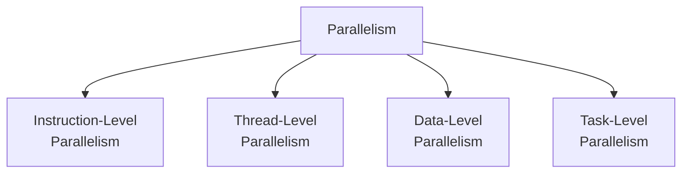

## Flynn's Taxonomy

Parallel sistemlərin klassifikasiyası.

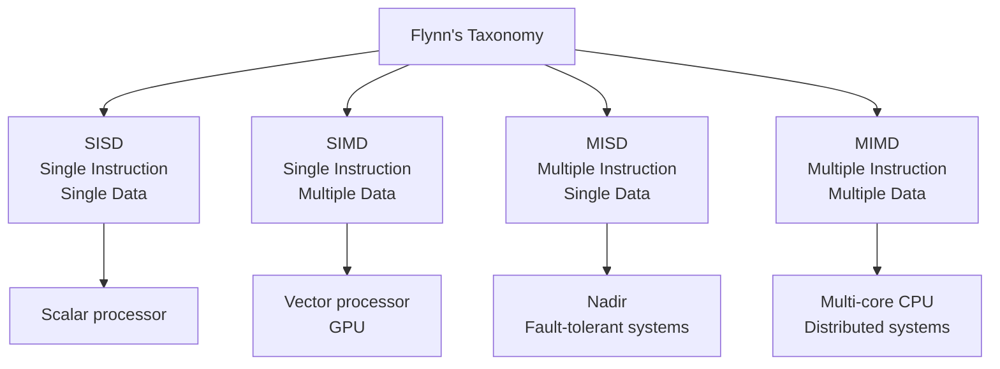

## 1. Instruction-Level Parallelism (ILP)

Bir thread daxilində təlimatların paralel icrasıdır.

### Pipeline Parallelism

```mermaid
gantt
    title 5-Stage Pipeline
    dateFormat X
    axisFormat %s
    
    section Inst 1
    Fetch   :0, 1
    Decode  :1, 2
    Execute :2, 3
    Memory  :3, 4
    Write   :4, 5
    
    section Inst 2
    Fetch   :1, 2
    Decode  :2, 3
    Execute :3, 4
    Memory  :4, 5
    Write   :5, 6
    
    section Inst 3
    Fetch   :2, 3
    Decode  :3, 4
    Execute :4, 5
    Memory  :5, 6
    Write   :6, 7
```

**Ideal IPC:** 1 təlimat / cycle

### Superscalar Execution

Bir cycle-da **bir neçə** təlimat icra edir.

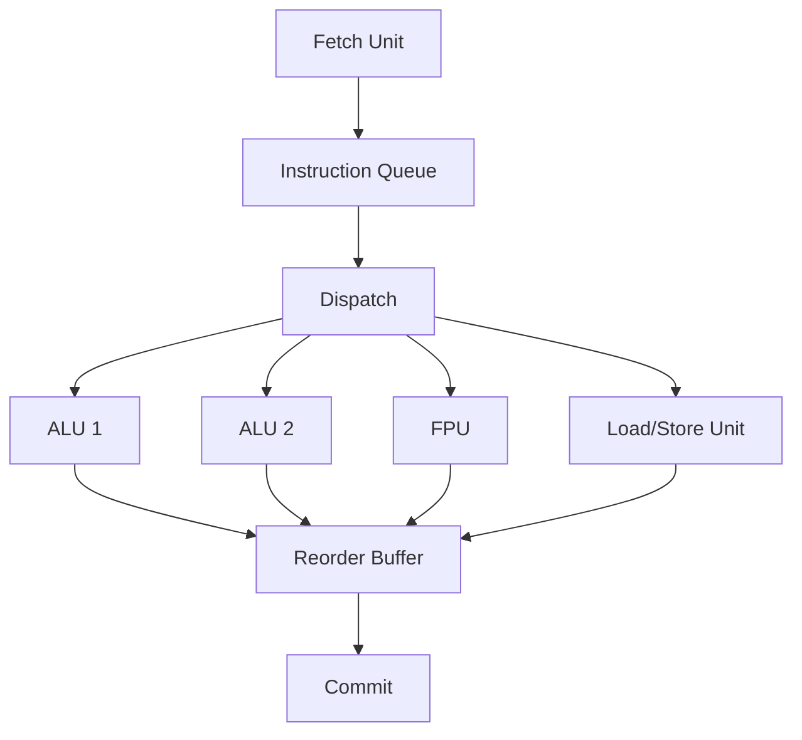

**Modern CPU:** 4-8 təlimat / cycle

### Out-of-Order Execution

Təlimatlar **hazır olduqca** icra olunur, proqram sırasında deyil.

```c
// Program order
a = b + c;     // Inst 1 (b cache miss!)
d = e + f;     // Inst 2 (independent)
g = a + d;     // Inst 3 (depends on 1 & 2)
```

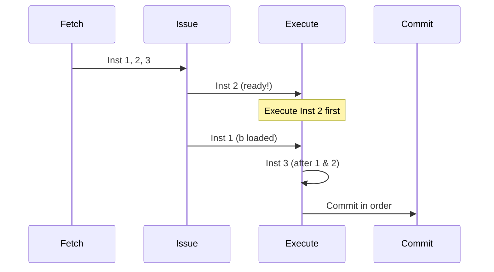

**Üstünlük:** Cache miss və ya dependency zamanı stall azalır

### ILP Limitləri

**Amdahl's Law:** Dependencies ILP-ni limitləyir

```c
// Low ILP - tight dependency
int sum = 0;
for (int i = 0; i < N; i++) {
    sum += array[i];  // Dependency chain
}

// Higher ILP - independent operations
int sum1 = 0, sum2 = 0, sum3 = 0, sum4 = 0;
for (int i = 0; i < N; i += 4) {
    sum1 += array[i];
    sum2 += array[i+1];
    sum3 += array[i+2];
    sum4 += array[i+3];
}
```

**Tipik ILP:** 2-4 (real workloads)

## 2. Thread-Level Parallelism (TLP)

Bir neçə **thread**-in paralel icrasıdır.

### Temporal Multithreading

Thread-lər arasında **context switch**.

```mermaid
gantt
    title Temporal Multithreading
    dateFormat X
    axisFormat %s
    
    section Thread 1
    Run     :0, 2
    Blocked :2, 4
    Run     :4, 6
    
    section Thread 2
    Idle    :0, 2
    Run     :2, 4
    Idle    :4, 6
```

**Coarse-grained:** Cache miss zamanı switch
**Fine-grained:** Hər cycle switch

### Simultaneous Multithreading (SMT)

Bir neçə thread eyni vaxtda **eyni core-da**.

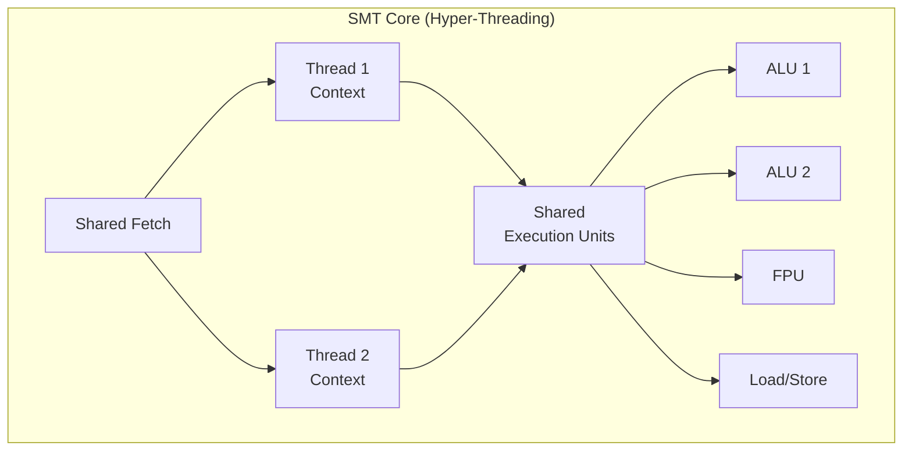

**Intel Hyper-Threading:** 2 thread / core
**IBM POWER:** 4-8 thread / core

**Nümunə:**
```
Single-threaded: 40% utilization
2-thread SMT:    70% utilization (1.75x faster)
```

### Multi-Core

Fiziki olaraq ayrı core-lar.

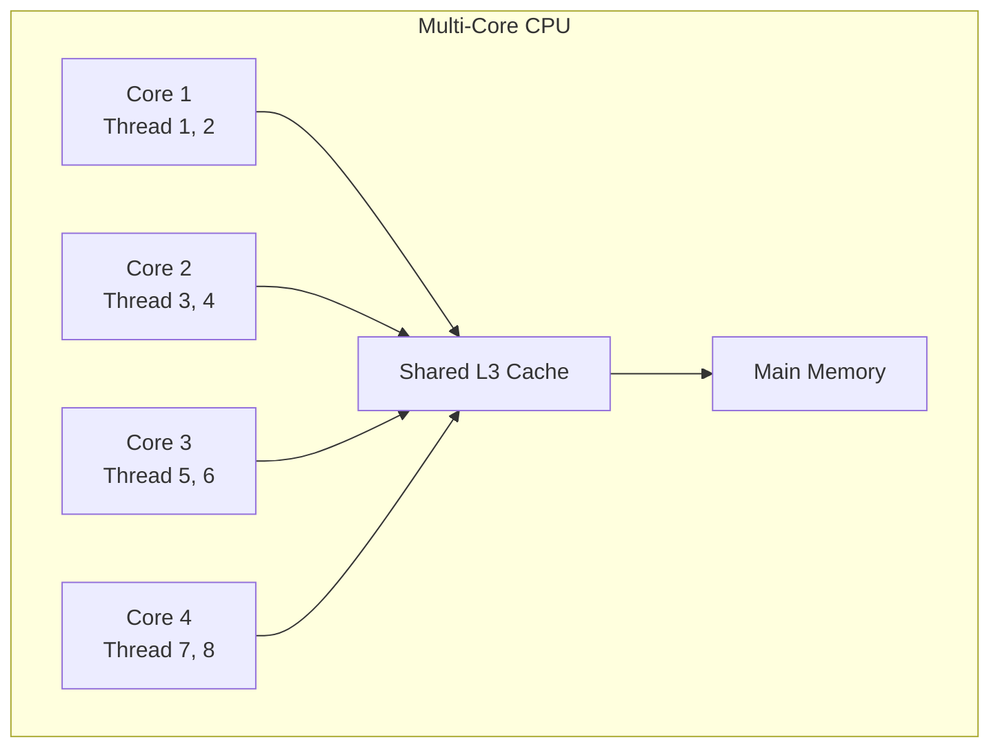

**Üstünlük:** Həqiqi parallelizm
**Çatışmazlıq:** Əlavə chip sahəsi, power

### TLP Scaling

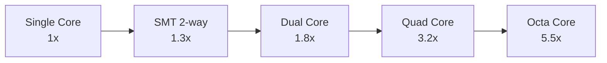

**Perfect scaling yoxdur:**
- Synchronization overhead
- Memory bandwidth limit
- Cache contention
- Amdahl's Law

## 3. Data-Level Parallelism (DLP)

Eyni əməliyyat **müxtəlif data**ya tətbiq olunur.

### SIMD (Single Instruction Multiple Data)

Bir təlimat bir neçə data element-ə.

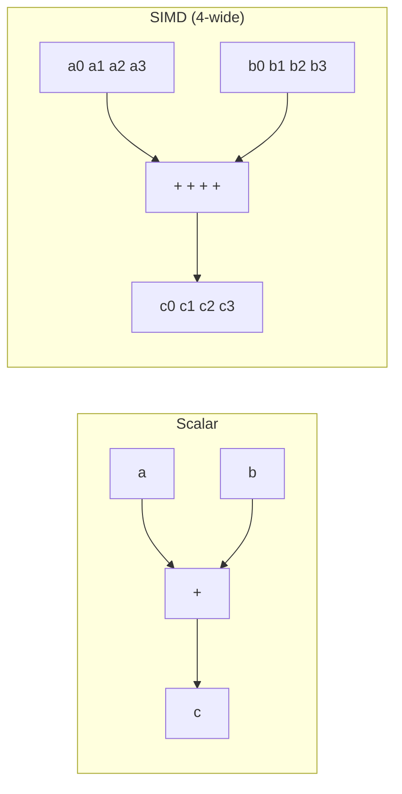

### Vector Processing

**x86 SIMD Extensions:**
```c
// Scalar: 1 operation
float c = a + b;

// SSE: 4 floats
__m128 va = _mm_load_ps(a);    // Load 4 floats
__m128 vb = _mm_load_ps(b);
__m128 vc = _mm_add_ps(va, vb); // Add 4 floats
_mm_store_ps(c, vc);

// AVX: 8 floats
__m256 va = _mm256_load_ps(a);
__m256 vb = _mm256_load_ps(b);
__m256 vc = _mm256_add_ps(va, vb);
_mm256_store_ps(c, vc);

// AVX-512: 16 floats (one instruction!)
```

### SIMD Width Evolution

| Extension | Width | Elements (float) | Year |
|-----------|-------|------------------|------|
| MMX | 64-bit | 2 | 1997 |
| SSE | 128-bit | 4 | 1999 |
| AVX | 256-bit | 8 | 2011 |
| AVX-512 | 512-bit | 16 | 2016 |

### ARM NEON

```c
// ARM NEON intrinsics
float32x4_t va = vld1q_f32(a);    // Load 4 floats
float32x4_t vb = vld1q_f32(b);
float32x4_t vc = vaddq_f32(va, vb); // Add
vst1q_f32(c, vc);                   // Store
```

### Auto-Vectorization

Compiler avtomatik SIMD istifadə edir.

```c
// Simple loop
for (int i = 0; i < N; i++) {
    c[i] = a[i] + b[i];
}

// Compiler generates (with -O3 -march=native):
// vectorized loop using AVX
```

**Alignment vacibdir:**
```c
// Aligned allocation
float* a = (float*)aligned_alloc(32, N * sizeof(float));
```

### GPU Processing (SIMT)

**SIMT:** Single Instruction Multiple Thread

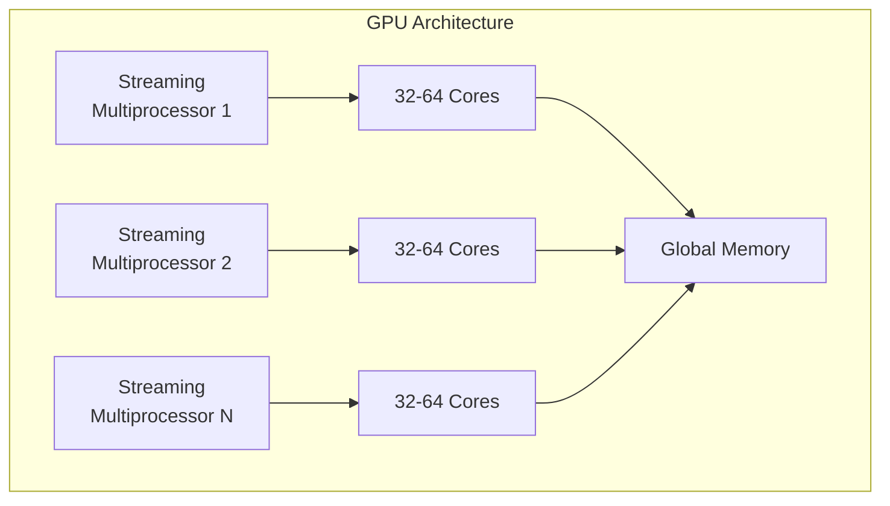

**CUDA / OpenCL Example:**
```c
__global__ void vectorAdd(float* a, float* b, float* c, int n) {
    int i = blockIdx.x * blockDim.x + threadIdx.x;
    if (i < n) {
        c[i] = a[i] + b[i];  // Thousands of threads!
    }
}
```

## 4. Task-Level Parallelism

Müxtəlif **task-lar** paralel icra olunur.

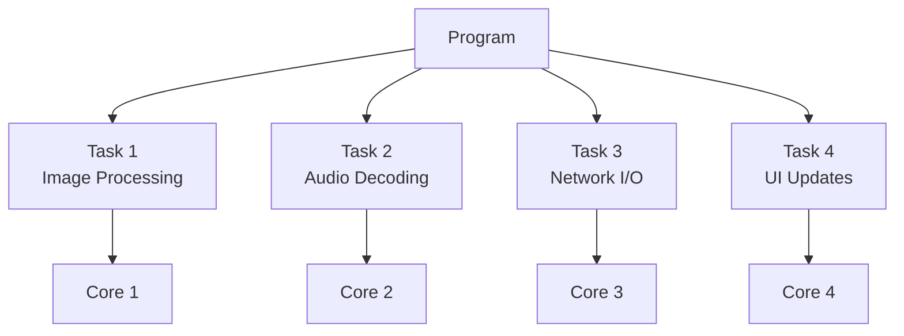

### Fork-Join Pattern

```c
#pragma omp parallel for
for (int i = 0; i < N; i++) {
    process(array[i]);
}
```

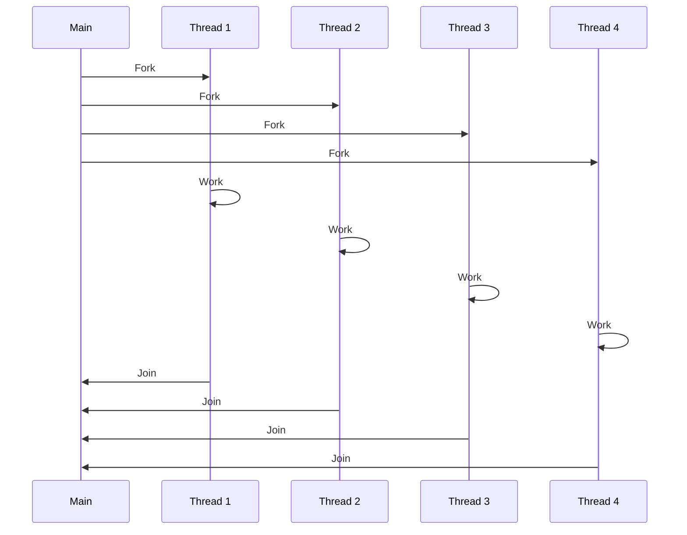

### Pipeline Pattern

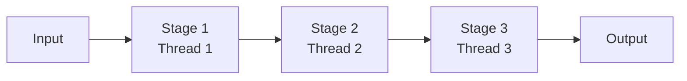

**Nümunə:** Video encoding
- Stage 1: Read frame
- Stage 2: Encode
- Stage 3: Write output

## Hyper-Threading Details

**Intel Hyper-Threading (SMT)**

### Replicated Resources

Her thread üçün ayrı:
- Program Counter
- Registers
- Flags

### Shared Resources

Thread-lər paylaşır:
- Execution units (ALU, FPU)
- Caches (L1, L2)
- TLB

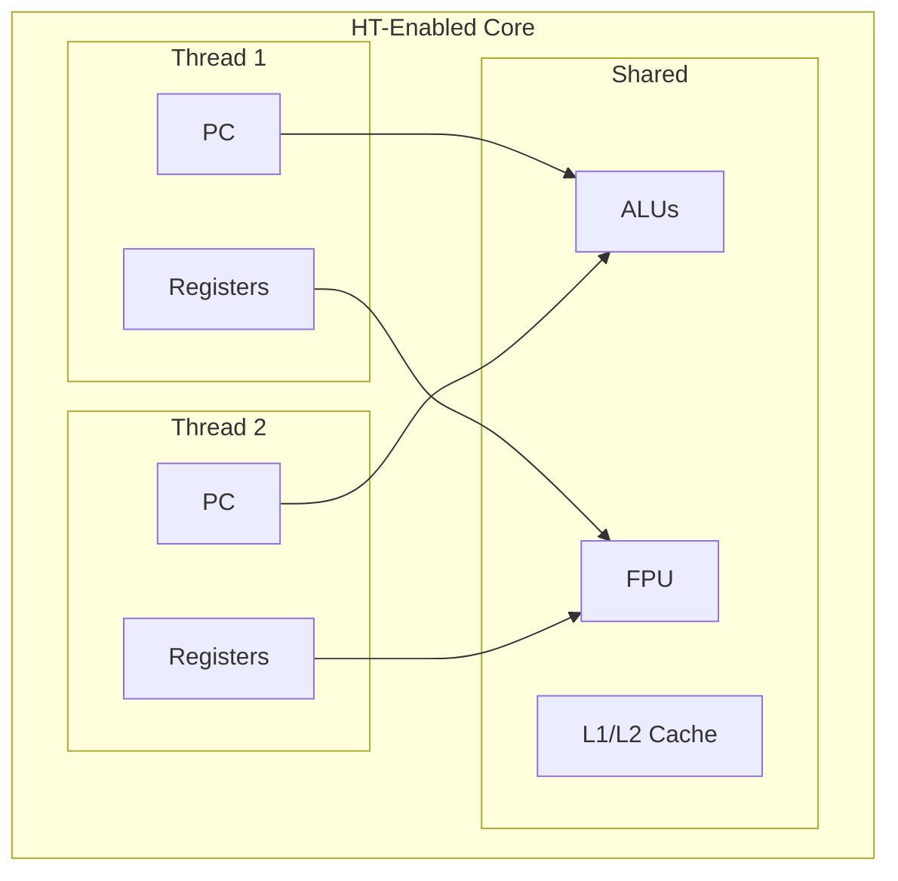

### Performance Impact

```
Workload A (compute-heavy):
  Single-thread:  100%
  HT (2 threads): 130%

Workload B (memory-heavy):
  Single-thread:  100%
  HT (2 threads): 170%
```

**Cache miss zamanı digər thread işləyir!**

## Parallelizm Challenges

### 1. Synchronization Overhead

```c
// High overhead - lock per iteration
for (int i = 0; i < N; i++) {
    lock();
    shared_counter++;
    unlock();
}

// Low overhead - local accumulation
int local = 0;
for (int i = 0; i < N; i++) {
    local++;
}
lock();
shared_counter += local;
unlock();
```

### 2. Load Balancing

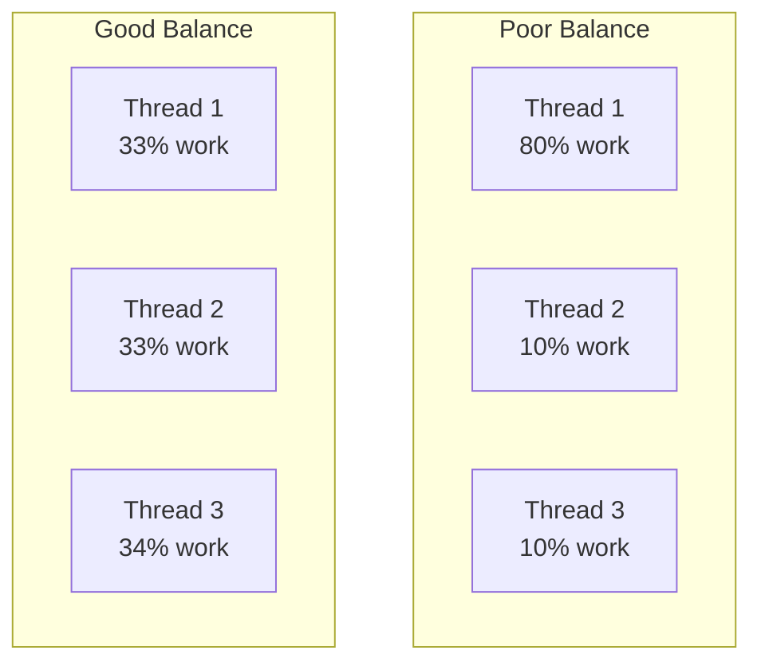

### 3. False Sharing

```c
struct Counter {
    int count1;  // Thread 1
    int count2;  // Thread 2
}; // Same cache line!

// Solution: Padding
struct Counter {
    int count1;
    char pad[60];
    int count2;
};
```

### 4. Memory Bandwidth

```
Single core:  20 GB/s
4 cores:      40 GB/s (not 80!)
8 cores:      60 GB/s
```

**Memory bandwidth limit!**

## Parallelism Patterns

### Embarrassingly Parallel

Heç bir communication yoxdur.

```c
// Perfect parallelism
#pragma omp parallel for
for (int i = 0; i < N; i++) {
    output[i] = expensive_computation(input[i]);
}
```

**Scalability:** Near-linear

### Reduction

Combine results.

```c
int sum = 0;
#pragma omp parallel for reduction(+:sum)
for (int i = 0; i < N; i++) {
    sum += array[i];
}
```

### Producer-Consumer

```c
Queue<Task> queue;

// Producer thread
while (has_work) {
    queue.push(create_task());
}

// Consumer threads
while (true) {
    Task t = queue.pop();
    process(t);
}
```

## Performance Metrics

### Speedup

```
Speedup = T(1) / T(N)
```

Burada T(N) = N processor ilə vaxt

### Efficiency

```
Efficiency = Speedup / N
```

**Ideal:** 1.0 (100%)
**Tipik:** 0.7-0.9 (70-90%)

### Scalability

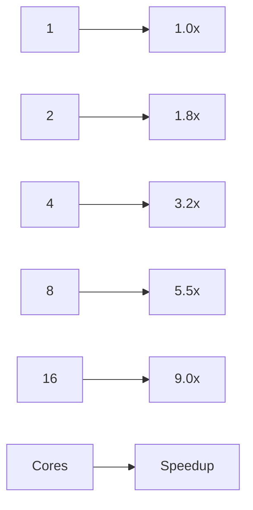

## Heterogeneous Computing

Müxtəlif processor növləri birlikdə.

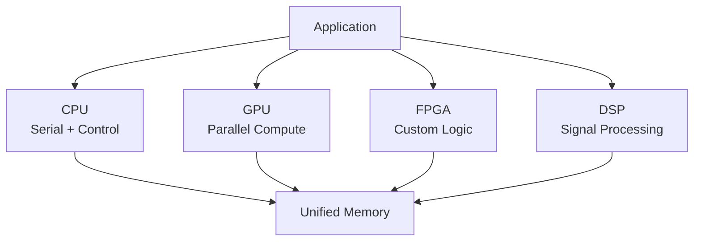

**Nümunə:** Apple M1/M2
- CPU cores (performance + efficiency)
- GPU cores
- Neural Engine
- Video encode/decode

## Best Practices

1. **Profile first**
   - Parallel hissəni tap
   - Bottleneck-ləri müəyyənləşdir

2. **Coarse-grained parallelism**
   - Böyük task-lar
   - Az synchronization

3. **Minimize communication**
   - Local data
   - Batch operations

4. **Use libraries**
   - OpenMP, TBB, PPL
   - BLAS, cuBLAS

5. **Test scaling**
   - 1, 2, 4, 8... cores
   - Measure speedup

## Əlaqəli Mövzular

- **CPU Architecture:** Superscalar və out-of-order
- **Multiprocessor Systems:** Multi-core architecture
- **Synchronization:** Lock-free algorithms
- **Performance:** Amdahl's Law və scaling
- **Cache Memory:** False sharing
