# Multiprocessor Sistemlər

## Multiprocessor Nədir?

**Multiprocessor** - bir neçə processor-un eyni sistemdə işləməsidir. Performans və throughput artırır.

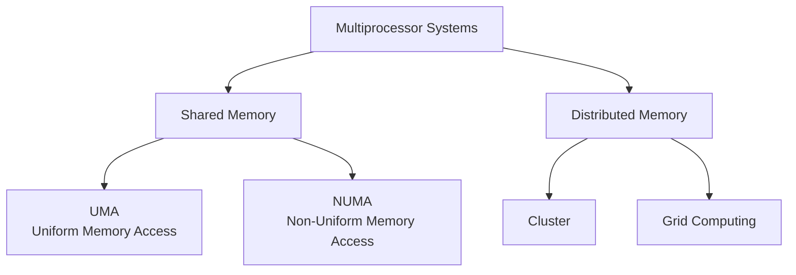

## Shared Memory vs Distributed Memory

### Shared Memory

Bütün processor-lar eyni memory space-ə çıxış edir.

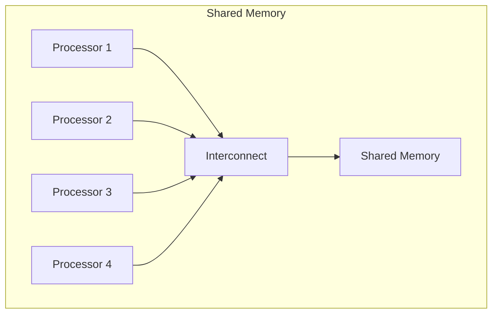

**Üstünlüklər:**
- Proqramlaması asan
- Data sharing sadə
- Single address space

**Çatışmazlıqlar:**
- Scalability limit
- Memory contention
- Cache coherence complexity

### Distributed Memory

Hər processor-un öz local memory-si var.

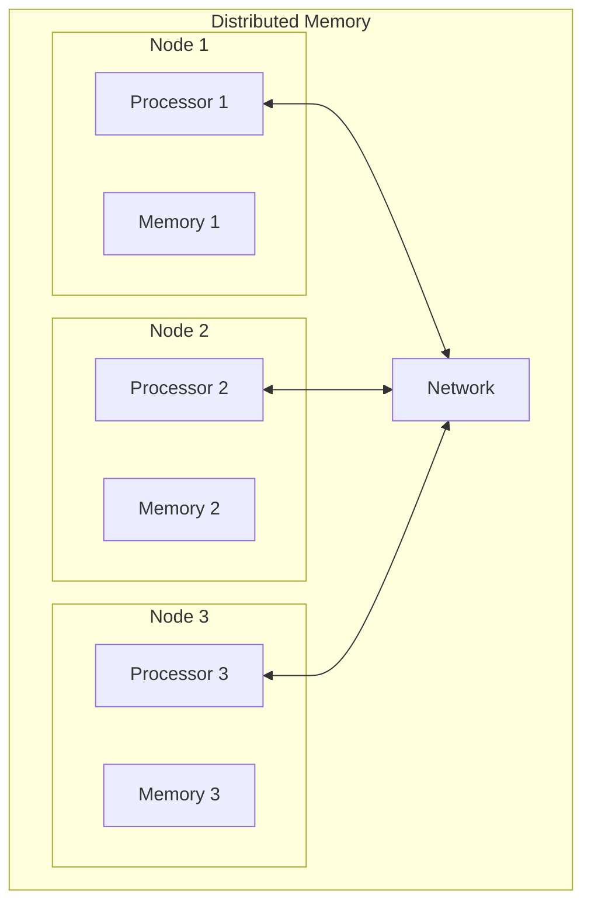

**Üstünlüklər:**
- Yaxşı scalability
- No memory contention
- Cost-effective

**Çatışmazlıqlar:**
- Message passing overhead
- Proqramlaması çətin
- Data distribution kompleks

## UMA (Uniform Memory Access)

Bütün processor-lar üçün **eyni memory access time**.

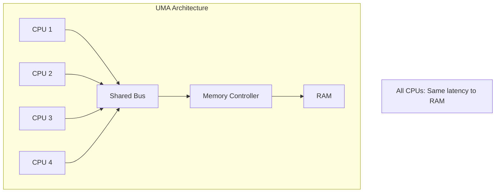

**Xüsusiyyətlər:**
- Simple architecture
- Predictable performance
- Cache coherence protokolları

**Limitlər:**
- Bus bandwidth bottleneck
- 4-8 processor-dan çox çətindir
- Memory wall

### SMP (Symmetric Multi-Processing)

UMA-nın ən populyar forması.

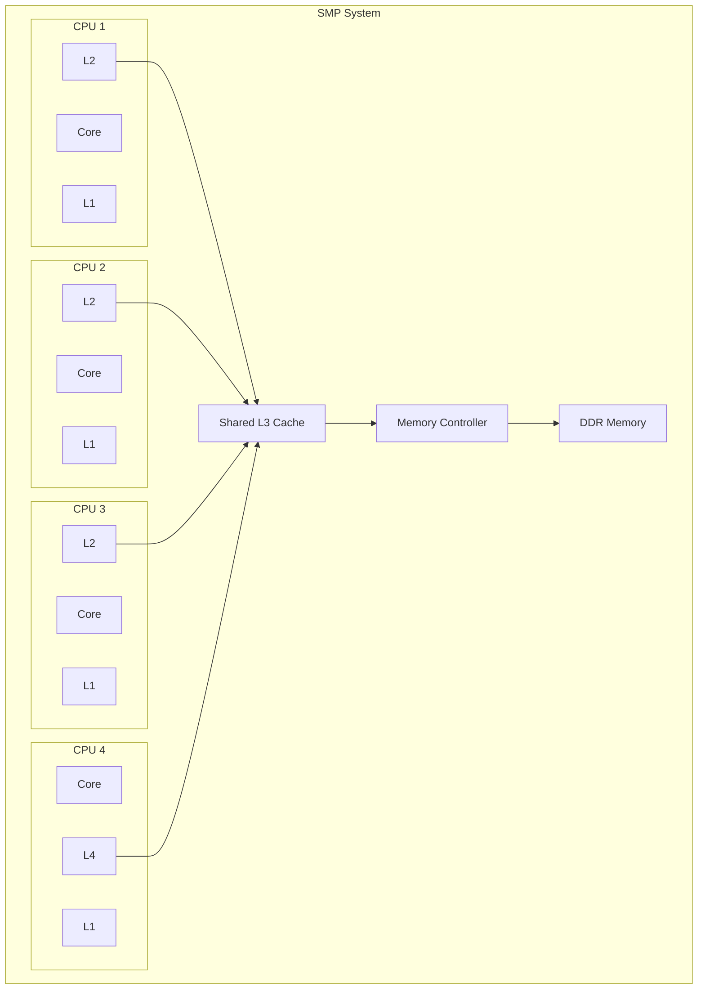

**Nümunə:** Tipik desktop/server CPU (Intel Core, AMD Ryzen)

## NUMA (Non-Uniform Memory Access)

Memory access time processor-dan **asılıdır**.

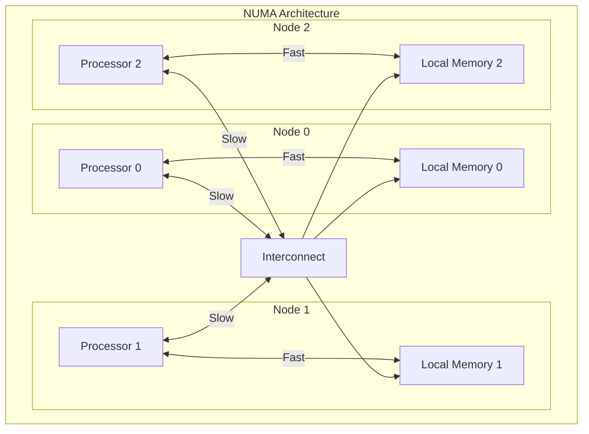

### Local vs Remote Access

```
Local Memory Access:  50-100 ns
Remote Memory Access: 150-300 ns (2-3x slower!)
```

**NUMA Ratio:**
```
NUMA Ratio = Remote Access Time / Local Access Time
Typical: 1.5 - 3.0
```

### NUMA Nodes

```bash
# Linux: Check NUMA topology
numactl --hardware

# Output:
# available: 2 nodes (0-1)
# node 0 cpus: 0 2 4 6 8 10 12 14
# node 0 size: 65536 MB
# node 1 cpus: 1 3 5 7 9 11 13 15
# node 1 size: 65536 MB
# node distances:
# node   0   1
#   0:  10  21
#   1:  21  10
```

**Distance 10:** Local
**Distance 21:** Remote (2.1x slower)

### NUMA Optimizasiya

**1. Memory Affinity**

```c
// Allocate memory on specific NUMA node
#include <numa.h>

void* ptr = numa_alloc_onnode(size, node_id);
```

**2. CPU Affinity**

```c
// Bind thread to specific CPU
cpu_set_t cpuset;
CPU_ZERO(&cpuset);
CPU_SET(cpu_id, &cpuset);
pthread_setaffinity_np(thread, sizeof(cpuset), &cpuset);
```

**3. First-Touch Policy**

```c
// Allocate on node where first touched
#pragma omp parallel for
for (int i = 0; i < N; i++) {
    array[i] = 0;  // Initialize on local node
}
```

## Cache Coherence

Multi-processor sistemdə **cache consistency** problemi.

### Problem

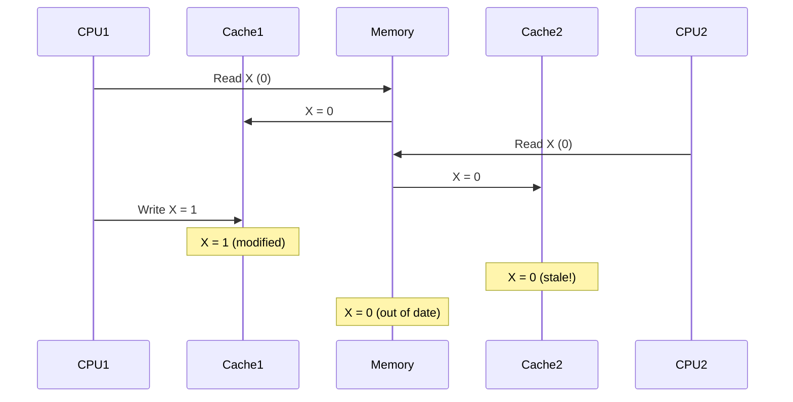

### Snooping Protocol

**Bus-based systems** üçün.

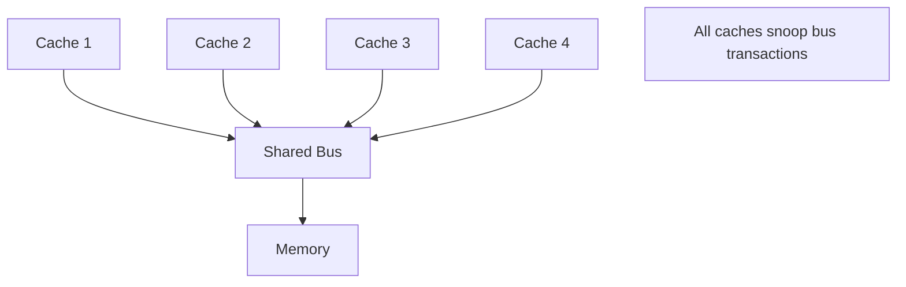

**Mərhələlər:**
1. CPU write əməliyyatı edir
2. Bus-a write broadcast edilir
3. Digər cache-lər snoop edir
4. Lazımsa invalidate və ya update edirlər

### Directory-Based Protocol

**Scalable systems** üçün (NUMA).

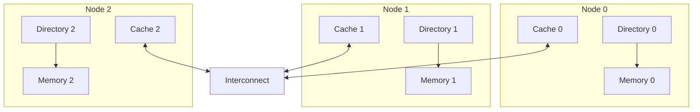

**Directory:** Hansı cache-lərdə hansı data var?

### MESI Protocol (Snooping)

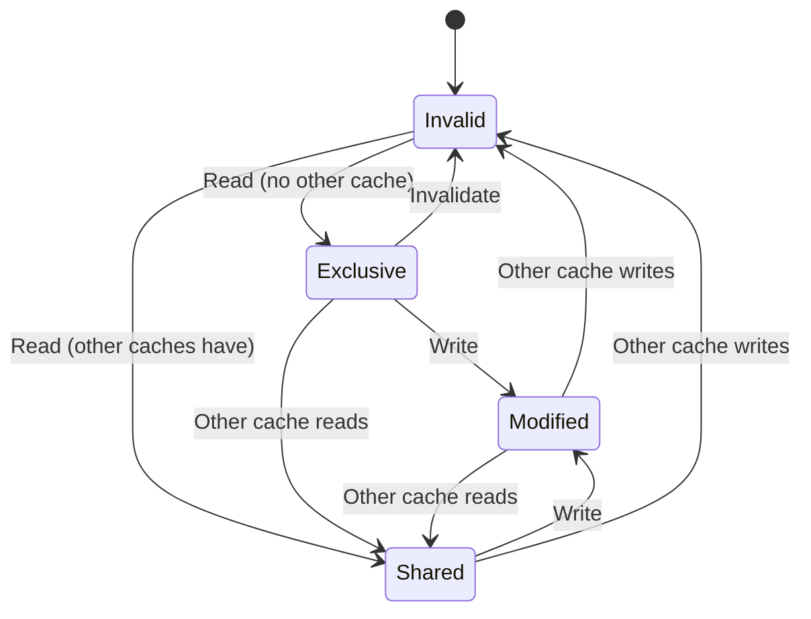

### MOESI Protocol (AMD)

MESI + **Owned** state.

**O (Owned):**
- Cache dirty copy var
- Başqa cache-lər read-only copy ala bilər
- Write-back məsuliyyəti bu cache-də

**Üstünlük:** Cache-to-cache transfer (memory-ə write yox)

## Interconnection Networks

### 1. Bus

Sadə, amma scalability yoxdur.

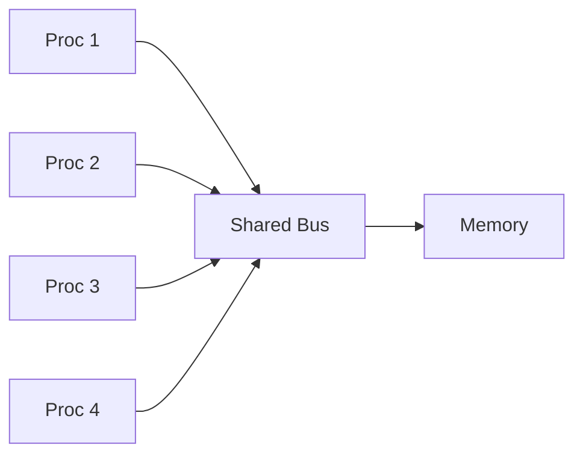

**Bandwidth:** Bütün processor-lar paylaşır
**Limit:** 4-8 processor

### 2. Crossbar Switch

Hər processor hər memory-ə.

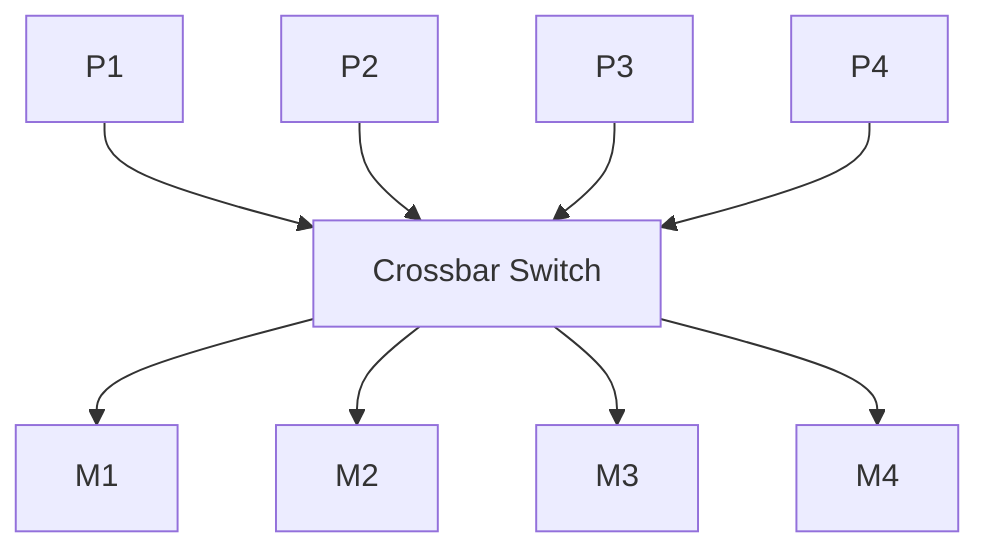

**Bandwidth:** Yüksək (parallel paths)
**Cost:** O(N²) - bahalı

### 3. Mesh Network

2D mesh topology.

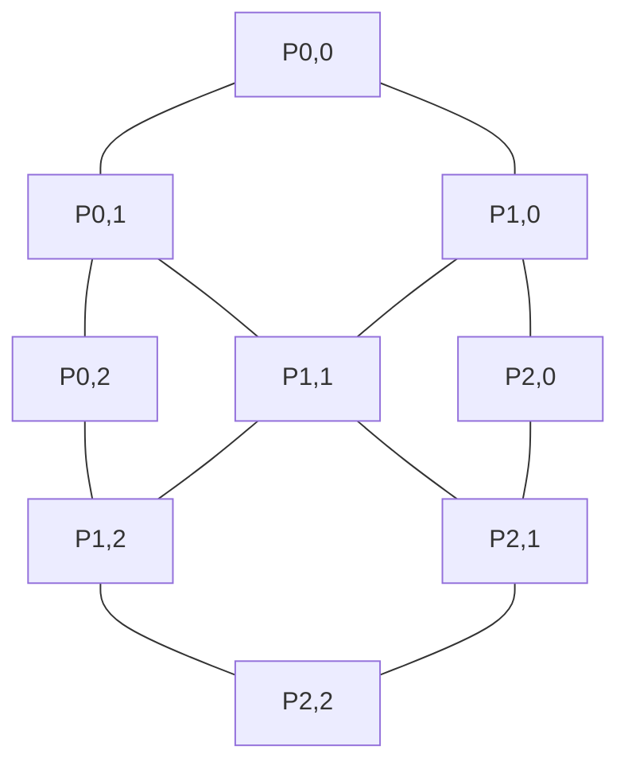

**Üstünlük:** Scalable, simple
**Çatışmazlıq:** Variable latency (corner vs center)

### 4. Torus

Mesh + wrap-around connections.

**Üstünlük:** Daha qısa average distance

### 5. Hypercube

N-dimensional cube.

**Dimensions:**
- 1D: 2 nodes
- 2D: 4 nodes (square)
- 3D: 8 nodes (cube)
- nD: 2ⁿ nodes

**Diameter:** log₂(N)

### 6. Fat Tree

Switch hierarchy.

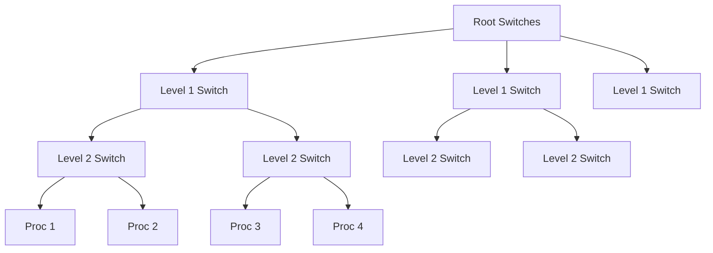

**Üstünlük:** High bisection bandwidth
**Nümunə:** Data center networks

## Scalability Challenges

### 1. Memory Bandwidth Wall

```
Single Core:     50 GB/s
4 Cores:         100 GB/s
8 Cores:         120 GB/s (saturated!)
16 Cores:        120 GB/s (no gain)
```

**Həll:** NUMA, multiple memory controllers

### 2. Cache Coherence Traffic

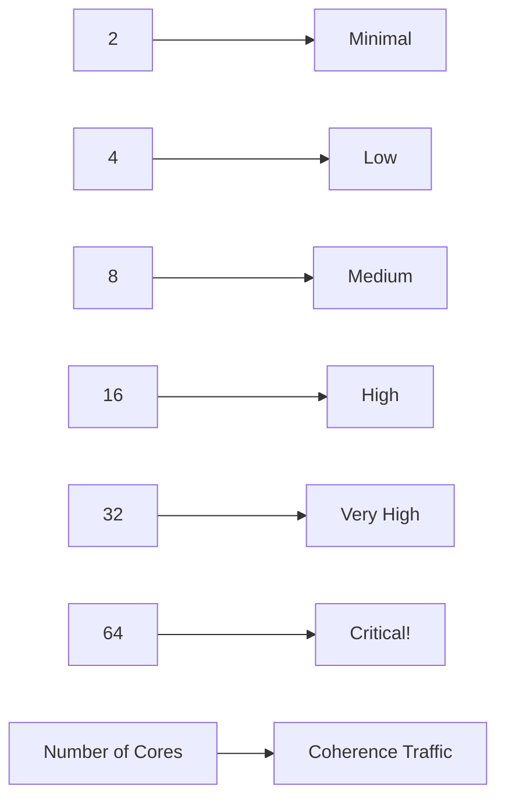

**Overhead:** O(N²) worst case

### 3. Synchronization Bottleneck

```c
// Global lock - serialization point
pthread_mutex_lock(&global_lock);
shared_counter++;
pthread_mutex_unlock(&global_lock);
```

**Həll:** Lock-free algorithms, per-thread data

### 4. Load Imbalance

```mermaid
gantt
    title Load Imbalance
    dateFormat X
    axisFormat %s
    
    section Thread 1
    Work :0, 10
    Idle :10, 12
    
    section Thread 2
    Work :0, 12
    
    section Thread 3
    Work :0, 8
    Idle :8, 12
    
    section Thread 4
    Work :0, 6
    Idle :6, 12
```

**Həll:** Dynamic work distribution

## Real-World Multiprocessor Systems

### Intel Xeon Scalable

**Architecture:** NUMA
**Sockets:** 2-8
**Cores/Socket:** 8-64
**Interconnect:** UPI (Ultra Path Interconnect)

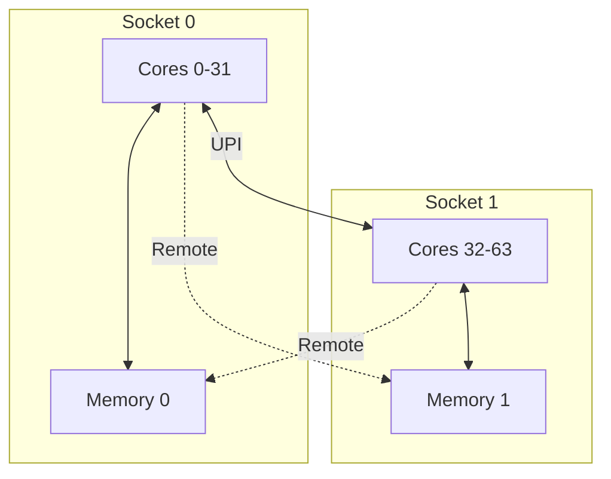

### AMD EPYC

**Architecture:** NUMA (Chiplet-based)
**Chiplets:** 8-12 per socket
**Cores:** 64-96 per socket
**Interconnect:** Infinity Fabric

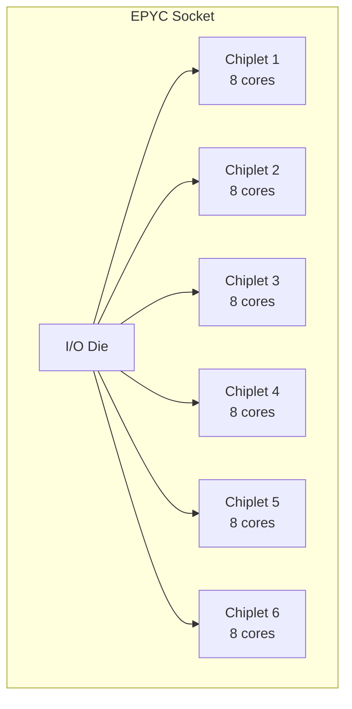

### ARM Server

**Neoverse:** Cloud/HPC
**Cores:** 32-128 per chip
**Mesh interconnect**

### IBM POWER

**SMT-8:** 8 thread/core
**Cores:** 12-24/chip
**Strong RAS features**

## ccNUMA (Cache Coherent NUMA)

Hardware cache coherence + NUMA.

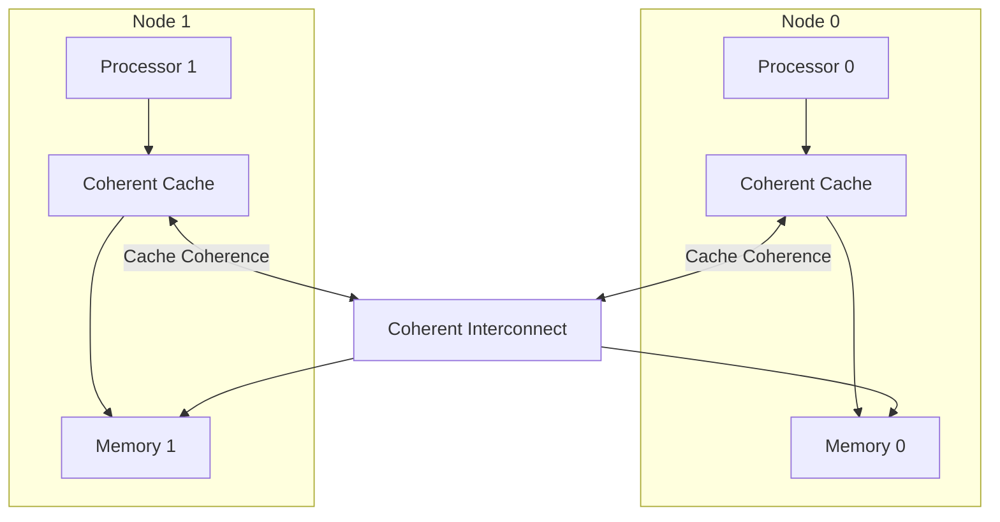

**Nümunə:** Modern server systems

## Performance Tuning

### 1. NUMA Awareness

```bash
# Run on specific node
numactl --cpunodebind=0 --membind=0 ./program

# Interleave memory
numactl --interleave=all ./program
```

### 2. Profiling

```bash
# NUMA statistics
numastat

# Per-process NUMA stats
numastat -p PID
```

### 3. Minimize Remote Access

```c
// BAD: Random access across nodes
for (int i = 0; i < N; i++) {
    process(array[random() % N]);
}

// GOOD: Local access pattern
int start = thread_id * (N / num_threads);
int end = start + (N / num_threads);
for (int i = start; i < end; i++) {
    process(array[i]);
}
```

### 4. Reduce Coherence Traffic

```c
// BAD: False sharing
struct {
    int counter1;  // Thread 1
    int counter2;  // Thread 2
} counters;

// GOOD: Padding
struct {
    int counter1;
    char pad[64];
    int counter2;
} counters;
```

## Best Practices

1. **NUMA-aware programming**
   - Allocate memory on local node
   - Minimize remote access

2. **Reduce synchronization**
   - Per-thread data structures
   - Lock-free algorithms

3. **Balance load**
   - Dynamic scheduling
   - Work stealing

4. **Profile performance**
   - Identify NUMA issues
   - Cache coherence overhead

5. **Consider architecture**
   - UMA vs NUMA
   - Memory bandwidth limits

## Əlaqəli Mövzular

- **Cache Memory:** Cache coherence protocols
- **Memory Ordering:** Multi-processor consistency
- **Synchronization:** Lock-free algorithms
- **Parallelism:** Thread-level parallelism
- **Performance:** Scalability limits
