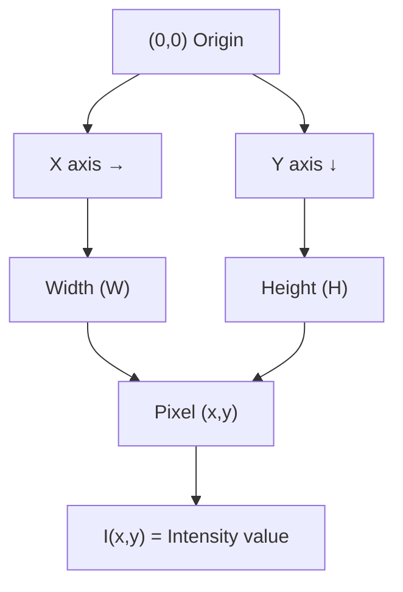
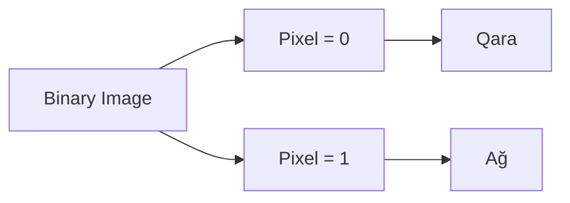
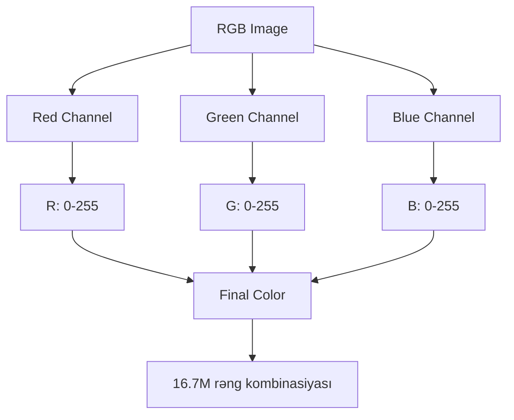
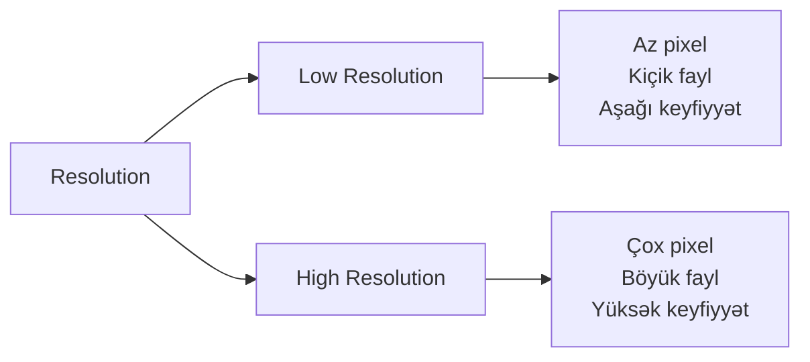
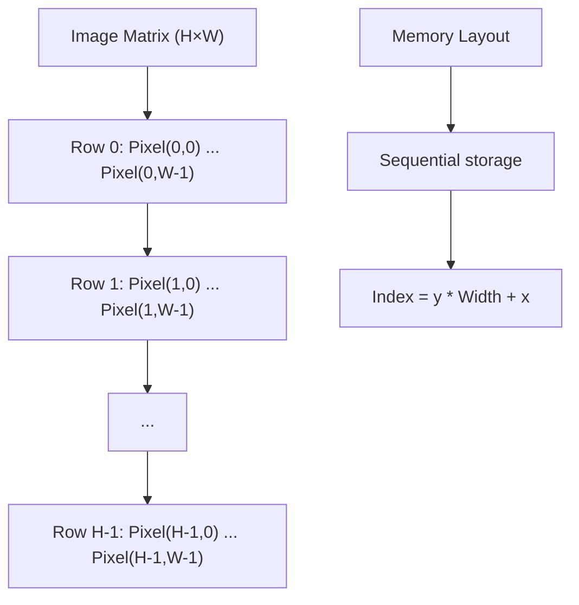
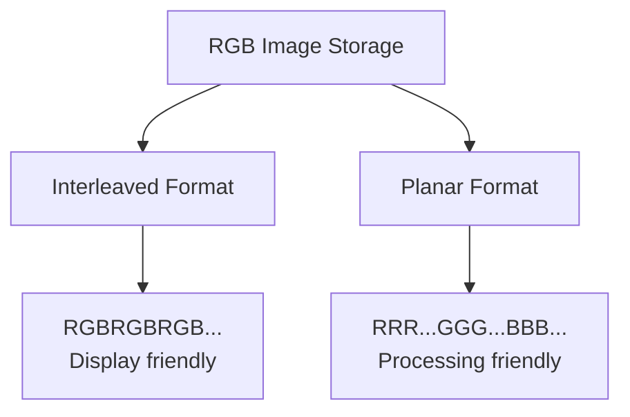
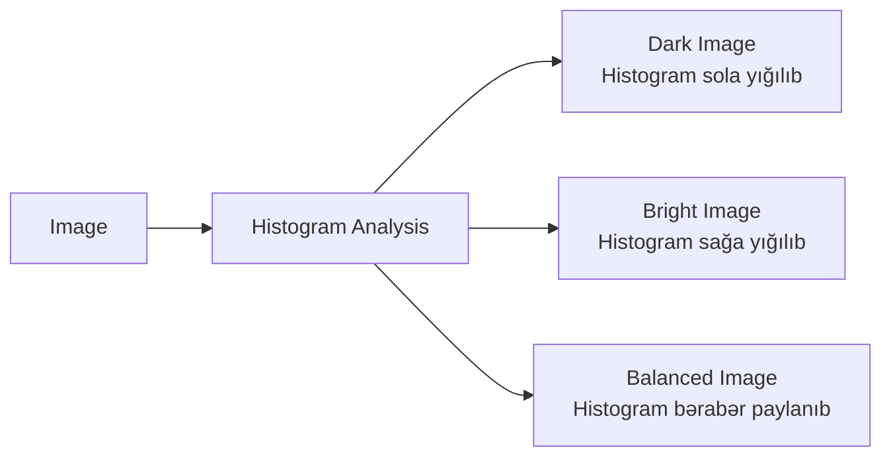
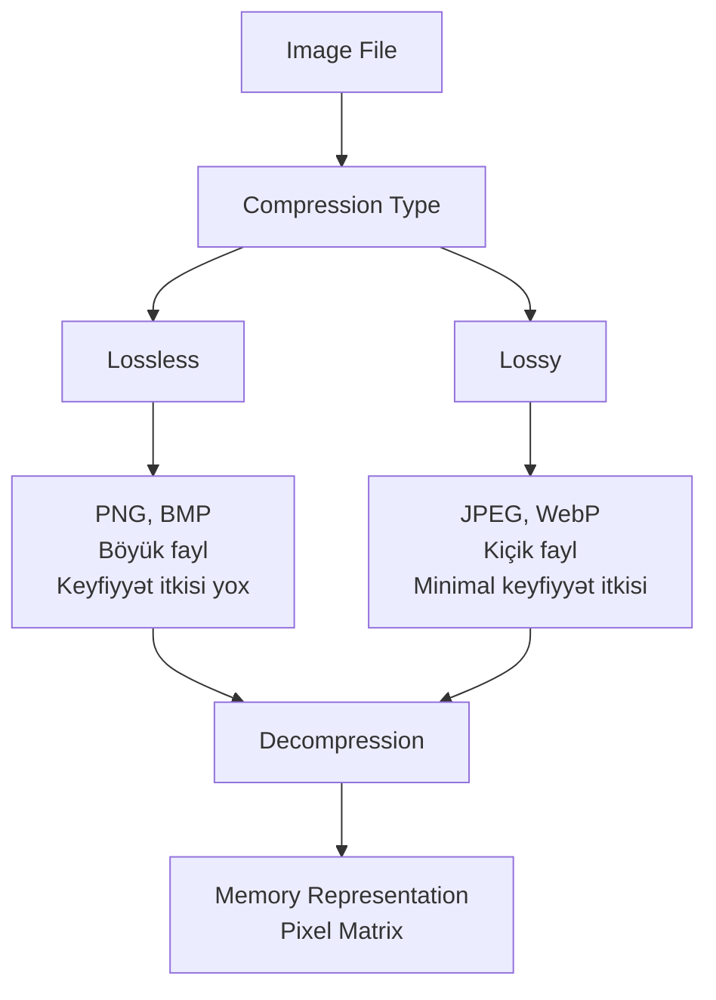

# Image Əsasları və Təsviri

## Rəqəmsal Şəkil Nədir?

Rəqəmsal şəkil (digital image) diskret pixel dəyərlərinin iki ölçülü massividir. Hər pixel şəklin kiçik bir nöqtəsini təmsil edir və müəyyən rəng və ya intensivlik dəyərinə malikdir.

**Əsas Konsepsiyalar:**
- **Pixel** - Şəklin ən kiçik elementi (picture element)
- **Resolution** - Şəkildəki pixel sayı (məsələn, 1920x1080)
- **Bit depth** - Hər pixel üçün istifadə olunan bit sayı
- **Aspect ratio** - En və hündürlük nisbəti

## Şəkil Koordinat Sistemi



**Koordinat sisteminin xüsusiyyətləri:**
- Origin (0,0) sol yuxarı küncdədir
- X oxu sağa doğru artır (0-dan Width-1-ə qədər)
- Y oxu aşağı doğru artır (0-dan Height-1-ə qədər)
- Hər pixel I(x,y) ilə təmsil olunur

## Şəkil Növləri

### 1. Binary Image

Binary (ikili) şəkillər yalnız 2 dəyər alır: 0 (qara) və 1 (ağ).

**Xüsusiyyətlər:**
- 1 bit per pixel
- Yaddaş səmərəli
- Text recognition, document scanning üçün istifadə olunur



### 2. Grayscale Image

Grayscale şəkillər boz tonların müxtəlif səviyyələrini təmsil edir.

**Xüsusiyyətlər:**
- 8 bit per pixel (0-255 arası dəyərlər)
- 256 müxtəlif intensivlik səviyyəsi
- 0 = Qara, 255 = Ağ
- Medical imaging, scientific analysis üçün istifadə olunur

```
I(x,y) = intensity value
0 ≤ I(x,y) ≤ 255
```

### 3. Color Image (RGB)

RGB şəkillər üç kanal (Red, Green, Blue) istifadə edərək rəngli təsvir yaradır.

**Xüsusiyyətlər:**
- 24 bit per pixel (hər kanal üçün 8 bit)
- 16.7 milyon fərqli rəng (256³)
- Hər pixel üç dəyərlə təmsil olunur: I(x,y) = [R, G, B]



### 4. Alpha Channel

Alpha channel şəffaflığı təmsil edir (RGBA formatı).

**Xüsusiyyətlər:**
- 32 bit per pixel
- Alpha: 0 (tam şəffaf) - 255 (tam qeyri-şəffaf)
- Graphics, compositing, overlay əməliyyatları üçün istifadə olunur

## Image Resolution və Quality

### Spatial Resolution

Spatial resolution şəklin vahid sahə üzərindəki pixel sayını göstərir.

**Ölçü vahidləri:**
- **Pixels** - Ümumi pixel sayı (məsələn, 1920x1080 = 2,073,600 pixels)
- **DPI/PPI** - Dots/Pixels Per Inch (print quality üçün)
- **Megapixels** - Milyon pixel (məsələn, 12MP camera)



### Intensity Resolution (Bit Depth)

Intensity resolution hər pixel üçün istifadə olunan bit sayını göstərir.

| Bit Depth | Səviyyə sayı | İstifadə sahəsi |
|-----------|--------------|-----------------|
| 1 bit | 2 | Binary images |
| 8 bit | 256 | Grayscale, hər RGB kanal |
| 16 bit | 65,536 | Medical imaging, HDR |
| 32 bit | 4.3 milyar | Scientific imaging, floating-point |

## Image Representation in Memory

### Row-major Order

Ən geniş istifadə olunan yaddaş təşkili metodudur.



**Formula:**
```
Memory index = y × Width + x

Misal:
Image: 640×480
Pixel (10, 20) üçün index = 20 × 640 + 10 = 12,810
```

### Multi-channel Representation

RGB şəkillər üç fərqli şəkildə saxlanıla bilər:

**1. Interleaved (Packed):**
```
R₀G₀B₀ R₁G₁B₁ R₂G₂B₂ ...
```
- Memory-də ardıcıl olaraq saxlanır
- Display üçün effektiv

**2. Planar:**
```
R₀R₁R₂...R_n G₀G₁G₂...G_n B₀B₁B₂...B_n
```
- Hər kanal ayrıca saxlanır
- Processing üçün effektiv
- SIMD operations üçün optimal



## Histogram

Histogram şəkildəki intensivlik dəyərlərinin paylanmasını göstərən qrafıkdir.

**Tətbiq sahələri:**
- Image quality assessment
- Contrast enhancement
- Thresholding
- Image segmentation



**Histogram hesablama:**
```
h(i) = Intensivlik dəyəri i olan pixel sayı
0 ≤ i ≤ 255 (8-bit grayscale üçün)

Normalize histogram:
p(i) = h(i) / (Width × Height)
```

## Yaddaş Hesablaması

**Grayscale image:**
```
Memory = Width × Height × 1 byte
Misal: 1920×1080 = 2,073,600 bytes ≈ 2 MB
```

**RGB image:**
```
Memory = Width × Height × 3 bytes
Misal: 1920×1080×3 = 6,220,800 bytes ≈ 6 MB
```

**RGBA image:**
```
Memory = Width × Height × 4 bytes
Misal: 1920×1080×4 = 8,294,400 bytes ≈ 8 MB
```

## File Format vs Image Representation

**File formatları:**
- **Lossless:** PNG, BMP, TIFF (orijinal məlumat saxlanır)
- **Lossy:** JPEG, WebP (compression ilə keyfiyyət itkisi)
- **Raw:** Camera raw formatları (minimal processing)



## Practical Considerations

**Memory vs Storage:**
- **Yaddaşda:** Şəkil həmişə uncompressed pixel array kimi saxlanır
- **Disk-də:** Compressed format (JPEG, PNG) istifadə edilir
- Load zamanı decompression tələb olunur

**Performance:**
- Cache locality üçün row-major order effektivdir
- SIMD operations üçün planar format daha yaxşıdır
- Multi-threading üçün şəkil tile-lara bölünə bilər

**Misal: Python/NumPy:**
```python
import numpy as np

# Grayscale image yaradılması
gray_image = np.zeros((480, 640), dtype=np.uint8)

# RGB image yaradılması
rgb_image = np.zeros((480, 640, 3), dtype=np.uint8)

# Shape: (height, width, channels)
print(rgb_image.shape)  # (480, 640, 3)
```

## Əsas Nəticələr

1. **Pixel** - Şəklin fundamental elementi
2. **Resolution** - Keyfiyyəti müəyyən edir
3. **Bit depth** - Rəng/intensivlik diapazonunu təyin edir
4. **Koordinat sistemi** - Sol yuxarıdan başlayır (0,0)
5. **Memory layout** - Row-major order standard metoddur
6. **Histogram** - İntensivlik paylanmasını göstərir
7. **File format ≠ Memory representation** - Decompression tələb olunur
