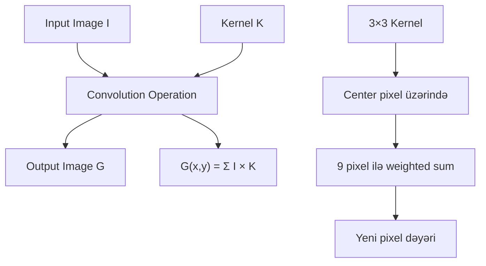
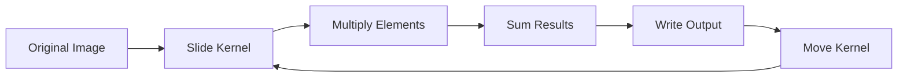
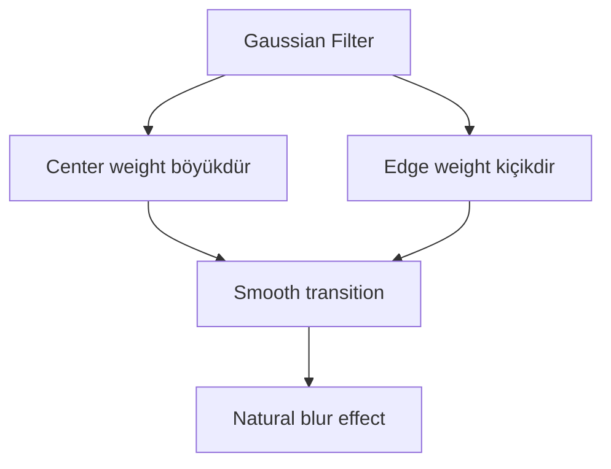
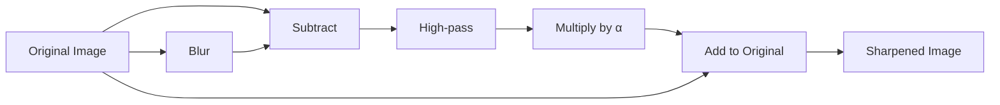
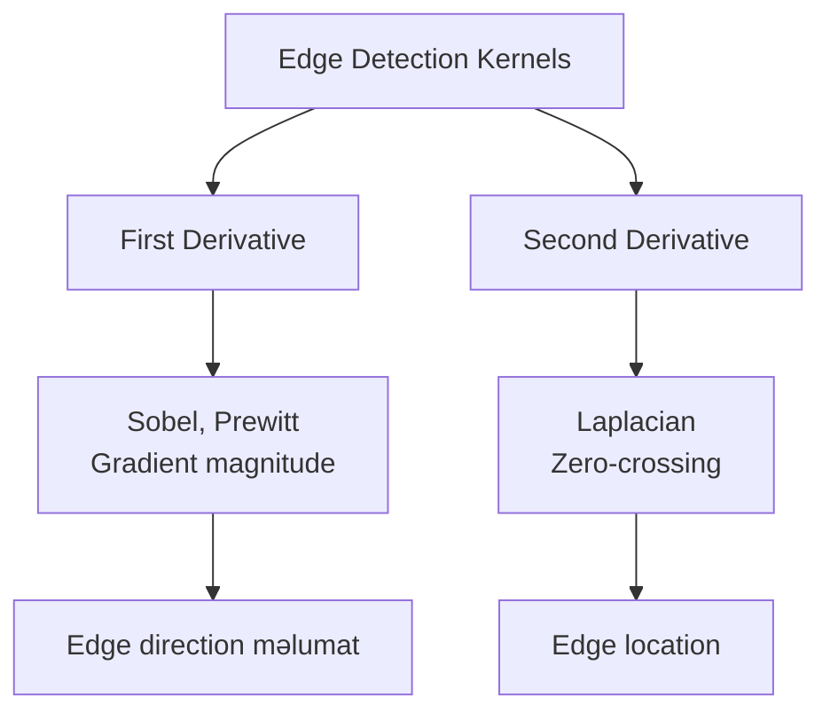
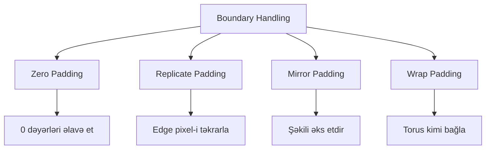
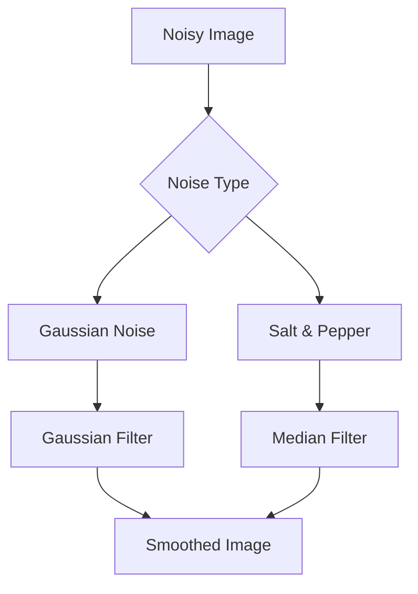
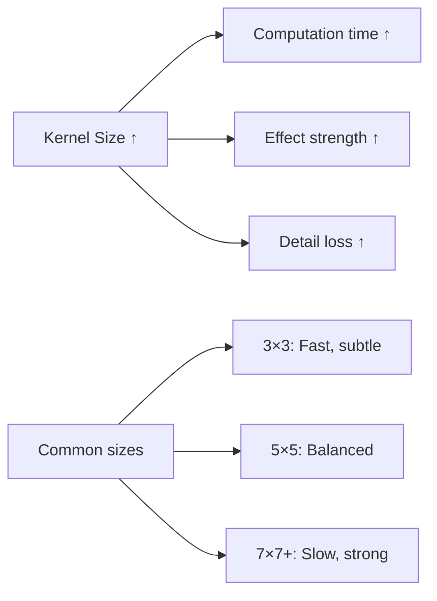

# Image Filtering və Convolution

## Convolution Nədir?

Convolution (konvolyusiya) şəklin hər pixelinə kiçik bir matris (kernel/filter) tətbiq edərək yeni şəkil əldə etmə əməliyyatıdır. Bu, image processing-də ən fundamental əməliyyatlardan biridir.

**Əsas konsepsiyalar:**
- **Kernel (Filter)** - Kiçik matris (məsələn, 3×3, 5×5)
- **Convolution** - Kernel ilə şəkil arasında riyazi əməliyyat
- **Spatial filtering** - Məkan domenində filtrleme
- **Linear filtering** - Xətti əməliyyatlar

## Convolution Əməliyyatı

### Riyazi Təsvir

2D diskret convolution:

```
G(x,y) = (I * K)(x,y) = ΣΣ I(i,j) × K(x-i, y-j)
```

Burada:
- `I(x,y)` - Orijinal şəkil
- `K(x,y)` - Kernel (filter)
- `G(x,y)` - Nəticə şəkli
- `*` - Convolution operatoru

### Vizual Təsvir



### Addım-addım Prosess

**1. Kernel placement:**
- Kernel şəklin üzərinə qoyulur
- Center pixel üzərində mərkəzləşir

**2. Element-wise multiplication:**
- Kernel dəyərləri ilə pixel dəyərləri vurulur

**3. Summation:**
- Bütün vurma nəticələri toplanır

**4. Result assignment:**
- Toplam yeni pixel dəyəri olur



## Praktik Misal

### 3×3 Kernel Convolution

**Orijinal şəkil bloğu:**
```
10  20  30  40  50
15  25  35  45  55
20  30  40  50  60
25  35  45  55  65
30  40  50  60  70
```

**Kernel (3×3 averaging filter):**
```
1/9  1/9  1/9
1/9  1/9  1/9
1/9  1/9  1/9
```

**Hesablama (center pixel 40 üçün):**
```
Result = (25×1/9 + 35×1/9 + 45×1/9 +
          30×1/9 + 40×1/9 + 50×1/9 +
          35×1/9 + 45×1/9 + 55×1/9)
       = 360/9 = 40
```

## Ümumi Kernel Növləri

### 1. Smoothing (Blurring) Filters

#### Box Filter (Average Filter)

Bütün pixel qonşuları üzrə orta dəyər hesablayır.

```
3×3 Box Filter:
┌─────────────┐
│ 1/9  1/9  1/9│
│ 1/9  1/9  1/9│
│ 1/9  1/9  1/9│
└─────────────┘
```

**Xüsusiyyətlər:**
- Noise reduction
- Blur effekti
- Detail loss
- Fast computation

#### Gaussian Filter

Gaussian paylanmasına əsaslanan yumuşaq blur.

```
3×3 Gaussian Filter (σ=1.0):
┌───────────────┐
│ 1/16  2/16  1/16│
│ 2/16  4/16  2/16│
│ 1/16  2/16  1/16│
└───────────────┘

5×5 Gaussian Filter (σ=1.4):
┌─────────────────────────┐
│ 1  4   6   4  1 │
│ 4  16  24  16 4 │ × 1/256
│ 6  24  36  24 6 │
│ 4  16  24  16 4 │
│ 1  4   6   4  1 │
└─────────────────────────┘
```

**Xüsusiyyətlər:**
- Smooth blur
- Detail qorunması box filter-dən yaxşıdır
- Noise reduction
- Pre-processing üçün geniş istifadə



### 2. Sharpening Filters

Şəkildə edge və detail-ləri gücləndirir.

#### Basic Sharpening

```
3×3 Sharpen Filter:
┌──────────────┐
│  0  -1   0  │
│ -1   5  -1  │
│  0  -1   0  │
└──────────────┘
```

**İzah:**
- Center pixel gücləndirilir (5)
- Qonşular çıxılır (-1)
- High-frequency detail-lər artırılır

#### Unsharp Masking

```
Sharpened = Original + α × (Original - Blurred)

Kernel:
┌─────────────────┐
│ -1  -1  -1 │
│ -1   9  -1 │  × 1/9
│ -1  -1  -1 │
└─────────────────┘
```



### 3. Edge Detection Filters

#### Sobel Operator

Horizontal və vertikal gradient-ləri hesablayır.

```
Sobel X (horizontal edges):
┌──────────────┐
│ -1   0   1  │
│ -2   0   2  │
│ -1   0   1  │
└──────────────┘

Sobel Y (vertical edges):
┌──────────────┐
│ -1  -2  -1  │
│  0   0   0  │
│  1   2   1  │
└──────────────┘
```

**Gradient magnitude:**
```
G = √(Gx² + Gy²)
```

**Gradient direction:**
```
θ = arctan(Gy / Gx)
```

#### Prewitt Operator

Sobel-ə bənzər, lakin uniform weights.

```
Prewitt X:              Prewitt Y:
┌──────────────┐       ┌──────────────┐
│ -1   0   1  │       │ -1  -1  -1  │
│ -1   0   1  │       │  0   0   0  │
│ -1   0   1  │       │  1   1   1  │
└──────────────┘       └──────────────┘
```

#### Laplacian Operator

İkinci dərəcə törəmə, edge detection üçün.

```
Laplacian 4-neighborhood:
┌──────────────┐
│  0   1   0  │
│  1  -4   1  │
│  0   1   0  │
└──────────────┘

Laplacian 8-neighborhood:
┌──────────────┐
│  1   1   1  │
│  1  -8   1  │
│  1   1   1  │
└──────────────┘
```



### 4. Emboss Filter

3D relief effekti yaradır.

```
Emboss Filter:
┌──────────────┐
│ -2  -1   0  │
│ -1   1   1  │
│  0   1   2  │
└──────────────┘
```

**Effekt:**
- Light source sol yuxarıdan
- Shadow və highlight yaradır
- 3D görünüş

## Boundary (Sərhəd) İdarəsi

Convolution zamanı şəkil sərhədlərində problem yaranır - kernel şəkildən kənara çıxır.

### Padding Metodları



**1. Zero Padding:**
```
Original:          With padding:
┌────────┐        ┌──────────────┐
│ a b c │        │ 0  0  0  0  0│
│ d e f │   →    │ 0  a  b  c  0│
│ g h i │        │ 0  d  e  f  0│
└────────┘        │ 0  g  h  i  0│
                  │ 0  0  0  0  0│
                  └──────────────┘
```

**2. Replicate Padding:**
```
┌──────────────┐
│ a  a  b  c  c│
│ a  a  b  c  c│
│ d  d  e  f  f│
│ g  g  h  i  i│
│ g  g  h  i  i│
└──────────────┘
```

**3. Mirror Padding:**
```
┌──────────────┐
│ e  d  e  f  e│
│ b  a  b  c  b│
│ e  d  e  f  e│
│ h  g  h  i  h│
│ e  d  e  f  e│
└──────────────┘
```

## Separable Filters

Bəzi 2D kernel-lər iki 1D kernel-ə ayrıla bilər - bu performans üçün çox effektivdir.

### Separability Şərti

```
K(x,y) = Kx(x) × Ky(y)
```

**Əsas üstünlük:**
- 2D convolution: O(M × N × k²) əməliyyat
- Separable: O(M × N × 2k) əməliyyat

### Misal: Gaussian Filter

```
3×3 Gaussian:
┌───────────────┐
│ 1  2  1 │
│ 2  4  2 │ × 1/16
│ 1  2  1 │
└───────────────┘

Ayrılır:
Row kernel: [1  2  1] × 1/4
Column kernel: [1  2  1]ᵀ × 1/4

Result: [1 2 1]ᵀ × [1 2 1] × 1/16
```

```mermaid
graph LR
    A[Input Image] --> B[Apply Row Kernel]
    B --> C[Intermediate Result]
    C --> D[Apply Column Kernel]
    D --> E[Final Output]
    
    F[2D Convolution<br/>O(n²)] --> G[vs]
    G --> H[Separable<br/>O(2n)]
    H --> I["5×5: 25 ops → 10 ops"]
```

## Praktik Tətbiqlər

### 1. Noise Reduction



### 2. Feature Enhancement

- **Sharpening** - Text, details üçün
- **Edge detection** - Object recognition üçün
- **Emboss** - Texture analysis üçün

### 3. Pre-processing

- Image segmentation əvvəl
- Machine learning pipeline-da
- Medical imaging-də

## Implementation Nümunəsi

### Python/NumPy

```python
import numpy as np
from scipy import signal

# Şəkil (grayscale)
image = np.array([...])

# 3×3 Gaussian kernel
kernel = np.array([
    [1, 2, 1],
    [2, 4, 2],
    [1, 2, 1]
]) / 16.0

# Convolution
result = signal.convolve2d(image, kernel, mode='same', boundary='symm')
```

### OpenCV

```python
import cv2
import numpy as np

# Şəkil oxu
image = cv2.imread('image.jpg', cv2.IMREAD_GRAYSCALE)

# Box filter
blurred = cv2.boxFilter(image, -1, (5, 5))

# Gaussian filter
gaussian = cv2.GaussianBlur(image, (5, 5), sigmaX=1.4)

# Sobel edge detection
sobel_x = cv2.Sobel(image, cv2.CV_64F, 1, 0, ksize=3)
sobel_y = cv2.Sobel(image, cv2.CV_64F, 0, 1, ksize=3)
magnitude = np.sqrt(sobel_x**2 + sobel_y**2)

# Custom kernel
kernel = np.array([[-1, -1, -1],
                   [-1,  9, -1],
                   [-1, -1, -1]])
sharpened = cv2.filter2D(image, -1, kernel)
```

## Performance Considerations

### Kernel Size



### Optimization Texnikaları

1. **Separable filters istifadə et:**
   - 2D convolution → 2× 1D convolution

2. **Integral image (box filter üçün):**
   - O(k²) → O(1)

3. **FFT-based convolution (böyük kernel-lər üçün):**
   - Frequency domain-də convolution = multiplication

4. **SIMD/GPU acceleration:**
   - Parallel processing
   - Vectorization

## Əsas Nəticələr

1. **Convolution** - Kernel ilə weighted sum əməliyyatıdır
2. **Kernel** - Filter xüsusiyyətlərini müəyyən edir
3. **Smoothing** - Noise reduction, blur əldə etmək üçün
4. **Sharpening** - Detail və edge-ləri gücləndirir
5. **Edge detection** - Gradient-based kernel-lər istifadə edir
6. **Boundary handling** - Padding metodları tələb olunur
7. **Separable filters** - Performans üçün kritik optimizasiya
8. **Kernel size** - Quality və performance arasında trade-off
