# Edge Detection

## Edge Nədir?

Edge (kənar) şəkildə intensivliyin kəskin dəyişdiyi yerdir. Object boundary, surface orientation dəyişikliyi və ya illumination dəyişikliyi edge yaradır.

**Edge xüsusiyyətləri:**
- **Magnitude** - Dəyişikliyin gücü
- **Direction** - Dəyişikliyin istiqaməti
- **Location** - Pixel koordinatları
- **Sharpness** - Dəyişikliyin kəskinliyi

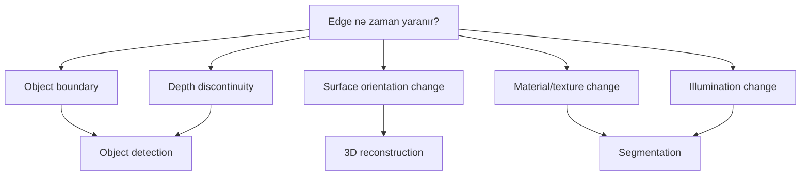

## Edge Detection-ın Əhəmiyyəti

**Practical tətbiqlər:**
- **Object detection** - Obyekt sərhədlərinin təyin edilməsi
- **Image segmentation** - Şəkili hissələrə ayırma
- **Feature extraction** - Xüsusiyyət vektorlarının çıxarılması
- **Pattern recognition** - Forma və naxış tanıma
- **Medical imaging** - Orqan və toxuma sərhədləri
- **Autonomous driving** - Yol və obyekt aşkarlama

## Edge Types

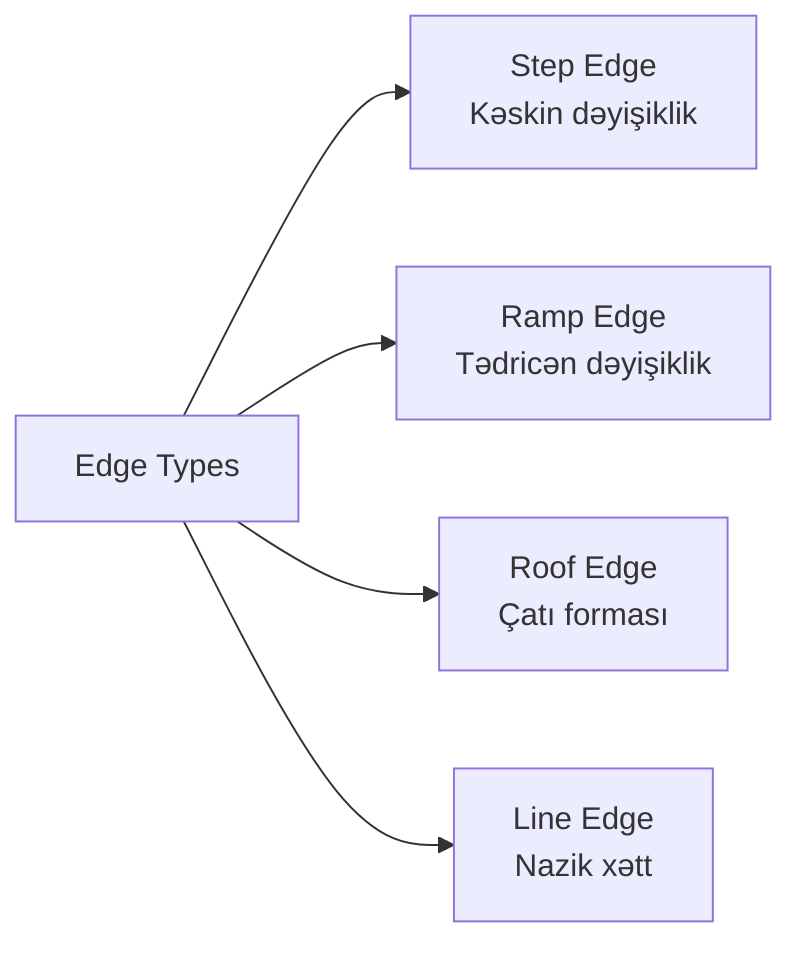

**1. Step Edge:**
```
Intensity profile:
│     ┌────────
│     │
│─────┘
└────────────→
   position
```

**2. Ramp Edge:**
```
Intensity profile:
│      ┌────
│     ╱
│    ╱
│───┘
└────────────→
```

**3. Roof Edge:**
```
Intensity profile:
│    ╱╲
│   ╱  ╲
│  ╱    ╲
│─┘      ╲─
└────────────→
```

## Gradient-based Edge Detection

Edge-lər intensivlik gradient-i ilə aşkar edilir.

### Image Gradient

Gradient vektoru intensivlik dəyişikliyin sürət və istiqamətini göstərir.

```
∇I = [∂I/∂x, ∂I/∂y] = [Ix, Iy]

Magnitude: |∇I| = √(Ix² + Iy²)
Direction: θ = arctan(Iy / Ix)
```

```mermaid
graph TD
    A[Image Gradient] --> B[Horizontal Derivative<br/>∂I/∂x]
    A --> C[Vertical Derivative<br/>∂I/∂y]
    B --> D[Gradient Magnitude<br/>√(Ix² + Iy²)]
    C --> D
    B --> E[Gradient Direction<br/>arctan(Iy/Ix)]
    C --> E
    D --> F[Edge strength]
    E --> G[Edge orientation]
```

### Derivative Approximation

Diskret şəkillərdə törəmə finite difference ilə hesablanır.

**First-order derivatives:**
```
Forward difference:  Ix(x,y) = I(x+1,y) - I(x,y)
Backward difference: Ix(x,y) = I(x,y) - I(x-1,y)
Central difference:  Ix(x,y) = [I(x+1,y) - I(x-1,y)] / 2
```

## Classical Edge Detectors

### 1. Sobel Operator

Sobel ən populyar gradient-based edge detector-dır.

**Kernel-lər:**
```
Sobel X:              Sobel Y:
┌──────────────┐     ┌──────────────┐
│ -1   0   1  │     │ -1  -2  -1  │
│ -2   0   2  │     │  0   0   0  │
│ -1   0   1  │     │  1   2   1  │
└──────────────┘     └──────────────┘
```

**Xüsusiyyətlər:**
- Smoothing effekti var (noise-a qarşı robust)
- Center pixel-ə çəki verir (-2, 2)
- Fast computation
- Widely used

```mermaid
graph LR
    A[Sobel Detection] --> B[Apply Sobel X]
    A --> C[Apply Sobel Y]
    B --> D[Gx]
    C --> E[Gy]
    D --> F[Magnitude<br/>√(Gx² + Gy²)]
    E --> F
    F --> G[Threshold]
    G --> H[Binary Edge Map]
```

**Implementation:**
```python
import cv2
import numpy as np

# Grayscale image oxu
image = cv2.imread('image.jpg', cv2.IMREAD_GRAYSCALE)

# Sobel derivatives
sobel_x = cv2.Sobel(image, cv2.CV_64F, 1, 0, ksize=3)
sobel_y = cv2.Sobel(image, cv2.CV_64F, 0, 1, ksize=3)

# Magnitude
magnitude = np.sqrt(sobel_x**2 + sobel_y**2)

# Threshold
edges = magnitude > threshold_value
```

### 2. Prewitt Operator

Sobel-ə oxşar, lakin uniform weights.

**Kernel-lər:**
```
Prewitt X:            Prewitt Y:
┌──────────────┐     ┌──────────────┐
│ -1   0   1  │     │ -1  -1  -1  │
│ -1   0   1  │     │  0   0   0  │
│ -1   0   1  │     │  1   1   1  │
└──────────────┘     └──────────────┘
```

**Fərq Sobel-dən:**
- Bütün qonşu pixel-lərə eyni çəki verir
- Daha az smoothing effekti
- Noise-a daha həssas

### 3. Roberts Cross Operator

Ən sadə diagonal gradient operatoru (2×2).

**Kernel-lər:**
```
Roberts X:       Roberts Y:
┌─────────┐     ┌─────────┐
│  1   0 │     │  0   1 │
│  0  -1 │     │ -1   0 │
└─────────┘     └─────────┘
```

**Xüsusiyyətlər:**
- Çox fast
- Diagonal edge-lərə həssas
- Noise-a çox həssas
- 45° rotation

### 4. Laplacian Operator

Second-order derivative, edge location-u dəqiq tapır.

**Kernel (4-connectivity):**
```
┌──────────────┐
│  0   1   0  │
│  1  -4   1  │
│  0   1   0  │
└──────────────┘
```

**Kernel (8-connectivity):**
```
┌──────────────┐
│  1   1   1  │
│  1  -8   1  │
│  1   1   1  │
└──────────────┘
```

**Xüsusiyyətlər:**
- İkinci törəmə hesablayır
- Zero-crossing-də edge var
- Direction məlumatı vermir
- Noise-a çox həssas

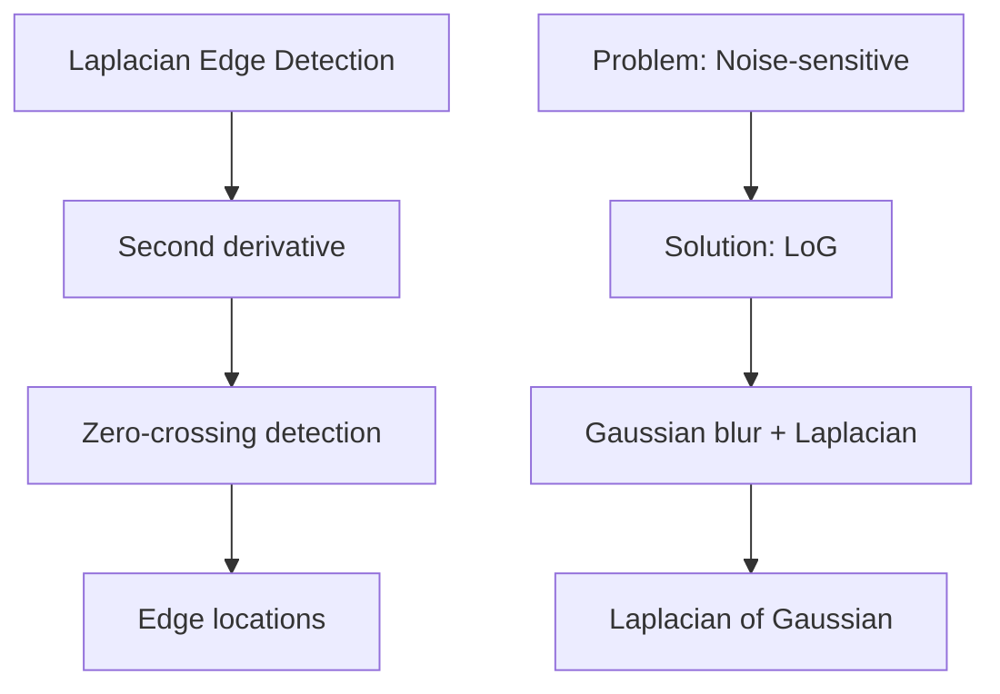

### 5. Laplacian of Gaussian (LoG)

Əvvəlcə Gaussian blur, sonra Laplacian.

**Formula:**
```
LoG(x,y) = -1/(πσ⁴) × [1 - (x²+y²)/(2σ²)] × e^(-(x²+y²)/(2σ²))
```

**5×5 LoG approximation:**
```
┌──────────────────────┐
│  0   0  -1   0   0  │
│  0  -1  -2  -1   0  │
│ -1  -2  16  -2  -1  │
│  0  -1  -2  -1   0  │
│  0   0  -1   0   0  │
└──────────────────────┘
```

**Üstünlüklər:**
- Noise reduction (Gaussian)
- Accurate edge localization (Laplacian)
- Optimal scale control (σ parametri)

## Canny Edge Detector

Canny ən optimal edge detection alqoritmidir - John Canny 1986-da təklif edib.

### Canny Kriteriləri

1. **Good detection** - Bütün edge-ləri tap, false positive az olsun
2. **Good localization** - Edge location dəqiq olsun
3. **Single response** - Hər edge üçün tək response

### Canny Alqoritmi Addımları

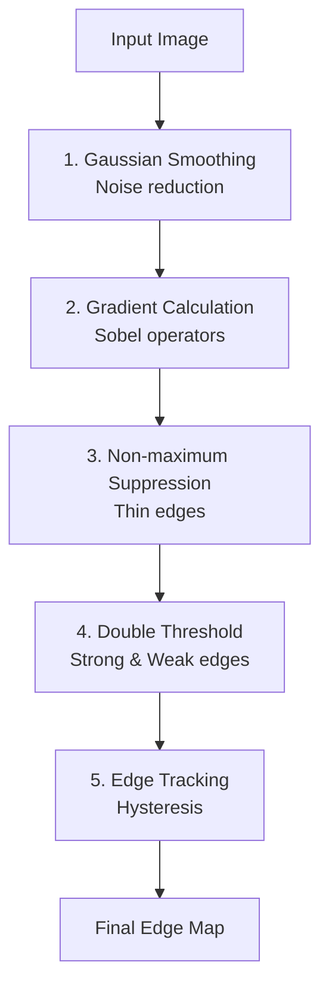

#### Addım 1: Gaussian Smoothing

Noise-u azaltmaq üçün Gaussian filter tətbiq et.

```
G(x,y) = 1/(2πσ²) × e^(-(x²+y²)/(2σ²))

Smoothed = I ⊗ G
```

**σ parametri:**
- Böyük σ → Daha çox blur → Az edge, az noise
- Kiçik σ → Az blur → Çox edge, çox noise

#### Addım 2: Gradient Calculation

Sobel operatorları ilə gradient magnitude və direction hesabla.

```
Gx = Sobel_x ⊗ Smoothed
Gy = Sobel_y ⊗ Smoothed

Magnitude: M = √(Gx² + Gy²)
Direction: θ = arctan(Gy/Gx)
```

#### Addım 3: Non-maximum Suppression (NMS)

Thick edge-ləri incəldərək, yalnız lokal maksimum saxla.

**Prinsip:**
- Gradient direction boyunca qonşu pixel-lərə bax
- Əgər cari pixel maksimum deyilsə, suppress et (0 et)

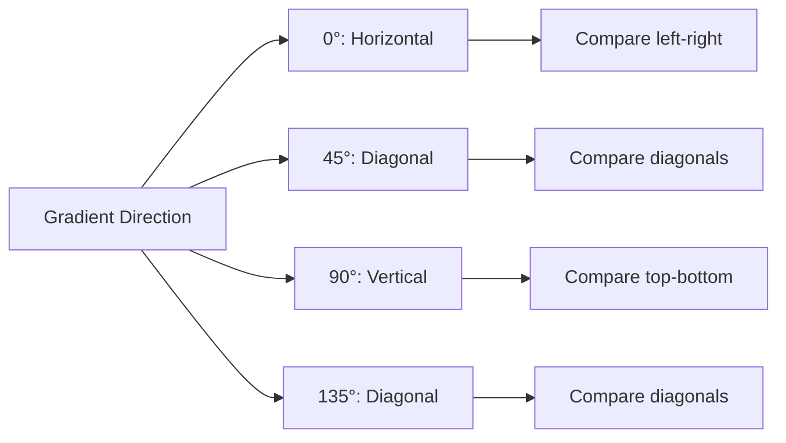

**Misal:**
```
Direction ≈ 0° (horizontal):
Compare: left neighbor ← [current] → right neighbor

Gradient magnitude:
... 50  100  80  ...
        ↑
    Keep only if maximum
```

#### Addım 4: Double Thresholding

İki threshold istifadə edərək edge-ləri 3 kateqoriyaya ayır.

```
Strong edges:   M(x,y) > high_threshold
Weak edges:     low_threshold < M(x,y) ≤ high_threshold
Non-edges:      M(x,y) ≤ low_threshold
```

**Threshold seçimi:**
```
Typical ratio: high_threshold = 2 × low_threshold
                or high = 3 × low

Example: low = 50, high = 150
```

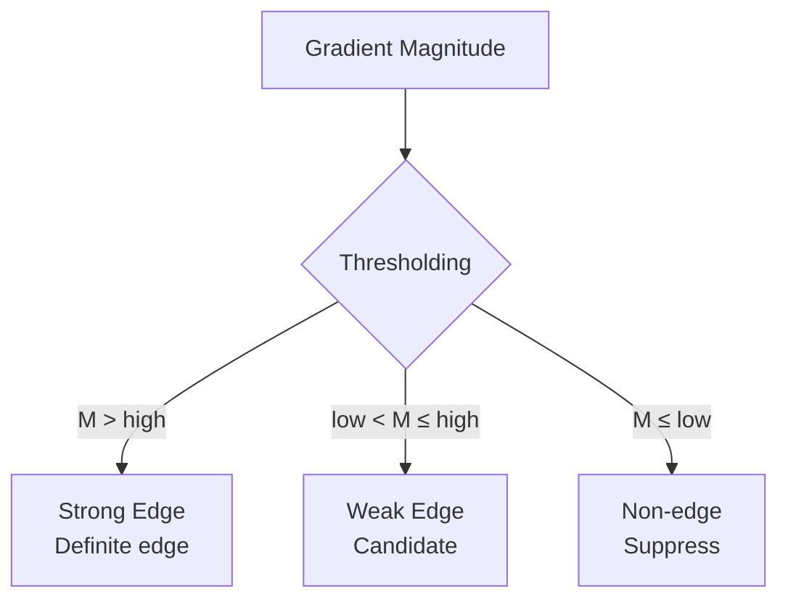

#### Addım 5: Edge Tracking by Hysteresis

Weak edge-ləri strong edge-lərə bağlı olaraq qəbul et və ya rədd et.

**Qayda:**
- Weak edge strong edge-ə qonşudursa → Qəbul et
- Weak edge isolated-dirsa → Rədd et

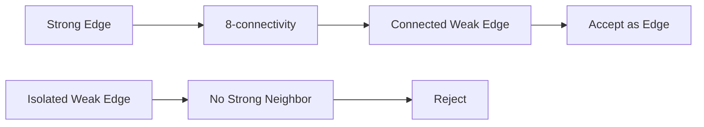

**Niyə hysteresis:**
- False edge-ləri azaldır
- Broken edge-ləri birləşdirir
- Robust edge map yaradır

### Canny Implementation

```python
import cv2

# Image oxu
image = cv2.imread('image.jpg', cv2.IMREAD_GRAYSCALE)

# Canny edge detection
edges = cv2.Canny(image, 
                  threshold1=50,   # Low threshold
                  threshold2=150,  # High threshold
                  apertureSize=3,  # Sobel kernel size
                  L2gradient=True) # Use L2 norm

# Manual implementation
# 1. Gaussian blur
blurred = cv2.GaussianBlur(image, (5, 5), 1.4)

# 2. Gradient calculation
grad_x = cv2.Sobel(blurred, cv2.CV_64F, 1, 0, ksize=3)
grad_y = cv2.Sobel(blurred, cv2.CV_64F, 0, 1, ksize=3)
magnitude = np.sqrt(grad_x**2 + grad_y**2)
direction = np.arctan2(grad_y, grad_x)

# 3-5: NMS, thresholding, hysteresis
# (complex implementation)
```

## Alqoritmlərin Müqayisəsi

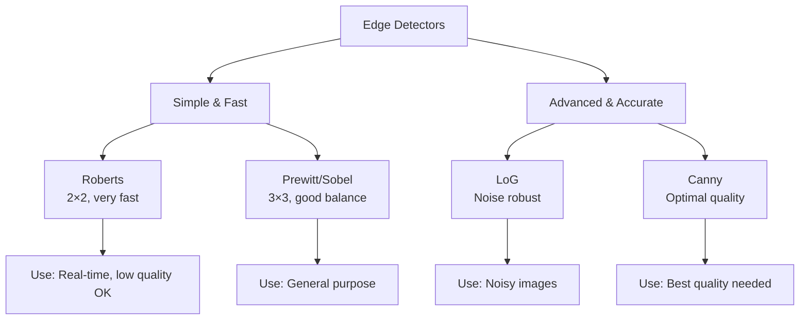

| Operator | Complexity | Noise Robustness | Edge Quality | Speed |
|----------|-----------|------------------|--------------|-------|
| Roberts | O(n) | Zəif | Aşağı | Çox sürətli |
| Prewitt | O(n) | Orta | Orta | Sürətli |
| Sobel | O(n) | Yaxşı | Yaxşı | Sürətli |
| Laplacian | O(n) | Zəif | Orta | Sürətli |
| LoG | O(n log n) | Çox yaxşı | Yaxşı | Orta |
| Canny | O(n log n) | Əla | Əla | Yavaş |

## Parameter Tuning

### Gaussian σ (Smoothing)

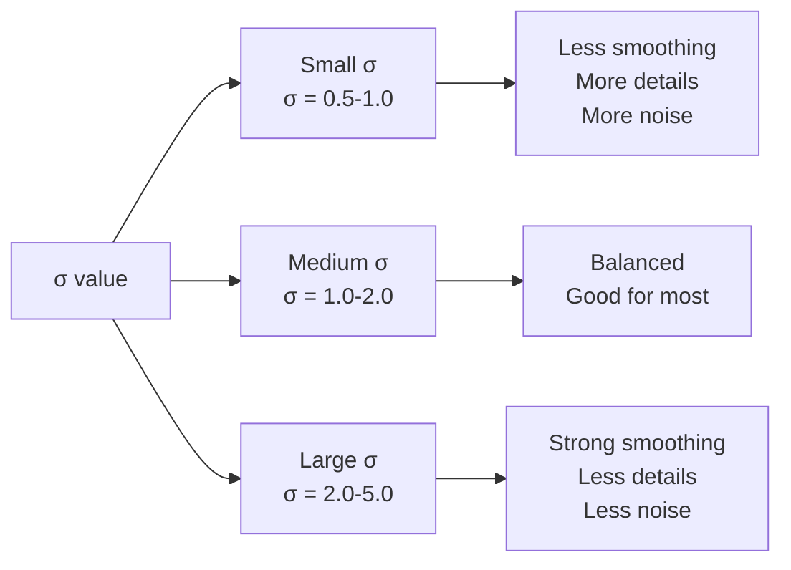

### Threshold Selection

**Manual tuning:**
```python
# Otsu's method ilə avtomatik threshold
high_thresh, _ = cv2.threshold(magnitude, 0, 255, 
                               cv2.THRESH_BINARY + cv2.THRESH_OTSU)
low_thresh = 0.5 * high_thresh

# Percentile-based
low_thresh = np.percentile(magnitude, 70)
high_thresh = np.percentile(magnitude, 90)
```

**Adaptive approach:**
- Histogram analysis
- Image statistics
- Application-specific tuning

## Advanced Techniques

### 1. Multi-scale Edge Detection

Müxtəlif σ dəyərləri ilə edge detection.

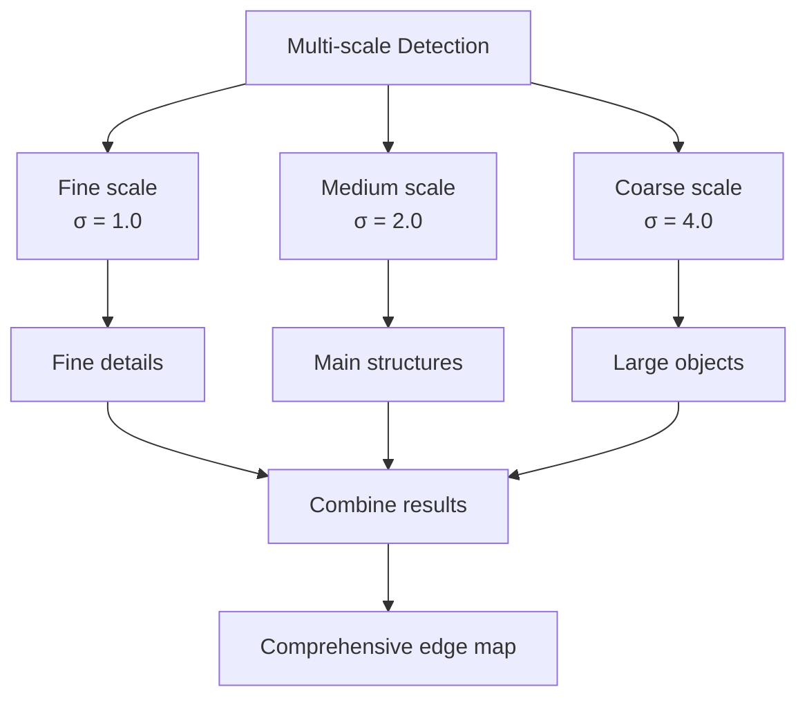

### 2. Oriented Edge Detection

Specific direction-da edge-ləri tap.

```python
# Horizontal edges only
horizontal_kernel = np.array([[-1, -1, -1],
                              [ 0,  0,  0],
                              [ 1,  1,  1]])

# Vertical edges only  
vertical_kernel = np.array([[-1, 0, 1],
                            [-1, 0, 1],
                            [-1, 0, 1]])
```

### 3. Subpixel Edge Detection

Edge location-u pixel dəqiqliyindən yüksək həll et.

- Gradient interpolation
- Polynomial fitting
- Moment-based methods

## Practical Considerations

### Edge Detection Pipeline

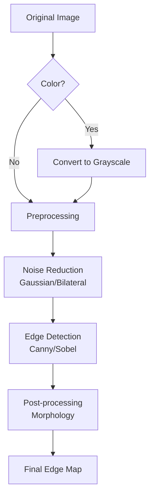

### Common Issues

**1. Noise sensitivity:**
- Solution: Pre-processing ilə filtering
- Use: Bilateral filter, median filter

**2. Broken edges:**
- Solution: Morphological closing
- Solution: Lower threshold

**3. False edges:**
- Solution: Higher threshold
- Solution: Better noise reduction

**4. Texture problem:**
- Solution: Region-based processing
- Solution: Texture filtering

## Evaluation Metrics

Edge detection keyfiyyətini necə ölçmək olar:

```
Precision = TP / (TP + FP)
Recall = TP / (TP + FN)
F1-score = 2 × (Precision × Recall) / (Precision + Recall)

TP: True Positive (düzgün edge)
FP: False Positive (yanlış edge)
FN: False Negative (tapılmayan edge)
```

## Əsas Nəticələr

1. **Edge** - İntensivlik dəyişikliyinin olduğu yerdir
2. **Gradient** - First-order derivative, magnitude və direction verir
3. **Sobel** - Ən populyar, fast və robust operator
4. **Laplacian** - Second-order, zero-crossing edge detection
5. **LoG** - Gaussian + Laplacian, noise-a robust
6. **Canny** - Optimal edge detector, 5 addımlı prosess
7. **NMS** - Edge-ləri incəldir
8. **Hysteresis** - Double threshold ilə robust edge tracking
9. **Parameter tuning** - Application-specific olaraq vacibdir
10. **Pre-processing** - Noise reduction edge quality-ni artırır
