# Image Transformations

## Transformation Nədir?

Image transformation şəklin geometric və ya spatial xüsusiyyətlərini dəyişdirən əməliyyatdır. Pixel-lərin yerini, miqyasını və ya orientasiyasını dəyişir, lakin adətən pixel intensivlik dəyərlərini saxlayır.

**Əsas transformasiya növləri:**
- **Translation** - Yerdəyişmə
- **Rotation** - Fırlanma
- **Scaling** - Miqyaslama
- **Shearing** - Kəsmə
- **Affine** - Xətti transformasiya
- **Perspective** - Perspektiv transformasiya

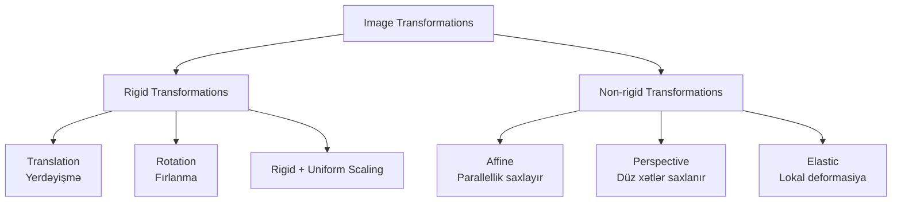

## Koordinat Sistemləri

### Source və Destination Coordinates

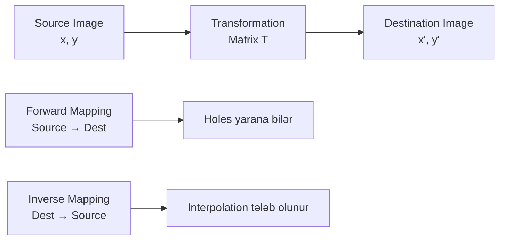

**Forward mapping:**
```
(x', y') = T(x, y)
Source-dan Destination-a
```

**Inverse mapping (praktikada istifadə olunur):**
```
(x, y) = T⁻¹(x', y')
Destination-dan Source-a
```

## Basic Transformations

### 1. Translation (Yerdəyişmə)

Şəkli horizontal və ya vertical istiqamətdə hərəkət etdirir.

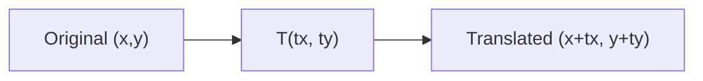

**Riyazi təsvir:**
```
x' = x + tx
y' = y + ty

Matrix forması:
│x'│   │1  0  tx│   │x│
│y'│ = │0  1  ty│ × │y│
│1 │   │0  0  1 │   │1│
```

**Homogeneous koordinatlar:**
- 2D nöqtə (x, y) → (x, y, 1)
- Translation matris ilə təmsil oluna bilir

**Implementation:**
```python
import cv2
import numpy as np

# Translation matrix
tx, ty = 50, 100  # 50 pixel sağa, 100 pixel aşağı
M = np.float32([[1, 0, tx],
                [0, 1, ty]])

# Apply transformation
height, width = image.shape[:2]
translated = cv2.warpAffine(image, M, (width, height))
```

### 2. Scaling (Miqyaslama)

Şəklin ölçüsünü dəyişir.

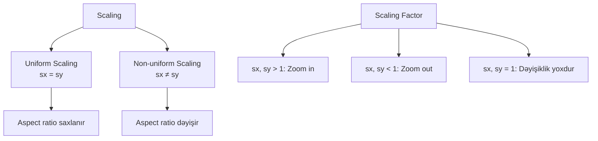

**Riyazi təsvir:**
```
x' = sx × x
y' = sy × y

Matrix forması:
│x'│   │sx  0   0│   │x│
│y'│ = │0   sy  0│ × │y│
│1 │   │0   0   1│   │1│
```

**Implementation:**
```python
# Scaling
scale_x, scale_y = 2.0, 1.5  # 2x horizontal, 1.5x vertical
M = np.float32([[scale_x, 0, 0],
                [0, scale_y, 0]])

scaled = cv2.warpAffine(image, M, (int(width*scale_x), int(height*scale_y)))

# OpenCV resize (daha çox istifadə olunur)
scaled = cv2.resize(image, None, fx=scale_x, fy=scale_y, 
                    interpolation=cv2.INTER_LINEAR)
```

### 3. Rotation (Fırlanma)

Şəkili müəyyən bir nöqtə ətrafında fırladır.

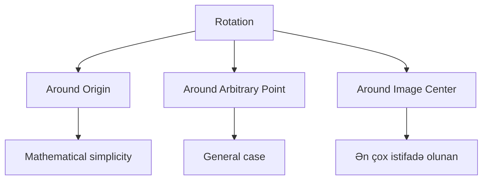

**Origin ətrafında rotation:**
```
x' = x × cos(θ) - y × sin(θ)
y' = x × sin(θ) + y × cos(θ)

Matrix forması:
│x'│   │cos(θ)  -sin(θ)  0│   │x│
│y'│ = │sin(θ)   cos(θ)  0│ × │y│
│1 │   │  0        0     1│   │1│
```

**Arbitrary point (cx, cy) ətrafında:**
```
1. Translate to origin: T(-cx, -cy)
2. Rotate: R(θ)
3. Translate back: T(cx, cy)

Combined: T(cx,cy) × R(θ) × T(-cx,-cy)
```

**Implementation:**
```python
# Center ətrafında rotation
center = (width // 2, height // 2)
angle = 45  # degrees
scale = 1.0

# Rotation matrix
M = cv2.getRotationMatrix2D(center, angle, scale)

# Apply rotation
rotated = cv2.warpAffine(image, M, (width, height))

# Without cropping (full rotated image görünür)
import math
rad = math.radians(angle)
new_width = int(abs(width * math.cos(rad)) + abs(height * math.sin(rad)))
new_height = int(abs(width * math.sin(rad)) + abs(height * math.cos(rad)))
M[0, 2] += (new_width - width) / 2
M[1, 2] += (new_height - height) / 2
rotated = cv2.warpAffine(image, M, (new_width, new_height))
```

### 4. Shearing (Kəsmə)

Şəklin formasını dəyişdirərək parallelogram yaradır.

**Horizontal shear:**
```
x' = x + shx × y
y' = y

Matrix:
│x'│   │1   shx  0│   │x│
│y'│ = │0    1   0│ × │y│
│1 │   │0    0   1│   │1│
```

**Vertical shear:**
```
x' = x
y' = y + shy × x

Matrix:
│x'│   │1    0   0│   │x│
│y'│ = │shy  1   0│ × │y│
│1 │   │0    0   1│   │1│
```

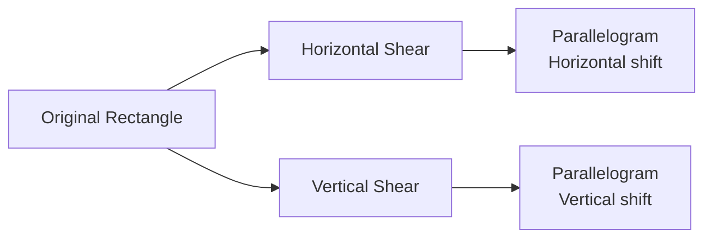

**Implementation:**
```python
# Horizontal shear
shear_x = 0.5
M = np.float32([[1, shear_x, 0],
                [0, 1, 0]])
sheared = cv2.warpAffine(image, M, (width + int(shear_x * height), height))
```

## Affine Transformation

Affine transformation xətti transformasiyadır - paralel xətlər parallel qalır, lakin açılar və məsafələr dəyişə bilər.

### Xüsusiyyətlər

**Saxlanır:**
- Düz xətlər düz qalır
- Paralel xətlər paralel qalır
- Nisbətlər saxlanır (collinearity)

**Dəyişir:**
- Açılar dəyişə bilər
- Məsafələr dəyişə bilər
- Sahələr proporsiyanal dəyişir

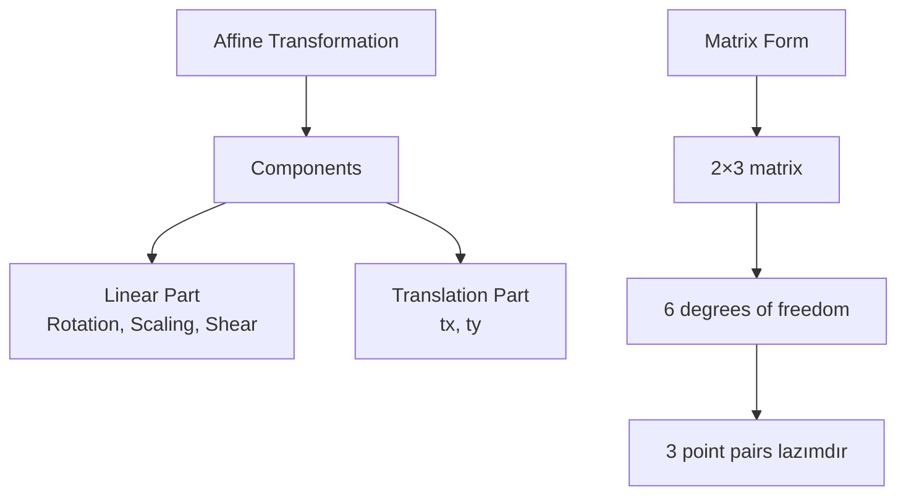

### Affine Matrix

**Ümumi forma:**
```
│x'│   │a  b  tx│   │x│
│y'│ = │c  d  ty│ × │y│
│1 │   │0  0  1 │   │1│

x' = a×x + b×y + tx
y' = c×x + d×y + ty

a, b, c, d: Linear transformation
tx, ty: Translation
```

### 3 Point-based Affine

3 cüt məlum nöqtə ilə affine matrix hesablanır.

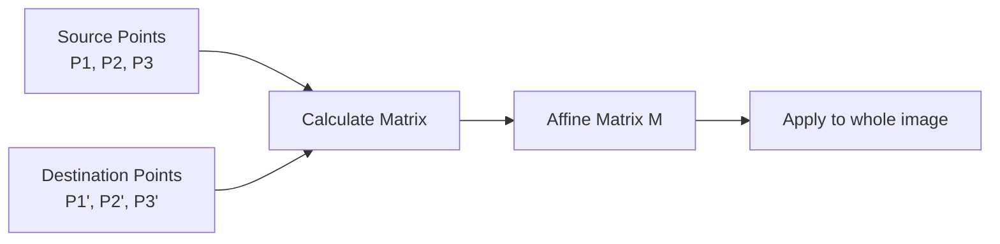

**Implementation:**
```python
# 3 point pairs
src_points = np.float32([[50, 50], [200, 50], [50, 200]])
dst_points = np.float32([[10, 100], [200, 50], [100, 250]])

# Affine matrix hesabla
M = cv2.getAffineTransform(src_points, dst_points)

# Apply transformation
result = cv2.warpAffine(image, M, (width, height))
```

## Perspective Transformation

Perspective transformation daha ümumi transformasiyadır - paralel xətlər paralel qalmaya bilər (vanishing point).

### Affine vs Perspective

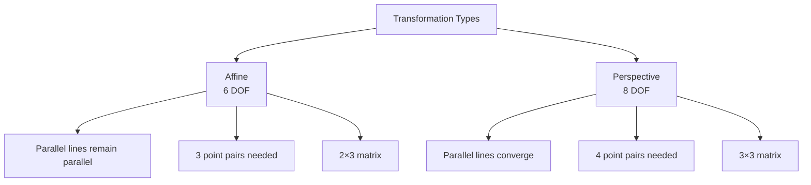

### Perspective Matrix

**Homography matrix (3×3):**
```
│x'│   │h11  h12  h13│   │x│
│y'│ = │h21  h22  h23│ × │y│
│w'│   │h31  h32  h33│   │1│

x' = (h11×x + h12×y + h13) / (h31×x + h32×y + h33)
y' = (h21×x + h22×y + h23) / (h31×x + h32×y + h33)

8 degrees of freedom (h33 = 1 normalize olunur)
```

### 4 Point-based Perspective

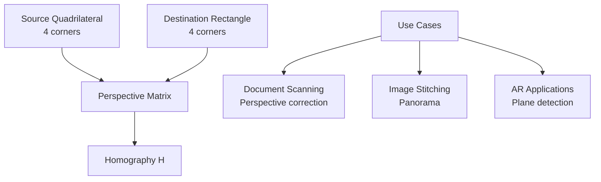

**Implementation:**
```python
# 4 corner points
# Source: arbitrary quadrilateral
src_points = np.float32([[56, 65], [368, 52], [28, 387], [389, 390]])

# Destination: rectangle
width, height = 300, 400
dst_points = np.float32([[0, 0], [width, 0], [0, height], [width, height]])

# Perspective matrix
M = cv2.getPerspectiveTransform(src_points, dst_points)

# Apply transformation
result = cv2.warpPerspective(image, M, (width, height))
```

### Document Scanning Example


**Practical implementation:**
```python
def order_points(pts):
    """4 nöqtəni TL, TR, BR, BL sırası ilə düz"""
    rect = np.zeros((4, 2), dtype="float32")
    
    # Top-left: ən kiçik sum
    s = pts.sum(axis=1)
    rect[0] = pts[np.argmin(s)]
    
    # Bottom-right: ən böyük sum
    rect[2] = pts[np.argmax(s)]
    
    # Top-right: ən kiçik diff
    diff = np.diff(pts, axis=1)
    rect[1] = pts[np.argmin(diff)]
    
    # Bottom-left: ən böyük diff
    rect[3] = pts[np.argmax(diff)]
    
    return rect

def four_point_transform(image, pts):
    """4 nöqtə ilə perspective correction"""
    rect = order_points(pts)
    (tl, tr, br, bl) = rect
    
    # Target width və height hesabla
    widthA = np.sqrt(((br[0] - bl[0]) ** 2) + ((br[1] - bl[1]) ** 2))
    widthB = np.sqrt(((tr[0] - tl[0]) ** 2) + ((tr[1] - tl[1]) ** 2))
    maxWidth = max(int(widthA), int(widthB))
    
    heightA = np.sqrt(((tr[0] - br[0]) ** 2) + ((tr[1] - br[1]) ** 2))
    heightB = np.sqrt(((tl[0] - bl[0]) ** 2) + ((tl[1] - bl[1]) ** 2))
    maxHeight = max(int(heightA), int(heightB))
    
    # Destination points
    dst = np.array([
        [0, 0],
        [maxWidth - 1, 0],
        [maxWidth - 1, maxHeight - 1],
        [0, maxHeight - 1]], dtype="float32")
    
    # Transform
    M = cv2.getPerspectiveTransform(rect, dst)
    warped = cv2.warpPerspective(image, M, (maxWidth, maxHeight))
    
    return warped
```

## Interpolation Methods

Transformation zamanı yeni pixel dəyərlərini hesablamaq üçün interpolation lazımdır.

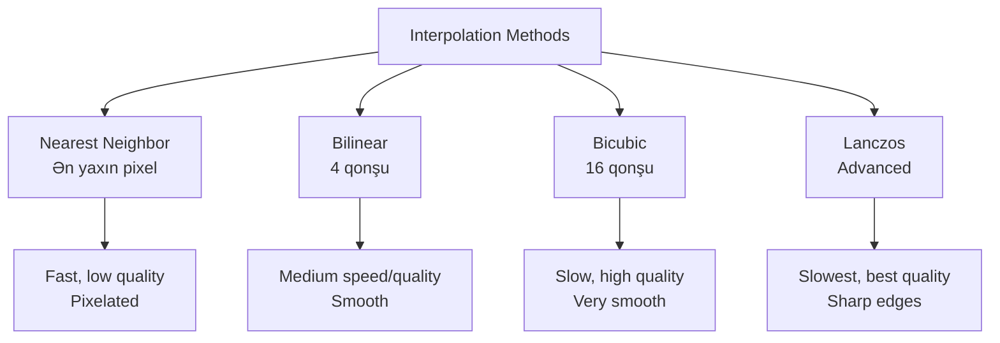

### 1. Nearest Neighbor

Ən sadə və sürətli metod.

```
I(x', y') = I(round(x), round(y))
```

**Xüsusiyyətlər:**
- O(1) complexity
- No new pixel values
- Pixelated results
- Binary image üçün yaxşıdır

### 2. Bilinear Interpolation

4 qonşu pixel-dən weighted average.

```
I(x, y) = (1-α)(1-β)I(x₀,y₀) + α(1-β)I(x₁,y₀) +
          (1-α)β I(x₀,y₁) + αβ I(x₁,y₁)

α = x - x₀
β = y - y₀
```

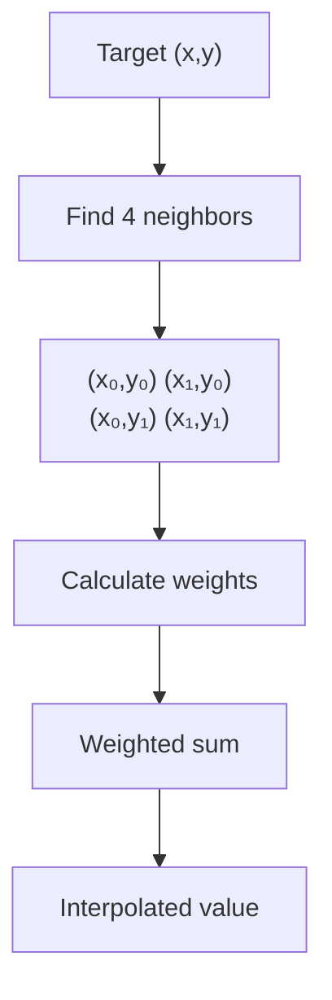

**Xüsusiyyətlər:**
- Smooth results
- Moderate computation
- General purpose

### 3. Bicubic Interpolation

16 qonşu pixel istifadə edir, cubic polynomial fit.

**Xüsusiyyətlər:**
- Very smooth
- Higher computation
- Photo enlargement üçün yaxşı

### 4. Lanczos

Sinc function-based, high-quality resampling.

**Xüsusiyyətlər:**
- Best quality
- Sharpness preservation
- Most computationally expensive

**OpenCV implementation:**
```python
# Interpolation comparison
nearest = cv2.resize(image, (new_w, new_h), interpolation=cv2.INTER_NEAREST)
bilinear = cv2.resize(image, (new_w, new_h), interpolation=cv2.INTER_LINEAR)
bicubic = cv2.resize(image, (new_w, new_h), interpolation=cv2.INTER_CUBIC)
lanczos = cv2.resize(image, (new_w, new_h), interpolation=cv2.INTER_LANCZOS4)
```

## Transformation Composition

Bir neçə transformasiyanı birləşdirmək üçün matrix vurma.

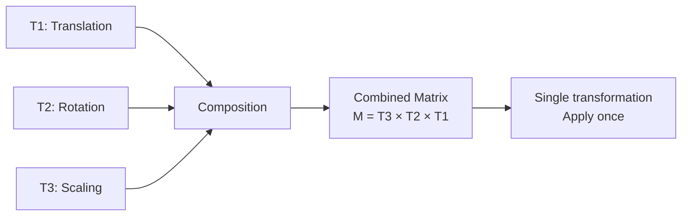

**Matrix multiplication:**
```
M_combined = M_scale × M_rotate × M_translate

Order matters!
T1 then T2 then T3: M = M3 × M2 × M1
```

**Example:**
```python
# Center-da rotate və scale
center = (width // 2, height // 2)

# 1. Translate to origin
T1 = np.float32([[1, 0, -center[0]],
                 [0, 1, -center[1]]])

# 2. Rotate
angle = np.radians(45)
R = np.float32([[np.cos(angle), -np.sin(angle), 0],
                [np.sin(angle), np.cos(angle), 0]])

# 3. Scale
S = np.float32([[2, 0, 0],
                [0, 2, 0]])

# 4. Translate back
T2 = np.float32([[1, 0, center[0]],
                 [0, 1, center[1]]])

# Combine (right to left)
M = T2 @ S @ R @ T1

# For affine (2×3), use special handling
# Or use OpenCV's getRotationMatrix2D with scale parameter
M = cv2.getRotationMatrix2D(center, 45, 2.0)  # angle, scale
result = cv2.warpAffine(image, M, (width, height))
```

## Inverse Transformation

Transformation-u geri almaq üçün inverse matrix.

```
M_inverse = M⁻¹

If: (x', y') = M(x, y)
Then: (x, y) = M⁻¹(x', y')
```

**Implementation:**
```python
# Affine inverse
M = np.float32([[1, 0.5, 50],
                [0, 1, 100]])
M_3x3 = np.vstack([M, [0, 0, 1]])  # Make it 3×3
M_inv = np.linalg.inv(M_3x3)
M_inv = M_inv[:2, :]  # Back to 2×3

# Perspective inverse
M = cv2.getPerspectiveTransform(src, dst)
M_inv = np.linalg.inv(M)
```

## Practical Applications

### 1. Image Registration

İki şəkili align etmək.

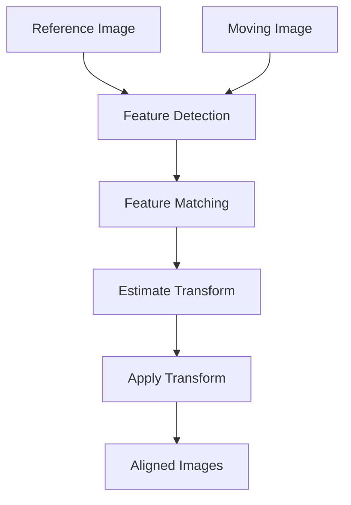

### 2. Image Stitching (Panorama)

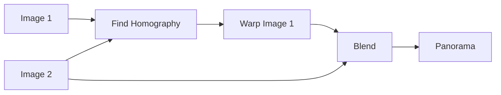

### 3. Augmented Reality

Real-world plane-də virtual object placement.

### 4. Document Scanning

Skewed document-i düzləşdirmək.

## Performance Considerations

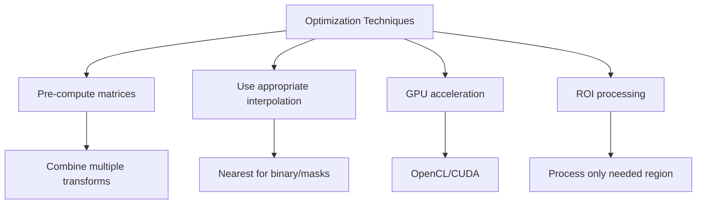

**Best practices:**
1. Combine transformations into single matrix
2. Choose interpolation based on use case
3. Use ROI when possible
4. Consider GPU for real-time applications
5. Cache transformation matrices

## Əsas Nəticələr

1. **Translation** - Yerdəyişmə, 2 DOF
2. **Rotation** - Fırlanma, nöqtə ətrafında
3. **Scaling** - Miqyaslama, uniform və ya non-uniform
4. **Affine** - 6 DOF, 3 point pairs, parallel lines saxlanır
5. **Perspective** - 8 DOF, 4 point pairs, homography
6. **Interpolation** - Yeni pixel dəyərlərinin hesablanması
7. **Inverse mapping** - Praktikada daha effektiv
8. **Matrix composition** - Bir neçə transform birləşdirmə
9. **Homogeneous coordinates** - Translation-u matrix ilə təmsil etmək üçün
10. **Applications** - Registration, stitching, AR, document scanning
