# Color Spaces

## Color Space Nədir?

Color space (rəng fəzası) rəngi rəqəmsal olaraq təmsil etmək üçün istifadə olunan koordinat sistemidir. Hər color space rəngi fərqli komponetlərlə (məsələn, RGB, HSV) təsvir edir.

**Əsas məqsədlər:**
- **Display** - Ekranda göstərmək (RGB)
- **Human perception** - İnsan görmə sisteminə uyğun (HSV, LAB)
- **Compression** - Effektiv sıxma (YCbCr)
- **Processing** - Spesifik əməliyyatlar üçün optimal

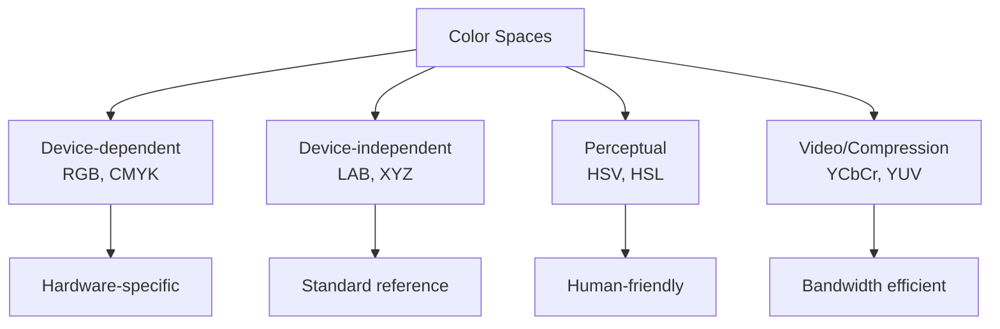

## RGB Color Space

RGB ən geniş istifadə olunan additive color model-dir - Red, Green, Blue.

### RGB Strukturu

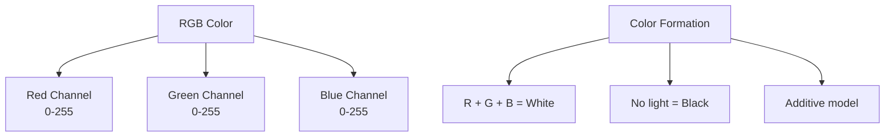

**Xüsusiyyətlər:**
- 3 kanal: R, G, B
- Hər kanal 8 bit (0-255) və ya normalized (0.0-1.0)
- 24-bit color: 16.7 milyon rəng (256³)
- Additive: Işıqlar toplanır

**Color örnəkləri:**
```
Black:   (0, 0, 0)
White:   (255, 255, 255)
Red:     (255, 0, 0)
Green:   (0, 255, 0)
Blue:    (0, 0, 255)
Yellow:  (255, 255, 0) = Red + Green
Cyan:    (0, 255, 255) = Green + Blue
Magenta: (255, 0, 255) = Red + Blue
```

### RGB Cube

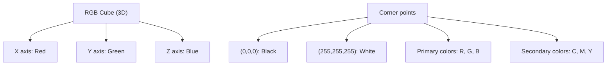

**Üstünlükləri:**
- Simple və intuitive
- Hardware support (display, camera)
- Direct pixel representation

**Çatışmazlıqları:**
- Human perception-a uyğun deyil
- Color manipulation çətin
- Brightness və color coupled

## HSV Color Space

HSV (Hue, Saturation, Value) insan rəng qavrayışına daha yaxın modeldir.

### HSV Komponetləri

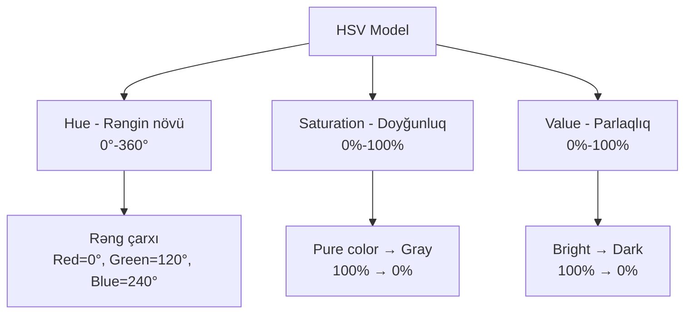

**Hue (Rəng tonu):**
- 0°-360° bucaq
- 0° = Red, 120° = Green, 240° = Blue
- Circular: 360° = 0° (Red-ə qayıdır)

**Saturation (Doyğunluq):**
- 0-100% (və ya 0-255)
- 100%: Pure, vivid color
- 0%: Gray (desaturated)

**Value (Parlaqlıq):**
- 0-100% (və ya 0-255)
- 100%: Brightest
- 0%: Black

### HSV Cylinder

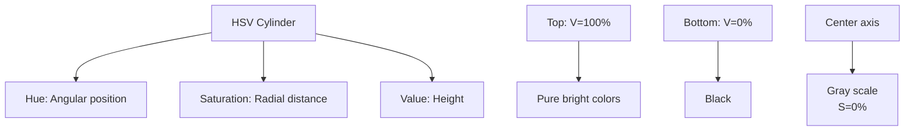

### RGB ↔ HSV Conversion

**RGB → HSV:**
```
V = max(R, G, B)

if V = 0:
    S = 0
else:
    S = (V - min(R,G,B)) / V

if V = min(R,G,B):
    H = undefined (gray)
else if V = R:
    H = 60° × (G - B) / (V - min)
else if V = G:
    H = 60° × (2 + (B - R) / (V - min))
else if V = B:
    H = 60° × (4 + (R - G) / (V - min))

if H < 0: H += 360°
```

**HSV → RGB:**
```
C = V × S
X = C × (1 - |((H/60°) mod 2) - 1|)
m = V - C

(R', G', B') depends on H:
  0° ≤ H < 60°:   (C, X, 0)
 60° ≤ H < 120°:  (X, C, 0)
120° ≤ H < 180°:  (0, C, X)
180° ≤ H < 240°:  (0, X, C)
240° ≤ H < 300°:  (X, 0, C)
300° ≤ H < 360°:  (C, 0, X)

(R, G, B) = ((R'+m), (G'+m), (B'+m))
```

**Implementation:**
```python
import cv2
import numpy as np

# RGB → HSV
rgb_image = cv2.imread('image.jpg')
hsv_image = cv2.cvtColor(rgb_image, cv2.COLOR_BGR2HSV)

# HSV → RGB
rgb_back = cv2.cvtColor(hsv_image, cv2.COLOR_HSV2BGR)

# OpenCV-də H: 0-180 (180-ə bölünür storage üçün)
# Manual conversion
h, s, v = cv2.split(hsv_image)
h_degrees = h * 2  # 0-360 aralığına convert
```

### HSV Applications

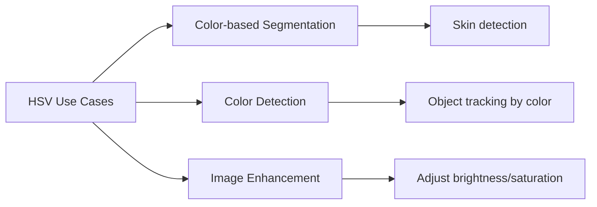

**Color range detection:**
```python
# Qırmızı obyektləri tap
lower_red1 = np.array([0, 120, 70])
upper_red1 = np.array([10, 255, 255])
lower_red2 = np.array([170, 120, 70])
upper_red2 = np.array([180, 255, 255])

mask1 = cv2.inRange(hsv_image, lower_red1, upper_red1)
mask2 = cv2.inRange(hsv_image, lower_red2, upper_red2)
red_mask = mask1 | mask2
```

## HSL Color Space

HSL (Hue, Saturation, Lightness) HSV-yə oxşar, lakin Lightness fərqlidir.

### HSL vs HSV

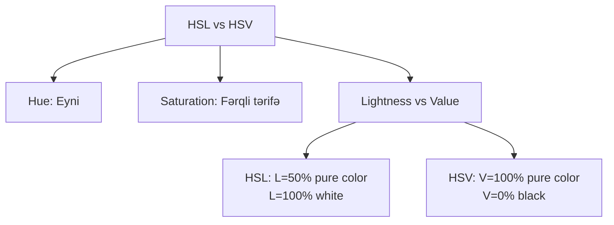

**HSL Lightness:**
- 0%: Black
- 50%: Pure color (hue)
- 100%: White

**HSV Value:**
- 0%: Black
- 100%: Pure color (at S=100%)

### HSL Bi-cone

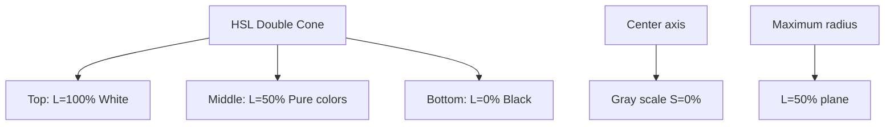

**RGB → HSL:**
```
L = (max(R,G,B) + min(R,G,B)) / 2

if max = min:
    S = 0, H = undefined
else:
    if L ≤ 0.5:
        S = (max - min) / (max + min)
    else:
        S = (max - min) / (2 - max - min)

H calculation same as HSV
```

**Implementation:**
```python
# RGB → HLS (OpenCV-də HLS adlanır)
hls_image = cv2.cvtColor(rgb_image, cv2.COLOR_BGR2HLS)

# Channels: H (0-180), L (0-255), S (0-255)
h, l, s = cv2.split(hls_image)
```

## YCbCr Color Space

YCbCr (YUV ailəsindən) video və image compression üçün istifadə olunur.

### YCbCr Komponetləri

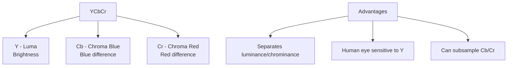

**Xüsusiyyətlər:**
- Y: Luminance (grayscale information)
- Cb, Cr: Chrominance (color information)
- Human eye Y-ə daha həssasdır
- Chroma subsampling: 4:2:0, 4:2:2

### RGB ↔ YCbCr Conversion

**RGB → YCbCr (JPEG standard):**
```
Y  = 0.299×R + 0.587×G + 0.114×B
Cb = -0.169×R - 0.331×G + 0.500×B + 128
Cr = 0.500×R - 0.419×G - 0.081×B + 128
```

**YCbCr → RGB:**
```
R = Y + 1.402×(Cr - 128)
G = Y - 0.344×(Cb - 128) - 0.714×(Cr - 128)
B = Y + 1.772×(Cb - 128)
```

**Implementation:**
```python
# RGB → YCrCb
ycrcb_image = cv2.cvtColor(rgb_image, cv2.COLOR_BGR2YCrCb)

# Split channels
y, cr, cb = cv2.split(ycrcb_image)

# Y channel: grayscale equivalent
# Skin detection üçün CrCb istifadə olunur
```

### YCbCr Applications

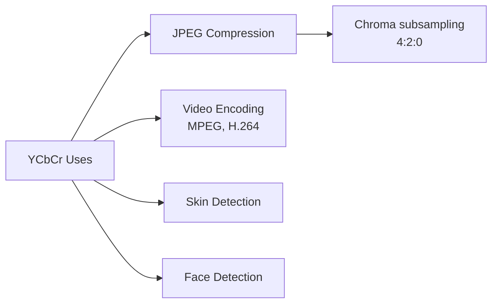

## LAB Color Space

LAB (CIELAB) human vision-ə uyğun, perceptually uniform color space-dir.

### LAB Komponetləri

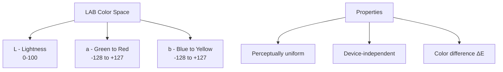

**L (Lightness):**
- 0: Black
- 100: White
- Perceptual lightness

**a channel:**
- Negative: Green
- Positive: Red
- 0: Neutral

**b channel:**
- Negative: Blue
- Positive: Yellow
- 0: Neutral

### LAB Üstünlükləri

**Perceptually uniform:**
- ΔE = √((ΔL)² + (Δa)² + (Δb)²)
- Euclidean distance ≈ perceived color difference

**Device-independent:**
- CIE XYZ-dən törəmə
- Standard reference

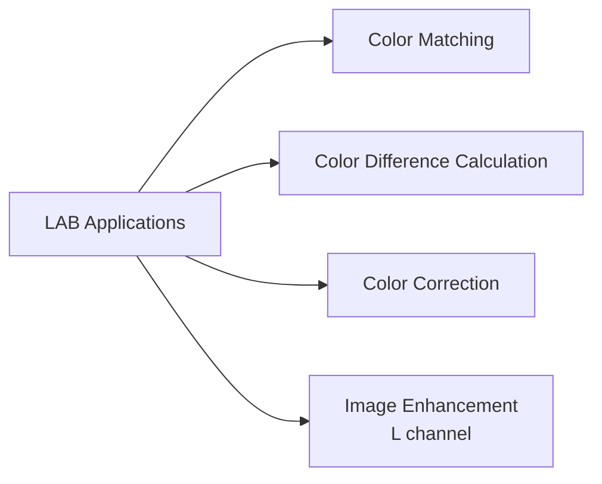

### RGB ↔ LAB Conversion

Birbaşa yox, XYZ vasitəsilə:

```
RGB → XYZ → LAB
LAB → XYZ → RGB
```

**Implementation:**
```python
# RGB → LAB
lab_image = cv2.cvtColor(rgb_image, cv2.COLOR_BGR2LAB)

# L: 0-255 (OpenCV-də), standard-da 0-100
# a, b: 0-255 (OpenCV-də shifted), standard-da -128 to +127

l, a, b = cv2.split(lab_image)

# L channel-də CLAHE (Contrast Limited AHE) apply et
clahe = cv2.createCLAHE(clipLimit=2.0, tileGridSize=(8,8))
l_enhanced = clahe.apply(l)
lab_enhanced = cv2.merge([l_enhanced, a, b])
rgb_enhanced = cv2.cvtColor(lab_enhanced, cv2.COLOR_LAB2BGR)
```

## Grayscale Conversion

Color image-i grayscale-ə çevirmək.

### Conversion Methods

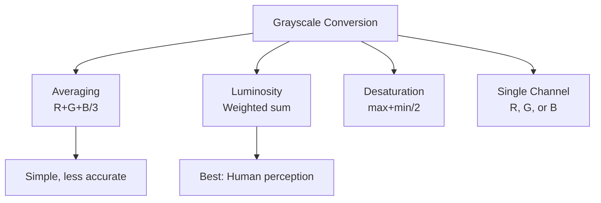

**1. Luminosity method (recommended):**
```
Gray = 0.299×R + 0.587×G + 0.114×B

Reason: Human eye-ə uyğun
- Green-ə daha həssas (58.7%)
- Red orta (29.9%)
- Blue ən az (11.4%)
```

**2. Average method:**
```
Gray = (R + G + B) / 3
```

**3. Desaturation:**
```
Gray = (max(R,G,B) + min(R,G,B)) / 2
```

**Implementation:**
```python
# Luminosity (OpenCV default)
gray = cv2.cvtColor(rgb_image, cv2.COLOR_BGR2GRAY)

# Manual
gray_manual = 0.299*rgb[:,:,2] + 0.587*rgb[:,:,1] + 0.114*rgb[:,:,0]

# Average
gray_avg = np.mean(rgb_image, axis=2).astype(np.uint8)

# Single channel
gray_red = rgb_image[:,:,2]
```

## Color Space Comparison

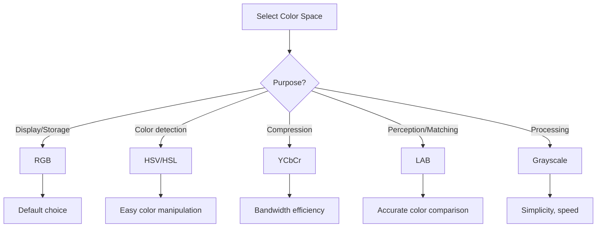

| Color Space | Channels | Range | Use Case | Perceptual |
|-------------|----------|-------|----------|------------|
| RGB | R,G,B | 0-255 | Display, storage | Zəif |
| HSV | H,S,V | H:0-360°, S,V:0-100% | Color detection | Yaxşı |
| HSL | H,S,L | H:0-360°, S,L:0-100% | Color manipulation | Yaxşı |
| YCbCr | Y,Cb,Cr | 0-255 | Compression, video | Orta |
| LAB | L,a,b | L:0-100, a,b:-128..127 | Color matching | Əla |
| Grayscale | Intensity | 0-255 | Processing | - |

## Practical Examples

### 1. Color-based Object Detection

```python
# HSV-də sarı obyekt tap
hsv = cv2.cvtColor(image, cv2.COLOR_BGR2HSV)
lower_yellow = np.array([20, 100, 100])
upper_yellow = np.array([30, 255, 255])
mask = cv2.inRange(hsv, lower_yellow, upper_yellow)
result = cv2.bitwise_and(image, image, mask=mask)
```

### 2. Skin Detection

```python
# YCrCb-də skin detection
ycrcb = cv2.cvtColor(image, cv2.COLOR_BGR2YCrCb)
lower_skin = np.array([0, 133, 77])
upper_skin = np.array([255, 173, 127])
skin_mask = cv2.inRange(ycrcb, lower_skin, upper_skin)
```

### 3. Contrast Enhancement

```python
# LAB-də L channel-ə CLAHE
lab = cv2.cvtColor(image, cv2.COLOR_BGR2LAB)
l, a, b = cv2.split(lab)
clahe = cv2.createCLAHE(clipLimit=3.0, tileGridSize=(8,8))
l_clahe = clahe.apply(l)
lab_clahe = cv2.merge([l_clahe, a, b])
enhanced = cv2.cvtColor(lab_clahe, cv2.COLOR_LAB2BGR)
```

### 4. Color Histogram Equalization

```python
# HSV-də V channel-ə histogram equalization
hsv = cv2.cvtColor(image, cv2.COLOR_BGR2HSV)
h, s, v = cv2.split(hsv)
v_eq = cv2.equalizeHist(v)
hsv_eq = cv2.merge([h, s, v_eq])
result = cv2.cvtColor(hsv_eq, cv2.COLOR_HSV2BGR)
```

## Performance Considerations

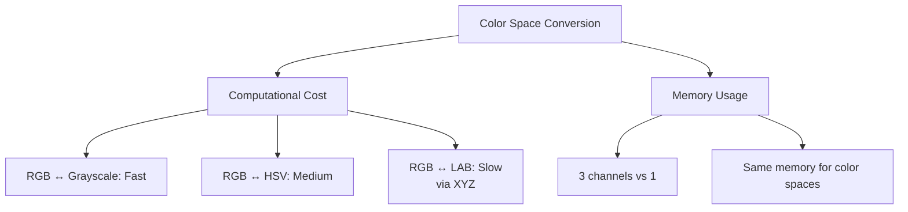

**Optimization tips:**
1. Minimize conversions - work in appropriate space
2. Cache converted images if reused
3. Use ROI (Region of Interest) when possible
4. Consider GPU for real-time applications
5. Grayscale when color not needed

## Əsas Nəticələr

1. **RGB** - Additive model, display üçün, 3 kanal (R,G,B)
2. **HSV/HSL** - Perceptual, color detection və manipulation üçün
3. **Hue** - Rəng tonu (0-360°), circular
4. **Saturation** - Rəng doyğunluğu, pure ↔ gray
5. **Value/Lightness** - Parlaqlıq komponenti
6. **YCbCr** - Luminance/chrominance separation, compression üçün
7. **LAB** - Perceptually uniform, color matching üçün
8. **Grayscale** - Luminosity method human perception-a uyğundur
9. **Color space seçimi** - Task-a görə optimal fəza seç
10. **Conversion cost** - LAB ən slow, grayscale ən fast
