# Histogram Processing

## Histogram Nədir?

Histogram şəkildəki pixel intensivlik dəyərlərinin statistik paylanmasını göstərən qrafıkdır. Hər intensivlik dəyəri üçün neçə pixel olduğunu göstərir.

**Əsas konsepsiyalar:**
- **Bins** - İntensivlik intervalları (adətən 256 bin, 0-255 üçün)
- **Frequency** - Hər bin-də neçə pixel var
- **Normalized histogram** - Frekanslar toplam pixel sayına bölünür

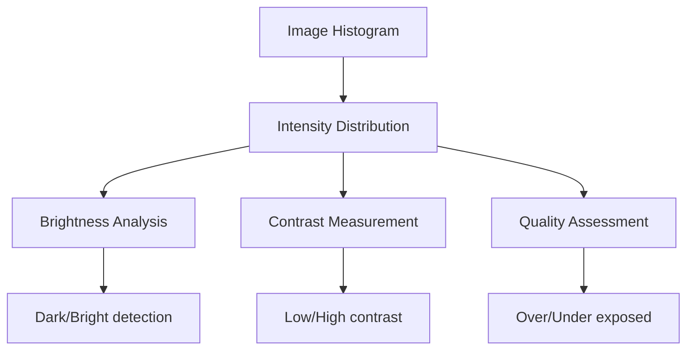

## Histogram Hesablama

### Grayscale Histogram

```
h(i) = şəkildə intensivlik dəyəri i olan pixel sayı
0 ≤ i ≤ 255 (8-bit image üçün)

Normalized:
p(i) = h(i) / (Width × Height)
```

**Implementation:**
```python
import cv2
import numpy as np
import matplotlib.pyplot as plt

# Image oxu
image = cv2.imread('image.jpg', cv2.IMREAD_GRAYSCALE)

# Histogram hesabla
histogram = cv2.calcHist([image], [0], None, [256], [0, 256])

# Və ya NumPy ilə
hist_np, bins = np.histogram(image.flatten(), 256, [0, 256])

# Visualize
plt.plot(histogram)
plt.xlabel('Pixel Intensity')
plt.ylabel('Frequency')
plt.title('Grayscale Histogram')
plt.show()
```

### Color Histogram

RGB şəkildə hər kanal üçün ayrıca histogram.

```python
# Color image
image = cv2.imread('image.jpg')

# Hər kanal üçün histogram
colors = ('b', 'g', 'r')
for i, color in enumerate(colors):
    hist = cv2.calcHist([image], [i], None, [256], [0, 256])
    plt.plot(hist, color=color)
    plt.xlim([0, 256])

plt.title('RGB Histogram')
plt.show()
```

## Histogram Analysis

### Histogram Shapes

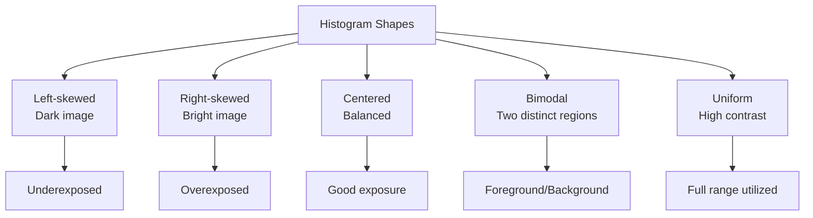

**Dark image (sol-skewed):**
```
Frequency
│     ▁▂▃▅▆▇█▅▃▂▁
│              ▁▂▁
│                 ▁
└──────────────────────→
0                    255
```

**Bright image (sağ-skewed):**
```
Frequency
│                 ▁▂▁
│              ▁▂▅▇█▆▃▁
│     ▁▂▁
└──────────────────────→
0                    255
```

**Balanced image:**
```
Frequency
│         ▃▅▇█▇▅▃
│      ▂▄▇       ▇▄▂
│   ▁▂▃             ▃▂▁
└──────────────────────→
0                    255
```

### Histogram Metrics

**1. Mean (orta dəyər):**
```
μ = Σ(i × h(i)) / N

Bright image: μ yüksək
Dark image: μ aşağı
```

**2. Standard deviation (kontrast göstəricisi):**
```
σ = √(Σ((i - μ)² × h(i)) / N)

High contrast: σ böyük
Low contrast: σ kiçik
```

**3. Dynamic range:**
```
Range = max(intensities) - min(intensities)

Full range: 0-255
Limited range: məhdud kontrast
```

## Histogram Equalization

Histogram equalization kontrasti artırmaq üçün istifadə olunur - histogram-u daha uniform edərək.

### Prinsip

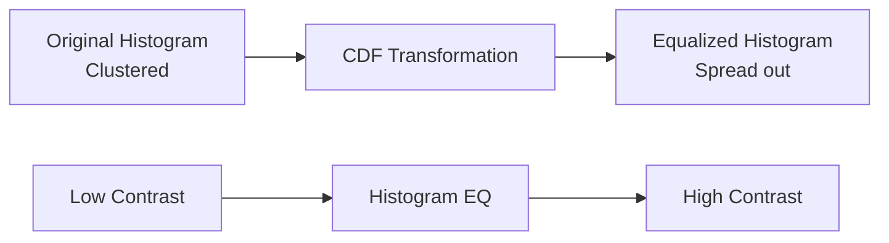

**Məqsəd:**
- İntensivlik dəyərlərini yenidən paylamaq
- Bütün intensivlik range-ni istifadə etmək
- Kontrasti artırmaq

### Algorithm

**Addımlar:**
1. Histogram hesabla: h(i)
2. Cumulative Distribution Function (CDF) hesabla
3. CDF-i normalize et
4. Yeni pixel dəyərlərini map et

**CDF (Cumulative Distribution Function):**
```
cdf(i) = Σ(h(j)) for j = 0 to i

Normalized CDF:
cdf_normalized(i) = cdf(i) / (Width × Height)

New intensity:
new(i) = round(cdf_normalized(i) × 255)
```

```mermaid
graph TD
    A[Histogram Equalization Steps] --> B[1. Calculate Histogram h(i)]
    B --> C[2. Calculate CDF]
    C --> D[3. Normalize CDF to 0-255]
    D --> E[4. Map old → new values]
    E --> F[5. Create new image]
```

**Implementation:**
```python
# OpenCV-də built-in
gray_image = cv2.imread('image.jpg', cv2.IMREAD_GRAYSCALE)
equalized = cv2.equalizeHist(gray_image)

# Manual implementation
def histogram_equalization(image):
    # Histogram
    hist, _ = np.histogram(image.flatten(), 256, [0, 256])
    
    # CDF
    cdf = hist.cumsum()
    
    # Normalize
    cdf_normalized = cdf * 255 / cdf[-1]
    
    # Map old values to new
    equalized = np.interp(image.flatten(), range(256), cdf_normalized)
    
    return equalized.reshape(image.shape).astype('uint8')
```

### Color Image Equalization

Color image-də hər kanal ayrıca equalize etmək color distortion yaradır.

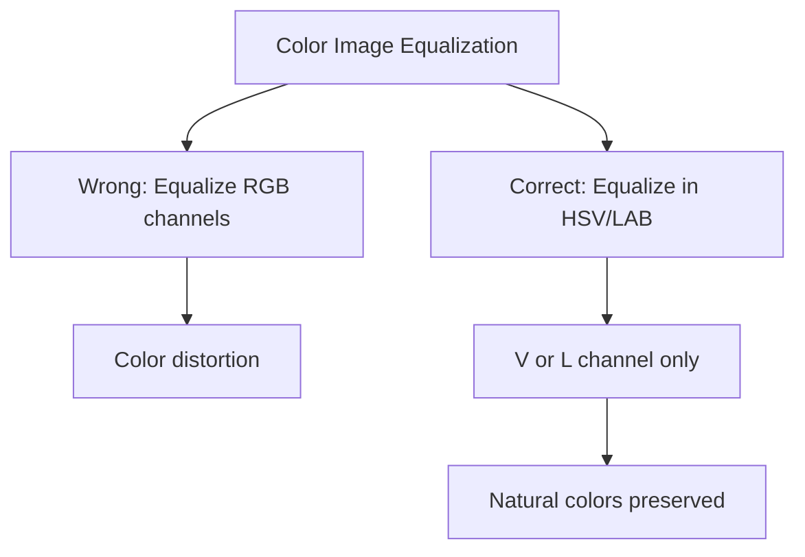

**Doğru yanaşma:**
```python
# HSV-də V channel-i equalize et
hsv = cv2.cvtColor(image, cv2.COLOR_BGR2HSV)
h, s, v = cv2.split(hsv)
v_eq = cv2.equalizeHist(v)
hsv_eq = cv2.merge([h, s, v_eq])
result = cv2.cvtColor(hsv_eq, cv2.COLOR_HSV2BGR)

# Və ya LAB-də L channel
lab = cv2.cvtColor(image, cv2.COLOR_BGR2LAB)
l, a, b = cv2.split(lab)
l_eq = cv2.equalizeHist(l)
lab_eq = cv2.merge([l_eq, a, b])
result = cv2.cvtColor(lab_eq, cv2.COLOR_LAB2BGR)
```

### Histogram Equalization Problems

**Problemlər:**
1. Noise amplification
2. Over-enhancement
3. Unnatural appearance
4. Not adaptive (global method)

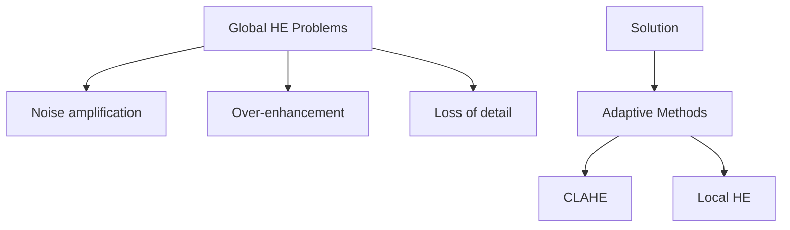

## CLAHE (Contrast Limited Adaptive Histogram Equalization)

CLAHE global histogram equalization-ın problemlərini həll edir.

### CLAHE Features

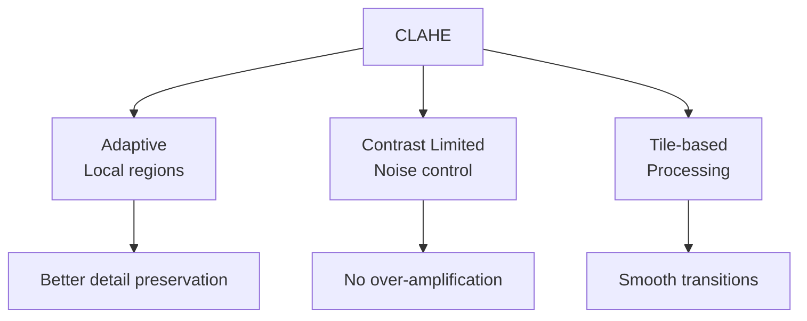

**Əsas fərqlər:**
- **Adaptive:** Şəkil tile-lara bölünür, hər tile üçün ayrıca
- **Contrast limited:** Histogram clip edilir (noise üçün)
- **Interpolation:** Tile sərhədlərində smooth transition

### CLAHE Algorithm

**Parametrlər:**
1. **Clip Limit:** Histogram clip threshold (noise control)
2. **Tile Grid Size:** Tile ölçüsü (məsələn, 8×8)

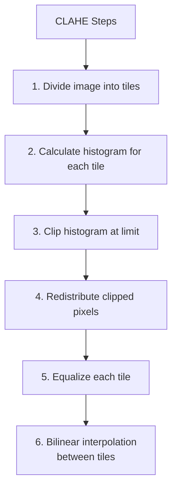

**Clip limit effekti:**
```
Original histogram:
│           █
│        ▅▆███▆▅
│     ▃▄▆       ▆▄▃
└──────────────────→

After clipping:
│        ▅▆▆▆▆▆▅     ← Clip level
│     ▃▄▆▇▇▇▇▇▇▆▄▃   ← Redistributed
└──────────────────→
```

**Implementation:**
```python
# CLAHE apply
gray = cv2.imread('image.jpg', cv2.IMREAD_GRAYSCALE)

# CLAHE object yarat
clahe = cv2.createCLAHE(clipLimit=2.0, tileGridSize=(8, 8))

# Apply
clahe_image = clahe.apply(gray)

# Color image üçün (LAB-də)
lab = cv2.cvtColor(image, cv2.COLOR_BGR2LAB)
l, a, b = cv2.split(lab)

# CLAHE yalnız L channel-ə
clahe = cv2.createCLAHE(clipLimit=3.0, tileGridSize=(8, 8))
l_clahe = clahe.apply(l)

# Merge və convert back
lab_clahe = cv2.merge([l_clahe, a, b])
result = cv2.cvtColor(lab_clahe, cv2.COLOR_LAB2BGR)
```

### CLAHE Parameters Tuning

**Clip Limit:**
- Kiçik (1.0-2.0): Conservative, az enhancement
- Orta (2.0-4.0): Balanced
- Böyük (4.0+): Aggressive, daha çox kontrast

**Tile Grid Size:**
- Kiçik tiles (4×4, 8×8): Daha lokal, daha adaptiv
- Böyük tiles (16×16, 32×32): Daha global, smooth

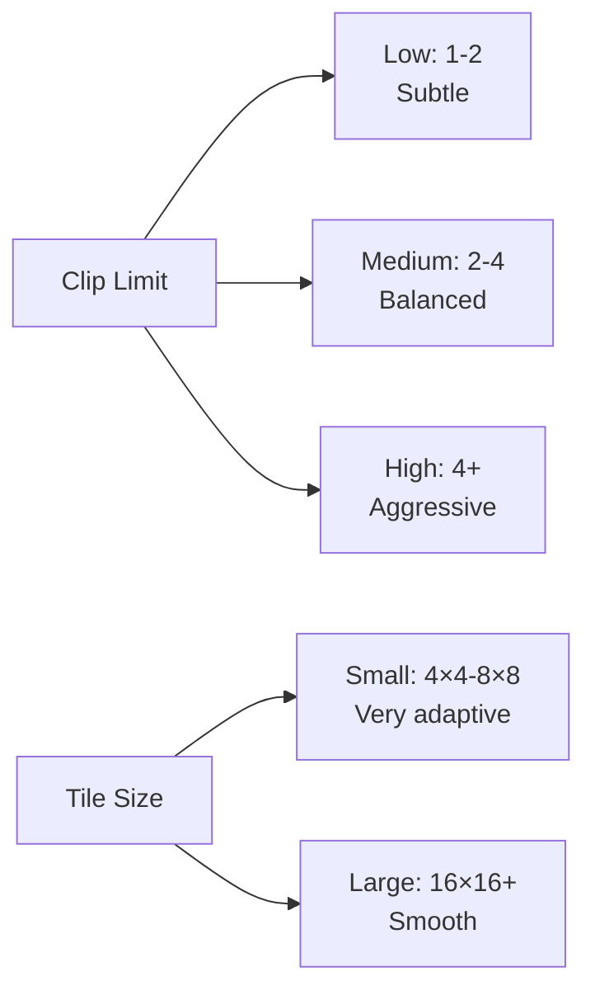

## Histogram Matching (Specification)

Bir şəklin histogram-unu reference histogram-a uyğunlaşdırmaq.

### Use Cases

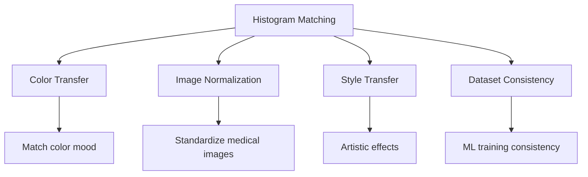

### Algorithm

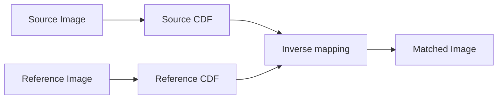

**Addımlar:**
1. Source image CDF hesabla: CDF_s
2. Reference image CDF hesabla: CDF_r
3. Hər source pixel üçün:
   - CDF_s(pixel) tap
   - CDF_r-də eyni dəyər tap
   - Yeni pixel dəyəri

**Implementation:**
```python
def histogram_matching(source, reference):
    # Histograms
    src_hist, _ = np.histogram(source.flatten(), 256, [0, 256])
    ref_hist, _ = np.histogram(reference.flatten(), 256, [0, 256])
    
    # CDFs
    src_cdf = src_hist.cumsum()
    ref_cdf = ref_hist.cumsum()
    
    # Normalize
    src_cdf = src_cdf / src_cdf[-1]
    ref_cdf = ref_cdf / ref_cdf[-1]
    
    # Lookup table
    lookup = np.zeros(256)
    for src_val in range(256):
        # Find closest match in reference CDF
        diff = np.abs(ref_cdf - src_cdf[src_val])
        lookup[src_val] = np.argmin(diff)
    
    # Apply mapping
    matched = lookup[source].astype('uint8')
    return matched

# Apply
matched_image = histogram_matching(source_gray, reference_gray)
```

## Local Histogram Processing

Hər pixel üçün local neighborhood-də histogram əməliyyatları.

### Local Histogram Equalization

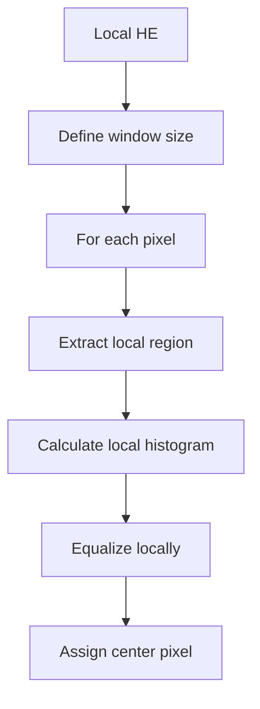

**Implementation:**
```python
def local_histogram_equalization(image, window_size=15):
    pad = window_size // 2
    padded = cv2.copyMakeBorder(image, pad, pad, pad, pad, 
                                cv2.BORDER_REFLECT)
    
    result = np.zeros_like(image)
    
    for i in range(image.shape[0]):
        for j in range(image.shape[1]):
            # Extract window
            window = padded[i:i+window_size, j:j+window_size]
            
            # Local equalization
            eq_window = cv2.equalizeHist(window)
            
            # Center pixel
            result[i, j] = eq_window[pad, pad]
    
    return result
```

## Histogram-based Thresholding

Histogram analizi ilə optimal threshold tapma.

### Otsu's Method

Automatic threshold selection - class variance minimize edir.

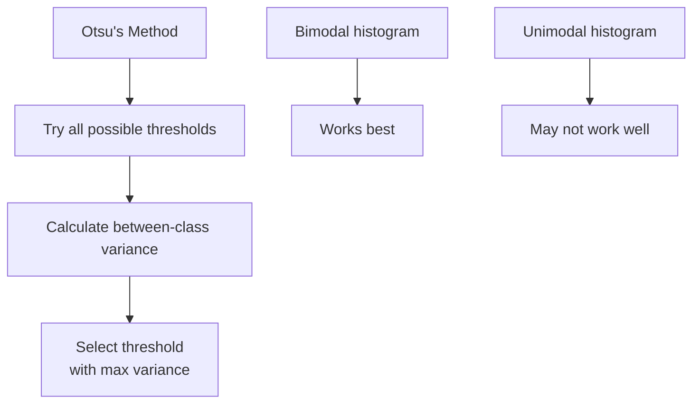

**Implementation:**
```python
# Otsu's thresholding
ret, thresh = cv2.threshold(gray, 0, 255, 
                            cv2.THRESH_BINARY + cv2.THRESH_OTSU)
print(f"Optimal threshold: {ret}")

# Manual Otsu
def otsu_threshold(image):
    hist, _ = np.histogram(image, 256, [0, 256])
    total = image.size
    
    sum_total = np.dot(range(256), hist)
    sum_bg = 0
    weight_bg = 0
    max_variance = 0
    threshold = 0
    
    for t in range(256):
        weight_bg += hist[t]
        if weight_bg == 0:
            continue
            
        weight_fg = total - weight_bg
        if weight_fg == 0:
            break
            
        sum_bg += t * hist[t]
        mean_bg = sum_bg / weight_bg
        mean_fg = (sum_total - sum_bg) / weight_fg
        
        # Between-class variance
        variance = weight_bg * weight_fg * (mean_bg - mean_fg) ** 2
        
        if variance > max_variance:
            max_variance = variance
            threshold = t
    
    return threshold
```

## Practical Applications

### 1. Low-light Image Enhancement

```python
# CLAHE ilə low-light enhancement
def enhance_low_light(image):
    lab = cv2.cvtColor(image, cv2.COLOR_BGR2LAB)
    l, a, b = cv2.split(lab)
    
    # CLAHE apply
    clahe = cv2.createCLAHE(clipLimit=3.0, tileGridSize=(8, 8))
    l_enhanced = clahe.apply(l)
    
    # Merge
    lab_enhanced = cv2.merge([l_enhanced, a, b])
    return cv2.cvtColor(lab_enhanced, cv2.COLOR_LAB2BGR)
```

### 2. Medical Image Enhancement

```python
# X-ray, MRI images üçün
def medical_enhancement(image):
    # CLAHE with aggressive parameters
    clahe = cv2.createCLAHE(clipLimit=4.0, tileGridSize=(8, 8))
    enhanced = clahe.apply(image)
    return enhanced
```

### 3. Document Image Preprocessing

```python
# Document scan-lərin keyfiyyətini artırmaq
def enhance_document(image):
    gray = cv2.cvtColor(image, cv2.COLOR_BGR2GRAY)
    
    # Adaptive equalization
    clahe = cv2.createCLAHE(clipLimit=2.0, tileGridSize=(8, 8))
    enhanced = clahe.apply(gray)
    
    # Otsu thresholding
    _, binary = cv2.threshold(enhanced, 0, 255, 
                              cv2.THRESH_BINARY + cv2.THRESH_OTSU)
    return binary
```

## Comparison of Methods

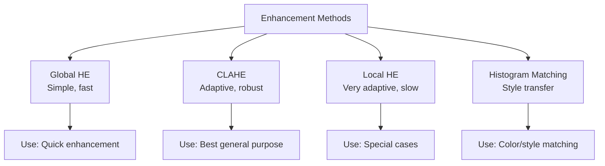

| Method | Speed | Quality | Noise | Use Case |
|--------|-------|---------|-------|----------|
| Global HE | Çox sürətli | Orta | Artırır | Quick preview |
| CLAHE | Sürətli | Yüksək | Kontrol olunur | General purpose |
| Local HE | Yavaş | Çox yüksək | Artıra bilər | Special detail |
| Hist. Matching | Orta | Situational | - | Style transfer |

## Performance Considerations

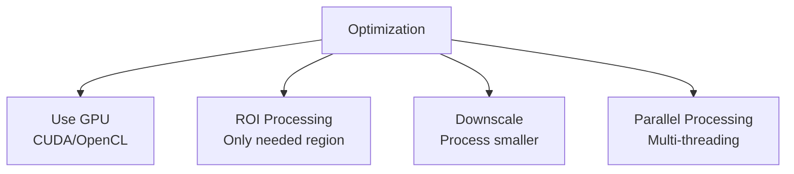

**Best practices:**
1. CLAHE built-in funksiyalardan istifadə et (optimized)
2. Color image-də yalnız luminance channel process et
3. Böyük images üçün GPU acceleration
4. Real-time üçün downscaling consider et
5. Parameter caching - eyni parametrləri reuse et

## Əsas Nəticələr

1. **Histogram** - Pixel intensivlik paylanmasını göstərir
2. **Histogram Equalization** - Kontrasti global olaraq artırır
3. **CDF** - Cumulative distribution function, mapping üçün
4. **CLAHE** - Adaptive və contrast-limited, ən yaxşı ümumi metod
5. **Clip Limit** - Noise amplification-u control edir
6. **Tile-based** - Lokal adaptasiya üçün
7. **Color images** - HSV/LAB-də luminance channel process et
8. **Histogram Matching** - Reference-ə uyğunlaşdırma
9. **Otsu's method** - Automatic optimal thresholding
10. **Applications** - Low-light, medical imaging, document processing
