# Morphological Operations

## Morphology Nədir?

Mathematical morphology şəkillərin forma və strukturunu analiz etmək və manipulyasiya etmək üçün istifadə olunan texnikalar toplusudur. Əsasən binary image-lər üçün təklif edilsə də, grayscale image-lərə də tətbiq oluna bilər.

**Əsas konsepsiyalar:**
- **Structuring element** - Morfoloji əməliyyatda istifadə olunan kiçik forma (kernel)
- **Set operations** - Binary image-lər üzərində riyazi çoxluq əməliyyatları
- **Shape analysis** - Obyekt forması və topologiyası

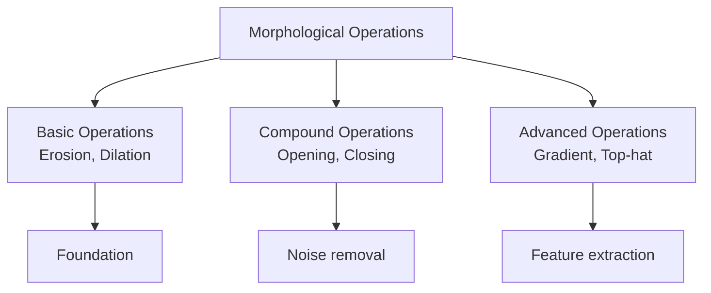

## Structuring Element

Structuring element (SE) morfoloji əməliyyatlarda istifadə olunan kiçik matrisdir - convolution-dakı kernel kimi.

### Common Shapes

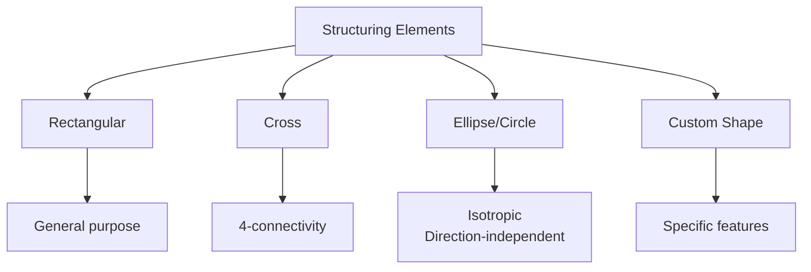

**Misal strukturlar:**

**3×3 Rectangular:**
```
┌─────────┐
│ 1  1  1 │
│ 1  1  1 │
│ 1  1  1 │
└─────────┘
```

**3×3 Cross:**
```
┌─────────┐
│ 0  1  0 │
│ 1  1  1 │
│ 0  1  0 │
└─────────┘
```

**5×5 Ellipse:**
```
┌─────────────┐
│ 0  1  1  1  0│
│ 1  1  1  1  1│
│ 1  1  1  1  1│
│ 1  1  1  1  1│
│ 0  1  1  1  0│
└─────────────┘
```

**OpenCV-də SE yaratma:**
```python
import cv2
import numpy as np

# Rectangular
rect_kernel = cv2.getStructuringElement(cv2.MORPH_RECT, (5, 5))

# Cross
cross_kernel = cv2.getStructuringElement(cv2.MORPH_CROSS, (5, 5))

# Ellipse
ellipse_kernel = cv2.getStructuringElement(cv2.MORPH_ELLIPSE, (5, 5))

# Custom
custom_kernel = np.array([[0, 1, 0],
                          [1, 1, 1],
                          [0, 1, 0]], dtype=np.uint8)
```

## Basic Operations

### 1. Erosion (Aşınma)

Erosion foreground obyekti kiçildir, boundary pixel-lərini silir.

**Prinsip:**
- Structuring element bütün image üzərində hərəkət edir
- SE tam olaraq foreground-a fit olduqda, center pixel qorunur
- Əks halda, center pixel background olur

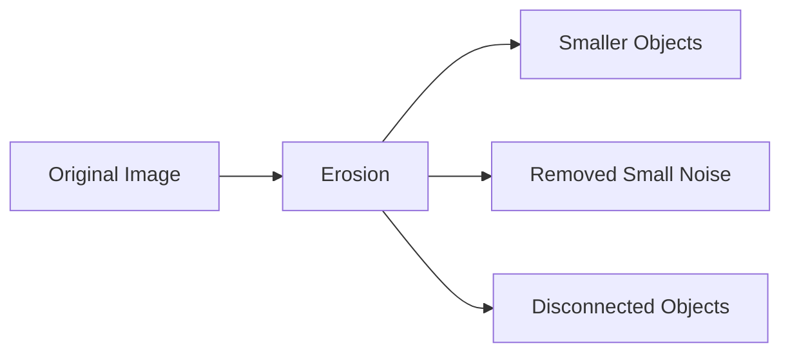

**Riyazi təsvir:**
```
A ⊖ B = {z | (B)z ⊆ A}

A: Image
B: Structuring element
(B)z: B translated by z

Erosion A-nı B ilə: Yalnız SE tamamilə A-nın içinə fit olduğu nöqtələr
```

**Implementation:**
```python
# Binary image
binary = cv2.imread('binary.jpg', cv2.IMREAD_GRAYSCALE)
_, binary = cv2.threshold(binary, 127, 255, cv2.THRESH_BINARY)

# Structuring element
kernel = np.ones((5, 5), np.uint8)

# Erosion
eroded = cv2.erode(binary, kernel, iterations=1)

# Multiple iterations
eroded_3 = cv2.erode(binary, kernel, iterations=3)
```

**Effektlər:**
- Obyektlər kiçilir
- Boundaries smooth olur
- Thin connections qırılır
- Small noise silinir

**Misal:**
```
Original:              Eroded (3×3):
┌──────────┐          ┌──────────┐
│ 0 0 0 0 0│          │ 0 0 0 0 0│
│ 0 1 1 1 0│          │ 0 0 0 0 0│
│ 0 1 1 1 0│    →     │ 0 0 1 0 0│
│ 0 1 1 1 0│          │ 0 0 0 0 0│
│ 0 0 0 0 0│          │ 0 0 0 0 0│
└──────────┘          └──────────┘
```

### 2. Dilation (Genişləmə)

Dilation foreground obyekti böyüdür, boundary-yə pixel əlavə edir.

**Prinsip:**
- SE-nin center-i foreground pixel-də olduqda
- SE-nin shape-i foreground-a əlavə olunur

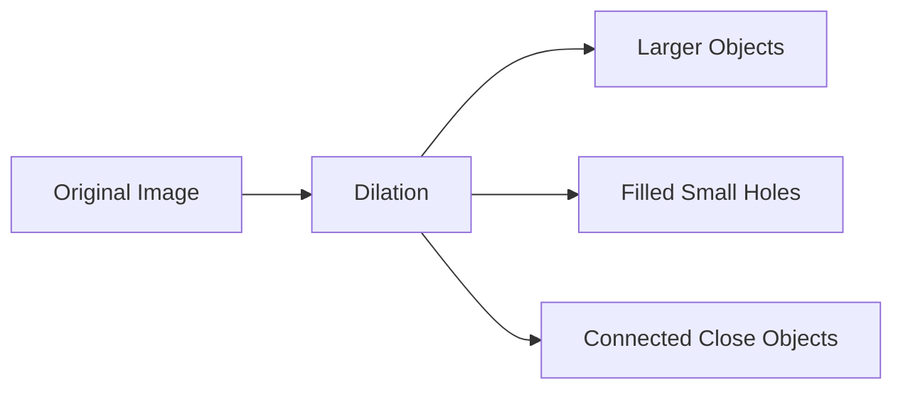

**Riyazi təsvir:**
```
A ⊕ B = {z | (B̂)z ∩ A ≠ ∅}

B̂: B-nin reflection
Dilation: SE-nin heç olmasa bir elementi A ilə overlap olduqda
```

**Implementation:**
```python
# Dilation
dilated = cv2.dilate(binary, kernel, iterations=1)

# Multiple iterations
dilated_3 = cv2.dilate(binary, kernel, iterations=3)
```

**Effektlər:**
- Obyektlər böyüyür
- Holes fill olur
- Gaps bağlanır
- Close objects birləşir

**Misal:**
```
Original:              Dilated (3×3):
┌──────────┐          ┌──────────┐
│ 0 0 0 0 0│          │ 0 1 1 1 0│
│ 0 0 0 0 0│          │ 0 1 1 1 0│
│ 0 0 1 0 0│    →     │ 1 1 1 1 1│
│ 0 0 0 0 0│          │ 0 1 1 1 0│
│ 0 0 0 0 0│          │ 0 1 1 1 0│
└──────────┘          └──────────┘
```

### Erosion vs Dilation

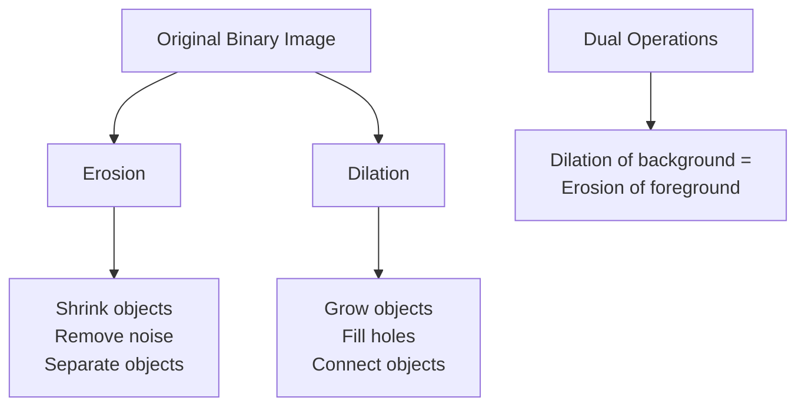

## Compound Operations

### 3. Opening

Opening = Erosion → Dilation

**Məqsəd:**
- Small noise silinir
- Thin connections qırılır
- Obyekt ölçüsü approximate qorunur

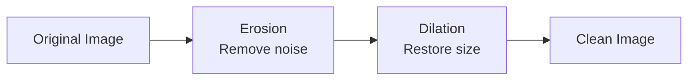

**Riyazi təsvir:**
```
A ∘ B = (A ⊖ B) ⊕ B

∘: Opening operator
```

**Implementation:**
```python
# Opening
opening = cv2.morphologyEx(binary, cv2.MORPH_OPEN, kernel)

# Manual
eroded = cv2.erode(binary, kernel, iterations=1)
opening_manual = cv2.dilate(eroded, kernel, iterations=1)
```

**Effektlər:**
- Small white noise silinir
- Thin protrusions (çıxıntılar) silinir
- Smooth outline
- Internal structure qorunur

**Practical use case:**
```python
# Salt noise (ağ nöqtələr) təmizləmək
noisy = binary.copy()
opening = cv2.morphologyEx(noisy, cv2.MORPH_OPEN, kernel)
```

### 4. Closing

Closing = Dilation → Erosion

**Məqsəd:**
- Small holes fill olur
- Small gaps bağlanır
- Obyekt ölçüsü approximate qorunur

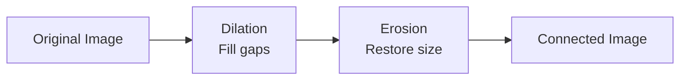

**Riyazi təsvir:**
```
A • B = (A ⊕ B) ⊖ B

•: Closing operator
```

**Implementation:**
```python
# Closing
closing = cv2.morphologyEx(binary, cv2.MORPH_CLOSE, kernel)

# Manual
dilated = cv2.dilate(binary, kernel, iterations=1)
closing_manual = cv2.erode(dilated, kernel, iterations=1)
```

**Effektlər:**
- Small black holes fill olur
- Small gaps bağlanır
- Broken contours bərpa olunur
- Smooth outline

**Practical use case:**
```python
# Pepper noise (qara nöqtələr) və gaps-i təmizləmək
broken = binary.copy()
closing = cv2.morphologyEx(broken, cv2.MORPH_CLOSE, kernel)
```

### Opening vs Closing

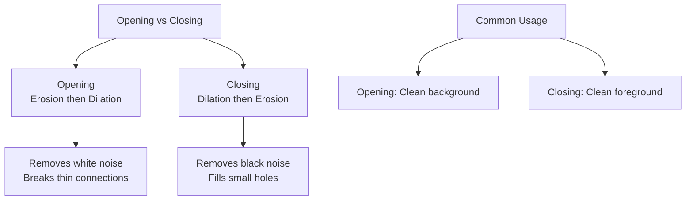

**Side-by-side comparison:**
```
Original:           Opening:           Closing:
┌────────────┐     ┌────────────┐     ┌────────────┐
│ 1 0 1 1 1 │     │ 0 0 1 1 1 │     │ 1 1 1 1 1 │
│ 0 1 1 0 1 │     │ 0 1 1 0 1 │     │ 1 1 1 1 1 │
│ 1 1 0 1 1 │  →  │ 0 1 0 1 1 │  →  │ 1 1 1 1 1 │
│ 1 1 1 1 0 │     │ 0 1 1 1 0 │     │ 1 1 1 1 1 │
│ 1 0 1 1 1 │     │ 0 0 1 1 1 │     │ 1 1 1 1 1 │
└────────────┘     └────────────┘     └────────────┘
```

## Advanced Operations

### 5. Morphological Gradient

Gradient = Dilation - Erosion

**Məqsəd:**
- Obyekt outline-ını tap
- Edge detection

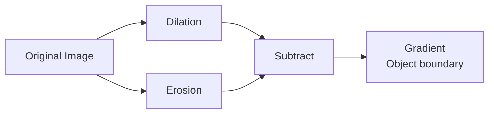

**Implementation:**
```python
# Morphological gradient
gradient = cv2.morphologyEx(binary, cv2.MORPH_GRADIENT, kernel)

# Manual
dilated = cv2.dilate(binary, kernel, iterations=1)
eroded = cv2.erode(binary, kernel, iterations=1)
gradient_manual = dilated - eroded
```

**Effekt:**
- Object boundary (outline)
- Edge thickness SE size-a bağlı

### 6. Top Hat (White Top Hat)

Top Hat = Original - Opening

**Məqsəd:**
- Bright obyektləri tap (background-dan bright)
- Small bright features


**Implementation:**
```python
# Top hat
tophat = cv2.morphologyEx(gray, cv2.MORPH_TOPHAT, kernel)

# Manual
opening = cv2.morphologyEx(gray, cv2.MORPH_OPEN, kernel)
tophat_manual = gray - opening
```

**Use case:**
- Uneven illumination correction
- Small bright object detection

### 7. Black Hat

Black Hat = Closing - Original

**Məqsəd:**
- Dark obyektləri tap (background-dan dark)
- Small dark features


**Implementation:**
```python
# Black hat
blackhat = cv2.morphologyEx(gray, cv2.MORPH_BLACKHAT, kernel)

# Manual
closing = cv2.morphologyEx(gray, cv2.MORPH_CLOSE, kernel)
blackhat_manual = closing - gray
```

**Use case:**
- Dark line detection
- Small dark object extraction

## Grayscale Morphology

Morfoloji əməliyyatlar grayscale image-lərə də tətbiq oluna bilər.

### Grayscale Erosion

```
(A ⊖ B)(x,y) = min{A(x+i, y+j) - B(i,j)}

Hər position-da local minimum tap
```

### Grayscale Dilation

```
(A ⊕ B)(x,y) = max{A(x-i, y-j) + B(i,j)}

Hər position-da local maximum tap
```

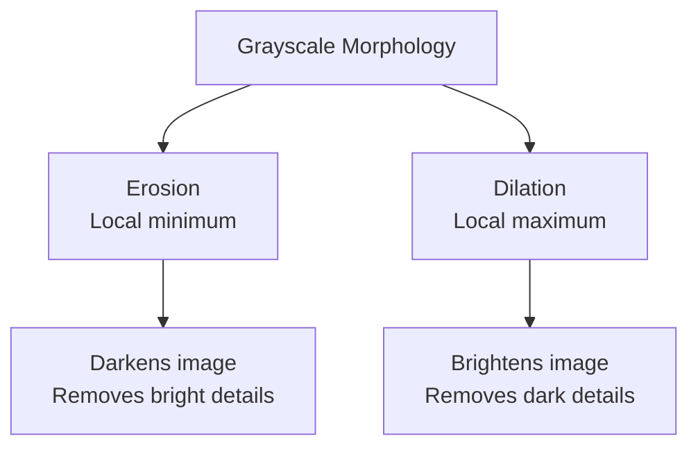

**Implementation:**
```python
# Grayscale image
gray = cv2.imread('image.jpg', cv2.IMREAD_GRAYSCALE)
kernel = np.ones((5, 5), np.uint8)

# Grayscale operations
eroded_gray = cv2.erode(gray, kernel)
dilated_gray = cv2.dilate(gray, kernel)
opening_gray = cv2.morphologyEx(gray, cv2.MORPH_OPEN, kernel)
closing_gray = cv2.morphologyEx(gray, cv2.MORPH_CLOSE, kernel)
```

## Practical Applications

### 1. Noise Removal

```python
def remove_noise(binary_image, kernel_size=5):
    """Salt and pepper noise təmizləmə"""
    kernel = np.ones((kernel_size, kernel_size), np.uint8)
    
    # Opening: ağ noise
    opening = cv2.morphologyEx(binary_image, cv2.MORPH_OPEN, kernel)
    
    # Closing: qara noise
    result = cv2.morphologyEx(opening, cv2.MORPH_CLOSE, kernel)
    
    return result
```

### 2. Text Extraction

```python
def extract_text_regions(image):
    """Document-dən text region-ları tap"""
    gray = cv2.cvtColor(image, cv2.COLOR_BGR2GRAY)
    _, binary = cv2.threshold(gray, 0, 255, cv2.THRESH_BINARY_INV + cv2.THRESH_OTSU)
    
    # Horizontal kernel: text line-ları birləşdirmək
    kernel = cv2.getStructuringElement(cv2.MORPH_RECT, (25, 1))
    dilated = cv2.dilate(binary, kernel, iterations=1)
    
    # Find contours
    contours, _ = cv2.findContours(dilated, cv2.RETR_EXTERNAL, cv2.CHAIN_APPROX_SIMPLE)
    
    return contours
```

### 3. Skeleton Extraction

```python
def skeletonize(binary_image):
    """Obyektin skeleton-unu tap"""
    skeleton = np.zeros(binary_image.shape, np.uint8)
    element = cv2.getStructuringElement(cv2.MORPH_CROSS, (3, 3))
    
    while True:
        eroded = cv2.erode(binary_image, element)
        temp = cv2.dilate(eroded, element)
        temp = cv2.subtract(binary_image, temp)
        skeleton = cv2.bitwise_or(skeleton, temp)
        binary_image = eroded.copy()
        
        if cv2.countNonZero(binary_image) == 0:
            break
    
    return skeleton
```

### 4. Boundary Extraction

```python
def extract_boundary(binary_image, kernel_size=3):
    """Obyekt boundary-sini tap"""
    kernel = np.ones((kernel_size, kernel_size), np.uint8)
    
    # Erosion
    eroded = cv2.erode(binary_image, kernel)
    
    # Boundary = Original - Eroded
    boundary = cv2.subtract(binary_image, eroded)
    
    return boundary
```

### 5. Hole Filling

```python
def fill_holes(binary_image):
    """Binary image-də hole-ları fill et"""
    # Invert
    inverted = cv2.bitwise_not(binary_image)
    
    # Flood fill from (0,0)
    h, w = binary_image.shape[:2]
    mask = np.zeros((h+2, w+2), np.uint8)
    cv2.floodFill(inverted, mask, (0, 0), 255)
    
    # Invert back
    inverted = cv2.bitwise_not(inverted)
    
    # Combine
    filled = cv2.bitwise_or(binary_image, inverted)
    
    return filled
```

### 6. Connected Component Analysis

```python
def analyze_components(binary_image):
    """Connected component analysis"""
    # Opening: noise təmizlə
    kernel = np.ones((3, 3), np.uint8)
    cleaned = cv2.morphologyEx(binary_image, cv2.MORPH_OPEN, kernel)
    
    # Label connected components
    num_labels, labels, stats, centroids = cv2.connectedComponentsWithStats(cleaned)
    
    # Filter by area
    min_area = 100
    result = np.zeros_like(binary_image)
    
    for i in range(1, num_labels):  # 0 is background
        area = stats[i, cv2.CC_STAT_AREA]
        if area > min_area:
            result[labels == i] = 255
    
    return result, num_labels - 1
```

## Structuring Element Size Selection

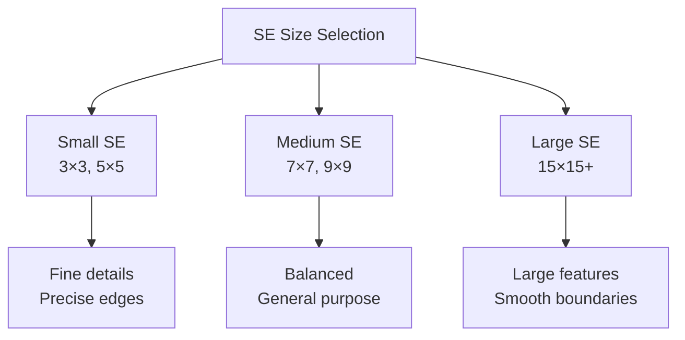

**Guidelines:**
- **3×3:** Minimal effect, fine control
- **5×5:** Standard choice, balanced
- **7×7+:** Stronger effect, smooth results
- **Custom size:** Feature size-a uyğun seç

## Iteration Count

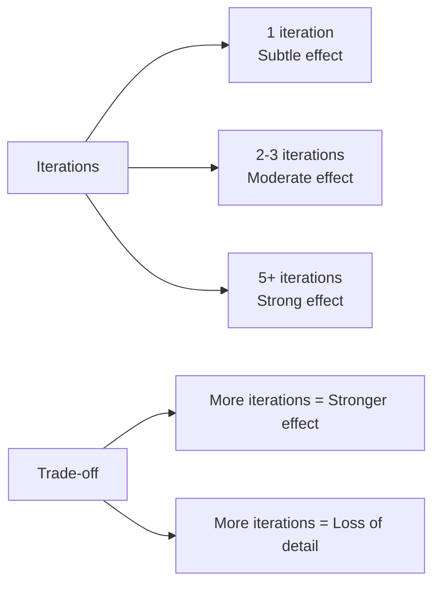

## Operations Summary

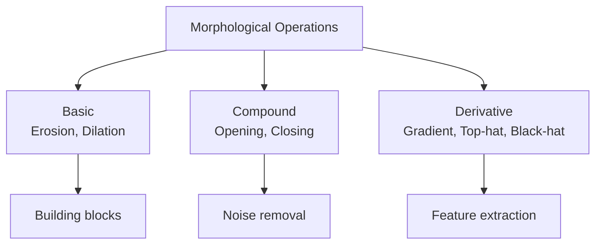

| Operation | Formula | Purpose | Use Case |
|-----------|---------|---------|----------|
| Erosion | A ⊖ B | Shrink objects | Noise removal, separate objects |
| Dilation | A ⊕ B | Grow objects | Fill holes, connect objects |
| Opening | (A ⊖ B) ⊕ B | Remove white noise | Clean background |
| Closing | (A ⊕ B) ⊖ B | Remove black noise | Fill holes, connect |
| Gradient | (A ⊕ B) - (A ⊖ B) | Extract boundary | Edge detection |
| Top Hat | A - (A ∘ B) | Bright features | Uneven illumination |
| Black Hat | (A • B) - A | Dark features | Dark line detection |

## Performance Considerations

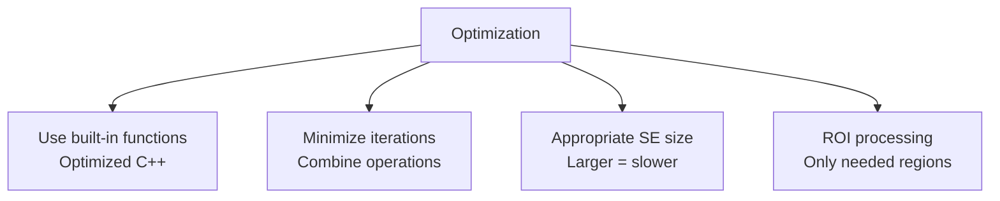

**Best practices:**
1. OpenCV built-in funksiyalardan istifadə et
2. Large kernels yavaşdır - lazım olduqda istifadə et
3. Multiple iterations əvəzinə larger kernel consider et
4. Binary operations grayscale-dən sürətlidir
5. GPU acceleration for real-time

## Əsas Nəticələr

1. **Erosion** - Obyekti kiçildir, noise silir
2. **Dilation** - Obyekti böyüdür, hole-ları fill edir
3. **Opening** - Erosion+Dilation, white noise təmizləyir
4. **Closing** - Dilation+Erosion, black noise təmizləyir
5. **Structuring element** - Shape və size effektə təsir edir
6. **Morphological gradient** - Boundary extraction
7. **Top/Black hat** - Feature extraction, illumination correction
8. **Grayscale morphology** - Local min/max əməliyyatları
9. **Applications** - Noise removal, text extraction, skeleton, boundary
10. **Iteration count** - Effect strength-i control edir
