# Image Compression

## Compression Nədir?

Image compression şəkilin file size-ını azaltmaq üçün istifadə olunan texnikalar toplusudur. Compression data-nı daha effektiv təmsil etməklə storage və bandwidth tələblərini azaldır.

**Əsas məqsədlər:**
- **Storage** - Daha az disk space
- **Bandwidth** - Sürətli transfer
- **Cost** - Storage və network xərclərini azalt
- **Performance** - Daha sürətli yükləmə

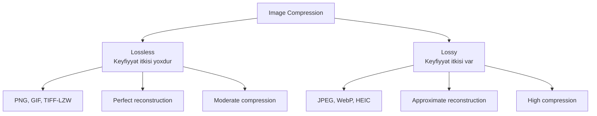

## Compression Fundamentals

### Information Theory Basics

**Redundancy növləri:**

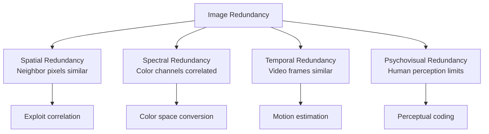

**Entropy:**
```
H = -∑ P(i) log₂ P(i)

H: Entropy (average bits/symbol)
P(i): Probability of symbol i

Entropy minimum bit sayını göstərir
```

### Compression Ratio

```
Compression Ratio = Original Size / Compressed Size

Bit Rate = (Compressed Size × 8) / (Width × Height)

PSNR = 10 log₁₀(MAX²/MSE)  [dB]
```

**Misal:**
```
Original: 1920×1080 RGB = 6.2 MB
Compressed JPEG: 500 KB
Compression Ratio: 6.2 MB / 0.5 MB = 12.4:1
```

## Lossless Compression

Lossless compression data-nı tamamilə bərpa etməyə imkan verir - heç bir keyfiyyət itkisi yoxdur.

### 1. Run-Length Encoding (RLE)

Ardıcıl eyni value-ları count və value cütləri kimi saxla.

**Prinsip:**
```
Original:  A A A A B B C C C C C
Encoded:   4A 2B 5C
```

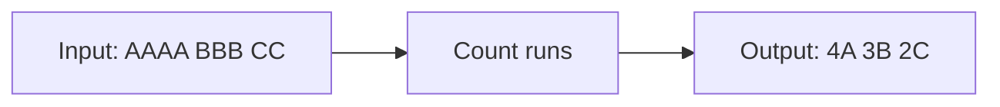

**Implementation:**
```python
def rle_encode(data):
    """Run-length encoding"""
    if not data:
        return []
    
    encoded = []
    count = 1
    current = data[0]
    
    for i in range(1, len(data)):
        if data[i] == current:
            count += 1
        else:
            encoded.append((count, current))
            current = data[i]
            count = 1
    
    encoded.append((count, current))
    return encoded

def rle_decode(encoded):
    """Run-length decoding"""
    decoded = []
    for count, value in encoded:
        decoded.extend([value] * count)
    return decoded

# Misal
data = [5, 5, 5, 5, 10, 10, 20, 20, 20, 20, 20]
encoded = rle_encode(data)  # [(4, 5), (2, 10), (5, 20)]
decoded = rle_decode(encoded)  # [5, 5, 5, 5, 10, 10, 20, 20, 20, 20, 20]
```

**Effektivlik:**
- Simple və fast
- Regions of constant color üçün yaxşı
- Natural images üçün zəif (az təkrar)

### 2. Huffman Coding

Variable-length coding: tez-tez görünən symbol-lara qısa code-lar təyin et.

**Prinsip:**

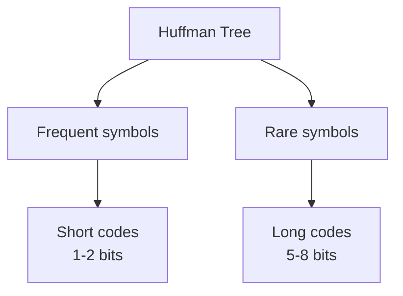

**Algorithm:**
1. Symbol frequency-lərini hesabla
2. Frequency-ə görə sırala
3. Ən kiçik 2-ni birləşdirərək tree yarat
4. Leaf-lərdən root-a qədər path code-dur

**Misal:**
```
Frequencies:
A: 50   B: 25   C: 15   D: 10

Huffman Tree:
        (100)
       /     \
    A(50)    (50)
            /    \
         B(25)  (25)
               /    \
            C(15)  D(10)

Codes:
A: 0
B: 10
C: 110
D: 111

Average length = 0.50×1 + 0.25×2 + 0.15×3 + 0.10×3 = 1.75 bits/symbol
```

**Implementation:**
```python
import heapq
from collections import defaultdict, Counter

class Node:
    def __init__(self, char, freq):
        self.char = char
        self.freq = freq
        self.left = None
        self.right = None
    
    def __lt__(self, other):
        return self.freq < other.freq

def build_huffman_tree(frequencies):
    """Huffman tree-ni qur"""
    heap = [Node(char, freq) for char, freq in frequencies.items()]
    heapq.heapify(heap)
    
    while len(heap) > 1:
        left = heapq.heappop(heap)
        right = heapq.heappop(heap)
        
        parent = Node(None, left.freq + right.freq)
        parent.left = left
        parent.right = right
        
        heapq.heappush(heap, parent)
    
    return heap[0]

def build_codes(node, prefix="", codes=None):
    """Huffman code-ları yarat"""
    if codes is None:
        codes = {}
    
    if node.char is not None:
        codes[node.char] = prefix
    else:
        if node.left:
            build_codes(node.left, prefix + "0", codes)
        if node.right:
            build_codes(node.right, prefix + "1", codes)
    
    return codes

def huffman_encode(data):
    """Huffman encoding"""
    frequencies = Counter(data)
    tree = build_huffman_tree(frequencies)
    codes = build_codes(tree)
    
    encoded = ''.join(codes[char] for char in data)
    return encoded, tree

def huffman_decode(encoded, tree):
    """Huffman decoding"""
    decoded = []
    node = tree
    
    for bit in encoded:
        node = node.left if bit == '0' else node.right
        
        if node.char is not None:
            decoded.append(node.char)
            node = tree
    
    return decoded

# Misal
data = "AAAAAABBBBCCCCCCCCDDDD"
encoded, tree = huffman_encode(data)
print(f"Original: {len(data) * 8} bits")
print(f"Encoded: {len(encoded)} bits")
print(f"Compression: {len(data) * 8 / len(encoded):.2f}:1")
```

### 3. Lempel-Ziv-Welch (LZW)

Dictionary-based compression: pattern-ləri dictionary-də saxla və reference istifadə et.

**Prinsip:**
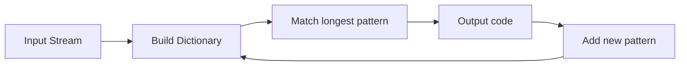

**Misal:**
```
Input: ABABABABA

Dictionary:
0: A
1: B
2: AB
3: BA
4: ABA
5: BAB

Output: 0,1,2,3,4
```

**GIF və TIFF-LZW-də istifadə olunur**

### 4. PNG Compression

PNG DEFLATE algorithm istifadə edir (LZ77 + Huffman).

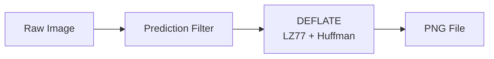

**Prediction filters:**
```python
# PNG prediction filters
def none_filter(x, a, b, c):
    return x

def sub_filter(x, a, b, c):
    return x - a

def up_filter(x, a, b, c):
    return x - b

def average_filter(x, a, b, c):
    return x - (a + b) // 2

def paeth_filter(x, a, b, c):
    p = a + b - c
    pa = abs(p - a)
    pb = abs(p - b)
    pc = abs(p - c)
    
    if pa <= pb and pa <= pc:
        return x - a
    elif pb <= pc:
        return x - b
    else:
        return x - c
```

**PNG writing:**
```python
import cv2
import numpy as np

image = cv2.imread('input.jpg')

# PNG compression levels: 0-9
cv2.imwrite('output.png', image, [cv2.IMWRITE_PNG_COMPRESSION, 9])
```

## Lossy Compression

Lossy compression keyfiyyət itkisi ilə yüksək compression ratio əldə edir.

### JPEG Compression

JPEG ən populyar lossy format-dır, DCT transform və quantization istifadə edir.

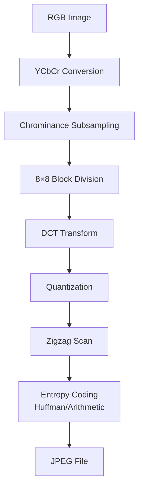

### 1. Color Space Conversion

RGB → YCbCr: Human eye luminance-a daha həssasdır.

```python
def rgb_to_ycbcr(rgb):
    """RGB-ni YCbCr-ə çevir"""
    matrix = np.array([
        [ 0.299,     0.587,     0.114   ],
        [-0.168736, -0.331264,  0.5     ],
        [ 0.5,      -0.418688, -0.081312]
    ])
    
    ycbcr = rgb.dot(matrix.T)
    ycbcr[:, :, [1, 2]] += 128
    return ycbcr
```

### 2. Chrominance Subsampling

Chroma məlumatını azalt (eye luminance-a daha həssasdır).

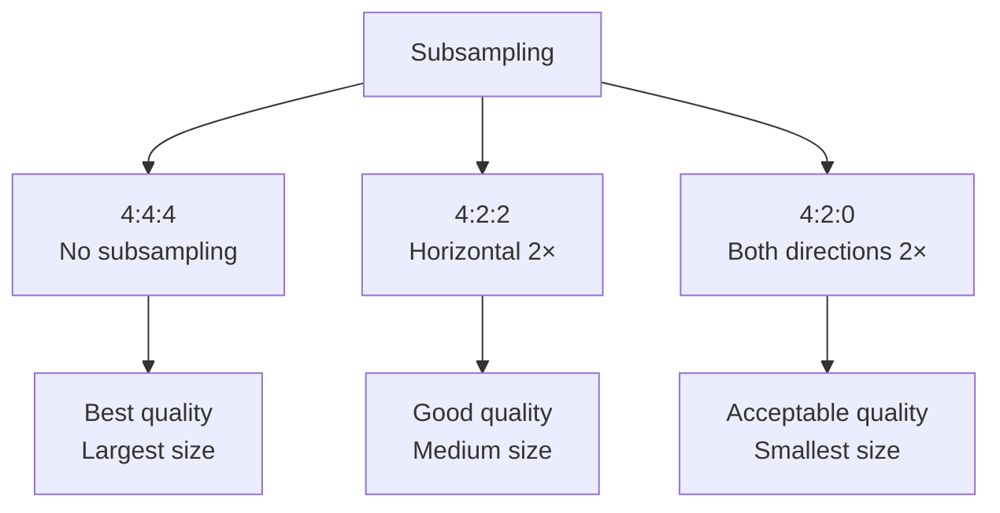

**Subsampling schemes:**
```
4:4:4 (No subsampling):
Y Y Y Y    Cb Cb Cb Cb    Cr Cr Cr Cr
Y Y Y Y    Cb Cb Cb Cb    Cr Cr Cr Cr

4:2:2 (Horizontal 2×):
Y Y Y Y    Cb Cb          Cr Cr
Y Y Y Y    Cb Cb          Cr Cr

4:2:0 (2× both):
Y Y Y Y    Cb Cb          Cr Cr
Y Y Y Y
```

### 3. Discrete Cosine Transform (DCT)

8×8 block-ları frequency domain-ə çevir.

**2D DCT:**
```
F(u,v) = 1/4 C(u)C(v) ∑∑ f(x,y) cos[(2x+1)uπ/16] cos[(2y+1)vπ/16]

C(u) = 1/√2 if u=0, else 1

f(x,y): Spatial domain pixel
F(u,v): Frequency domain coefficient
```

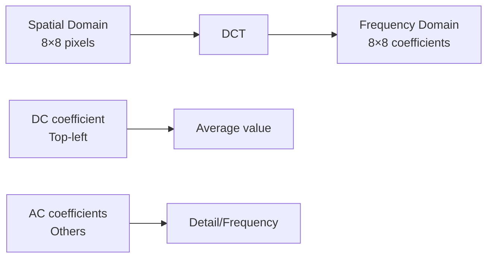

**Implementation:**
```python
import cv2
import numpy as np
from scipy.fftpack import dct, idct

def dct2d(block):
    """2D DCT"""
    return dct(dct(block.T, norm='ortho').T, norm='ortho')

def idct2d(block):
    """2D Inverse DCT"""
    return idct(idct(block.T, norm='ortho').T, norm='ortho')

# 8×8 block
block = np.random.randint(0, 256, (8, 8), dtype=np.float32)

# DCT
dct_block = dct2d(block)

# IDCT (reconstruct)
reconstructed = idct2d(dct_block)
```

**DCT məna:**
- Top-left (DC): Average value (low frequency)
- Diagonal artdıqca: Higher frequency
- Bottom-right: Highest frequency (detail)

### 4. Quantization

Quantization information loss yaradır - lossy compression-un əsas addımı.

**Quantization matrix:**
```python
# JPEG standard quantization matrix (quality 50)
Q = np.array([
    [16, 11, 10, 16,  24,  40,  51,  61],
    [12, 12, 14, 19,  26,  58,  60,  55],
    [14, 13, 16, 24,  40,  57,  69,  56],
    [14, 17, 22, 29,  51,  87,  80,  62],
    [18, 22, 37, 56,  68, 109, 103,  77],
    [24, 35, 55, 64,  81, 104, 113,  92],
    [49, 64, 78, 87, 103, 121, 120, 101],
    [72, 92, 95, 98, 112, 100, 103,  99]
])

def quantize(dct_block, Q):
    """Quantize DCT coefficients"""
    return np.round(dct_block / Q)

def dequantize(quantized_block, Q):
    """Dequantize"""
    return quantized_block * Q
```

**Quantization effekti:**
```
Original DCT:           Quantized:
1250.2  -50.3  ...      78  -5  ...
-40.1   30.5   ...      -3   3  ...
...                     ...

Many small coefficients → 0
Compression və detail loss
```

**Quality parameter:**
```python
def get_quantization_matrix(quality):
    """Quality parameter-ə görə Q matrix"""
    if quality < 50:
        scale = 5000 / quality
    else:
        scale = 200 - 2 * quality
    
    Q_scaled = np.floor((Q * scale + 50) / 100)
    Q_scaled[Q_scaled == 0] = 1
    
    return Q_scaled

# Quality 90 (high quality, large file)
Q90 = get_quantization_matrix(90)

# Quality 10 (low quality, small file)
Q10 = get_quantization_matrix(10)
```

### 5. Zigzag Scanning

Quantized coefficients-i zigzag scan ilə 1D array-ə çevir.

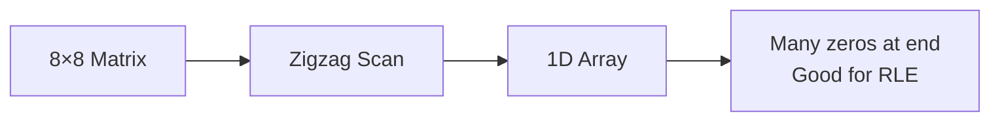

**Zigzag pattern:**
```
┌───────────────┐
│ 0→ 1  5→ 6   │
│    ↓  ↗  ↓   │
│ 2→ 4  7 12   │
│ ↓  ↗  ↓  ↗   │
│ 3  8→11 13   │
│ ↓  ↗  ↓  ↗   │
│ 9→10 14 15→ │
└───────────────┘

Low frequency → High frequency
DC → AC coefficients
```

**Implementation:**
```python
def zigzag_scan(matrix):
    """Zigzag scan 8×8 matrix"""
    return np.array([
        matrix[0,0],
        matrix[0,1], matrix[1,0],
        matrix[2,0], matrix[1,1], matrix[0,2],
        matrix[0,3], matrix[1,2], matrix[2,1], matrix[3,0],
        # ... (64 elements total)
    ])

def zigzag_indices():
    """Zigzag order indices"""
    indices = []
    for s in range(15):
        if s % 2 == 0:
            for i in range(min(s+1, 8)):
                j = s - i
                if j < 8:
                    indices.append((i, j))
        else:
            for j in range(min(s+1, 8)):
                i = s - j
                if i < 8:
                    indices.append((i, j))
    return indices
```

### 6. Entropy Coding

Zigzag scan edilmiş data-nı Huffman və ya Arithmetic coding ilə kompres et.

**DC coefficients:** DPCM (differential coding)
```python
# DC difference encoding
dc_values = [150, 145, 148, 142, ...]
dc_diff = [150, -5, 3, -6, ...]  # Differences
```

**AC coefficients:** Run-length + Huffman
```
[0, 0, 0, 5, 0, 0, 3, 0, ..., 0]
→ (3, 5), (2, 3), ..., EOB
```

### Complete JPEG Compression

```python
def jpeg_compress_block(block, Q, quality=50):
    """JPEG compression for 8×8 block"""
    # 1. Shift to [-128, 127]
    shifted = block - 128
    
    # 2. DCT
    dct_coeffs = dct2d(shifted)
    
    # 3. Quantization
    Q_matrix = get_quantization_matrix(quality)
    quantized = quantize(dct_coeffs, Q_matrix)
    
    # 4. Zigzag scan
    zigzag = zigzag_scan(quantized)
    
    # 5. Entropy coding (simplified)
    # In real JPEG: Huffman/Arithmetic coding
    
    return zigzag

def jpeg_decompress_block(zigzag, Q, quality=50):
    """JPEG decompression"""
    # 1. Inverse zigzag
    quantized = inverse_zigzag_scan(zigzag)
    
    # 2. Dequantization
    Q_matrix = get_quantization_matrix(quality)
    dct_coeffs = dequantize(quantized, Q_matrix)
    
    # 3. IDCT
    shifted = idct2d(dct_coeffs)
    
    # 4. Shift back
    block = shifted + 128
    
    return np.clip(block, 0, 255)
```

### JPEG Artifacts

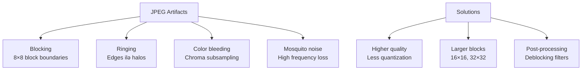

### JPEG Quality Comparison

```python
import cv2

image = cv2.imread('input.jpg')

# Different quality levels
for quality in [10, 30, 50, 70, 90, 100]:
    filename = f'output_q{quality}.jpg'
    cv2.imwrite(filename, image, [cv2.IMWRITE_JPEG_QUALITY, quality])
    
    size = os.path.getsize(filename)
    print(f"Quality {quality}: {size/1024:.1f} KB")
```

## Modern Compression Formats

### WebP

Google tərəfindən inkişaf etdirilmiş, JPEG-dən 25-35% kiçik.

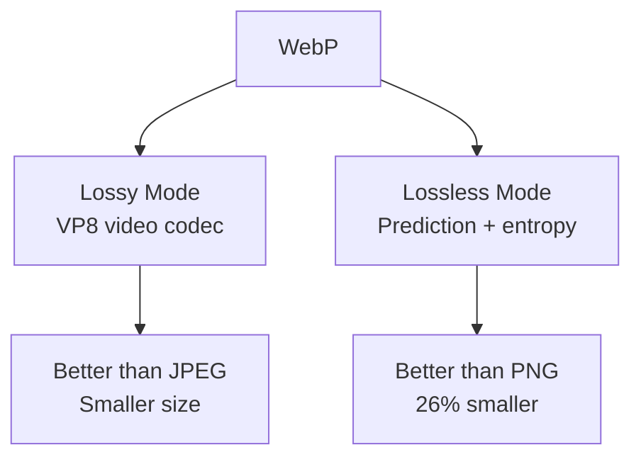

```python
import cv2

# WebP compression
cv2.imwrite('output.webp', image, [cv2.IMWRITE_WEBP_QUALITY, 80])

# WebP lossless
cv2.imwrite('output_lossless.webp', image, 
            [cv2.IMWRITE_WEBP_QUALITY, 101])
```

### HEIF/HEIC

Apple cihazlarında default, HEVC video codec əsaslı.

**Advantages:**
- JPEG-dən 50% kiçik eyni keyfiyyətdə
- 16-bit color depth
- Transparency support
- Multiple images (burst photos)

### AVIF

AV1 video codec əsaslı, ən yeni format.

**Advantages:**
- JPEG-dən 50% kiçik
- WebP-dən 20% kiçik
- HDR support
- Better perceptual quality

## Compression Comparison

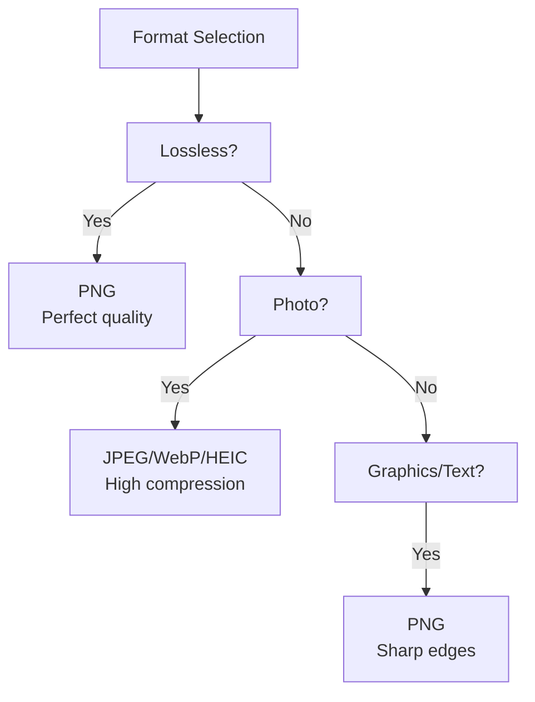

| Format | Type | Compression | Transparency | Animation | Use Case |
|--------|------|-------------|--------------|-----------|----------|
| JPEG | Lossy | High | No | No | Photos |
| PNG | Lossless | Moderate | Yes | No | Graphics, text |
| GIF | Lossless | Moderate | Yes | Yes | Simple animations |
| WebP | Both | High | Yes | Yes | Web images |
| HEIC | Lossy | Very High | Yes | Yes | Mobile photos |
| AVIF | Lossy | Highest | Yes | Yes | Modern web |

## Practical Implementation

### Image Compression Pipeline

```python
class ImageCompressor:
    """Image compression utility"""
    
    def compress_jpeg(self, image, quality=85):
        """JPEG compression"""
        encode_param = [cv2.IMWRITE_JPEG_QUALITY, quality]
        _, encoded = cv2.imencode('.jpg', image, encode_param)
        return encoded.tobytes()
    
    def compress_png(self, image, compression=9):
        """PNG compression"""
        encode_param = [cv2.IMWRITE_PNG_COMPRESSION, compression]
        _, encoded = cv2.imencode('.png', image, encode_param)
        return encoded.tobytes()
    
    def compress_webp(self, image, quality=80):
        """WebP compression"""
        encode_param = [cv2.IMWRITE_WEBP_QUALITY, quality]
        _, encoded = cv2.imencode('.webp', image, encode_param)
        return encoded.tobytes()
    
    def adaptive_quality(self, image, target_size_kb):
        """Target size-a görə quality seç"""
        quality = 95
        
        while quality > 10:
            compressed = self.compress_jpeg(image, quality)
            size_kb = len(compressed) / 1024
            
            if size_kb <= target_size_kb:
                return compressed, quality
            
            quality -= 5
        
        return compressed, quality

# Usage
compressor = ImageCompressor()
image = cv2.imread('photo.jpg')

# 100KB target
compressed, quality = compressor.adaptive_quality(image, 100)
print(f"Achieved target with quality {quality}")
```

### Batch Compression

```python
import os
from pathlib import Path

def batch_compress_images(input_dir, output_dir, format='webp', quality=80):
    """Çoxlu şəkli kompres et"""
    Path(output_dir).mkdir(exist_ok=True)
    
    for filename in os.listdir(input_dir):
        if filename.lower().endswith(('.jpg', '.jpeg', '.png')):
            input_path = os.path.join(input_dir, filename)
            image = cv2.imread(input_path)
            
            if image is None:
                continue
            
            # Output filename
            name = Path(filename).stem
            output_path = os.path.join(output_dir, f"{name}.{format}")
            
            # Compress
            if format == 'webp':
                cv2.imwrite(output_path, image, 
                           [cv2.IMWRITE_WEBP_QUALITY, quality])
            elif format == 'jpg':
                cv2.imwrite(output_path, image, 
                           [cv2.IMWRITE_JPEG_QUALITY, quality])
            
            # Stats
            original_size = os.path.getsize(input_path)
            compressed_size = os.path.getsize(output_path)
            ratio = original_size / compressed_size
            
            print(f"{filename}: {original_size/1024:.1f}KB → "
                  f"{compressed_size/1024:.1f}KB ({ratio:.1f}:1)")

# Usage
batch_compress_images('photos/', 'compressed/', format='webp', quality=85)
```

## Quality Metrics

### PSNR (Peak Signal-to-Noise Ratio)

```python
def calculate_psnr(original, compressed):
    """PSNR hesabla"""
    mse = np.mean((original - compressed) ** 2)
    
    if mse == 0:
        return float('inf')
    
    max_pixel = 255.0
    psnr = 20 * np.log10(max_pixel / np.sqrt(mse))
    
    return psnr

# Usage
original = cv2.imread('original.jpg')
compressed = cv2.imread('compressed.jpg')

psnr = calculate_psnr(original, compressed)
print(f"PSNR: {psnr:.2f} dB")

# Interpretation:
# > 40 dB: Excellent
# 30-40 dB: Good
# 20-30 dB: Acceptable
# < 20 dB: Poor
```

### SSIM (Structural Similarity Index)

```python
from skimage.metrics import structural_similarity as ssim

def calculate_ssim(original, compressed):
    """SSIM hesabla (0-1, higher is better)"""
    gray_orig = cv2.cvtColor(original, cv2.COLOR_BGR2GRAY)
    gray_comp = cv2.cvtColor(compressed, cv2.COLOR_BGR2GRAY)
    
    score, _ = ssim(gray_orig, gray_comp, full=True)
    
    return score

# Usage
ssim_score = calculate_ssim(original, compressed)
print(f"SSIM: {ssim_score:.4f}")

# Interpretation:
# > 0.95: Excellent
# 0.85-0.95: Good
# 0.70-0.85: Acceptable
# < 0.70: Poor
```

## Performance Optimization

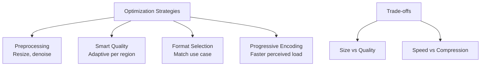

## Best Practices

**1. Format seçimi:**
```python
def recommend_format(image_type, has_transparency, needs_animation):
    """Optimal format təklif et"""
    if needs_animation:
        return 'gif' if simple else 'webp'
    
    if has_transparency:
        return 'png' if graphics else 'webp'
    
    if image_type == 'photo':
        return 'webp' if modern_browser else 'jpg'
    elif image_type == 'graphics':
        return 'png'
    else:
        return 'webp'
```

**2. Quality guidelines:**
- **Photos:** JPEG 85-90 (web), 95+ (print)
- **Graphics/Text:** PNG (lossless)
- **Web delivery:** WebP 80-85
- **Thumbnails:** Lower quality OK (60-70)

**3. Preprocessing:**
```python
def optimize_before_compression(image, max_dimension=1920):
    """Kompresiya öncə optimizasiya"""
    # Resize if too large
    h, w = image.shape[:2]
    if max(h, w) > max_dimension:
        scale = max_dimension / max(h, w)
        new_w = int(w * scale)
        new_h = int(h * scale)
        image = cv2.resize(image, (new_w, new_h), 
                          interpolation=cv2.INTER_AREA)
    
    # Denoise
    image = cv2.fastNlMeansDenoisingColored(image, None, 10, 10, 7, 21)
    
    return image
```

## Əsas Nəticələr

1. **Lossless** - PNG, GIF: keyfiyyət itkisi yox, moderate compression
2. **Lossy** - JPEG, WebP: yüksək compression, acceptable quality loss
3. **JPEG** - DCT + Quantization + Entropy coding
4. **Quantization** - Lossy compression-un əsas addımı
5. **Chroma subsampling** - 4:2:0 ən çox istifadə olunur
6. **Quality parameter** - Size və quality balance-i control edir
7. **WebP** - Modern alternative, JPEG-dən 25-35% kiçik
8. **HEIC/AVIF** - Ən yeni formatlar, ən yüksək compression
9. **PSNR/SSIM** - Quality metrics
10. **Format selection** - Use case-ə görə seç (photo vs graphics)
