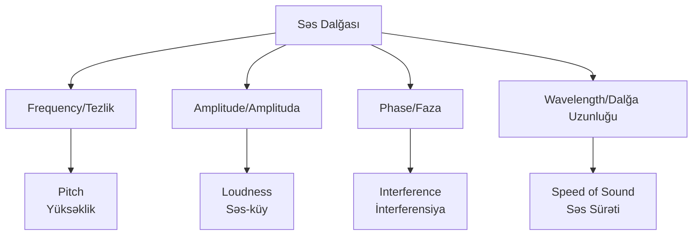
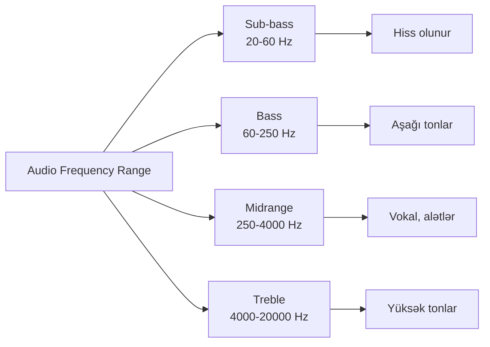
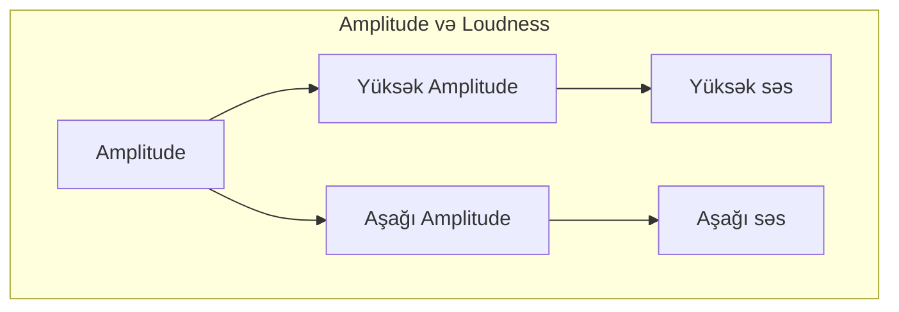
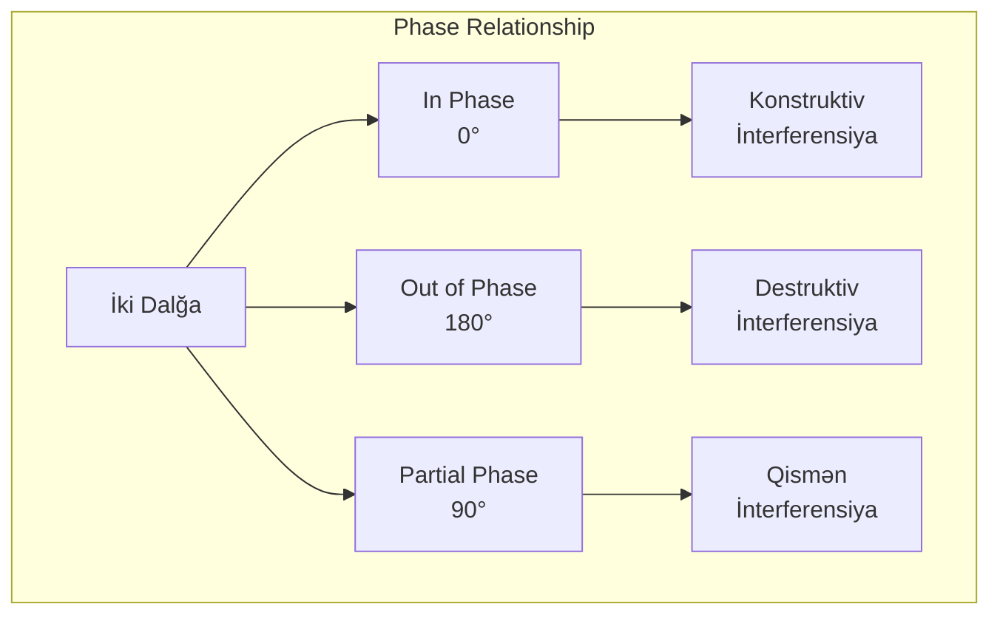
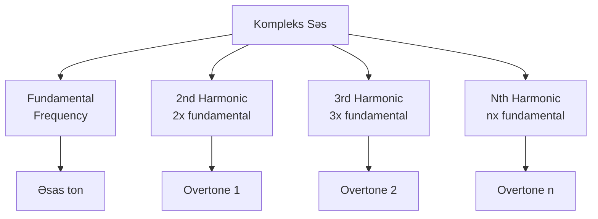
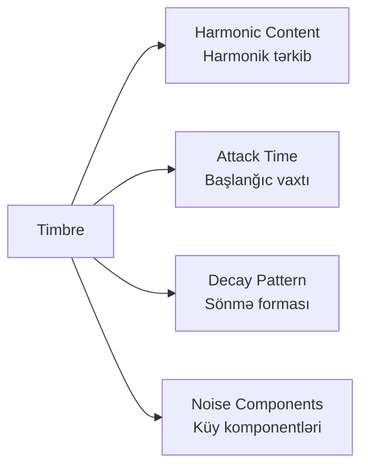
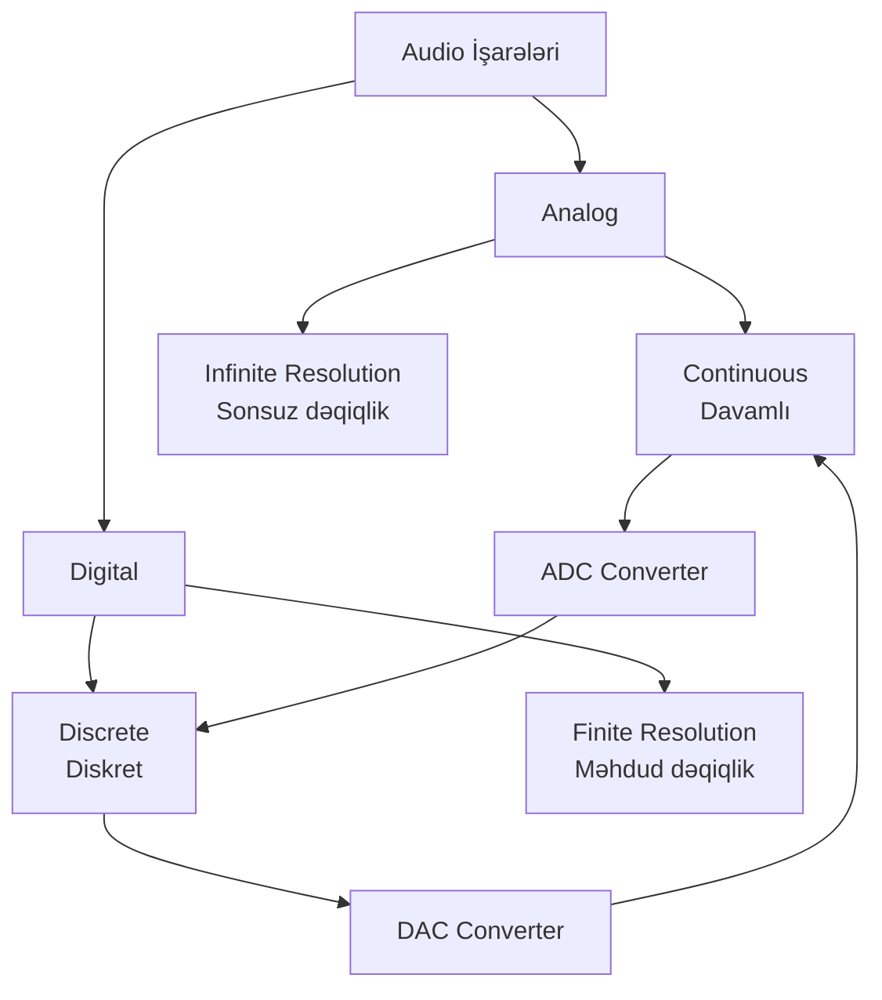
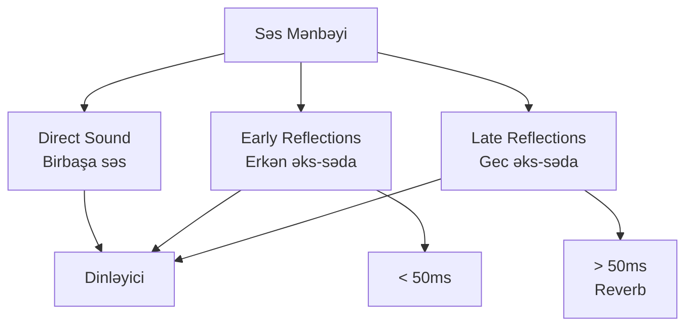

# Audio Fundamentals

## Səs Nədir?

**Səs (Sound)** - havanın və ya başqa bir mühitin mexaniki vibrasiyasıdır. Səs dalğaları longitudinal dalğalardır və mühitin hissəciklərinin sıxılması və genişlənməsi ilə yayılır.

## Səs Dalğalarının Əsas Xüsusiyyətləri



### 1. Frequency (Tezlik)

**Frequency** - saniyədə baş verən vibrasiya sayı, Hz (Hertz) ilə ölçülür.

**İnsan eşitmə diapazonu:**
- 20 Hz - 20,000 Hz (20 kHz)
- 20 Hz-dən aşağı: **infrasound**
- 20 kHz-dən yuxarı: **ultrasound**



**Pitch və Frequency:**
- Yüksək frequency = Yüksək pitch (incə səs)
- Aşağı frequency = Aşağı pitch (qalın səs)

### 2. Amplitude (Amplituda)

**Amplitude** - dalğanın maksimum yerdəyişməsi, səsin gücünü (loudness) təyin edir.

**Decibel (dB)** - səs gücünün loqarifmik ölçüsü:

```
dB = 20 × log₁₀(A₁/A₀)
```

**Səs səviyyələri:**
- 0 dB: Eşitmə həddi
- 30 dB: Pıçıltı
- 60 dB: Normal danışıq
- 90 dB: Yüksək musiqi
- 120 dB: Ağrı həddi



### 3. Phase (Faza)

**Phase** - dalğanın tsiklindəki mövqeyini göstərən bucaq, dərəcə və ya radian ilə ölçülür.



**Phase əhəmiyyəti:**
- **In-phase** (0°): Dalğalar bir-birini gücləndirir
- **Out-of-phase** (180°): Dalğalar bir-birini zəiflədir və ya ləğv edir
- Stereo audio-da phase problemi səs keyfiyyətini pisləşdirir

### 4. Wavelength (Dalğa Uzunluğu)

**Wavelength (λ)** - bir tam dalğa tsiklinin fiziki uzunluğudur.

```
λ = v / f
```

Harada:
- λ = wavelength (metr)
- v = səs sürəti (havada ~343 m/s)
- f = frequency (Hz)

**Nümunə:**
- 1000 Hz frequency: λ = 343/1000 = 0.343 m = 34.3 cm

## Kompleks Səslər və Harmoniklər

Real dünyada səslər sadə sinusoidal dalğalar deyil, **kompleks dalğalar**dır.

### Fourier Analizi

Hər hansı kompleks səs dalğası sadə sinusoidal dalğaların cəmi kimi təqdim edilə bilər.



**Harmoniklər:**
- **Fundamental frequency**: Ən aşağı və ən güclü komponent
- **Harmonics/Overtones**: Fundamental-ın tam qatları
- **Timbre**: Harmoniklərin nisbəti alətlərin xarakterik səsini yaradır

### Timbre (Tembr)

**Timbre** - eyni pitch və loudness-də iki fərqli səs mənbəyini ayırd etməyə imkan verən keyfiyyətdir.



## ADSR Envelope

**ADSR** - səsin zaman içində necə dəyişdiyini təsvir edir.


**Mərhələlər:**
1. **Attack**: Səsin maksimum səviyyəyə çatma vaxtı
2. **Decay**: Maksimumdan sustain səviyyəsinə düşmə
3. **Sustain**: Notun tutulduğu müddətdə sabit səviyyə
4. **Release**: Nota buraxıldıqdan sonra səsin sönməsi

## Audio İşarələrinin Növləri



### Analog vs Digital

**Analog Audio:**
- Davamlı işarə
- Sonsuz dəqiqlik (teorik olaraq)
- Küyə həssas
- Qocalmağa məruz qalır

**Digital Audio:**
- Diskret nümunələr
- Məhdud dəqiqlik
- Küyə davamlı
- Qocalmağa məruz qalmır
- Saxlama və emal asandır

## Səs Ötürmə Mühiti

Səs müxtəlif mühitlərdə fərqli sürətlə yayılır:

| Mühit | Səs sürəti (m/s) |
|-------|------------------|
| Hava (20°C) | 343 |
| Su | 1,480 |
| Beton | 3,100 |
| Polad | 5,960 |

## Əks-səda və Reverb



**Reverb (Reverberation):**
- Səsin otaqda çoxsaylı əks-sədalardan sonra tədricən sönməsi
- Otaq ölçüsü və materiallar reverb xarakterini təyin edir
- Digital reverb audio production-da geniş istifadə olunur

## Xülasə

Audio fundamentals səs prosessinqin əsasını təşkil edir:
- **Frequency** pitch-i, **amplitude** loudness-i təyin edir
- **Phase** dalğaların qarşılıqlı təsirini göstərir
- **Kompleks səslər** harmoniklərin kombinasiyasıdır
- **Digital audio** analog işarələrin diskret təqdimidir
- **Timbre və ADSR** səsin xarakterini formalaşdırır
