# Sampling və Quantization

## Giriş

Digital audio yaratmaq üçün analog səs işarəsini rəqəmsal formata çevirmək lazımdır. Bu proses iki əsas mərhələdən ibarətdir:
1. **Sampling** - işarəni zamanda diskret nümunələrə bölmək
2. **Quantization** - hər nümunəni məhdud sayda rəqəmsal dəyərə çevirmək

## Analog-to-Digital Conversion (ADC)

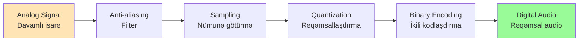

## Sampling (Nümunə Götürmə)

**Sampling** - analog işarənin müəyyən zaman intervallarında ölçülməsidir.

### Sample Rate (Nümunə Tezliyi)

**Sample Rate** - saniyədə götürülən nümunə sayı, Hz və ya samples per second ilə ölçülür.

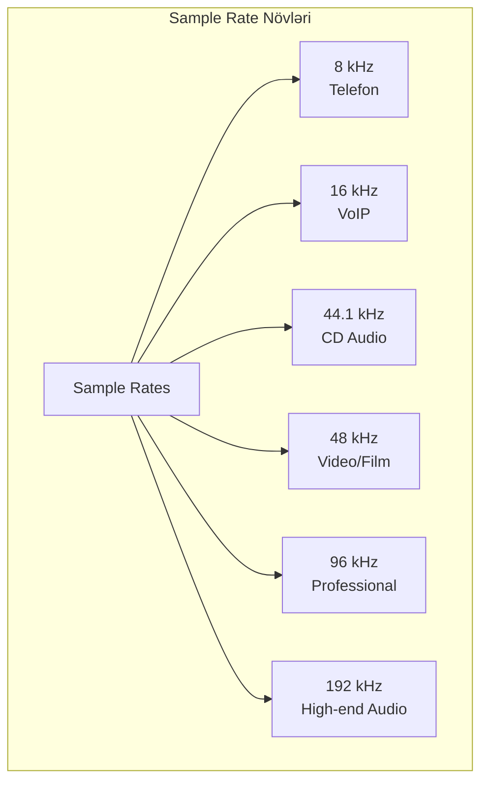

**Ümumi Sample Rate-lər:**

| Sample Rate | İstifadə sahəsi |
|-------------|-----------------|
| 8 kHz | Telefon rabitəsi |
| 16 kHz | VoIP, speech recognition |
| 22.05 kHz | Low-quality streaming |
| 44.1 kHz | CD audio, standart keyfiyyət |
| 48 kHz | DVD, video production |
| 96 kHz | Professional audio recording |
| 192 kHz | High-end audio mastering |

### Nyquist-Shannon Teoremi

**Nyquist Teoremi**: Analog işarəni düzgün rəqəmsallaşdırmaq üçün sample rate işarənin maksimum tezliyindən **ən azı 2 dəfə yüksək** olmalıdır.

```
Sample Rate ≥ 2 × f_max
```

**Nyquist Frequency**: Sample rate-in yarısı

```
f_nyquist = Sample Rate / 2
```

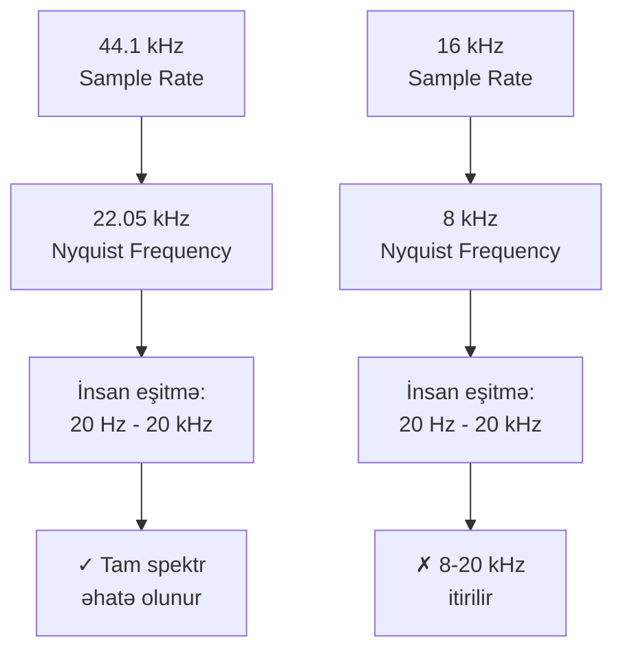

**Nümunə:**
- CD audio: 44.1 kHz sample rate
- Nyquist frequency: 22.05 kHz
- İnsan eşitmə: 20 Hz - 20 kHz ✓

### Aliasing

**Aliasing** - Nyquist tezliyindən yüksək olan tezliklərin aşağı tezliklər kimi görünməsidir.

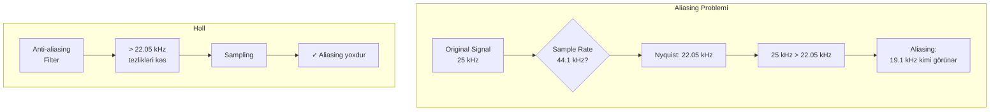

**Anti-aliasing Filter:**
- Sampling-dən əvvəl tətbiq olunur
- Nyquist tezliyindən yüksək tezlikləri kəsir
- Low-pass filter istifadə olunur

## Quantization (Rəqəmsallaşdırma)

**Quantization** - hər nümunənin amplitudasını məhdud sayda diskret dəyərə yuvarlaqlaşdırmaqdır.

### Bit Depth (Bit Dərinliyi)

**Bit Depth** - hər nümunəni təmsil etmək üçün istifadə olunan bit sayı.

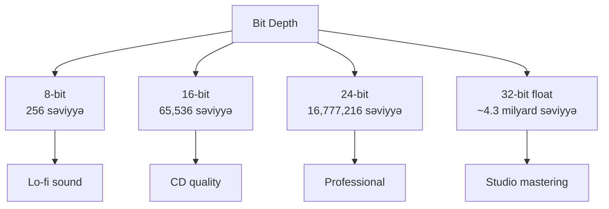

**Mümkün dəyərlər:**
```
Levels = 2^(bit depth)
```

| Bit Depth | Mümkün səviyyələr | İstifadə |
|-----------|-------------------|----------|
| 8-bit | 256 | Retro games, lo-fi |
| 16-bit | 65,536 | CD audio, streaming |
| 24-bit | 16,777,216 | Professional recording |
| 32-bit float | ~4.3 milyar | DAW, audio processing |

### Dynamic Range

**Dynamic Range** - ən yüksək və ən aşağı səs səviyyələri arasındakı fərqdir.

```
Dynamic Range (dB) ≈ 6 × bit depth
```

| Bit Depth | Dynamic Range |
|-----------|---------------|
| 8-bit | ~48 dB |
| 16-bit | ~96 dB |
| 24-bit | ~144 dB |
| 32-bit float | ~1,680 dB |

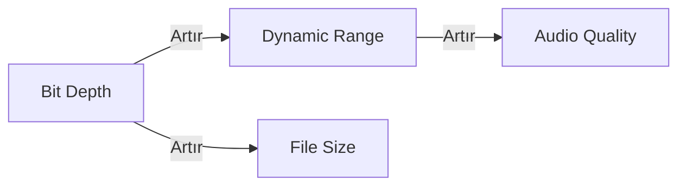

### Quantization Error və Noise

**Quantization Error** - orijinal analog dəyər ilə quantize edilmiş dəyər arasındakı fərqdir.

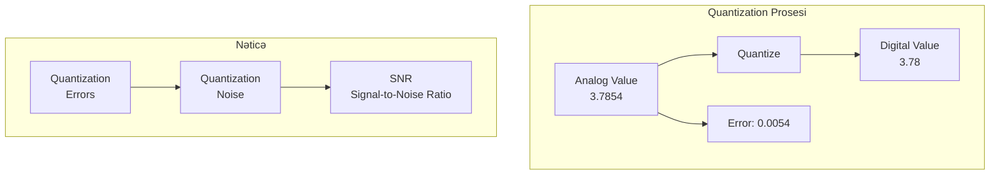

**Signal-to-Noise Ratio (SNR):**
```
SNR (dB) ≈ 6.02 × bit depth + 1.76
```

- 16-bit: ~98 dB SNR
- 24-bit: ~146 dB SNR

### Dithering

**Dithering** - quantization noise-u azaltmaq üçün audio işarəsinə kiçik miqdar random noise əlavə etməkdir.

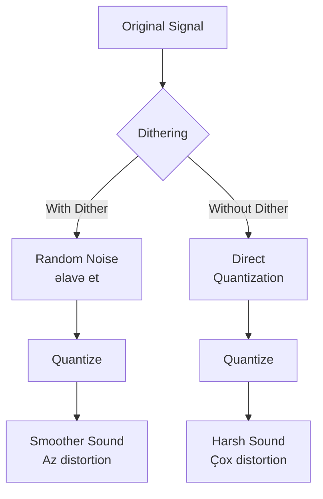

**Dithering faydalıdır:**
- Bit depth azaldarkən (24-bit → 16-bit)
- Quantization distortion-u maskelə
- Low-level signal keyfiyyətini artırır

## Pulse Code Modulation (PCM)

**PCM** - ən çox yayılmış digital audio format, sampling və quantization nəticəsidir.

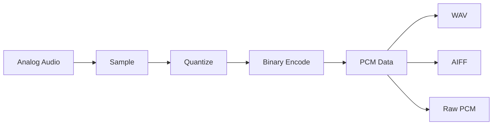

**PCM xüsusiyyətləri:**
- Kompressiyasız (lossless)
- Sadə struktur
- Böyük fayl ölçüsü
- Yüksək keyfiyyət

## File Size Hesablanması

```
File Size = Sample Rate × Bit Depth × Channels × Duration
```

**Nümunə: Stereo CD audio (1 dəqiqə):**
```
44,100 samples/sec × 16 bits × 2 channels × 60 seconds
= 84,672,000 bits
= 10,584,000 bytes
≈ 10.1 MB
```

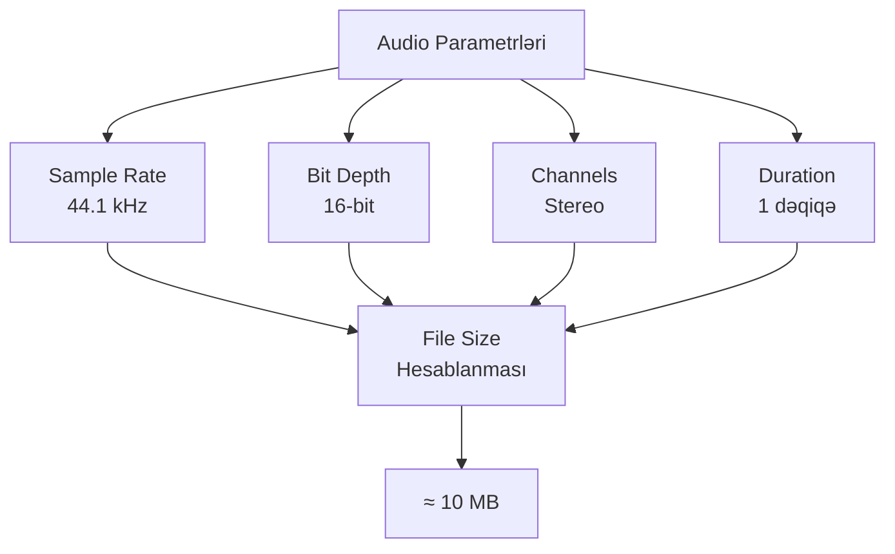

## Digital-to-Analog Conversion (DAC)

Digital audio-nu eşitmək üçün onu yenidən analog formata çevirmək lazımdır.


**DAC prosesi:**
1. Binary data-dan voltaj səviyyələrinə çevrilmə
2. Stepped signal yaranır
3. Low-pass filter hamarlaşdırır
4. Orijinal analog işarə bərpa olunur

## Sample Rate Conversion

Bəzən bir sample rate-dən digərinə çevrilmə lazım olur.

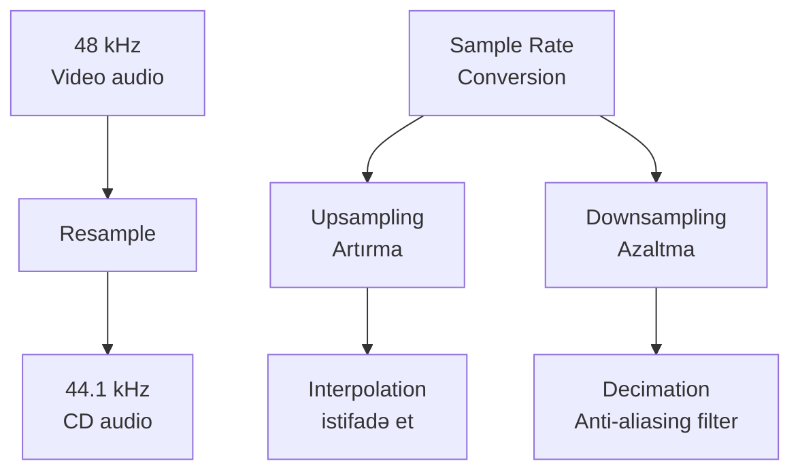

**Upsampling (məs: 44.1 → 48 kHz):**
- Yeni nümunələr interpolation ilə yaradılır
- Keyfiyyət artmır, sadəcə uyğunlaşdırma

**Downsampling (məs: 96 → 44.1 kHz):**
- Anti-aliasing filter tətbiq olunur
- Bəzi məlumat itirilir

## Optimal Parametr Seçimi

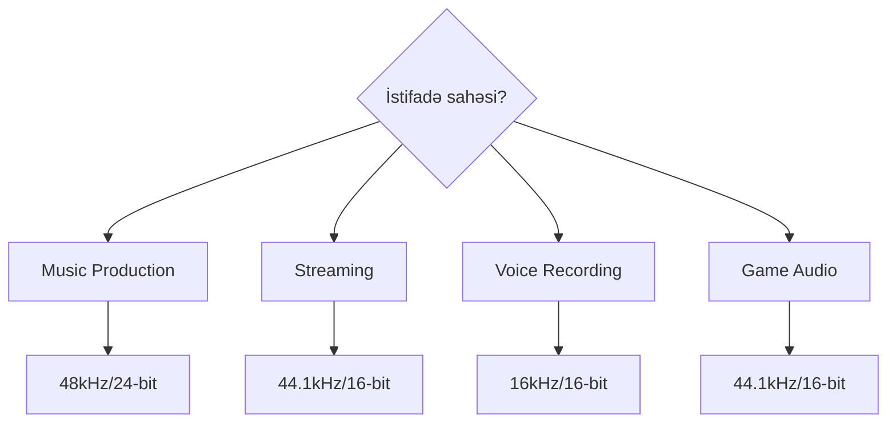

**Tövsiyələr:**

| Məqsəd | Sample Rate | Bit Depth |
|--------|-------------|-----------|
| Voice/Speech | 16-22.05 kHz | 16-bit |
| Music streaming | 44.1 kHz | 16-bit |
| Music production | 48-96 kHz | 24-bit |
| Archival/Mastering | 96-192 kHz | 24-32 bit |
| Video sync | 48 kHz | 24-bit |

## Xülasə

**Sampling:**
- Analog işarəni zamanda diskret nümunələrə bölür
- Sample rate tezlik diapazonunu müəyyən edir
- Nyquist teoremi: Sample rate ≥ 2 × f_max
- Aliasing-dən qaçmaq üçün anti-aliasing filter lazımdır

**Quantization:**
- Amplitudasını məhdud dəyərlərə çevirir
- Bit depth dynamic range və keyfiyyəti müəyyən edir
- Quantization noise qaçılmazdır
- Dithering noise-u maskeləyir

**Praktik:**
- CD: 44.1 kHz / 16-bit
- Professional: 48-96 kHz / 24-bit
- Daha yüksək parametrlər həmişə yaxşı deyil (file size, processing)
