# Digital Filterlər

## Giriş

**Digital Filter** - audio işarəsinin müəyyən tezlik komponentlərini zəiflədən və ya gücləndirib səs keyfiyyətini və xarakterini dəyişən rəqəmsal prosesdir.

## Filter Növləri (Tezliyə görə)

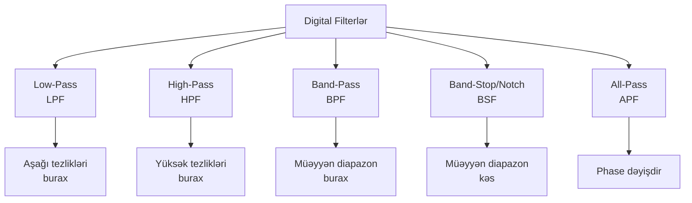

### 1. Low-Pass Filter (LPF)

**Low-Pass Filter** - cutoff tezliyindən aşağı tezlikləri buraxır, yuxarıdakıları zəiflətir.

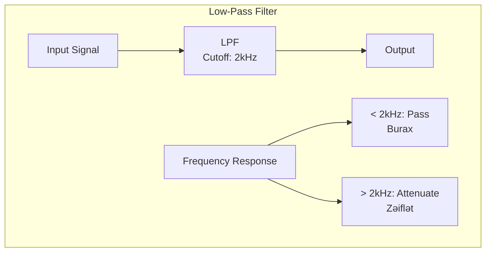

**İstifadə sahələri:**
- Bass tezliklərini saxlamaq
- Yüksək tezlikli küyü aradan qaldırmaq
- Anti-aliasing (sampling-dən əvvəl)
- Subwoofer üçün işarə hazırlamaq

**Nümunə:** Treble-i azaltmaq, yalnız bass-ı eşitmək

### 2. High-Pass Filter (HPF)

**High-Pass Filter** - cutoff tezliyindən yuxarı tezlikləri buraxır, aşağıdakıları zəiflətir.

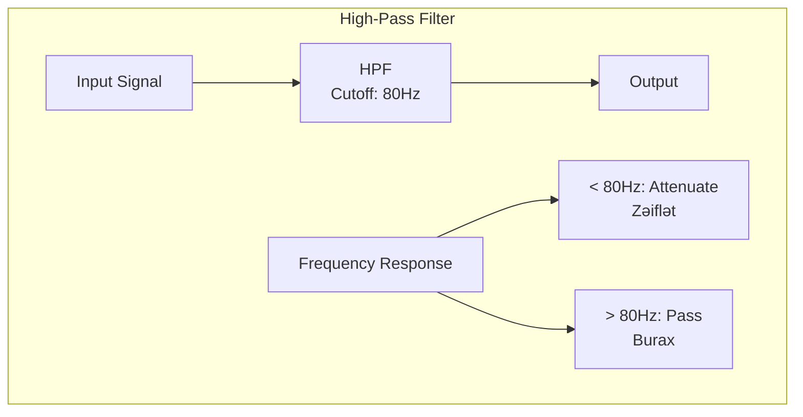

**İstifadə sahələri:**
- Rumble və low-frequency noise-u aradan qaldırmaq
- Microphone-da proximity effect-i azaltmaq
- Voice recording-də bass-ı kəsmək
- DC offset-i aradan qaldırmaq

**Nümunə:** Vokal recording-də 80Hz-dən aşağı tezlikləri kəsmək

### 3. Band-Pass Filter (BPF)

**Band-Pass Filter** - yalnız müəyyən tezlik diapazonunu buraxır, qalanını kəsir.

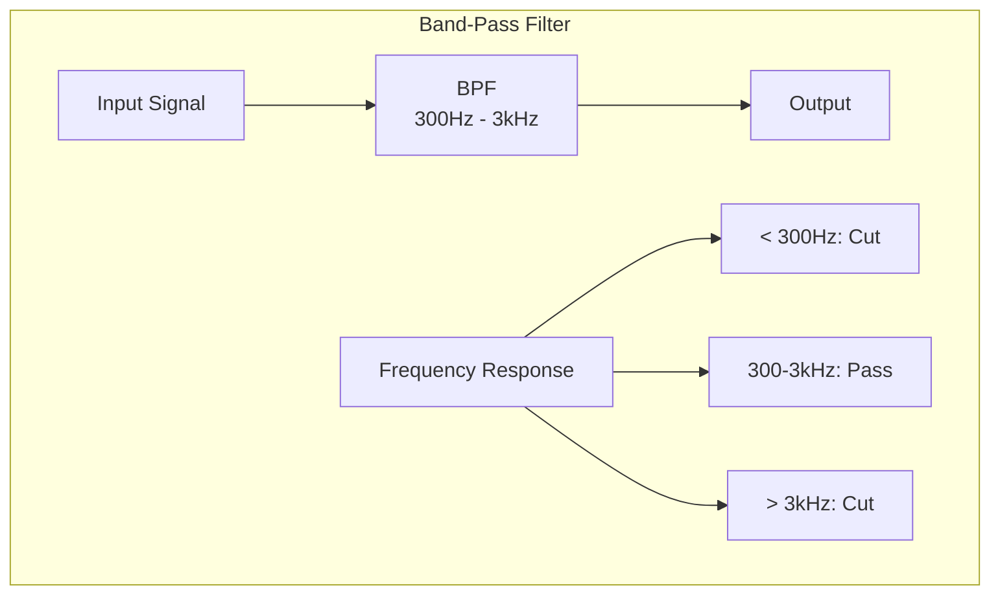

**İstifadə sahələri:**
- Telefon səsi simulyasiyası
- Vokal izolyasiyası
- Radio effekti
- Müəyyən tezlik bandını ayırmaq

**Nümunə:** 300Hz - 3kHz telephone voice effekti

### 4. Band-Stop/Notch Filter (BSF)

**Band-Stop Filter** - müəyyən tezlik diapazonunu kəsir, qalanını buraxır.

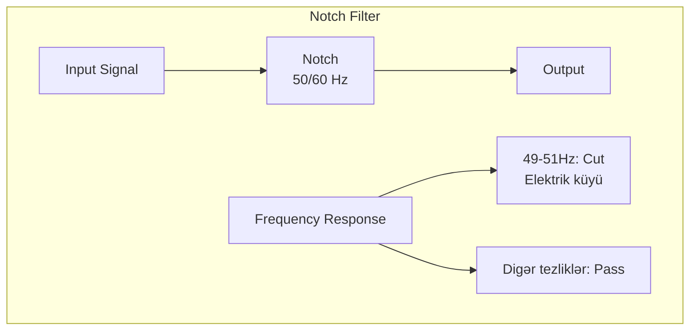

**İstifadə sahələri:**
- 50Hz/60Hz elektrik hum-u aradan qaldırmaq
- Feedback tezliyini kəsmək
- Xüsusi rezonansları aradan qaldırmaq

**Nümunə:** 50Hz elektrik şəbəkəsi küyünü silmək

### 5. All-Pass Filter (APF)

**All-Pass Filter** - bütün tezlikləri buraxır, yalnız phase-i dəyişir.

**İstifadə sahələri:**
- Phase correction
- Reverb və delay effektləri
- Crossover network-lərdə

## Filter Növləri (Strukturuna görə)

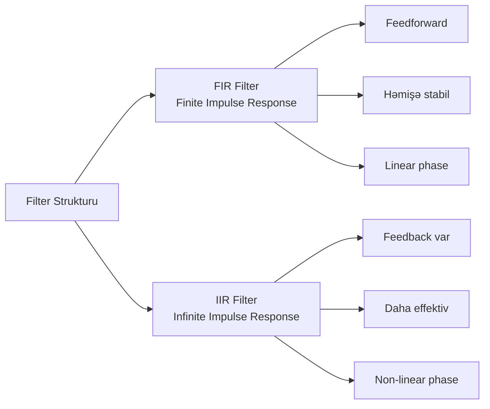

### FIR (Finite Impulse Response)

**FIR Filter** - yalnız cari və keçmiş input-lardan asılıdır, feedback yoxdur.

```mermaid
graph LR
    X[x[n]] --> D1[Delay]
    D1 --> D2[Delay]
    D2 --> D3[Delay]
    
    X --> M0[× h0]
    D1 --> M1[× h1]
    D2 --> M2[× h2]
    D3 --> M3[× h3]
    
    M0 --> Sum[Σ]
    M1 --> Sum
    M2 --> Sum
    M3 --> Sum
    
    Sum --> Y[y[n]]
```

**FIR tənliyi:**
```
y[n] = h[0]×x[n] + h[1]×x[n-1] + h[2]×x[n-2] + ... + h[N]×x[n-N]
```

**FIR xüsusiyyətləri:**

✅ **Üstünlükləri:**
- Həmişə stabil
- Linear phase mümkündür (simmetrik response)
- Sadə dizayn
- Quantization noise-a az həssas

❌ **Çatışmazlıqları:**
- Çox əmsallar lazım ola bilər (yüksək N)
- Daha çox hesablama gücü
- Daha çox yaddaş

**İstifadə sahələri:**
- Audio production (EQ, effects)
- Anti-aliasing
- Precision applications

### IIR (Infinite Impulse Response)

**IIR Filter** - həm input, həm də əvvəlki output-lardan asılıdır, feedback var.

```mermaid
graph TB
    X[x[n]] --> FF[Feedforward<br/>Path]
    FF --> Sum[Σ]
    Sum --> Y[y[n]]
    Y --> FB[Feedback<br/>Path]
    FB --> Sum
```

**IIR tənliyi:**
```
y[n] = b[0]×x[n] + b[1]×x[n-1] + ... - a[1]×y[n-1] - a[2]×y[n-2] - ...
```

**IIR xüsusiyyətləri:**

✅ **Üstünlükləri:**
- Az əmsallar lazımdır
- Daha effektiv (CPU və yaddaş)
- Analog filterlərə oxşar response
- Sharp cutoff mümkündür

❌ **Çatışmazlıqları:**
- Qeyri-stabil ola bilər
- Non-linear phase
- Feedback-dən rounding error toplanır
- Dizayn daha mürəkkəbdir

**İstifadə sahələri:**
- Real-time audio (az latency)
- Embedded systems
- Analog filter emulation

## Filter Parametrləri

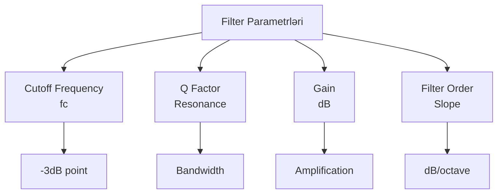

### Cutoff Frequency (fc)

**Cutoff Frequency** - filter-in effektiv olmağa başladığı tezlik, -3dB nöqtəsi.

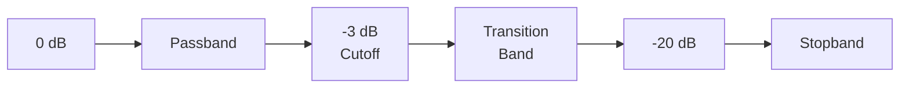

### Q Factor (Quality Factor)

**Q Factor** - filter-in seçiciliyini (selectivity) göstərir.

```
Q = fc / bandwidth
```

**Q dəyərləri:**
- **Aşağı Q** (0.5-1): Geniş, smooth response
- **Orta Q** (1-5): Normal EQ
- **Yüksək Q** (>10): Narrow, notch filter

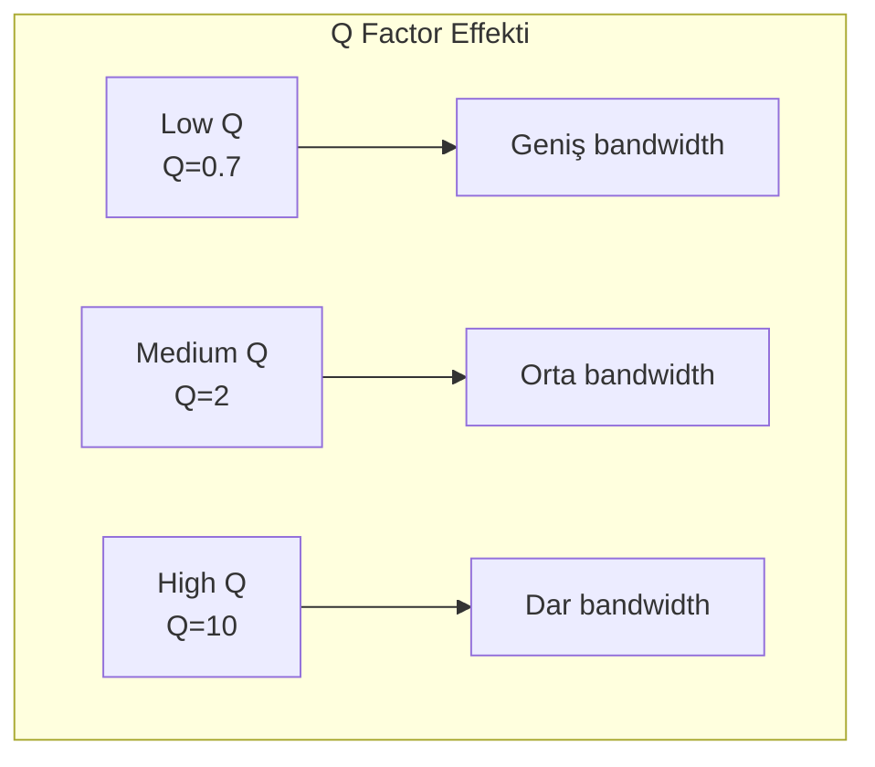

### Filter Order

**Filter Order** - filter-in rolloff dərəcəsini müəyyən edir.

| Order | Slope | Complexity |
|-------|-------|------------|
| 1st order | 6 dB/octave | Sadə |
| 2nd order | 12 dB/octave | Orta |
| 4th order | 24 dB/octave | Yüksək |
| 8th order | 48 dB/octave | Çox yüksək |

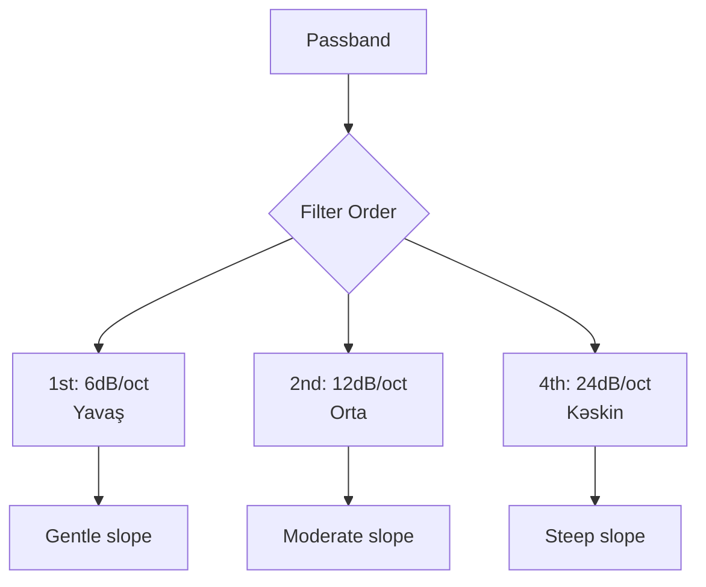

## Filter Dizaynı Metodları

### 1. Butterworth Filter

**Butterworth** - passband-də maksimum düz (flat) response, smooth rolloff.

**Xüsusiyyətləri:**
- Ən düz passband
- Monotonic response
- Moderate rolloff
- İstənilən order mümkündür

### 2. Chebyshev Filter

**Chebyshev** - passband və ya stopband-də ripple, daha kəskin rolloff.

**Növləri:**
- **Type I**: Passband-də ripple
- **Type II**: Stopband-də ripple

**Xüsusiyyətləri:**
- Butterworth-dan kəskin rolloff
- Ripple trade-off
- Daha sürətli transition

### 3. Bessel Filter

**Bessel** - maksimal linear phase, smooth time response.

**Xüsusiyyətləri:**
- Linear phase response
- Minimal overshoot və ringing
- Yavaş rolloff
- Transient response üçün ideal

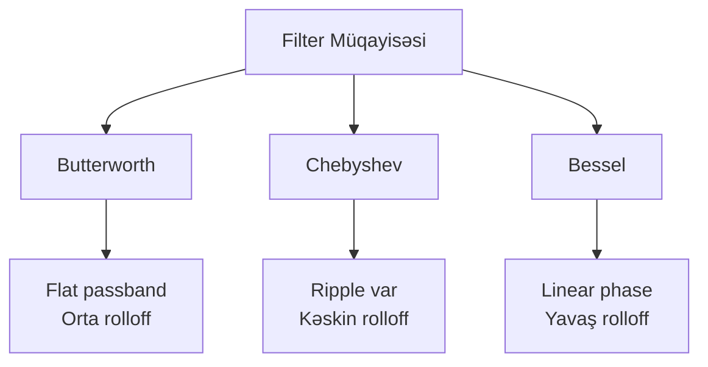

## Convolution və Impulse Response

**Convolution** - input signal-ı filter-in impulse response-u ilə vurmaqdır.

```
y[n] = x[n] * h[n] = Σ x[k] × h[n-k]
```

```mermaid
graph LR
    A[Input Signal<br/>x[n]] --> C[Convolution<br/>*]
    B[Impulse Response<br/>h[n]] --> C
    C --> D[Output Signal<br/>y[n]]
```

**Convolution istifadəsi:**
- FIR filter implementation
- Reverb və acoustic simulation
- Cabinet/speaker simulation
- Creative effects

## Equalizer (EQ)

**Equalizer** - müxtəlif tezlik bandlarını müstəqil idarə edən filter sistemidir.

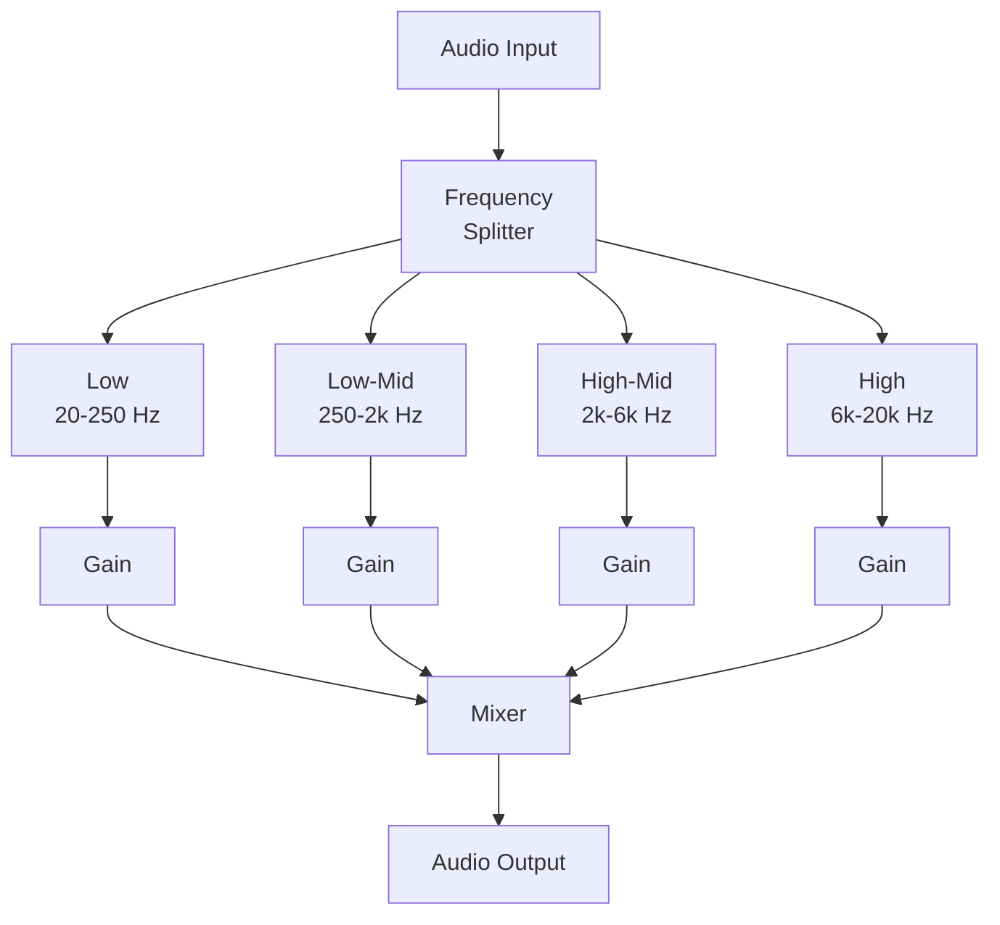

### EQ Növləri

**1. Parametric EQ:**
- Frequency seçilir
- Q factor ayarlanır
- Gain dəyişilir

**2. Graphic EQ:**
- Sabit frequency bandları
- Yalnız gain dəyişir
- Vizual fader-lər

**3. Shelving EQ:**
- High-shelf və low-shelf
- Cutoff-dan sonra bütün tezliklərə təsir edir

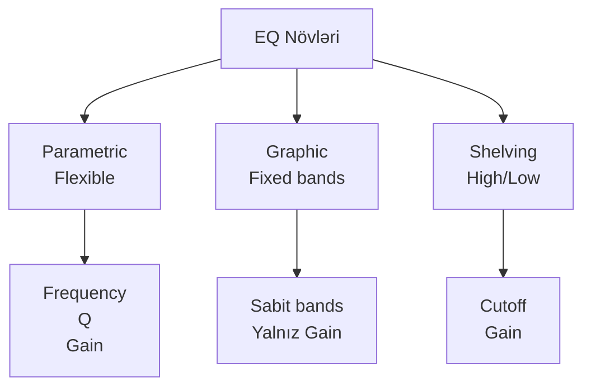

## Praktik Tətbiqlər

### 1. Voice Processing

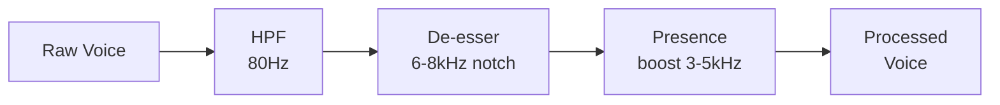

### 2. Bass Enhancement

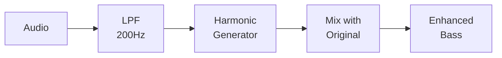

### 3. Noise Reduction

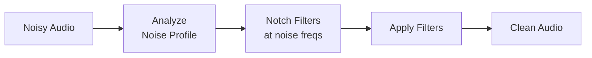

## Filter Implementation (Pseudo-code)

### FIR Filter

```python
def fir_filter(input, coefficients):
    N = len(coefficients)
    buffer = [0] * N
    output = []
    
    for sample in input:
        buffer.pop()
        buffer.insert(0, sample)
        
        result = 0
        for i in range(N):
            result += buffer[i] * coefficients[i]
        
        output.append(result)
    
    return output
```

### Simple IIR (1-pole Low-pass)

```python
def iir_lowpass(input, cutoff_freq, sample_rate):
    RC = 1.0 / (2 * π * cutoff_freq)
    dt = 1.0 / sample_rate
    alpha = dt / (RC + dt)
    
    output = [0] * len(input)
    output[0] = input[0]
    
    for i in range(1, len(input)):
        output[i] = output[i-1] + alpha * (input[i] - output[i-1])
    
    return output
```

## Xülasə

**Filter növləri:**
- **Low-pass**: Aşağı tezlikləri burax
- **High-pass**: Yüksək tezlikləri burax
- **Band-pass**: Müəyyən diapazon burax
- **Notch**: Müəyyən tezliyi kəs

**FIR vs IIR:**
- **FIR**: Stabil, linear phase, çox hesablama
- **IIR**: Effektiv, az hesablama, feedback var

**Parametrlər:**
- **Cutoff frequency**: Filter harada işləyir
- **Q factor**: Nə qədər seçici
- **Order**: Nə qədər kəskin rolloff

**Praktik:**
- EQ audio-nun tonunu formalaşdırır
- Noise reduction-da filter əsasdır
- Real-time processing üçün IIR daha uyğundur
- High-quality offline processing üçün FIR daha yaxşıdır
