# FFT və Frequency Analysis

## Giriş

**Fourier Transform** - zaman domenindəki işarəni tezlik domeninə çevirən riyazi əməliyyatdır. Audio prosessinqdə ən fundamental alətlərdən biridir.

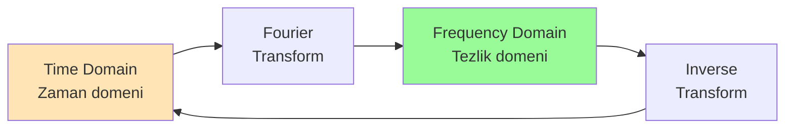

## Time Domain vs Frequency Domain

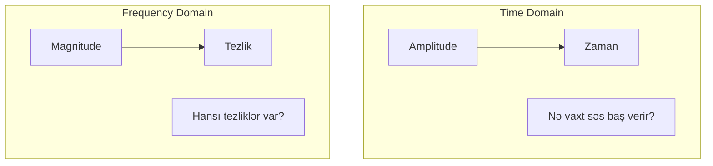

**Time Domain:**
- X oxu: Zaman
- Y oxu: Amplitude
- Sual: Hər an səs nə qədər güclüdür?

**Frequency Domain:**
- X oxu: Tezlik
- Y oxu: Magnitude (gücü)
- Sual: Hər tezlik nə qədər güclüdür?

## Fourier Serisinin İdeası

Hər hansı periodik işarə sadə sinusların cəmi kimi ifadə edilə bilər.

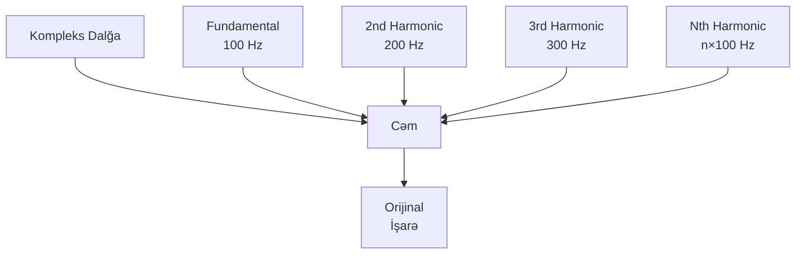

**Nümunə:**
```
signal(t) = A₁·sin(2πf₁t) + A₂·sin(2πf₂t) + A₃·sin(2πf₃t) + ...
```

## Discrete Fourier Transform (DFT)

**DFT** - diskret işarəni tezlik komponentlərinə ayırır.

### DFT Tənliyi

```
X[k] = Σ(n=0 to N-1) x[n] · e^(-j2πkn/N)
```

Harada:
- `x[n]`: Time domain sample-lar
- `X[k]`: Frequency domain komponentlər
- `N`: Sample sayı
- `k`: Tezlik bin indeksi

```mermaid
graph LR
    A[N samples<br/>Time domain] --> B[DFT]
    B --> C[N frequency bins<br/>Frequency domain]
    
    A --> A1[x[0], x[1],...x[N-1]]
    C --> C1[X[0], X[1],...X[N-1]]
```

### Frequency Bins

DFT nəticəsi `N` frequency bin-ə bölünür.

```
Frequency Resolution = Sample Rate / N
Bin Frequency = k × (Sample Rate / N)
```

**Nümunə:**
- Sample rate: 44,100 Hz
- N = 1024 samples
- Resolution: 44100/1024 ≈ 43 Hz
- Bin 10: 10 × 43 ≈ 430 Hz

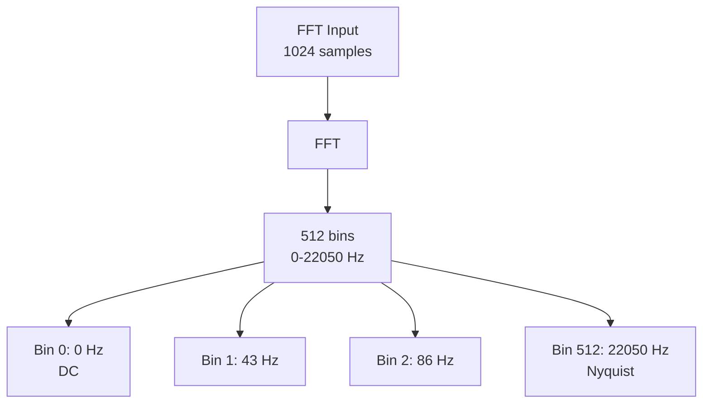

**Qeyd:** Real audio üçün yalnız N/2 bin istifadə olunur (Nyquist frequency-ə qədər).

## Fast Fourier Transform (FFT)

**FFT** - DFT-nin optimallaşdırılmış versiyasıdır, daha sürətli hesablama.

### Komplekslik Müqayisəsi

| Alqoritm | Komplekslik | 1024 sample üçün əməliyyat |
|----------|-------------|----------------------------|
| DFT | O(N²) | ~1,000,000 |
| FFT | O(N log N) | ~10,000 |

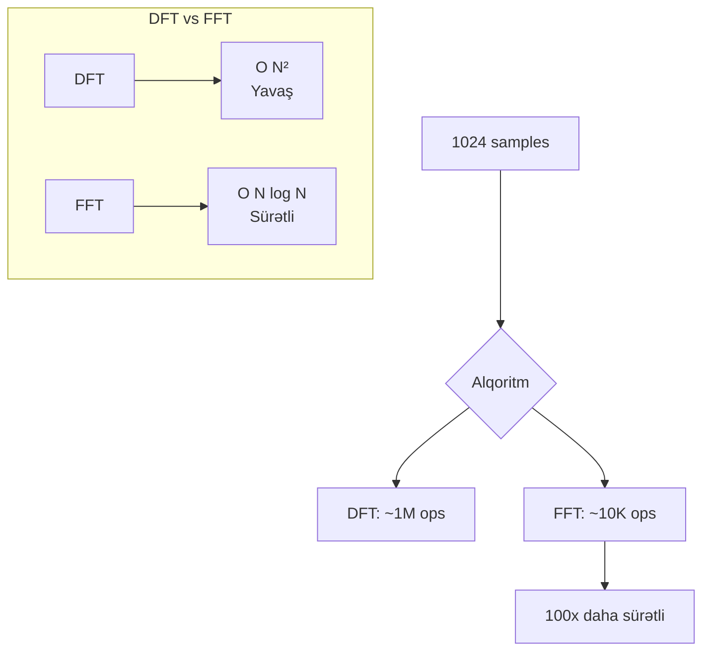

### FFT Size Seçimi

FFT size həmişə 2-nin qüvvəti olmalıdır: 64, 128, 256, 512, 1024, 2048, 4096, 8192...

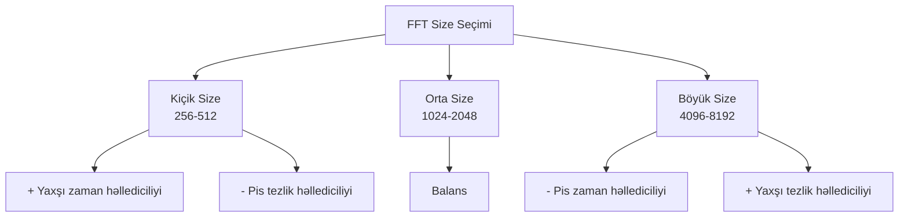

**Trade-off:**
- **Kiçik FFT**: Yaxşı time resolution, pis frequency resolution
- **Böyük FFT**: Pis time resolution, yaxşı frequency resolution

## Windowing

FFT-ni diskret sample-lara tətbiq edərkən discontinuity yaranır. **Windowing** bunu həll edir.

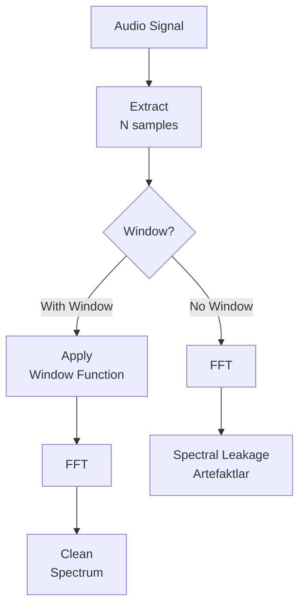

### Window Funksiyaları

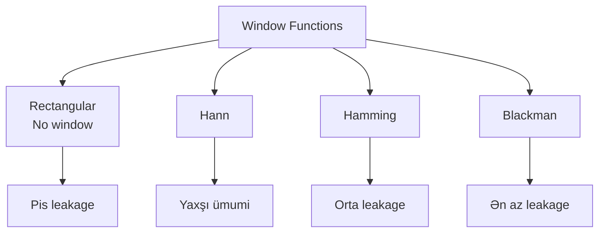

**Populyar window-lar:**

1. **Rectangular (No window):**
   - Sadə, window yoxdur
   - Ən pis spectral leakage

2. **Hann (Hanning):**
   - Ən çox istifadə olunan
   - Yaxşı leakage/resolution balanı

3. **Hamming:**
   - Hann-a oxşar
   - Az fərqli side-lobe xüsusiyyətləri

4. **Blackman:**
   - Ən az spectral leakage
   - Daha geniş main lobe

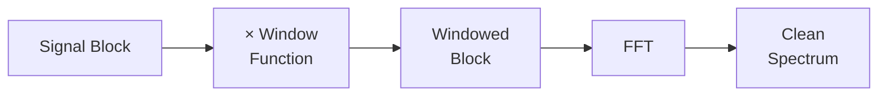

## Short-Time Fourier Transform (STFT)

**STFT** - audio işarəni kiçik bloklara bölüb hər birinə FFT tətbiq edir. Beləcə zaman və tezlik məlumatını eyni anda əldə edirik.

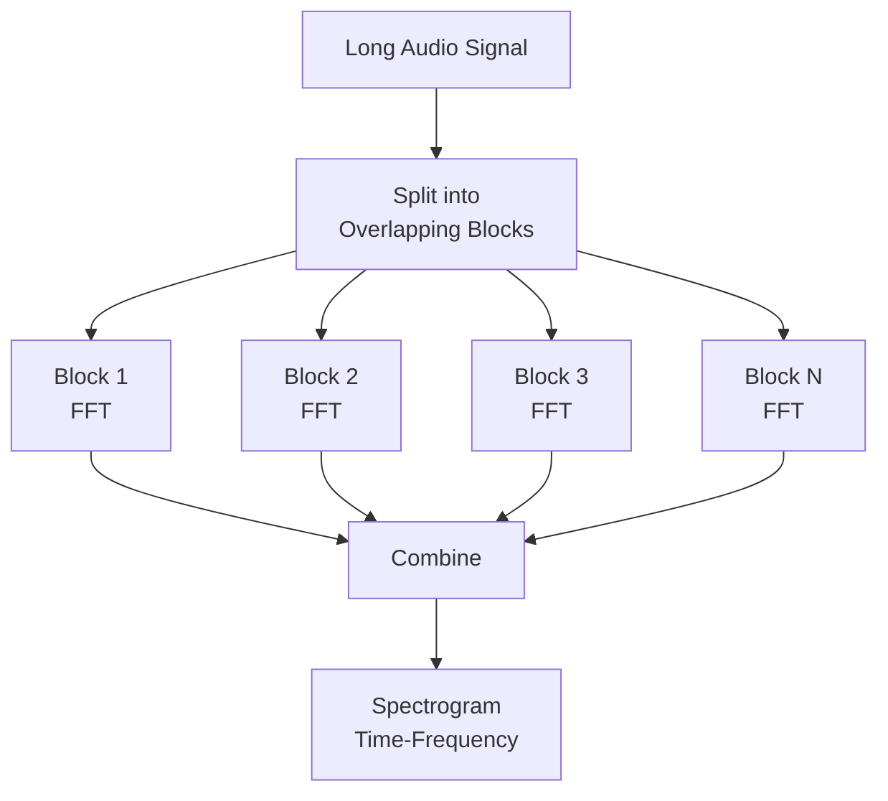

### STFT Parametrləri

**1. Frame Size (FFT size):**
- Tezlik həllediciliyini müəyyən edir
- 1024, 2048, 4096 tipikdir

**2. Hop Size:**
- Frame-lər arası məsafə
- Overlap = Frame Size - Hop Size
- Tipik: 50% overlap (Hop = Frame/2)

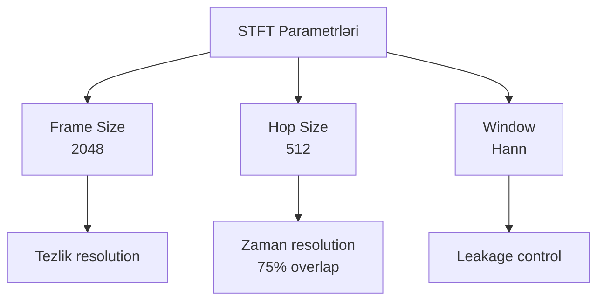

## Spectrogram

**Spectrogram** - STFT-nin vizual təqdimatıdır, zamanla tezlik tərkibini göstərir.

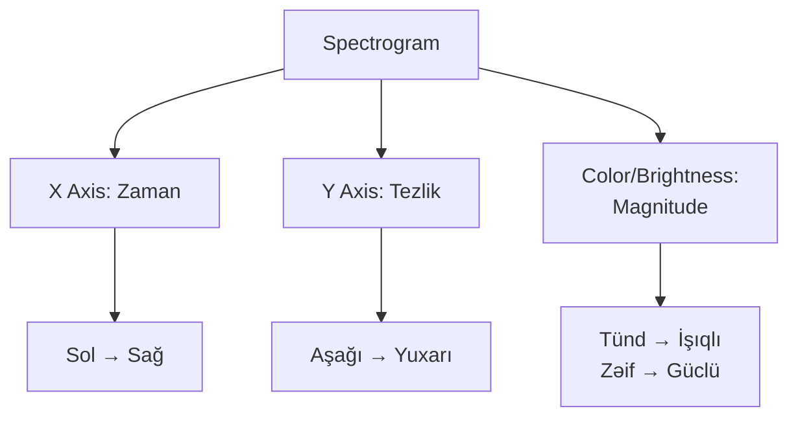

**Spectrogram növləri:**

1. **Linear Spectrogram:**
   - Tezlik xətti şəkildə
   - 0 Hz - Nyquist

2. **Mel Spectrogram:**
   - İnsan eşitməsinə uyğun scale
   - Speech və music analysis

3. **Log Spectrogram:**
   - Loqarifmik tezlik scale
   - Musikal oktavlar

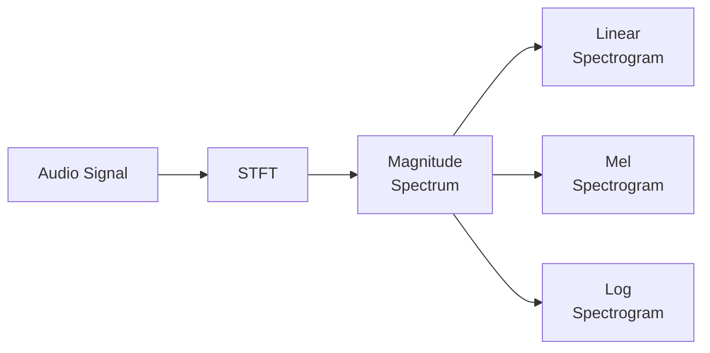

## Frequency Domain Əməliyyatları

Frequency domain-də audio manipulyasiyası çox güclü texnikadır.

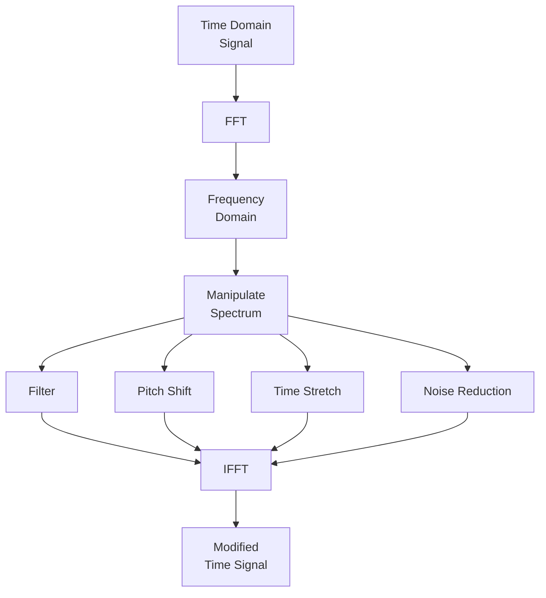

### 1. Filtering

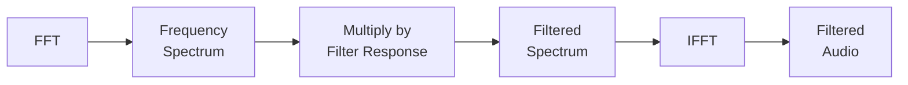

### 2. Phase Vocoder

**Phase Vocoder** - pitch və time-ı müstəqil dəyişmək üçün istifadə olunur.

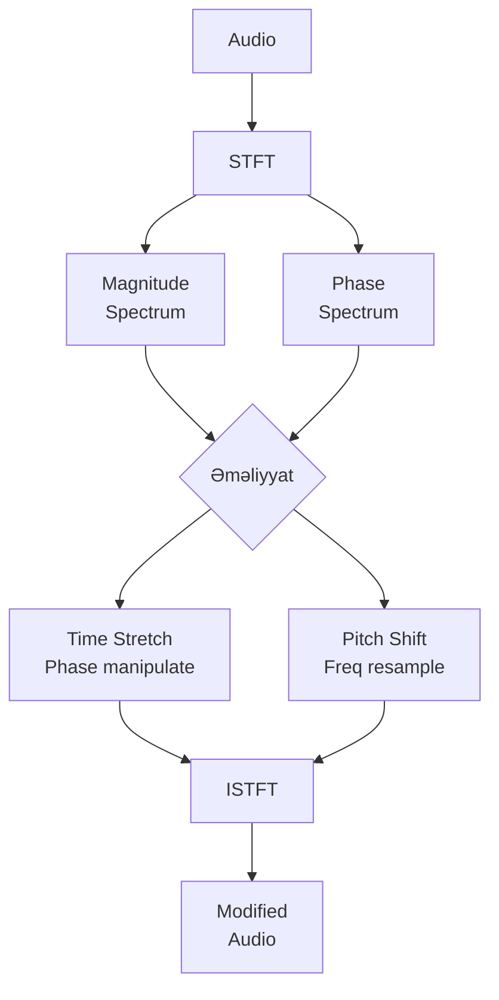

### 3. Spectral Subtraction (Noise Reduction)

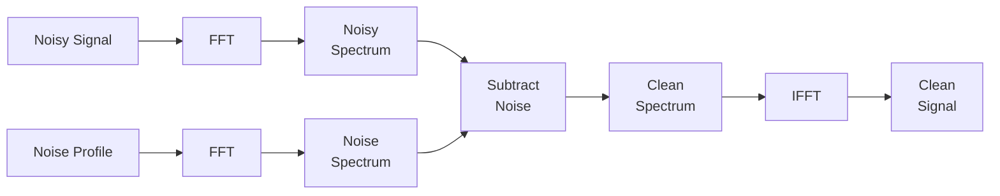

## Magnitude və Phase

FFT nəticəsi kompleks ədədlərdir: magnitude və phase.

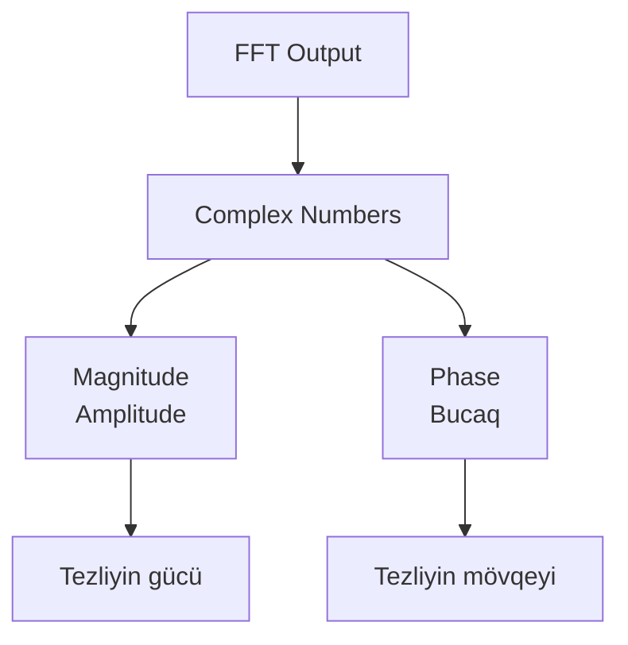

**Hesablama:**
```
Magnitude = sqrt(Real² + Imag²)
Phase = atan2(Imag, Real)
```

**Magnitude:**
- Hər tezliyin nə qədər güclü olduğunu göstərir
- 0-dən yuxarı dəyərlər
- dB-yə çevrilir: dB = 20 × log₁₀(Magnitude)

**Phase:**
- Hər tezliyin dalğanın hansı hissəsində olduğunu göstərir
- -π-dən +π-ə qədər
- Bəzi hallarda lazımsızdır (məs: spectrogram)

## Praktik Tətbiqlər

### 1. Audio Equalizer

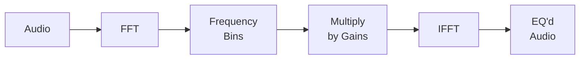

### 2. Pitch Detection

```mermaid
graph LR
    A[Audio<br/>Frame] --> B[FFT]
    B --> C[Find Peak<br/>Frequency]
    C --> D[Fundamental<br/>Frequency]
    D --> E[Pitch<br/>Hz/Note]
```

### 3. Music Transcription

```mermaid
graph TB
    A[Audio] --> B[STFT]
    B --> C[Spectrogram]
    C --> D[Peak<br/>Detection]
    D --> E[Onset<br/>Detection]
    E --> F[Note<br/>Sequence]
    F --> G[MIDI/<br/>Sheet Music]
```

### 4. Audio Fingerprinting

```mermaid
graph LR
    A[Audio] --> B[Spectrogram]
    B --> C[Extract<br/>Peaks]
    C --> D[Create<br/>Hash]
    D --> E[Fingerprint]
    E --> F[Database<br/>Match]
```

## FFT Implementation (Pseudo-code)

### Sadə DFT

```python
def dft(x):
    N = len(x)
    X = []
    
    for k in range(N):
        sum_real = 0
        sum_imag = 0
        
        for n in range(N):
            angle = -2 * π * k * n / N
            sum_real += x[n] * cos(angle)
            sum_imag += x[n] * sin(angle)
        
        X.append(complex(sum_real, sum_imag))
    
    return X
```

### STFT Implementation

```python
def stft(audio, frame_size=2048, hop_size=512, window='hann'):
    frames = []
    
    # Window function
    window = create_window(frame_size, window)
    
    # Split into frames
    for i in range(0, len(audio) - frame_size, hop_size):
        frame = audio[i:i+frame_size]
        windowed = frame * window
        spectrum = fft(windowed)
        frames.append(spectrum)
    
    return frames
```

### Spectrogram Yaratmaq

```python
def create_spectrogram(audio, sample_rate=44100):
    # STFT
    frames = stft(audio, frame_size=2048, hop_size=512)
    
    # Magnitude
    spectrogram = []
    for frame in frames:
        magnitudes = [abs(x) for x in frame[:len(frame)//2]]
        spectrogram.append(magnitudes)
    
    return spectrogram
```

## Performance Optimization

```mermaid
graph TB
    Opt[FFT Optimizasiya] --> Size[2^n Size<br/>İstifadə et]
    Opt --> Lib[Optimized<br/>Library]
    Opt --> Cache[Data Cache]
    Opt --> Para[Parallel<br/>Processing]
    
    Size --> S1[FFT alqoritmi<br/>üçün optimal]
    Lib --> L1[FFTW, Intel MKL]
    Cache --> C1[Memory access<br/>optimallaşdır]
    Para --> P1[Çox core<br/>istifadə et]
```

**Tövsiyələr:**
- FFT size həmişə 2-nin qüvvəti
- Optimized library istifadə et (FFTW, numpy.fft)
- Real-time processing üçün overlap-add method
- Parallel processing (GPU acceleration)

## Xülasə

**Fourier Transform:**
- Zaman domenini tezlik domeninə çevirir
- Audio-nun tezlik komponentlərini göstərir
- Analiz və manipulyasiya üçün fundamental alətdir

**FFT:**
- DFT-nin sürətli versiyası: O(N log N)
- Size 2-nin qüvvəti olmalıdır
- Real-time audio processing üçün praktikdir

**STFT və Spectrogram:**
- Zaman və tezlik məlumatını birləşdirir
- Spectrogram vizual təqdimat verir
- Music analysis, speech processing üçün vacibdir

**Praktik:**
- EQ və filtering frequency domain-də asandır
- Pitch detection və music transcription
- Noise reduction və audio restoration
- Phase vocoder: pitch/time manipulation
