# Audio Kompressiya

## Giriş

**Audio Kompressiya** - audio faylın ölçüsünü azaltmaq məqsədi ilə məlumatı sıxışdırma prosesidir. İki əsas növü var:
1. **Lossless** - məlumat itkisi olmadan
2. **Lossy** - qəbul edilə bilən keyfiyyət itkisi ilə

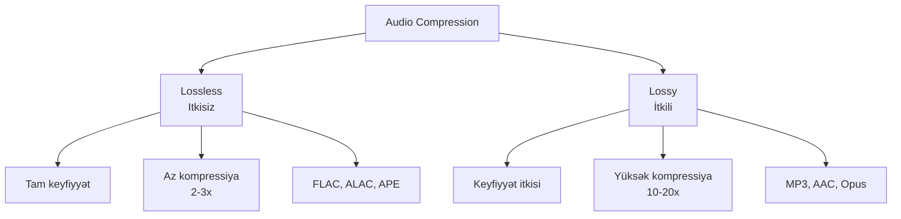

## Niyə Kompressiya Lazımdır?

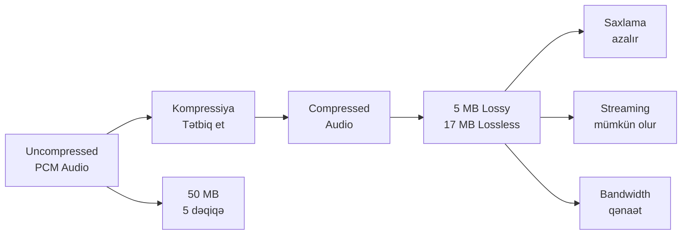

**Motivasiya:**
- Disk space qənaəti
- Sürətli streaming
- Bandwidth azaldılması
- Daha çox musiqi saxlamaq

## Lossless Compression

**Lossless** - orijinal audio tam olaraq bərpa edilə bilər, məlumat itkisi yoxdur.

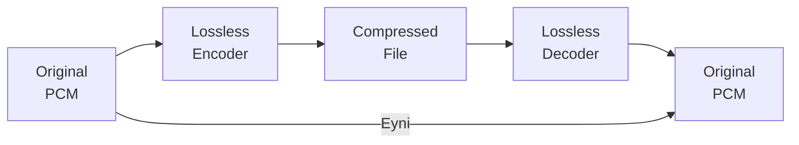

### Lossless Prinsipləri

**1. Run-Length Encoding:**
- Ardıcıl eyni dəyərləri sıxışdırır
- Məs: 0,0,0,0,0 → "5 dəfə 0"

**2. Huffman Coding:**
- Tez-tez təkrarlanan dəyərlərə qısa kod verir
- Nadir dəyərlərə uzun kod

**3. Linear Prediction:**
- Növbəti sample-ı əvvəlkilərdən təxmin edir
- Yalnız fərqi (residual) saxlayır

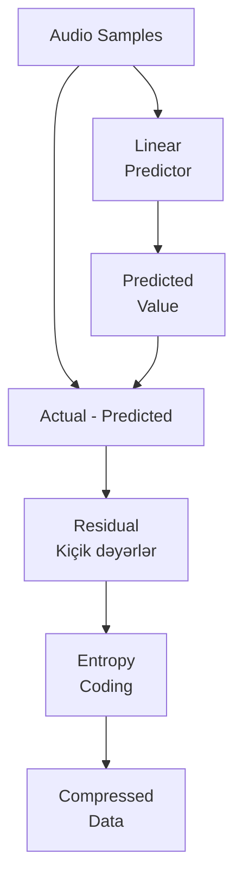

### Populyar Lossless Codec-lər

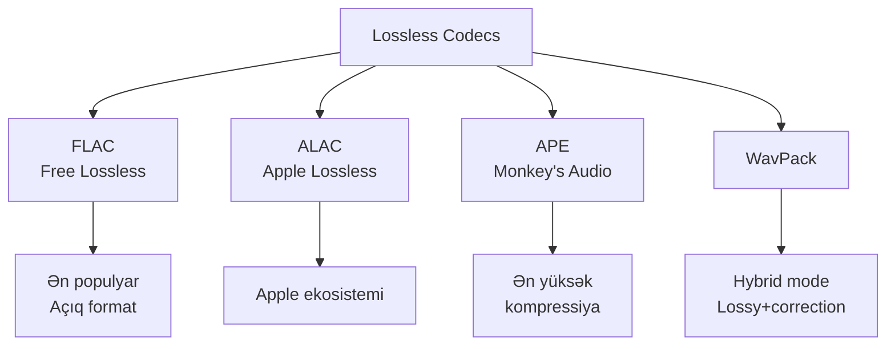

**Müqayisə:**

| Codec | Kompressiya | Sürət | Platform |
|-------|-------------|-------|----------|
| FLAC | 40-60% | Sürətli | Universal |
| ALAC | 40-60% | Sürətli | Apple |
| APE | 50-65% | Yavaş | Windows |
| WavPack | 40-60% | Orta | Universal |

## Lossy Compression

**Lossy** - perceptual coding istifadə edərək eşidilməyən məlumatı silir.

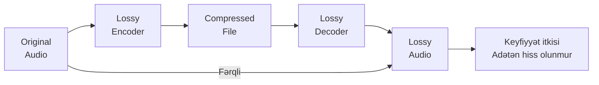

### Perceptual Coding

**Psychoacoustic Model** - insan eşitməsinin məhdudiyyətlərindən istifadə edir.

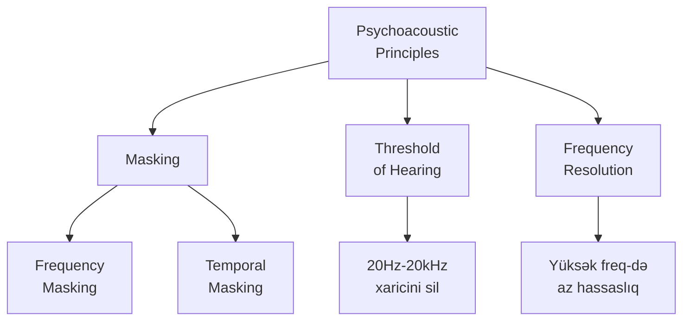

### 1. Frequency Masking

Güclü səs yaxınlıqdakı zəif səsləri maskeləyir.

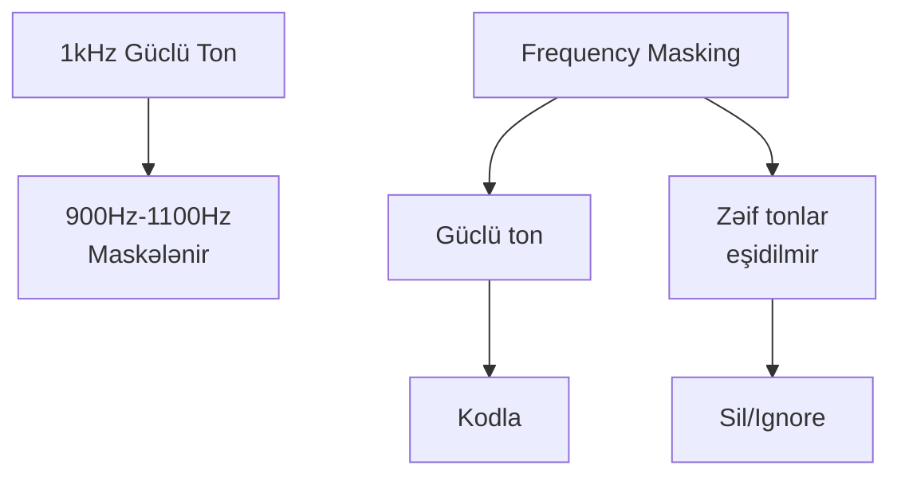

**Nümunə:**
- 1000 Hz-də güclü ton
- 950 Hz və 1050 Hz-də zəif tonlar eşidilmir
- Zəif tonları kodlamağa ehtiyac yoxdur

### 2. Temporal Masking

Güclü səs öncə və sonrakı zəif səsləri maskeləyir.

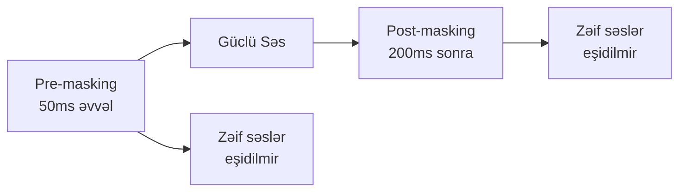

### 3. Threshold of Hearing

İnsan eşitmə həddindən aşağı səsləri kodlamağa ehtiyac yoxdur.

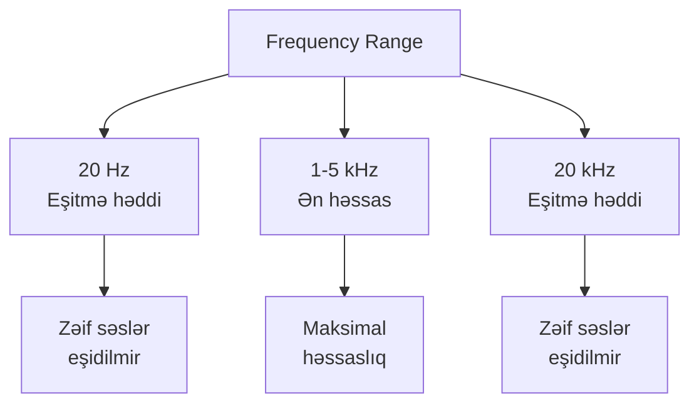

## Bitrate və Keyfiyyət

**Bitrate** - saniyədə nə qədər məlumat ötürüldüyü (kbps - kilobit per second).

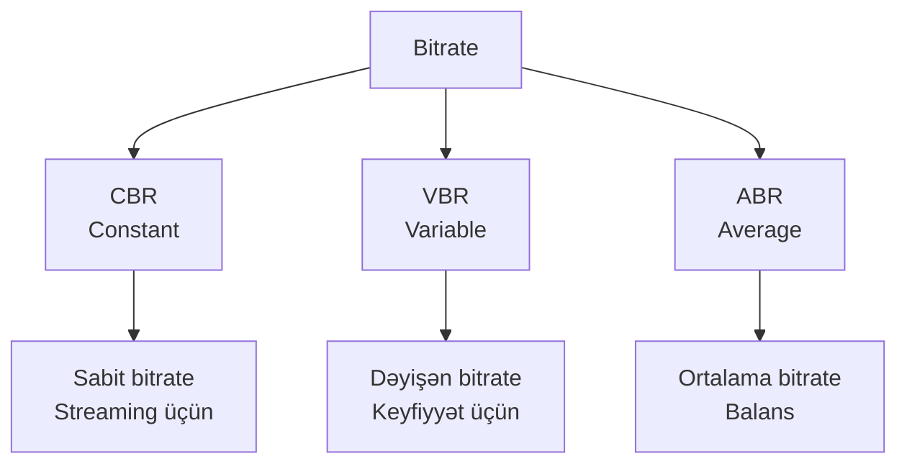

### Bitrate Növləri

**1. Constant Bitrate (CBR):**
- Hər kadr eyni bitrate
- Sadə, təxmin edilə bilən
- Streaming üçün ideal

**2. Variable Bitrate (VBR):**
- Kompleks hissələrdə yüksək, sadə hissələrdə aşağı
- Daha yaxşı keyfiyyət/ölçü nisbəti
- Fayl ölçüsü dəyişkən

**3. Average Bitrate (ABR):**
- Ortalama bitrate saxlanılır
- VBR və CBR arası

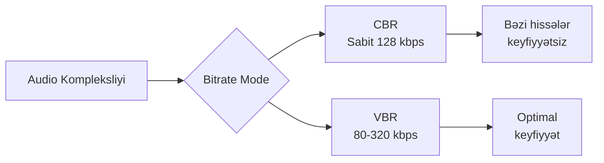

### Bitrate vs Keyfiyyət

| Bitrate | Keyfiyyət | İstifadə |
|---------|-----------|----------|
| 64 kbps | Aşağı | Voice, podcast |
| 96 kbps | Orta-aşağı | Streaming (mobil) |
| 128 kbps | Orta | Ümumi streaming |
| 192 kbps | Yaxşı | Yüksək keyfiyyət |
| 256 kbps | Çox yaxşı | Audiophile |
| 320 kbps | Maksimal | Şəffaf keyfiyyət |

## Populyar Lossy Codec-lər

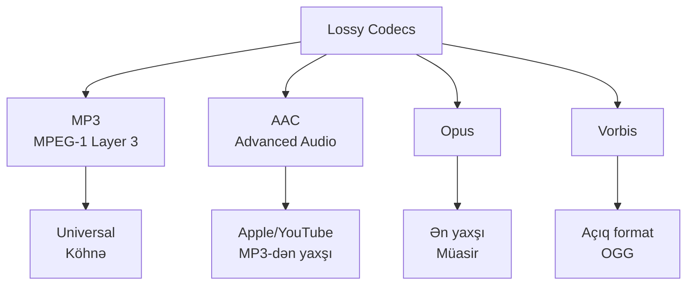

### 1. MP3 (MPEG-1 Audio Layer 3)

**MP3** - ən məşhur audio format, 1993-də yaradılıb.

**Xüsusiyyətləri:**
- Universal dəstək
- 32-320 kbps bitrate
- CBR və VBR dəstəyi
- Köhnə texnologiya

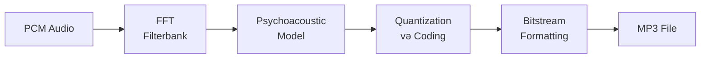

**Üstünlükləri:**
- Hər yerdə dəstəklənir
- Sadə və sürətli
- Çoxlu alətlər

**Çatışmazlıqları:**
- Müasir codec-lərdən keyfiyyəti aşağı
- Patentlər (son vaxtlar azad olunub)
- Yüksək tezliklərdə zəif

### 2. AAC (Advanced Audio Coding)

**AAC** - MP3-ün varisi, daha yüksək keyfiyyət.

**Xüsusiyyətləri:**
- MP3-dən 20-30% daha yaxşı
- Apple ekosistemində standart
- YouTube, Spotify istifadə edir
- 8-512 kbps

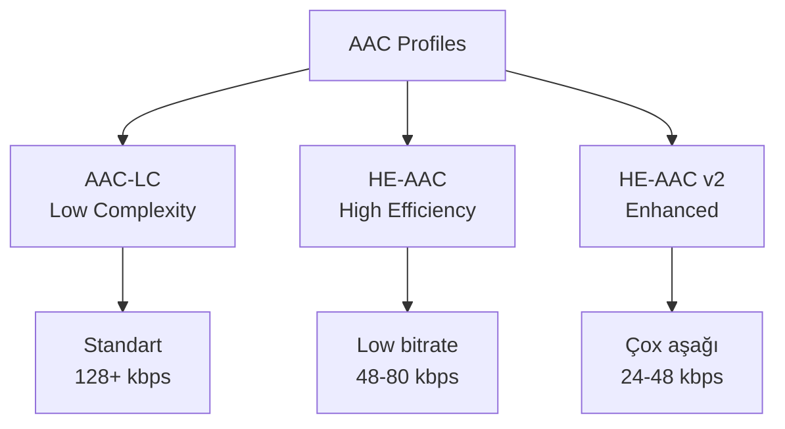

**AAC Profiles:**
- **AAC-LC**: Ümumi məqsəd, ən çox yayılmış
- **HE-AAC**: Aşağı bitrate streaming
- **HE-AAC v2**: Çox aşağı bitrate (mono/stereo)

### 3. Opus

**Opus** - müasir, universal codec, 2012-də standartlaşdırılıb.

**Xüsusiyyətləri:**
- Ən yaxşı keyfiyyət/bitrate
- 6-510 kbps
- Aşağı latency
- VoIP-dən music-ə qədər
- Royalty-free

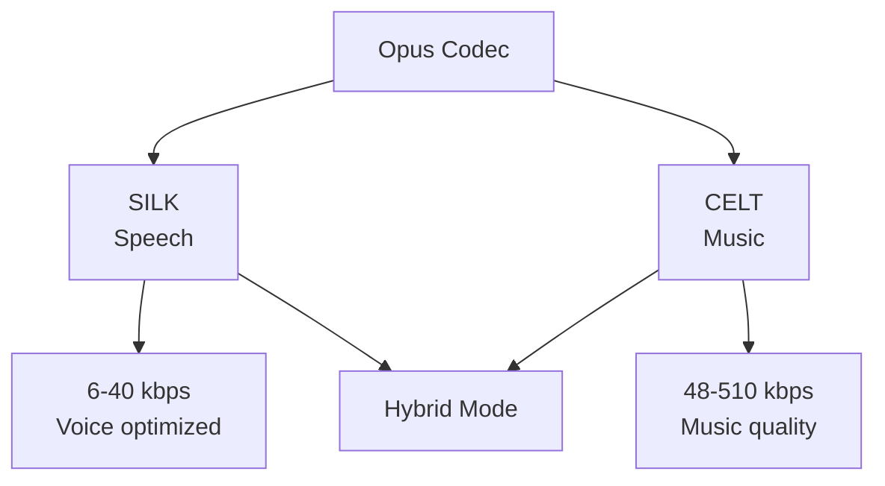

**Üstünlükləri:**
- Ən yaxşı müasir codec
- Universal (speech + music)
- Aşağı latency
- Açıq və azad

**İstifadə sahələri:**
- VoIP (WhatsApp, Discord)
- Streaming (YouTube)
- WebRTC
- Gaming voice chat

### 4. Vorbis

**Vorbis** - açıq, royalty-free, MP3 alternatividir.

**Xüsusiyyətləri:**
- OGG konteynerində
- MP3-ə bərabər və ya yaxşı
- Açıq format
- Az yayılmış

## MDCT (Modified Discrete Cosine Transform)

Çox lossy codec-lər MDCT istifadə edir.

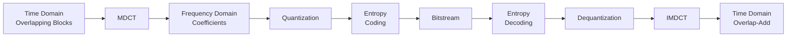

**MDCT xüsusiyyətləri:**
- FFT-yə oxşar, lakin kritik sampling
- Overlap-add ilə bərpa
- MP3, AAC, Vorbis, Opus (CELT) istifadə edir

## Codec Müqayisəsi

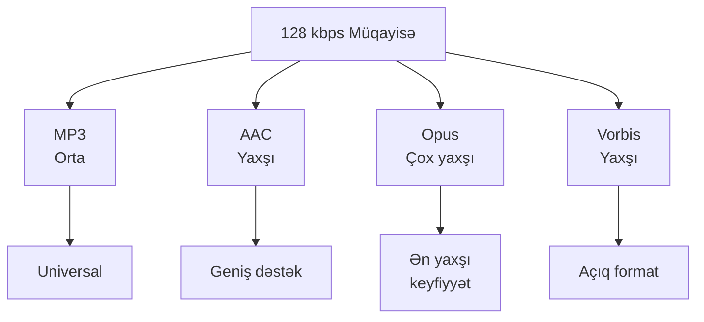

**Keyfiyyət sırası (eyni bitrate-də):**
1. **Opus** - Ən yaxşı
2. **AAC** - Çox yaxşı
3. **Vorbis** - Yaxşı
4. **MP3** - Orta

**Praktik seçim:**

| Məqsəd | Tövsiyə | Bitrate |
|--------|---------|---------|
| Universal yığma | MP3 | 192-320 kbps |
| Apple ecosystem | AAC | 256 kbps |
| Modern streaming | Opus | 128-192 kbps |
| Açıq format | Vorbis | 192 kbps |
| VoIP/Voice | Opus | 24-48 kbps |
| Podcast | AAC/Opus | 64-96 kbps |
| Archival | FLAC | Lossless |

## Streaming və Adaptive Bitrate

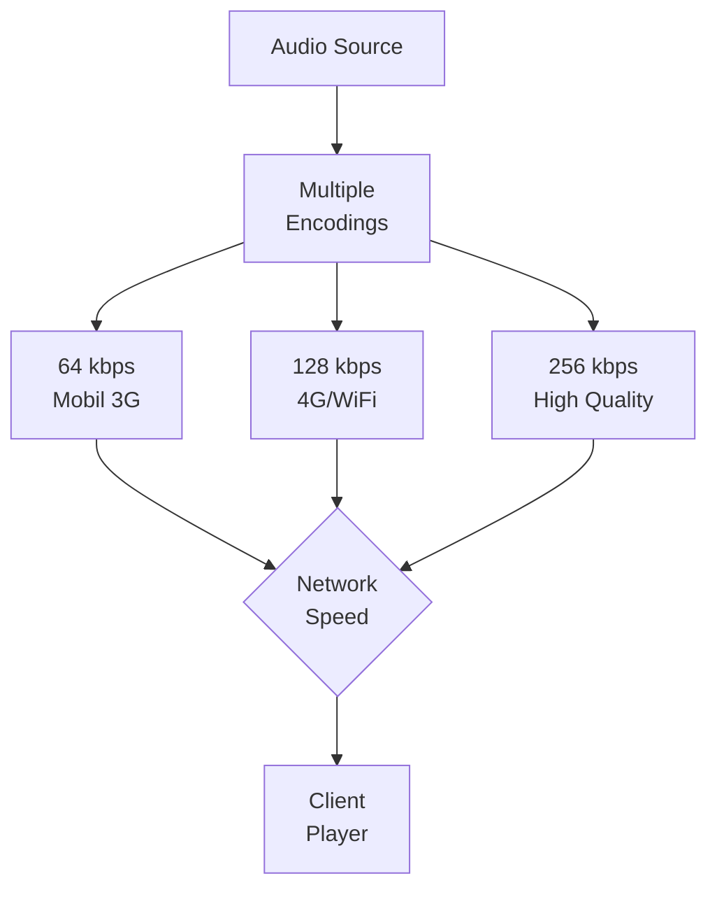

**Adaptive Streaming:**
- Şəbəkə sürətinə görə bitrate dəyişir
- Spotify, YouTube Music, Apple Music istifadə edir
- DASH (Dynamic Adaptive Streaming over HTTP)
- HLS (HTTP Live Streaming)

## Kompressiya Artefaktları

Lossy kompressiya artefaktlar yarada bilər.

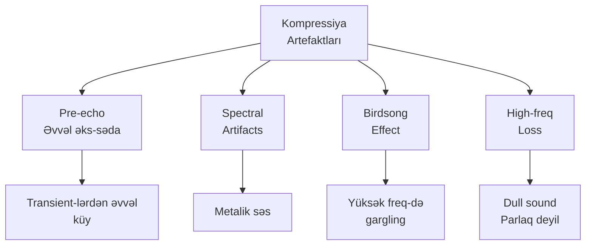

**Artefaktları azaltmaq:**
- Daha yüksək bitrate
- Daha yaxşı codec (Opus)
- VBR istifadə et
- Proper mastering

## Praktik Tövsiyələr

### Encoding Parametrləri

```mermaid
graph TB
    A[Audio Type] --> B{Növ?}
    
    B --> C[Music]
    B --> D[Voice/Podcast]
    B --> E[Streaming]
    
    C --> C1[AAC 256 VBR<br/>Opus 192]
    D --> D1[Opus 64-96<br/>AAC 96]
    E --> E1[Adaptive<br/>64-256]
```

**Music üçün:**
- Format: AAC/Opus
- Bitrate: 192-256 kbps VBR
- Lossless üçün: FLAC

**Voice/Podcast üçün:**
- Format: Opus/AAC
- Bitrate: 64-96 kbps
- Mono kifayətdir

**Streaming üçün:**
- Adaptive bitrate
- Opus üstünlük
- Multiple quality tiers

## Xülasə

**Lossless:**
- Tam keyfiyyət, bərpa edilə bilər
- 2-3x kompressiya
- FLAC ən populyar və universal
- Archival və production üçün

**Lossy:**
- Keyfiyyət itkisi, kiçik ölçü
- 10-20x kompressiya
- Perceptual coding istifadə edir
- Streaming və storage üçün

**Codec seçimi:**
- **Opus**: Ən yaxşı müasir seçim
- **AAC**: Geniş dəstək, yaxşı keyfiyyət
- **MP3**: Universal, köhnə
- **FLAC**: Lossless archival

**Bitrate:**
- 128 kbps: Minimum acceptable
- 192 kbps: Yaxşı keyfiyyət
- 256+ kbps: Şəffaf keyfiyyət
- VBR > CBR (keyfiyyət üçün)

**Trend:**
- Opus daha çox yayılır
- Streaming adaptive bitrate istifadə edir
- Lossless streaming artır (Tidal, Apple Music)
- Bandwidth artdıqca yüksək keyfiyyət accessible olur
