# Audio Effektləri

## Giriş

**Audio Effektləri** - səsin xarakterini, məkanını və dinamikasını dəyişdirmək üçün istifadə olunan DSP (Digital Signal Processing) texnikalarıdır.

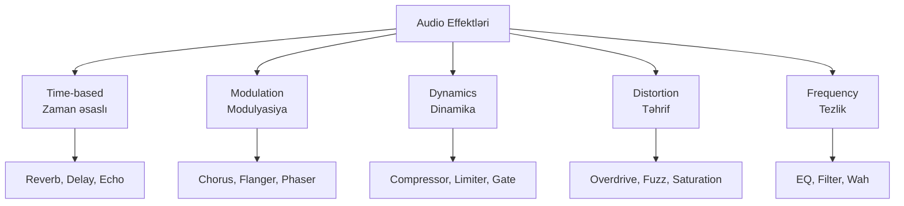

## Time-Based Effektlər

Time-based effektlər səsi gecikdirərək məkan və dərinlik yaradır.

### 1. Delay (Echo)

**Delay** - səsi gecikdirərək təkrarlayır, əks-səda effekti yaradır.

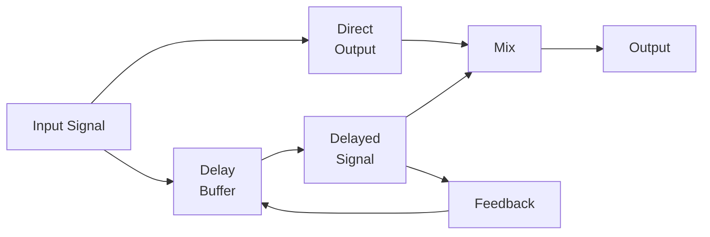

**Parametrlər:**

1. **Delay Time**: Gecikdirmə müddəti (ms)
   - Short delay: 1-50ms (slapback)
   - Medium delay: 50-500ms (echo)
   - Long delay: 500ms+ (rhythmic)

2. **Feedback**: Təkrarlanma sayı (0-100%)
   - Aşağı: 1-2 təkrar
   - Orta: Bir neçə təkrar
   - Yüksək: Sonsuz təkrar (oscillation)

3. **Mix (Wet/Dry)**: Original və effektli səsin nisbəti
   - 0%: Yalnız original
   - 50%: Bərabər
   - 100%: Yalnız effekt

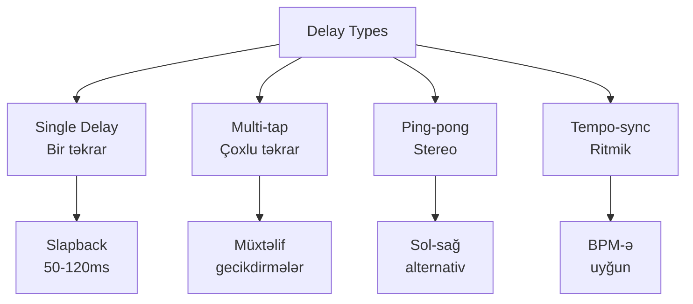

**İstifadə sahələri:**
- Vokal üçün dərinlik
- Gitara üçün ambient
- Ritmik effektlər
- Space və atmosphere

### 2. Reverb (Reverberation)

**Reverb** - otaq və ya məkan akustikasını simulyasiya edir, səsə təbii əks-səda əlavə edir.

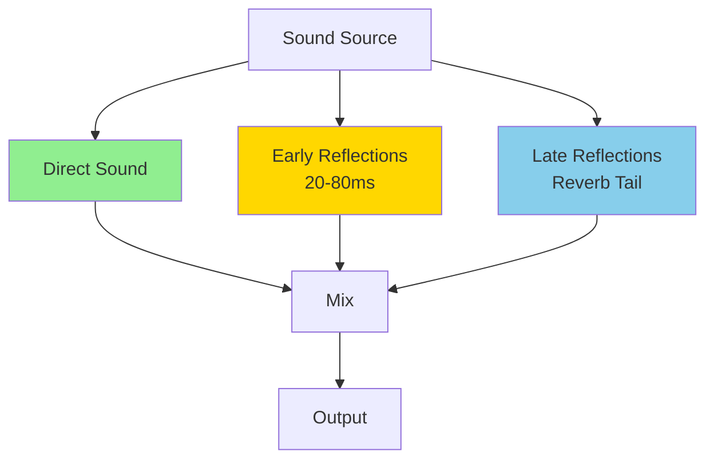

**Reverb Komponentləri:**

1. **Direct Sound**: Birbaşa səs
2. **Early Reflections**: İlk əks-sədalar (otaq ölçüsü)
3. **Reverb Tail**: Gec əks-sədalar (diffusion)

**Parametrlər:**

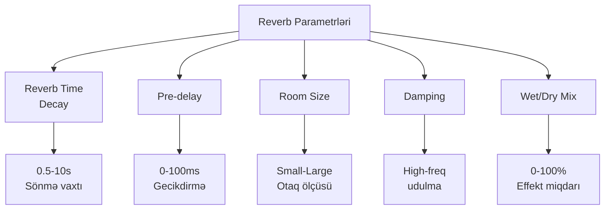

**Reverb Növləri:**

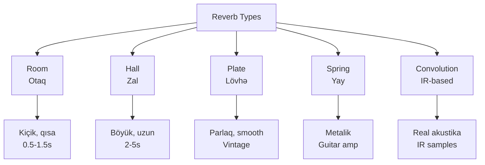

**Alqoritmik Reverb:**
```python
def simple_reverb(input, size=1000, feedback=0.5, mix=0.3):
    buffer = [0] * size
    output = []
    
    for sample in input:
        # Comb filter
        delayed = buffer[0]
        buffer.pop(0)
        buffer.append(sample + delayed * feedback)
        
        # Mix
        result = sample * (1 - mix) + delayed * mix
        output.append(result)
    
    return output
```

**Convolution Reverb:**
- Real məkanın Impulse Response (IR) istifadə edir
- Daha real və natural səs
- CPU-intensive

### 3. Echo

**Echo** - aydın və fərqlənən təkrarlardır, delay-ə oxşar lakin daha uzun interval.

**Delay vs Echo:**
- **Delay**: Qısa (< 500ms), blend olur
- **Echo**: Uzun (> 500ms), aydın təkrarlar

## Modulation Effektləri

Modulation effektləri səsin pitch, phase və ya amplitudasını dəyişdirərək hərəkət və dərinlik yaradır.

### 1. Chorus

**Chorus** - işarəni kopyalayıb az gecikdirir və pitch-i modulyasiya edir, bir neçə instrument kimi səslənir.

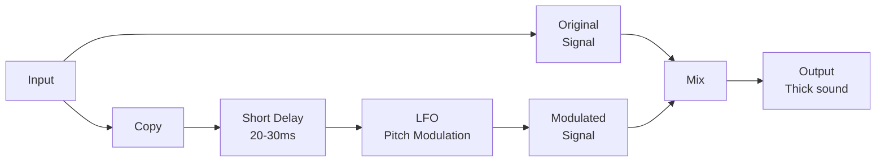

**Parametrlər:**
- **Rate**: LFO tezliyi (0.1-5 Hz)
- **Depth**: Modulyasiya dərinliyi
- **Delay**: Əsas gecikdirmə (20-30ms)
- **Mix**: Wet/Dry

**Effekt:**
- Səsi "qalın" (thick) edir
- Bir gitara iki kimi səslənir
- Vokal və synth-də populyar

### 2. Flanger

**Flanger** - chorus-a oxşardır, lakin daha qısa delay (1-10ms) və feedback istifadə edir.

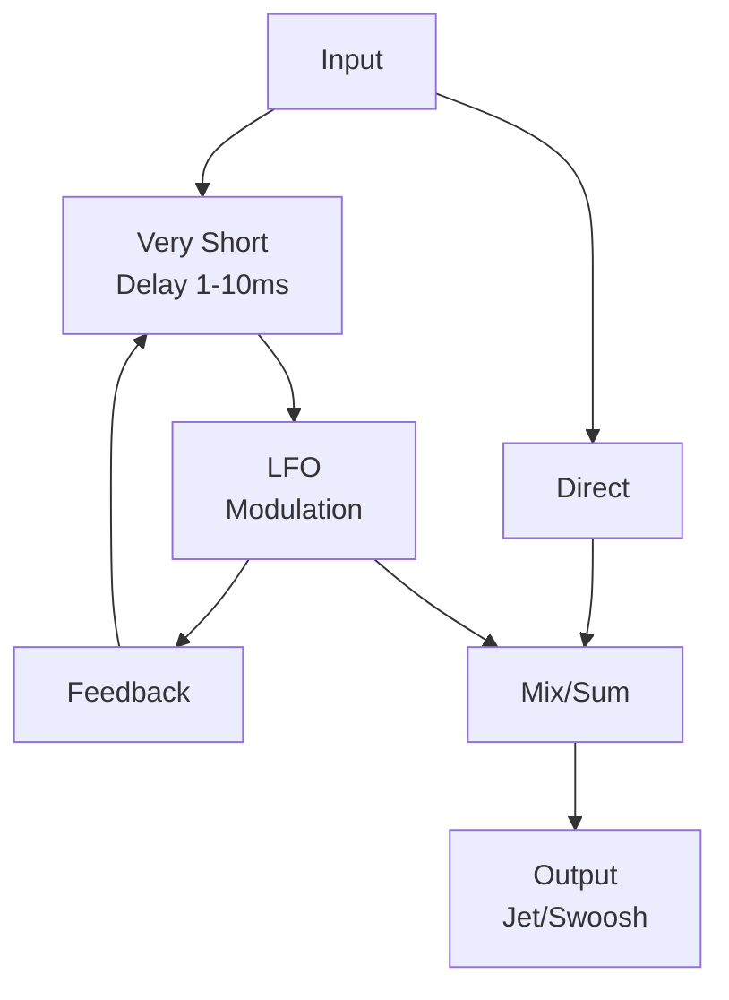

**Xüsusiyyətləri:**
- "Jet plane" və ya "swoosh" səsi
- Comb filtering effekti
- Feedback yüksək ola bilər

**Chorus vs Flanger:**
- **Chorus**: 20-30ms delay, feedback yoxdur
- **Flanger**: 1-10ms delay, feedback var

### 3. Phaser

**Phaser** - all-pass filter-lər istifadə edərək phase-i modulyasiya edir.

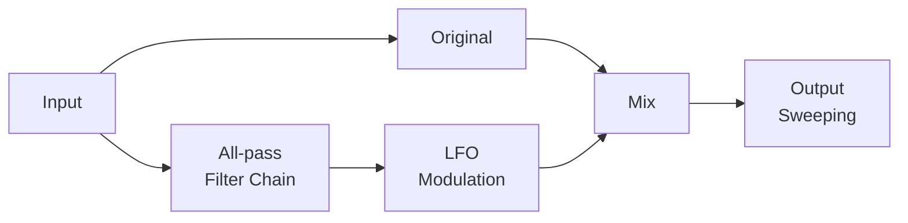

**Xüsusiyyətləri:**
- "Sweeping" effekt
- Flanger-dən daha smooth
- Notch-lar yaradır

**Müqayisə:**

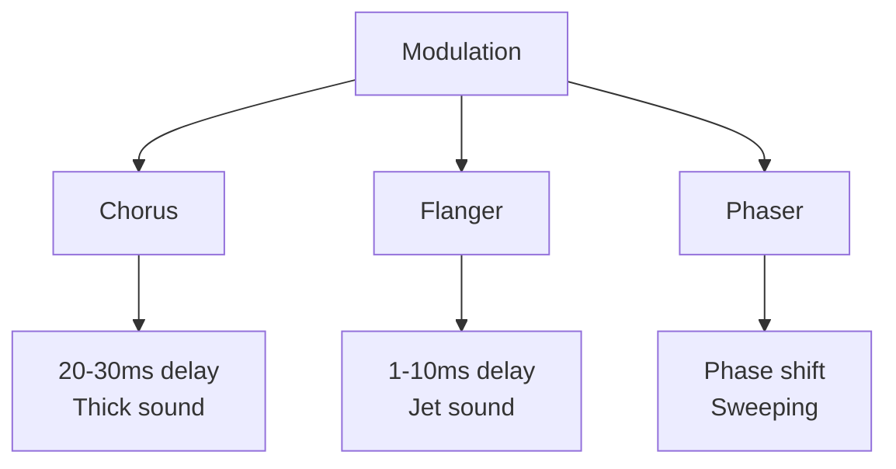

### 4. Tremolo və Vibrato

**Tremolo** - amplitudanı modulyasiya edir.
**Vibrato** - pitch-i modulyasiya edir.

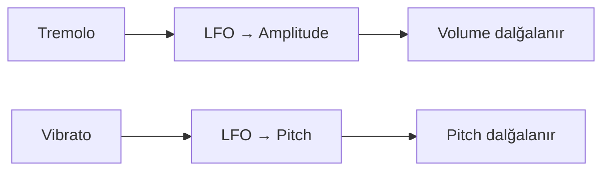

## Dynamics Prosessinq

Dynamics effektləri audio-nun dinamik diapazonunu idarə edir.

### 1. Compressor

**Compressor** - yüksək səsləri azaldır, dinamik diapazonu daraldır.

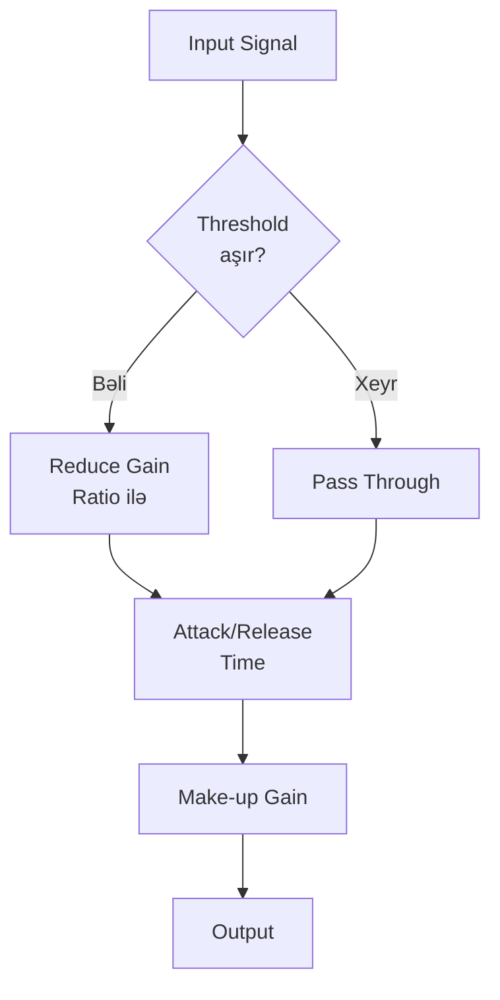

**Parametrlər:**

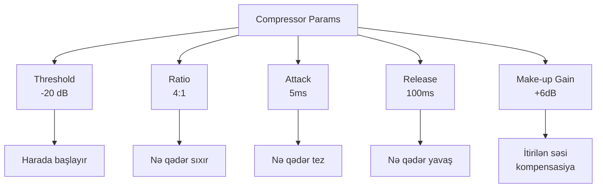

**Ratio:**
- **1:1**: Kompressiya yoxdur
- **2:1**: Yumşaq kompressiya
- **4:1**: Orta kompressiya
- **8:1**: Güclü kompressiya
- **∞:1**: Limiting (bax aşağı)

**Attack və Release:**
- **Fast Attack**: Transient-ləri daraldır
- **Slow Attack**: Transient-ləri buraxır (punch)
- **Fast Release**: Pumping effekti
- **Slow Release**: Smooth, natural

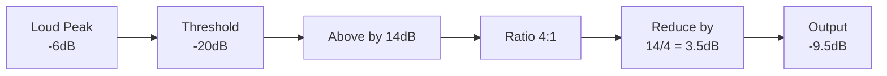

**İstifadə sahələri:**
- Vokal-ı bərabərləşdirmək
- Drum-ları punch-lamaq
- Mix-də elementləri kontrol etmək
- Mastering-də ümumi dinamika

### 2. Limiter

**Limiter** - çox yüksək ratio (∞:1) ilə compressor, pik-ləri sərt şəkildə kəsir.

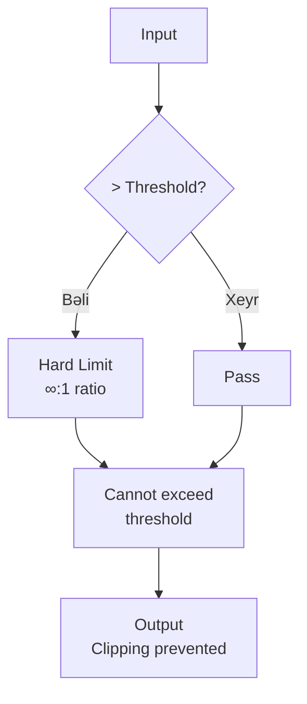

**Kompressor vs Limiter:**
- **Compressor**: Yumşaq (2:1-8:1), musical
- **Limiter**: Sərt (∞:1), protection

**İstifadə:**
- Mastering (loudness)
- Clipping-in qarşısını almaq
- Maksimum səviyyəni təyin etmək

### 3. Gate (Noise Gate)

**Gate** - threshold-dan aşağı səsləri kəsir (susturur).

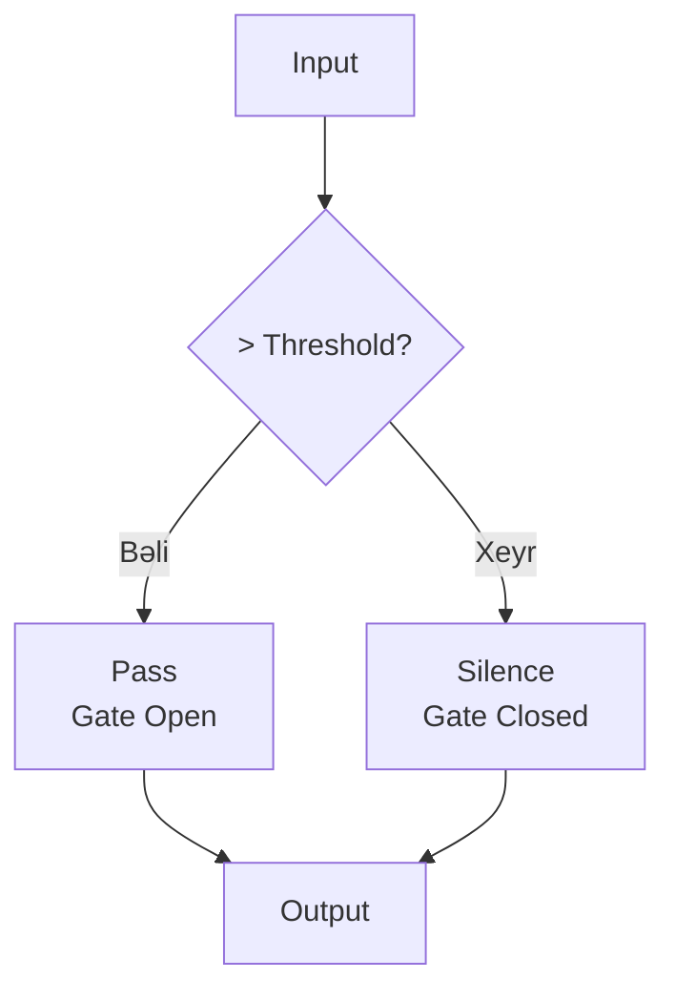

**Parametrlər:**
- **Threshold**: Açılma səviyyəsi
- **Attack**: Açılma sürəti
- **Release**: Bağlanma sürəti
- **Hold**: Açıq qalma vaxtı

**İstifadə:**
- Drum-larda bleed-i aradan qaldırmaq
- Background noise-u silmək
- Vokal breath-ləri azaltmaq

### 4. Expander

**Expander** - gate-ə oxşar, lakin sərt kəsmək əvəzinə yumşaq şəkildə azaldır.

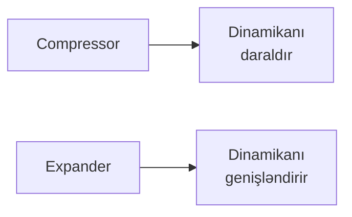

## Distortion və Saturation

Distortion səsi təhrif edərək harmoniklər əlavə edir, agresiv və ya warm səs yaradır.

### 1. Overdrive

**Overdrive** - yumşaq clipping, warm harmoniklər.


**Xüsusiyyətləri:**
- Tube amp simulyasiyası
- Yumşaq harmonic distortion
- Natural səs
- Blues, rock

### 2. Distortion

**Distortion** - overdrive-dan daha hard clipping, daha çox harmoniklər.

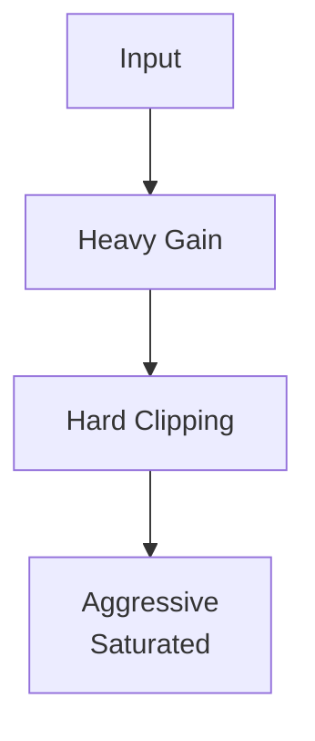

**Xüsusiyyətləri:**
- Daha agresiv
- Metal, hard rock
- Çox harmoniklər

### 3. Fuzz

**Fuzz** - maksimum distortion, squared waveform.

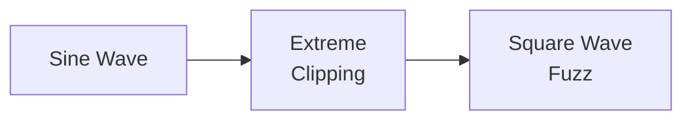

**Xüsusiyyətləri:**
- Ən ekstrem distortion
- Vintage sound
- Thick, buzzy

### 4. Saturation

**Saturation** - incə harmonic distortion, analog warmth.

```mermaid
graph TB
    Dist[Distortion Types] --> OD[Overdrive<br/>Soft]
    Dist --> Dis[Distortion<br/>Hard]
    Dist --> Fuzz[Fuzz<br/>Extreme]
    Dist --> Sat[Saturation<br/>Subtle]
    
    OD --> O1[2nd harmonic<br/>Warm]
    Dis --> D1[Odd harmonics<br/>Aggressive]
    Fuzz --> F1[Square wave<br/>Buzzy]
    Sat --> S1[Analog warmth<br/>Tape/Tube]
```

**Waveshaping:**
```python
def soft_clip(x, threshold=0.7):
    if abs(x) < threshold:
        return x
    else:
        return threshold * sign(x) * (1 - exp(-(abs(x)-threshold)))

def hard_clip(x, threshold=0.9):
    return max(-threshold, min(threshold, x))
```

## Frequency-Based Effektlər

### 1. Wah-Wah

**Wah** - band-pass filter-in center tezliyini modulyasiya edir.

```mermaid
graph LR
    A[Input] --> B[Band-pass<br/>Filter]
    B --> C[Pedal/LFO<br/>Control]
    C --> D[Sweep Freq<br/>400-2000Hz]
    D --> E[Output<br/>Wah sound]
```

### 2. Auto-Wah (Envelope Filter)

Input amplitudasına görə filter tezliyini dəyişir.

```mermaid
graph TB
    A[Input] --> B[Envelope<br/>Follower]
    B --> C[Control<br/>Filter Freq]
    
    A --> D[Band-pass<br/>Filter]
    C --> D
    D --> E[Output]
```

## Multi-Effects və Chain

```mermaid
graph LR
    A[Input] --> B[Compressor]
    B --> C[EQ]
    C --> D[Overdrive]
    D --> E[Chorus]
    E --> F[Delay]
    F --> G[Reverb]
    G --> H[Limiter]
    H --> I[Output]
```

**Effekt ardıcıllığı:**

1. **Dynamics** (Compressor, Gate) - Əvvəlcə
2. **EQ** - Tonal shaping
3. **Distortion** - Tone generation
4. **Modulation** (Chorus, Flanger) - Texture
5. **Time** (Delay, Reverb) - Space
6. **Limiter** - Son mərhələ

## Praktik İstifadə

### Vokal Processing Chain

```mermaid
graph LR
    A[Raw Vocal] --> B[Gate<br/>Noise cut]
    B --> C[Compressor<br/>Even out]
    C --> D[EQ<br/>Tone shape]
    D --> E[De-esser<br/>Sibilance]
    E --> F[Delay<br/>Depth]
    F --> G[Reverb<br/>Space]
    G --> H[Processed<br/>Vocal]
```

### Guitar Processing

```mermaid
graph LR
    A[Guitar] --> B[Compressor<br/>Sustain]
    B --> C[Overdrive<br/>Tone]
    C --> D[Chorus<br/>Thickness]
    D --> E[Delay<br/>Ambience]
    E --> F[Reverb<br/>Space]
```

### Drum Processing

```mermaid
graph TB
    A[Kick] --> A1[Compressor<br/>+ EQ]
    B[Snare] --> B1[Gate<br/>+ Reverb]
    C[Hi-hat] --> C1[EQ<br/>+ Pan]
    D[Overhead] --> D1[Compressor<br/>+ Reverb]
    
    A1 --> Mix[Mix Bus]
    B1 --> Mix
    C1 --> Mix
    D1 --> Mix
    
    Mix --> E[Bus Compressor]
```

## Xülasə

**Time-based:**
- **Delay**: Echo və space yaradır
- **Reverb**: Akustik məkan simulyasiyası
- Dərinlik və atmosphere əlavə edir

**Modulation:**
- **Chorus**: Thick, double sound
- **Flanger**: Jet, swoosh effekti
- **Phaser**: Sweeping, notches
- Hərəkət və texture yaradır

**Dynamics:**
- **Compressor**: Dinamikanı daraldır
- **Limiter**: Peak-ləri məhdudlaşdırır
- **Gate**: Noise-u kəsir
- Səviyyə və kontrol təmin edir

**Distortion:**
- **Overdrive**: Yumşaq, warm
- **Distortion**: Hard, aggressive
- **Fuzz**: Extreme, vintage
- **Saturation**: Subtle, analog
- Harmoniklər və karakter əlavə edir

**Praktik:**
- Effekt sırası vacibdir
- Az çox deməkdir (subtle > obvious)
- Context-ə görə istifadə et
- CPU və latency nəzərə al
