# OSI Model

## OSI Model Nədir?

**OSI (Open Systems Interconnection) Model** - şəbəkə kommunikasiyasını 7 qata ayıran konseptual modeldir. ISO (International Organization for Standardization) tərəfindən 1984-cü ildə təqdim edilmişdir.

**Məqsəd:**
- Müxtəlif sistemlər arasında standart kommunikasiya
- Hər qatın müstəqil işləməsi və dəyişdirilməsi
- Şəbəkə problemlərinin daha asan müəyyən edilməsi
- Protocol dizaynında vahid yanaşma

## OSI Model Qatları

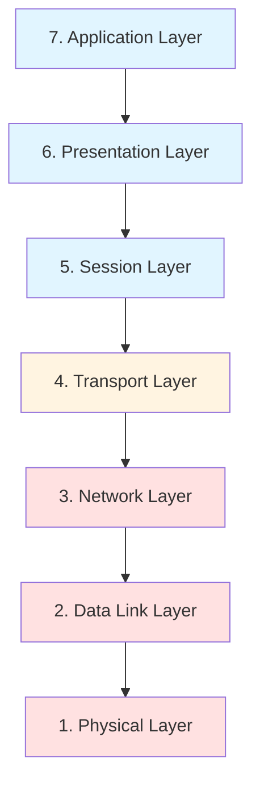

### 7. Application Layer (Tətbiq Qatı)

**Funksiya:** İstifadəçi tətbiqlərinin şəbəkəyə birbaşa daxil olduğu qat.

**Protokollar:**
- HTTP/HTTPS - Web browsing
- FTP - File transfer
- SMTP - Email göndərmə
- POP3/IMAP - Email qəbul etmə
- DNS - Domain name resolution
- SSH - Secure remote access

**Məsuliyyətlər:**
- İstifadəçi interfeysi təqdim etmə
- Network servislərinə giriş
- Email, file transfer, web browsing

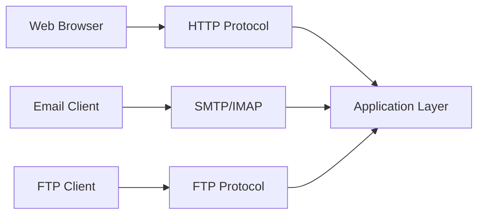

### 6. Presentation Layer (Təqdimat Qatı)

**Funksiya:** Datanın formatlaşdırılması, şifrələnməsi və sıxışdırılması.

**Məsuliyyətlər:**
- Data translation (format dəyişdirmə)
- Encryption/Decryption
- Compression/Decompression
- Character encoding (ASCII, Unicode)

**Nümunələr:**
- SSL/TLS - Şifrələmə
- JPEG, GIF - Şəkil formatları
- MPEG, AVI - Video formatları
- ASCII, EBCDIC - Character encoding

### 5. Session Layer (Sessiya Qatı)

**Funksiya:** İki sistem arasında sessiyaların (connection) yaradılması, idarə edilməsi və bağlanması.

**Məsuliyyətlər:**
- Session establishment, maintenance, termination
- Synchronization
- Dialog control (half-duplex, full-duplex)
- Recovery checkpoints

**Nümunələr:**
- NetBIOS
- RPC (Remote Procedure Call)
- PPTP (Point-to-Point Tunneling Protocol)

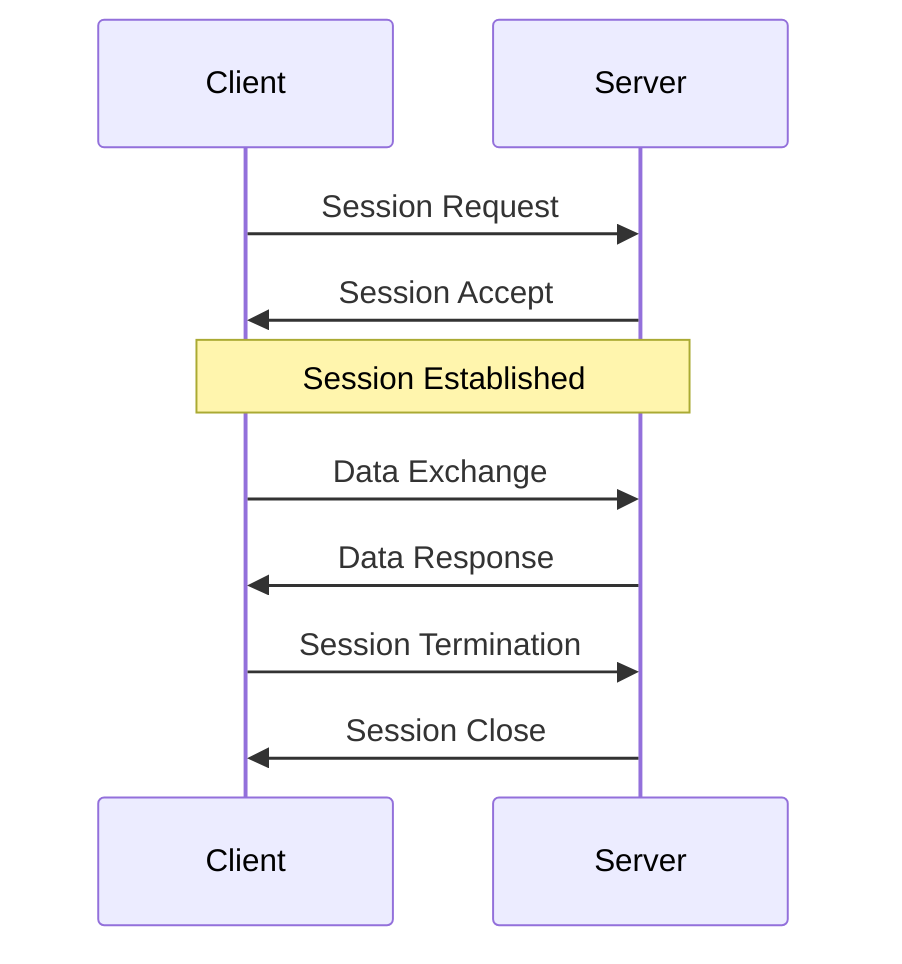

### 4. Transport Layer (Nəqliyyat Qatı)

**Funksiya:** End-to-end əlaqə və məlumatların etibarlı çatdırılması.

**Əsas Protokollar:**

#### TCP (Transmission Control Protocol)
- **Connection-oriented** - əlaqə yaradılmalıdır
- **Reliable** - datanın çatdırılması təmin edilir
- **Flow control** - göndərmə sürətinin tənzimlənməsi
- **Error checking** - xəta yoxlama və düzəldilməsi
- İstifadə sahələri: HTTP, HTTPS, FTP, Email

#### UDP (User Datagram Protocol)
- **Connectionless** - əlaqə yaradılmır
- **Unreliable** - datanın çatdırılması təmin edilmir
- **Fast** - sürətli, overhead azdır
- İstifadə sahələri: DNS, Video streaming, Online gaming

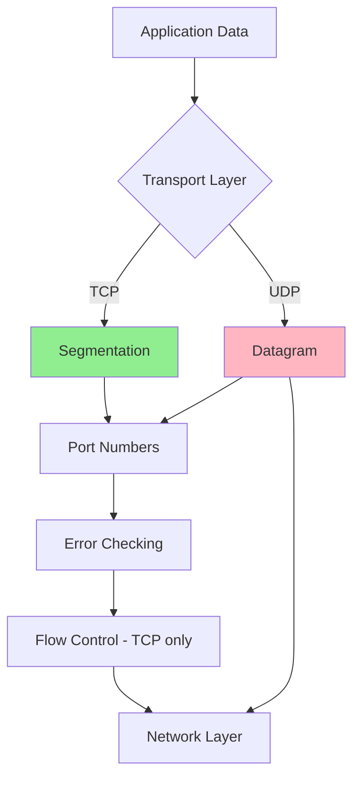

**Port Numbers:**
- 0-1023: Well-known ports (HTTP:80, HTTPS:443, SSH:22)
- 1024-49151: Registered ports
- 49152-65535: Dynamic/Private ports

### 3. Network Layer (Şəbəkə Qatı)

**Funksiya:** Paketlərin routing və addressing-i.

**Əsas Protokol:** IP (Internet Protocol)

**Məsuliyyətlər:**
- Logical addressing (IP address)
- Routing - ən yaxşı path seçimi
- Packet forwarding
- Fragmentation və reassembly

**Protokollar:**
- IPv4, IPv6
- ICMP (Internet Control Message Protocol) - ping, traceroute
- ARP (Address Resolution Protocol) - IP-dən MAC-ə
- OSPF, BGP - Routing protokolları

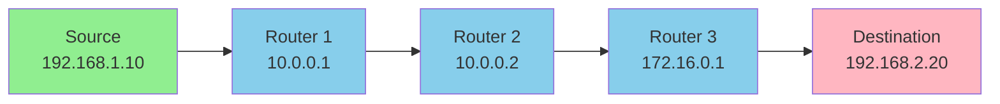

**IP Address Structure:**
- IPv4: 32-bit (4 octet) - 192.168.1.1
- IPv6: 128-bit (8 group) - 2001:0db8:85a3::8a2e:0370:7334

### 2. Data Link Layer (Data Əlaqə Qatı)

**Funksiya:** Node-to-node data transfer, error detection, MAC addressing.

**Alt-qatlar:**
- **LLC (Logical Link Control)** - Flow və error control
- **MAC (Media Access Control)** - Physical addressing

**Məsuliyyətlər:**
- Frame-lərin yaradılması
- Physical addressing (MAC address)
- Error detection (CRC)
- Flow control
- Access control (CSMA/CD, CSMA/CA)

**Cihazlar:**
- Switch
- Bridge
- NIC (Network Interface Card)

**Protokollar:**
- Ethernet
- PPP (Point-to-Point Protocol)
- HDLC (High-Level Data Link Control)

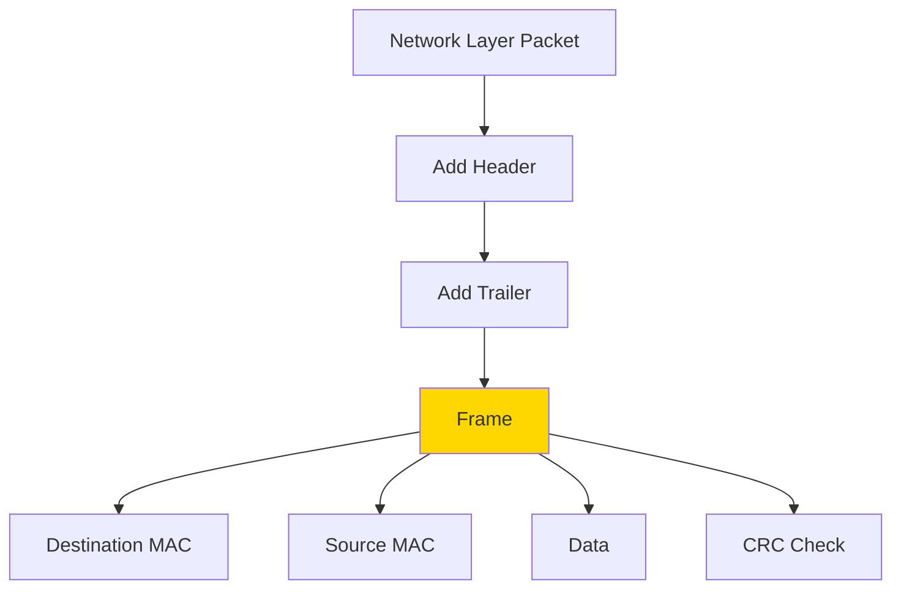

**MAC Address:**
- 48-bit (6 octet) - 00:1A:2B:3C:4D:5E
- Manufacturer-specific (OUI) + Device-specific
- Həmişə unikal

### 1. Physical Layer (Fiziki Qat)

**Funksiya:** Raw bit transmission physical medium üzərində.

**Məsuliyyətlər:**
- Bit-lərin elektrik siqnallarına çevrilməsi
- Physical topology
- Transmission mode (simplex, half-duplex, full-duplex)
- Data rate (bandwidth)
- Synchronization

**Komponentlər:**
- Cables (Ethernet, Fiber optic, Coaxial)
- Hub
- Repeater
- Modem
- Network adapter

**Transmission Media:**
- **Guided:** Twisted pair, Coaxial, Fiber optic
- **Unguided:** Radio waves, Microwaves, Infrared

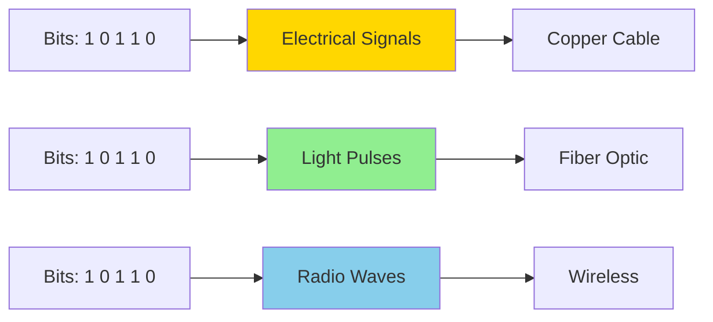

## Data Flow - Göndərmə

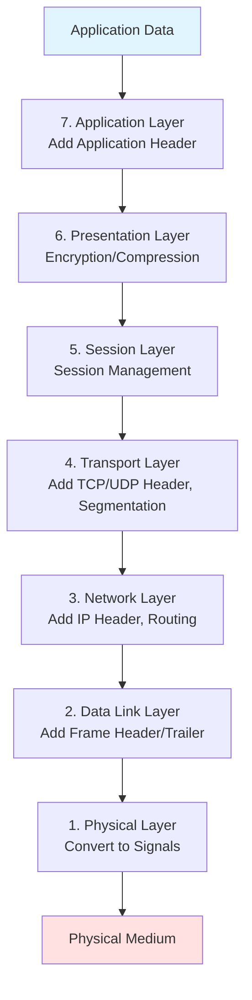

## Data Flow - Qəbul Etmə

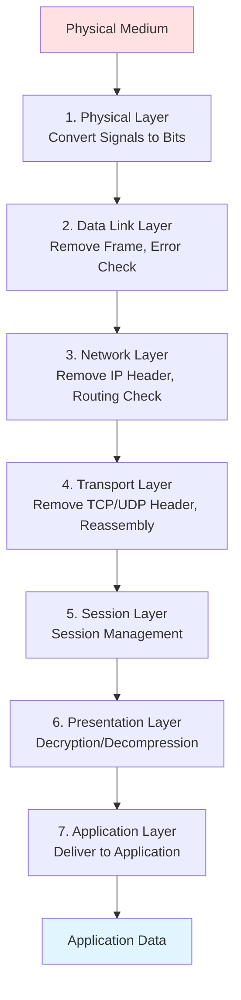

## OSI vs TCP/IP Model

| OSI Layer | TCP/IP Layer | Protokollar |
|-----------|--------------|-------------|
| 7. Application | Application | HTTP, FTP, SMTP, DNS |
| 6. Presentation | Application | SSL/TLS, JPEG, MPEG |
| 5. Session | Application | NetBIOS, RPC |
| 4. Transport | Transport | TCP, UDP |
| 3. Network | Internet | IP, ICMP, ARP |
| 2. Data Link | Network Access | Ethernet, PPP |
| 1. Physical | Network Access | Cables, Hubs |

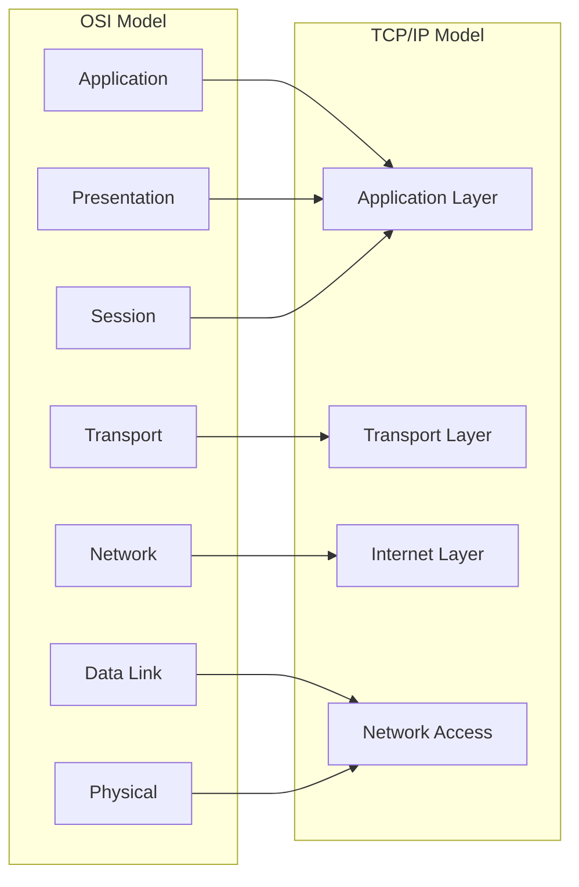

## Encapsulation Process

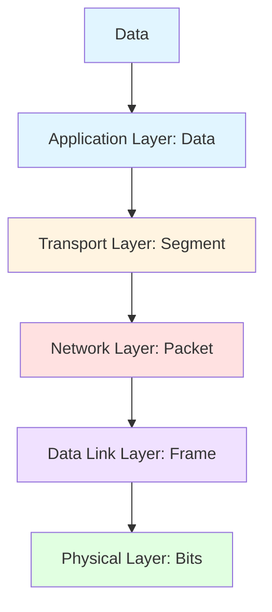

## Real-World Nümunə: Web Browsing

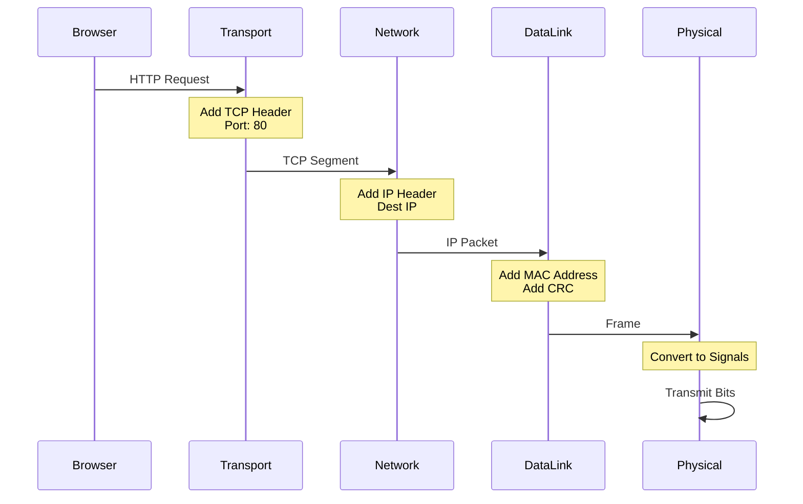

## Troubleshooting üzrə Qat-qat yanaşma

**Physical Layer:**
- Kabel düzgün qoşulubmu?
- LED işıqları yanır?
- Signal gücü kifayətdirmi?

**Data Link Layer:**
- MAC address düzgündür?
- Switch port-u işləyir?
- VLAN konfiqurasiyası düzgündür?

**Network Layer:**
- IP address düzgündür?
- Subnet mask düzgündür?
- Routing table-da entry var?
- Ping işləyir?

**Transport Layer:**
- Port açıqdır?
- Firewall blok edir?
- TCP connection established olur?

**Application Layer:**
- Servis işləyir?
- DNS resolve olur?
- Authentication uğurludur?

## Üstünlüklər və Məhdudiyyətlər

**Üstünlüklər:**
- Aydın layering və abstraction
- Hər qatın müstəqil inkişafı
- Problemlərin asan müəyyən edilməsi
- Universal standart

**Məhdudiyyətlər:**
- Praktikada TCP/IP daha çox istifadə olunur
- Bəzi qatlar overlap edir
- Performance overhead (hər qatda encapsulation)
- Real dünyada model 100% follow edilmir

## Best Practices

1. **Layer Separation:** Hər qatın məsuliyyətini aydın ayırmaq
2. **Error Handling:** Hər qatda öz error handling-i olmalıdır
3. **Security:** Hər qatda security tədbirləri görülməlidir
4. **Monitoring:** Hər qatı monitor etmək lazımdır
5. **Documentation:** Network topology və konfiqurasiya dokumentləşdirilməlidir

## Əlaqəli Mövzular

- TCP/IP Protocol Suite
- Network Security
- Network Troubleshooting
- Routing və Switching
- Network Performance Optimization
