# TCP/IP Protocol Suite

## TCP/IP Nədir?

**TCP/IP (Transmission Control Protocol/Internet Protocol)** - internetin və əksər müasir şəbəkələrin əsasını təşkil edən protokol yığınıdır. 1970-ci illərdə ARPANET üçün hazırlanmışdır.

**Xüsusiyyətlər:**
- 4 qatlı layer modeli
- Platform-independent
- Açıq standartlar (RFC - Request for Comments)
- Scalable və robust
- End-to-end connectivity

## TCP/IP Model Qatları

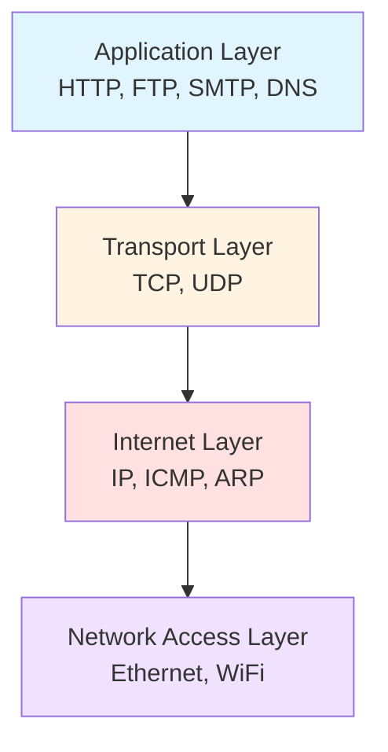

## 1. Network Access Layer (Şəbəkə Giriş Qatı)

**Funksiya:** Physical network-ə giriş və frame transmission.

**Əhatə edir:**
- Physical addressing (MAC)
- Frame formatting
- Error detection
- Media access control

**Texnologiyalar:**
- Ethernet (802.3)
- WiFi (802.11)
- PPP (Point-to-Point Protocol)
- Token Ring

## 2. Internet Layer (İnternet Qatı)

### IP (Internet Protocol)

**Funksiya:** Paketlərin routing və logical addressing.

#### IPv4 (Internet Protocol version 4)

**Xüsusiyyətlər:**
- 32-bit address space (4,294,967,296 address)
- Dotted decimal notation: 192.168.1.1
- Address exhaustion problemi

**IPv4 Header Structure:**

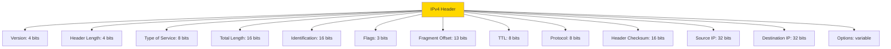

**IP Address Classes:**

| Class | First Octet | Default Mask | Network/Host bits | İstifadə |
|-------|-------------|--------------|-------------------|----------|
| A | 1-126 | 255.0.0.0 | 8/24 | Large networks |
| B | 128-191 | 255.255.0.0 | 16/16 | Medium networks |
| C | 192-223 | 255.255.255.0 | 24/8 | Small networks |
| D | 224-239 | - | - | Multicast |
| E | 240-255 | - | - | Reserved |

**Private IP Ranges:**
- Class A: 10.0.0.0 - 10.255.255.255
- Class B: 172.16.0.0 - 172.31.255.255
- Class C: 192.168.0.0 - 192.168.255.255

#### IPv6 (Internet Protocol version 6)

**Xüsusiyyətlər:**
- 128-bit address space (340 undecillion addresses)
- Hexadecimal notation: 2001:0db8:85a3:0000:0000:8a2e:0370:7334
- Simplified header
- Built-in security (IPSec)
- No NAT required

**IPv6 Address Format:**

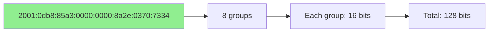

**IPv6 Address Types:**
- **Unicast:** Single interface
- **Multicast:** Multiple interfaces
- **Anycast:** Nearest interface

### ICMP (Internet Control Message Protocol)

**Funksiya:** Error reporting və diagnostic.

**İstifadə sahələri:**
- Ping - host reachability test
- Traceroute - path discovery
- Error messages (destination unreachable, time exceeded)

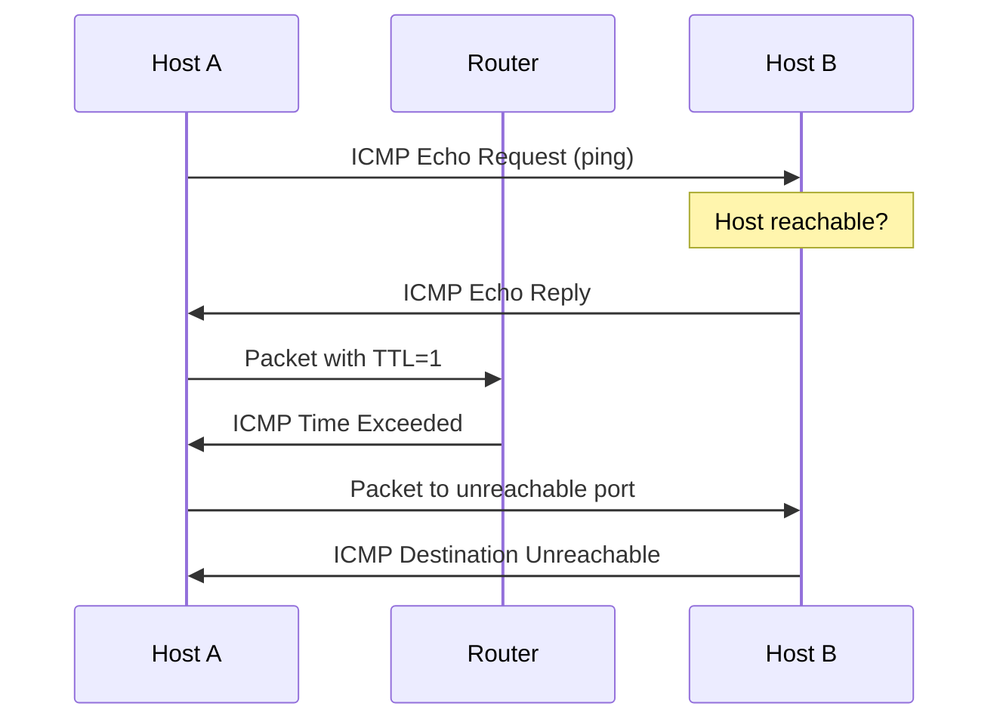

### ARP (Address Resolution Protocol)

**Funksiya:** IP address-dən MAC address-ə mapping.

**İş prinsipi:**

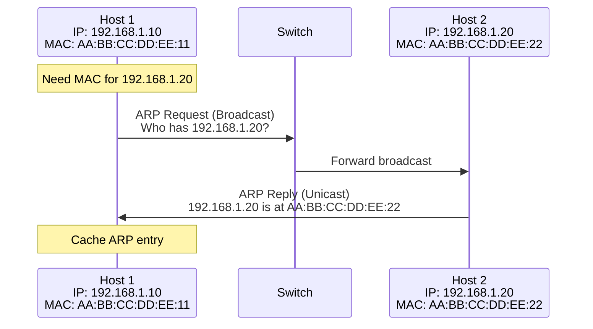

## 3. Transport Layer (Nəqliyyat Qatı)

### TCP (Transmission Control Protocol)

**Xüsusiyyətlər:**
- Connection-oriented
- Reliable delivery
- Ordered data transfer
- Flow control
- Congestion control
- Error checking

**TCP Header:**

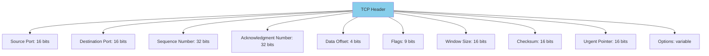

**TCP Flags:**
- SYN - Synchronize (connection başlat)
- ACK - Acknowledgment
- FIN - Finish (connection bağla)
- RST - Reset
- PSH - Push
- URG - Urgent

#### Three-Way Handshake (Connection Establishment)

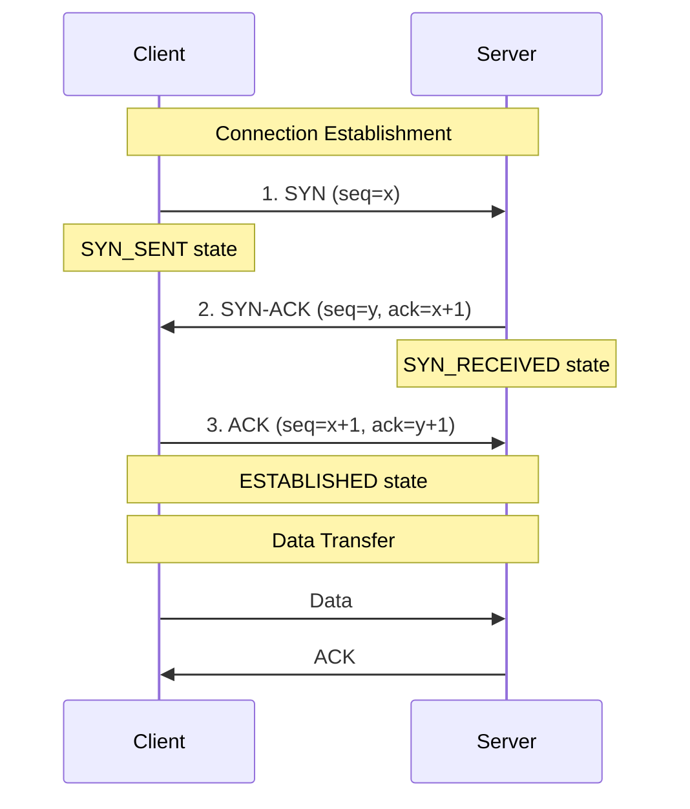

#### Four-Way Handshake (Connection Termination)

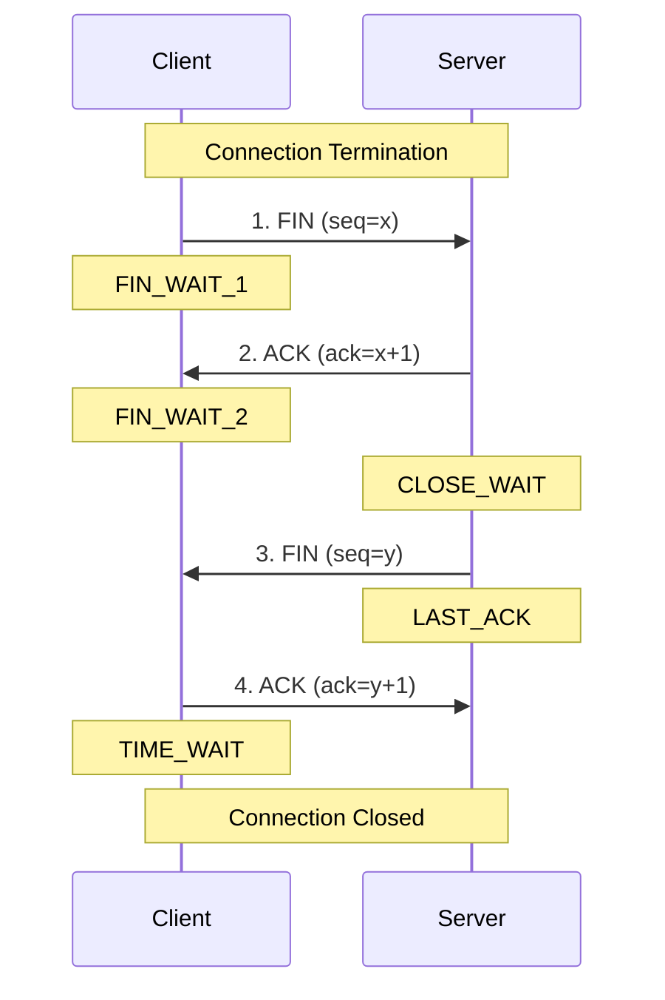

**TCP States:**

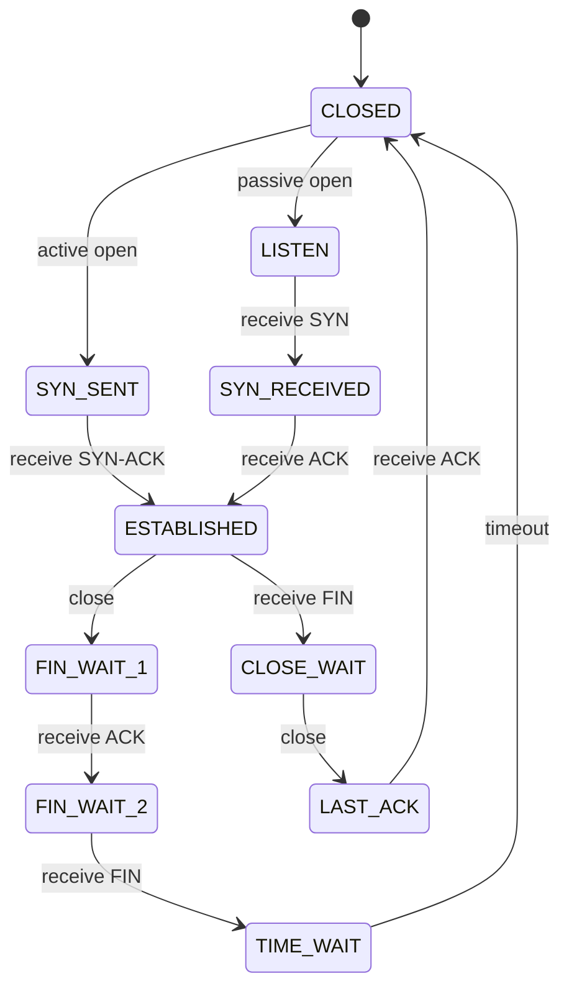

### UDP (User Datagram Protocol)

**Xüsusiyyətlər:**
- Connectionless
- Unreliable delivery
- No flow control
- No congestion control
- Lightweight (8-byte header)
- Fast

**UDP Header:**

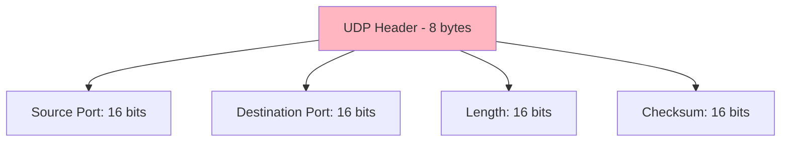

**UDP İstifadə sahələri:**
- DNS queries
- DHCP
- Streaming video/audio
- Online gaming
- VoIP
- SNMP

### TCP vs UDP Müqayisəsi

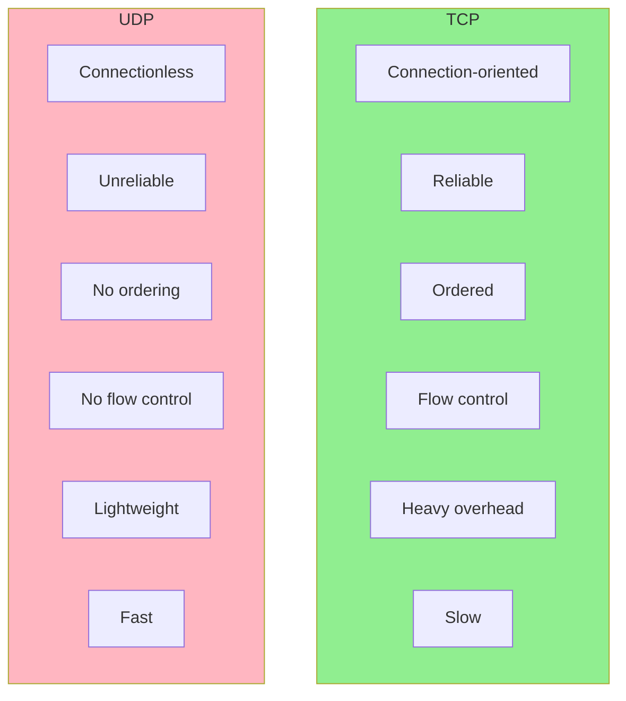

| Xüsusiyyət | TCP | UDP |
|------------|-----|-----|
| Connection | Connection-oriented | Connectionless |
| Reliability | Reliable | Unreliable |
| Ordering | Ordered delivery | No ordering |
| Speed | Slower | Faster |
| Header size | 20-60 bytes | 8 bytes |
| Flow control | Yes | No |
| Error checking | Extensive | Basic checksum |
| Use case | Web, Email, File transfer | Streaming, Gaming, DNS |

## 4. Application Layer (Tətbiq Qatı)

### HTTP/HTTPS

**HTTP (HyperText Transfer Protocol):**
- Port 80
- Stateless protocol
- Request/Response model

**HTTPS (HTTP Secure):**
- Port 443
- SSL/TLS encryption
- Certificate-based authentication

### FTP (File Transfer Protocol)

**Xüsusiyyətlər:**
- Port 20 (data), 21 (control)
- File upload/download
- Directory listing
- Authentication required

### SMTP (Simple Mail Transfer Protocol)

**Funksiya:** Email göndərmə
- Port 25, 587 (with TLS)
- Push protocol
- Text-based

### DNS (Domain Name System)

**Funksiya:** Domain name-i IP address-ə çevirmə
- Port 53
- UDP for queries, TCP for zone transfers
- Hierarchical system

### SSH (Secure Shell)

**Funksiya:** Secure remote access
- Port 22
- Encryption
- Authentication (password, key-based)

## Complete TCP/IP Communication Flow

```mermaid
sequenceDiagram
    participant App as Application<br/>(Browser)
    participant TCP as Transport<br/>(TCP)
    participant IP as Internet<br/>(IP)
    participant Link as Network Access<br/>(Ethernet)
    participant Physical as Physical Medium
    
    App->>TCP: HTTP Request
    Note over TCP: Add TCP Header<br/>Source/Dest Ports<br/>Seq/Ack numbers
    
    TCP->>IP: TCP Segment
    Note over IP: Add IP Header<br/>Source/Dest IPs<br/>TTL, Protocol
    
    IP->>Link: IP Packet
    Note over Link: Add Ethernet Header<br/>Source/Dest MACs<br/>Add Trailer (CRC)
    
    Link->>Physical: Frame
    Note over Physical: Convert to Signals<br/>Transmit
    
    Physical->>Physical: Physical Transmission
```

## NAT (Network Address Translation)

**Funksiya:** Private IP-ləri public IP-yə map etmək.

**Növləri:**
- **Static NAT:** 1-to-1 mapping
- **Dynamic NAT:** Many-to-many mapping
- **PAT (Port Address Translation):** Many-to-1 mapping

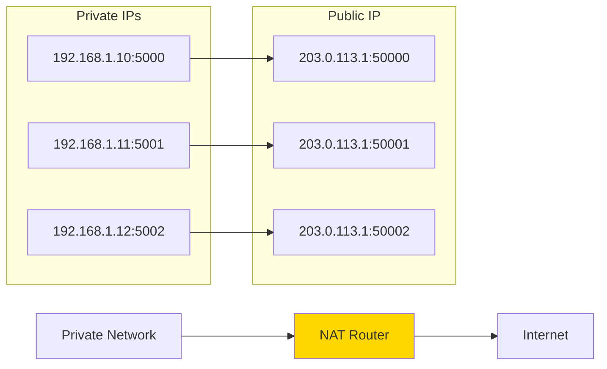

## Subnetting

**Məqsəd:** Böyük network-u kiçik subnet-lərə bölmək.

**Subnet Mask:** Network və host hissələrini ayırır.

**CIDR Notation:** 192.168.1.0/24
- /24 = 255.255.255.0
- 24 bit network, 8 bit host
- 254 usable host addresses

**Subnetting Nümunəsi:**

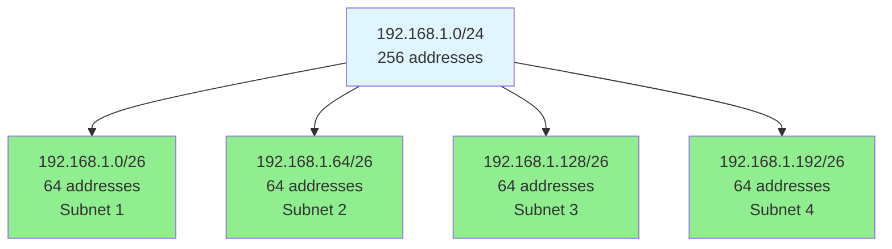

**Subnet Hesablama:**

| Network | First IP | Last IP | Broadcast | Usable Hosts |
|---------|----------|---------|-----------|--------------|
| 192.168.1.0/26 | 192.168.1.1 | 192.168.1.62 | 192.168.1.63 | 62 |
| 192.168.1.64/26 | 192.168.1.65 | 192.168.1.126 | 192.168.1.127 | 62 |
| 192.168.1.128/26 | 192.168.1.129 | 192.168.1.190 | 192.168.1.191 | 62 |
| 192.168.1.192/26 | 192.168.1.193 | 192.168.1.254 | 192.168.1.255 | 62 |

## Routing

**Funksiya:** Paketlərin source-dan destination-a ən yaxşı path ilə çatdırılması.

**Routing Table Nümunəsi:**

| Destination | Subnet Mask | Gateway | Interface | Metric |
|-------------|-------------|---------|-----------|--------|
| 192.168.1.0 | 255.255.255.0 | 0.0.0.0 | eth0 | 0 |
| 10.0.0.0 | 255.0.0.0 | 192.168.1.1 | eth0 | 10 |
| 0.0.0.0 | 0.0.0.0 | 192.168.1.254 | eth0 | 20 |

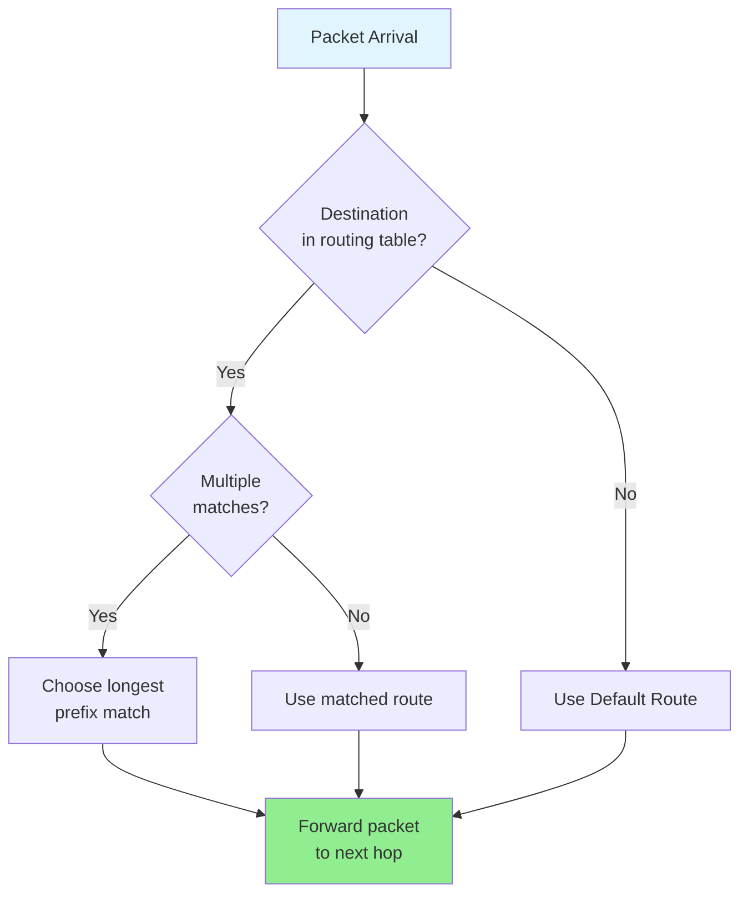

## Quality of Service (QoS)

**Məqsəd:** Kritik traffic-ə prioritet vermək.

**Texniklər:**
- Traffic shaping
- Traffic policing
- Priority queuing
- Bandwidth reservation

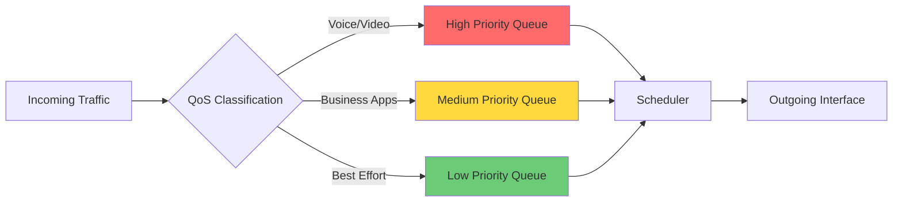

## TCP/IP Security

**Protokollar:**
- **IPSec:** IP layer encryption
- **SSL/TLS:** Transport layer security
- **SSH:** Secure remote access
- **VPN:** Virtual Private Network

**Təhlükələr:**
- IP Spoofing
- SYN Flood attack
- Man-in-the-Middle
- DDoS attacks
- Port scanning

## Performance Optimization

**TCP Optimizasyon:**
- Window scaling
- Selective acknowledgment (SACK)
- Fast retransmit
- Congestion avoidance algorithms (Reno, Cubic, BBR)

**Latency Reduction:**
- CDN usage
- Connection pooling
- HTTP/2, HTTP/3
- TCP Fast Open

## Troubleshooting Commands

**Linux/Mac:**
```bash
# IP configuration
ifconfig / ip addr

# Routing table
route -n / ip route

# Test connectivity
ping 8.8.8.8

# Trace route
traceroute google.com

# DNS lookup
nslookup google.com
dig google.com

# Active connections
netstat -an
ss -tuln

# Packet capture
tcpdump -i eth0
```

**Windows:**
```cmd
# IP configuration
ipconfig /all

# Routing table
route print

# Test connectivity
ping 8.8.8.8

# Trace route
tracert google.com

# DNS lookup
nslookup google.com

# Active connections
netstat -an

# DNS cache
ipconfig /displaydns
ipconfig /flushdns
```

## Best Practices

1. **Security:**
   - Firewall konfiqurasiyası
   - VPN istifadəsi
   - Regular security updates
   - Network segmentation

2. **Performance:**
   - QoS implementation
   - Bandwidth management
   - Connection optimization
   - Caching strategies

3. **Reliability:**
   - Redundancy
   - Load balancing
   - Monitoring və alerting
   - Backup routes

4. **Documentation:**
   - Network diagram
   - IP address management
   - Configuration documentation
   - Change logs

## Əlaqəli Mövzular

- OSI Model
- HTTP/HTTPS Protocol
- DNS System
- Network Security
- Routing Protocols
- Load Balancing
