# DNS (Domain Name System)

## DNS Nədir?

**DNS (Domain Name System)** - domain adlarını IP address-lərə çevirən distributed database sistemidir. İnternetin "telefon kitabı" kimi işləyir.

**Məqsəd:**
- Human-readable domain names (example.com)
- Machine-readable IP addresses (93.184.216.34)

**Xüsusiyyətlər:**
- **Hierarchical** - yuxarıdan aşağı struktur
- **Distributed** - mərkəzləşdirilməmiş
- **Cached** - performans üçün keşləmə
- **Port 53** - UDP (queries), TCP (zone transfers)

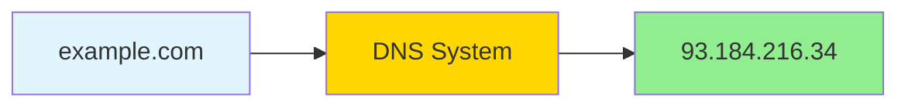

## DNS Hierarchy (İerarxiya)

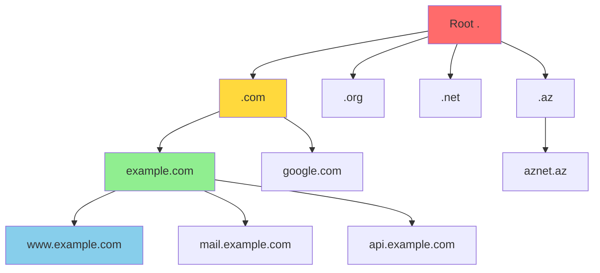

### DNS Hierarchy Levels

**1. Root Level (.)**
- 13 root server sistemi (A-M)
- TLD-lərin yerləşməsi haqqında məlumat
- ICANN tərəfindən idarə olunur

**2. Top-Level Domain (TLD)**
- **gTLD (Generic):** .com, .org, .net, .info, .edu
- **ccTLD (Country Code):** .az, .us, .uk, .de, .ru
- **New gTLD:** .tech, .dev, .app, .blog

**3. Second-Level Domain (SLD)**
- example.com
- google.com
- Company və ya şəxsin domain-i

**4. Subdomain**
- www.example.com
- mail.example.com
- blog.example.com

**Full Qualified Domain Name (FQDN):**
```
www.example.com.
│   │       │   │
│   │       │   └── Root
│   │       └────── TLD
│   └────────────── Second-Level Domain
└────────────────── Subdomain
```

## DNS Server Types

### 1. DNS Resolver (Recursive Resolver)

**Funksiya:** Client-dən query qəbul edir və cavab tapana qədər sorğu göndərir.

**İstifadəçilər:**
- ISP DNS (İnternet Service Provider)
- Public DNS (Google 8.8.8.8, Cloudflare 1.1.1.1)
- Corporate DNS

### 2. Root Name Server

**Funksiya:** TLD name server-lərin məlumatını saxlayır.

**13 Root Server:**
- a.root-servers.net
- b.root-servers.net
- ... m.root-servers.net

### 3. TLD Name Server

**Funksiya:** Second-level domain-lərin authoritative server-lərini göstərir.

**Nümunələr:**
- .com TLD server
- .org TLD server
- .az TLD server

### 4. Authoritative Name Server

**Funksiya:** Domain üçün son cavabı verən server.

**Növləri:**
- **Primary (Master):** Zone file-ı saxlayır və dəyişikliklər buradan edilir
- **Secondary (Slave):** Primary-dən kopyalama edir, backup kimi

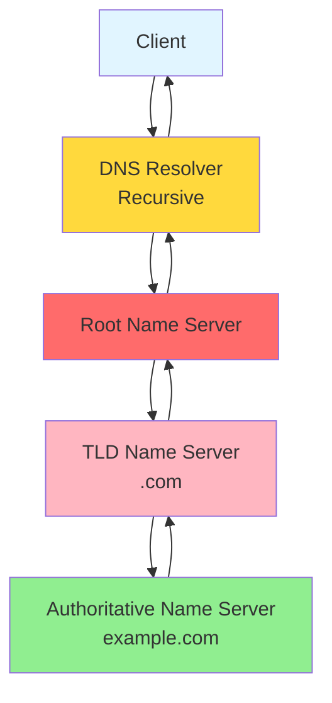

## DNS Resolution Process

### Recursive Query (Tam sorğu)

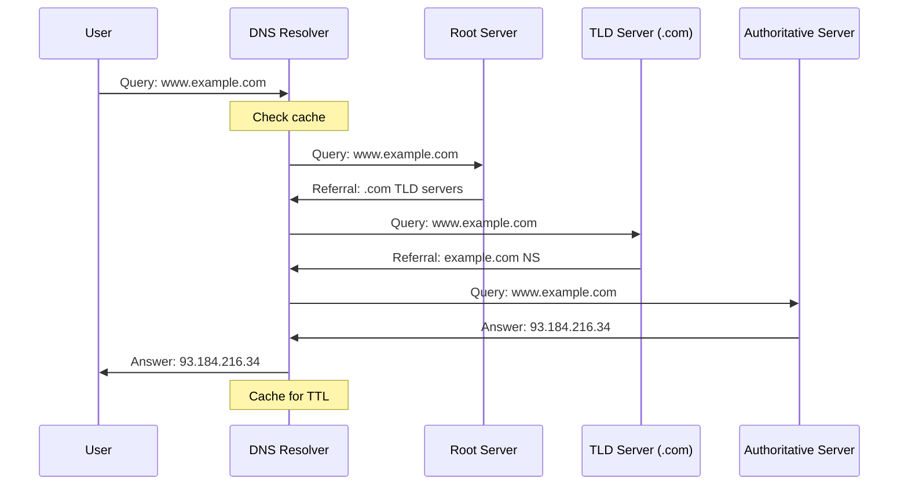

### Iterative Query

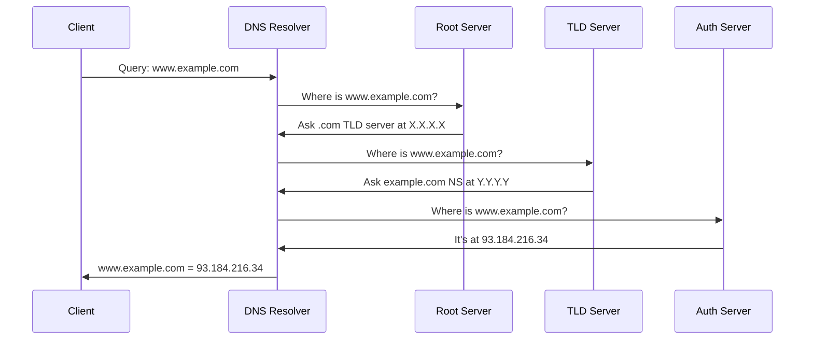

## DNS Record Types

### A Record (Address Record)

**Funksiya:** Domain name-i IPv4 address-ə map edir.

```
example.com.    300    IN    A    93.184.216.34
```

### AAAA Record

**Funksiya:** Domain name-i IPv6 address-ə map edir.

```
example.com.    300    IN    AAAA    2606:2800:220:1:248:1893:25c8:1946
```

### CNAME Record (Canonical Name)

**Funksiya:** Alias yaradır, bir domain-i digərinə yönləndirir.

```
www.example.com.    300    IN    CNAME    example.com.
blog.example.com.   300    IN    CNAME    example.com.
```

**Qeyd:** Root domain (example.com) CNAME ola bilməz.

### MX Record (Mail Exchange)

**Funksiya:** Email server-ləri göstərir.

```
example.com.    300    IN    MX    10 mail1.example.com.
example.com.    300    IN    MX    20 mail2.example.com.
```

**Priority:** Kiçik rəqəm = yüksək prioritet

### NS Record (Name Server)

**Funksiya:** Domain üçün authoritative name server-ləri göstərir.

```
example.com.    300    IN    NS    ns1.example.com.
example.com.    300    IN    NS    ns2.example.com.
```

### TXT Record (Text Record)

**Funksiya:** İstənilən text məlumatı saxlayır.

**İstifadə sahələri:**
- SPF (Sender Policy Framework) - email authentication
- DKIM (DomainKeys Identified Mail)
- Domain verification
- DMARC policy

```
example.com.    300    IN    TXT    "v=spf1 include:_spf.google.com ~all"
example.com.    300    IN    TXT    "google-site-verification=xxx123"
```

### PTR Record (Pointer Record)

**Funksiya:** Reverse DNS - IP address-dən domain name-ə.

```
34.216.184.93.in-addr.arpa.    300    IN    PTR    example.com.
```

### SOA Record (Start of Authority)

**Funksiya:** Zone haqqında administrative məlumat.

```
example.com.    300    IN    SOA    ns1.example.com. admin.example.com. (
                                    2024103001  ; Serial
                                    3600        ; Refresh
                                    1800        ; Retry
                                    604800      ; Expire
                                    86400       ; Minimum TTL
                                    )
```

### SRV Record (Service Record)

**Funksiya:** Xüsusi service-lərin yerləşməsini göstərir.

```
_sip._tcp.example.com.    300    IN    SRV    10 60 5060 sipserver.example.com.
```

### CAA Record (Certification Authority Authorization)

**Funksiya:** Hansı CA-ların SSL certificate verə biləcəyini göstərir.

```
example.com.    300    IN    CAA    0 issue "letsencrypt.org"
```

## DNS Record Types Cədvəli

| Record | Funksiya | Nümunə |
|--------|----------|--------|
| A | Domain → IPv4 | example.com → 93.184.216.34 |
| AAAA | Domain → IPv6 | example.com → 2606:2800:... |
| CNAME | Alias | www → example.com |
| MX | Mail server | mail.example.com |
| NS | Name servers | ns1.example.com |
| TXT | Text data | SPF, DKIM, verification |
| PTR | Reverse DNS | IP → domain |
| SOA | Zone info | Administrative data |
| SRV | Service location | SIP, XMPP servers |
| CAA | Certificate authority | SSL issuers |

## TTL (Time To Live)

**Funksiya:** DNS record-un cache-də qalma müddəti (saniyə).

```
example.com.    3600    IN    A    93.184.216.34
                 │
                 └── TTL (1 hour)
```

**TTL seçimi:**
- **Aşağı TTL (60-300):** Tez-tez dəyişən record-lar
- **Orta TTL (3600):** Normal istifadə
- **Yüksək TTL (86400):** Nadir dəyişən record-lar

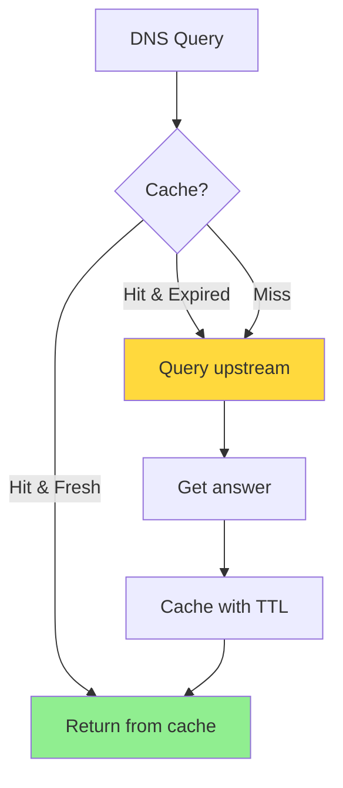

## DNS Caching

**Cache Levels:**

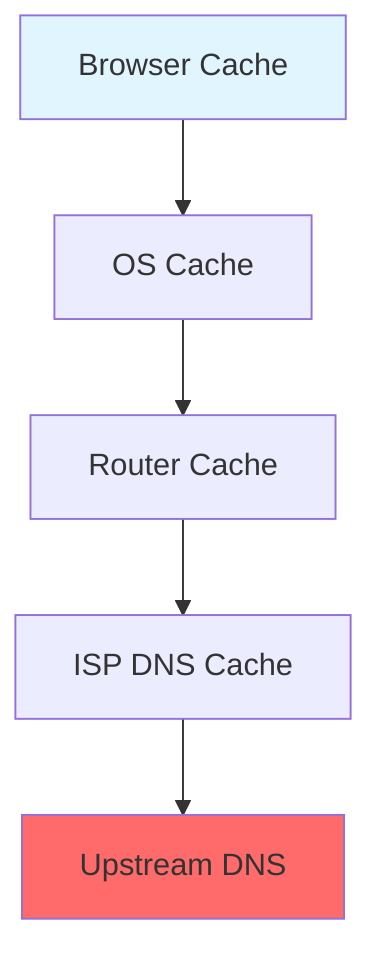

**Cache əməliyyatları:**
1. Browser öz cache-ini yoxlayır
2. OS cache yoxlanır
3. Router cache yoxlanır
4. ISP DNS resolver cache yoxlanır
5. Tapılmazsa, recursive query edilir

## DNS Propagation

**Propagation:** DNS dəyişikliklərinin bütün dünyaya yayılması prosesi.

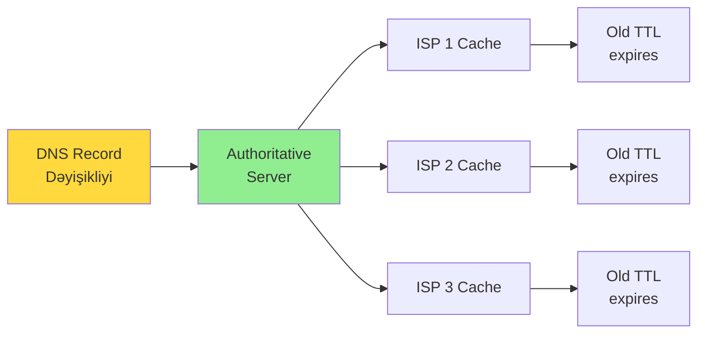

**Propagation müddəti:**
- TTL-dən asılıdır
- Adətən 1-48 saat
- Global yayılma üçün 72 saat

## Zone File

**Zone file nümunəsi:**

```bind
$ORIGIN example.com.
$TTL 3600

; SOA Record
@    IN    SOA    ns1.example.com. admin.example.com. (
                  2024103001  ; Serial
                  3600        ; Refresh
                  1800        ; Retry
                  604800      ; Expire
                  86400       ; Minimum TTL
                  )

; Name Servers
@    IN    NS     ns1.example.com.
@    IN    NS     ns2.example.com.

; A Records
@    IN    A      93.184.216.34
www  IN    A      93.184.216.34
mail IN    A      93.184.216.35

; AAAA Records
@    IN    AAAA   2606:2800:220:1:248:1893:25c8:1946

; CNAME Records
blog IN    CNAME  example.com.
ftp  IN    CNAME  example.com.

; MX Records
@    IN    MX     10 mail.example.com.
@    IN    MX     20 mail2.example.com.

; TXT Records
@    IN    TXT    "v=spf1 include:_spf.google.com ~all"
```

## Public DNS Servers

| Provider | Primary DNS | Secondary DNS | Xüsusiyyət |
|----------|-------------|---------------|------------|
| Google | 8.8.8.8 | 8.8.4.4 | Sürətli, etibarlı |
| Cloudflare | 1.1.1.1 | 1.0.0.1 | Privacy-focused |
| Quad9 | 9.9.9.9 | 149.112.112.112 | Security filtering |
| OpenDNS | 208.67.222.222 | 208.67.220.220 | Family shield |

## DNS Security

### DNS Spoofing/Cache Poisoning

**Hücum:** Saxta DNS cavabları ilə cache-i zəhərləmək.

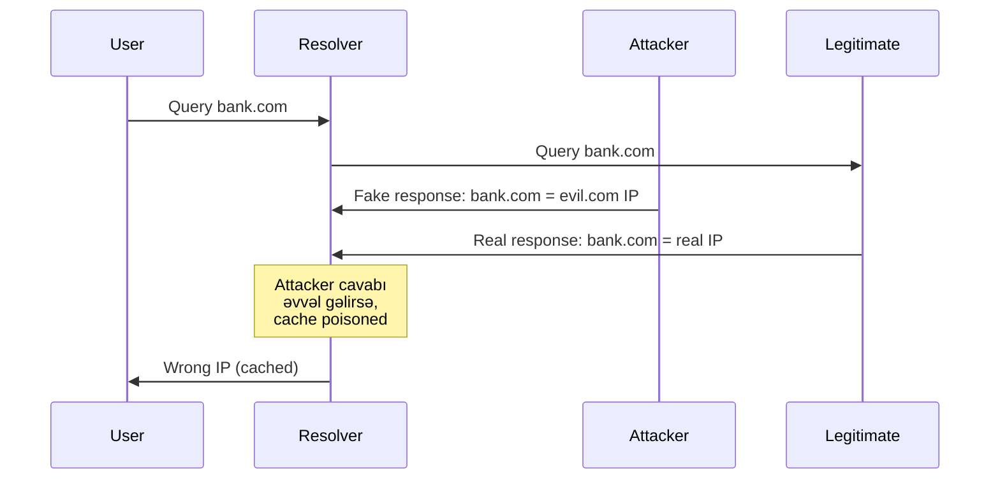

### DNSSEC (DNS Security Extensions)

**Məqsəd:** DNS cavablarının authenticity və integrity-sini təmin etmək.

**İş prinsipi:**
- Digital signatures istifadə edir
- Public key cryptography
- Chain of trust (Root-dan zone-a qədər)

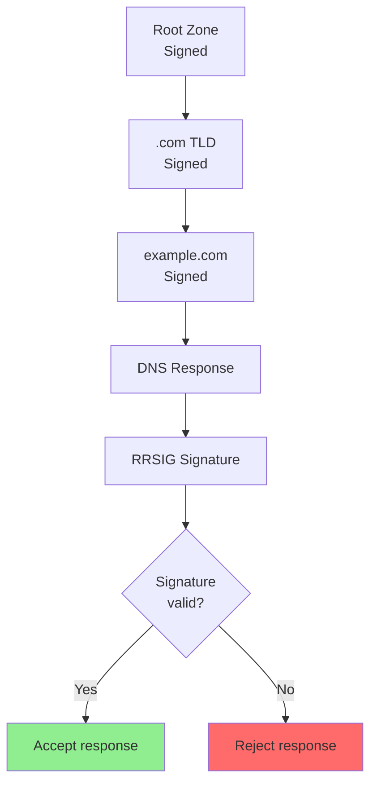

**DNSSEC Record Types:**
- **DNSKEY:** Public key
- **RRSIG:** Digital signature
- **DS:** Delegation Signer
- **NSEC/NSEC3:** Authenticated denial

### DNS over HTTPS (DoH)

**Port:** 443 (HTTPS)

**Üstünlüklər:**
- Encrypted DNS queries
- Privacy protection
- ISP-dən gizli

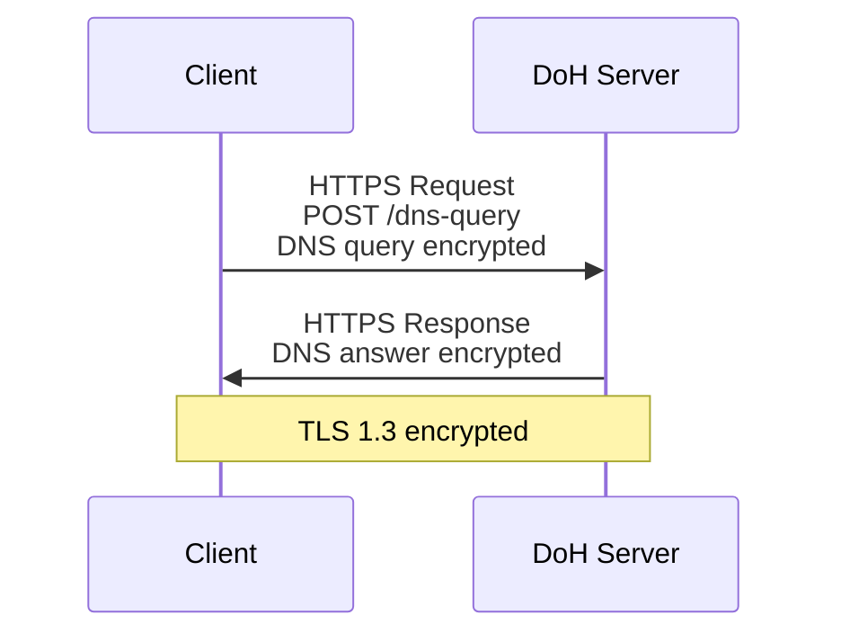

### DNS over TLS (DoT)

**Port:** 853

**Üstünlüklər:**
- Dedicated port
- Encrypted queries
- Easy to detect və filter

## DNS Load Balancing

**GeoDNS:** İstifadəçinin location-una görə ən yaxın server-i qaytarır.

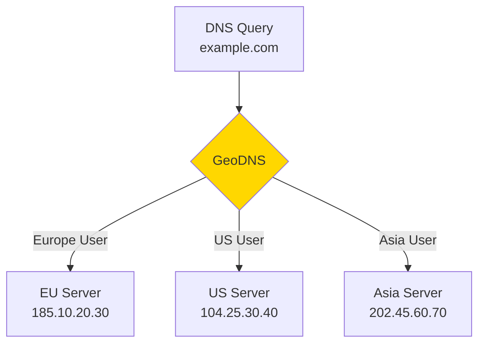

**Round Robin:** Hər query-də növbəti IP-ni qaytarır.

```
example.com.    IN    A    192.0.2.1
example.com.    IN    A    192.0.2.2
example.com.    IN    A    192.0.2.3
```

## DNS Troubleshooting

### nslookup

```bash
# Simple query
nslookup example.com

# Query specific DNS server
nslookup example.com 8.8.8.8

# Query specific record type
nslookup -type=MX example.com
nslookup -type=NS example.com
nslookup -type=TXT example.com
```

### dig (Domain Information Groper)

```bash
# Simple query
dig example.com

# Query specific record
dig example.com A
dig example.com MX
dig example.com NS

# Trace full resolution path
dig +trace example.com

# Query specific DNS server
dig @8.8.8.8 example.com

# Short output
dig +short example.com

# Reverse lookup
dig -x 93.184.216.34
```

### host

```bash
# Simple query
host example.com

# Query specific type
host -t MX example.com
host -t NS example.com
```

### DNS Cache Clear

**Windows:**
```cmd
ipconfig /flushdns
```

**macOS:**
```bash
sudo dscacheutil -flushcache
sudo killall -HUP mDNSResponder
```

**Linux:**
```bash
sudo systemd-resolve --flush-caches
# or
sudo /etc/init.d/nscd restart
```

**Browser:**
- Chrome: chrome://net-internals/#dns
- Firefox: about:networking#dns

## Common DNS Problems

**1. DNS Not Responding:**
- DNS server down
- Network connectivity
- Firewall blocking port 53

**2. NXDOMAIN (Non-Existent Domain):**
- Domain mövcud deyil
- Typo
- Domain expired

**3. SERVFAIL:**
- Authoritative server problem
- DNSSEC validation failure
- Misconfigured zone

**4. Slow DNS Resolution:**
- High latency to DNS server
- DNS server overloaded
- Cache miss

**5. Wrong IP Returned:**
- Cache poisoning
- Propagation delay
- Incorrect A/AAAA record

## Best Practices

1. **Redundancy:**
   - Minimum 2 name servers
   - Müxtəlif network-larda

2. **TTL Strategy:**
   - Normal: 3600-86400
   - Migration zamanı: 300-600

3. **DNSSEC:**
   - Enable DNSSEC
   - Validate chain

4. **Monitoring:**
   - DNS query latency
   - DNS server availability
   - Record changes

5. **Security:**
   - DoH/DoT istifadə et
   - DNS filtering
   - Rate limiting

6. **Documentation:**
   - Zone file backup
   - Record changes log
   - DNS architecture diagram

## DNS Performance Optimization

**1. Use Anycast:**
- Bir IP, çox location
- Automatic routing ən yaxın server-ə

**2. Cache Strategy:**
- Appropriate TTL
- Prefetching

**3. Minimize Query Chain:**
- Avoid excessive CNAME chains
- Direct A/AAAA records

**4. Monitor və Alert:**
- Query latency
- Error rates
- Server health

## Əlaqəli Mövzular

- TCP/IP Protocol
- HTTP/HTTPS
- Network Security
- Load Balancing
- CDN (Content Delivery Network)
- Email Systems (SMTP, DKIM, SPF)
