# Network Security

## Network Security Nədir?

**Network Security** - şəbəkə resurslarını və məlumatları qeyri-qanuni giriş, sui-istifadə və ya oğurluqdan qorumaq üçün tətbiq olunan texnologiya, prosedur və siyasətlər toplusudur.

**Əsas Məqsədlər (CIA Triad):**

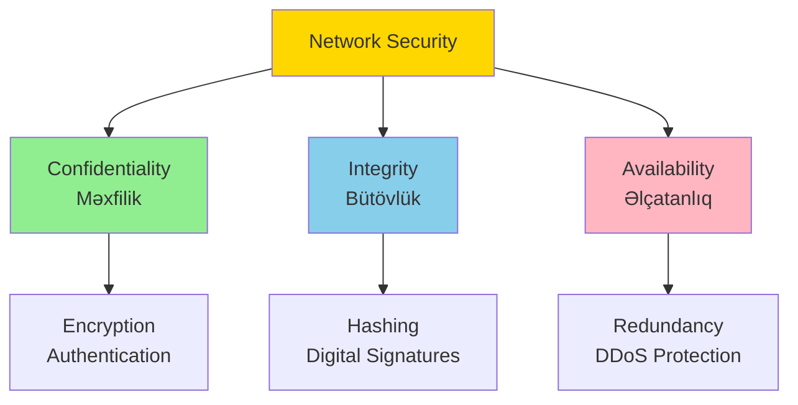
```mermaid
graph TD
    A[Network Security] --> B[Confidentiality<br/>Məxfilik]
    A --> C[Integrity<br/>Bütövlük]
    A --> D[Availability<br/>Əlçatanlıq]
    
    B --> E[Encryption<br/>Authentication]
    C --> F[Hashing<br/>Digital Signatures]
    D --> G[Redundancy<br/>DDoS Protection]
    
    style A fill:#FFD700
    style B fill:#90EE90
    style C fill:#87CEEB
    style D fill:#FFB6C1
```

## Defense in Depth (Qatlı Müdafiə)

**Konsept:** Çox qatlı təhlükəsizlik tədbirləri.

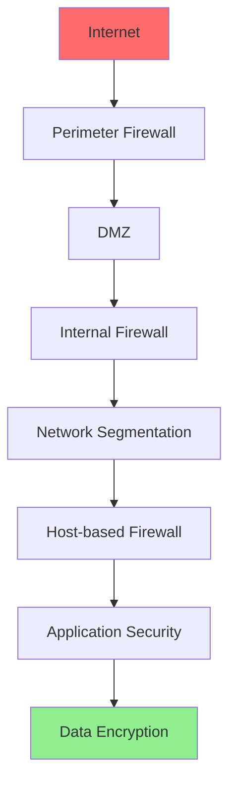
```mermaid
graph TD
    A[Internet] --> B[Perimeter Firewall]
    B --> C[DMZ]
    C --> D[Internal Firewall]
    D --> E[Network Segmentation]
    E --> F[Host-based Firewall]
    F --> G[Application Security]
    G --> H[Data Encryption]
    
    style A fill:#FF6B6B
    style H fill:#90EE90
```

## Firewall

**Funksiya:** Şəbəkə traffic-ini monitor və filter etmək.

### Firewall Types

#### 1. Packet Filtering Firewall

**İş prinsipi:** IP, port, protocol əsasında qərar verir.

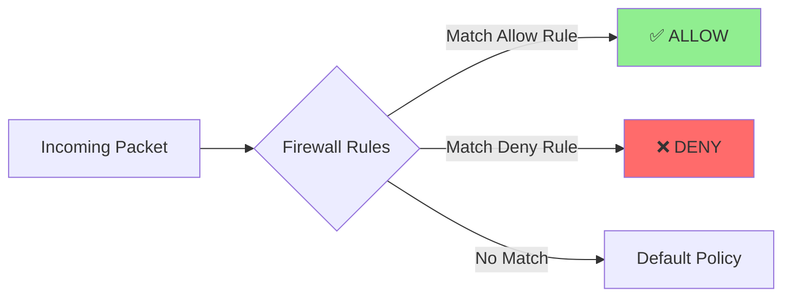
```mermaid
graph LR
    A[Incoming Packet] --> B{Firewall Rules}
    B -->|Match Allow Rule| C[✅ ALLOW]
    B -->|Match Deny Rule| D[❌ DENY]
    B -->|No Match| E[Default Policy]
    
    style C fill:#90EE90
    style D fill:#FF6B6B
```

**Nümunə Rules:**
```
# Allow HTTP
ALLOW TCP from ANY to 192.168.1.10 port 80

# Allow HTTPS
ALLOW TCP from ANY to 192.168.1.10 port 443

# Deny all other
DENY TCP from ANY to ANY
```

#### 2. Stateful Firewall

**İş prinsipi:** Connection state-ini izləyir.

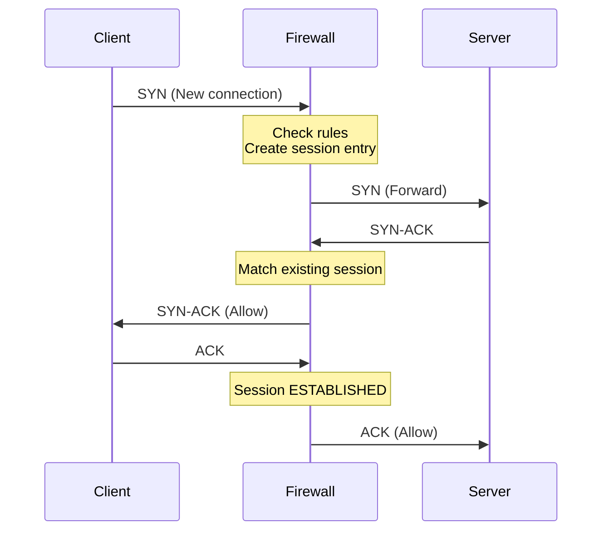
```mermaid
sequenceDiagram
    participant Client
    participant Firewall
    participant Server
    
    Client->>Firewall: SYN (New connection)
    Note over Firewall: Check rules<br/>Create session entry
    Firewall->>Server: SYN (Forward)
    Server->>Firewall: SYN-ACK
    Note over Firewall: Match existing session
    Firewall->>Client: SYN-ACK (Allow)
    Client->>Firewall: ACK
    Note over Firewall: Session ESTABLISHED
    Firewall->>Server: ACK (Allow)
```

**State Table:**
| Source IP | Dest IP | Source Port | Dest Port | State | Protocol |
|-----------|---------|-------------|-----------|-------|----------|
| 192.168.1.5 | 8.8.8.8 | 54321 | 443 | ESTABLISHED | TCP |
| 192.168.1.7 | 1.1.1.1 | 54322 | 53 | NEW | UDP |

#### 3. Application Layer Firewall (WAF)

**İş prinsipi:** HTTP/HTTPS traffic-ini deep inspection.

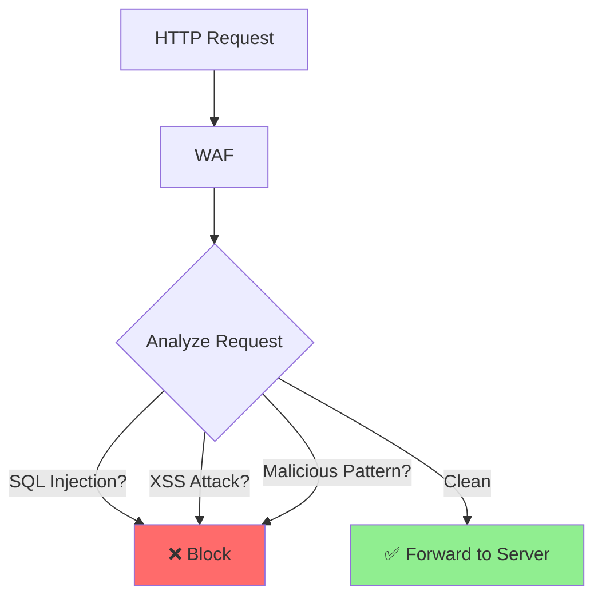
```mermaid
graph TD
    A[HTTP Request] --> B[WAF]
    B --> C{Analyze Request}
    
    C -->|SQL Injection?| D[❌ Block]
    C -->|XSS Attack?| D
    C -->|Malicious Pattern?| D
    C -->|Clean| E[✅ Forward to Server]
    
    style D fill:#FF6B6B
    style E fill:#90EE90
```

**Qorunma:**
- SQL Injection
- Cross-Site Scripting (XSS)
- CSRF attacks
- Path traversal
- Malicious file uploads

#### 4. Next-Generation Firewall (NGFW)

**Xüsusiyyətlər:**
- Traditional firewall + IPS
- Deep packet inspection
- Application awareness
- SSL/TLS inspection
- User identity integration
- Threat intelligence

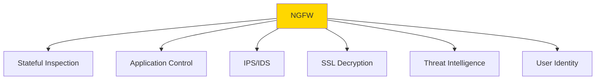
```mermaid
graph TD
    A[NGFW] --> B[Stateful Inspection]
    A --> C[Application Control]
    A --> D[IPS/IDS]
    A --> E[SSL Decryption]
    A --> F[Threat Intelligence]
    A --> G[User Identity]
    
    style A fill:#FFD700
```

## VPN (Virtual Private Network)

**Funksiya:** Public network üzərində private və encrypted connection yaratmaq.

### VPN Types

#### 1. Site-to-Site VPN

**İstifadə:** İki və ya daha çox office-i bağlamaq.

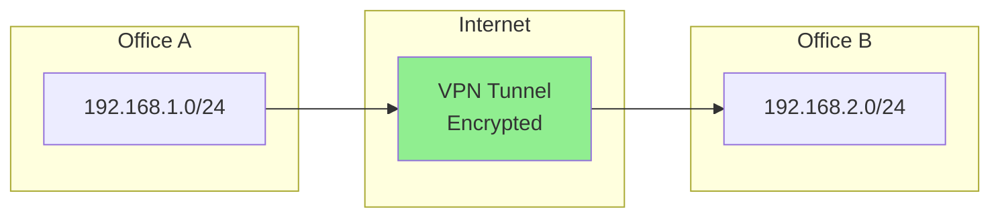
```mermaid
graph LR
    subgraph Office A
    A1[192.168.1.0/24]
    end
    
    subgraph Internet
    B[VPN Tunnel<br/>Encrypted]
    end
    
    subgraph Office B
    C1[192.168.2.0/24]
    end
    
    A1 --> B
    B --> C1
    
    style B fill:#90EE90
```

#### 2. Remote Access VPN

**İstifadə:** Remote user-lərin corporate network-ə giriş.

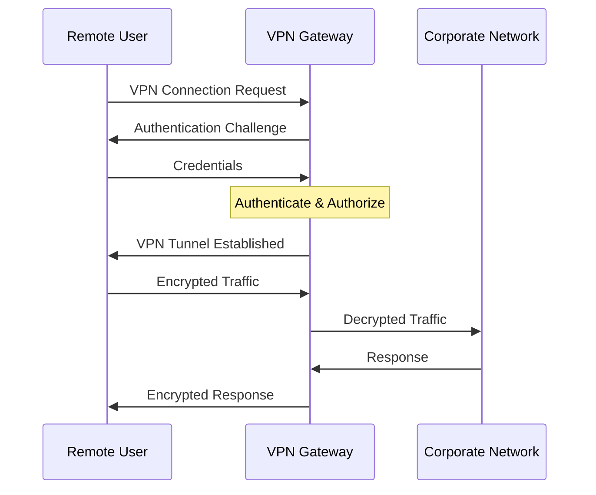
```mermaid
sequenceDiagram
    participant User as Remote User
    participant VPN as VPN Gateway
    participant Corp as Corporate Network
    
    User->>VPN: VPN Connection Request
    VPN->>User: Authentication Challenge
    User->>VPN: Credentials
    Note over VPN: Authenticate & Authorize
    VPN->>User: VPN Tunnel Established
    
    User->>VPN: Encrypted Traffic
    VPN->>Corp: Decrypted Traffic
    Corp->>VPN: Response
    VPN->>User: Encrypted Response
```

### VPN Protocols

#### IPSec (Internet Protocol Security)

**Modes:**
- **Transport Mode:** Yalnız payload encrypt olunur
- **Tunnel Mode:** Bütün packet encrypt olunur

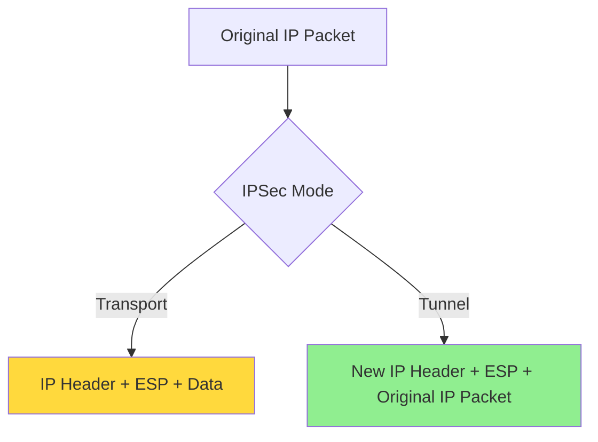
```mermaid
graph TD
    A[Original IP Packet] --> B{IPSec Mode}
    
    B -->|Transport| C[IP Header + ESP + Data]
    B -->|Tunnel| D[New IP Header + ESP + Original IP Packet]
    
    style C fill:#FFD93D
    style D fill:#90EE90
```

**Components:**
- **AH (Authentication Header):** Authentication və integrity
- **ESP (Encapsulating Security Payload):** Encryption + authentication
- **IKE (Internet Key Exchange):** Key management

#### SSL/TLS VPN

**Üstünlüklər:**
- Web browser əsaslı
- No client software (bəzən)
- Port 443 (firewall-friendly)

#### WireGuard

**Xüsusiyyətlər:**
- Modern, simple
- Yüksək performans
- Kiçik codebase
- Built-in roaming

### VPN Topology

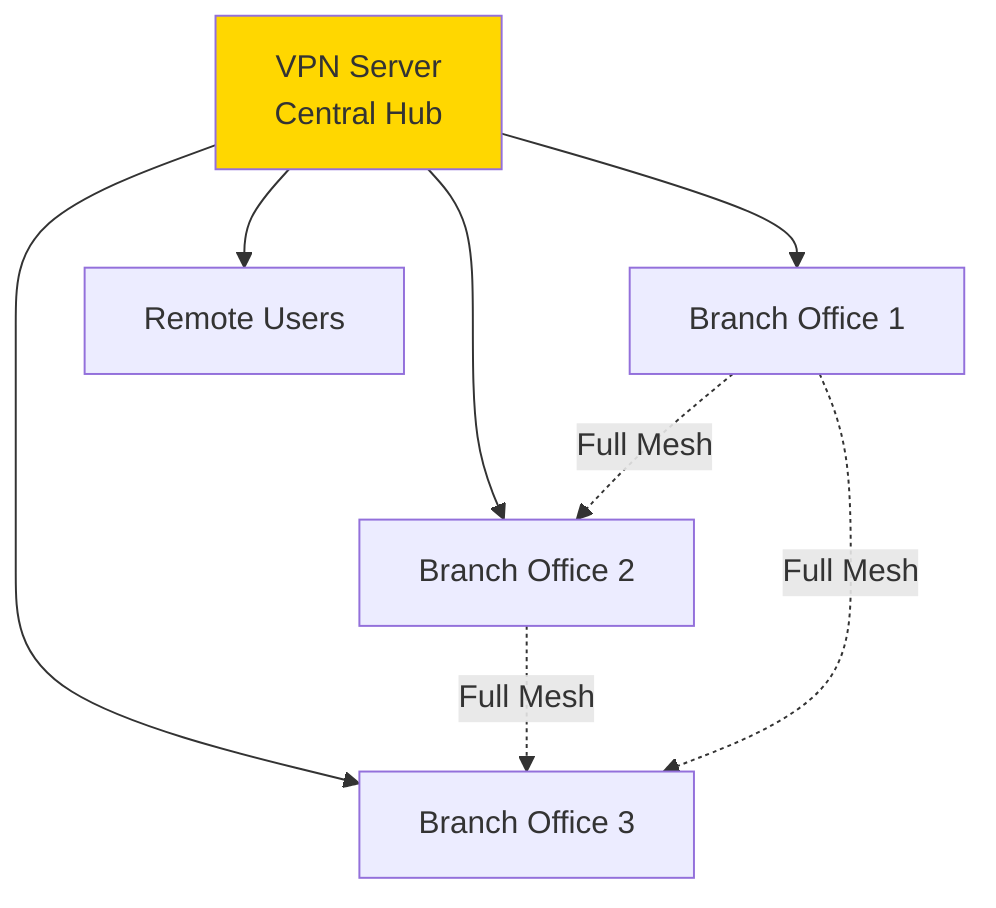
```mermaid
graph TD
    A[VPN Server<br/>Central Hub] --> B[Branch Office 1]
    A --> C[Branch Office 2]
    A --> D[Branch Office 3]
    A --> E[Remote Users]
    
    B -.Full Mesh.-> C
    C -.Full Mesh.-> D
    B -.Full Mesh.-> D
    
    style A fill:#FFD700
```

## Encryption (Şifrələmə)

### Symmetric Encryption

**Konsept:** Eyni açar encryption və decryption üçün.

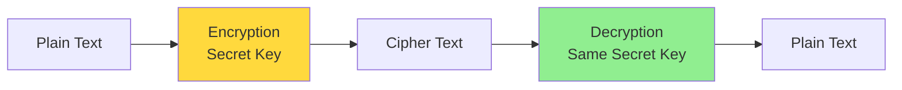
```mermaid
graph LR
    A[Plain Text] --> B[Encryption<br/>Secret Key]
    B --> C[Cipher Text]
    C --> D[Decryption<br/>Same Secret Key]
    D --> E[Plain Text]
    
    style B fill:#FFD93D
    style D fill:#90EE90
```

**Alqoritmlər:**
- **AES (Advanced Encryption Standard)** - 128, 192, 256 bit
- **DES (Data Encryption Standard)** - Deprecated
- **3DES (Triple DES)** - Deprecated
- **ChaCha20** - Modern, mobile-friendly

### Asymmetric Encryption (Public Key)

**Konsept:** Public və private key cütü.

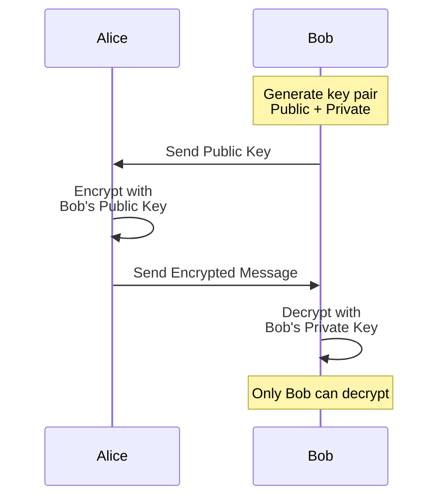
```mermaid
sequenceDiagram
    participant Alice
    participant Bob
    
    Note over Bob: Generate key pair<br/>Public + Private
    Bob->>Alice: Send Public Key
    
    Alice->>Alice: Encrypt with<br/>Bob's Public Key
    Alice->>Bob: Send Encrypted Message
    
    Bob->>Bob: Decrypt with<br/>Bob's Private Key
    Note over Bob: Only Bob can decrypt
```

**Alqoritmlər:**
- **RSA** - 2048, 4096 bit
- **ECC (Elliptic Curve Cryptography)** - Smaller keys
- **Diffie-Hellman** - Key exchange
- **DSA (Digital Signature Algorithm)**

### Hashing

**Funksiya:** One-way function, fixed-size output.

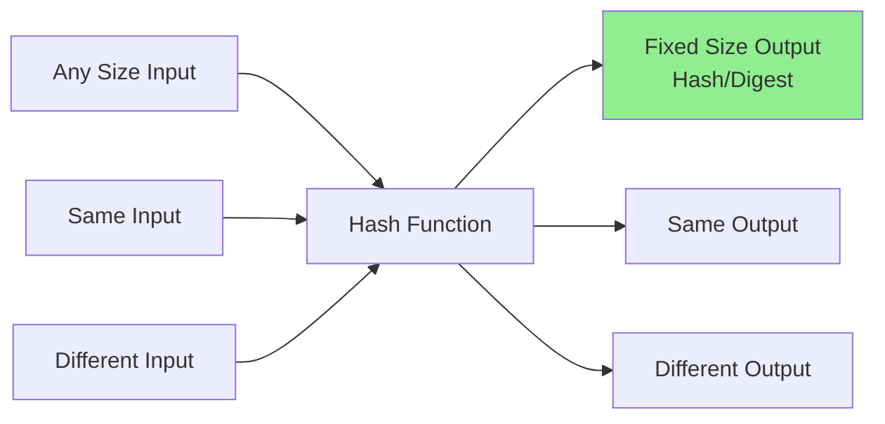
```mermaid
graph LR
    A[Any Size Input] --> B[Hash Function]
    B --> C[Fixed Size Output<br/>Hash/Digest]
    
    D[Same Input] --> B
    B --> E[Same Output]
    
    F[Different Input] --> B
    B --> G[Different Output]
    
    style C fill:#90EE90
```

**Alqoritmlər:**
- **SHA-256, SHA-384, SHA-512** - Secure
- **MD5** - Broken, don't use
- **SHA-1** - Deprecated
- **bcrypt, scrypt, Argon2** - Password hashing

**İstifadə sahələri:**
- Password storage
- Data integrity
- Digital signatures
- Certificate fingerprints

## Common Network Attacks

### 1. DDoS (Distributed Denial of Service)

**Məqsəd:** Sistemə excessive traffic göndərərək əlçatmazlığa səbəb olmaq.

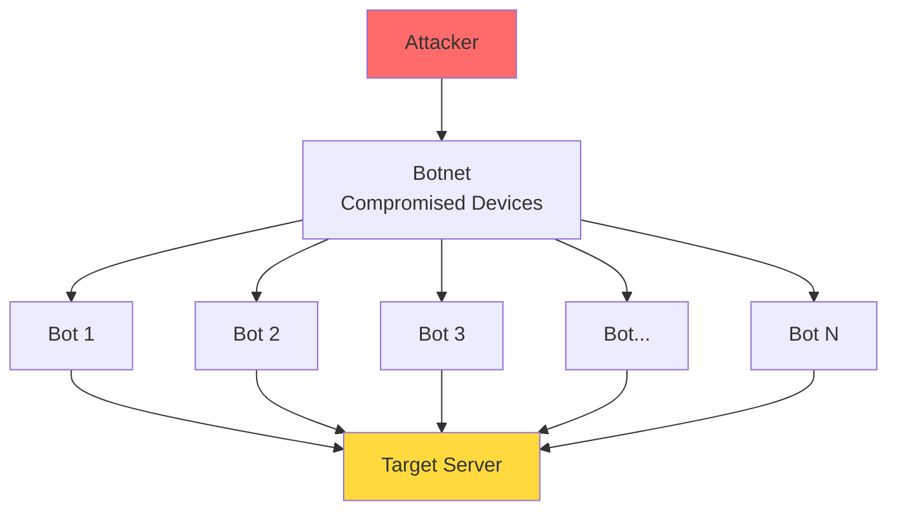
```mermaid
graph TD
    A[Attacker] --> B[Botnet<br/>Compromised Devices]
    
    B --> C1[Bot 1]
    B --> C2[Bot 2]
    B --> C3[Bot 3]
    B --> C4[Bot...]
    B --> C5[Bot N]
    
    C1 --> D[Target Server]
    C2 --> D
    C3 --> D
    C4 --> D
    C5 --> D
    
    style A fill:#FF6B6B
    style D fill:#FFD93D
```

**DDoS Növləri:**

#### Volume-based Attacks
- **UDP Flood**
- **ICMP Flood**
- **DNS Amplification**
- **NTP Amplification**

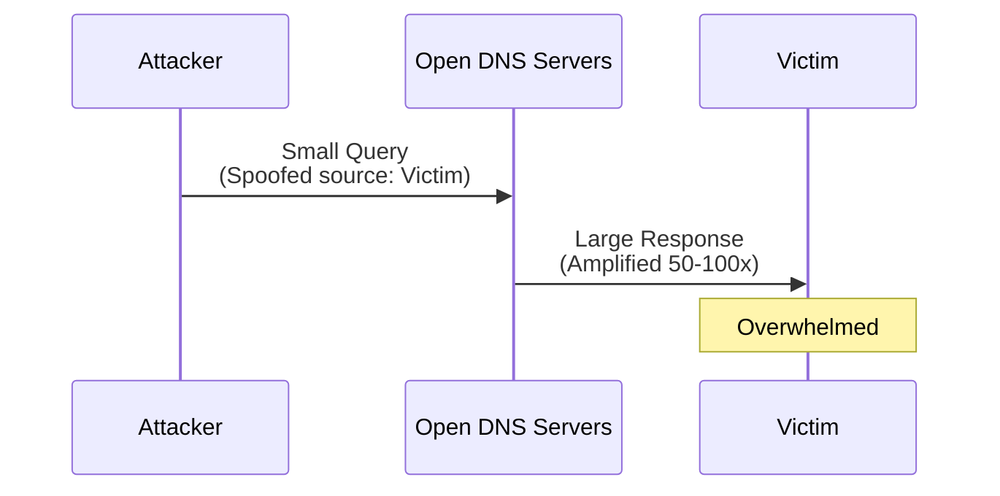
```mermaid
sequenceDiagram
    participant Attacker
    participant OpenDNS as Open DNS Servers
    participant Victim
    
    Attacker->>OpenDNS: Small Query<br/>(Spoofed source: Victim)
    OpenDNS->>Victim: Large Response<br/>(Amplified 50-100x)
    Note over Victim: Overwhelmed
```

#### Protocol Attacks
- **SYN Flood**
- **Ping of Death**
- **Smurf Attack**

#### Application Layer Attacks
- **HTTP Flood**
- **Slowloris**
- **DNS Query Flood**

**Müdafiə:**
- Rate limiting
- Traffic filtering
- CDN/DDoS protection service
- Anycast network
- Overprovisioning bandwidth

### 2. Man-in-the-Middle (MITM)

**Məqsəd:** İki tərəf arasında communication-u intercept etmək.

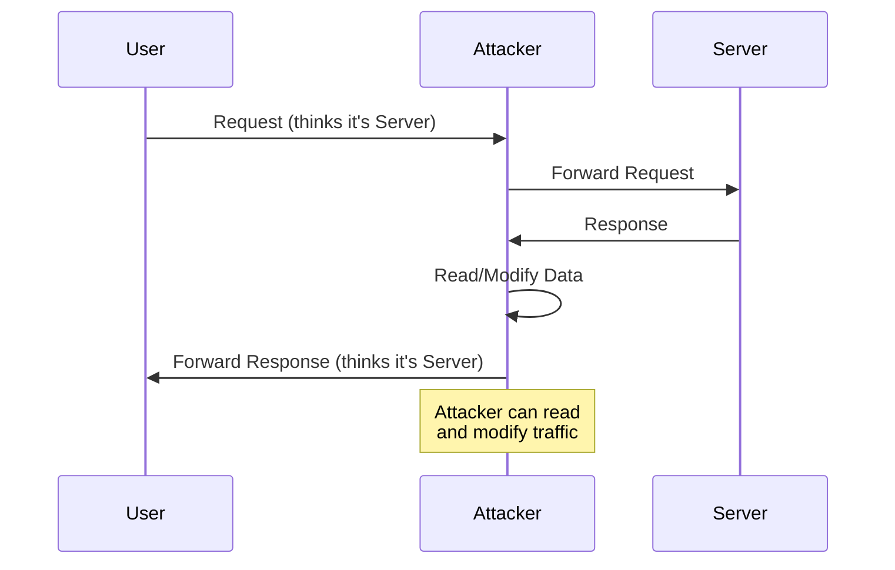
```mermaid
sequenceDiagram
    participant User
    participant Attacker
    participant Server
    
    User->>Attacker: Request (thinks it's Server)
    Attacker->>Server: Forward Request
    Server->>Attacker: Response
    Attacker->>Attacker: Read/Modify Data
    Attacker->>User: Forward Response (thinks it's Server)
    
    Note over Attacker: Attacker can read<br/>and modify traffic
```

**MITM Növləri:**
- ARP Spoofing
- DNS Spoofing
- SSL Stripping
- Session Hijacking
- Email hijacking

**Müdafiə:**
- HTTPS with certificate validation
- VPN usage
- Strong authentication (2FA)
- HSTS header
- Certificate pinning

### 3. Port Scanning

**Məqsəd:** Açıq port və servislər haqqında məlumat toplamaq.

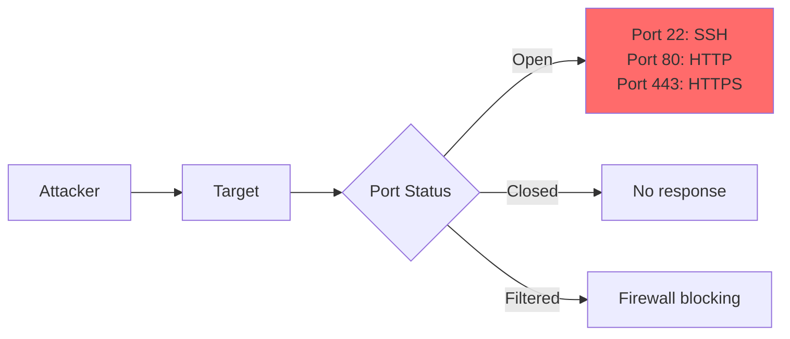
```mermaid
graph LR
    A[Attacker] --> B[Target]
    B --> C{Port Status}
    
    C -->|Open| D[Port 22: SSH<br/>Port 80: HTTP<br/>Port 443: HTTPS]
    C -->|Closed| E[No response]
    C -->|Filtered| F[Firewall blocking]
    
    style D fill:#FF6B6B
```

**Scan Types:**
- **TCP Connect Scan** - Full connection
- **SYN Scan** - Half-open (stealth)
- **UDP Scan**
- **FIN, NULL, Xmas Scan** - Stealth scans

**Müdafiə:**
- Firewall rules
- Port knocking
- IDS/IPS
- Disable unnecessary services
- Network segmentation

### 4. SQL Injection

**Məqsəd:** Database query-ləri manipulate etmək.

```sql
-- Vulnerable code
SELECT * FROM users WHERE username = '$username' AND password = '$password'

-- Attack payload
username: admin' OR '1'='1' --
password: anything

-- Result query
SELECT * FROM users WHERE username = 'admin' OR '1'='1' --' AND password = 'anything'
```

**Müdafiə:**
- Prepared statements/Parameterized queries
- Input validation
- Least privilege DB user
- WAF (Web Application Firewall)
- Regular security audits

### 5. Cross-Site Scripting (XSS)

**Məqsəd:** Malicious script-ləri victim-in browser-ində icra etmək.

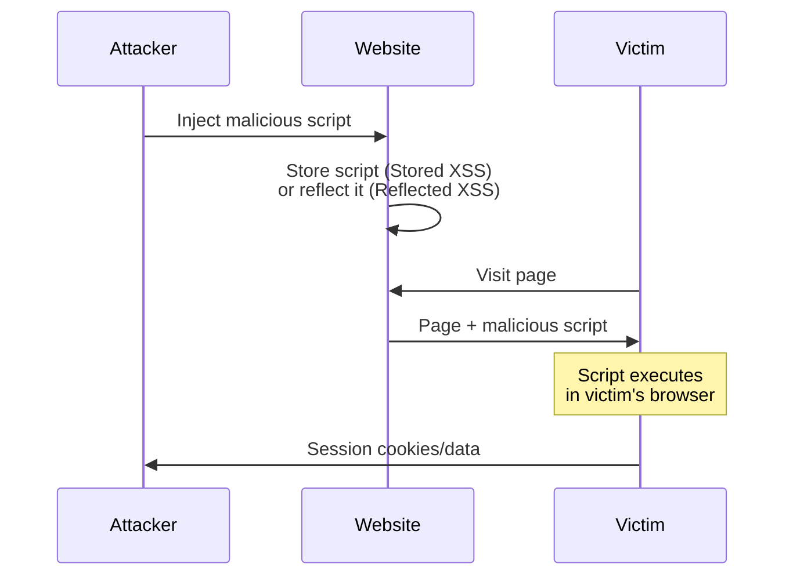
```mermaid
sequenceDiagram
    participant Attacker
    participant Website
    participant Victim
    
    Attacker->>Website: Inject malicious script
    Website->>Website: Store script (Stored XSS)<br/>or reflect it (Reflected XSS)
    Victim->>Website: Visit page
    Website->>Victim: Page + malicious script
    Note over Victim: Script executes<br/>in victim's browser
    Victim->>Attacker: Session cookies/data
```

**XSS Növləri:**
- **Stored XSS** - Script database-də saxlanır
- **Reflected XSS** - Script URL-də olur
- **DOM-based XSS** - Client-side JavaScript-də

**Müdafiə:**
- Input validation və sanitization
- Output encoding
- Content Security Policy (CSP)
- HttpOnly cookies
- X-XSS-Protection header

### 6. Phishing

**Məqsəd:** Social engineering ilə credentials və ya məlumat oğurlamaq.

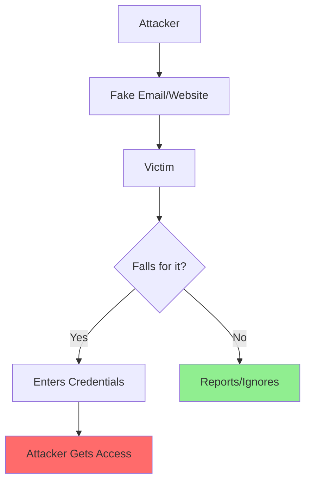
```mermaid
graph TD
    A[Attacker] --> B[Fake Email/Website]
    B --> C[Victim]
    C --> D{Falls for it?}
    D -->|Yes| E[Enters Credentials]
    E --> F[Attacker Gets Access]
    D -->|No| G[Reports/Ignores]
    
    style F fill:#FF6B6B
    style G fill:#90EE90
```

**Müdafiə:**
- User education və awareness
- Email filtering
- Multi-factor authentication (2FA)
- DMARC, SPF, DKIM
- Link inspection tools

## Intrusion Detection/Prevention Systems

### IDS (Intrusion Detection System)

**Funksiya:** Şübhəli aktivitəti detect və alert edir.

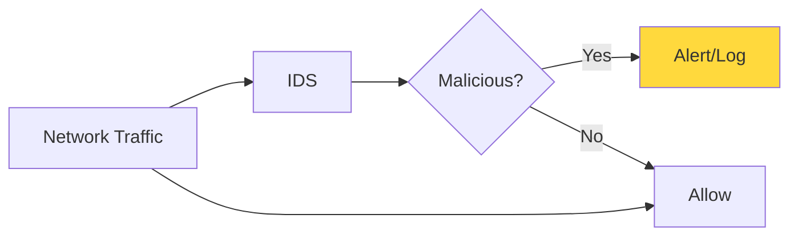
```mermaid
graph LR
    A[Network Traffic] --> B[IDS]
    B --> C{Malicious?}
    C -->|Yes| D[Alert/Log]
    C -->|No| E[Allow]
    
    A --> E
    
    style D fill:#FFD93D
```

**Detection Methods:**
- **Signature-based:** Bilinən attack pattern-ləri
- **Anomaly-based:** Normal davranışdan kənara çıxma
- **Stateful protocol analysis**

### IPS (Intrusion Prevention System)

**Funksiya:** Detect + Block.

```mermaid
graph LR
    A[Network Traffic] --> B[IPS]
    B --> C{Malicious?}
    C -->|Yes| D[❌ Block]
    C -->|No| E[✅ Allow]
    
    style D fill:#FF6B6B
    style E fill:#90EE90
```

**IDS vs IPS:**

| Feature | IDS | IPS |
|---------|-----|-----|
| Action | Monitor + Alert | Monitor + Block |
| Placement | Out-of-band | Inline |
| Impact | No traffic disruption | Can block legitimate traffic |
| Response time | Passive | Active |

## Network Segmentation

**Məqsəd:** Network-u isolated segment-lərə bölmək.

```mermaid
graph TD
    A[Internet] --> B[DMZ]
    
    B --> C[Web Servers]
    B --> D[Mail Servers]
    
    A --> E[Internal Network]
    
    E --> F[User Network<br/>VLAN 10]
    E --> G[Server Network<br/>VLAN 20]
    E --> H[Management Network<br/>VLAN 30]
    E --> I[Guest Network<br/>VLAN 40]
    
    style B fill:#FFD93D
    style A fill:#FF6B6B
    style F fill:#90EE90
    style G fill:#87CEEB
    style H fill:#FFB6C1
    style I fill:#DDA0DD
```

**Üstünlüklər:**
- Breach containment
- Compliance requirements
- Performance improvement
- Easier monitoring

**Implementation:**
- VLANs
- Firewalls
- Access Control Lists (ACLs)
- Micro-segmentation

## Zero Trust Architecture

**Prinsip:** "Never trust, always verify"

```mermaid
graph TD
    A[User/Device] --> B{Identity Verification}
    B --> C{Device Health Check}
    C --> D{Context Analysis}
    D --> E{Policy Engine}
    
    E -->|Allow| F[Minimal Access<br/>Just-in-time]
    E -->|Deny| G[Block Access]
    
    F --> H[Continuous Monitoring]
    H --> I{Still compliant?}
    I -->|No| G
    I -->|Yes| F
    
    style E fill:#FFD700
    style F fill:#90EE90
    style G fill:#FF6B6B
```

**Principles:**
1. Verify explicitly
2. Use least privilege access
3. Assume breach

## Security Best Practices

### 1. Network Level

**Firewall:**
- Default deny policy
- Regular rule review
- Logging enabled
- Geo-blocking

**Segmentation:**
- Separate critical assets
- DMZ for public services
- Management network isolation

### 2. Authentication

**Multi-Factor Authentication (2FA/MFA):**
```mermaid
graph LR
    A[Something you know<br/>Password] --> D[Access Granted]
    B[Something you have<br/>Phone/Token] --> D
    C[Something you are<br/>Biometric] --> D
    
    style D fill:#90EE90
```

**Password Policy:**
- Minimum 12 characters
- Complexity requirements
- Regular rotation
- No reuse
- Password manager usage

### 3. Encryption

**Data in Transit:**
- TLS 1.3 for all communications
- VPN for remote access
- SSH for remote management

**Data at Rest:**
- Full disk encryption
- Database encryption
- File-level encryption

### 4. Monitoring və Logging

**Log Everything:**
- Authentication attempts
- Configuration changes
- Network traffic
- System events

**SIEM (Security Information and Event Management):**
```mermaid
graph TD
    A[Firewalls] --> E[SIEM]
    B[IDS/IPS] --> E
    C[Servers] --> E
    D[Applications] --> E
    
    E --> F[Correlation]
    F --> G[Alert]
    F --> H[Dashboard]
    
    style E fill:#FFD700
```

### 5. Patch Management

**Process:**
1. Vulnerability discovered
2. Patch released
3. Test in staging
4. Deploy to production
5. Verify

**Priority:**
- Critical: 24-48 hours
- High: 1 week
- Medium: 1 month
- Low: Quarterly

### 6. Incident Response Plan

```mermaid
graph LR
    A[Preparation] --> B[Detection]
    B --> C[Containment]
    C --> D[Eradication]
    D --> E[Recovery]
    E --> F[Lessons Learned]
    F --> A
    
    style A fill:#e1f5ff
    style C fill:#FFD93D
    style E fill:#90EE90
```

## Network Security Tools

**Vulnerability Scanning:**
- Nessus
- OpenVAS
- Qualys

**Penetration Testing:**
- Metasploit
- Burp Suite
- Kali Linux

**Network Monitoring:**
- Wireshark
- tcpdump
- Nagios
- Zabbix

**IDS/IPS:**
- Snort
- Suricata
- Zeek (Bro)

**SIEM:**
- Splunk
- ELK Stack
- QRadar
- ArcSight

## Compliance və Standards

**Frameworks:**
- **ISO 27001** - Information security management
- **NIST Cybersecurity Framework**
- **CIS Controls**
- **PCI DSS** - Payment card industry
- **HIPAA** - Healthcare
- **GDPR** - Data protection (EU)

## Əlaqəli Mövzular

- OSI Model
- TCP/IP Protocol
- HTTP/HTTPS
- DNS Security (DNSSEC)
- VPN Technologies
- Encryption Standards
- Cloud Security
- Application Security
