# Load Balancing

## Load Balancing Nədir?

**Load Balancing** - gələn şəbəkə traffic-ini bir neçə server arasında bərabər paylaşdırmaq üçün istifadə olunan texnikadır.

**Məqsədlər:**
- Traffic-in bərabər paylaşdırılması
- Server overload-un qarşısının alınması
- High availability (yüksək əlçatanlıq)
- Fault tolerance
- Scalability
- Performance optimization

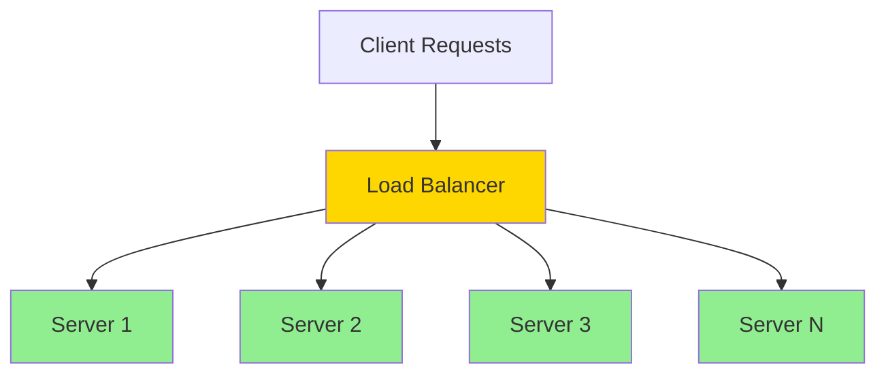
```mermaid
graph TD
    A[Client Requests] --> B[Load Balancer]
    
    B --> C[Server 1]
    B --> D[Server 2]
    B --> E[Server 3]
    B --> F[Server N]
    
    style B fill:#FFD700
    style C fill:#90EE90
    style D fill:#90EE90
    style E fill:#90EE90
    style F fill:#90EE90
```

## Load Balancer Types

### 1. Hardware Load Balancer

**Xüsusiyyətlər:**
- Dedicated physical device
- Yüksək performans
- Bahalı
- F5 BIG-IP, Citrix NetScaler

**Üstünlüklər:**
- High throughput
- Low latency
- Advanced features

**Dezavantajlar:**
- Yüksək qiymət
- Limited flexibility
- Vendor lock-in

### 2. Software Load Balancer

**Xüsusiyyətlər:**
- Standard server-də işləyir
- Cost-effective
- Flexible configuration
- HAProxy, NGINX, Apache

**Üstünlüklər:**
- Cheaper
- Easy to scale
- Open source options

**Dezavantajlar:**
- Lower performance (hardware-a nisbətən)
- Resource consumption

### 3. Cloud Load Balancer

**Xüsusiyyətlər:**
- Cloud provider tərəfindən managed
- Auto-scaling
- Global distribution
- AWS ELB, Azure LB, GCP LB

**Üstünlüklər:**
- No hardware management
- Pay-as-you-go
- High availability built-in

## Load Balancer Layers (OSI)

### Layer 4 Load Balancing (Transport Layer)

**İş prinsipi:** IP address və port əsasında qərar verir.

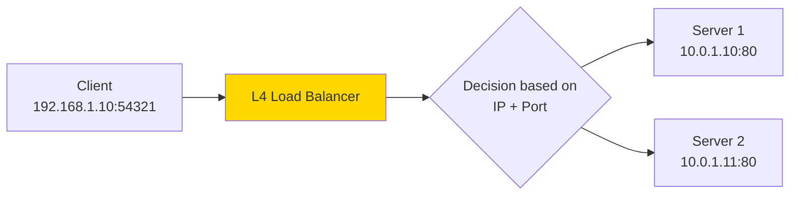
```mermaid
graph LR
    A[Client<br/>192.168.1.10:54321] --> B[L4 Load Balancer]
    B --> C{Decision based on<br/>IP + Port}
    
    C --> D[Server 1<br/>10.0.1.10:80]
    C --> E[Server 2<br/>10.0.1.11:80]
    
    style B fill:#FFD700
```

**Xüsusiyyətlər:**
- Fast (header-ə baxır)
- Protocol-agnostic
- TCP/UDP support
- Connection-based routing

**İstifadə sahələri:**
- Simple HTTP traffic
- Database connections
- Any TCP/UDP service

### Layer 7 Load Balancing (Application Layer)

**İş prinsipi:** HTTP header, URL, content əsasında qərar verir.

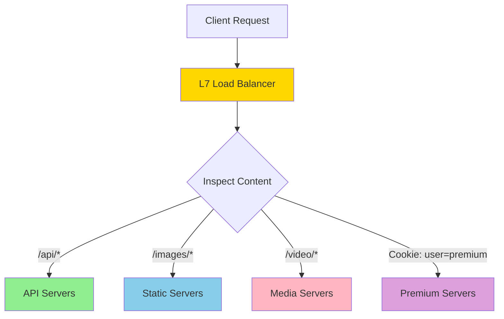
```mermaid
graph TD
    A[Client Request] --> B[L7 Load Balancer]
    B --> C{Inspect Content}
    
    C -->|/api/*| D[API Servers]
    C -->|/images/*| E[Static Servers]
    C -->|/video/*| F[Media Servers]
    C -->|Cookie: user=premium| G[Premium Servers]
    
    style B fill:#FFD700
    style D fill:#90EE90
    style E fill:#87CEEB
    style F fill:#FFB6C1
    style G fill:#DDA0DD
```

**Xüsusiyyətlər:**
- Content-aware routing
- SSL termination
- HTTP header manipulation
- Cookie-based routing
- URL rewriting

**İstifadə sahələri:**
- Web applications
- Microservices
- API gateways
- Content-based routing

### Layer 4 vs Layer 7

| Feature | Layer 4 | Layer 7 |
|---------|---------|---------|
| Decision | IP + Port | Content + Headers |
| Performance | Faster | Slower |
| Flexibility | Limited | High |
| SSL | Pass-through | Termination |
| Cost | Lower | Higher |
| Use case | Simple routing | Complex routing |

## Load Balancing Algorithms

### 1. Round Robin

**İş prinsipi:** Hər request növbə ilə server-lərə göndərilir.

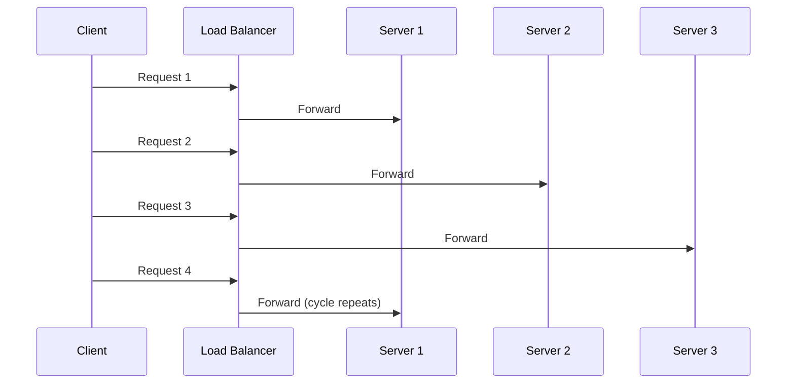
```mermaid
sequenceDiagram
    participant C as Client
    participant LB as Load Balancer
    participant S1 as Server 1
    participant S2 as Server 2
    participant S3 as Server 3
    
    C->>LB: Request 1
    LB->>S1: Forward
    
    C->>LB: Request 2
    LB->>S2: Forward
    
    C->>LB: Request 3
    LB->>S3: Forward
    
    C->>LB: Request 4
    LB->>S1: Forward (cycle repeats)
```

**Üstünlüklər:**
- Simple
- Fair distribution
- No state required

**Dezavantajlar:**
- Server capacity nəzərə alınmır
- Session persistence yoxdur

### 2. Weighted Round Robin

**İş prinsipi:** Server-lərə weight (çəki) verilir, güclü server-lərə daha çox request.

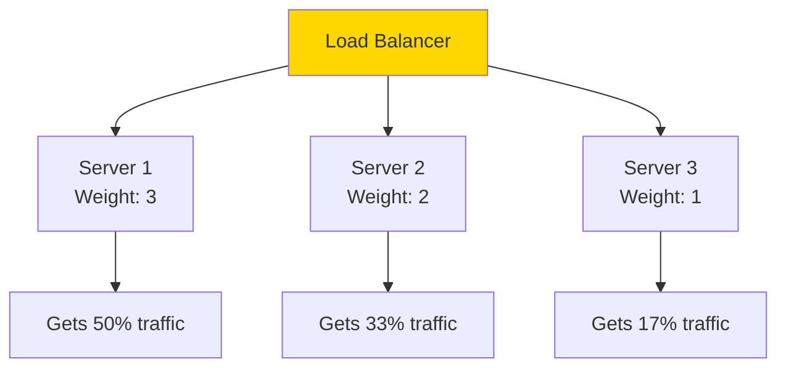
```mermaid
graph TD
    A[Load Balancer] --> B[Server 1<br/>Weight: 3]
    A --> C[Server 2<br/>Weight: 2]
    A --> D[Server 3<br/>Weight: 1]
    
    B --> E[Gets 50% traffic]
    C --> F[Gets 33% traffic]
    D --> G[Gets 17% traffic]
    
    style A fill:#FFD700
```

**Konfiqurasiya:**
```nginx
upstream backend {
    server backend1.example.com weight=3;
    server backend2.example.com weight=2;
    server backend3.example.com weight=1;
}
```

### 3. Least Connections

**İş prinsipi:** Ən az active connection-u olan server-ə göndərir.

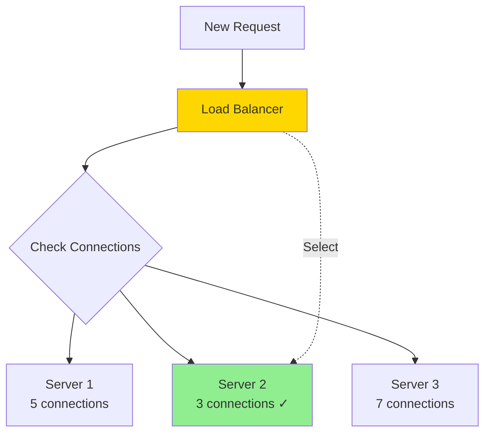
```mermaid
graph TD
    A[New Request] --> B[Load Balancer]
    B --> C{Check Connections}
    
    C --> D[Server 1<br/>5 connections]
    C --> E[Server 2<br/>3 connections ✓]
    C --> F[Server 3<br/>7 connections]
    
    B -.Select.-> E
    
    style B fill:#FFD700
    style E fill:#90EE90
```

**İstifadə sahəsi:**
- Long-lived connections
- WebSocket connections
- Database connections

### 4. Weighted Least Connections

**İş prinsipi:** Connection count + weight kombinasiyası.

**Formula:**
```
Score = Active Connections / Weight
Select server with lowest score
```

### 5. IP Hash

**İş prinsipi:** Client IP-yə əsasən həmişə eyni server-ə yönləndirir.

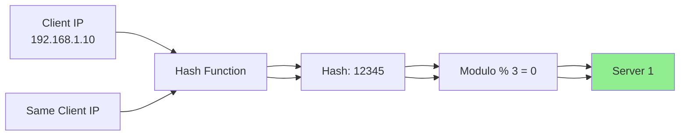
```mermaid
graph LR
    A[Client IP<br/>192.168.1.10] --> B[Hash Function]
    B --> C[Hash: 12345]
    C --> D[Modulo % 3 = 0]
    D --> E[Server 1]
    
    F[Same Client IP] --> B
    B --> C
    C --> D
    D --> E
    
    style E fill:#90EE90
```

**Formula:**
```
server_index = hash(client_ip) % number_of_servers
```

**Üstünlüklər:**
- Session persistence
- Cache hit ratio yaxşı

**Dezavantajlar:**
- Server əlavə/silinməsi problemi
- Uneven distribution (bəzən)

### 6. Least Response Time

**İş prinsipi:** Ən az response time göstərən server seçilir.

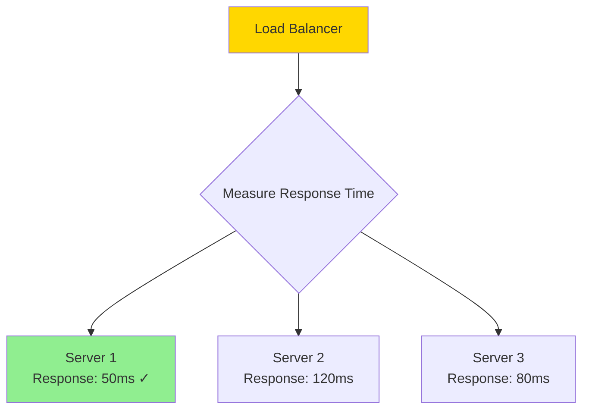
```mermaid
graph TD
    A[Load Balancer] --> B{Measure Response Time}
    
    B --> C[Server 1<br/>Response: 50ms ✓]
    B --> D[Server 2<br/>Response: 120ms]
    B --> E[Server 3<br/>Response: 80ms]
    
    style A fill:#FFD700
    style C fill:#90EE90
```

### 7. Random

**İş prinsipi:** Random olaraq server seçilir.

**İstifadə sahəsi:**
- Simple setups
- Testing

### 8. URL Hash

**İş prinsipi:** URL-ə əsasən routing (cache efficiency üçün).

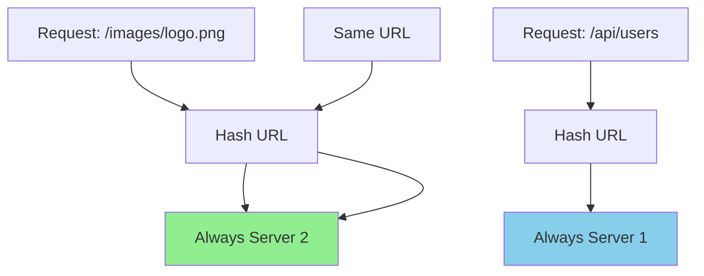
```mermaid
graph TD
    A[Request: /images/logo.png] --> B[Hash URL]
    B --> C[Always Server 2]
    
    D[Request: /api/users] --> E[Hash URL]
    E --> F[Always Server 1]
    
    G[Same URL] --> B
    B --> C
    
    style C fill:#90EE90
    style F fill:#87CEEB
```

## Health Checks

**Məqsəd:** Server-lərin sağlamlığını yoxlamaq və problem olduqda traffic göndərməmək.

### Active Health Checks

**İş prinsipi:** Load balancer mütəmadi olaraq server-lərə request göndərir.

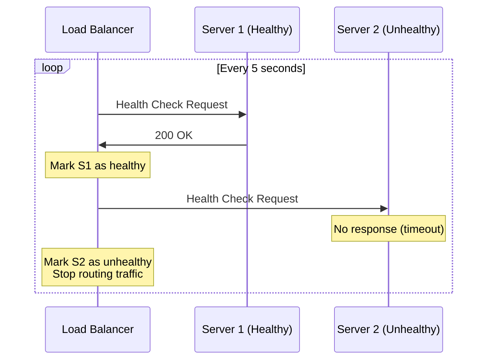
```mermaid
sequenceDiagram
    participant LB as Load Balancer
    participant S1 as Server 1 (Healthy)
    participant S2 as Server 2 (Unhealthy)
    
    loop Every 5 seconds
        LB->>S1: Health Check Request
        S1->>LB: 200 OK
        Note over LB: Mark S1 as healthy
        
        LB->>S2: Health Check Request
        Note over S2: No response (timeout)
        Note over LB: Mark S2 as unhealthy<br/>Stop routing traffic
    end
```

**Health Check Types:**

#### HTTP/HTTPS Health Check
```nginx
upstream backend {
    server backend1.example.com;
    server backend2.example.com;
    
    # Health check config
    check interval=3000 rise=2 fall=3 timeout=1000 type=http;
    check_http_send "GET /health HTTP/1.0\r\n\r\n";
    check_http_expect_alive http_2xx http_3xx;
}
```

#### TCP Health Check
```yaml
# Check if port is open
tcp_check:
  interval: 5s
  timeout: 2s
  port: 8080
```

#### Custom Health Check
```python
# Application health endpoint
@app.route('/health')
def health_check():
    # Check database
    if not db.is_connected():
        return 'unhealthy', 503
    
    # Check dependencies
    if not cache.is_available():
        return 'unhealthy', 503
    
    return 'healthy', 200
```

### Passive Health Checks

**İş prinsipi:** Real traffic-dən error-lara baxaraq qərar verir.

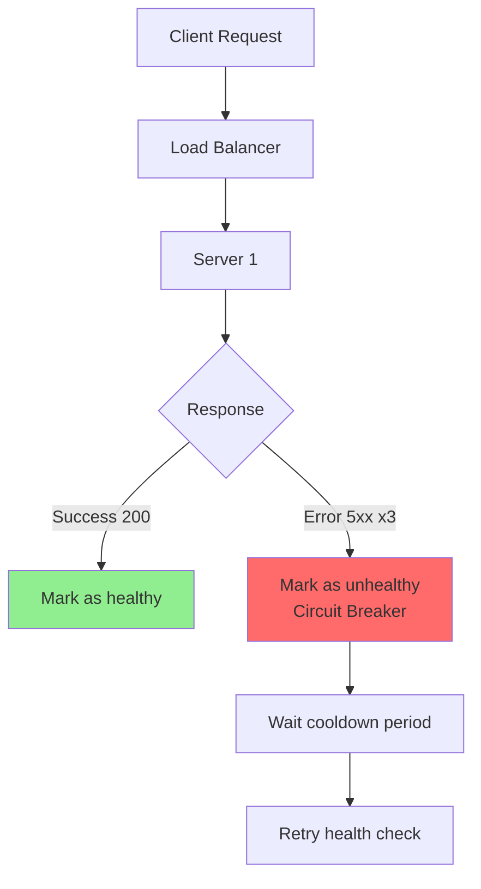
```mermaid
graph TD
    A[Client Request] --> B[Load Balancer]
    B --> C[Server 1]
    C --> D{Response}
    
    D -->|Success 200| E[Mark as healthy]
    D -->|Error 5xx x3| F[Mark as unhealthy<br/>Circuit Breaker]
    
    F --> G[Wait cooldown period]
    G --> H[Retry health check]
    
    style F fill:#FF6B6B
    style E fill:#90EE90
```

**Parameters:**
- **Interval:** Yoxlama intervalı (5s, 10s)
- **Timeout:** Response timeout (2s)
- **Rise:** Neçə successful check-dən sonra healthy (2, 3)
- **Fall:** Neçə failed check-dən sonra unhealthy (2, 3)

## Session Persistence (Sticky Sessions)

**Problem:** User-in request-ləri müxtəlif server-lərə getdikdə session itir.

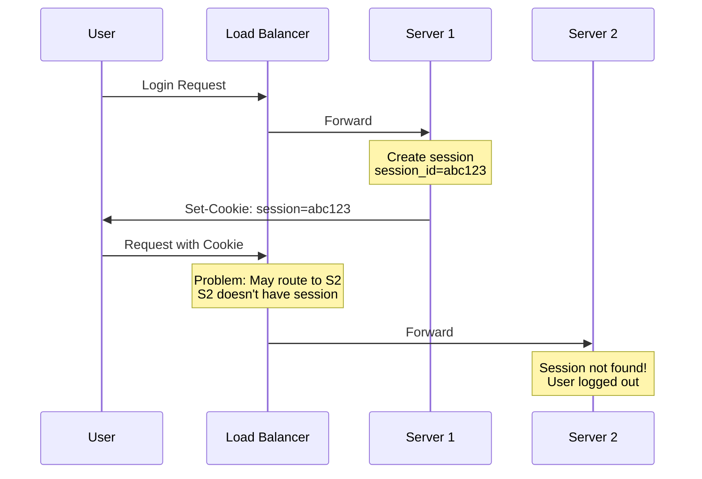
```mermaid
sequenceDiagram
    participant User
    participant LB as Load Balancer
    participant S1 as Server 1
    participant S2 as Server 2
    
    User->>LB: Login Request
    LB->>S1: Forward
    Note over S1: Create session<br/>session_id=abc123
    S1->>User: Set-Cookie: session=abc123
    
    User->>LB: Request with Cookie
    Note over LB: Problem: May route to S2<br/>S2 doesn't have session
    LB->>S2: Forward
    Note over S2: Session not found!<br/>User logged out
```

### Solution 1: Cookie-based Persistence

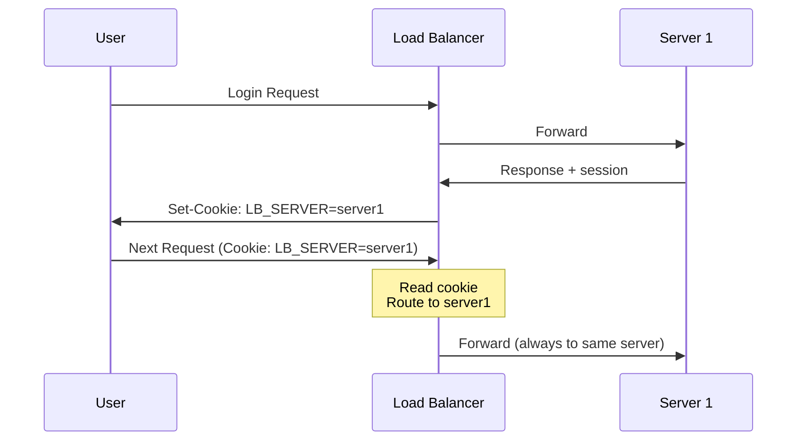
```mermaid
sequenceDiagram
    participant User
    participant LB as Load Balancer
    participant S1 as Server 1
    
    User->>LB: Login Request
    LB->>S1: Forward
    S1->>LB: Response + session
    LB->>User: Set-Cookie: LB_SERVER=server1
    
    User->>LB: Next Request (Cookie: LB_SERVER=server1)
    Note over LB: Read cookie<br/>Route to server1
    LB->>S1: Forward (always to same server)
```

**NGINX Configuration:**
```nginx
upstream backend {
    ip_hash;  # Simple IP-based persistence
    server backend1.example.com;
    server backend2.example.com;
}

# Or cookie-based
sticky cookie srv_id expires=1h domain=.example.com path=/;
```

### Solution 2: Centralized Session Store

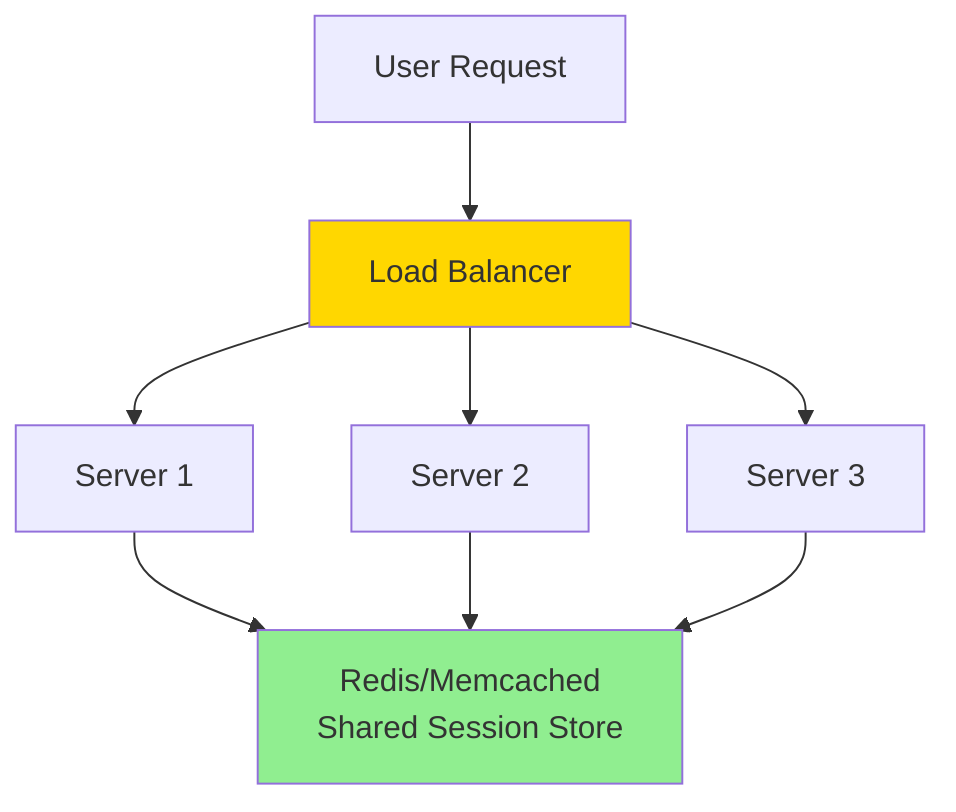
```mermaid
graph TD
    A[User Request] --> B[Load Balancer]
    
    B --> C[Server 1]
    B --> D[Server 2]
    B --> E[Server 3]
    
    C --> F[Redis/Memcached<br/>Shared Session Store]
    D --> F
    E --> F
    
    style B fill:#FFD700
    style F fill:#90EE90
```

**Üstünlüklər:**
- Server down olsa da session davam edir
- True load balancing
- Horizontal scaling

## High Availability (HA) Setup

### Active-Passive

**İş prinsipi:** Bir load balancer active, digəri standby.

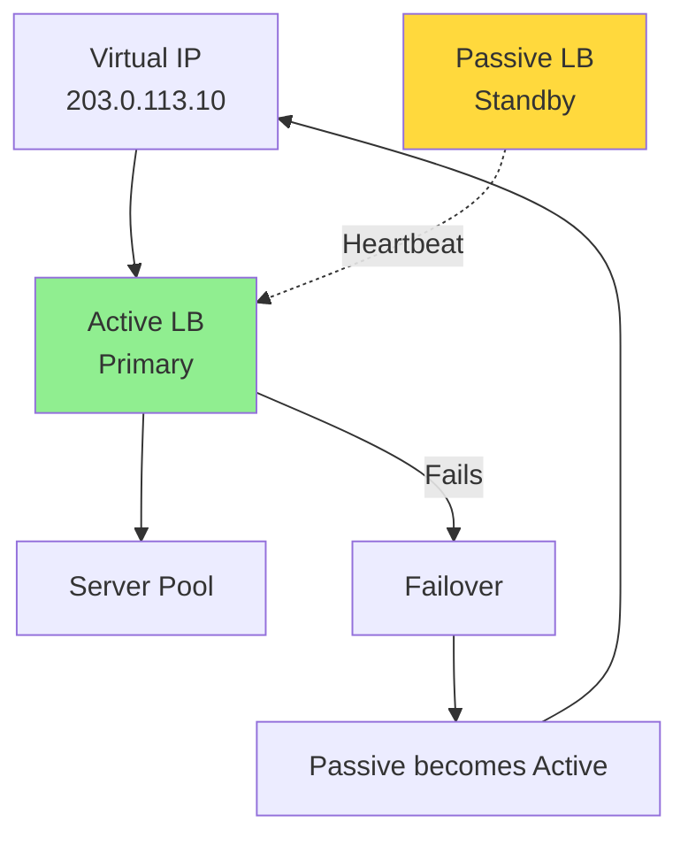
```mermaid
graph TD
    A[Virtual IP<br/>203.0.113.10] --> B[Active LB<br/>Primary]
    
    C[Passive LB<br/>Standby] -.Heartbeat.-> B
    
    B --> D[Server Pool]
    
    B -->|Fails| E[Failover]
    E --> F[Passive becomes Active]
    F --> A
    
    style B fill:#90EE90
    style C fill:#FFD93D
```

**Keepalived Configuration:**
```bash
vrrp_instance VI_1 {
    state MASTER
    interface eth0
    virtual_router_id 51
    priority 100
    
    virtual_ipaddress {
        203.0.113.10
    }
}
```

### Active-Active

**İş prinsipi:** Hər iki load balancer traffic handle edir.

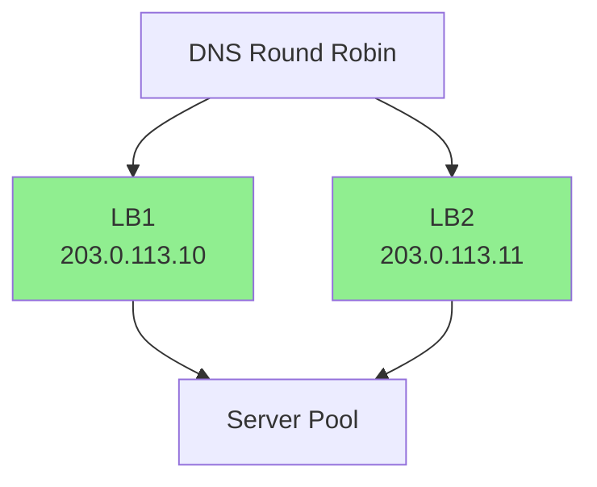
```mermaid
graph TD
    A[DNS Round Robin] --> B[LB1<br/>203.0.113.10]
    A --> C[LB2<br/>203.0.113.11]
    
    B --> D[Server Pool]
    C --> D
    
    style B fill:#90EE90
    style C fill:#90EE90
```

## Global Server Load Balancing (GSLB)

**Məqsəd:** Müxtəlif geografik location-lardakı datacenter-lər arasında load balancing.

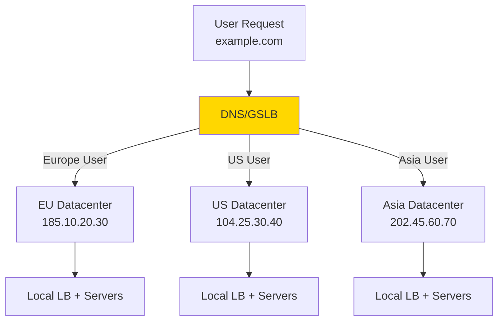
```mermaid
graph TD
    A[User Request<br/>example.com] --> B[DNS/GSLB]
    
    B -->|Europe User| C[EU Datacenter<br/>185.10.20.30]
    B -->|US User| D[US Datacenter<br/>104.25.30.40]
    B -->|Asia User| E[Asia Datacenter<br/>202.45.60.70]
    
    C --> F[Local LB + Servers]
    D --> G[Local LB + Servers]
    E --> H[Local LB + Servers]
    
    style B fill:#FFD700
```

**Benefits:**
- Geo-proximity routing
- Disaster recovery
- Latency reduction
- Regional compliance

**Methods:**
- **GeoDNS** - Location-based DNS
- **Anycast** - Same IP, multiple locations
- **Latency-based routing**

## SSL/TLS Termination

### SSL Termination at Load Balancer

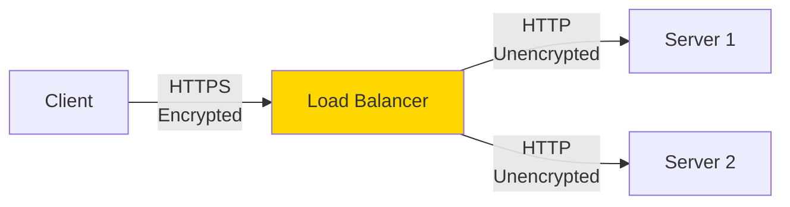
```mermaid
graph LR
    A[Client] -->|HTTPS<br/>Encrypted| B[Load Balancer]
    B -->|HTTP<br/>Unencrypted| C[Server 1]
    B -->|HTTP<br/>Unencrypted| D[Server 2]
    
    style B fill:#FFD700
```

**Üstünlüklər:**
- Centralized certificate management
- Reduced server CPU load
- Easier certificate rotation

**Dezavantajlar:**
- Internal traffic unencrypted
- Compliance issues (bəzi hallarda)

### SSL Pass-through

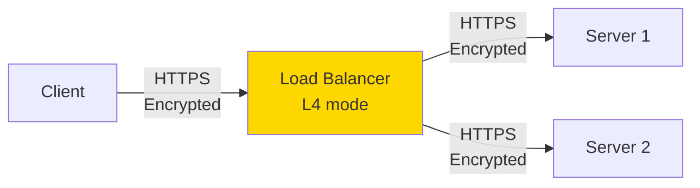
```mermaid
graph LR
    A[Client] -->|HTTPS<br/>Encrypted| B[Load Balancer<br/>L4 mode]
    B -->|HTTPS<br/>Encrypted| C[Server 1]
    B -->|HTTPS<br/>Encrypted| D[Server 2]
    
    style B fill:#FFD700
```

**Üstünlüklər:**
- End-to-end encryption
- Better security

**Dezavantajlar:**
- No L7 inspection
- Server CPU overhead
- Certificate management per server

## Rate Limiting

**Məqsəd:** API abuse və DDoS-dan qorunma.

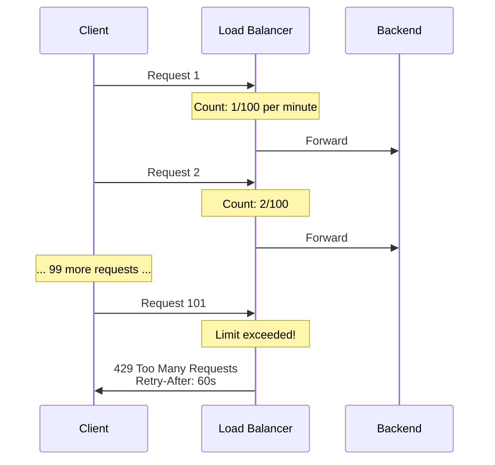
```mermaid
sequenceDiagram
    participant Client
    participant LB as Load Balancer
    participant Backend
    
    Client->>LB: Request 1
    Note over LB: Count: 1/100 per minute
    LB->>Backend: Forward
    
    Client->>LB: Request 2
    Note over LB: Count: 2/100
    LB->>Backend: Forward
    
    Note over Client: ... 99 more requests ...
    
    Client->>LB: Request 101
    Note over LB: Limit exceeded!
    LB->>Client: 429 Too Many Requests<br/>Retry-After: 60s
```

**NGINX Configuration:**
```nginx
http {
    # Define rate limit zone
    limit_req_zone $binary_remote_addr zone=api:10m rate=10r/s;
    
    server {
        location /api/ {
            limit_req zone=api burst=20 nodelay;
            
            # Return rate limit headers
            add_header X-RateLimit-Limit 10;
            add_header X-RateLimit-Remaining $limit_req_remaining;
            
            proxy_pass http://backend;
        }
    }
}
```

## Load Balancing Patterns

### 1. Simple Load Balancing

```mermaid
graph TD
    A[Internet] --> B[Load Balancer]
    B --> C[Web Server 1]
    B --> D[Web Server 2]
    B --> E[Web Server 3]
    
    style B fill:#FFD700
```

### 2. Multi-Tier Load Balancing

```mermaid
graph TD
    A[Internet] --> B[L7 Load Balancer<br/>WAF + SSL]
    
    B --> C[App Server 1]
    B --> D[App Server 2]
    
    C --> E[L4 Load Balancer<br/>DB]
    D --> E
    
    E --> F[DB Primary]
    E --> G[DB Replica 1]
    E --> H[DB Replica 2]
    
    style B fill:#FFD700
    style E fill:#FFD93D
```

### 3. Microservices Load Balancing

```mermaid
graph TD
    A[API Gateway<br/>Load Balancer] --> B[User Service<br/>LB]
    A --> C[Order Service<br/>LB]
    A --> D[Payment Service<br/>LB]
    
    B --> E[User Instances]
    C --> F[Order Instances]
    D --> G[Payment Instances]
    
    style A fill:#FFD700
```

## Popular Load Balancers

### HAProxy

**Xüsusiyyətlər:**
- High performance
- L4 + L7
- Advanced routing
- Free and open source

**Configuration Example:**
```haproxy
frontend http_front
    bind *:80
    default_backend http_back

backend http_back
    balance roundrobin
    option httpchk GET /health
    server server1 10.0.1.10:80 check
    server server2 10.0.1.11:80 check
    server server3 10.0.1.12:80 check
```

### NGINX

**Xüsusiyyətlər:**
- Web server + load balancer
- Reverse proxy
- High performance
- Free and commercial versions

**Configuration Example:**
```nginx
upstream backend {
    least_conn;
    
    server backend1.example.com weight=3;
    server backend2.example.com weight=2;
    server backend3.example.com backup;
    
    keepalive 32;
}

server {
    listen 80;
    
    location / {
        proxy_pass http://backend;
        proxy_set_header Host $host;
        proxy_set_header X-Real-IP $remote_addr;
    }
}
```

### Cloud Load Balancers

**AWS:**
- **ALB (Application Load Balancer)** - L7
- **NLB (Network Load Balancer)** - L4
- **CLB (Classic Load Balancer)** - Legacy

**Azure:**
- **Azure Load Balancer** - L4
- **Application Gateway** - L7

**GCP:**
- **HTTP(S) Load Balancer** - L7
- **TCP/UDP Load Balancer** - L4

## Monitoring və Metrics

**Key Metrics:**

```mermaid
graph TD
    A[Load Balancer Metrics] --> B[Request Rate]
    A --> C[Response Time]
    A --> D[Error Rate]
    A --> E[Active Connections]
    A --> F[Backend Health]
    A --> G[SSL/TLS Performance]
    
    style A fill:#FFD700
```

**Monitoring Tools:**
- Prometheus + Grafana
- DataDog
- New Relic
- CloudWatch (AWS)

**Important Metrics:**
- Requests per second (RPS)
- Average response time
- P95, P99 latency
- 2xx, 4xx, 5xx response codes
- Backend server health status
- Connection pool utilization

## Best Practices

1. **Health Checks:**
   - Mütəmadi health check
   - Application-level checks
   - Multiple failure threshold

2. **Session Management:**
   - Centralized session store
   - Stateless applications (mümkün olduqda)

3. **SSL/TLS:**
   - TLS 1.3 istifadə et
   - Strong cipher suites
   - Certificate automation (Let's Encrypt)

4. **Monitoring:**
   - Real-time metrics
   - Alerting configured
   - Log aggregation

5. **Capacity Planning:**
   - Load testing
   - Auto-scaling rules
   - Overprovisioning (20-30%)

6. **Security:**
   - DDoS protection
   - Rate limiting
   - WAF integration
   - Regular updates

7. **High Availability:**
   - Multiple load balancers
   - Cross-region deployment
   - Regular failover testing

## Troubleshooting

**Common Issues:**

**1. Uneven Load Distribution:**
- Check algorithm (use least connections)
- Verify weights
- Check sticky sessions

**2. Backend Server Unavailable:**
- Verify health checks
- Check firewall rules
- Test backend connectivity

**3. High Latency:**
- Check backend performance
- Monitor connection limits
- Analyze keepalive settings

**4. SSL/TLS Issues:**
- Verify certificate validity
- Check cipher compatibility
- Monitor SSL handshake time

## Əlaqəli Mövzular

- High Availability Architecture
- Microservices Architecture
- CDN (Content Delivery Network)
- DNS and GeoDNS
- Network Security
- Auto-scaling
- Container Orchestration (Kubernetes)
- API Gateway
