# CDN (Content Delivery Network)

## CDN Nədir?

**CDN (Content Delivery Network)** - content-i istifadəçilərə coğrafi olaraq yaxın server-lərdən çatdırmaq üçün istifadə olunan geografik bölgülərə yerləşdirilmiş server-lər şəbəkəsidir.

**Məqsədlər:**
- Latency-nin azaldılması
- Bandwidth-in optimizasiyası
- Load-un paylaşdırılması
- High availability
- DDoS protection
- Global reach

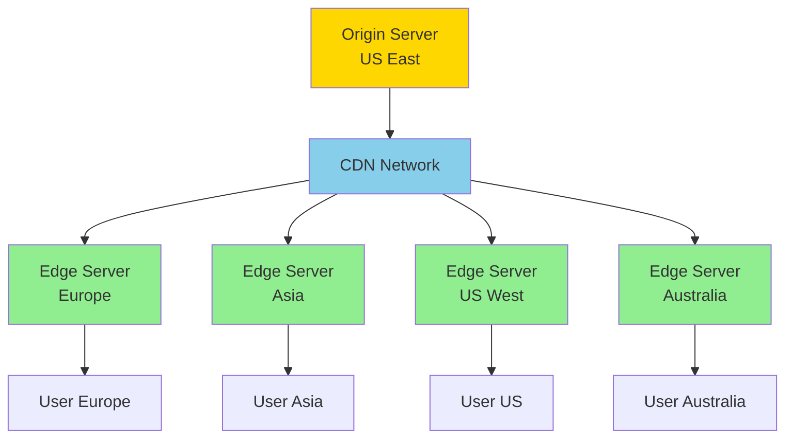

## CDN İş Prinsipi

### Traditional vs CDN

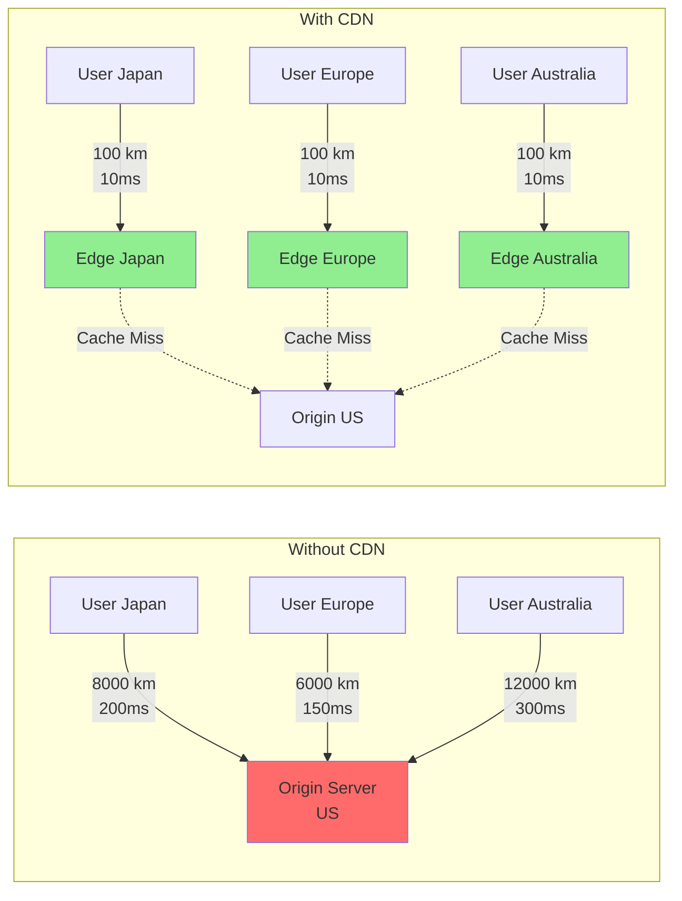

### CDN Request Flow

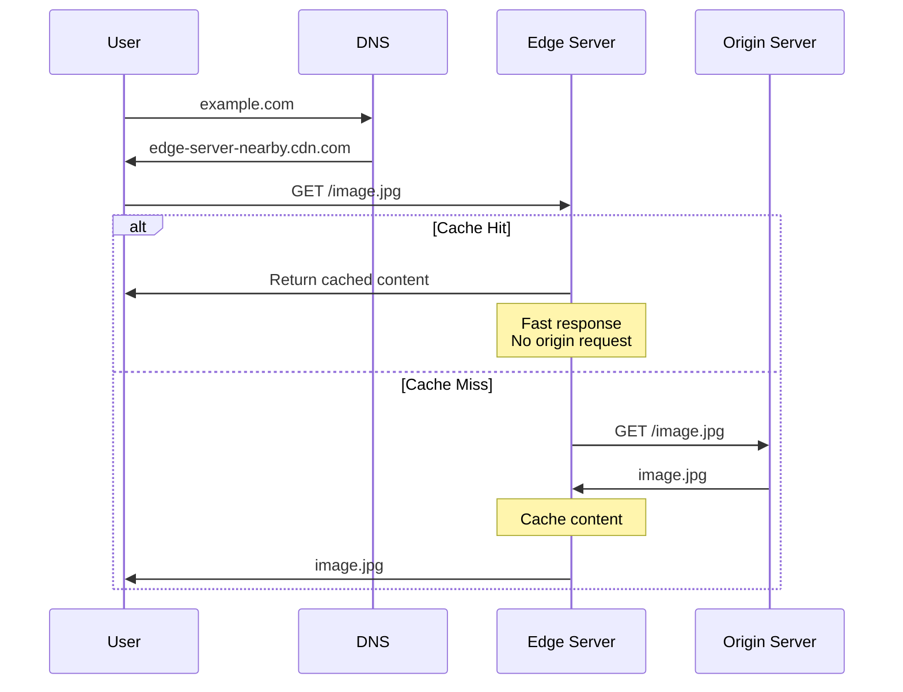

## CDN Architecture

### PoP (Point of Presence)

**PoP** - CDN şəbəkəsinin bir coğrafi location-dakı physical datacenter-i.

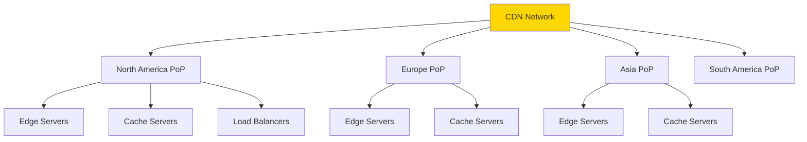

### CDN Components

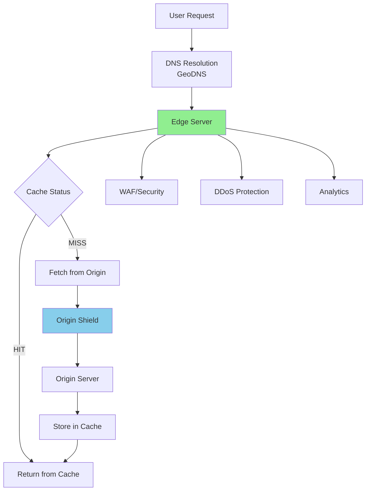

## Cache Strategies

### 1. Cache Headers

**HTTP Cache Headers:**

```http
HTTP/1.1 200 OK
Content-Type: image/jpeg
Cache-Control: public, max-age=31536000
Expires: Thu, 31 Dec 2025 23:59:59 GMT
ETag: "33a64df551425fcc55e4d42a148795d9f25f89d4"
Last-Modified: Wed, 21 Oct 2023 07:28:00 GMT
```

**Cache-Control Directives:**

| Directive | Məna |
|-----------|------|
| `public` | Hər kəs cache edə bilər (CDN, browser) |
| `private` | Yalnız browser cache edə bilər |
| `no-cache` | Revalidation tələb olunur |
| `no-store` | Heç cache edilməməlidir |
| `max-age=3600` | 1 saat cache et |
| `s-maxage=7200` | Shared cache (CDN) üçün 2 saat |
| `must-revalidate` | Expire olduqda mütləq yoxla |
| `immutable` | Heç vaxt dəyişməyəcək |

### 2. Cache Levels

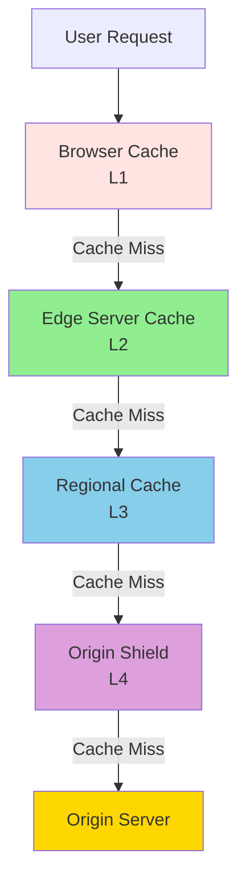

### 3. Cache Key

**Cache key** - content-in cache-də unique identifikatorudur.

```
cache_key = hash(
    scheme +           // https
    host +             // example.com
    path +             // /images/logo.png
    query_params +     // ?width=100&quality=high
    custom_headers     // Accept-Language, Cookie (optional)
)
```

**Example:**
```
GET /api/users?page=2&limit=10
Accept-Language: en-US
Cookie: session=abc123

Cache Key: https://example.com/api/users?page=2&limit=10
```

### 4. Cache Invalidation

**Problem:** Content dəyişdikdə köhnə cache təmizlənməlidir.

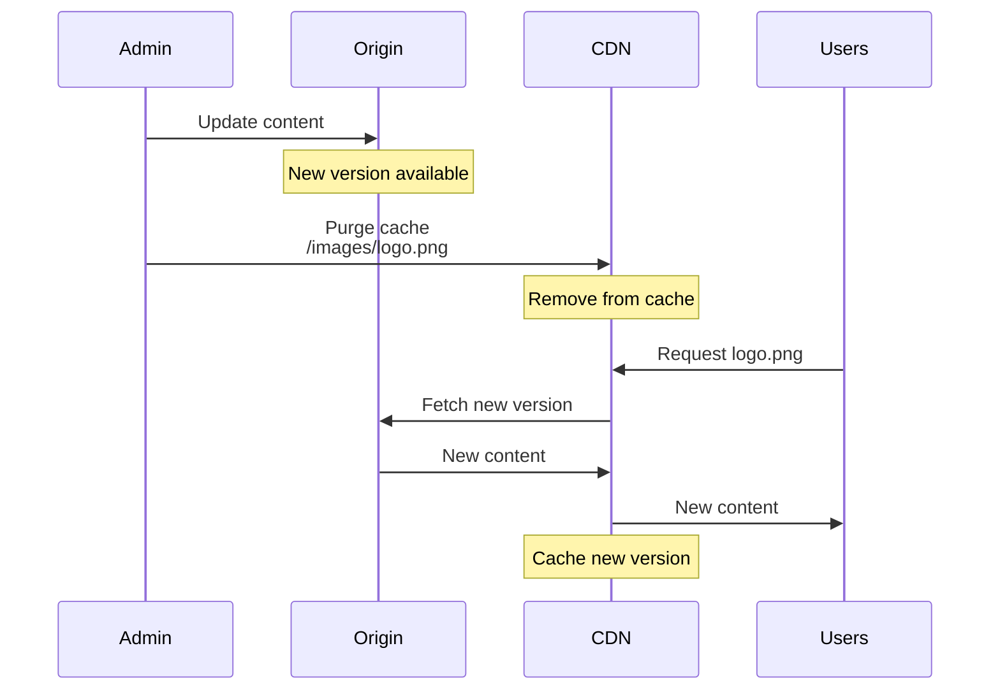

**Invalidation Methods:**

#### Purge (Hard Delete)
```bash
# Delete specific file
curl -X PURGE https://cdn.example.com/images/logo.png

# Purge by tag
curl -X POST https://api.cdn.com/purge \
  -d '{"tags": ["homepage", "products"]}'
```

#### Soft Purge (Mark as stale)
```bash
# Mark as stale, revalidate on next request
curl -X PURGE https://cdn.example.com/images/logo.png \
  -H "Fastly-Soft-Purge: 1"
```

#### TTL Expiration
```
Cache-Control: max-age=3600  # Auto-expire after 1 hour
```

#### Versioning
```
# Old: /assets/style.css
# New: /assets/style.v2.css
# Or:  /assets/style.css?v=2
```

### 5. Cache Hit Ratio

**Məqsəd:** Cache-dən cavab verə bilmə nisbəti.

```
Cache Hit Ratio = (Cache Hits / Total Requests) × 100%

Example:
1000 requests total
800 served from cache (hits)
200 from origin (misses)

Hit Ratio = (800 / 1000) × 100% = 80%
```

**Optimization:**
- Longer TTL
- Better cache key design
- Prewarming cache
- Origin shield

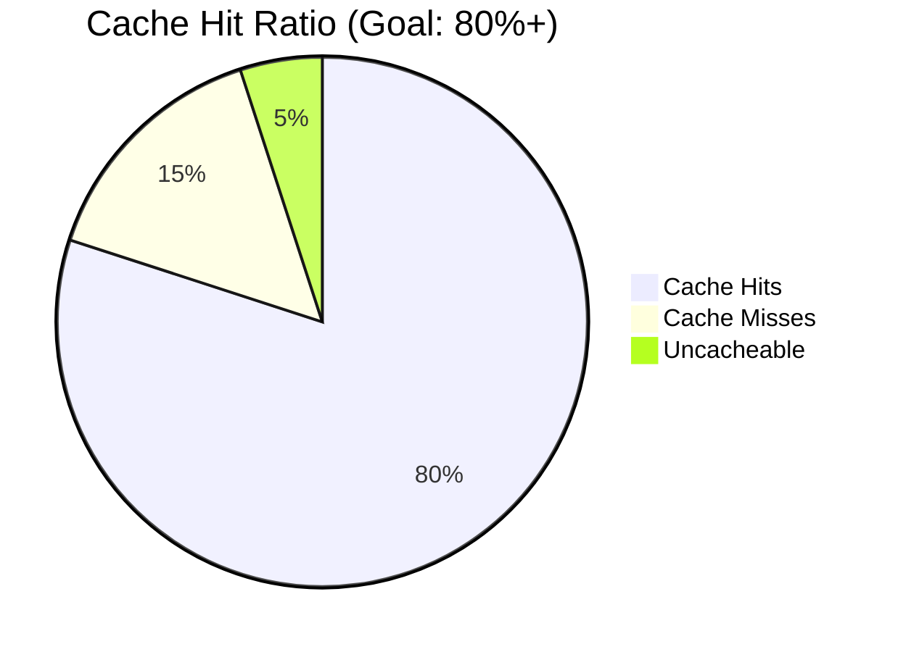

## CDN Content Types

### 1. Static Content

**Perfect for CDN:**
- Images (JPEG, PNG, WebP)
- CSS, JavaScript files
- Fonts
- Videos (VOD)
- Documents (PDF)

```nginx
# CDN configuration for static files
location ~* \.(jpg|jpeg|png|gif|ico|css|js|svg|woff2)$ {
    expires 1y;
    add_header Cache-Control "public, immutable";
}
```

### 2. Dynamic Content

**Cacheable with conditions:**
- API responses (with proper headers)
- Personalized content (with Vary header)
- HTML pages (with ESI)

```http
# API response with cache
HTTP/1.1 200 OK
Cache-Control: public, max-age=300, s-maxage=600
Vary: Accept-Encoding, Accept-Language
```

### 3. Streaming Content

**Live və VOD:**

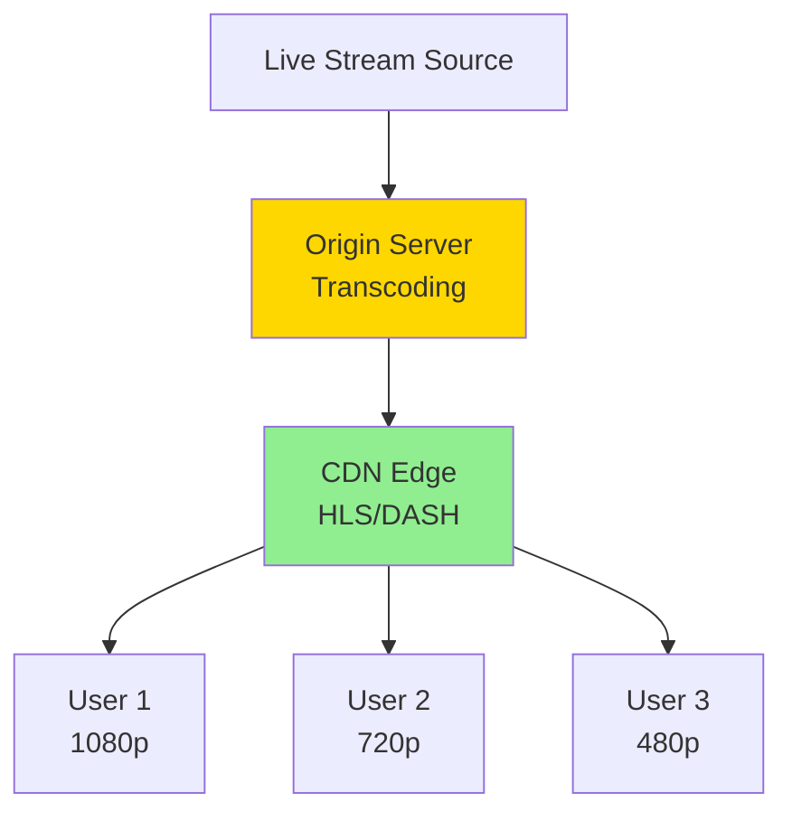

**Streaming Protocols:**
- **HLS** (HTTP Live Streaming) - Apple
- **DASH** (Dynamic Adaptive Streaming) - Standard
- **RTMP** - Legacy live streaming

## Edge Computing

**Edge Computing** - CDN edge server-lərində kod icra etmək.

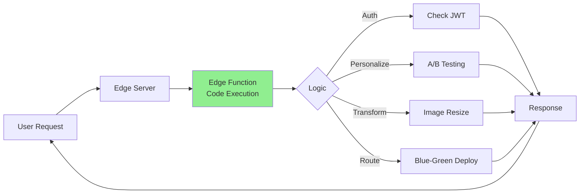

### Edge Functions Use Cases

#### 1. Image Optimization

```javascript
// Cloudflare Worker - Image resize
addEventListener('fetch', event => {
  event.respondWith(handleRequest(event.request))
})

async function handleRequest(request) {
  const url = new URL(request.url)
  const width = url.searchParams.get('width') || 800
  
  // Fetch original image
  const response = await fetch(url.origin + url.pathname)
  
  // Resize using Cloudflare Image Resizing
  return new Response(response.body, {
    headers: {
      ...response.headers,
      'cf-image-width': width,
      'cache-control': 'public, max-age=31536000'
    }
  })
}
```

#### 2. A/B Testing

```javascript
// Edge A/B testing
addEventListener('fetch', event => {
  event.respondWith(handleRequest(event.request))
})

async function handleRequest(request) {
  const cookie = request.headers.get('cookie')
  
  // Assign variant
  let variant = 'A'
  if (cookie && cookie.includes('variant=B')) {
    variant = 'B'
  } else if (Math.random() < 0.5) {
    variant = 'B'
  }
  
  // Fetch variant-specific content
  const url = new URL(request.url)
  url.pathname = `/variant-${variant}${url.pathname}`
  
  const response = await fetch(url)
  
  // Set cookie
  const newResponse = new Response(response.body, response)
  newResponse.headers.set('Set-Cookie', `variant=${variant}; Path=/; Max-Age=86400`)
  
  return newResponse
}
```

#### 3. Authentication

```javascript
// Edge authentication
addEventListener('fetch', event => {
  event.respondWith(handleRequest(event.request))
})

async function handleRequest(request) {
  const token = request.headers.get('Authorization')
  
  if (!token) {
    return new Response('Unauthorized', { status: 401 })
  }
  
  // Verify JWT at edge
  const isValid = await verifyJWT(token)
  
  if (!isValid) {
    return new Response('Invalid token', { status: 403 })
  }
  
  // Forward to origin
  return fetch(request)
}
```

#### 4. Geolocation Routing

```javascript
// Route based on location
addEventListener('fetch', event => {
  event.respondWith(handleRequest(event.request))
})

async function handleRequest(request) {
  const country = request.cf.country // Cloudflare provides this
  
  let origin
  switch(country) {
    case 'JP':
    case 'CN':
    case 'KR':
      origin = 'https://asia.example.com'
      break
    case 'GB':
    case 'DE':
    case 'FR':
      origin = 'https://eu.example.com'
      break
    default:
      origin = 'https://us.example.com'
  }
  
  const url = new URL(request.url)
  url.host = new URL(origin).host
  
  return fetch(url)
}
```

## CDN Security

### 1. DDoS Protection

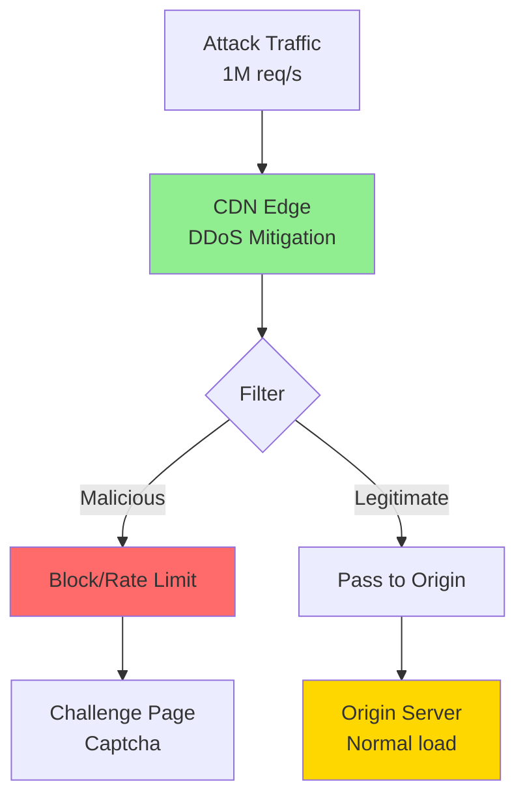

### 2. WAF (Web Application Firewall)

**Protection against:**
- SQL Injection
- XSS (Cross-Site Scripting)
- CSRF
- Bot traffic
- Bad user agents

```yaml
# WAF Rule example
rules:
  - id: block_sql_injection
    pattern: (?i)(union|select|insert|update|delete|drop).*from
    action: block
    
  - id: rate_limit_api
    path: /api/*
    limit: 100 req/minute
    action: challenge
    
  - id: block_bad_bots
    user_agent: (curl|wget|python-requests)
    action: block
```

### 3. Token Authentication

**Signed URLs:**

```python
import hmac
import hashlib
import time

def generate_signed_url(base_url, secret_key, expiration=3600):
    expires = int(time.time()) + expiration
    
    # Create signature
    message = f"{base_url}{expires}"
    signature = hmac.new(
        secret_key.encode(),
        message.encode(),
        hashlib.sha256
    ).hexdigest()
    
    # Build URL
    return f"{base_url}?expires={expires}&signature={signature}"

# Example
url = generate_signed_url(
    "https://cdn.example.com/video.mp4",
    "my-secret-key",
    3600  # 1 hour
)
print(url)
# https://cdn.example.com/video.mp4?expires=1698765432&signature=abc123...
```

**Validation at CDN:**
```javascript
// Validate signed URL
function validateSignedURL(request, secretKey) {
  const url = new URL(request.url)
  const expires = url.searchParams.get('expires')
  const signature = url.searchParams.get('signature')
  
  // Check expiration
  if (parseInt(expires) < Date.now() / 1000) {
    return false
  }
  
  // Verify signature
  const message = url.origin + url.pathname + expires
  const expectedSignature = hmac_sha256(message, secretKey)
  
  return signature === expectedSignature
}
```

### 4. HTTPS Everywhere

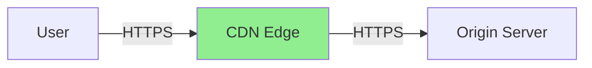

**Benefits:**
- Data encryption
- MITM protection
- SEO boost
- HTTP/2 support

## CDN Performance Optimization

### 1. HTTP/2 & HTTP/3

**HTTP/2:**
- Multiplexing
- Header compression
- Server push

**HTTP/3 (QUIC):**
- UDP-based
- Faster connection
- Better mobile performance

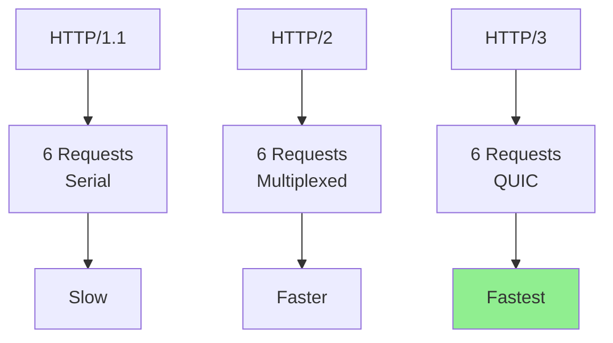

### 2. Compression

```nginx
# Brotli compression (better than gzip)
brotli on;
brotli_comp_level 6;
brotli_types text/plain text/css application/javascript application/json;

# Gzip fallback
gzip on;
gzip_types text/plain text/css application/javascript;
```

**Compression Ratios:**
- Text files: 70-90% reduction
- JavaScript: 60-80% reduction
- Images (already compressed): 0-10%

### 3. Image Optimization

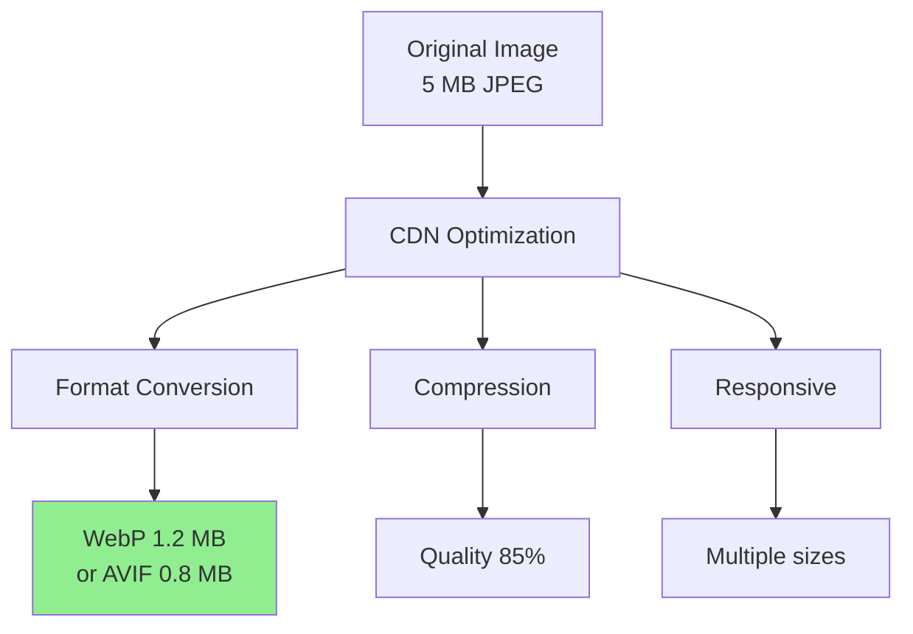

**Automatic optimization:**
```html
<!-- Cloudflare Polish / Cloudinary -->

```

### 4. Prefetching & Preloading

```html
<!-- DNS prefetch -->
<link rel="dns-prefetch" href="https://cdn.example.com">

<!-- Preconnect -->
<link rel="preconnect" href="https://cdn.example.com">

<!-- Preload critical resources -->
<link rel="preload" href="https://cdn.example.com/main.css" as="style">
<link rel="preload" href="https://cdn.example.com/app.js" as="script">

<!-- Prefetch next page -->
<link rel="prefetch" href="https://cdn.example.com/next-page.html">
```

## CDN Analytics & Monitoring

**Key Metrics:**

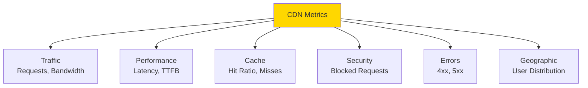

**Monitoring Dashboard:**
```
┌─────────────────────────────────────┐
│ CDN Performance Dashboard           │
├─────────────────────────────────────┤
│ Requests/sec:        45,000         │
│ Bandwidth:           2.5 GB/s       │
│ Cache Hit Ratio:     87%            │
│ Avg Latency:         45ms           │
│ P95 Latency:         120ms          │
│ Origin Requests:     5,850/s        │
│ Error Rate:          0.02%          │
├─────────────────────────────────────┤
│ Top Locations:                      │
│  🌍 US:     35%                     │
│  🌍 EU:     28%                     │
│  🌍 Asia:   25%                     │
│  🌍 Other:  12%                     │
└─────────────────────────────────────┘
```

## Popular CDN Providers

### Cloudflare

**Xüsusiyyətlər:**
- 300+ PoPs worldwide
- Free tier available
- DDoS protection included
- Edge workers (serverless)
- WAF
- Analytics

**Use cases:**
- Websites
- APIs
- Video streaming

### AWS CloudFront

**Xüsusiyyətlər:**
- AWS ecosystem integration
- Lambda@Edge
- 450+ PoPs
- Pay-as-you-go
- Origin shield

**Use cases:**
- AWS-hosted applications
- S3 static websites
- Video streaming

### Fastly

**Xüsusiyyətlər:**
- Instant purge (150ms)
- VCL (Varnish) configuration
- Real-time analytics
- Edge compute
- Advanced caching

**Use cases:**
- High-traffic sites
- Real-time applications
- Media delivery

### Akamai

**Xüsusiyyətlər:**
- Largest CDN (300,000+ servers)
- Enterprise-focused
- Advanced security
- IoT support

**Use cases:**
- Enterprise applications
- Large-scale streaming
- Gaming

### Others

- **Azure CDN** - Microsoft ecosystem
- **Google Cloud CDN** - GCP integration
- **KeyCDN** - Budget-friendly
- **BunnyCDN** - Performance-focused
- **StackPath** - Edge computing

## CDN Configuration Example

### Cloudflare Page Rules

```yaml
page_rules:
  - name: cache_static
    url_pattern: example.com/static/*
    settings:
      cache_level: Cache Everything
      edge_cache_ttl: 1 month
      browser_cache_ttl: 1 day

  - name: api_caching
    url_pattern: example.com/api/v1/products
    settings:
      cache_level: Cache Everything
      edge_cache_ttl: 5 minutes
      bypass_cache_on_cookie: session=*

  - name: no_cache_admin
    url_pattern: example.com/admin/*
    settings:
      cache_level: Bypass
```

### NGINX Origin Configuration

```nginx
server {
    listen 80;
    server_name origin.example.com;
    
    # Only allow CDN IPs
    allow 103.21.244.0/22;  # Cloudflare IPs
    deny all;
    
    location /static/ {
        root /var/www;
        
        # Cache headers
        expires 1y;
        add_header Cache-Control "public, immutable";
        
        # Security
        add_header X-Content-Type-Options "nosniff";
        add_header X-Frame-Options "DENY";
    }
    
    location /api/ {
        proxy_pass http://backend;
        
        # Vary header for proper caching
        add_header Vary "Accept-Encoding, Accept-Language";
        
        # Cache control
        add_header Cache-Control "public, max-age=300";
    }
}
```

## Multi-CDN Strategy

**Məqsəd:** Bir neçə CDN provider istifadə etmək.

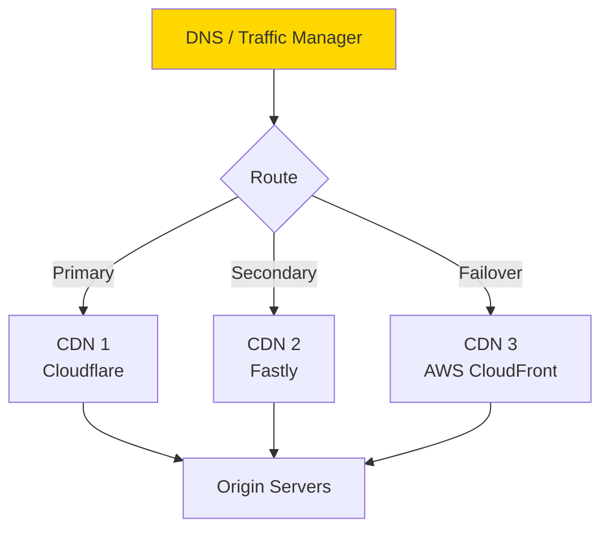

**Benefits:**
- No vendor lock-in
- Better global coverage
- Failover capability
- Cost optimization
- Performance comparison

## Best Practices

1. **Caching Strategy:**
   - Set appropriate TTLs
   - Use cache tags
   - Implement versioning
   - Monitor hit ratio (target: 80%+)

2. **Security:**
   - Always use HTTPS
   - Enable WAF
   - Implement rate limiting
   - Use signed URLs for private content

3. **Performance:**
   - Enable compression (Brotli/Gzip)
   - Use HTTP/2 or HTTP/3
   - Optimize images
   - Minimize origin requests

4. **Monitoring:**
   - Track cache hit ratio
   - Monitor latency (P50, P95, P99)
   - Alert on high error rates
   - Analyze geographic performance

5. **Cost Optimization:**
   - Increase cache hit ratio
   - Use origin shield
   - Compress content
   - Right-size TTLs
   - Consider multi-CDN for arbitrage

6. **Origin Protection:**
   - Restrict access to CDN IPs only
   - Implement rate limiting
   - Use origin shield
   - Configure proper health checks

## Troubleshooting

**Common Issues:**

**1. Low Cache Hit Ratio:**
- Check TTL values
- Verify cache headers
- Look for query string issues
- Review Vary headers

**2. High Latency:**
- Check origin performance
- Verify PoP proximity
- Look for cache misses
- Analyze TCP/SSL handshake

**3. Stale Content:**
- Purge cache
- Check TTL expiration
- Verify Last-Modified headers
- Implement cache invalidation

**4. Origin Overload:**
- Enable origin shield
- Increase TTLs
- Implement rate limiting
- Scale origin servers

## Əlaqəli Mövzular

- Load Balancing
- HTTP/HTTPS Protocols
- Caching Strategies
- DNS and GeoDNS
- DDoS Protection
- Image Optimization
- Video Streaming
- Edge Computing
- Web Performance Optimization
