# WebSocket Protocol

## WebSocket Nədir?

**WebSocket** - client və server arasında full-duplex, real-time, bidirectional communication təmin edən protokoldur.

**Xüsusiyyətlər:**
- Persistent connection
- Low latency
- Two-way communication
- Event-driven
- Less overhead (HTTP-yə nisbətən)
- Browser və server dəstəyi

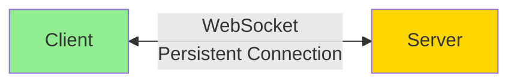

## HTTP vs WebSocket

### HTTP Request-Response

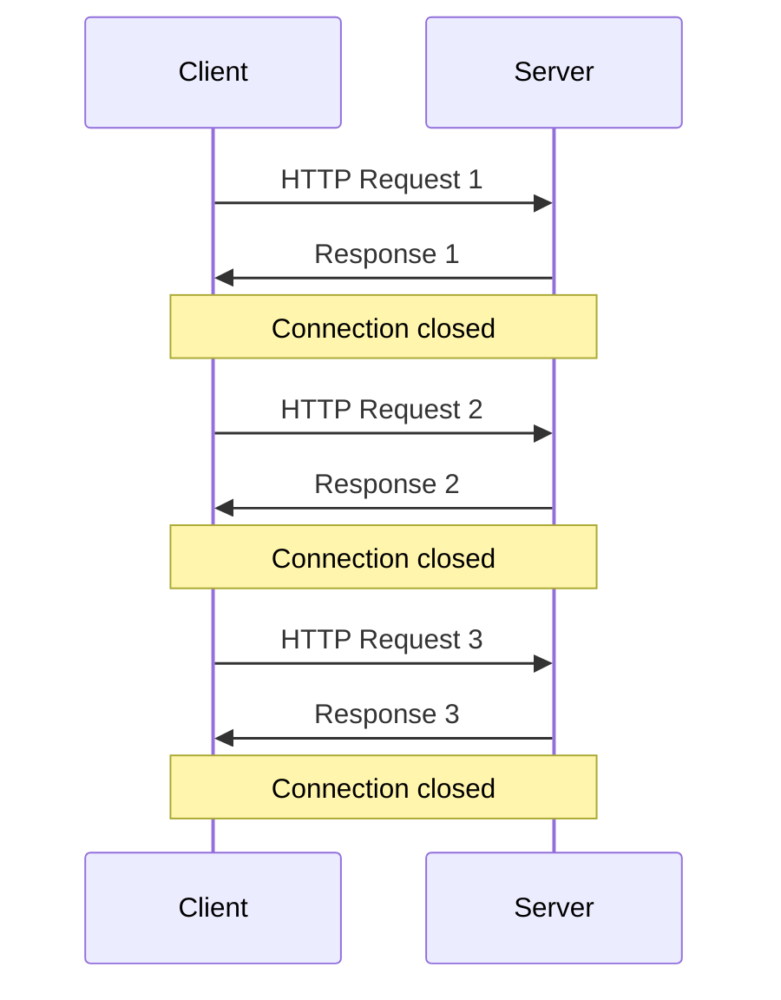

### WebSocket Persistent Connection

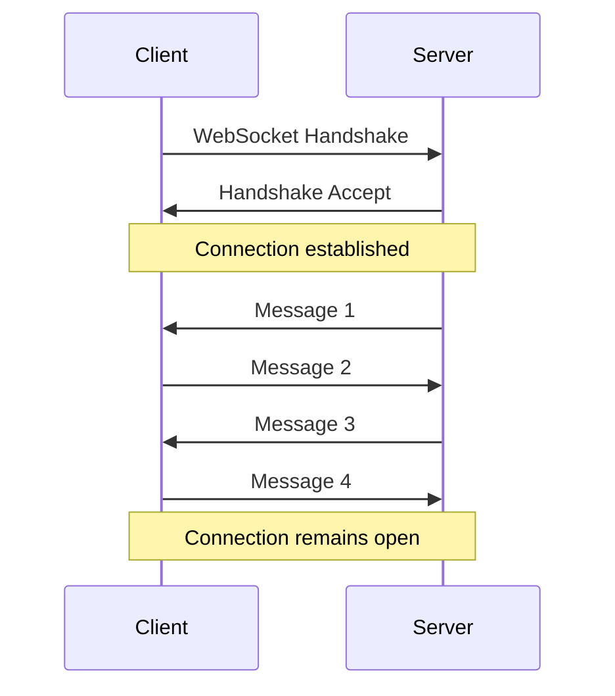

### Comparison Table

| Feature | HTTP | WebSocket |
|---------|------|-----------|
| Connection | Request-Response | Persistent |
| Direction | Unidirectional | Bidirectional |
| Overhead | High (headers hər dəfə) | Low (handshake-dən sonra) |
| Latency | Higher | Lower |
| Real-time | Polling/Long-polling | Native support |
| Protocol | HTTP/1.1, HTTP/2, HTTP/3 | ws://, wss:// |
| Use case | REST APIs, Web pages | Chat, Gaming, Live updates |

## WebSocket Handshake

**WebSocket** HTTP üzərində başlayır və sonra protocol upgrade olunur.

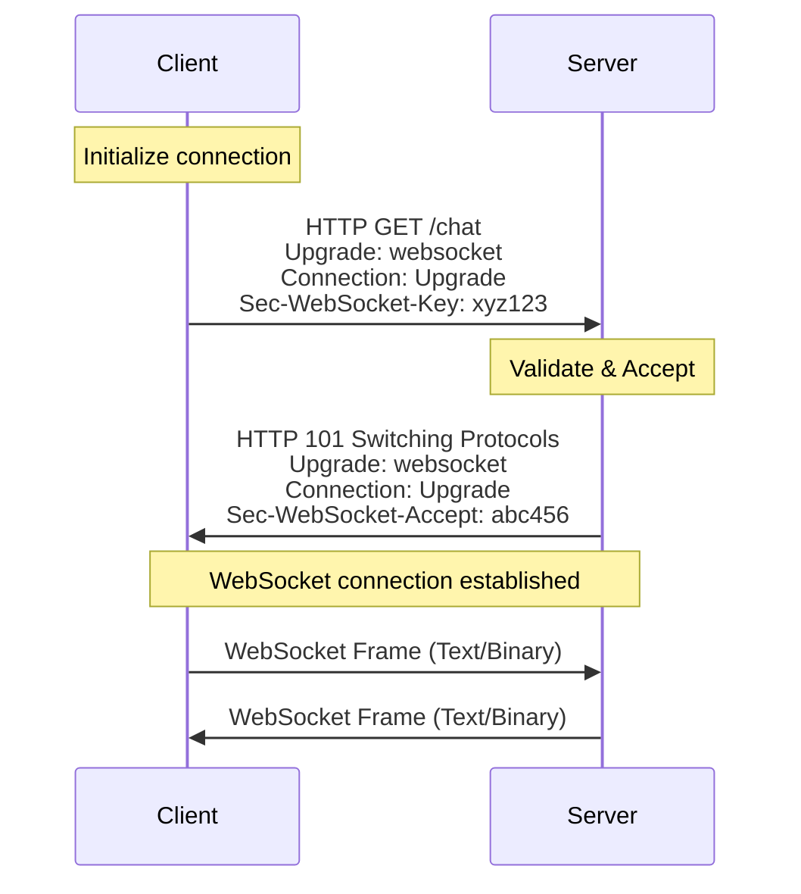

### Handshake Request

```http
GET /chat HTTP/1.1
Host: example.com
Upgrade: websocket
Connection: Upgrade
Sec-WebSocket-Key: dGhlIHNhbXBsZSBub25jZQ==
Sec-WebSocket-Version: 13
Origin: http://example.com
Sec-WebSocket-Protocol: chat, superchat
```

**Headers:**
- **Upgrade: websocket** - Protocol upgrade tələbi
- **Connection: Upgrade** - Connection upgrade
- **Sec-WebSocket-Key** - Random base64 key
- **Sec-WebSocket-Version** - WebSocket protocol versiyası (13)
- **Origin** - Request source
- **Sec-WebSocket-Protocol** - Alt-protokollar (optional)

### Handshake Response

```http
HTTP/1.1 101 Switching Protocols
Upgrade: websocket
Connection: Upgrade
Sec-WebSocket-Accept: s3pPLMBiTxaQ9kYGzzhZRbK+xOo=
Sec-WebSocket-Protocol: chat
```

**Sec-WebSocket-Accept Generation:**
```javascript
// Server-side calculation
const crypto = require('crypto');

function generateAcceptKey(clientKey) {
  const MAGIC_STRING = '258EAFA5-E914-47DA-95CA-C5AB0DC85B11';
  const hash = crypto
    .createHash('sha1')
    .update(clientKey + MAGIC_STRING)
    .digest('base64');
  return hash;
}

// Example
const clientKey = 'dGhlIHNhbXBsZSBub25jZQ==';
const acceptKey = generateAcceptKey(clientKey);
console.log(acceptKey); // s3pPLMBiTxaQ9kYGzzhZRbK+xOo=
```

## WebSocket Frame Structure

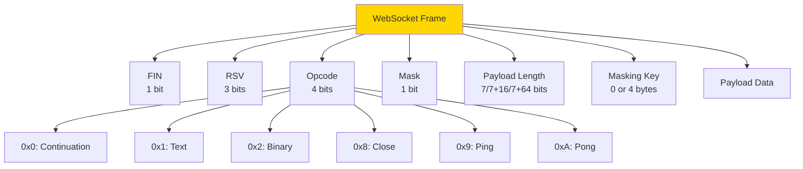

**Frame Components:**
- **FIN** - Final frame indicator (1 = son frame)
- **RSV1-3** - Reserved (extension üçün)
- **Opcode** - Frame type
  - 0x0: Continuation frame
  - 0x1: Text frame
  - 0x2: Binary frame
  - 0x8: Close connection
  - 0x9: Ping
  - 0xA: Pong
- **Mask** - Client-to-server frames masked olmalıdır
- **Payload Length** - Data ölçüsü
- **Masking Key** - Mask = 1 olduqda 4 byte key
- **Payload Data** - Actual data

## Client Implementation

### JavaScript (Browser)

```javascript
// WebSocket connection yaratmaq
const socket = new WebSocket('ws://example.com/chat');

// Connection açıldıqda
socket.addEventListener('open', (event) => {
  console.log('WebSocket connected');
  socket.send('Hello Server!');
});

// Message aldıqda
socket.addEventListener('message', (event) => {
  console.log('Message from server:', event.data);
});

// Error baş verdikdə
socket.addEventListener('error', (error) => {
  console.error('WebSocket error:', error);
});

// Connection bağlandıqda
socket.addEventListener('close', (event) => {
  console.log('WebSocket closed:', event.code, event.reason);
});

// Message göndərmək
function sendMessage(message) {
  if (socket.readyState === WebSocket.OPEN) {
    socket.send(message);
  }
}

// Connection bağlamaq
function closeConnection() {
  socket.close(1000, 'Normal closure');
}
```

### WebSocket Ready States

```javascript
// Connection state-ləri
WebSocket.CONNECTING  // 0 - Connection establishing
WebSocket.OPEN        // 1 - Connection open
WebSocket.CLOSING     // 2 - Connection closing
WebSocket.CLOSED      // 3 - Connection closed

// Check state
if (socket.readyState === WebSocket.OPEN) {
  socket.send('Message');
}
```

### React Example

```jsx
import React, { useEffect, useRef, useState } from 'react';

function ChatComponent() {
  const [messages, setMessages] = useState([]);
  const [input, setInput] = useState('');
  const socketRef = useRef(null);

  useEffect(() => {
    // WebSocket connection
    socketRef.current = new WebSocket('ws://localhost:8080/chat');

    socketRef.current.onopen = () => {
      console.log('Connected to chat server');
    };

    socketRef.current.onmessage = (event) => {
      const message = JSON.parse(event.data);
      setMessages(prev => [...prev, message]);
    };

    socketRef.current.onerror = (error) => {
      console.error('WebSocket error:', error);
    };

    socketRef.current.onclose = () => {
      console.log('Disconnected from server');
    };

    // Cleanup
    return () => {
      socketRef.current?.close();
    };
  }, []);

  const sendMessage = () => {
    if (input && socketRef.current?.readyState === WebSocket.OPEN) {
      const message = {
        text: input,
        timestamp: new Date().toISOString()
      };
      socketRef.current.send(JSON.stringify(message));
      setInput('');
    }
  };

  return (
    <div>
      <div className="messages">
        {messages.map((msg, i) => (
          <div key={i}>{msg.text}</div>
        ))}
      </div>
      <input 
        value={input} 
        onChange={(e) => setInput(e.target.value)}
        onKeyPress={(e) => e.key === 'Enter' && sendMessage()}
      />
      <button onClick={sendMessage}>Send</button>
    </div>
  );
}
```

## Server Implementation

### Node.js (ws library)

```javascript
const WebSocket = require('ws');

// WebSocket server yaratmaq
const wss = new WebSocket.Server({ port: 8080 });

// Connection tracking
const clients = new Set();

wss.on('connection', (ws, req) => {
  console.log('New client connected');
  clients.add(ws);

  // Client info
  const clientIP = req.socket.remoteAddress;
  console.log('Client IP:', clientIP);

  // Message aldıqda
  ws.on('message', (data) => {
    console.log('Received:', data.toString());
    
    // Parse message
    try {
      const message = JSON.parse(data);
      
      // Broadcast to all clients
      broadcast(message);
      
      // Or send to specific client
      ws.send(JSON.stringify({
        type: 'ack',
        message: 'Message received'
      }));
    } catch (error) {
      console.error('Invalid message format');
    }
  });

  // Error handling
  ws.on('error', (error) => {
    console.error('WebSocket error:', error);
  });

  // Connection bağlandıqda
  ws.on('close', (code, reason) => {
    console.log('Client disconnected:', code, reason);
    clients.delete(ws);
  });

  // Ping/Pong (connection alive check)
  ws.isAlive = true;
  ws.on('pong', () => {
    ws.isAlive = true;
  });

  // Welcome message
  ws.send(JSON.stringify({
    type: 'welcome',
    message: 'Welcome to the server!'
  }));
});

// Broadcast function
function broadcast(message) {
  clients.forEach(client => {
    if (client.readyState === WebSocket.OPEN) {
      client.send(JSON.stringify(message));
    }
  });
}

// Heartbeat - connection alive check
const interval = setInterval(() => {
  clients.forEach(ws => {
    if (ws.isAlive === false) {
      clients.delete(ws);
      return ws.terminate();
    }
    
    ws.isAlive = false;
    ws.ping();
  });
}, 30000); // 30 seconds

wss.on('close', () => {
  clearInterval(interval);
});

console.log('WebSocket server running on ws://localhost:8080');
```

### Java (Spring Boot)

```java
import org.springframework.stereotype.Component;
import org.springframework.web.socket.*;
import org.springframework.web.socket.handler.TextWebSocketHandler;

import java.io.IOException;
import java.util.Set;
import java.util.concurrent.CopyOnWriteArraySet;

@Component
public class ChatWebSocketHandler extends TextWebSocketHandler {
    
    private final Set<WebSocketSession> sessions = new CopyOnWriteArraySet<>();

    @Override
    public void afterConnectionEstablished(WebSocketSession session) {
        sessions.add(session);
        System.out.println("New connection: " + session.getId());
        
        // Welcome message
        try {
            session.sendMessage(new TextMessage("Welcome to chat!"));
        } catch (IOException e) {
            e.printStackTrace();
        }
    }

    @Override
    protected void handleTextMessage(WebSocketSession session, TextMessage message) {
        String payload = message.getPayload();
        System.out.println("Received: " + payload);
        
        // Broadcast to all
        broadcast(message);
    }

    @Override
    public void afterConnectionClosed(WebSocketSession session, CloseStatus status) {
        sessions.remove(session);
        System.out.println("Connection closed: " + session.getId());
    }

    private void broadcast(TextMessage message) {
        sessions.forEach(session -> {
            try {
                if (session.isOpen()) {
                    session.sendMessage(message);
                }
            } catch (IOException e) {
                e.printStackTrace();
            }
        });
    }
}
```

### Python (websockets)

```python
import asyncio
import websockets
import json

# Connected clients
clients = set()

async def handle_client(websocket, path):
    # Register client
    clients.add(websocket)
    print(f"New client connected. Total: {len(clients)}")
    
    try:
        # Welcome message
        await websocket.send(json.dumps({
            'type': 'welcome',
            'message': 'Welcome to the server!'
        }))
        
        # Handle messages
        async for message in websocket:
            print(f"Received: {message}")
            
            # Parse and broadcast
            data = json.loads(message)
            await broadcast(data)
            
    except websockets.exceptions.ConnectionClosed:
        print("Client disconnected")
    finally:
        clients.remove(websocket)

async def broadcast(message):
    """Broadcast message to all connected clients"""
    if clients:
        await asyncio.gather(
            *[client.send(json.dumps(message)) for client in clients],
            return_exceptions=True
        )

# Start server
async def main():
    async with websockets.serve(handle_client, "localhost", 8080):
        print("WebSocket server started on ws://localhost:8080")
        await asyncio.Future()  # Run forever

if __name__ == "__main__":
    asyncio.run(main())
```

## Use Cases

### 1. Real-time Chat

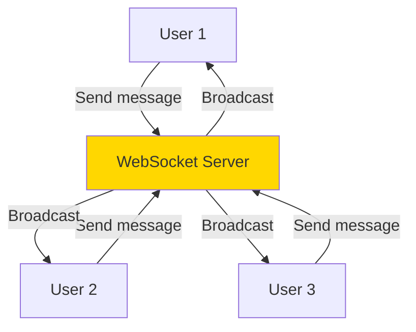

**Features:**
- Instant message delivery
- Online presence
- Typing indicators
- Read receipts

### 2. Live Dashboard

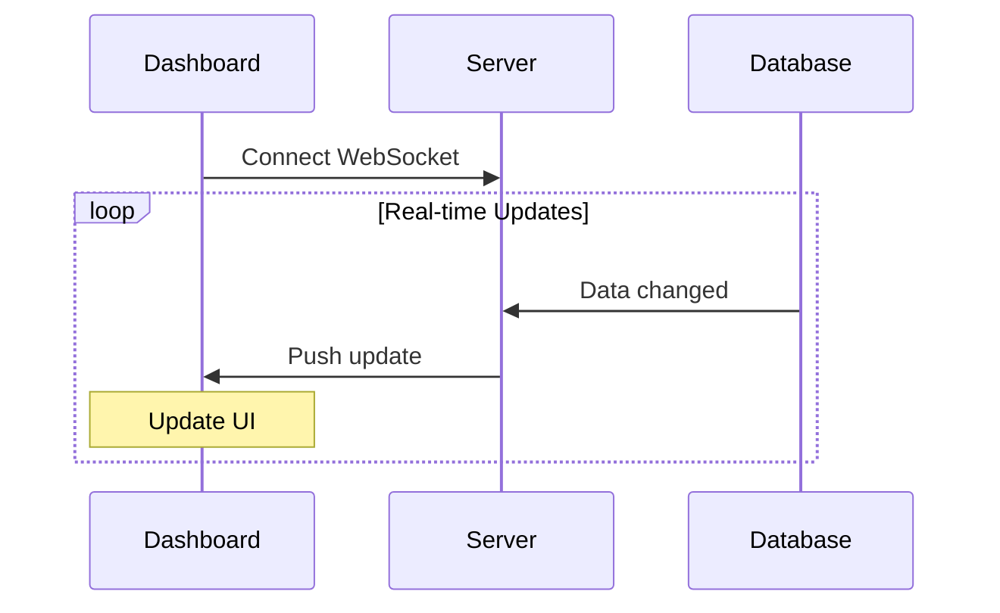

**Use cases:**
- Analytics dashboard
- Stock trading
- IoT monitoring
- System metrics

### 3. Multiplayer Gaming

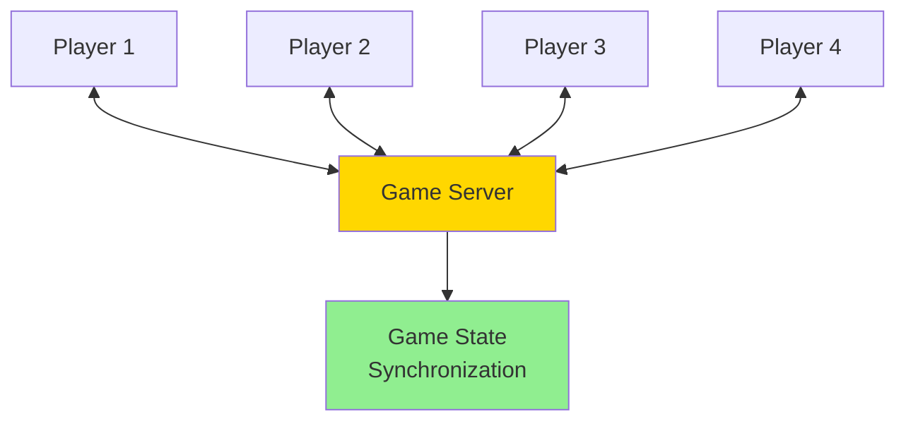

**Requirements:**
- Low latency (< 50ms)
- High frequency updates
- State synchronization
- Conflict resolution

### 4. Collaborative Editing

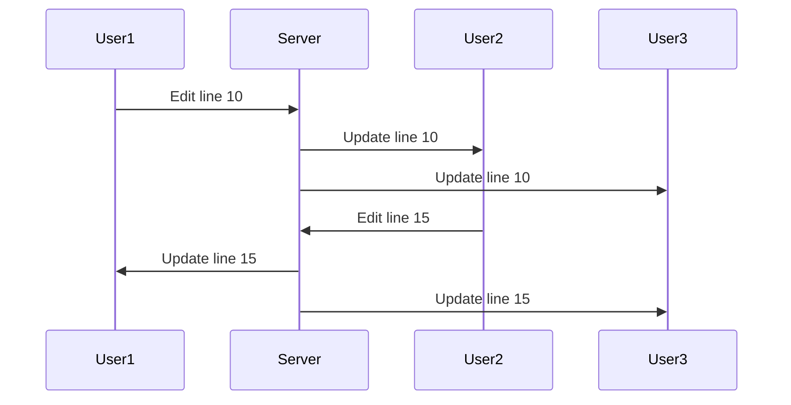

**Examples:**
- Google Docs
- Code editors (VS Code Live Share)
- Design tools (Figma)

### 5. Live Notifications

```javascript
// Notification service
const socket = new WebSocket('wss://api.example.com/notifications');

socket.onmessage = (event) => {
  const notification = JSON.parse(event.data);
  
  // Show browser notification
  if (Notification.permission === 'granted') {
    new Notification(notification.title, {
      body: notification.message,
      icon: notification.icon
    });
  }
  
  // Update UI
  updateNotificationUI(notification);
};
```

## Scaling WebSocket

### Single Server

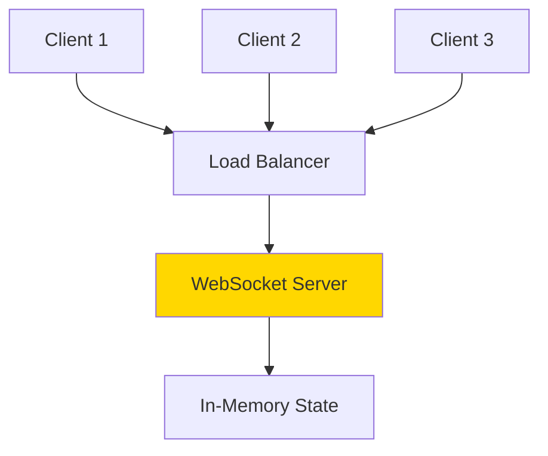

**Limitations:**
- Limited connections (~10K per server)
- Single point of failure
- No horizontal scaling

### Multiple Servers with Redis Pub/Sub

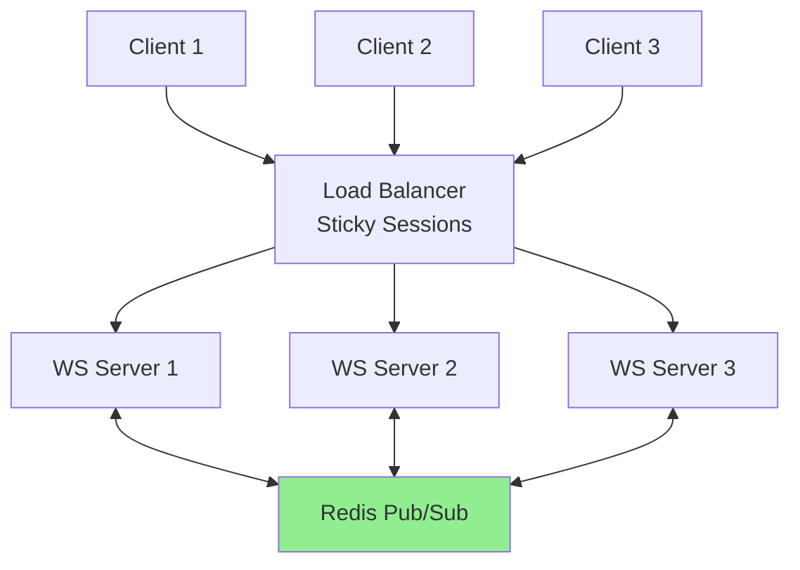

**Implementation:**

```javascript
const redis = require('redis');
const publisher = redis.createClient();
const subscriber = redis.createClient();

// Subscribe to channel
subscriber.subscribe('chat-messages');

// Handle incoming messages from Redis
subscriber.on('message', (channel, message) => {
  const data = JSON.parse(message);
  
  // Broadcast to local clients
  clients.forEach(client => {
    if (client.readyState === WebSocket.OPEN) {
      client.send(message);
    }
  });
});

// When receiving message from client
ws.on('message', (data) => {
  // Publish to Redis (all servers will receive)
  publisher.publish('chat-messages', data);
});
```

### Sticky Sessions (Layer 7 LB)

```nginx
# NGINX configuration
upstream websocket_backend {
    ip_hash;  # Sticky sessions based on IP
    server ws1.example.com:8080;
    server ws2.example.com:8080;
    server ws3.example.com:8080;
}

server {
    listen 80;
    
    location /ws {
        proxy_pass http://websocket_backend;
        proxy_http_version 1.1;
        proxy_set_header Upgrade $http_upgrade;
        proxy_set_header Connection "upgrade";
        proxy_set_header Host $host;
        proxy_set_header X-Real-IP $remote_addr;
        
        # Timeouts
        proxy_read_timeout 3600s;
        proxy_send_timeout 3600s;
    }
}
```

## Connection Management

### Reconnection Strategy

```javascript
class WebSocketClient {
  constructor(url) {
    this.url = url;
    this.reconnectDelay = 1000; // Start with 1 second
    this.maxReconnectDelay = 30000; // Max 30 seconds
    this.reconnectAttempts = 0;
    this.maxReconnectAttempts = 10;
    this.connect();
  }

  connect() {
    this.ws = new WebSocket(this.url);

    this.ws.onopen = () => {
      console.log('Connected');
      this.reconnectDelay = 1000;
      this.reconnectAttempts = 0;
    };

    this.ws.onmessage = (event) => {
      this.handleMessage(event.data);
    };

    this.ws.onerror = (error) => {
      console.error('WebSocket error:', error);
    };

    this.ws.onclose = (event) => {
      console.log('Disconnected:', event.code, event.reason);
      this.reconnect();
    };
  }

  reconnect() {
    if (this.reconnectAttempts >= this.maxReconnectAttempts) {
      console.error('Max reconnection attempts reached');
      return;
    }

    this.reconnectAttempts++;
    
    console.log(`Reconnecting in ${this.reconnectDelay}ms (attempt ${this.reconnectAttempts})`);
    
    setTimeout(() => {
      this.connect();
    }, this.reconnectDelay);

    // Exponential backoff
    this.reconnectDelay = Math.min(
      this.reconnectDelay * 2,
      this.maxReconnectDelay
    );
  }

  send(data) {
    if (this.ws.readyState === WebSocket.OPEN) {
      this.ws.send(JSON.stringify(data));
    } else {
      console.warn('WebSocket not connected');
    }
  }

  handleMessage(data) {
    const message = JSON.parse(data);
    console.log('Received:', message);
  }

  close() {
    this.maxReconnectAttempts = 0; // Prevent reconnection
    this.ws.close();
  }
}

// Usage
const client = new WebSocketClient('ws://localhost:8080');
```

### Heartbeat (Ping/Pong)

```javascript
// Client-side heartbeat
class HeartbeatWebSocket {
  constructor(url) {
    this.url = url;
    this.pingInterval = 30000; // 30 seconds
    this.pongTimeout = 5000; // 5 seconds
    this.connect();
  }

  connect() {
    this.ws = new WebSocket(this.url);

    this.ws.onopen = () => {
      console.log('Connected');
      this.startHeartbeat();
    };

    this.ws.onmessage = (event) => {
      if (event.data === 'pong') {
        this.receivedPong();
      } else {
        this.handleMessage(event.data);
      }
    };

    this.ws.onclose = () => {
      this.stopHeartbeat();
      console.log('Disconnected');
    };
  }

  startHeartbeat() {
    this.heartbeatInterval = setInterval(() => {
      if (this.ws.readyState === WebSocket.OPEN) {
        this.ws.send('ping');
        
        // Set timeout for pong
        this.pongTimeoutId = setTimeout(() => {
          console.warn('No pong received, closing connection');
          this.ws.close();
        }, this.pongTimeout);
      }
    }, this.pingInterval);
  }

  receivedPong() {
    clearTimeout(this.pongTimeoutId);
  }

  stopHeartbeat() {
    clearInterval(this.heartbeatInterval);
    clearTimeout(this.pongTimeoutId);
  }

  handleMessage(data) {
    console.log('Message:', data);
  }
}
```

## Security

### 1. Use WSS (WebSocket Secure)

```javascript
// Always use wss:// in production
const socket = new WebSocket('wss://example.com/chat');
```

```nginx
# NGINX SSL configuration
server {
    listen 443 ssl;
    ssl_certificate /path/to/cert.pem;
    ssl_certificate_key /path/to/key.pem;
    
    location /ws {
        proxy_pass http://websocket_backend;
        proxy_http_version 1.1;
        proxy_set_header Upgrade $http_upgrade;
        proxy_set_header Connection "upgrade";
    }
}
```

### 2. Authentication

```javascript
// Client: Send token in initial message
const socket = new WebSocket('wss://api.example.com/chat');

socket.onopen = () => {
  socket.send(JSON.stringify({
    type: 'auth',
    token: localStorage.getItem('authToken')
  }));
};

// Server: Verify token
ws.on('message', (data) => {
  const message = JSON.parse(data);
  
  if (message.type === 'auth') {
    const isValid = verifyToken(message.token);
    
    if (!isValid) {
      ws.close(4001, 'Unauthorized');
      return;
    }
    
    ws.authenticated = true;
    ws.userId = getUserIdFromToken(message.token);
  } else {
    if (!ws.authenticated) {
      ws.close(4001, 'Not authenticated');
      return;
    }
    
    // Handle message
  }
});
```

### 3. Origin Validation

```javascript
// Server: Check Origin header
wss.on('connection', (ws, req) => {
  const origin = req.headers.origin;
  
  const allowedOrigins = [
    'https://example.com',
    'https://app.example.com'
  ];
  
  if (!allowedOrigins.includes(origin)) {
    ws.close(4003, 'Origin not allowed');
    return;
  }
  
  // Continue with connection
});
```

### 4. Rate Limiting

```javascript
// Rate limiting per connection
const rateLimits = new Map();

ws.on('message', (data) => {
  const clientId = ws.clientId;
  const now = Date.now();
  
  if (!rateLimits.has(clientId)) {
    rateLimits.set(clientId, []);
  }
  
  const timestamps = rateLimits.get(clientId);
  
  // Remove old timestamps (older than 1 minute)
  const recentTimestamps = timestamps.filter(t => now - t < 60000);
  
  if (recentTimestamps.length >= 100) {
    ws.close(4029, 'Rate limit exceeded');
    return;
  }
  
  recentTimestamps.push(now);
  rateLimits.set(clientId, recentTimestamps);
  
  // Process message
});
```

### 5. Input Validation

```javascript
ws.on('message', (data) => {
  try {
    const message = JSON.parse(data);
    
    // Validate message structure
    if (!message.type || !message.payload) {
      ws.send(JSON.stringify({ error: 'Invalid message format' }));
      return;
    }
    
    // Validate payload size
    if (JSON.stringify(message.payload).length > 10000) {
      ws.send(JSON.stringify({ error: 'Payload too large' }));
      return;
    }
    
    // Sanitize input
    message.payload.text = sanitize(message.payload.text);
    
    // Process message
    handleMessage(message);
    
  } catch (error) {
    ws.send(JSON.stringify({ error: 'Invalid JSON' }));
  }
});
```

## Performance Optimization

### 1. Message Batching

```javascript
// Client-side batching
class BatchedWebSocket {
  constructor(url) {
    this.ws = new WebSocket(url);
    this.messageQueue = [];
    this.batchInterval = 100; // 100ms
    
    setInterval(() => {
      this.flush();
    }, this.batchInterval);
  }

  send(message) {
    this.messageQueue.push(message);
  }

  flush() {
    if (this.messageQueue.length === 0) return;
    
    if (this.ws.readyState === WebSocket.OPEN) {
      this.ws.send(JSON.stringify({
        type: 'batch',
        messages: this.messageQueue
      }));
      this.messageQueue = [];
    }
  }
}
```

### 2. Binary Data

```javascript
// Send binary data (more efficient than text)
const buffer = new ArrayBuffer(8);
const view = new DataView(buffer);
view.setInt32(0, 42);
view.setFloat32(4, 3.14);

socket.send(buffer);

// Receive binary data
socket.binaryType = 'arraybuffer';
socket.onmessage = (event) => {
  if (event.data instanceof ArrayBuffer) {
    const view = new DataView(event.data);
    const int = view.getInt32(0);
    const float = view.getFloat32(4);
  }
};
```

### 3. Compression

```javascript
// Server-side compression (permessage-deflate)
const WebSocket = require('ws');

const wss = new WebSocket.Server({
  port: 8080,
  perMessageDeflate: {
    zlibDeflateOptions: {
      chunkSize: 1024,
      memLevel: 7,
      level: 3
    },
    zlibInflateOptions: {
      chunkSize: 10 * 1024
    },
    threshold: 1024 // Compress messages > 1KB
  }
});
```

## Monitoring & Debugging

### Connection Metrics

```javascript
class WebSocketMonitor {
  constructor() {
    this.metrics = {
      totalConnections: 0,
      activeConnections: 0,
      messagesSent: 0,
      messagesReceived: 0,
      bytesReceived: 0,
      bytesSent: 0,
      errors: 0,
      reconnections: 0
    };
  }

  onConnect() {
    this.metrics.totalConnections++;
    this.metrics.activeConnections++;
  }

  onDisconnect() {
    this.metrics.activeConnections--;
  }

  onMessageSent(size) {
    this.metrics.messagesSent++;
    this.metrics.bytesSent += size;
  }

  onMessageReceived(size) {
    this.metrics.messagesReceived++;
    this.metrics.bytesReceived += size;
  }

  onError() {
    this.metrics.errors++;
  }

  onReconnect() {
    this.metrics.reconnections++;
  }

  getMetrics() {
    return {
      ...this.metrics,
      avgMessageSize: this.metrics.bytesReceived / this.metrics.messagesReceived,
      errorRate: this.metrics.errors / this.metrics.totalConnections
    };
  }
}
```

### Browser DevTools

```javascript
// Enable verbose logging
WebSocket.prototype._send = WebSocket.prototype.send;
WebSocket.prototype.send = function(data) {
  console.log('[WS Send]', data);
  this._send(data);
};

WebSocket.prototype._addEventListener = WebSocket.prototype.addEventListener;
WebSocket.prototype.addEventListener = function(type, listener) {
  if (type === 'message') {
    this._addEventListener(type, (event) => {
      console.log('[WS Receive]', event.data);
      listener(event);
    });
  } else {
    this._addEventListener(type, listener);
  }
};
```

## Best Practices

1. **Connection Management:**
   - Implement exponential backoff reconnection
   - Use heartbeat/ping-pong
   - Handle network changes (online/offline)
   - Graceful shutdown

2. **Security:**
   - Always use WSS in production
   - Implement authentication
   - Validate Origin header
   - Rate limiting
   - Input validation and sanitization

3. **Scalability:**
   - Use sticky sessions (IP hash)
   - Redis Pub/Sub for multi-server
   - Message queue for reliability
   - Monitor connection limits

4. **Performance:**
   - Use binary data when possible
   - Enable compression for large messages
   - Batch small messages
   - Lazy loading for large datasets

5. **Error Handling:**
   - Handle all WebSocket events
   - Implement proper error codes
   - Log errors for debugging
   - User-friendly error messages

6. **Testing:**
   - Test reconnection scenarios
   - Simulate network failures
   - Load testing (concurrent connections)
   - Cross-browser testing

## Common Close Codes

| Code | Name | Məna |
|------|------|------|
| 1000 | Normal Closure | Normal bağlanma |
| 1001 | Going Away | Server shutdown və ya client navigate away |
| 1002 | Protocol Error | Protocol error |
| 1003 | Unsupported Data | Qəbul edilməyən data type |
| 1006 | Abnormal Closure | Connection əlaqə olmadan bağlandı |
| 1007 | Invalid Payload | Invalid UTF-8 və ya data format |
| 1008 | Policy Violation | Policy violation |
| 1009 | Message Too Big | Message ölçüsü limit-dən böyük |
| 1011 | Server Error | Server error |
| 4000-4999 | Custom | Application-specific codes |

## Alternatives

### Server-Sent Events (SSE)

**Use case:** Server-to-client yalnız (unidirectional)

```javascript
// Client
const eventSource = new EventSource('/events');

eventSource.onmessage = (event) => {
  console.log('New message:', event.data);
};
```

**WebSocket vs SSE:**
- SSE: Unidirectional, HTTP/2 multiplexing, simpler
- WebSocket: Bidirectional, lower latency, more complex

### Long Polling

**Use case:** Legacy browser support

```javascript
async function longPoll() {
  try {
    const response = await fetch('/poll');
    const data = await response.json();
    handleData(data);
  } catch (error) {
    console.error(error);
  }
  
  // Continue polling
  longPoll();
}
```

**Dezavantajlar:**
- High latency
- High server load
- More bandwidth

## Əlaqəli Mövzular

- HTTP/HTTPS Protocols
- Real-time Communication
- Server-Sent Events (SSE)
- WebRTC
- TCP/IP Protocol
- Load Balancing
- Redis Pub/Sub
- Message Queues
- Microservices Communication
