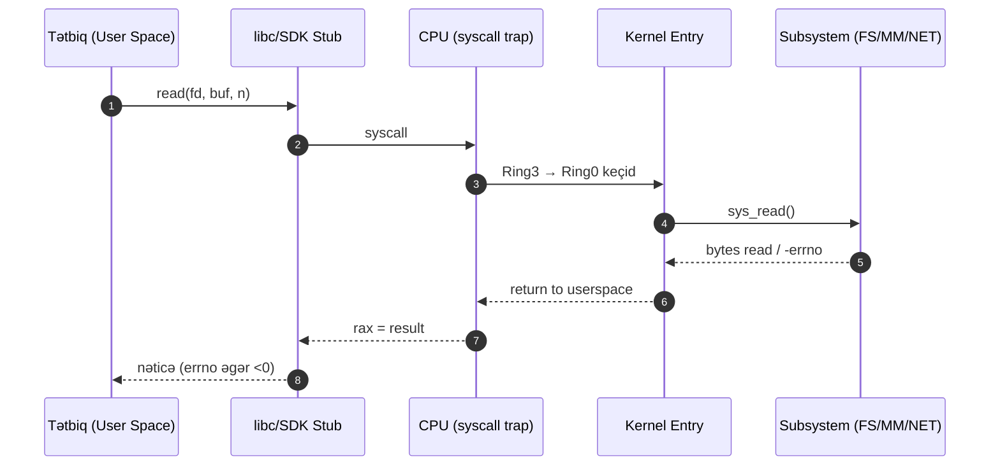

# Operating Systems – Proqramçı perspektivi

Bu bölmə əməliyyat sistemlərini (OS) proqramçı gözü ilə izah edir. Məqsəd: tətbiq kodunun CPU, yaddaş, disk və şəbəkə kimi resurslarla necə qarşılıqlı əlaqədə olduğunu, hansı abstraksiyalardan yararlandığını və performans/etibarlılığı necə optimallaşdıra biləcəyinizi izah etməkdir.

## Böyük şəkil

- Kernel vs User Space:
  - User space: tətbiqinizin kodu burda işləyir; sistem çağırışları (syscall) ilə kerneldən resurs istəyirsiniz.
  - Kernel space: planlaşdırma (scheduling), yaddaş menecmenti, sürücülər (drivers), fayl sistemi və şəbəkə stack.
- Əsas abstraksiyalar:
  - Proseslər və Thread-lər: icra vahidləri.
  - Virtual Yaddaş: hər proses üçün ayrı ünvan məkanı (isolation), səhifələmə (paging).
  - Fayl Sistemi: fayl/direktori, inode, descriptor, permission-lar.
  - I/O: blok/character cihazlar, buffer-lər, async I/O, epoll/kqueue/IOCP.
  - Şəbəkə: socket-lər, TCP/IP stack, kernel-bypass (DPDK), offloading.
- API-lər və ABI:
  - POSIX, Linux syscalls, Windows API (Win32), macOS/Darwin.
  - ABI və çağırış konvensiyaları (x86-64 System V, Windows x64).

## Niyə vacibdir?

- Performans: sistem çağırışlarının qiyməti, kontekst dəyişməsi, cache locality.
- Etibarlılıq: səhv idarəsi (errno/GetLastError), timeouts, resource leak-lərin qarşısı.
- Daşıma (portability): POSIX vs Windows fərqləri; conditional compile, abstraction layers.
- Təhlükəsizlik: permission-lar, capability-lər, sandboxing, selinux/apparmor, seccomp.

## Tipik kod axını

1. Tətbiq istifadəçi inputu/şəbəkə paketini alır.
2. İş yükü thread-lər arasında bölünür (pool).
3. Kernel scheduler CPU vaxtını verir; bloklanan I/O epoll/kqueue vasitəsilə siqnalizə olunur.
4. Virtual yaddaş meneceri səhifələri RAM-a/Swap-a xəritələyir; page fault baş verə bilər.
5. Fayl sistemi disk sürücüləri ilə DMA vasitəsilə I/O həyata keçirir; buffer cache.

## Alətlər

- strace/dtruss/truss: syscall izləmə
- ltrace: kitabxana çağırışları
- perf, eBPF/bpftrace, ftrace: performans/profiling
- vmstat, iostat, mpstat, sar: sistem mət­rikləri

Bu bölmənin qalan hissələrində hər əsas mövzu ayrıca sənəddə praktiki nümunələrlə izah edilir.

## Daxili İş Prinsipləri (Internals)

- Privilege rings və keçid:
  - Müasir x86-64 sistemlərdə istifadəçi kodu Ring 3-də, kernel isə Ring 0-da icra olunur.
  - Syscall zamanı CPU ring dəyişir: `syscall/sysenter` təlimatları LSTAR/STAR MSR-lərinə yazılmış entry nöqtəsinə hoplayır.
  - Trap (synchronous) vs Interrupt (asynchronous): trap — e.g., syscall, page fault; interrupt — e.g., timer/NIC.
- Kontekst dəyişikliyi (context switch):
  - Cari thread-in registrləri və bir az metadata (rip, rsp, rflags…) kernel stack-da saxlanır.
  - Scheduler növbəti runnable task-ı seçir və onun kontekstini bərpa edir.
  - TLB və cache-lərin re-use vəziyyətinə görə keçidin qiyməti dəyişir; eyni address space-də (thread) daha ucuzdur.
- Syscall yolunun qısa xülasəsi:
  1) App → libc stub (`read`, `write`, …)
  2) ASM wrapper → `syscall` təlimatı
  3) Kernel entry → syscall nömrəsinə görə dispatcher
  4) Subsystem handler (fs, net, mm, sched)
  5) Nəticə `rax` ilə geri qaytarılır, errno map edilir.

### Performans və Praktika
- Syscall-ları batch edin (məs., `readv`, `writev`, `recvmmsg`).
- Zaman ölçümü üçün vDSO (`clock_gettime`) kernelə keçidi azaldır.
- IPC/IO üçün eyni poll mexanizminə (epoll/kqueue/IOCP) birləşmə kontekst dəyişikliyini azalda bilər.

### Observability
- `strace -f -tt -T` syscall latency üçün; `perf record/report` hot path-ları görmək üçün.
