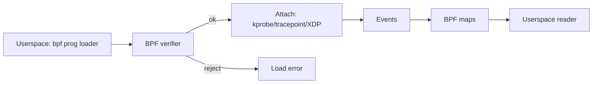

# Monitorinq və Tracing

Sistem davranışını anlamaq üçün metrik toplanması (monitoring) və hadisə səviyyəsində izləmə (tracing) lazımdır. Bu alətlər prod mühitdə kök səbəb analizi üçün vacibdir.

## Klassik alətlər

- /proc və /sys: proses və kernel vəziyyəti; `/proc/$PID/fd`, `/proc/$PID/smaps`.
- vmstat, iostat, mpstat, sar: CPU, yaddaş, disk metrikləri.
- top/htop, atop, dstat: ümumi görünüş.

## Tracing

- strace: syscall-ları izləyin; latency və EAGAIN səbəblərini görün.
- ltrace: dinamik kitabxana çağırışları.
- ftrace: kernel funksiyalarını izləmə; function_graph.
- eBPF/bpftrace: aşağı overhead ilə runtime proqramlaşdırıla bilən tracing.

```bash
# perf + flamegraph nümunəsi (Linux)
perf record -F 99 -p $PID -g -- sleep 30
perf script | stackcollapse-perf.pl | flamegraph.pl > flame.svg
```

## Windows və macOS

- ETW (Windows), Xperf/WPA; Perf Counters.
- DTrace (illik) və Instruments (macOS) ilə tracing.

## Praktika

- Ölç, sonra optimizə et: hipotez→ölçüm→dəyişiklik→yenidən ölçüm.
- Tracing-i qısa müddət aktiv saxlayın; prod overhead-ni nəzarətdə tutun.
- Ehtiyac olduqda sampling tezliyini azaldın; statistiki dəqiqlik vs overhead balansı.

## Internals (perf/eBPF/ftrace)

- perf events:
  - Hardware counters (PMU), software events, tracepoints; `perf_event_open` syscal-lı ilə konfiqurasiya.
  - Sampling vs counting; callchain toplama (frame-pointer və ya DWARF)
- ftrace:
  - `function`/`function_graph` tracer-ləri; dinamik kprobe/uprobelərlə genişlənir.
- eBPF:
  - eBPF proqramları kernelə yüklənir (verifier təhlükəsizlik yoxlaması), map-lər vasitəsilə userspace ilə data mübadiləsi edir.
  - Attach nöqtələri: kprobe/kretprobe, tracepoint, uprobes, XDP, tc, socket filter.
  - CO-RE (Compile Once, Run Everywhere) — BTF metadatası ilə müxtəlif kernel versiyalarında işləmə.



### Praktika və Observability
- `perf stat/record`, `perf sched timehist`, `perf c2c` kimi alətlərdən faydalanın.
- eBPF üçün `bcc` və `bpftrace` skriptləri ilə tez diaqnostika; CO-RE üçün libbpf + bpftool.
- Çıxışların doğruluğu üçün sampling tezliyini və overhead-i tənzimləyin; prod mühitdə qısa müddətli tracing.
