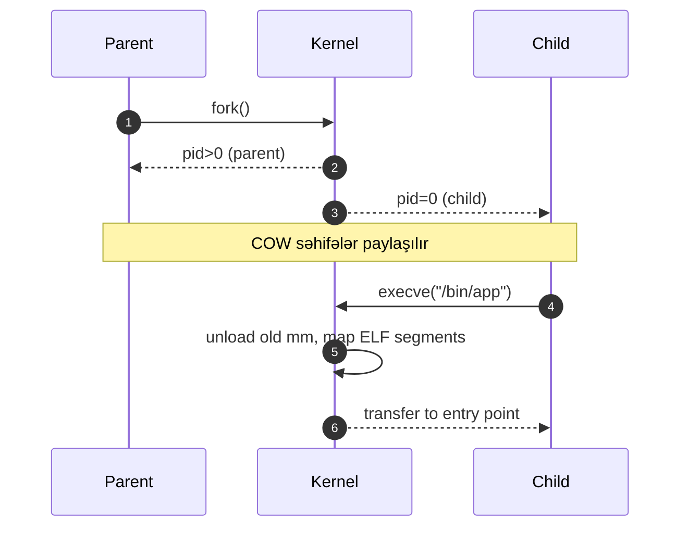

# Proseslər və Thread-lər

Proses — özünə məxsus virtual yaddaş məkanı, açıq fayl deskriptorları və resursları olan icra vahididir. Thread — eyni prosesin daxilində paylaşılmış yaddaşda paralel icra axınıdır.

## Əsas anlayışlar

- PID/TID: proses və thread identifikatorları.
- fork/exec (POSIX): yeni proses yaratma və proqramı dəyişdirmə.
- CreateProcess (Windows): proses yaratma API-si.
- Context Switch: CPU-nun icranı bir kontekstdən başqasına keçirməsi; cache/TLB invalidation qiymətlidir.
- User vs Kernel Thread-ləri: N:1, 1:1, M:N modelləri.

## Praktik nümunə (POSIX C)

```c
#include <unistd.h>
#include <sys/types.h>
#include <stdio.h>

int main() {
  pid_t pid = fork();
  if (pid == 0) {
    execlp("echo", "echo", "salam", NULL);
  } else {
    printf("Child pid=%d\n", pid);
  }
}
```

## Thread-lər (pthreads)

```c
#include <pthread.h>
#include <stdio.h>

void* worker(void* arg){
  printf("Thread: %s\n", (char*)arg);
  return NULL;
}

int main(){
  pthread_t t;
  pthread_create(&t, NULL, worker, "iş");
  pthread_join(t, NULL);
}
```

## Praktik məsləhətlər

- Bloklayan I/O üçün thread pool; CPU-bound üçün işləri dilin runtime scheduler-i ilə balanslaşdırın.
- Proses izoliyasiyası təhlükəsizlik üçün güclüdür; plugin-ləri ayrı prosesdə saxlayın.
- Zombi proseslərin qarşısını almaq üçün wait()/WaitForSingleObject istifadə edin.

## Internals (Daxili strukturlar)

- Linux task_struct/PCB:
  - `task_struct`: PID/TID, prioritet, `se.state`, `se.vruntime`, `mm` (yaddaş xəritələri), `files` (fd table), `cred` (uid/gid/capabilities), cgroup/namespace pointer-ləri.
  - Thread-lər eyni `mm` (address space), `files`, `fs` (cwd/umask) bölüşür; yalnız registr konteksti, stack və TID fərqlidir.
- Proses vəziyyətləri:
  - RUNNING, INTERRUPTIBLE/UNINTERRUPTIBLE sleep (I/O), STOPPED, ZOMBIE.
  - Runqueue-lar: hər CPU-da ayrıca runqueue; load balancing periodik işləyir.
- Kontekst dəyişikliyi (switch):
  - `switch_to(prev, next)` registrləri saxlayır/bərpa edir; kernel stack pointer-i dəyişir.
  - User→Kernel keçidində ayrı kernel stack istifadə olunur (each thread üçün).

### fork/exec axını
- fork(): `copy_process()` parent-in `task_struct`-unun nüsxəsini yaradır; səhifələr COW olaraq paylaşılır.
- execve(): address space sıfırlanır, ELF header oxunur, `mmap` ilə segmentlər (PT_LOAD) xəritələnir, stack hazırlanır, entry point-ə (e_entry) hoppanılır.



### Observability və Praktika
- `/proc/<pid>`: `stat`, `status`, `maps`, `sched` faylları ilə vəziyyəti izləyin.
- `perf sched record|latency`, `pidstat -t`, `top/htop` ilə runqueue və CPU paylanmasını görün.
- `pthread_setname_np`, `procname` verərək diaqnostikanı asanlaşdırın.
- `waitpid`/`WaitForSingleObject` çağırmadan zombie-lər qalır; hər child üçün wait.
