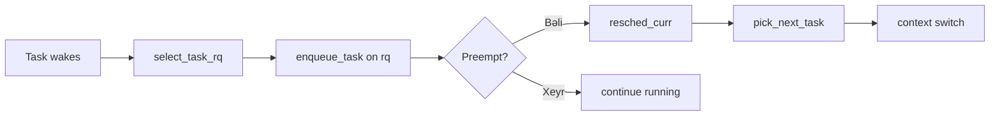

# CPU Planlaşdırma (Scheduling)

Scheduler proses və thread-lərə CPU vaxtını bölüşdürür. Proqramçı olaraq iş yükünüzün gecikmə (latency) və throughput tələblərinə uyğun scheduling siyasətlərindən istifadə etməlisiniz.

## Siyasətlər

- CFS (Linux): ədalətli paylanma; nice dəyəri ilə təsir edin.
- FIFO/RR (real-time): deterministik gecikmələr; diqqət — sistem stabilliyinə təsir edə bilər.
- Windows: Dynamic priority, background/foreground boost.

## Parametrlər

- Priority/Niceness: `nice`, `setpriority`, `chrt` (Linux).
- CPU Affinity: `sched_setaffinity`/`SetThreadAffinityMask` — cache locality yaxşılaşa bilər.
- cgroups (v1/v2): CPU kvotaları (`cpu.max`), shares, cpuset-lər.

## Praktik məsləhətlər

- Latency-kritik işlər üçün RT siyasətlərini yalnız dar kritik hissələrdə aktiv edin.
- Affinity ilə thread-ləri NUMA node-lara yaxın saxlayın.
- Background işləri üçün aşağı priority təyin edin; interaktiv işlərin cavab vaxtı yaxşılaşır.

## Internals (Daxili mexanizm)

- Sched classes:
  - `CFS` (Fair): interaktiv işlər üçün; qırmızı-qara ağacda `vruntime` üzrə sıralama.
  - `RT` (FIFO/RR) və `DL` (deadline) öz runqueue-ları ilə CFS-dən üstün prioritetdədir.
- Runqueue-lar:
  - Hər CPU-da ayrıca `rq`; CFS üçün RB-tree (`cfs_rq`) və `min_vruntime` saxlanır.
  - Wakeup zamanı task öz CPU-suna və ya daha uyğun CPU-ya enq-queue edilir (select_task_rq).
- `vruntime`:
  - Real vaxt zəiflədiilmiş CPU vaxtıdır (nice/weights təsiri ilə); ən kiçik `vruntime` seçilir.
- Load balancing:
  - Periodik `sched_balance` daha yüklü CPU-dan az yüklüyə task köçürür (NUMA/affinity limitləri daxilində).
- Context switch:
  - `pick_next_task()` → `switch_to(prev,next)`; CPU local cache-lərin isti qalması üçün affinity vacibdir.
- Cgroups v2:
  - `cpu.max`, `cpu.weight`, `cpuset.cpus` ilə izolyasiya; hər cgroup üçün ayrıca runqueue iyerarxiyası.

### Observability və Praktika
- `schedstat`, `/proc/sched_debug`, `perf sched timehist/latency` ilə gecikmələri ölçün.
- Təməl qayda: locality qoruyun — `sched_setaffinity`/`taskset` ilə NUMA node-lara yaxın.
- RT siyasətlərini minimal sahədə aktivləşdirin; prioritet inversiyasına qarşı `pthread_mutexattr_setprotocol(PRIO_INHERIT)` istifadə edin.
