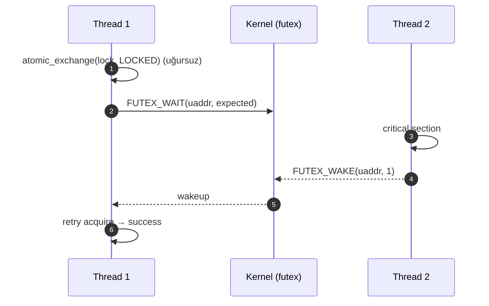

# Concurrency və Sinxronizasiya

Çox thread-li proqramlarda paylaşılan resurslara eyni vaxtda giriş data race və deadlock riskləri yaradır. OS və runtime-lar sinxronizasiya primitivləri təqdim edir.

## Primitivlər

- Mutex: qarşılıqlı istisna, kritik bölməni qoruyur.
- RWLock: oxu-ayrıca, yazı-eks. Oxu üstünlük təşkil edirsə faydalıdır.
- Semaphore: sayğac əsaslı giriş nəzarəti.
- Condition Variable: gözləmə/oyatma (wait/notify).
- Futex (Linux): fast userspace mutex — contention olmadıqda kernel-ə keçmədən.
- Atomics: lock-free əməliyyatlar; C++ std::atomic, Rust atomics.

## Yaddaş modeli

- Acquire/Release, SeqCst — kompilyator və CPU reorder optimizasiyalarına qarşı zəmanətlər.
- Data race olmadan lock-free dizaynlar üçün doğru atomik ardıcıllıq seçimi vacibdir.

## Praktika

- Qısa kritik bölmələr, contention-u azaldın.
- False sharing-i azaltmaq üçün cache-line hizalaması (alignment) istifadə edin.
- Deadlock qarşısı: kilidləmə sırasını sabit saxlayın; timeouts.
- RCU (Read-Copy-Update) oxu-ağır workloadlar üçün.

## Internals (Futex və kilidlər)

- Futex nədir?
  - Fast Userspace muTEX: konflikt yoxdursa user-space CAS/spin ilə kilidlənir; yalnız contention olduqda kernelə futex syscall edilir.
  - Futex açarı user-space ünvanıdır (uaddr). Kernel bu ünvanı hash edib `futex_q` gözləmə siyahısına qoşur.
- Tipik mutex yolu (pthreads):
  - uncontended: `atomic_exchange` → uğurlu → kritik bölmə.
  - contended: `FUTEX_WAIT` (timeout ola bilər) → oyanışda `FUTEX_WAKE` ilə davam.
- Priority inheritance (PI):
  - `PTHREAD_PRIO_INHERIT` ilə yüksək prioritetli oczblock olmuş thread-in prioriteti kilidi saxlayana “mirasa” verilir; `FUTEX_LOCK_PI`/`FUTEX_UNLOCK_PI` daxildə istifadə oluna bilər.
- RWLock strategiyaları:
  - Oxu üstünlük verilməsi starvation yarada bilər; fairness üçün writer-preferred və ya time-sliced siyasət.
- Memory ordering:
  - Mutex/condvar əməliyyatları acquire/release baryerləri yaradır; lock-free strukturlarda `std::memory_order` seçimi kritikdir.

### Observability
- `perf lock record/report`, `ftrace` (function_graph) ilə contended kilidləri tapın.
- `bcc/tools/lockstat.py`, `evals/ebpf` skriptləri futex gözləmələrini çıxara bilər.
- `/proc/locks` yalnız kernel file locks üçündür; user-level mutex-lər üçün tracing lazımdır.

### Praktika
- Qısa kritik bölmələr və mümkün olduqda sharded locks.
- Read-heavy işlərdə RCU və ya sequence lock (seqlock) kimi pattern-lər.
- Async siqnallarda yalnız async-signal-safe funksiyalar; siqnal handler-də sadəcə flag/pipe yazın.
