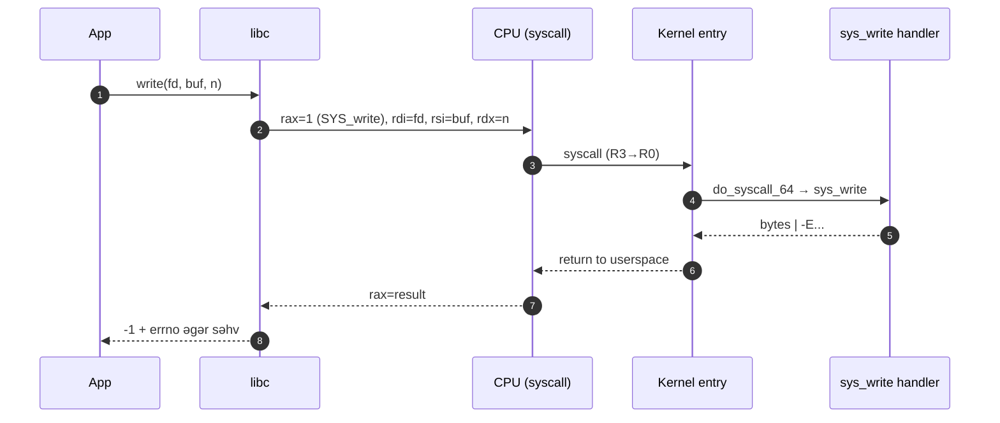

# Sistem Çağırışları və ABI

User space kodu resurslara kernel vasitəsilə sistem çağırışları ilə müraciət edir. ABI (Application Binary Interface) — funksiyaların çağırılma qaydaları, register/stack istifadəsi, name mangling və s. qaydaları müəyyən edir.

## Syscall yolu

- glibc/musl (Linux) və ya sistem kitabxanası user API-si təqdim edir.
- Keçid mexanizmləri: `syscall/sysenter` (x86-64), `svc` (ARM64); tarixi `int 0x80`.
- vDSO: bəzi funksiyalar (məs., `clock_gettime`) kernel-dən user space-ə xəritələnmiş stub vasitəsilə sürətləndirilir.

## POSIX və Windows fərqləri

- POSIX: `open/read/write/close`, `poll/epoll`, `fork/execve`.
- Windows: Win32 API → NT Native API (`NtCreateFile` və s.) üst qatıdır.
- Səhvlər: `errno` (POSIX) vs `GetLastError()` (Windows).

## Çağırış konvensiyaları

- System V AMD64 ABI: ilk 6 arqument register-lərdə (RDI, RSI, RDX, RCX, R8, R9).
- Windows x64: RCX, RDX, R8, R9; stack alignment qaydaları fərqlidir.

## Dinamik linkləmə

- ELF + PLT/GOT (Linux), PE (Windows), Mach-O (macOS).
- Lazy binding: ilk çağırışda həll; `LD_BIND_NOW=1` ilə deaktiv etmək mümkündür.

## Praktika

- Syscall-ları azaltmaq üçün batch/larger buffers; `sendfile`, `splice`, `mmap` istifadə edin.
- Portability üçün nazik abstraction layer yazın; conditionals (`#ifdef _WIN32`).

## Internals (Syscall və ABI detalları)

- Linux x86-64 syscall çağırış konvensiyası:
  - `rax` — syscall nömrəsi; arqumentlər: `rdi`, `rsi`, `rdx`, `r10`, `r8`, `r9`; nəticə `rax`.
  - `syscall` təlimatı Ring3→Ring0 keçidi edir; `swapgs` sonrası `gs` base dəyişimi (per-cpu data üçün).
  - Entry nöqtələri: `entry_SYSCALL_64` → `do_syscall_64` → `sys_*` handler.
- ARM64:
  - `svc #0` trap; `x8` syscall nömrəsi; `x0..x5` arqumentlər.
- vDSO:
  - `clock_gettime`, `getcpu` kimi çağırışlar üçün kernelin user-space xəritələdiyi səhifə üzərindən stub.
- Errno xəritələnməsi:
  - Kernel mənfi error kodlarını (`-EAGAIN`) qaytarır, libc bunu `-1` + `errno=EAGAIN` şəklində map edir.
- Dinamik linkləmə yolu (ELF):
  - `call plt@plt` → PLT giriş → GOT yoxlanır → `ld.so`-nun resolver-i simvolu həll edib GOT-a yazır.

### Praktika və Observability
- `strace -yy -f` ilə fd-lərin path-larını da görün; `perf trace` daha az overhead ilə.
- PLT/GOT gecikmələrindən qaçmaq üçün isti yollar üçün `-Wl,-z,now` test edin.
- Syscall sayını azaltmaq üçün `readv/writev`, `sendmmsg/recvmmsg`, `io_uring`.
